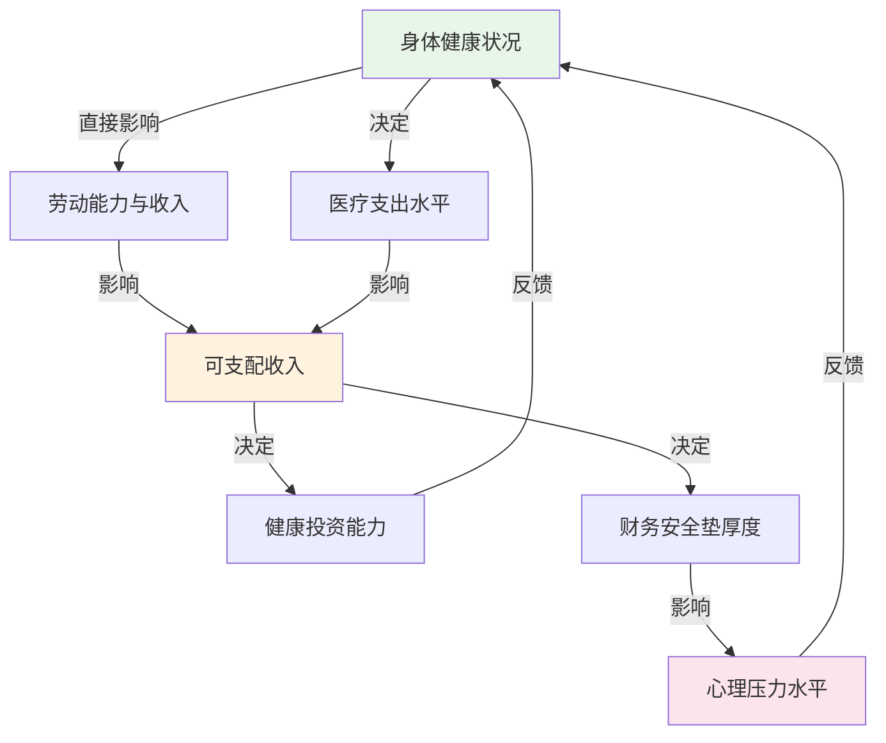
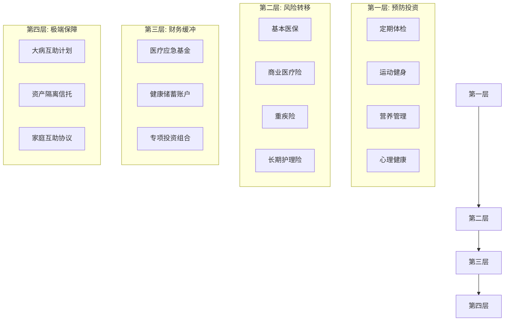
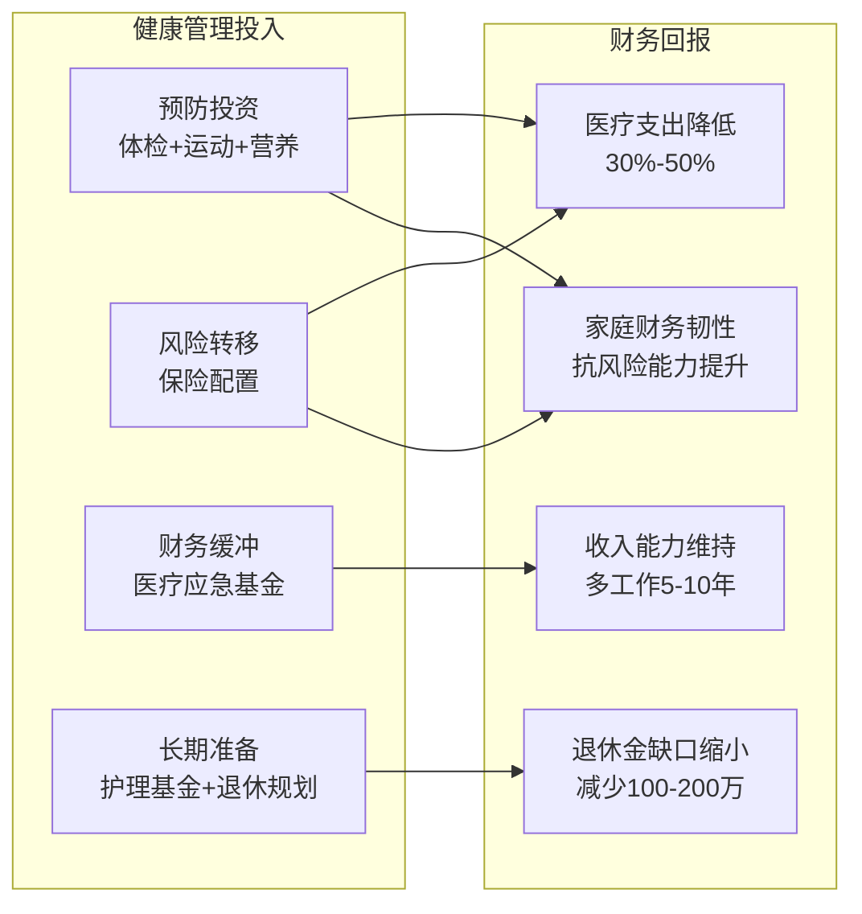

## 六、健康管理与财务规划的关系

40-50岁是人体从"黄金期"向"衰退期"过渡的关键十年。世界卫生组织的数据显示，人类在40岁之后，慢性病发病率每年递增约3%-5%，而医疗支出的增速往往远超收入增速。这一阶段，健康不再只是"身体好不好的问题"，而是直接影响家庭财务安全的核心变量。理解健康与财务之间的深层关联，是构建稳健期财务规划的基石。

### 1. 健康与财务的双向因果模型

健康和财务之间不是简单的线性关系，而是一个相互影响的双向回路。



**正向循环**：健康良好 → 工作能力充沛 → 收入稳定增长 → 有余力投资健康（体检、运动、营养）→ 健康持续良好。

**负向循环**：健康恶化 → 收入下降或中断 → 医疗支出激增 → 削减健康投资 → 健康进一步恶化 → 财务崩溃。

40-50岁的核心任务，就是通过主动规划打破负向循环的可能性，强化正向循环的韧性。

### 2. 医疗支出的生命周期规律

#### 2.1 医疗支出的J型曲线

人类一生的医疗支出并非均匀分布，而是呈现明显的J型曲线：幼年期较高，青壮年期降至低谷，40岁之后开始陡峭上升。

| 年龄段 | 年均医疗支出（估算） | 主要支出类型 | 占家庭收入比 |
|--------|---------------------|-------------|-------------|
| 20-30岁 | 3,000-5,000元 | 急性病、意外 | 2%-5% |
| 30-40岁 | 5,000-10,000元 | 慢性病初现、生育 | 5%-8% |
| 40-50岁 | 10,000-30,000元 | 慢性病管理、早期筛查 | 8%-15% |
| 50-60岁 | 20,000-60,000元 | 慢性病加重、手术 | 15%-25% |
| 60岁以上 | 30,000-100,000元+ | 重大疾病、康复护理 | 25%-50%+ |

**关键洞察**：40-50岁是医疗支出从"可忽略"转向"显著"的拐点期。如果在这个阶段没有建立医疗财务缓冲，50岁之后将面临巨大的财务压力。

#### 2.2 隐性健康成本

除了直接的医疗账单，健康问题还带来大量隐性成本，这些成本往往被严重低估：

**收入损失成本**：一场大病导致的误工，不仅是病假期间的工资损失，还可能包括职位被替代、晋升机会丧失、客户流失等连锁反应。根据中国社科院的调查数据，重大疾病患者平均收入恢复期为18-24个月，期间收入下降40%-70%。

**家庭照护成本**：当家庭成员生病，配偶或子女往往需要减少工作时间来照护。这种"隐性劳动力转移"的经济价值，按家政服务市场价格计算，每月可达5,000-15,000元。

**心理成本与决策质量下降**：长期健康焦虑会显著影响财务决策质量。行为金融学研究表明，处于健康压力下的个体，风险厌恶程度会异常升高或降低，导致投资决策偏离理性轨道。

**社交成本**：慢性病患者往往减少社交活动，这不仅影响心理健康，还可能削弱职业网络，间接影响职业发展和商业机会。

#### 2.3 医疗通胀：比CPI更凶猛的物价上涨

医疗领域的通胀率长期高于一般消费品通胀率。中国的医疗CPI年均涨幅约为4%-6%，而高端医疗服务（如私立医院、进口药物、海外就医）的涨幅更高，达到8%-12%。

这意味着：今天需要30万元的手术，10年后可能需要50-60万元，20年后可能需要80-100万元。财务规划必须将医疗通胀作为独立的变量来计算，而不是简单套用一般通胀率。

### 3. 健康管理的财务框架

#### 3.1 四层防御体系

将健康管理纳入财务规划，需要建立四层防御体系：



**第一层——预防投资（成本最低，回报最高）**：

预防医学的研究结论非常明确：在预防上每投入1元，可以在治疗上节省6-8元。40-50岁阶段的预防投资包括：

- **年度深度体检**：不是走过场的单位体检，而是针对40+人群的专项筛查（胃肠镜、低剂量螺旋CT、肿瘤标志物、心脑血管评估等）。费用约2,000-5,000元/年，但可以将重大疾病发现时间提前2-3年，大幅提高治愈率并降低治疗费用。

- **规律运动**：每周150分钟中等强度有氧运动+2次力量训练。经济账很好算——健身房年卡3,000-6,000元，运动装备2,000元/年，总投入不超过1万元/年。而缺乏运动导致的心血管疾病，单次治疗费用就在10-50万元。

- **营养管理**：40岁后代谢率每十年下降3%-5%，需要调整饮食结构。不需要购买昂贵的保健品，而是合理搭配膳食，控制热量摄入，增加蛋白质和膳食纤维比例。如果需要专业营养师指导，年费用约3,000-8,000元。

- **心理健康投入**：心理咨询、压力管理课程、冥想练习等。40-50岁面临"上有老下有小"的夹心层压力，心理健康问题的发生率显著上升。定期心理咨询费用约300-800元/次，每月1-2次即可。

**第二层——风险转移（用确定的小额支出对冲不确定的大额损失）**：

保险的核心逻辑是将个人无法承受的巨额医疗费用，转移给保险公司来承担。40-50岁是配置健康类保险的最后窗口期（50岁后保费飙升且核保严格），必须在此阶段完成核心保障配置。

**第三层——财务缓冲（自留风险的承受能力）**：

即使有保险，仍然存在免赔额、自费药、康复费用等不被覆盖的支出。需要专门建立医疗应急基金。

**第四层——极端保障（灾难性医疗事件的最后防线）**：

针对极端情况（如需要终身护理的疾病、罕见病等），通过资产隔离和社会互助机制来保护家庭核心资产不被全部消耗。

#### 3.2 健康保险配置策略

40-50岁的保险配置需要精准规划，既不能保障不足，也不能过度投保浪费保费。

| 险种 | 核心作用 | 40-50岁建议保额 | 年缴保费参考 | 优先级 |
|------|---------|----------------|-------------|--------|
| 基本医保 | 基础保障 | — | 单位代缴 | 必备 |
| 百万医疗险 | 大额住院费用报销 | 200-400万 | 800-2,000元 | ★★★★★ |
| 重疾险 | 收入补偿+康复费用 | 50-100万 | 8,000-20,000元 | ★★★★★ |
| 意外险 | 意外伤害保障 | 100万 | 300-600元 | ★★★★ |
| 定期寿险 | 家庭责任保障 | 100-300万 | 3,000-8,000元 | ★★★★ |
| 长期护理险 | 失能照护保障 | 5,000元/月 | 3,000-6,000元 | ★★★ |
| 齿科/眼科险 | 日常高频需求 | — | 500-1,500元 | ★★ |

**配置顺序原则**：

1. 先保障后理财——先把保障型保险配齐，再考虑储蓄型/返还型产品
2. 先大人后小孩——家庭经济支柱的保障优先级最高
3. 先保额后保费——保额充足是第一要务，在预算内选择最优方案
4. 先高频后低频——住院医疗险（使用频率高）优先于重疾险（使用频率低但损失大）

**40-50岁投保的特殊考量**：

- **体检异常项增多**：甲状腺结节、乳腺结节、脂肪肝、血压偏高等常见异常可能导致加费承保或除外承保。建议在体检前先完成核心保险的投保，避免体检结果影响核保。
- **保费倒挂风险**：50岁以后购买终身重疾险，可能出现累计保费超过保额的"倒挂"现象。因此重疾险最好在45岁前完成配置。
- **保证续保条款**：医疗险务必选择"保证续保"的产品，避免因健康状况变化或产品停售而失去保障。

#### 3.3 医疗应急基金的专项管理

医疗应急基金不同于一般应急基金。一般应急基金覆盖失业、意外等场景，通常储备3-6个月生活费即可。医疗应急基金需要单独建立，因为它面临的支出可能远超日常开支。

**医疗应急基金的计算公式**：

```text
医疗应急基金 = 家庭年医疗支出预算 + 保险免赔额总额 + 自费药预估 + 康复期收入缺口

其中：
- 家庭年医疗支出预算 = 上年度实际医疗支出 × 1.2（留出余量）
- 保险免赔额总额 = 所有医疗险免赔额之和（通常1-2万/人）
- 自费药预估 = 重大疾病自费药占比（约30%-50%）× 平均治疗费用
- 康复期收入缺口 = 月收入 × 预估康复月数 × 50%（假设收入下降50%）
```

**举例计算**：假设一个双职工家庭，夫妻各40岁，年收入合计40万。

- 家庭年医疗支出预算：上一年度支出1.5万 × 1.2 = 1.8万
- 保险免赔额：百万医疗险免赔额1万 × 2人 = 2万
- 自费药预估：30% × 30万（重大疾病平均费用）= 9万
- 康复期收入缺口：(40万÷12) × 6个月 × 50% = 10万

医疗应急基金目标 = 1.8 + 2 + 9 + 10 = **22.8万元**

这笔资金应存放在高流动性、低风险的账户中，如货币基金、大额存单或短期国债，确保需要时能在24小时内取出。

### 4. 健康投资的ROI分析

#### 4.1 预防性健康投资的回报率

将健康视为一项"资产"来计算投资回报率，可以更清晰地理解健康管理的经济价值。

**运动的ROI计算**：

- 投入：健身房年卡5,000元 + 运动装备3,000元 + 时间成本（每周5小时 × 50周 × 时薪100元）= 33,000元/年
- 回报：心血管疾病风险降低40%（中国心血管病治疗平均费用15-30万）、工作效率提升（研究显示规律运动者工作效率高10%-15%）、医疗支出减少（长期运动者年均医疗支出比不运动者低30%-50%）
- 保守估算年化回报：节省医疗费用2万 + 效率提升带来的收入增加1-3万 = 3-5万/年
- ROI = (3-5万 - 3.3万投入) / 3.3万 = **-9% 至 +52%**

看起来第一年可能是微亏或微赚，但运动的复利效应非常显著——随着年龄增长，不运动者的医疗支出会指数级上升，而运动者的曲线平缓得多。10年累计ROI可达到200%-500%。

**深度体检的ROI计算**：

- 投入：年度深度体检3,000-5,000元/人
- 回报：早期发现的癌症5年生存率超过80%，而晚期发现的5年生存率可能低于30%。早期胃癌的治疗费用约5-10万，晚期胃癌的治疗费用约30-80万。
- 单次"中奖"（发现早期病变）的ROI就可能达到1,000%以上

#### 4.2 健康状况对保险成本的影响

健康状况直接影响保险成本，而且这种影响是长期的、累积的。

| 健康状态 | 百万医疗险保费（40岁） | 重疾险保费（40岁/50万保额） | 年度差异 |
|----------|---------------------|--------------------------|---------|
| 标准体 | 800元 | 12,000元 | 基准 |
| 轻度异常（脂肪肝等） | 1,200元 | 15,000元 | +4,200元 |
| 中度异常（高血压等） | 2,000元 | 20,000元 | +9,200元 |
| 重大病史 | 拒保或除外 | 加费50%-100% | 差异巨大 |

保持健康体况，10年可以节省5-10万元的保费支出，这还没有计算因健康问题导致的拒保风险。

### 5. 常见慢性病的财务影响评估

40-50岁高发的慢性病，每一种都有其特定的财务影响模式。

#### 5.1 高血压

**发病率**：40岁以上人群约30%-40%。

**直接成本**：
- 降压药物：200-800元/月（2,400-9,600元/年）
- 定期检查：1,000-3,000元/年（血压监测、肾功能、心电图等）
- 并发症治疗：脑卒中急性期治疗10-30万，心梗治疗15-50万

**间接成本**：
- 保险加费：重疾险加费20%-50%
- 部分保险产品拒保
- 工作体检可能影响某些岗位任职资格

**财务对策**：
- 严格控制血压达标（收缩压<140mmHg），可以将并发症风险降低50%以上
- 在确诊前完成保险配置
- 建立专项慢性病管理基金，年预算1-2万元

#### 5.2 糖尿病（2型）

**发病率**：40岁以上人群约12%-15%，且逐年上升。

**直接成本**：
- 降糖药物/胰岛素：300-1,500元/月
- 血糖监测耗材：200-500元/月
- 并发症筛查：2,000-5,000元/年（眼底检查、足部检查、肾功能等）
- 并发症治疗：糖尿病肾病透析年费用约8-12万，糖尿病足截肢手术5-15万

**终身成本估算**：一位40岁确诊的2型糖尿病患者，如果血糖控制良好，到75岁的累计直接医疗成本约为50-80万元；如果血糖控制不佳，可能达到150-300万元。

**财务对策**：
- 确诊后第一时间评估已有保险的覆盖范围
- 补充糖尿病专项并发症保险（部分保险公司有此类产品）
- 将血糖管理纳入家庭年度财务预算的固定项目

#### 5.3 甲状腺疾病

**发病率**：甲状腺结节在40岁以上女性中检出率高达50%-70%。

**特殊财务影响**：
- 大部分甲状腺结节为良性，但检出后会影响保险核保
- 甲状腺癌（乳头状癌）治疗费用相对较低（5-15万），治愈率高
- 但确诊后几乎无法再购买新的健康类保险

**财务对策**：
- 在体检发现结节前完成保险配置
- 已有结节者如实告知，争取标准体或除外承保
- 良性结节定期随访即可，不必过度治疗

#### 5.4 心脑血管疾病

**40-50岁风险评估**：这个年龄段是心脑血管事件的"前奏期"，动脉粥样硬化、冠状动脉狭窄等病变可能已经存在但尚未发作。

**突发性财务冲击**：心脑血管事件（心梗、脑卒中）的最大财务特点是"突发性"——可能在几小时内产生20-50万元的医疗费用，且后续康复期长达6-12个月。

**财务对策**：
- 确保医疗险覆盖急诊和ICU费用
- 医疗应急基金中单独预留心脑血管事件专项（建议10-15万）
- 家庭成员掌握急救知识和急救费用支付流程

### 6. 健康管理与退休规划的交叉

#### 6.1 健康寿命 vs 自然寿命

财务规划不能只看"能活多久"，更要看"健康地活多久"。健康寿命（Healthspan）是指没有重大疾病和失能的生存年限。

- 中国当前人均预期寿命：约78岁
- 中国当前人均健康寿命：约68岁
- 差距约10年——这10年往往伴随着高额的医疗和护理费用

40-50岁的健康管理质量，直接决定了这个"差距"是缩短还是拉长。一个在40-50岁积极管理健康的人，可能将差距缩小到5年以内；而忽视健康管理的人，差距可能扩大到15-20年。

#### 6.2 健康状态对退休年龄的影响

很多人规划60岁或65岁退休，但健康问题可能导致提前退出劳动力市场。

| 健康状态 | 预期可工作年限 | 退休规划影响 |
|----------|--------------|-------------|
| 优秀（无慢性病、体能良好） | 可工作至65-70岁 | 有充足时间积累退休金 |
| 一般（1-2种可控慢性病） | 可工作至60-65岁 | 需要加速退休金积累 |
| 较差（多种慢性病或重大病史） | 可能55-60岁被迫退休 | 需要大幅调整退休预期 |

这意味着：健康管理本质上是退休规划的一部分。保持健康，就是为退休金"多赚几年"。

#### 6.3 长期护理费用的前瞻规划

40-50岁是规划长期护理费用的最佳窗口——此时收入较高，保险可选择性大，且有足够时间做财务准备。

**长期护理费用估算**：
- 居家护理（护工上门）：4,000-8,000元/月
- 养老机构（中档）：5,000-15,000元/月
- 高端养老社区：10,000-30,000元/月
- 失智症专业护理：15,000-40,000元/月

假设65岁开始需要护理，平均护理期5年，按中档养老机构8,000元/月计算，总费用 = 8,000 × 12 × 5 = **48万元**。如果考虑医疗通胀（年化5%），25年后这个数字约为**163万元**。

**应对策略组合**：
1. 长期护理保险（40-50岁投保，年缴3,000-8,000元）
2. 专项护理基金定投（每月定投2,000-3,000元到指数基金，25年后预计积累150-250万元）
3. 以房养老准备（确保至少一套无贷款房产可作为护理费用来源）
4. 家庭互助协议（与兄弟姐妹/子女建立互助机制）

### 7. 心理健康与财务决策的关系

#### 7.1 财务压力对健康的侵蚀

40-50岁面临的财务压力通常是人生中最大的：房贷、子女教育、父母赡养、职业瓶颈叠加在一起。这种持续性压力对健康的损害被严重低估。

**慢性压力的生理影响**：
- 皮质醇长期升高 → 免疫力下降 → 感染和癌症风险上升
- 交感神经持续兴奋 → 血压升高 → 心脑血管事件风险增加
- 睡眠质量下降 → 认知功能衰退 → 工作效率和决策质量降低
- 情绪调节能力下降 → 焦虑/抑郁 → 社交退缩 → 职业发展受阻

**打破恶性循环的方法**：
- 设定财务压力的"止损线"——当某项财务负担超过家庭年收入的特定比例时，主动寻求调整方案而非硬扛
- 建立"压力释放预算"——每月留出500-1,000元专门用于减压活动（运动、社交、爱好等）
- 定期进行"财务健康双体检"——不仅检查身体指标，也检查财务指标，两者同步评估

#### 7.2 健康焦虑导致的非理性财务行为

40-50岁人群常见的健康相关非理性财务行为包括：

**过度保险**：因恐惧疾病而购买过多保险产品，保费支出超过家庭年收入的10%，挤压了其他必要的财务安排。合理比例应控制在5%-8%。

**恐慌性医疗消费**：看到体检报告上的异常指标后，不做进一步诊断就急于接受各种高端治疗或购买昂贵保健品。正确做法是先到正规医院做明确诊断，再制定治疗方案。

**过度投资健康产品**：被各种"抗衰老""防癌"营销话术吸引，大量购买功效存疑的产品。应以循证医学为依据，只投资有明确科学证据支持的健康管理手段。

**因焦虑而回避**：有些人因为害怕检查出问题而拒绝体检，或者因为保险费用上涨而放弃续保。回避不会让风险消失，只会让风险积累到无法控制的程度。

### 8. 家庭健康管理的财务协同

#### 8.1 家庭健康档案的建立

将家庭成员的健康信息系统化管理，是健康财务规划的基础。

**家庭健康档案应包含**：
- 每位家庭成员的基本信息（年龄、血型、过敏史）
- 历年体检报告和异常指标趋势
- 已确诊的疾病及治疗方案
- 正在服用的药物清单
- 保险保障清单（保单号、保障范围、保额、到期日）
- 家庭医生/专科医生联系方式
- 紧急就医预案（首选医院、急救流程、费用支付方式）

#### 8.2 代际健康成本的统筹

40-50岁的人往往需要同时关注三代人的健康成本：

**上一代（65-80岁父母）**：
- 父母的医疗支出往往是这个年龄段最大的突发性财务冲击
- 需要评估父母的医保覆盖情况、商业保险有无、储蓄状况
- 提前为父母的可能重大疾病做好资金准备（每对父母预留20-30万）

**本代（40-50岁自身）**：
- 核心保障配置（如前文详述）
- 慢性病预防和管理

**下一代（10-25岁子女）**：
- 子女的健康习惯培养（投资回报率最高）
- 子女的保险配置（少儿重疾险、医疗险）
- 避免为子女过度投保而忽视自身保障

#### 8.3 健康支出的税务优化

合理利用税收优惠政策可以降低健康管理的财务负担：

- **个人所得税专项附加扣除**：大病医疗支出超过15,000元的部分，每年最高可扣除80,000元（纳税人本人或配偶）
- **企业补充医疗保险**：部分企业提供补充医疗保险或健康管理福利，应充分利用
- **税优健康险**：符合条件的商业健康保险产品，每年最高可抵扣2,400元个税
- **个人养老金账户**：虽然主要用于养老，但间接增加了可用于健康支出的退休资金

### 9. 实施路径：健康管理财务规划的12个月行动计划

| 月份 | 行动项 | 预计投入 | 预期产出 |
|------|--------|---------|---------|
| 第1月 | 建立家庭健康档案；梳理现有保险保障 | 0元 | 清晰的风险全景图 |
| 第2月 | 预约年度深度体检（40+专项） | 3,000-5,000元/人 | 健康基线数据 |
| 第3月 | 根据体检结果调整保险配置 | 视情况而定 | 补齐保障缺口 |
| 第4月 | 建立医疗应急基金专用账户 | 目标金额的1/3 | 资金安全垫启动 |
| 第5月 | 制定运动计划并开始执行 | 500-1,000元/月 | 健康习惯养成 |
| 第6月 | 评估长期护理保险需求 | 3,000-8,000元/年 | 长期风险转移 |
| 第7月 | 优化饮食结构，必要时咨询营养师 | 2,000-5,000元 | 营养管理方案 |
| 第8月 | 医疗应急基金继续充实 | 目标金额的2/3 | 资金安全垫加强 |
| 第9月 | 安排父母体检和保障评估 | 5,000-10,000元 | 代际风险排查 |
| 第10月 | 评估心理压力状态，必要时寻求专业支持 | 1,000-3,000元 | 心理健康维护 |
| 第11月 | 医疗应急基金达标检查 | 补足差额 | 安全垫就位 |
| 第12月 | 年度健康财务复盘；下一年规划制定 | 0元 | 持续优化方向 |

### 10. 常见误区与纠正

**误区一："我还年轻，不需要关注健康投资"**

纠正：40岁已经不年轻了。动脉粥样硬化从20多岁就开始发展，40岁时可能已经相当严重。癌症从第一个突变细胞到临床可检出，通常需要10-20年。今天忽视的健康问题，是10年后的大额医疗账单。

**误区二："有医保就够了，不需要商业保险"**

纠正：基本医保有起付线、封顶线、报销比例和目录限制的四重约束。一场重大疾病的实际自付比例可能达到40%-60%。以癌症为例，靶向药和免疫治疗药物很多不在医保目录内，年费用可达10-30万元。

**误区三："买保险就是浪费钱，不如自己存着"**

纠正：保险的本质是用杠杆对冲小概率大损失事件。年缴1万元保费可以撬动100-200万的保障额度，这是任何储蓄方式都无法实现的杠杆。当然，前提是选对产品、保额充足。

**误区四："体检没查出问题就代表健康"**

纠正：常规体检的漏诊率不低。很多早期病变需要专项检查才能发现——比如早期肺癌需要低剂量螺旋CT而非普通X光，早期胃癌需要胃镜而非抽血查肿瘤标志物。40岁以上应根据个人风险因素定制体检方案。

**误区五："保健品能替代健康管理"**

纠正：绝大多数保健品缺乏严格的循证医学证据。真正有效的健康管理手段是：规律运动、合理饮食、充足睡眠、压力管理、定期体检和必要时的规范治疗。每年花费数千元购买保健品，不如将这笔钱用于健身房会员和深度体检。

**误区六："健康是运气，无法规划"**

纠正：虽然基因和运气确实影响健康结局，但循证医学研究表明，生活方式因素对慢性病的影响权重高达60%-70%。这意味着绝大部分健康风险是可以通过主动管理来降低的。

### 11. 本节核心框架



**核心结论**：健康管理不是财务规划的"附加项"，而是"基础设施"。在40-50岁这个关键窗口期，每投入1元用于预防和保障，未来可以节省5-10元的治疗和护理费用。将健康视为家庭最重要的"资产"来经营，是稳健期财务规划的核心智慧。
