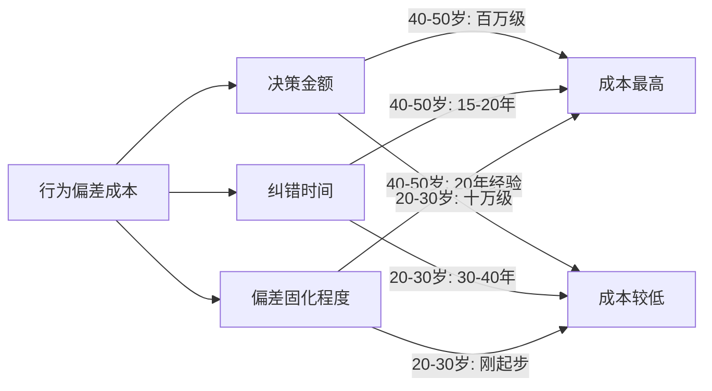
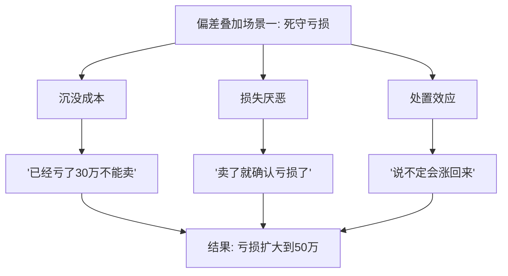
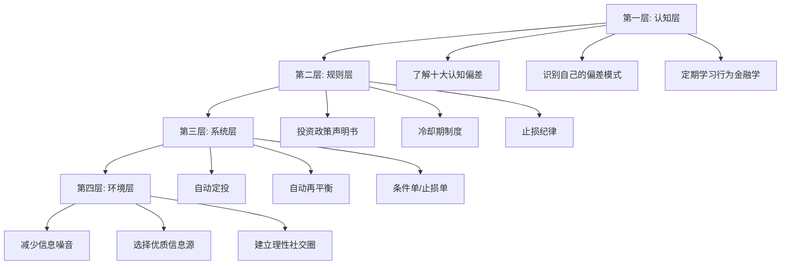

## 七、行为金融学在40-50岁的应用

### 1. 为什么40-50岁是行为金融学的关键干预窗口

行为金融学（Behavioral Finance）是将心理学研究成果应用于金融决策分析的交叉学科。与传统金融学假设"理性人"不同，行为金融学认为投资者是"有限理性"的——会系统性地犯下可预测的错误。

40-50岁是行为金融学干预价值最高的年龄段，原因有三：

**第一，决策金额大。** 经过20年积累，这个年龄段的投资组合通常在百万到千万级别。一个认知偏差导致的错误决策，损失金额可能是20多岁时的10倍甚至100倍。25岁亏10万，人生还有40年翻盘；45岁亏100万，距离退休只剩15年，回旋余地大幅缩小。

**第二，偏差已固化。** 20多年的投资和消费经历形成了根深蒂固的思维模式。这些模式在年轻时可能是"经验"，到了中年反而变成"经验陷阱"——因为市场环境、经济周期、个人处境都在变化，但思维模式没有跟着更新。

**第三，纠错窗口收窄。** 20岁犯错有40年修正，30岁犯错有30年修正，45岁犯错只有15-20年修正。时间的压缩意味着每一次决策的权重都在增加，行为偏差的成本被放大。



### 2. 十大核心认知偏差及其在40-50岁的具体表现

#### 2.1 损失厌恶（Loss Aversion）

**理论来源：** Daniel Kahneman和Amos Tversky的前景理论（Prospect Theory，1979）。核心发现：人对损失的痛苦感受约为等额收益快乐感受的2-2.5倍。

**40-50岁的特殊表现：**

损失厌恶在40-50岁会显著加剧，因为这个年龄段面对的是"最后的机会窗口"心理——距离退休还有15-20年，如果现在亏损，可能没有足够时间恢复。这种心理会导致两种极端行为：

- **过度保守：** 将大部分资产放在银行存款和货币基金中，年化收益3-4%，跑不赢通胀。表面上"没亏"，实际上每年购买力缩水2-3%。一个45岁的人如果持有500万现金，到60岁时实际购买力可能只剩350万（按3%通胀计算）。
- **死扛亏损：** 持有亏损的股票或基金不愿卖出，因为"卖了就真亏了"。行为金融学称之为"处置效应"（Disposition Effect）——投资者倾向于过早卖出盈利资产、过久持有亏损资产。Terrance Odean（1998）的研究发现，投资者卖出的盈利股票后续平均上涨3.4%，而死扛的亏损股票后续平均下跌4.4%。

**量化自测：** 回顾过去一年的投资决策，问自己——是否有某只基金或股票亏损超过15%却一直没卖？如果有，你需要认真审视是否陷入了处置效应。

#### 2.2 锚定效应（Anchoring）

**理论来源：** Tversky和Kahneman（1974）的启发式与偏差研究。人做判断时会过度依赖最先获得的信息（"锚"），即使这个信息与当前决策无关。

**40-50岁的特殊表现：**

- **锚定历史价格：** "这只股票最高到过60块，现在才25块，肯定能涨回去。"这是典型的用历史高点做锚。实际上，股价的历史高点可能对应完全不同的基本面——那时公司利润更高、行业景气度更好、市场流动性更充裕。40-50岁的投资者因为经历过完整的牛熊周期，更容易被自己记忆中的价格锚点影响。
- **锚定过去收益：** "我以前买基金年化收益都能到15%，现在这个收益不接受。"2006-2007年或2014-2015年的大牛市确实让很多人获得了超额收益，但那是特殊市场环境，不是常态。锚定过去的收益会让人在正常市场中感到"不够好"，从而冒险追求高收益。
- **锚定初始配置：** "我一直是70%股票+30%债券的配置，不用改。"这种锚定忽略了风险承受能力随年龄变化的事实。40岁合理的配置到50岁可能已经过于激进。

**数据佐证：** 行为金融学研究表明，锚定效应的影响可以持续数月甚至数年。在一项房产估值实验中，即使告知参与者挂牌价是随机生成的，他们的估值判断仍然显著受到挂牌价影响。

#### 2.3 过度自信（Overconfidence）

**理论来源：** Barber和Odean（2001）的经典论文"Boys Will Be Boys"。研究发现，男性投资者的交易频率比女性高45%，但净收益每年低约2.7%——过度自信导致过度交易。

**40-50岁的特殊表现：**

中年投资者的过度自信往往来源于"经验"——20年的投资经历让人觉得自己"看透了市场"。具体表现包括：

- **频繁调仓：** 认为自己能判断市场短期走势，频繁买卖。每次交易都有摩擦成本（佣金、印花税、买卖价差），频繁交易的年化摩擦成本可能达到1-2%。
- **集中持仓：** "我研究这只股票很久了，不会有问题。"将大量资产集中在少数标的上。40-50岁的人往往在自己的专业领域（比如科技行业的从业者买科技股）过度集中，这种"熟悉度偏差"（Familiarity Bias）让人误以为了解等于安全。
- **忽视专业建议：** "我炒了20年股，还需要理财顾问？"拒绝支付专业服务费用，却愿意为一个"内幕消息"亏掉10万。

**数据佐证：** Barber和Odean（2000）对66,465个家庭账户的研究发现，交易最活跃的20%投资者年化净收益比最不活跃的20%低约7%。在扣除交易成本后，频繁交易者的收益甚至低于市场指数。

#### 2.4 现状偏差（Status Quo Bias）

**理论来源：** Samuelson和Zeckhauser（1988）。人们倾向于维持现状，即使改变能带来更好的结果。改变需要决策成本和心理努力，维持现状则是"默认选项"。

**40-50岁的特殊表现：**

- **不调整资产配置：** 30岁时建立的投资组合到了45岁还在用。年轻时配置的高比例股票随着年龄增长应该逐步降低，但很多人因为现状偏差而维持原样——或者走向另一个极端，因为恐慌在某次大跌后全部转为保守配置，之后再也没调回来。
- **不更换低效产品：** 持有的基金多年跑输同类平均水平，但因为"已经买了""不想折腾""说不定以后会好"而继续持有。一个年化收益差2%的基金，持有10年意味着你的资产比最优选择少了约20%。
- **不优化保险方案：** 十年前买的保险产品，保额和保障范围已经不匹配当前的家庭责任和收入水平，但因为"反正一直在交"而没有重新评估。

#### 2.5 心理账户（Mental Accounting）

**理论来源：** Richard Thaler（1985，1999）。人们会把钱分到不同的"心理账户"中，对不同来源、不同用途的钱采用不同的态度和规则。这违反了经济学的基本假设——钱是可互换的（fungible）。

**40-50岁的特殊表现：**

- **"辛苦钱"vs"意外钱"：** 工资收入精打细算，但年终奖、股票分红、房产增值等"意外收入"却大手大脚。实际上，1万块钱就是1万块钱，不管它是工资还是彩票中奖。
- **"孩子的钱不能动"：** 在教育基金里放了太多钱，同时信用卡欠着高利率的债务。从理性角度看，应该先还清18%利率的信用卡，再存4%收益的教育基金。但心理账户让"教育"这个账户变得神圣不可动用。
- **"这笔钱是养老的"：** 在心理上把某笔钱标记为"养老用途"，结果这笔钱只能接受极低收益（如定期存款），即使距离退休还有15年，完全可以承受适度的风险来获取更高收益。

#### 2.6 沉没成本谬误（Sunk Cost Fallacy）

**理论来源：** Arkes和Blumer（1985）。人倾向于因为已经投入的成本而继续一项不值得的投资，而不是基于当前和未来的收益做决策。

**40-50岁的特殊表现：**

- **死守亏损投资：** "我在这只股票上已经亏了30万，不能卖。"这30万已经是沉没成本，正确的决策标准是："如果我现在手里有这只股票的等值现金，我会不会买入它？"如果答案是不会，那就应该卖出。
- **坚持失败的生意：** 投入了50万和3年时间的小生意一直在亏损，但因为"已经投了这么多"而不愿止损。40-50岁的时间比金钱更宝贵——3年的时间如果用在正确的事情上，回报可能远超继续亏损。
- **继续不合适的教育投资：** 花了20万读MBA，读到一半发现对职业发展没有帮助，但因为"钱都交了"而硬撑读完。正确的思考方式是：剩余的时间和精力投入MBA的机会成本是什么？

#### 2.7 禀赋效应（Endowment Effect）

**理论来源：** Thaler（1980），后由Kahneman、Knetsch和Thaler（1990）系统验证。人对自己拥有的东西会赋予更高的价值——"拥有即高估"。

**40-50岁的特殊表现：**

- **祖传房产不舍卖：** 继承了一套老房子，市场价值200万，租金回报率只有1.5%，同金额的理财产品收益4-5%。但因为"这是爸妈留下的"，情感价值覆盖了理性判断。
- **公司股票不愿卖：** 在一家公司工作了15年，持有大量公司股票期权或限制性股票。从风险分散的角度看，应该逐步卖出（因为你的工资收入已经与这家公司高度相关），但"这是我的公司"的心理让你无法做出理性决策。安然公司（Enron）的员工退休金大量投资本公司股票，最终公司倒闭，退休金归零——这是禀赋效应最惨痛的案例。
- **早年收藏不愿变现：** 邮票、字画、老酒等收藏品，市场价可能已经大幅上涨，但因为"收藏了这么多年有感情"而不愿卖出，即使这些资金的使用效率很低。

#### 2.8 从众效应（Herd Behavior）

**理论来源：** Shiller（2000）在《非理性繁荣》中系统分析了群体行为对资产价格泡沫的推动作用。人在不确定时会参考他人的行为，即使自己的判断更准确。

**40-50岁的特殊表现：**

- **同龄人攀比投资：** "老王买了那套别墅涨了100万""老李炒股去年赚了50万"。同龄人的成功案例会产生巨大的心理压力，让人不顾自身情况跟风投资。
- **集体恐慌：** 在市场大跌时，同事、朋友、微信群都在说"赶紧跑"，理性告诉你要坚守，但群体恐慌会让你做出跟风卖出的决定。2015年A股从5178点暴跌到2850点的过程中，大量投资者在底部割肉，随后市场反弹了30%以上。
- **信息茧房：** 40-50岁的人往往有固定的信息来源——几个微信群、几个公众号、几个朋友的"小道消息"。这些信息来源高度同质化，导致所有人看到同样的信息、做出同样的决策，形成信息茧房。

#### 2.9 可得性偏差（Availability Bias）

**理论来源：** Tversky和Kahneman（1973）。人会根据事件在记忆中的易获取程度来判断其概率——越容易想起的事件，被认为越可能发生。

**40-50岁的特殊表现：**

- **放大近期事件：** 2020年疫情导致的暴跌让很多人彻底清仓，但到2021年市场就创新高。近期的剧烈事件会在记忆中留下深刻印象，让人过度估计类似事件再次发生的概率。
- **忽视基础概率：** 听说一个朋友通过投资某只股票赚了100万，就认为"炒股赚钱很容易"。但你没听到的是另外99个亏钱的人——幸存者偏差是可得性偏差的变体。
- **高估小概率风险：** 飞机失事的新闻让人不敢坐飞机，但统计上开车比坐飞机危险得多。在投资中，高估小概率风险会导致过度保守的配置。

#### 2.10 框架效应（Framing Effect）

**理论来源：** Tversky和Kahneman（1981），通过"亚洲疾病问题"实验证明：同一个问题的不同表述方式会导致截然不同的决策。

**40-50岁的特殊表现：**

- **收益框架vs损失框架：** "这只基金去年收益15%"和"这只基金在某次调整中回撤了20%"——如果同一基金的两个说法分别呈现给同一个人，他很可能对前者产生好感、对后者产生厌恶，尽管描述的是同一只基金。
- **费率框架：** "每年只收1.5%管理费"听起来不多，但如果年化收益只有8%，管理费实际吃掉了收益的近20%。30年累计下来，1.5%的管理费会让你的最终资产减少约35%。
- **保险销售中的框架效应：** "每天只要一杯咖啡的钱"vs"每年要交1.8万"——同一笔保费的不同框架会导致截然不同的购买决策。

### 3. 40-50岁特有的行为偏差叠加效应

单一偏差已经足够危险，但40-50岁的投资者往往同时受到多种偏差叠加的影响。以下是三种常见的偏差组合及其典型场景：



| 偏差组合 | 典型场景 | 危害程度 | 纠正难度 |
|----------|---------|---------|---------|
| 沉没成本 + 损失厌恶 + 处置效应 | 死守亏损股票/基金，越跌越不卖 | ★★★★★ | 高——需要硬性止损规则 |
| 过度自信 + 从众效应 + 可得性偏差 | 听朋友推荐就重仓，赚了归功自己，亏了怪市场 | ★★★★ | 中——需要建立决策清单 |
| 现状偏差 + 禀赋效应 + 锚定效应 | 十年不调仓，死守老基金和老配置 | ★★★★ | 中——需要定期强制审查 |
| 心理账户 + 沉没成本 | 不同账户资金效率极低但不愿整合 | ★★★ | 低——认知到即可改善 |
| 损失厌恶 + 框架效应 | 一看到"风险"两字就拒绝，错过合理配置 | ★★★ | 低——需要学习风险的本质 |

### 4. 行为金融学的实操纠正工具箱

认识到偏差是第一步，但"知道"和"做到"之间存在巨大鸿沟。以下是经过验证的实操工具：

#### 4.1 投资决策日记

**原理：** 将决策过程从"系统1"（直觉、快速、情绪化）切换到"系统2"（理性、缓慢、分析性）。写下来本身就是一个触发"系统2"的过程。

**具体操作：** 每次做出买卖决策时，填写以下模板：

```text
决策日期：____
标的：____
操作：买入 / 卖出 / 调整
金额/比例：____
决策理由（至少写3条）：
  1. ____
  2. ____
  3. ____
预期收益：____
最大可承受亏损：____
可能的偏差自检：
  □ 是否受到朋友/消息影响？（从众）
  □ 是否因为之前已经投入所以不想放弃？（沉没成本）
  □ 是否因为近期事件过度反应？（可得性）
  □ 是否因为"了解"这个行业所以过度自信？
  □ 是否因为已经盈利/亏损而影响判断？（损失厌恶）
预设退出条件：____
复盘日期（3个月后）：____
```

**关键：** 3个月后必须回来复盘。对比预设的退出条件和实际情况，记录偏差导致的收益差。长期积累后，你会清楚地看到自己的偏差模式。

#### 4.2 决策冷却期制度

**原理：** 大部分冲动决策在24-72小时后会消退。给自己设置强制等待期可以过滤掉大部分情绪化决策。

**具体规则：**

| 决策类型 | 冷却期 | 理由 |
|---------|--------|------|
| 单笔投资<5万 | 24小时 | 小额决策也需要最低限度的冷静 |
| 单笔投资5-50万 | 72小时 | 中等金额，需要充分思考 |
| 单笔投资>50万 | 7天+ | 大额决策，需要独立分析 |
| 市场暴跌时的卖出 | 48小时 | 恐慌情绪需要时间消散 |
| 朋友推荐的"机会" | 7天 | 排除从众效应和社交压力 |
| 资产配置大调整 | 14天 | 涉及整体战略，不能草率 |

**例外情况：** 如果触及预设的止损线（比如单只标的亏损20%），应立即执行，不需要冷却——止损是事前理性规则，不是事后情绪决策。

#### 4.3 预承诺机制（Pre-commitment）

**原理：** 在情绪平静时制定规则，在情绪波动时执行规则。行为经济学家称之为"尤利西斯策略"——像尤利西斯把自己绑在桅杆上抵御海妖的歌声。

**具体实施：**

**投资政策声明书（IPS）：** 写一份正式的投资政策声明，包含以下内容，并打印出来贴在电脑旁边：

```text
我的投资政策声明书

一、目标
  - 15年后退休，退休后年支出30万（按当前购买力）
  - 子女教育基金：____万（分____年使用）
  - 应急基金：____万（维持6个月家庭支出）

二、资产配置
  - 股票类：____%（±5%浮动范围）
  - 债券类：____%
  - 现金类：____%
  - 另类资产：____%
  - 调整频率：每半年一次，非触发式不调整

三、硬性规则（不可违反）
  - 单只股票/基金不超过总仓位的15%
  - 单只亏损超过20%必须止损
  - 每年交易次数不超过12次
  - 不借钱投资（杠杆=0）
  - 不投资自己完全不理解的产品

四、情绪管理
  - 大跌时的操作清单：（1）关掉行情软件 （2）重读本声明 （3）等待48小时
  - 大涨时的操作清单：（1）不要加仓追涨 （2）检查是否超出配置比例 （3）等待48小时
```

#### 4.4 偏差清单检查表

**原理：** 飞行员在起飞前必须逐项检查清单（Checklist），即使飞行了上万次。投资决策同样需要清单来对抗"我已经很熟了"的过度自信。

在做出任何重大投资决策前，逐项回答以下问题：

```text
□ 我是否在冲动下做这个决策？（检查情绪状态）
□ 如果我没有持有这只标的，我现在会买入吗？（排除禀赋效应）
□ 我是否因为朋友/同事在做所以跟着做？（排除从众）
□ 我是否只看了支持这个决策的信息？（确认偏差自检）
□ 如果这个决策错了，最坏结果是什么？我能否承受？
□ 我的决策是否受到近期新闻/事件的影响？（可得性偏差）
□ 这个标的的估值是否合理，还是我只看价格涨了多少？（锚定效应）
□ 我是否因为已经投入了时间/金钱所以不愿放弃？（沉没成本）
□ 这笔投资的机会成本是什么？有没有更好的选择？
□ 一年后回看，我还会做同样的决策吗？
```

如果任何一项"是"触发了偏差警报，暂停决策，走一遍冷却期流程。

#### 4.5 自动化系统

**原理：** 行为偏差在手动操作时最活跃。将可自动化的行为交给系统，可以彻底绕过情绪干扰。

**可自动化的投资行为：**

| 行为 | 手动模式的风险 | 自动化方案 |
|------|---------------|-----------|
| 定投 | "这个月市场跌了先不投"——择时失败 | 设定自动定投，每月固定日期扣款 |
| 再平衡 | "涨得好的为什么要卖"——追涨杀跌 | 设定半年/年度自动再平衡 |
| 止损 | "再等等看"——损失扩大 | 设定条件单/止损单自动触发 |
| 分红再投资 | "先把分红取出来花"——破坏复利 | 设定红利自动再投资 |
| 保费缴纳 | "这个月紧一紧先不交了"——保障中断 | 设定自动扣款 |

**实施建议：** 如果你目前的投资管理全部是手动的，优先实现定投自动化和再平衡自动化——这两个行为的自动化对长期收益影响最大。

#### 4.6 反向论证法

**原理：** 确认偏差（Confirmation Bias）让人只看到支持自己观点的信息。主动寻找反对意见可以对抗这种偏差。

**具体操作：** 每次做出投资决策前，强迫自己完成以下练习：

1. **列出3个这个决策可能失败的理由**
2. **找到一个持相反观点的专业分析**
3. **问自己：如果我最好的朋友做这个决策，我会怎么建议他？**（心理学研究表明，为他人做决策时更理性，因为不需要为他人的损失承担情绪后果。这叫做"自我-他人决策偏差"。）

### 5. 40-50岁典型行为偏差场景与应对方案

#### 场景一：牛市高峰期的贪婪

**情境：** 2015年4月，A股站上4500点，朋友圈每天都有人晒收益。你45岁，投资组合已经浮盈60%，有人建议你加杠杆。

**偏差叠加：** 从众效应 + 过度自信 + 可得性偏差 + 框架效应（"这次不一样"）

**理性分析：**

- 历史数据：A股在4500点以上的交易日不到总交易日的5%
- 估值指标：当时沪深300的市盈率约18倍，处于历史中位数以上
- 杠杆风险：50%杠杆意味着20%的下跌就导致本金亏完
- 年龄因素：45岁亏光本金，剩余15年能否重新积累到退休目标？

**应对方案：**

1. 打开IPS，检查股票类资产是否已超出配置比例上限
2. 如超出，触发再平衡规则，将超出部分减至目标比例
3. 回答反向论证问题："如果市场从4500跌到2500，我的退休计划会怎样？"
4. 走72小时冷却期

**事后回顾：** 2015年6月A股从5178点暴跌至2850点，跌幅45%。如果45岁时满仓加杠杆，可能损失超过60%的资产。

#### 场景二：熊市底部的恐惧

**情境：** 2018年底，A股跌至2500点附近，你的投资组合浮亏25%。微信群里有人说"这次真的要到2000点了"。你46岁，看着账户里的数字每天缩水，想全部清仓。

**偏差叠加：** 损失厌恶 + 可得性偏差（暴跌新闻铺天盖地）+ 从众效应

**理性分析：**

- 估值指标：沪深300市盈率约10倍，处于历史最低10%区间
- 历史规律：过去20年，A股在市盈率<12倍时买入并持有3年，正收益概率>90%
- 股息率：当时很多蓝筹股的股息率超过4%，超过银行理财
- 时间因素：46岁还有14年才退休，完全有时间等待市场恢复

**应对方案：**

1. 打开IPS，检查是否触发了预设的止损线（应该没有——组合整体浮亏25%不等于触及止损线）
2. 关掉行情软件，48小时内不看账户
3. 重读IPS中关于"大跌时的操作清单"
4. 如果有闲置资金，反而是加仓的窗口期（前提是不超过配置上限）

**事后回顾：** 2019年初A股开始反弹，从2500点涨至3200点以上，涨幅约30%。在底部清仓的人完美错过了这波反弹。

#### 场景三：中年危机下的冲动投资

**情境：** 你48岁，最近刚经历了公司裁员风波，虽然保住了职位，但感到强烈的不安全感。一个朋友推荐了一个"年化收益20%"的私募基金，你想用一部分积蓄试一试。

**偏差叠加：** 可得性偏差（裁员经历放大了不安全感）+ 过度自信（"我能分辨好产品"）+ 从众（朋友推荐）

**理性分析：**

- 收益合理性：年化20%意味着每4年资产翻一倍。巴菲特的长期年化收益约20%。如果这个基金能稳定做到20%，为什么还需要你这100万？
- 流动性风险：私募基金通常有锁定期（1-3年），中年时期面临各种不确定性，流动性至关重要
- 信息不对称：你对这个基金的投资策略、底层资产、管理人历史了解多少？

**应对方案：**

1. 走7天冷却期
2. 要求查看基金的底层资产清单、过往3年净值曲线、管理人从业经历
3. 用反向论证法：列出3个这个基金可能是骗局的理由
4. 查询中国证券投资基金业协会官网（https://www.amac.org.cn/），验证基金备案信息

### 6. 行为金融学在家庭财务决策中的应用

行为偏差不仅影响投资，还渗透到家庭财务的方方面面。

#### 6.1 消费决策中的行为偏差

**现状偏差 + 心理账户 → 固定支出膨胀**

很多家庭的固定支出（房贷、车贷、保险、订阅服务）在10年前建立后就再没审视过。Netflix涨价了、健身房年卡根本没用几次、某个App订阅忘了取消——这些"小钱"加起来可能每年浪费5000-20000元。

**实操方案：** 每年做一次"支出审计"——

1. 导出过去12个月的银行和信用卡流水
2. 分类标记每一笔支出（必要/可选/浪费）
3. 计算"浪费率"——浪费金额占总支出的比例
4. 目标：浪费率控制在5%以内

**框架效应 → 保险决策**

保险销售最常用框架效应："每天只要8块钱"比"每年2920元"听起来便宜得多。40-50岁是保险配置的关键时期（家庭责任最重），但也是框架效应最容易让人买错保险的时期。

**实操方案：** 购买任何保险前，将所有费用换算为"年度总成本"和"占家庭年收入的比例"。一般建议家庭保险总支出不超过年收入的10%。

#### 6.2 子女教育支出中的行为偏差

**沉没成本 + 禀赋效应 → 教育投资过度**

"已经学了3年钢琴了，不能放弃"——但孩子可能对钢琴毫无兴趣，继续投入只是在为沉没成本买单。"这是为了孩子的未来"——但每小时500元的钢琴课如果换成孩子真正喜欢的项目，投入产出比可能高得多。

**实操方案：** 教育投资也应该设定止损线——如果某项培训持续6个月后孩子仍然没有明显进步或兴趣，应该果断止损，而不是因为"已经投入了"而继续。

#### 6.3 重大财务决策中的偏差缓冲机制

对于金额超过年收入20%的重大财务决策（买房、创业、大额投资、子女留学等），建议建立"家庭财务决策委员会"机制：

1. **至少两人参与决策**——夫妻双方各写一份独立分析，然后对比讨论
2. **引入外部意见**——咨询一个不涉及利益的第三方（理财顾问、信任的长辈）
3. **预写"失败声明"**——在做决策前，先写好"如果这个决策失败了，原因是____"，强迫自己在决策前就考虑失败场景
4. **设定退出条件**——在投入之前就明确"亏到什么程度/到什么时间点就必须止损"

### 7. 建立个人行为金融防御体系

将以上工具整合为一个完整的防御体系，需要四个层次：



**第一层：认知层——知道自己会犯错**

- 学习十大核心认知偏差（本章第2节）
- 通过投资日记识别自己的偏差模式
- 每年重读1-2本行为金融学经典著作（推荐书目见下文）

**第二层：规则层——用规则约束冲动**

- 撰写并定期更新投资政策声明书
- 执行冷却期制度
- 遵守止损纪律

**第三层：系统层——让机器替代人性**

- 设置自动定投
- 设置自动再平衡提醒
- 使用条件单和止损单

**第四层：环境层——塑造有利于理性决策的环境**

- 减少查看行情的频率（建议每周不超过2次）
- 退出充斥"内幕消息"的投资群
- 建立2-3个可以理性讨论投资的"诤友"关系

### 8. 常见误区与纠正

| 误区 | 纠正 |
|------|------|
| "我投资20年了，不会犯行为偏差" | 资历越深，偏差越固化。研究表明，经验丰富的投资者在过度自信方面比新手更严重 |
| "行为金融学是学术理论，跟实际投资没关系" | 诺贝尔经济学奖得主的理论已经被大规模实证验证。Kahneman、Thaler、Shiller三位行为金融学代表人物均获得诺贝尔奖 |
| "我不会被情绪影响" | 如果你从未在大涨时想过加仓、在大跌时想过卖出，你才是真的不会被影响——但几乎没有人能做到 |
| "只要看基本面就够了" | 分析正确但执行错误等于零。巴菲特说"投资最大的敌人是你自己"，就是指行为偏差 |
| "止损太痛苦，我不设止损" | 不设止损就像开车不系安全带——大部分时候没事，但出事就是大事 |
| "别人亏钱是因为他们不够聪明" | 聪明人更容易过度自信。长期资本管理公司（LTCM）的团队包括两位诺贝尔经济学奖得主，最终因为过度自信和杠杆亏损46亿美元 |

### 9. 推荐学习资源

#### 9.1 经典著作

| 书名 | 作者 | 核心内容 | 适合人群 |
|------|------|---------|---------|
| 《思考，快与慢》 | Daniel Kahneman | 系统1和系统2理论，认知偏差全景 | 所有投资者 |
| 《助推》 | Richard Thaler、Cass Sunstein | 如何设计"选择架构"帮助人们做出更好的决策 | 想要设计个人决策系统的人 |
| 《非理性繁荣》 | Robert Shiller | 资产泡沫中的群体行为分析 | 想要理解市场周期的人 |
| 《错误的行为》 | Richard Thaler | 行为经济学的亲身实践故事 | 偏好轻松阅读风格的人 |
| 《投资中最简单的事》 | 邱国鹭 | A股市场中的行为偏差案例 | 中国投资者 |

#### 9.2 自我评估工具

定期使用以下问卷评估自己的行为偏差状态（每半年做一次）：

```text
行为偏差自测（回答"是"计1分，总分越高偏差越严重）

1. 我是否每周查看投资账户超过3次？
2. 我的投资组合中是否有亏损超过20%但我一直没卖的标的？
3. 我是否因为朋友推荐而买入过某只基金/股票？
4. 我是否在过去一年内做过3次以上的"冲动"交易？
5. 我是否有超过6个月没有审视过资产配置比例？
6. 我是否在同一行业/主题上集中了超过30%的仓位？
7. 我是否借钱投资（含杠杆、融资融券）？
8. 我是否无法清楚说出自己的投资目标和风险承受能力？
9. 我是否在市场大跌时感到恐慌并想过卖出？
10. 我是否在市场大涨时感到兴奋并想过加仓？

0-2分：偏差控制较好，保持纪律
3-5分：存在偏差风险，建议启用决策日记和冷却期
6-8分：偏差严重，建议暂停主动投资，先建立规则体系
9-10分：强烈建议转向全自动化投资（如指数基金定投），停止手动操作
```

### 10. 本节总结

行为金融学不是一门让你"战胜市场"的学问，而是一门让你"战胜自己"的学问。40-50岁是行为偏差成本最高的年龄段——更大的决策金额、更短的纠错窗口、更深的偏差固化，三者叠加使得认知偏差在这一阶段可能造成不可逆的财富损失。

核心要记住的三句话：

1. **承认自己是非理性的**——这是所有纠正措施的起点
2. **在清醒时制定规则，在冲动时执行规则**——这是行为金融学的精髓
3. **用系统替代人性**——自动化是最好的行为偏差防御手段

正如Charlie Munger所说："如果我知道我会死在哪里，我就永远不去那个地方。"行为金融学告诉你的就是那些"你会死的地方"——知道了，就绕着走。
