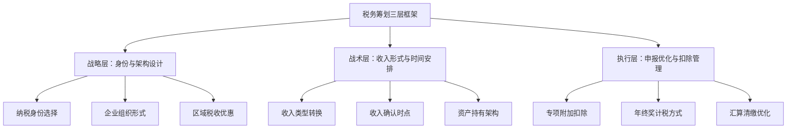
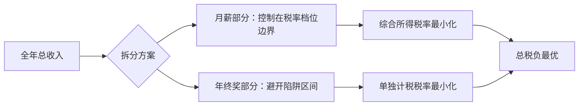
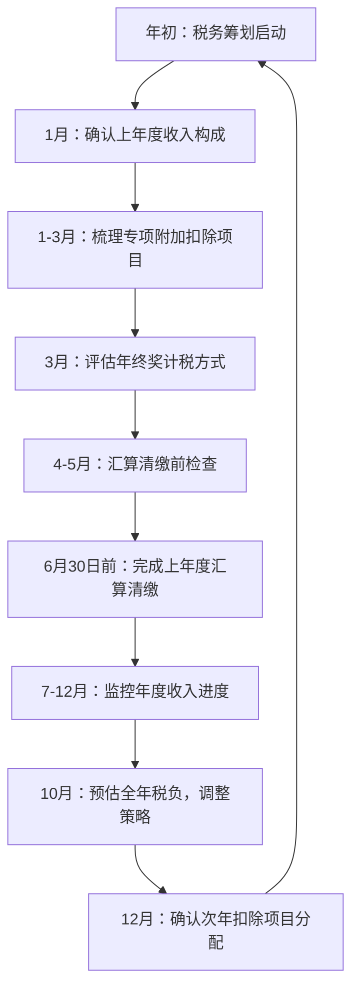
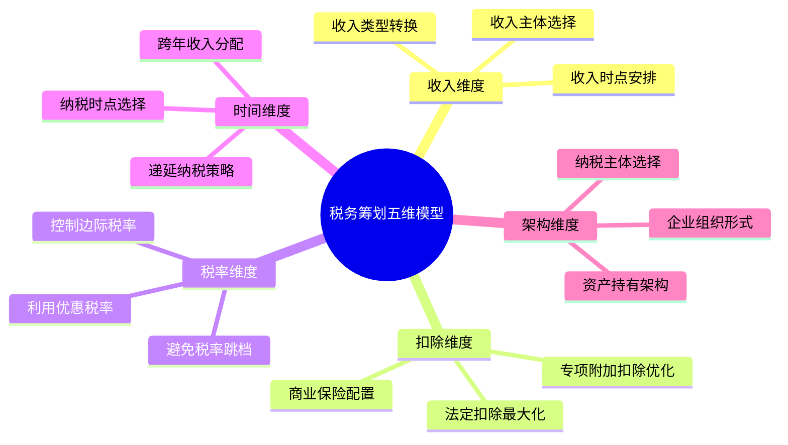

## 八、税务筹划的进阶理论

40-50岁正处于收入高峰期，薪资、奖金、股权、房产租金、投资收益等多源收入叠加，税负往往达到职业生涯的最高点。此时若缺乏系统性的税务筹划，每年可能多缴数万甚至数十万元的税款。税务筹划不是偷税漏税，而是在法律框架内，通过合理安排收入形式、时间节点和资产结构，实现税负的合法最优化。

本章从中国现行税制出发，建立完整的税务筹划理论框架，覆盖个人所得税、资本利得、房产税、企业主税务规划等核心领域，帮助读者在稳健期实现"该交的一分不少，不该交的一分不多"。

---

### 1. 税务筹划的基本概念与法律边界

#### 1.1 什么是税务筹划

税务筹划（Tax Planning）是指纳税人在法律允许的范围内，通过对经营、投资、理财等活动的事先安排和筹划，充分利用税法提供的优惠和差别待遇，尽可能减少税负的行为。

其核心特征：
- **合法性**：在税法框架内操作，不触犯法律红线
- **事先性**：必须在经济行为发生前规划，事后调整往往无效或违规
- **目的性**：以降低整体税负为目标，而非单一税种的最小化
- **综合性**：需考虑税负、现金流、风险等多重因素的平衡

#### 1.2 税务筹划与偷税、避税的本质区别

| 维度 | 税务筹划 | 避税 | 偷税 |
|------|----------|------|------|
| 合法性 | 完全合法 | 形式合法但违背立法意图 | 违法 |
| 时间点 | 事前规划 | 事后安排 | 事后隐瞒 |
| 风险等级 | 低 | 中高（可能被纳税调整） | 高（罚款+刑责） |
| 典型手段 | 利用税收优惠、合理分拆收入 | 利用税法漏洞转移利润 | 隐匿收入、虚列成本 |
| 税务机关态度 | 鼓励 | 反避税调查 | 稽查处罚 |

关键法律依据：《中华人民共和国税收征收管理法》第六十三条明确界定了偷税行为，包括伪造、变造、隐匿、擅自销毁账簿、记账凭证，或者在账簿上多列支出或者不列、少列收入等。税务筹划必须远离这些红线。

#### 1.3 税务筹划的三层框架

---

### 2. 中国个人所得税制度精要

#### 2.1 综合所得税率表（2024年适用）

中国个税采用超额累进税率，综合所得（工资薪金、劳务报酬、稿酬、特许权使用费）适用以下税率：

| 级数 | 全年应纳税所得额 | 税率 | 速算扣除数 |
|------|-----------------|------|-----------|
| 1 | 不超过36,000元 | 3% | 0 |
| 2 | 36,000-144,000元 | 10% | 2,520 |
| 3 | 144,000-300,000元 | 20% | 16,920 |
| 4 | 300,000-420,000元 | 25% | 31,920 |
| 5 | 420,000-660,000元 | 30% | 52,920 |
| 6 | 660,000-960,000元 | 35% | 85,920 |
| 7 | 超过960,000元 | 45% | 181,920 |

**应纳税所得额 = 综合收入 - 60,000元（基本减除） - 专项扣除（五险一金） - 专项附加扣除 - 其他扣除**

#### 2.2 经营所得税率表

个体工商户、个人独资企业、合伙企业适用经营所得：

| 级数 | 全年应纳税所得额 | 税率 | 速算扣除数 |
|------|-----------------|------|-----------|
| 1 | 不超过30,000元 | 5% | 0 |
| 2 | 30,000-90,000元 | 10% | 1,500 |
| 3 | 90,000-300,000元 | 20% | 10,500 |
| 4 | 300,000-500,000元 | 30% | 40,500 |
| 5 | 超过500,000元 | 35% | 65,500 |

#### 2.3 资本利得与财产转让税率

不同类型的资本利得适用不同税率，这是40-50岁投资者必须了解的核心知识：

| 收入类型 | 税率 | 备注 |
|----------|------|------|
| A股股票转让所得 | 暂免征收 | 限境内上市股票 |
| 基金分红 | 免税 | 公募基金 |
| 房产转让 | 20%（差额）或1-3%（核定） | 满五唯一免征 |
| 股权转让 | 20% | 财产转让所得 |
| 利息收入 | 20% | 国债利息免税 |
| 股息红利（持股>1年） | 免税 | 差别化政策 |
| 股息红利（持股1月-1年） | 10%（实际减半征收） | 按50%计入 |
| 股息红利（持股<1月） | 20% | 全额计入 |

---

### 3. 专项附加扣除的深度运用

专项附加扣除是最直接、最合规的减税手段。40-50岁人群通常能覆盖多项扣除，但实际操作中常有遗漏。

#### 3.1 七项专项附加扣除详解

**（1）子女教育**
- 标准：每个子女每月2,000元（2023年9月起由1,000元提高）
- 范围：3岁至博士研究生阶段
- 分配：父母各扣50%，或一方扣100%
- **筹划要点**：收入高的一方承担100%扣除，边际税率越高节税效果越大

**（2）继续教育**
- 学历教育：每月400元，最长48个月
- 职业资格：取得证书当年扣除3,600元
- **筹划要点**：40-50岁考取MBA、CPA、CFA等证书，既能提升能力又能抵税

**（3）大病医疗**
- 标准：个人自付超过15,000元部分，最高扣除80,000元/年
- 范围：医保目录范围内个人自付部分
- 分配：本人或配偶扣除，未成年子女由父母扣除
- **筹划要点**：保留所有医疗票据，年度汇算时据实申报

**（4）住房贷款利息**
- 标准：每月1,000元，最长240个月
- 条件：首套住房贷款
- **筹划要点**：夫妻协商由高收入方扣除；注意与住房租金不可同时享受

**（5）住房租金**
- 标准：按城市等级800-1,500元/月
- 条件：本人及配偶在主要工作城市无自有住房
- **筹划要点**：如有房贷但非首套，可能租金扣除更划算

**（6）赡养老人**
- 标准：独生子女每月3,000元；非独生子女分摊，每人不超过1,500元
- 条件：被赡养人年满60岁
- **筹划要点**：非独生子女家庭需签订分摊协议，建议收入最高者多分摊

**（7）3岁以下婴幼儿照护**
- 标准：每个婴幼儿每月2,000元
- 分配：父母各扣50%或一方扣100%
- **筹划要点**：与子女教育扣除类似的分配策略

#### 3.2 扣除优化组合计算示例

假设张先生（45岁，年薪80万）和李女士（43岁，年薪30万）的家庭情况：
- 2个孩子（1个上小学，1个4岁）
- 赡养2位60岁以上老人（独生子女）
- 首套房贷在还
- 张先生在读MBA

**最优分配方案：**

| 扣除项 | 张先生扣除 | 李女士扣除 | 理由 |
|--------|-----------|-----------|------|
| 子女教育（小学） | 2,000/月 | 0 | 高收入方全额扣 |
| 婴幼儿照护 | 2,000/月 | 0 | 高收入方全额扣 |
| 赡养老人 | 3,000/月 | 0 | 独生子女全额扣 |
| 住房贷款利息 | 1,000/月 | 0 | 高收入方扣除 |
| 继续教育（MBA） | 400/月 | 0 | 本人在读 |
| 年度扣除合计 | 100,800元 | 0 | — |

张先生节税效果：100,800 × 适用边际税率（45%档） = 约45,360元
若分配给李女士：100,800 × 适用边际税率（25%档） = 约25,200元
**差额约20,160元/年**

---

### 4. 年终奖计税的筹划策略

#### 4.1 两种计税方式

2024年起，年终奖可以选择单独计税或并入综合所得：

**单独计税**：年终奖除以12个月确定税率，适用月度税率表
**并入综合所得**：年终奖并入全年收入统一计税

#### 4.2 年终奖的"陷阱区间"

单独计税时存在6个陷阱区间，落入这些区间的金额会导致"多发少得"：

| 陷阱区间（元） | 多缴税额（元） | 应发金额调整为 |
|----------------|---------------|---------------|
| 36,001-38,566.67 | 最多2,310 | 36,000 |
| 144,001-160,500 | 最多13,200 | 144,000 |
| 300,001-318,333.33 | 最多11,000 | 300,000 |
| 420,001-447,500 | 最多17,500 | 420,000 |
| 660,001-706,538.46 | 最多21,000 | 660,000 |
| 960,001-1,120,000 | 最多56,000 | 960,000 |

**实例**：年终奖发36,001元，税后到手34,680.9元；而发36,000元，税后到手34,920元。多发1元，少拿239.1元。

#### 4.3 最优分配策略

对于高收入人群，最优策略是将年终奖和月薪进行组合优化：

**实操方法**：
1. 计算全年综合所得（不含年终奖）的应纳税所得额
2. 判断该金额所处税率档位
3. 如果综合所得已进入高税率档，年终奖单独计税更有利
4. 如果综合所得在低税率档且有空间，并入综合所得可能更优
5. 用电子表格或税务软件模拟两种方案，取税负较低者

---

### 5. 房产相关的税务筹划

#### 5.1 房产交易中的主要税种

| 税种 | 税率 | 纳税人 | 优惠政策 |
|------|------|--------|----------|
| 增值税 | 5%（满2年免征） | 卖方 | 北上广深非普通住房满2年差额征收 |
| 个人所得税 | 20%（差额）或1%（核定） | 卖方 | 满五唯一免征 |
| 契税 | 1-3% | 买方 | 首套90㎡以下1%，以上1.5% |
| 土地增值税 | 30-60%四级超率累进 | 卖方 | 个人住宅暂免 |
| 印花税 | 0.05% | 双方 | 个人住宅暂免 |

#### 5.2 房产持有阶段的税务安排

**出租房产的个税计算**：
- 每月租金收入不超过4,000元：应纳税所得额 = 收入 - 800 - 修缮费用（上限800/月）
- 每月租金收入超过4,000元：应纳税所得额 = 收入 × (1-20%) - 修缮费用
- 税率：10%（个人出租住房优惠税率）

**筹划要点**：
- 合理列支修缮费用，保留发票
- 利用每月800元或20%的费用扣除标准
- 多套房产分别核算，避免合并计税

#### 5.3 房产传承的税务考量

| 方式 | 税费成本 | 时效性 | 未来出售税负 |
|------|----------|--------|-------------|
| 买卖过户 | 契税1-3% + 可能的个税 | 立即生效 | 按正常交易计税 |
| 赠与过户 | 契税3% | 立即生效 | 受赠后再卖需缴20%差额个税 |
| 继承过户 | 免契税 | 被继承人去世后 | 继承后再卖需缴20%差额个税 |

**关键结论**：如果子女未来可能出售房产，通过买卖方式过户通常总税负最低，因为赠与和继承取得的房产在出售时不能享受"满五唯一"免个税的优惠（以原购房时间计算满五年）。

---

### 6. 投资理财的税务优化

#### 6.1 不同投资工具的税负对比

| 投资工具 | 收益类型 | 税率 | 税务处理 |
|----------|----------|------|----------|
| 银行存款 | 利息 | 20%（暂免） | 目前暂免征收利息税 |
| 国债 | 利息 | 免税 | 国债利息收入免税 |
| 地方债 | 利息 | 免税 | 同国债 |
| 公募基金分红 | 股息 | 免税 | 持有期分红免税 |
| 公募基金转让 | 资本利得 | 免税 | 个人买卖基金差价暂不征收 |
| 股票股息（>1年） | 股息 | 免税 | 差别化政策 |
| 股票转让 | 资本利得 | 免税 | A股暂免 |
| 私募基金 | 收益 | 视产品类型 | 有限合伙按经营所得5-35% |
| 信托产品 | 收益 | 20% | 利息、股息、红利所得 |
| 银行理财 | 收益 | 20% | 目前实操中银行不代扣 |

#### 6.2 股息红利差别化政策的运用

持股时间的精确计算直接影响股息红利的税负：

- **持股>1年**：免税 → **长期持有红利股是最优策略**
- **持股1个月-1年**：减半征收（实际税率10%）
- **持股≤1个月**：全额征收（税率20%）

**筹划策略**：
- 红利型投资组合应以长期持有为核心策略
- 股息登记日前买入需注意持有期计算（先进先出法）
- 利用ETF替代个股可享受基金分红免税待遇

#### 6.3 投资亏损的税务处理

中国个税体系下，不同投资的盈亏**不能互抵**：
- A股股票亏损不能抵扣房产转让收益
- 不同房产的盈亏可以互抵（同一纳税年度内）
- 基金亏损不能抵扣其他收入

**但可以利用的规则**：
- 财产转让所得按"次"计算，合理安排转让时点
- 同一年度内多次转让同一类财产，盈亏可以互抵
- 年底前实现的亏损可用于抵减同年度的同类收益

---

### 7. 企业主与高管的税务架构设计

#### 7.1 工资薪金 vs 经营所得的税率差异

40-50岁的企业主或高管需要理解不同收入形式的税负差异：

| 年收入（万元） | 工资薪金最高边际税率 | 经营所得最高边际税率 | 差异 |
|---------------|--------------------|--------------------|------|
| 30 | 25% | 20% | 经营所得低5% |
| 50 | 30% | 30% | 持平 |
| 80 | 35% | 35% | 持平 |
| 100 | 45% | 35% | 经营所得低10% |
| 200 | 45% | 35% | 经营所得低10% |

**关键发现**：年收入超过96万后，工资薪金的边际税率达到45%，而经营所得最高只有35%。高收入企业主通过合理的公司架构，将部分收入转化为经营所得，可以有效降低税负。

#### 7.2 常见的合法架构方案

**方案一：个人独资企业/合伙企业**
- 适用于提供专业服务（咨询、设计、技术等）
- 适用经营所得5-35%税率
- 部分地区可申请核定征收（综合税负3-5%）
- **风险提示**：2024年后核定征收政策收紧，需关注当地政策变化

**方案二：有限公司 + 股权架构**
- 股东分红需缴20%个税
- 但公司利润可用于再投资，延迟纳税
- 合理安排工资薪金（最优区间42-66万/年，边际税率30%）+ 分红（20%）的组合

**方案三：多层持股架构**
- 通过有限合伙企业持股，实现控制权与收益权分离
- 有限合伙企业不缴企业所得税，穿透至合伙人纳税
- 适用于股权激励、家族财富传承

#### 7.3 股权激励的税务处理

上市公司股权激励的税务处理：

| 激励方式 | 纳税时点 | 税率 | 优惠政策 |
|----------|----------|------|----------|
| 股票期权 | 行权时 | 工资薪金3-45% | 符合条件可递延12个月 |
| 限制性股票 | 解锁时 | 工资薪金3-45% | 应纳税所得额=（登记日市价+解锁日市价）÷2 × 股数 |
| 股票增值权 | 行权时 | 工资薪金3-45% | — |
| 非上市公司股权 | 转让时 | 20% | 符合条件可递延至转让时 |

**筹划要点**：
- 上市公司激励尽量在收入较低的年份行权
- 非上市公司股权激励可选择递延纳税，将纳税时点推迟到实际转让时
- 合理规划行权时点，避免与其他高收入叠加推高边际税率

---

### 8. 跨境税务筹划基础

#### 8.1 税收居民身份判定

中国税收居民的判定标准：
- **住所标准**：在中国境内有住所（因户籍、家庭、经济利益关系而习惯性居住）
- **居住时间标准**：无住所但在一个纳税年度内在中国境内居住累计满183天

满足任一标准即为中国税收居民，需就全球所得向中国纳税。

#### 8.2 境外所得的税务处理

- 境外所得需并入中国综合所得或分类所得计税
- 已在境外缴纳的个人所得税可按规定抵免（不超过抵免限额）
- 抵免限额 = 境外所得按中国税法计算的应纳税额
- 超过抵免限额的部分可在以后5年内结转补抵

#### 8.3 CRS（共同申报准则）的影响

自2018年起，中国已与100多个国家和地区实施CRS信息交换：
- 境外金融机构会向中国税务机关报告中国税收居民的账户信息
- 包括存款账户、托管账户、保险合同、股权/债权权益等
- **筹划启示**：通过境外账户隐匿收入已不可行，合规申报是唯一选择

---

### 9. 税务筹划的实施流程

#### 9.1 年度税务筹划检查清单

#### 9.2 关键时间节点

| 时间 | 事项 | 操作要点 |
|------|------|----------|
| 每年1月 | 确认专项附加扣除 | 检查扣除项目是否有变化 |
| 每年3-6月 | 汇算清缴 | 核对收入、扣除、已缴税款 |
| 每年12月 | 年终奖方案确认 | 提前与财务沟通计税方式 |
| 不定期 | 重大交易前 | 房产、股权转让前做税务测算 |
| 及时 | 政策变化 | 关注税务总局公告和解读 |

#### 9.3 税务筹划工具推荐

| 工具 | 用途 | 推荐指数 |
|------|------|----------|
| 个人所得税APP | 申报、查询、扣除填报 | ★★★★★ |
| 国家税务总局网站 | 政策查询、公告解读 | ★★★★★ |
| 电子表格（Excel/WPS） | 个税计算模拟、方案对比 | ★★★★☆ |
| 专业税务软件 | 复杂场景计算 | ★★★☆☆ |
| 注册税务师 | 高净值人群定制方案 | ★★★★★ |

---

### 10. 常见误区与风险警示

#### 10.1 十大常见税务筹划误区

**误区一：把税务筹划等同于少交税**
纠正：税务筹划的目标是合理纳税，包括合理安排纳税时间、充分利用优惠政策，而非一味追求最低税额。延迟纳税在很多情况下比少纳税更有价值，因为资金有时间价值。

**误区二：忽略综合税负，只看单一税种**
纠正：降低了个税但增加了社保基数，或者节省了当前税负但增加了未来转让时的税基损失，都是得不偿失。必须用"全生命周期综合税负"视角来评估方案。

**误区三：在交易完成后才开始筹划**
纠正：税务筹划的核心在于"事先安排"。房产已经过户、股权转让已经完成，筹划空间就非常有限了。所有重大经济行为发生前，都应提前做税务测算。

**误区四：盲目使用个人独资企业核定征收**
纠正：2021年后各地逐步收紧核定征收政策，大量利用核定征收转移利润的行为已被税务机关重点关注。不具有合理商业目的的安排可能被纳税调整。

**误区五：忽视专项附加扣除的分配优化**
纠正：很多家庭将扣除项目默认各50%分配，没有根据双方收入差异做优化。高收入方多承担扣除，节税效果更大。

**误区六：年终奖一律选择单独计税**
纠正：并非所有情况下单独计税都更优。当综合所得低于免税额时，并入综合所得可能更划算。必须逐案计算比较。

**误区七：认为A股炒股不用交任何税**
纠正：虽然A股转让所得暂免个税，但股息红利在持股不足1年时需缴税。此外，通过港股通买卖港股、投资海外市场等都有不同的税务规则。

**误区八：忽视跨境收入的申报义务**
纠正：CRS框架下，境外金融资产信息已对中国税务机关透明。隐瞒境外收入不仅违法，而且在技术上已很难实现。

**误区九：用私人账户收款避税**
纠正：大额个人账户资金流动已纳入央行大额交易和可疑交易监控体系。通过个人账户收取经营款项，一旦被查实，不仅补税还面临罚款和滞纳金。

**误区十：觉得税务筹划是富人才需要考虑的事**
纠正：中等收入群体同样可以通过合理利用专项附加扣除、优化年终奖计税方式、选择合适的投资工具等方式降低税负。年收入30万的家庭，通过优化扣除分配每年也能节省数千元。

#### 10.2 税务风险等级评估

| 行为 | 风险等级 | 可能后果 |
|------|----------|----------|
| 充分利用专项附加扣除 | 低 | 合法合规 |
| 年终奖计税方式选择 | 低 | 政策明确允许 |
| 合理安排收入确认时点 | 低 | 税法认可 |
| 通过关联交易转移利润 | 高 | 纳税调整+罚款 |
| 虚构业务开具发票 | 极高 | 刑事责任 |
| 隐匿收入不申报 | 极高 | 补税+罚款+刑责 |

---

### 11. 40-50岁阶段的特殊税务考量

#### 11.1 职业转型期的税务机遇

40-50岁可能面临的职业转换（如从雇员转为自由职业者、创业等）带来税务筹划的窗口期：

- **从雇员转为自雇**：收入形式从工资薪金变为经营所得，可能适用更低税率
- **创业初期亏损**：经营所得亏损可在5年内结转抵减未来利润
- **退休过渡期**：部分收入可递延到税率较低的退休年度确认

#### 11.2 家庭财富传承的税务规划

| 传承方式 | 税务成本 | 适用场景 |
|----------|----------|----------|
| 生前赠与房产 | 契税3% + 可能的个税 | 子女有购房资格，未来不卖 |
| 买卖过户房产 | 契税1-3% + 可能的个税 | 子女未来可能出售 |
| 设立家族信托 | 设立环节暂无直接税 | 高净值家庭，资产隔离需求 |
| 人寿保险 | 保险赔付免个税 | 定向传承，流动性需求 |
| 遗嘱继承 | 免契税 | 被继承人去世后生效 |

#### 11.3 社保与公积金的税务效应

- 五险一金个人缴纳部分免征个税，提高缴纳基数相当于合法增加免税额
- 企业年金/职业年金个人缴费部分在不超过本人缴费工资计税基数4%的标准内暂不缴纳个税
- 公积金缴存比例在5-12%之间，选择上限12%可最大化税前扣除
- **注意**：社保基数有上下限（当地社平工资的60-300%），超出部分不享受免税

---

### 12. 税务筹划的思维框架

#### 12.1 "五维筹划"模型

#### 12.2 税务筹划决策树

面对任何税务决策，可按以下思路判断：

1. **这个行为是否涉及多个税种？** → 计算综合税负而非单一税种
2. **收入能否转换为更低税率的形式？** → 工资薪金、经营所得、资本利得的税率差异
3. **纳税时点能否调整？** → 递延纳税的时间价值
4. **是否有可用的税收优惠？** → 政策红利应享尽享
5. **方案的风险等级如何？** → 高风险方案即使节省更多也不应采用

#### 12.3 持续学习与政策跟踪

税法体系持续变化，40-50岁阶段的税务筹划需要建立长期的政策跟踪机制：

- 关注国家税务总局官方网站和公众号
- 每年汇算清缴前重新评估扣除方案
- 重大政策变化时（如税率调整、新优惠政策出台）及时调整策略
- 高净值人群建议每年咨询一次注册税务师
- 保留完整的税务相关凭证和文件，至少保存5年

---

**本章小结**：税务筹划是一门需要持续学习和实践的技能。40-50岁作为收入高峰期和财富积累关键期，系统性的税务筹划每年可为家庭节省数万至数十万元。核心原则是：合法合规、事先规划、综合考量、动态调整。把省下的税钱用于增加投资和保障，才是真正的"稳健期"财务智慧。
