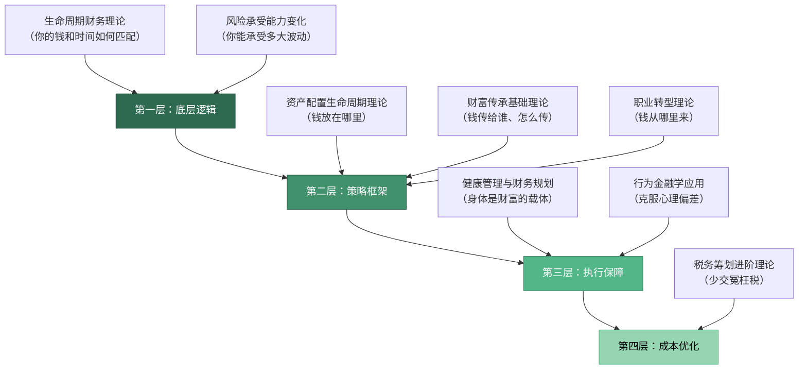
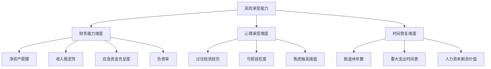
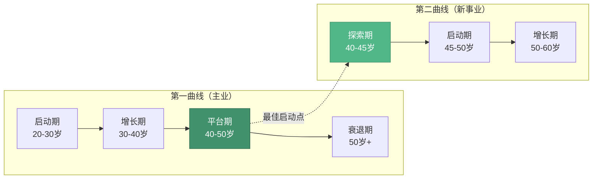
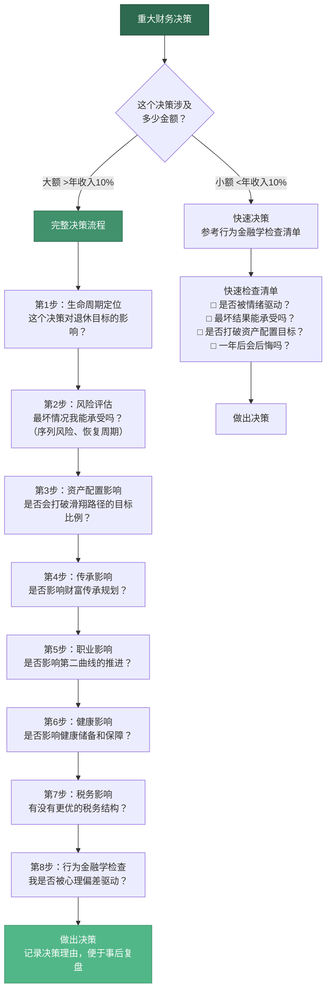

## 九、本章理论框架总结

本章理论基础共八节，分别从生命周期、风险承受、资产配置、财富传承、职业转型、健康管理、行为金融和税务筹划八个维度，构建了40-50岁"稳健期"的完整理论体系。本节将这八个维度串联为一个有机整体，帮助你建立系统化的认知框架——不是八个孤立的知识点，而是一张相互关联的思维网络。

### 1. 八大理论的内在逻辑关系

#### 1.1 为什么是这八个维度？

40-50岁的财务管理之所以复杂，是因为它同时面临四个层面的约束：

| 约束层面 | 具体表现 | 对应理论维度 |
|:---:|------|------|
| **时间约束** | 距退休仅10-20年，恢复周期变长 | 生命周期财务理论、风险承受能力变化 |
| **结构约束** | 资产规模增大，配置复杂度上升 | 资产配置的生命周期理论 |
| **关系约束** | 上有老下有小，决策牵涉全家 | 财富传承理论、健康管理与财务规划 |
| **心理约束** | 中年倦怠、过度自信、损失厌恶 | 行为金融学、职业转型理论 |

税务筹划则贯穿以上所有层面——每一笔资产转移、每一次投资决策、每一项传承安排，都需要考虑税务影响。

这八个维度不是并列关系，而是分层嵌套的：



#### 1.2 各维度之间的联动关系

这八个维度之间存在大量交叉影响，理解这些联动关系是建立系统思维的关键：

| 联动关系 | 解释 | 典型场景 |
|------|------|------|
| 生命周期 × 风险承受 | 年龄越大，人力资本越少，风险承受越低 | 45岁被裁员，恢复期比35岁长2-3倍 |
| 风险承受 × 资产配置 | 风险承受决定了权益/固收的配比 | 从60%股票降到40%股票，本质是风险承受在驱动 |
| 资产配置 × 税务筹划 | 不同资产类别税率不同，影响实际收益 | 持有国债利息免税 vs. 股票分红需缴20%个税 |
| 财富传承 × 税务筹划 | 遗产规划必须考虑税务成本 | 未提前规划的房产继承可能面临高额契税 |
| 财富传承 × 行为金融学 | "不谈遗产"的文化障碍阻碍规划启动 | 70%中国家庭没有遗嘱，主要原因是心理回避 |
| 健康管理 × 资产配置 | 健康风险直接影响财务安全垫厚度 | 重大疾病平均花费30-50万，需提前预留 |
| 职业转型 × 生命周期 | 第二曲线的启动时机取决于生命周期阶段 | 45岁启动副业比50岁多5年试错窗口 |
| 行为金融学 × 资产配置 | 心理偏差导致配置偏离最优解 | 禀赋效应让人死守亏损股票不愿止损 |

### 2. 两大核心理论：生命周期财务理论与人力资本-金融资本转换

#### 2.1 莫迪利安尼的生命周期假说

诺贝尔经济学奖得主弗兰科·莫迪利安尼（Franco Modigliani）提出的生命周期假说（Life-Cycle Hypothesis），是理解40-50岁财务规划的理论基石。其核心观点是：**人一生的消费应该平滑化，而不是跟随收入的波动而剧烈变化。**

这个理论在40-50岁的具体含义是：

- **收入高峰期的储蓄责任**：40-50岁通常是收入的最高峰，但也是储蓄责任最重的时期——你需要为退休后20-30年的生活储备资金
- **消费平滑的挑战**：这个阶段面临大量刚性支出（子女教育、父母养老），平滑消费需要精细的现金流管理
- **人力资本的衰减**：你的"赚钱能力"（人力资本）在40岁后开始折旧，需要加速转化为金融资本（投资资产）

#### 2.2 人力资本与金融资本的转换框架

40-50岁最重要的财务任务之一，是将"人力资本"逐步转化为"金融资本"：

| 资本类型 | 定义 | 40岁时占比（典型） | 50岁时占比（典型） | 转化方式 |
|------|------|:---:|:---:|------|
| **人力资本** | 未来劳动收入的现值 | 60-70% | 40-50% | 工资储蓄→投资 |
| **金融资本** | 已积累的投资资产 | 30-40% | 50-60% | 资产配置→增值 |

**关键指标：转换进度 = 金融资本 / (金融资本 + 人力资本)**

- 40岁时目标：30-40%
- 45岁时目标：45-55%
- 50岁时目标：55-65%

如果到50岁时你的金融资本占比仍低于50%，说明你的"人力资本→金融资本"转换进度滞后，需要加大储蓄力度或提高投资效率。

#### 2.3 25倍法则：量化退休目标

"25倍法则"（25x Rule）是生命周期理论在退休规划中的直接应用：**你需要积累年度生活开支25倍的金融资产，才能安全退休。**

计算逻辑：

```text
退休所需金融资产 = 年度生活开支 × 25
安全提取率 = 4%（基于Trinity Study研究，30年不破产概率>95%）
```

**40-50岁的行动指南：**

| 当前年龄 | 距退休年数 | 年度开支（万元） | 退休目标（万元） | 当前已有（万元） | 缺口（万元） | 每年需积累（万元） |
|:---:|:---:|:---:|:---:|:---:|:---:|:---:|
| 40 | 20 | 30 | 750 | 200 | 550 | 27.5 |
| 42 | 18 | 30 | 750 | 300 | 450 | 25.0 |
| 45 | 15 | 30 | 750 | 400 | 350 | 23.3 |
| 48 | 12 | 30 | 750 | 500 | 250 | 20.8 |

> **注意**：上表假设投资年化收益6%，已考虑通胀。实际数字需根据个人情况调整。年度开支应包含社保外的自费部分。

### 3. 风险承受能力的年龄曲线与序列风险

#### 3.1 风险承受能力的三维模型

40-50岁的风险承受能力不是单一维度的，而是由三个维度共同决定的：



**40-50岁的典型风险承受评分（满分100）：**

| 维度 | 30-40岁 | 40-50岁 | 变化原因 |
|:---:|:---:|:---:|------|
| 财务能力 | 50-70 | 60-80 | 资产增加，但负债也可能增加（房贷、教育） |
| 心理承受 | 60-80 | 40-60 | 经历更多市场波动，对亏损更敏感 |
| 时间恢复 | 80-90 | 50-70 | 距退休更近，恢复窗口缩短 |
| **综合得分** | **65-80** | **50-70** | **整体风险承受能力下降15-20%** |

#### 3.2 序列风险：40-50岁的最大隐形威胁

**序列风险（Sequence of Returns Risk）** 是指投资回报的先后顺序对最终结果的影响。同样的平均收益率，如果差的年份先来，最终结果会比好的年份先来差得多。

这个风险在40-50岁尤为致命，原因有二：

**原因一：资产规模大，绝对损失金额高**

| 年龄 | 典型资产规模 | 亏损30%的绝对损失 | 恢复所需时间（年化8%） |
|:---:|:---:|:---:|:---:|
| 35岁 | 100万 | 30万 | 约4年 |
| 45岁 | 400万 | 120万 | 约4年 |
| 55岁 | 600万 | 180万 | 约4年 |

虽然恢复时间相同，但45岁亏损120万的心理冲击和生活影响远大于35岁亏损30万。

**原因二：可能被迫在低点卖出**

40-50岁面临大量刚性支出（子女留学、父母医疗），如果这些支出恰好发生在投资亏损期，你可能被迫在最低点卖出资产——将账面亏损变成实际亏损。

**应对策略：桶型配置法（Bucket Strategy）**

将资产分为三个"桶"，每个桶对应不同的时间跨度和风险等级：

| 桶 | 时间跨度 | 资产类型 | 占比 | 目的 |
|:---:|:---:|------|:---:|------|
| **安全桶** | 0-3年 | 货币基金、短期国债、定存 | 15-20% | 覆盖刚性支出，不受市场波动影响 |
| **平衡桶** | 3-7年 | 债券基金、高分红股票、REITs | 35-40% | 提供稳定收益，适度增值 |
| **增长桶** | 7年以上 | 指数基金、成长股、另类投资 | 40-50% | 长期增值，对抗通胀 |

**核心逻辑**：安全桶的钱永远不卖，增长桶的钱短期不卖。当市场大跌时，从安全桶支出生活费；当市场大涨时，从增长桶补充安全桶。

### 4. 资产配置的滑翔路径理论

#### 4.1 什么是滑翔路径？

**滑翔路径（Glide Path）** 是指随着年龄增长，投资组合中风险资产（股票）的比例逐步降低、防御资产（债券、现金）的比例逐步上升的动态调整策略。

这不是"一刀切"的转换，而是一个持续10-20年的渐进过程——就像飞机降落时的滑翔，平稳、缓慢、可控。

#### 4.2 40-50岁的滑翔路径参数

| 年龄 | 权益类（股票/指数基金） | 固定收益（债券/债基） | 现金及等价物 | 另类资产（黄金/REITs） |
|:---:|:---:|:---:|:---:|:---:|
| 40岁 | 55-60% | 25-30% | 10-15% | 5-10% |
| 42岁 | 52-57% | 28-33% | 10-15% | 5-10% |
| 45岁 | 48-53% | 30-35% | 10-15% | 5-10% |
| 47岁 | 45-50% | 33-38% | 10-15% | 5-10% |
| 50岁 | 40-45% | 35-40% | 10-15% | 5-10% |

**调整频率**：每年检视一次，偏差超过5%时触发再平衡。不需要频繁交易——滑翔路径的核心是"慢"。

#### 4.3 再平衡的阈值法

再平衡有两种触发方式：

- **日历法**：每年固定日期（如生日当天）检视并调整
- **阈值法**：当任一资产类别偏离目标比例超过5个百分点时触发

**推荐：两者结合**。每季度检视一次，如果偏差<5%，等到年度再平衡日统一调整；如果偏差≥5%，立即触发再平衡。

再平衡的本质是"高卖低买"——卖出涨得多的资产，买入跌得多的资产。这在心理上是反直觉的，但长期来看能显著提升风险调整后收益。Vanguard的研究显示，定期再平衡可以将投资组合的年化波动率降低1-2个百分点，同时将风险调整后收益提升0.3-0.5个百分点。

### 5. 财富传承的三层架构

#### 5.1 资产传承、能力传承、价值观传承

财富传承不是"把钱留给孩子"这么简单。完整的传承包含三个层次，层层递进，缺一不可：

| 层次 | 内容 | 核心工具 | 40-50岁的重点任务 |
|:---:|------|------|------|
| **第一层：资产传承** | 资产的法律转移 | 遗嘱、保险、家族信托、赠与 | 制定遗嘱，配置传承型保险，了解信托架构 |
| **第二层：能力传承** | 下一代的财商培养 | 家庭财务讨论、模拟投资、零花钱管理 | 让子女参与家庭财务决策，建立正确的金钱观 |
| **第三层：价值观传承** | 财富观的代际传递 | 家族宪章、家训、家庭会议 | 明确"财富是工具而非目的"的核心理念 |

**数据警示**：

- 70%的家族财富在第二代手中缩水（Williams Group研究）
- 90%的家族财富在第三代手中消失
- 中国家庭遗嘱订立率不足30%（中华遗嘱库2023年数据）
- 有系统财商教育的家庭，子女成年后的财务健康度高出47%（Jump$tart联盟研究）

#### 5.2 传承工具的比较分析

| 工具 | 优势 | 劣势 | 适用场景 | 启动成本 |
|------|------|------|------|------|
| **遗嘱** | 简单、成本低、灵活性高 | 需公证，可能被挑战，无避税功能 | 所有家庭的基础配置 | 500-5,000元 |
| **保险（终身寿险）** | 指定受益人、杠杆效应、部分避税 | 流动性差、收益有限 | 有明确传承对象的家庭 | 年缴保费视保额而定 |
| **家族信托** | 资产隔离、专业管理、灵活分配 | 门槛高（通常1,000万起）、成本高 | 高净值家庭 | 设立费5-20万+年管理费 |
| **赠与** | 生前转移、避免遗产纠纷 | 失去控制权、可能有赠与税 | 子女已成年且可信赖 | 视赠与金额而定 |

**40-50岁的最优组合**：遗嘱（必选）+ 保险（推荐）+ 赠与（视情况）。家族信托可以在资产规模达到一定量级后再考虑。

### 6. 职业转型的第二曲线理论

#### 6.1 查尔斯·汉迪的第二曲线模型

管理学家查尔斯·汉迪（Charles Handy）在《第二曲线》中提出：任何事业都会经历S型的成长曲线——启动、快速增长、平台期、衰退。**在第一条曲线到达顶点之前，就应该开始培育第二条曲线。**



**关键洞察**：第二曲线的最佳启动时间是在第一曲线还在上升期——这时你有收入支撑、有心理余裕、有试错资本。等到第一曲线开始下滑才启动，你已经失去了最重要的缓冲。

#### 6.2 四种转型模式的理论基础

| 模式 | 理论依据 | 核心逻辑 | 风险等级 |
|------|------|------|:---:|
| **纵向深化** | 人力资本理论（Becker） | 将20年经验转化为稀缺性溢价 | 低 |
| **横向迁移** | 可迁移技能理论 | 通用管理能力在相邻行业同样有效 | 中 |
| **创业突破** | 资源基础理论（Barney） | 利用积累的资源、人脉和行业洞察 | 高 |
| **半退休** | 财务自由理论（4%法则） | 被动收入覆盖基本支出，工作变为选择 | 低 |

#### 6.3 经验资本化：将隐性知识变现

40-50岁最大的职业资产不是学历或证书，而是20年积累的**隐性知识**（Tacit Knowledge）——那些你知道但说不清楚的经验、判断力和直觉。

经验资本化的路径：

1. **显性化**：将隐性知识写成文章、课程、方法论
2. **产品化**：将方法论包装为咨询、培训、工具
3. **规模化**：通过互联网、出版、品牌合作放大影响力

**实例**：一位45岁的供应链管理总监，将20年的供应商管理经验整理为"供应商风险评估矩阵"，通过LinkedIn分享后获得大量关注，进而开设付费课程和企业咨询业务，年副业收入达到主业收入的40%。

### 7. 健康管理与财务规划的量化关联

#### 7.1 健康是最大的"隐性资产"

40-50岁，健康问题开始从"可能性"变成"概率事件"：

| 健康风险 | 40-50岁发病率 | 平均治疗费用（万元） | 潜在收入损失（万元） | 总财务影响（万元） |
|------|:---:|:---:|:---:|:---:|
| 心血管疾病 | 15-20% | 20-50 | 30-100 | 50-150 |
| 恶性肿瘤 | 8-12% | 30-80 | 50-150 | 80-230 |
| 糖尿病 | 10-15% | 5-15/年 | 20-50 | 25-65/年 |
| 腰椎/颈椎疾病 | 30-40% | 2-10 | 5-20 | 7-30 |
| 心理健康（抑郁/焦虑） | 15-25% | 3-10 | 10-30 | 13-40 |

**关键数据**：中国精算师协会数据显示，40岁以上人群在20年内罹患重大疾病的概率超过50%。每花1元在预防上，可以节省8-10元的治疗费用（WHO数据）。

#### 7.2 健康-财务联动的四个账户

将健康管理纳入财务规划，建立四个专项"账户"：

| 账户 | 年度预算 | 用途 | 优先级 |
|:---:|:---:|------|:---:|
| **预防账户** | 1-2万元/年 | 健身、营养补充、深度体检、睡眠管理 | 最高 |
| **保障账户** | 1-3万元/年 | 重疾险、医疗险、意外险的保费 | 高 |
| **储备账户** | 一次性50-100万 | 医疗专项应急基金（可与应急资金合并） | 高 |
| **修复账户** | 按需 | 康复治疗、心理咨询、工作减负 | 中 |

### 8. 行为金融学在40-50岁的特殊表现

#### 8.1 六大心理偏差及其40-50岁特征

| 心理偏差 | 定义 | 40-50岁的典型表现 | 应对策略 |
|------|------|------|------|
| **禀赋效应** | 高估自己已拥有的东西 | 死守亏损股票不愿卖出，"再等等就回本了" | 设定预设止损点，执行机械纪律 |
| **损失厌恶** | 亏损的痛苦是盈利快乐的2.5倍 | 因害怕亏损而过度保守，错失合理收益 | 用"不投资的损失"来对冲"投资的风险" |
| **沉没成本** | 因为已经投入而不愿放弃 | 在错误的职业道路上越走越远 | 问自己"如果从零开始，我还会选这条路吗？" |
| **过度自信** | 高估自己的判断能力 | "我炒股20年了，不会犯错" | 用数据检验过往决策的实际回报率 |
| **锚定效应** | 被第一个信息锚定 | "这只股票最高到过50块，现在30块肯定便宜" | 用基本面估值代替价格锚定 |
| **现状偏差** | 倾向于维持现状 | 投资组合10年没调整过 | 设定年度强制再平衡日 |

#### 8.2 认知框架转换：从"追赶思维"到"系统思维"

40-50岁需要完成三个认知框架的转换：

**从"追赶思维"到"赛道思维"**：不再跟别人比收入和资产，而是找到适合自己的财务路径。你不需要跑得最快，只需要在正确的赛道上用可持续的速度前进。

**从"最大化收益"到"最小化遗憾"**：30岁的目标是抓住每个机会；40-50岁的目标是避免重大失误。决策标准从"这件事能赚多少？"变成"如果这件事失败了，我能承受吗？"

**从"个人英雄"到"系统思维"**：不再依赖个人能力，而是构建能自动运转的财务系统——包括投资系统（定投+再平衡）、保障系统（保险+应急金）、传承系统（遗嘱+信托）。

### 9. 税务筹划的三个层次

#### 9.1 税务筹划不是"逃税"，而是"合理节税"

40-50岁的税务筹划分为三个层次，从基础到进阶：

| 层次 | 内容 | 典型操作 | 节税效果 |
|:---:|------|------|------|
| **第一层：合规利用税收优惠** | 用足国家给的合法优惠 | 个人养老金账户（年缴12,000元，抵扣个税）、专项附加扣除（子女教育、赡养老人、房贷利息） | 年节税2,000-10,000元 |
| **第二层：优化资产持有结构** | 通过调整持有方式降低税负 | 基金分红再投资（免个税）vs. 股票分红（20%个税）；持有期>1年免征资本利得税（基金） | 年节税5,000-50,000元 |
| **第三层：传承与赠与的税务安排** | 在合法框架内优化传承的税务成本 | 利用保险赔付免征个税的特性；合理规划赠与节奏避免高额赠与税 | 视资产规模而定 |

#### 9.2 40-50岁的重点税务优化项

| 优化项 | 政策依据 | 操作方法 | 节税金额（估算） |
|------|------|------|------|
| 个人养老金 | 国办发〔2022〕5号 | 年缴12,000元至个人养老金账户 | 年节税1,200-5,400元（视税率而定） |
| 专项附加扣除 | 个人所得税法 | 充分申报子女教育（2,000元/月）、赡养老人（3,000元/月）等 | 年节税6,000-18,000元 |
| 基金 vs. 股票 | 财税字〔1998〕55号 | 偏好基金分红（免税）而非股票分红（20%个税） | 视投资规模而定 |
| 保险传承 | 个人所得税法第四条 | 利用保险赔款免征个人所得税的特性 | 遗产规模越大，节税效果越明显 |
| 房产规划 | 各地政策不同 | 合理安排房产的持有、赠与和继承方式 | 需具体测算 |

### 10. 理论框架的整合应用：一个完整的决策流程

将八大理论整合为一个可操作的决策流程，每次做重大财务决策时都可以参考：



### 11. 核心公式与速查表

本章理论基础涉及的关键公式和指标，汇总如下供快速查阅：

| 公式/指标 | 表达式 | 用途 | 目标值 |
|------|------|------|------|
| **金融资本转换率** | 金融资本 ÷ (金融资本 + 人力资本现值) | 衡量人力→金融资本的转换进度 | 50岁时 > 55% |
| **25倍法则** | 退休目标 = 年度开支 × 25 | 量化退休所需金融资产 | 因人而异 |
| **安全提取率** | 年提取额 ÷ 退休资产总额 ≤ 4% | 确保退休后30年不破产 | ≤ 4% |
| **储蓄率** | (税后收入 - 支出) ÷ 税后收入 | 衡量积累效率 | > 30% |
| **被动收入占比** | 被动收入 ÷ 总收入 | 衡量财务自由度 | > 30%（40岁），> 50%（50岁） |
| **应急资金倍数** | 流动资产 ÷ 月度支出 | 衡量流动性安全垫 | 6-12个月 |
| **负债率** | 总负债 ÷ 总资产 | 衡量财务杠杆风险 | < 30% |
| **再平衡阈值** | 资产类别偏离目标比例的百分比 | 触发再平衡的条件 | ±5个百分点 |

### 12. 本节小结：从八个点到一张网

本章的八大理论不是八个孤立的知识模块，而是一个相互关联的系统：

- **生命周期理论**告诉你"时间和金钱如何匹配"——这是所有决策的底层坐标系
- **风险承受理论**告诉你"你能承受多大波动"——这是资产配置的约束条件
- **资产配置理论**告诉你"钱放在哪里"——这是投资执行的核心策略
- **传承理论**告诉你"钱传给谁、怎么传"——这是财富管理的终极目标之一
- **职业转型理论**告诉你"钱从哪里来"——这是收入端的战略规划
- **健康理论**告诉你"身体是财富的载体"——这是所有规划的前提条件
- **行为金融学**告诉你"如何克服自己的心理偏差"——这是决策质量的保障机制
- **税务筹划**告诉你"如何少交冤枉税"——这是成本端的优化手段

将这八个维度整合为一张思维网络，你就拥有了40-50岁稳健期的"全景地图"。在后续的"核心技巧"和"实战案例"章节中，我们将把这张地图转化为可执行的行动方案。

> **记住：理论的价值不在于记住它，而在于用它。** 如果你在读完本节后，能够对每一个重大财务决策都用这八个维度去检验——哪怕只是花10秒钟快速过一遍——你就已经超越了90%的同龄人。
