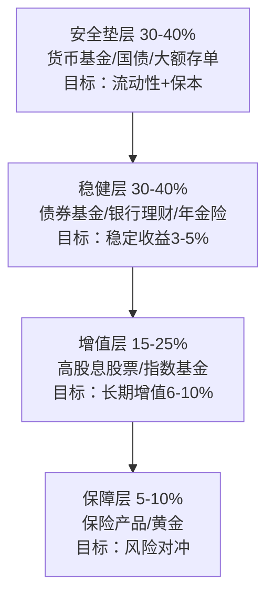
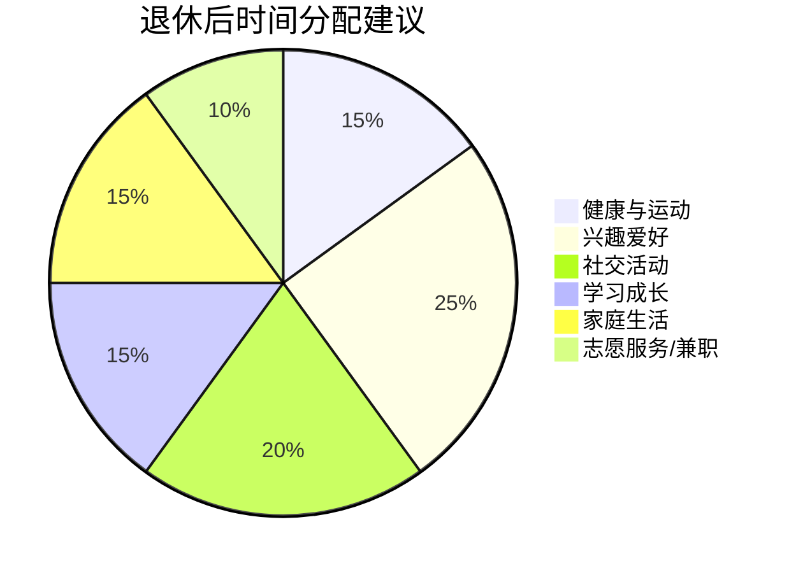

# 第二十章：50岁以上：收获期

> "退休不是人生的终点，而是新生活的起点。" —— 罗伯特·清崎

50岁以上是人生的收获期——前半生积累的职业资本、人脉资源、投资经验和物质财富，在这个阶段开始兑现为稳定的生活质量。但这并不意味着可以"躺平"：收入结构正在重塑，身体机能开始变化，通货膨胀持续侵蚀购买力，而人均寿命的延长意味着你需要为可能长达30-40年的退休生活做好准备。本章将从退休规划、资产配置、财富传承、风险防范、生活设计五个维度，为你构建一套完整的收获期搞钱体系。

***

## 20.1 阶段特点分析：认清你所处的财务位置

### 20.1.1 收入结构的根本性转变

50岁以上面临的核心财务变化不是"收入下降"，而是**收入结构的重塑**——从以劳动收入为主转向以被动收入为主。

**不同身份的收入现状**：

| 身份类型 | 50-55岁收入趋势 | 55-60岁收入趋势 | 退休后收入来源 |
|----------|-----------------|-----------------|---------------|
| 体制内职工 | 工资+绩效稳定或略降 | 可能提前退居二线 | 社保养老金+职业年金 |
| 民营企业员工 | 可能面临裁员或降薪 | 再就业难度大 | 社保养老金+个人储蓄 |
| 自由职业者 | 收入波动大，取决于客源 | 体力/精力下降影响产出 | 个人储蓄+投资收益 |
| 企业主 | 取决于企业经营状况 | 可能逐步交接 | 企业分红+投资收益 |
| 专业人士（医生/律师/会计） | 经验溢价，收入可能仍在上升 | 可选择性工作 | 咨询收入+养老金+投资 |

**收入结构转型的关键认知**：

收入的"量"可能下降，但收入的"质"应该提升——被动收入占比应从30%以下逐步提升到70%以上。这不是一个自然发生的过程，而是需要主动规划和执行的系统工程。如果你在50岁时被动收入占比仍然低于20%，说明前一阶段的积累不够充分，需要在接下来5-10年内集中发力弥补。

**中国特有的政策变量**：

- **延迟退休政策**：2025年起逐步实施，男性退休年龄从60岁延迟到63岁，女性从50/55岁延迟到55/58岁。这意味着你可能需要多工作3-5年，但同时也意味着更多的社保缴费和更高的养老金。
- **个人养老金制度**：2022年11月起在全国实施，每年最高缴存12000元，享受税收递延优惠。50岁以上人群应充分利用这一制度，在退休前尽可能多缴存。
- **社保养老金计发**：基础养老金=（当地上年度在岗职工月平均工资+本人指数化月平均缴费工资）÷2×缴费年限×1%。缴费年限每多1年，养老金增加约1个百分点。

### 20.1.2 家庭责任的重新分配

50岁以上的家庭结构正在发生深刻变化，这些变化直接影响你的财务决策。

**子女维度**：

- 子女已成年或即将成年，教育支出大幅减少（但可能仍有研究生学费、留学费用等尾部支出）
- 子女结婚买房可能需要大额资助（在中国尤其突出，一线城市首付动辄百万）
- 子女生育后可能需要帮忙带孙辈，影响自身的时间和收入安排

**父母维度**：

- 父母年事已高，可能需要长期照护
- 医疗费用可能大幅增加
- 如果父母失能，需要考虑护理院或居家护理的费用

**自身维度**：

- 医疗费用开始增加：50岁后体检异常指标增多，慢性病发病率上升
- 房贷可能已还清或接近还清，释放出可支配资金
- 生活开支相对稳定，但医疗和保健开支占比上升

**关键决策点**：这个阶段面临一个典型的"三明治困境"——上有老下有小，如何在赡养父母、资助子女和保障自身退休之间分配有限的资源？建议原则：**先保障自身退休，再考虑资助子女**。你可以在退休后继续通过劳动增加收入，但子女如果现在不学会独立，将来的问题只会更大。

### 20.1.3 经验优势与时间陷阱

**你的优势**：

- 30年以上的工作经验，对行业和市场有深刻理解
- 积累了广泛的人脉资源，这些人脉在退休后仍然有价值
- 有一定的资金积累和投资经验，知道什么是风险
- 对人生有更成熟的认知，不容易被短期波动左右情绪

**你需要注意的陷阱**：

- **过度自信陷阱**：过去的成功经验可能不适用于未来。20年前买房暴赚的经验，在当前市场环境下可能不再成立。
- **路径依赖陷阱**：习惯性地继续过去的投资方式，不愿意学习新的理财工具。
- **信息茧房陷阱**：只听自己信任的人的建议，忽略专业人士的意见。
- **健康时间陷阱**：以为自己还有很长时间准备，忽略了健康状况可能突然变化的风险。

### 20.1.4 风险承受能力的客观评估

50岁以上人群的风险承受能力评估，不能只看"年龄"这一个维度，而要综合考虑以下因素：

**风险承受能力评估矩阵**：

| 评估维度 | 高承受力 | 中承受力 | 低承受力 |
|----------|----------|----------|----------|
| 收入来源 | 有稳定被动收入覆盖支出 | 被动收入覆盖50-80%支出 | 主要依赖储蓄或子女 |
| 健康状况 | 身体健康，无重大疾病 | 有慢性病但控制良好 | 有重大疾病或失能风险 |
| 家庭负担 | 无负担，子女经济独立 | 需少量资助子女或父母 | 需大额赡养父母 |
| 负债情况 | 无负债 | 有少量负债 | 有大额负债 |
| 投资经验 | 有20年以上投资经验 | 有10年以上投资经验 | 投资经验不足5年 |

**评估结果与资产配置建议**：

- **高承受力**（满足4-5项）：可配置40-50%权益类资产
- **中承受力**（满足2-3项）：可配置20-30%权益类资产
- **低承受力**（满足0-1项）：权益类资产不超过15%

***

## 20.2 退休规划：用数字说话

退休规划不是一个模糊的概念，而是一个可以用精确数字描述的数学问题。以下是一套完整的退休规划方法论。

### 20.2.1 退休金需求的精确计算

**第一步：确定退休后每年生活费**

退休后生活费通常为退休前的70-80%，原因是：
- 不再需要通勤、职业装等与工作相关的开支
- 社保和公积金个人缴费部分不再扣除
- 但医疗费用会增加约20-30%
- 旅游和兴趣活动开支可能增加

**计算公式**：
```text
退休后年生活费 = 当前年支出 × 0.75 × （1 + 通货膨胀率）^ 距退休年数
```

**示例**：张女士，52岁，当前年支出15万元，计划60岁退休
- 退休后第一年生活费 = 15万 × 0.75 × (1+3%)^8 ≈ 14.3万元
- 考虑通胀调整后，实际需要约14.3万元/年（以退休第一年购买力计）

**第二步：计算退休金总需求**

退休金总需求 = 退休后年生活费 × 退休年限 × 调整系数

其中退休年限 = 预期寿命 - 退休年龄。根据国家统计局数据，2024年中国人均预期寿命为78.6岁，但50岁以上人群的实际预期寿命通常高于出生时的预期寿命（因为他们已经度过了婴幼儿和青年时期的死亡风险）。建议按85岁规划，留出安全边际。

**调整系数**考虑两个因素：
- 通货膨胀的复利效应（退休后每年的生活费会因通胀而增加）
- 投资收益的抵消效应（退休金在投资中也会产生收益）

简化计算：如果投资收益率略高于通胀率，调整系数约为1.0-1.2；如果投资收益率低于通胀率，调整系数可能达到1.3-1.5。

**示例续**：张女士退休年限 = 85 - 60 = 25年
- 退休金总需求 ≈ 14.3万 × 25 × 1.1 ≈ 393万元

**第三步：计算缺口**

退休金缺口 = 退休金总需求 - 社保养老金累计现值 - 企业年金累计现值 - 已有退休储蓄

### 20.2.2 社保养老金的精确估算

社保养老金是退休收入的基石，但很多人对自己的养老金水平没有清晰的认知。

**社保养老金计算方法**（以城镇职工基本养老保险为例）：

```text
月养老金 = 基础养老金 + 个人账户养老金

基础养老金 = 当地上年度在岗职工月平均工资 × (1 + 本人平均缴费指数) ÷ 2 × 缴费年限 × 1%

个人账户养老金 = 个人账户储存额 ÷ 计发月数
```

**计发月数对照表**：

| 退休年龄 | 计发月数 | 退休年龄 | 计发月数 |
|----------|----------|----------|----------|
| 50岁 | 195 | 58岁 | 152 |
| 55岁 | 170 | 60岁 | 139 |
| 63岁 | 117 | 65岁 | 101 |

**快速估算方法**：

如果你不确定自己的精确缴费指数，可以用以下简化公式快速估算：

```text
月养老金 ≈ 缴费年限 × 当地社平工资 × 1.5%（保守估计）
```

例如：缴费35年，当地社平工资8000元/月
- 月养老金 ≈ 35 × 8000 × 1.5% = 4200元/月
- 实际金额通常在4000-6000元之间，取决于缴费基数

**查询方式**：
1. 登录"国家社会保险公共服务平台"（si.12333.gov.cn）
2. 下载"掌上12333"APP
3. 到当地社保局窗口查询
4. 通过支付宝/微信的"社保查询"功能

### 20.2.3 退休金缺口的弥补策略

发现退休金缺口后，有以下弥补策略：

**策略一：延迟退休**

每延迟退休1年，效果是双重的：
- 多缴1年社保，增加基础养老金约1-1.5个百分点
- 多积累1年储蓄，减少退休金需求1年
- 少领1年养老金，增加个人账户积累

**策略二：提高缴费基数**

如果你的缴费基数低于实际工资，可以在政策允许的范围内提高缴费基数。每提高10%的缴费基数，退休后月养老金增加约200-500元。

**策略三：个人养老金账户**

每年缴存12000元到个人养老金账户，享受税收优惠：
- 年收入10万以下：每年节税约360-1200元
- 年收入30万以上：每年节税约3600-5400元
- 退休领取时按3%税率计税，享受税率差优惠

**策略四：补充商业养老保险**

年金险和增额终身寿险可以提供与生命等长的现金流，弥补社保养老金的不足。选择时关注：
- 保证利率（目前市场上较好的产品保证利率在2.5-3.0%）
- 现金价值（退保时能拿回多少钱）
- 领取方式（月领 vs 年领，固定 vs 递增）

### 20.2.4 医疗保障体系构建

50岁以上人群的医疗费用是退休规划中最大的不确定性因素。根据中国卫生健康委员会数据，60岁以上人群年均医疗费用是30-40岁人群的3-5倍。

**四层医疗保障体系**：

| 层级 | 保障类型 | 覆盖范围 | 年费用参考 |
|------|----------|----------|-----------|
| 第一层 | 城镇职工医保 | 住院报销70-90%，门诊报销50-70% | 单位+个人缴纳 |
| 第二层 | 大病保险 | 超过起付线的部分报销50-80% | 包含在医保中 |
| 第三层 | 商业医疗险（百万医疗） | 覆盖医保外费用，保额200-600万 | 50岁约1500-3000元/年，60岁约3000-6000元/年 |
| 第四层 | 重疾险/防癌险 | 确诊即赔，用于弥补收入损失 | 根据保额和年龄定价 |

**50岁以上医疗险购买要点**：

1. **优先保证续保**：选择保证续保15-20年的产品，避免因健康变化被拒保
2. **关注免赔额**：一般百万医疗险有1万元免赔额，可以选择0免赔的产品（保费更高）
3. **注意既往症限制**：如果有高血压、糖尿病等慢性病，需要选择承保既往症的产品
4. **防癌险是备选**：如果无法购买百万医疗险，防癌险的健康告知相对宽松

**长期护理保险**：

随着人口老龄化，长期护理保险正在逐步推广。2024年已有49个城市试点，覆盖约1.5亿人。如果你所在城市已试点，建议参加。如果没有，可以考虑商业长期护理险。

***

## 20.3 资产配置：保守不等于无为

50岁以上的资产配置核心原则是：**不是追求高收益，而是追求"够用"的收益**。什么叫"够用"？就是你的投资收益能够跑赢通胀，同时提供稳定的现金流。

### 20.3.1 资产配置的"金字塔模型"



**各层详解**：

**安全垫层（30-40%）**——你的"生命线"

这一层的目标不是赚钱，而是确保你在任何情况下都不会被迫卖出其他资产。金额应覆盖2-3年的生活费。

- **货币基金**：年化收益1.5-2.5%，随时可取，适合存放1年内可能用到的钱
- **国债**：3年期约2.5%，5年期约2.7%，安全性最高，适合存放1-5年不动的钱
- **大额存单**：起存20万，利率比普通定期高0.2-0.5个百分点，适合大额资金
- **银行活期/通知存款**：利率低但流动性最好，保留3-6个月生活费即可

**稳健层（30-40%）**——你的"主力收入"

- **纯债基金**：年化收益3-5%，波动小，适合长期持有。选择规模50亿以上、成立5年以上、基金经理任职3年以上的产品
- **银行理财产品**：R2级（稳健型）产品，年化收益3-4%，注意已经打破刚兑，需要选择底层资产透明的产品
- **增额终身寿险**：保额按固定比例（通常3.0%）逐年递增，兼具保障和储蓄功能，适合10年以上不动的资金
- **年金险**：约定年龄开始领取，提供与生命等长的现金流，适合弥补退休后的收入缺口

**增值层（15-25%）**——你的"抗通胀武器"

- **高股息股票**：银行、保险、电力、高速公路等行业的蓝筹股，股息率4-7%。长期持有，享受分红+股价温和上涨的双重收益
- **红利指数基金**：如中证红利指数基金，分散持有高股息股票，年化收益8-12%（含分红再投资）
- **沪深300指数基金**：代表中国经济的整体表现，适合定投，年化收益8-10%

**增值层操作要点**：
1. 不择时，采用定投策略平滑成本
2. 设定止盈线（年化收益达到15-20%时部分止盈）
3. 不追热点，不炒题材股
4. 控制仓位，任何时候权益类资产不超过总资产的25%

**保障层（5-10%）**——你的"保险杠"

- **黄金**：实物金或黄金ETF，占比5%左右，用于对冲极端风险
- **保险**：重疾险、意外险、定期寿险（如果还有负债或需要保障家人）

### 20.3.2 不同资产规模的配置方案

**方案一：总资产100万以下**

| 资产类别 | 配置比例 | 推荐产品 | 预期年化收益 |
|----------|----------|----------|-------------|
| 货币基金 | 20% | 余额宝/零钱通 | 1.5-2.5% |
| 国债/大额存单 | 30% | 3-5年期国债 | 2.5-2.7% |
| 债券基金 | 30% | 纯债基金 | 3-5% |
| 指数基金 | 15% | 红利指数基金 | 8-12% |
| 保险 | 5% | 百万医疗+意外险 | - |

**方案二：总资产100-500万**

| 资产类别 | 配置比例 | 推荐产品 | 预期年化收益 |
|----------|----------|----------|-------------|
| 货币基金+通知存款 | 15% | 货币基金+7天通知存款 | 1.5-2.5% |
| 国债+大额存单 | 25% | 国债+大额存单 | 2.5-3.0% |
| 债券基金+银行理财 | 25% | 纯债基金+R2理财 | 3-5% |
| 增额终身寿险/年金险 | 15% | 大公司增额寿 | 2.5-3.0% |
| 高股息股票+指数基金 | 15% | 银行股+红利ETF | 6-10% |
| 保险+黄金 | 5% | 重疾险+黄金ETF | - |

**方案三：总资产500万以上**

| 资产类别 | 配置比例 | 推荐产品 | 预期年化收益 |
|----------|----------|----------|-------------|
| 现金管理 | 10% | 货币基金+短期理财 | 2-3% |
| 固定收益 | 25% | 国债+信托+债券基金 | 3-5% |
| 保险储蓄 | 20% | 年金险+增额寿+家族信托 | 2.5-3.5% |
| 权益投资 | 20% | 高股息组合+指数增强 | 6-10% |
| 另类投资 | 15% | 私募债+REITs+黄金 | 4-8% |
| 房产 | 10% | 核心城市租赁房产 | 租金回报2-3% |

### 20.3.3 现金流管理：退休后的"发薪日"

退休后最大的心理变化是从"每月发工资"变成"自己给自己发工资"。建立一个稳定的"发薪日"机制非常重要。

**推荐的现金流管理方案**：

1. **建立三个账户**：
   - **日常账户**：存放3个月生活费，用于日常开支
   - **储备账户**：存放1-2年生活费，投资于货币基金和短期理财
   - **投资账户**：其余资金，投资于债券基金、股票基金等

2. **每月"发薪"流程**：
   - 每月1日，从储备账户转入日常账户一笔固定的"月薪"
   - 金额 = 退休后月生活费（如12000元）
   - 每季度从投资账户向储备账户补充资金
   - 每年做一次全面的资产检视和再平衡

3. **应急资金管理**：
   - 始终保持6个月生活费的应急储备
   - 应急资金放在货币基金中，随时可取
   - 遇到大额支出（如医疗）时，先用应急资金，再考虑卖出投资

### 20.3.4 通货膨胀的长期侵蚀

很多人低估了通货膨胀的破坏力。以3%的年通胀率计算：

| 当前年龄 | 当前月支出 | 60岁时月支出（3%通胀） | 70岁时月支出 | 80岁时月支出 |
|----------|-----------|----------------------|-------------|-------------|
| 50岁 | 10,000元 | 13,439元 | 18,061元 | 24,273元 |
| 52岁 | 10,000元 | 12,668元 | 17,024元 | 22,879元 |
| 55岁 | 10,000元 | 11,593元 | 15,580元 | 20,938元 |

这意味着如果你现在每月花1万元，到80岁时需要每月花2.4万元才能维持相同的生活水平。**这就是为什么即使在50岁以上，也不能把所有钱都放在银行定期里——你必须让资产跑赢通胀**。

***

## 20.4 财富传承：让财富跨越代际

财富传承不是"死后的事"，而是一个需要提前10-20年规划的系统工程。据招商银行《2023中国私人财富报告》，中国高净值人群中有超过60%的人尚未完成财富传承规划，这是一个巨大的风险敞口。

### 20.4.1 遗嘱：最基本但最容易被忽视的工具

**为什么必须立遗嘱**：

根据《民法典》规定，如果没有遗嘱，遗产将按照法定继承顺序分配：
- 第一顺序：配偶、子女、父母（平均分配）
- 第二顺序：兄弟姐妹、祖父母、外祖父母

法定继承的问题在于：
1. 可能不符合你的实际意愿（比如你想多给照顾你的小儿子一些）
2. 可能导致家庭纠纷（尤其是再婚家庭）
3. 可能导致财产外流（子女离婚时，继承的财产可能被分割）

**遗嘱的有效形式**（《民法典》第1134-1139条）：

| 遗嘱形式 | 要求 | 优缺点 |
|----------|------|--------|
| 自书遗嘱 | 亲笔书写，签名，注明年月日 | 最简单，但容易被质疑真实性 |
| 代书遗嘱 | 两个以上见证人，其中一人代书 | 适合书写困难者 |
| 打印遗嘱 | 两个以上见证人，每页签名注明年月日 | 清晰易读，但程序要求严格 |
| 录音录像遗嘱 | 两个以上见证人 | 直观，但技术要求高 |
| 公证遗嘱 | 到公证处办理 | 效力最强，但不再是优先效力 |
| 口头遗嘱 | 仅限危急情况，两个以上见证人 | 危急情况解除后应改用其他形式 |

**建议**：50岁以上应至少立一份**打印遗嘱+公证遗嘱**的组合，确保在任何情况下都有有效的遗嘱。

**遗嘱的关键内容**：

1. **财产清单**：列出所有不动产、银行存款、投资账户、保险、公司股权等
2. **分配方案**：明确每一项财产的继承人和分配比例
3. **附加条件**：如"房产由小儿子继承，但需承担母亲的养老责任"
4. **遗嘱执行人**：选择一个你信任的人来执行遗嘱
5. **债务处理**：明确债务如何处理（遗产应先清偿债务再分配）

### 20.4.2 赠与策略：生前传承的税务优化

**房产赠与 vs 继承 vs 买卖的税费对比**：

| 方式 | 契税 | 个人所得税 | 增值税 | 适用场景 |
|------|------|-----------|--------|---------|
| 赠与（直系亲属） | 3% | 免征 | 免征 | 子女无购房资格时 |
| 继承 | 法定继承人免征 | 免征 | 免征 | 成本最低，但需身后办理 |
| 买卖 | 1-3% | 满五唯一免征 | 满二免征 | 子女有购房资格时 |

**赠与的注意事项**：

1. **赠与后不可撤销**：一旦完成过户，赠与不可撤销（除非受赠人严重侵害赠与人权益）
2. **子女离婚风险**：赠与子女的财产，如果子女离婚，可能被配偶分割。解决方案：在赠与合同中明确"仅赠与给己方子女个人，不属于夫妻共同财产"
3. **赠与税**：中国目前没有遗产税和赠与税，但未来可能会开征。如果担心遗产税，可以考虑分批赠与

**生前赠与的策略性安排**：

- **分年赠与**：每年赠与一定金额，降低单次赠与的金额，降低风险
- **购房出资**：为子女购房出资，在房产证上注明出资份额
- **设立共同账户**：与子女共同持有某些资产，避免过户手续

### 20.4.3 信托：高净值家庭的标配

**什么是家族信托**：

家族信托是将资产（现金、房产、股权等）转移给信托公司管理，由信托公司按照你设定的条件和规则，将收益分配给你指定的受益人。

**家族信托的核心功能**：

1. **资产隔离**：信托资产与委托人的其他资产隔离，不受委托人债务、离婚、诉讼等影响
2. **定向传承**：可以设定复杂的分配条件，如"子女满30岁分配30%，满40岁分配30%，满50岁分配剩余40%"
3. **防止挥霍**：可以限制受益人每期领取的金额，防止一次性挥霍
4. **税务筹划**：在遗产税开征后，信托资产可能不计入遗产

**家族信托的门槛和费用**：

| 项目 | 说明 |
|------|------|
| 最低设立金额 | 通常1000万元起（部分银行300万起） |
| 管理费 | 通常为信托资产的0.5-1%/年 |
| 设立费用 | 通常为信托资产的1-2%（一次性） |
| 信托期限 | 通常为10-50年，可以是永续 |

**保险金信托**：

如果家族信托的门槛太高，可以考虑保险金信托——将大额寿险的保险金纳入信托管理。门槛通常为100-300万元保费，兼具保险的杠杆功能和信托的传承功能。

### 20.4.4 财富传承的常见误区

**误区一："我还年轻，不需要现在考虑传承"**

事实：意外和疾病不等人。50岁以上应该立即开始传承规划，至少立好遗嘱和指定保险受益人。

**误区二："把钱都给子女就行了"**

事实：简单的"给钱"可能导致子女挥霍、离婚分割、债务追偿等问题。需要通过信托、赠与合同等工具进行结构化安排。

**误区三："有遗嘱就够了"**

事实：遗嘱只解决"谁继承"的问题，不解决"如何管理和保护"的问题。对于大额资产，还需要信托、保险等工具配合。

**误区四："传承规划是一次性的事"**

事实：传承规划需要每3-5年检视一次，根据家庭情况变化（如子女结婚、离婚、生育）和法律变化（如遗产税政策）进行调整。

***

## 20.5 风险防范：守住你的钱袋子

50岁以上人群是金融诈骗的高发目标。据公安部数据，60岁以上老年人遭遇电信诈骗的比例是其他年龄段的2.3倍。守住钱袋子，比赚更多钱更重要。

### 20.5.1 常见诈骗类型与防范

**高收益理财骗局**：

- **特征**：承诺年化收益10%以上，保本保息，推荐有奖
- **话术**："银行存款利率太低了，我们这个产品收益是银行的5倍"
- **防范**：记住一个铁律——**任何承诺"保本保息+高收益"的产品都是骗局**。银行存款利率是2%左右，如果有人承诺10%以上的"保本"收益，要么是骗局，要么是违法集资

**以房养老骗局**：

- **特征**：诱骗老人将房产抵押贷款，贷款资金用于投资"高收益项目"
- **话术**："把房子抵押出去，每月给你高利息，房子还是你的"
- **防范**：不要将房产抵押给任何非银行金融机构。以房养老只有正规保险公司才能提供，且目前仍在试点阶段

**养老床位预售骗局**：

- **特征**：预售养老院床位，承诺高额回报或优先入住权
- **话术**："现在交30万，以后每月返还5000元，还能优先入住我们的养老院"
- **防范**：核实养老机构的资质和经营状况。预付款不要超过3个月的费用

**保健品骗局**：

- **特征**：夸大保健品功效，声称可以治疗各种疾病
- **话术**："这个产品是诺贝尔奖团队研发的，可以治愈糖尿病/高血压/癌症"
- **防范**：保健品不是药品，不能替代药物治疗。购买前咨询医生

### 20.5.2 资产安全的制度性保障

**银行存款保险**：

- 每家银行最高赔付50万元（包括本金和利息）
- 如果你在某家银行的存款超过50万元，建议分散到多家银行
- 注意：银行理财产品不受存款保险保护

**保险保障基金**：

- 保险公司破产时，保单由保障基金兜底
- 人寿保险合同会转移到其他保险公司继续执行
- 但投资连结险和万能险的投资账户部分不受保护

**证券投资者保护基金**：

- 证券公司破产时，投资者的证券和资金由保护基金兜底
- 单个投资者最高赔付50万元

### 20.5.3 认知衰退与财务决策

50岁以上需要正视一个事实：随着年龄增长，认知能力会逐渐下降。研究表明，金融决策能力在53岁左右达到峰值，之后开始缓慢下降。

**应对策略**：

1. **提前简化财务结构**：在认知能力尚好时，将复杂的投资组合简化为容易管理的组合
2. **建立自动化的财务系统**：设置自动转账、自动扣款、自动续保等
3. **指定财务代理人**：通过"意定监护"制度，指定一个你信任的人在你丧失行为能力时代为管理财务
4. **定期检视**：每半年进行一次全面的财务检视，确保所有账户和投资都在正常运作

***

## 20.6 收入来源多元化：退休后仍然可以赚钱

退休不意味着收入归零。事实上，50岁以上的人拥有年轻人不具备的资源——经验、人脉、信用和时间。关键是如何将这些资源转化为收入。

### 20.6.1 经验变现

**咨询顾问**：

如果你在某个领域有30年以上的经验，可以担任企业的外部顾问或独立董事。按小时收费通常在500-2000元/小时，按月收费通常在5000-30000元/月。

**知识付费**：

- 在知乎、得到、喜马拉雅等平台开设课程
- 撰写行业文章或出版书籍
- 开设培训讲座

**技能传承**：

- 担任行业协会的专家委员
- 在大学或培训机构担任兼职讲师
- 指导年轻创业者

### 20.6.2 资产变现

**房产相关**：

- 出租闲置房产，获取租金收入
- 将大房子换成小房子，释放差价用于投资
- 利用房屋进行民宿经营（如果有旅游热点城市的房产）

**投资相关**：

- 高股息股票的分红收入
- 债券和理财产品的利息收入
- 年金险的定期领取

### 20.6.3 兴趣变现

很多退休人士将兴趣转化为收入来源：

- **书法/绘画**：开设书法班或出售作品
- **摄影**：出售摄影作品或担任摄影指导
- **园艺**：开设园艺课程或经营小型花圃
- **烹饪**：开设烹饪课程或经营私房菜
- **旅游**：担任旅游顾问或撰写旅游攻略

### 20.6.4 退休后收入的税务优化

退休后收入的税务处理需要注意：

| 收入类型 | 税务处理 | 优化建议 |
|----------|----------|---------|
| 社保养老金 | 免征个人所得税 | 无需优化 |
| 企业年金 | 按月领取免税额度后征税 | 合理安排领取时间 |
| 个人养老金 | 领取时按3%征税 | 充分利用缴存时的税收优惠 |
| 租金收入 | 按20%税率，可扣除相关费用 | 合理扣除维修费、管理费等 |
| 投资收益 | 股票分红持股1年以上免税 | 长期持有高股息股票 |
| 劳务报酬 | 按20-40%税率 | 每次收入不超过800元免税 |

***

## 20.7 生活设计：退休后的人生下半场

退休后的生活不仅仅是"不上班"，而是一个全新的人生阶段。如何设计这个阶段的生活，直接关系到你的幸福感和健康状况。

### 20.7.1 退休后的身份转换

从"职业身份"到"个人身份"的转换，是退休后最大的心理挑战。很多人在退休后感到失落、空虚、无所适从，甚至出现抑郁症状。

**身份转换的四个阶段**：

1. **蜜月期**（退休后0-6个月）：感到自由和兴奋，享受不用上班的生活
2. **失落期**（退休后6-18个月）：开始感到空虚，怀念工作时的社交和成就感
3. **调整期**（退休后18-36个月）：逐渐找到新的生活节奏和兴趣
4. **稳定期**（退休后3年以上）：完全适应退休生活，找到新的人生意义

**加速身份转换的方法**：

- 在退休前就开始培养兴趣爱好和社交圈
- 退休后立即开始参与志愿者活动或社区建设
- 设定一些小目标，保持生活的方向感
- 与同龄人交流，分享退休生活的经验

### 20.7.2 健康管理的系统化

50岁以上的健康管理不是"有病治病"，而是一个预防、监测、干预的完整体系。

**年度健康管理清单**：

| 时间 | 项目 | 频率 | 备注 |
|------|------|------|------|
| 每年1月 | 全面体检 | 1次/年 | 包含肿瘤标志物、心脑血管检查 |
| 每季度 | 血压/血糖监测 | 4次/年 | 如有慢性病，每月监测 |
| 每半年 | 牙科检查 | 2次/年 | 50岁以上牙周病高发 |
| 每年 | 眼科检查 | 1次/年 | 白内障、青光眼筛查 |
| 每年 | 骨密度检查 | 1次/年 | 50岁以上骨质疏松高发 |
| 每3年 | 肠镜检查 | 1次/3年 | 结直肠癌筛查 |

**运动方案**：

50岁以上的运动应以"安全、持续、适度"为原则：

- **有氧运动**：快走、游泳、骑车，每周3-5次，每次30-45分钟
- **力量训练**：哑铃、弹力带、自重训练，每周2-3次，防止肌肉流失
- **柔韧性训练**：瑜伽、太极、拉伸，每天10-15分钟
- **平衡训练**：单脚站立、太极，每周2-3次，预防跌倒

**跌倒预防**——50岁以上最大的健康风险之一：

- 每年有约30%的65岁以上老人发生跌倒
- 跌倒是老年人意外死亡的首要原因
- 预防措施：定期检查视力、改善家居照明、安装扶手、穿防滑鞋、进行平衡训练

### 20.7.3 社交圈的重建与维护

退休后社交圈会自然缩小，因为工作关系是很多人主要的社交渠道。主动重建和维护社交圈对心理健康至关重要。

**社交圈重建策略**：

1. **兴趣社群**：加入读书会、摄影俱乐部、书法协会、登山队等
2. **社区参与**：参加居委会活动、社区志愿者、业主委员会
3. **同学聚会**：定期参加同学聚会，维系老朋友关系
4. **代际交流**：与年轻人交流，保持思维的活跃性
5. **线上社群**：加入微信群、论坛等线上社群，扩大社交范围

**社交对健康的影响**：

哈佛大学长达85年的研究表明，良好的社交关系是健康长寿的最重要因素之一。社交活跃的老年人：
- 认知衰退速度减缓40%
- 抑郁症发生率降低50%
- 平均寿命延长5-7年

### 20.7.4 退休后的时间管理

退休后最大的资源是时间，但如果不善加管理，时间反而会成为负担。

**推荐的退休后时间分配**：



**每日作息建议**：

| 时间段 | 活动 | 备注 |
|--------|------|------|
| 6:30-7:00 | 起床，晨间拉伸 | 保持规律作息 |
| 7:00-7:30 | 早餐 | 营养均衡 |
| 7:30-8:30 | 晨练（快走/太极） | 每天保持 |
| 8:30-11:30 | 兴趣活动/学习/兼职 | 高效时段做有价值的事 |
| 11:30-13:00 | 午餐+午休 | 午休不超过30分钟 |
| 13:00-17:00 | 社交/兴趣/志愿服务 | 灵活安排 |
| 17:00-18:00 | 散步/运动 | 适度运动 |
| 18:00-19:00 | 晚餐 | 清淡为主 |
| 19:00-21:00 | 阅读/家庭/娱乐 | 放松时间 |
| 21:00-22:00 | 准备入睡 | 保证7-8小时睡眠 |

***

## 20.8 实战案例

### 案例一：工薪阶层的退休规划——王叔的稳健之路

**背景**：
王叔，56岁，某二线城市国企中层干部，月薪15000元。妻子52岁，某事业单位退休，退休金4500元/月。独子已工作，在一线城市租房生活。家庭资产：自住房一套（市值180万），存款60万，基金20万，无负债。

**退休规划**：

王叔计划60岁退休，需要解决的核心问题是：退休后夫妻二人每月需要多少生活费，现有资产能否支撑。

**生活费计算**：
- 当前家庭月支出：约12000元（含日常开支、人情往来、旅游等）
- 退休后预计月支出：10000元（减少了通勤、职业装等开支，但医疗开支增加）
- 考虑4年后退休（3%通胀）：10000 × (1.03)^4 ≈ 11255元/月

**收入测算**：
- 王叔退休金（预估）：约6500元/月（缴费32年，缴费指数1.0）
- 妻子退休金：4500元/月
- 夫妻合计养老金：11000元/月

**资产规划**：
- 存款60万：将30万转为3年期国债，30万购买货币基金（应急备用）
- 基金20万：继续保持，每年分红再投资
- 王叔退休后将公积金余额（约25万）取出，购买增额终身寿险

**执行结果**（退休后第1年）：
- 月养老金收入：11000元
- 月生活费支出：11255元
- 月缺口：255元（由投资收益补充）
- 应急储备：货币基金30万（可支撑2年以上）
- 投资资产：国债30万 + 基金约25万 + 增额寿25万 = 80万

**关键经验**：
1. 工薪阶层的退休规划核心是社保养老金，必须确保缴费年限足够长
2. 不要忽视公积金——退休时可以一次性提取，是一笔不小的"意外之财"
3. 老夫妻双方的养老金加在一起，通常可以覆盖基本生活费
4. 建立3-6个月的应急储备，避免被迫卖出投资

### 案例二：企业主的财富传承——陈总的家族信托

**背景**：
陈总，58岁，某制造业企业创始人，企业年营收约5000万，个人可投资资产约3000万。妻子55岁，全职太太。一儿一女，儿子32岁在企业任职，女儿28岁在北京从事金融工作。陈总担心的问题：自己退休后企业如何交接？财产如何在两个孩子之间公平分配？如何防止儿子离婚导致家族资产外流？

**财富传承方案**：

**第一步：企业交接**（5年内完成）
- 逐步将企业股权转移给儿子（赠与方式，需要税务筹划）
- 设立家族委员会，由陈总、妻子、儿子、女儿共同参与重大决策
- 聘请职业经理人担任总经理，儿子担任董事长

**第二步：家族信托**（设立1000万信托）
- 信托资产：1000万现金
- 委托人：陈总
- 受益人：妻子、儿子、女儿
- 分配规则：
  - 妻子每月领取5万元生活费
  - 儿子和女儿各每月领取2万元
  - 子女生育孙辈时，每个孙辈获得50万元教育基金
  - 信托存续期50年

**第三步：保险规划**
- 为妻子购买增额终身寿险，保额500万，指定女儿为受益人
- 为自己购买年金险，年交50万，交5年，65岁开始领取

**第四步：遗嘱**
- 立公证遗嘱，明确企业股权由儿子继承
- 房产由妻子和两个孩子平均分配
- 指定律师为遗嘱执行人

**效果**：
1. 企业顺利交接给儿子，但通过家族委员会保持了陈总的影响力
2. 家族信托确保了妻子和子女的基本生活保障
3. 保险规划为女儿提供了独立的资产，避免了"重男轻女"的争议
4. 遗嘱明确了财产分配，减少了家庭纠纷的可能性

### 案例三：普通退休人员的"以小博大"——刘阿姨的副业之路

**背景**：
刘阿姨，53岁，某服装厂退休工人，退休金3200元/月。丈夫55岁，建筑工地工人，收入不稳定。儿子在外地打工，收入不高。家庭资产：自住房一套（市值60万），存款15万，无负债。

**挑战**：
退休金3200元，夫妻二人月支出约5000元，缺口1800元/月。

**解决方案**：

刘阿姨利用自己的缝纫技能，在小区门口开设了一个"改衣缝补"的小摊位：
- 改裤脚：15-20元/条
- 换拉链：20-30元/条
- 缝补衣物：10-30元/件
- 定制窗帘/床品：200-500元/套

**收入情况**：
- 月均接单量：约150-200单
- 月均收入：3000-4000元
- 工作时间：每天上午9点到下午4点，周日休息

**财务改善**：
- 退休金：3200元/月
- 副业收入：3500元/月
- 丈夫临时收入：约2000元/月
- 家庭月收入：8700元
- 家庭月支出：5000元
- 月结余：3700元

**资产增长**：
- 3年后存款从15万增长到约30万
- 将20万购买国债（年收益约5000元）
- 10万留在货币基金作为应急储备

**关键经验**：
1. 不要小看"小钱"——每月多赚3000元，一年就是3.6万
2. 利用已有的技能，不需要额外学习成本
3. 选择门槛低、投入小的副业
4. 稳定的副业收入可以显著降低退休焦虑

***

## 20.9 常见误区与避坑指南

### 误区一：过度节俭，影响生活质量

**典型表现**：
- 为了省钱不舍得开空调，导致中暑住院
- 为了省钱不吃新鲜水果蔬菜，导致营养不良
- 为了省钱不看病，小病拖成大病

**纠正方法**：
- 制定合理的支出预算，区分"必要支出"和"可选支出"
- 健康相关的支出是"投资"而非"消费"——花1000元做体检，可能省下10万元的医疗费
- 允许自己享受生活，但要有计划、有节制

### 误区二：把所有钱存银行定期

**问题分析**：
- 银行3年定期利率约2.0%，而通胀率约3%
- 实际购买力每年缩水约1%
- 30年后，100万元的实际购买力只相当于现在的约74万元

**纠正方法**：
- 至少将30-40%的资金投资于收益更高的产品
- 建立"核心+卫星"的投资组合——核心部分追求稳定，卫星部分追求增值
- 不要把所有鸡蛋放在一个篮子里

### 误区三：盲目追求高收益

**典型表现**：
- 听信"内幕消息"炒股
- 投资不熟悉的领域（如虚拟货币、海外投资）
- 把养老金投入高风险的P2P或私募产品

**纠正方法**：
- 记住一个公式：**高收益 = 高风险 + 低流动性**（不可能三者兼得）
- 任何投资之前，先问自己三个问题：这个产品的底层资产是什么？谁在管理？如果亏了怎么办？
- 不投自己看不懂的东西

### 误区四：忽视保险配置

**典型表现**：
- "我有社保就够了"
- "买保险是浪费钱"
- "我身体很好，不需要保险"

**纠正方法**：
- 社保只是基础保障，大病和意外的自付部分可能高达数十万元
- 50岁以上购买保险的性价比确实下降，但风险也在上升——这恰恰是需要保险的时候
- 优先配置百万医疗险和意外险，保费低、保障高

### 误区五：过早将财产全部转移给子女

**典型表现**：
- 将房产过户给子女，自己"寄人篱下"
- 将存款全部给子女保管
- 为子女担保贷款

**纠正方法**：
- **永远不要在活着的时候失去对资产的控制权**
- 可以赠与，但要保留足够的生活保障
- 不要为子女的债务担保——如果子女还不上，你的房子和存款都可能被追偿
- 赠与合同中要明确"仅赠与给己方子女个人"

### 误区六：忽略精神健康

**典型表现**：
- 退休后感到空虚，但不愿意承认
- 不愿意参加社交活动，越来越封闭
- 对生活失去兴趣，整天看电视或睡觉

**纠正方法**：
- 退休后的精神健康和身体健康同等重要
- 主动培养兴趣爱好，建立新的社交圈
- 如果持续感到空虚或抑郁，不要讳疾忌医——心理咨询和治疗是有效的
- 参加志愿者活动，帮助他人可以提升自我价值感

***

## 20.10 50岁以上搞钱的黄金法则

### 法则一：安全第一，收益第二

50岁以上投资的第一原则是"不亏钱"。因为你的收入能力在下降，亏损后很难通过劳动收入弥补。一个简单的道理：亏损50%后需要上涨100%才能回本，而你的投资周期可能不足以等待回本。

### 法则二：现金流为王

退休后的财务安全不取决于你的总资产，而取决于你的现金流。即使你有1000万的资产，如果全部锁在房产里无法变现，你仍然可能面临"有钱但花不了"的困境。确保每月有稳定的现金流覆盖生活费。

### 法则三：简单胜于复杂

越简单的投资策略，越容易执行和坚持。不要追求复杂的金融工程——一个包含国债、债券基金、高股息股票和货币基金的简单组合，足以满足大多数50岁以上人群的需求。

### 法则四：传承要趁早

不要等到"准备好了"再做传承规划——你永远不会"准备好"。至少先立一份遗嘱，指定保险受益人，然后逐步完善。

### 法则五：健康是最大的资产

一场大病可以让你的退休规划彻底崩塌。保持健康的生活方式、定期体检、购买足够的保险，是保护财富的最有效方式。

### 法则六：享受当下的生活

钱是为人服务的，不是人为钱服务的。在确保基本安全的前提下，不要过度节俭，不要过度焦虑。你辛苦了一辈子，值得享受一个有质量的退休生活。

***

## 本章小结

50岁以上是搞钱的收获期，核心任务是**守成、传承、享受**三位一体：

1. **退休规划**：用精确数字计算退休金需求，通过社保+企业年金+个人养老金+商业保险四层保障确保收入覆盖支出
2. **资产配置**：采用金字塔模型，安全垫层30-40%保障流动性，稳健层30-40%提供稳定收益，增值层15-25%对抗通胀，保障层5-10%对冲极端风险
3. **财富传承**：遗嘱+赠与+信托+保险四管齐下，提前10年开始规划，每3-5年检视更新
4. **风险防范**：建立防诈骗意识，利用存款保险等制度保障，提前应对认知衰退
5. **收入多元化**：利用经验、资产和兴趣创造退休后的被动收入
6. **生活设计**：做好身份转换、健康管理、社交重建和时间管理

记住，50岁以上的搞钱不是"赚更多"，而是"用好已有的"。通过稳健的资产配置、科学的传承规划和有质量的生活设计，你可以在这个阶段真正实现财务自由——不是拥有花不完的钱，而是拥有用不完的选择。

***

## 推荐资源

### 书籍
- 《聪明的投资者》—— 本杰明·格雷厄姆（价值投资的圣经，适合长期投资者）
- 《漫步华尔街》—— 伯顿·马尔基尔（理解市场效率和指数投资）
- 《家族财富传承》—— 刘彦斌（中国本土的财富传承指南）
- 《百岁人生》—— 琳达·格拉顿（长寿时代的退休规划）
- 《最好的告别》—— 阿图·葛文德（关于衰老和死亡的深刻思考）

### 课程
- 中国理财规划师协会：退休规划专业课程
- 中国保险行业协会：保险规划师认证课程
- 各大银行私人银行部：高净值客户财富管理课程

### 工具
- 国家社会保险公共服务平台（si.12333.gov.cn）：查询社保缴纳情况和预估养老金
- 个人养老金信息管理服务平台：查询个人养老金账户
- 各大银行APP的退休规划计算器：模拟退休后的收支情况
- 中国裁判文书网（wenshu.court.gov.cn）：查询涉老诈骗案例，提高防骗意识

***

*接下来，我们将提供附录，包括搞钱资源大全、行动清单和常见问题解答。*
