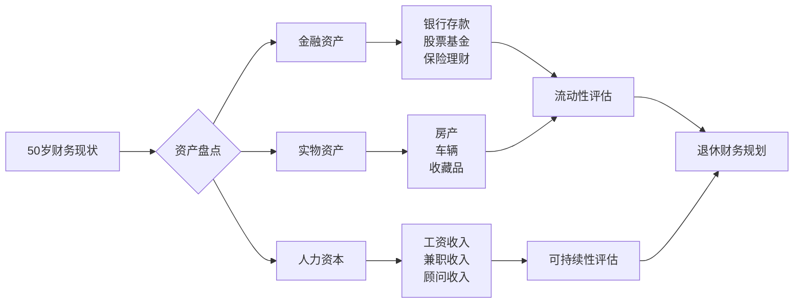
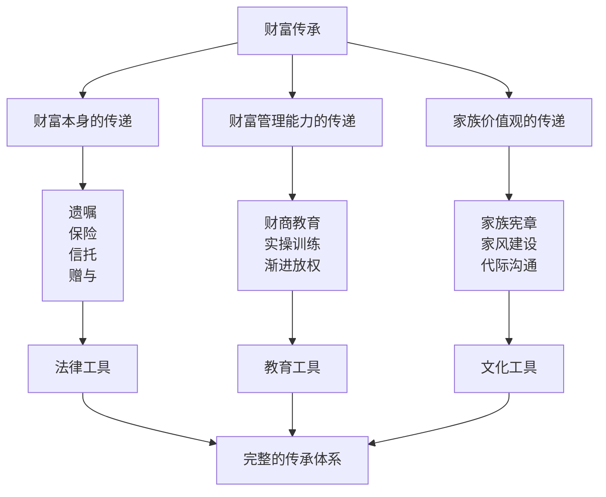
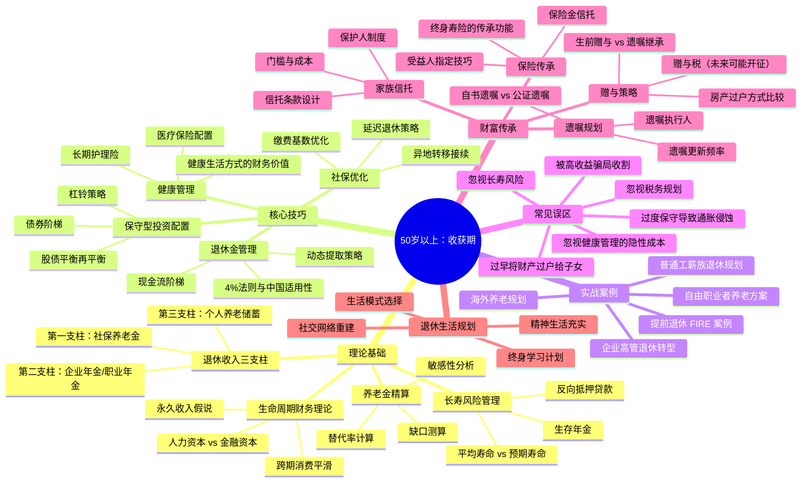

# 第20章 50岁以上：收获期

## 为什么50岁以上需要从"稳健"转向"收获"？

50岁以后，人生进入了真正的"收获期"。如果说40-50岁是"匀速跑"，那么50岁以后就是"冲刺后慢跑过线"——你不再需要拼速度，而是要确保以最好的状态跑完全程，同时享受沿途的风景。

这个阶段，你可能已经积累了相当的财富，但面临的挑战也更加紧迫：退休倒计时已经开始，身体机能明显下降，医疗支出逐渐增加，子女可能已经独立但父母需要更多照顾。你的财富策略需要从"稳健增长"转向"保全收获"——保护已有的财富，合理安排支出，享受劳动成果，同时为下一代做好传承准备。

### 生命周期财务理论：为什么"收获"是必然阶段

诺贝尔经济学奖得主弗兰科·莫迪利亚尼（Franco Modigliani）提出的**生命周期假说**（Life-Cycle Hypothesis）是理解这一阶段的理论基石。该理论认为，人的一生可以划分为三个财务阶段：

| 阶段 | 年龄段 | 收入 vs 支出 | 财务策略 | 核心矛盾 |
|------|--------|-------------|---------|----------|
| 积累期 | 25-40岁 | 收入逐渐超过支出 | 积极投资、扩大资产规模 | 时间 vs 资本 |
| 巩固期 | 40-50岁 | 收入达到峰值 | 稳健投资、降低负债 | 增长 vs 安全 |
| 收获期 | 50岁以上 | 收入下降，支出结构性变化 | 保全资产、创造现金流 | 安全 vs 生活质量 |

50岁以后，你的**人力资本**（未来劳动收入的现值）大幅缩水，而**金融资本**（已积累的资产）成为生活的主要依靠。假设你55岁退休、活到85岁，你需要让现有的财富支撑30年的支出——这还不考虑通胀侵蚀。这就是为什么"收获"不是消极地守钱，而是需要精密规划的系统工程。

### 中国50+人群的现实画像

根据国家统计局和各大研究机构的数据，中国50岁以上人群面临以下典型财务特征：

**收入结构变化：**
- 50-55岁：工资收入仍为主要来源，但增速放缓甚至停滞
- 55-60岁：部分人开始领取退休金，收入断崖式下降
- 60岁以上：社保养老金成为主要收入来源，替代率约为40%-60%

**支出结构变化：**
- 医疗支出占比从30岁时的5%-8%上升到50岁后的15%-25%
- 子女教育支出下降，但子女婚房、创业等大额支出可能集中爆发
- 父母赡养费用进入高峰期
- 日常消费下降，但品质消费和健康消费上升

**资产结构特征：**
- 房产占总资产比例过高（多数家庭超过70%），流动性差
- 金融资产配置单一，大量资金沉淀在银行存款中
- 投资经验虽丰富，但容易陷入"经验陷阱"——用过去的经验应对未来的市场

**心理特征：**
- 风险承受能力下降，对亏损的容忍度大幅降低
- "损失厌恶"心理加剧——亏损100元的痛苦远大于赚100元的快乐
- 对新事物的学习意愿下降，容易成为金融诈骗的目标

## 本章核心观点

### 观点一：从积累到收获——思维模式的根本转变

50岁以后，你的核心任务不再是"赚更多钱"，而是"把已有的钱管好"。经过二三十年的积累，你已经有了相当的财富基础。现在的关键是：如何让这些财富安全地支撑你未来20-30年甚至更长时间的生活。

**为什么要转变？** 因为复利的反面同样残酷。如果你在50岁时拥有500万资产，遭遇一次-30%的亏损（变成350万），要恢复到500万需要约43%的收益率。在保守配置下，这可能需要5-8年。而你可能只有10-15年就要退休，没有时间等待市场回升。

**如何转变？** 建立"收入思维"替代"增长思维"——不再问"我的资产今年涨了多少"，而是问"我的资产能产生多少稳定的现金流"。这是从"纸面富贵"到"落袋为安"的关键一步。

### 观点二：从增长到保全——投资逻辑的彻底重塑

这个阶段，投资的首要目标从"增长"变为"保全"。你已经没有足够的时间来弥补重大投资亏损。一次-30%的损失，可能意味着你需要延迟退休5年甚至更久。因此，安全性和流动性比收益率更重要。

**保全不等于保守。** 很多人误以为"保全"就是把所有钱存银行。但在年通胀率3%的情况下，100万存银行20年的购买力只剩下约55万。真正的保全是：在控制风险的前提下，让资产收益率至少跑赢通胀。

**保全的核心框架：**
- **安全垫**：保留2-3年生活费在货币基金或短期存款中，确保即使市场暴跌也不需要割肉
- **核心配置**：60%-70%资产配置在低风险产品（国债、高等级债券、银行理财）
- **卫星配置**：10%-20%资产配置在中等风险产品（指数基金、蓝筹股），对冲通胀
- **保障配置**：10%-15%资产用于保险（重疾险、医疗险、长期护理险），转移极端风险

### 观点三：从个人到家庭——财务视角的全面扩展

50岁以后，你的财务决策不仅影响自己，更影响整个家庭——配偶的退休生活、父母的养老安排、子女的婚姻购房支持、孙辈的教育基金。你需要建立一个"家庭财务全景图"，统筹安排各项资金需求。

**家庭财务全景图的核心要素：**

| 家庭成员 | 资金需求 | 时间窗口 | 优先级 | 预估金额 |
|---------|---------|---------|-------|---------|
| 自己 | 退休生活费、医疗费 | 55-85岁 | 最高 | 300-500万 |
| 配偶 | 退休生活费、医疗费 | 55-85岁 | 最高 | 300-500万 |
| 父母 | 赡养费、医疗费、护理费 | 现在-未来10-15年 | 高 | 50-150万/人 |
| 子女 | 婚房首付、创业资金 | 未来5-10年 | 中 | 50-200万 |
| 孙辈 | 教育基金 | 未来10-20年 | 低 | 20-50万/人 |

这张表不是要让你焦虑，而是让你清楚地知道：钱从哪里来、到哪里去、什么时候需要。只有看清全局，才能做出合理的分配决策。

### 观点四：从工作到生活——退休规划的提前启动

退休不再是一个遥远的概念，而是即将到来的现实。你需要提前规划退休后的生活方式——住在哪里？做什么事情？和谁在一起？这些问题的答案将直接影响你的财务规划。

**退休生活的四种模式：**

1. **居家养老型**：留在熟悉的城市和社区，日常开销较低但需要考虑适老化改造
2. **旅居养老型**：在不同城市或国家轮换居住，需要更高的预算和健康保障
3. **社区养老型**：入住高品质养老社区，需要提前排队和大额押金
4. **候鸟养老型**：冬去南方、夏去北方，需要两地住房或租房预算

每种模式的年开销差异巨大：居家养老可能每年10-15万即可，而旅居养老可能需要20-40万。提前确定模式，才能精准测算资金需求。

### 观点五：从赚钱到传承——财富的跨代传递

财富传承是50岁以后最重要的财务课题之一。你积累的财富如何安全、高效地传递给下一代？如何避免"富不过三代"的魔咒？如何在传承财富的同时传承价值观和能力？

**传承的三个层次：**

只做第一层（财富传递），不做第二层和第三层，就是"富不过三代"的根源。你的孩子如果没有管理财富的能力和正确的金钱观，再多的遗产也会被挥霍一空。

## 本章学习目标

读完本章，你将能够：

1. **理解50+人群的财务特征**：掌握生命周期财务理论，清晰认识自己所处的阶段和核心挑战
2. **掌握退休收入规划方法**：熟练运用社保+企业年金+个人储蓄的三支柱模型，测算退休收入缺口
3. **建立保守型投资策略**：学会资产配置的"杠铃策略"，在安全性和收益性之间找到平衡点
4. **规划财富传承方案**：了解遗嘱、保险、信托、赠与等工具的优劣，制定适合自身情况的传承计划
5. **识别退休财务陷阱**：认识常见的财务误区和金融骗局，避免重大决策失误
6. **构建退休生活全景**：将财务规划融入健康、心理、社交、精神等多个维度，实现有品质的晚年生活

## 适合谁读？

**主要读者：**
- 50-60岁，即将退休或刚退休的人群——本章将帮助你系统规划退休前后的财务安排
- 已退休但尚未做好完整规划的人——任何时候开始规划都不晚，本章提供补救方案
- 开始认真规划财富传承的家庭——提前10-20年规划传承，可以大幅节省税费和减少纠纷

**次要读者：**
- 40-50岁，想提前了解下一阶段挑战的人——未雨绸缪，提前5-10年准备
- 子女——帮助父母理解退休财务，促进家庭财务对话
- 财务顾问——了解50+客户的核心需求和沟通方式

**不建议阅读的人：**
- 30岁以下且无家庭负担的人——优先阅读本书的积累期和巩固期章节
- 期望"一夜暴富"策略的人——本章不提供高风险投机方案

## 本章知识地图

## 本章结构导读

本章共分为以下几个核心模块，建议按顺序阅读：

### 模块一：退休财务全景（理论篇）
- 生命周期财务理论的深度解析
- 中国养老金体系的现状与趋势
- 退休收入缺口的计算方法
- 长寿风险的量化与应对

### 模块二：退休收入规划（策略篇）
- 社保养老金的最大化策略
- 企业年金与职业年金的优化
- 个人养老储蓄的构建（个人养老金账户、商业养老保险等）
- 退休收入的三支柱整合方案

### 模块三：保守型投资配置（实操篇）
- 50+人群的资产配置原则
- 债券投资：国债、地方债、企业债的选择
- 基金投资：指数基金定投的收尾策略
- 现金流管理：构建"工资替代"收入流

### 模块四：健康与保险规划（保障篇）
- 医疗费用的预估与准备
- 重疾险、医疗险、长期护理险的配置
- 健康管理的财务回报分析
- 医保政策的深度解读

### 模块五：财富传承规划（传承篇）
- 遗嘱的撰写与更新
- 保险在传承中的角色
- 家族信托的适用场景
- 房产传承的税务优化
- 家族治理与价值观传承

### 模块六：退休生活设计（生活篇）
- 退休后的生活模式选择
- 退休后的收入再创造（兼职、顾问、创业）
- 社交网络的重建与维护
- 心理调适与精神生活

### 模块七：案例与误区（实战篇）
- 四类典型人群的退休规划案例
- 十大退休财务误区详解
- 金融骗局识别与防范
- 紧急情况的应对预案

## 阅读建议

本章的核心主题是"收获"与"保全"。在阅读过程中，建议你：

**第一步：自我评估（第1天）**
- 列出所有资产和负债，计算真实的净资产
- 梳理家庭成员的财务需求和时间窗口
- 评估自己的风险承受能力（用本章提供的测评工具）

**第二步：测算缺口（第2-3天）**
- 用本章提供的方法，测算你退休后能拿到多少钱
- 估算退休后每年需要多少钱（区分必要支出和弹性支出）
- 计算收入缺口，确定需要额外准备的金额

**第三步：制定方案（第4-5天）**
- 根据测算结果，制定资产配置调整方案
- 选择适合的保险产品组合
- 开始起草或更新遗嘱

**第四步：执行落地（第6-7天起）**
- 按方案调整投资组合
- 购买必要的保险产品
- 与家人进行财务沟通，达成共识

**第五步：定期回顾（每季度）**
- 检查投资组合是否偏离目标配置
- 更新家庭财务全景图
- 根据市场和家庭变化调整方案

---

> **记住：50岁以后，你最大的资产不是钱，而是时间——但这个时间需要健康的身体、和谐的家庭关系和充实的精神生活来填满。财务安全是基础，但幸福的晚年需要的远不止金钱。本章的目标，不仅是帮你守住财富，更是帮你设计一个值得拥有的后半生。**
