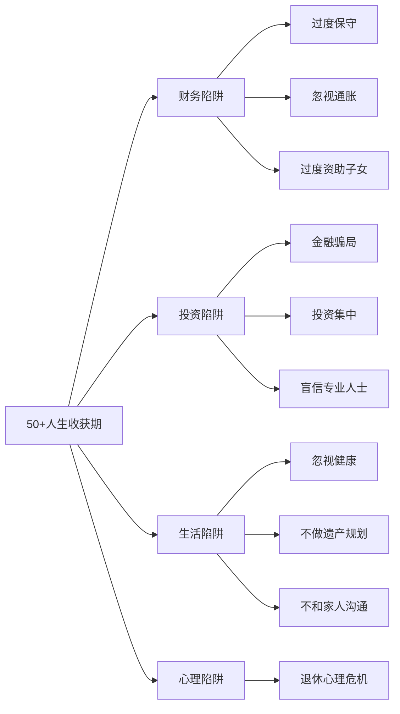
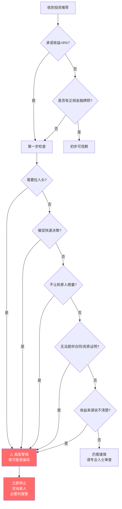
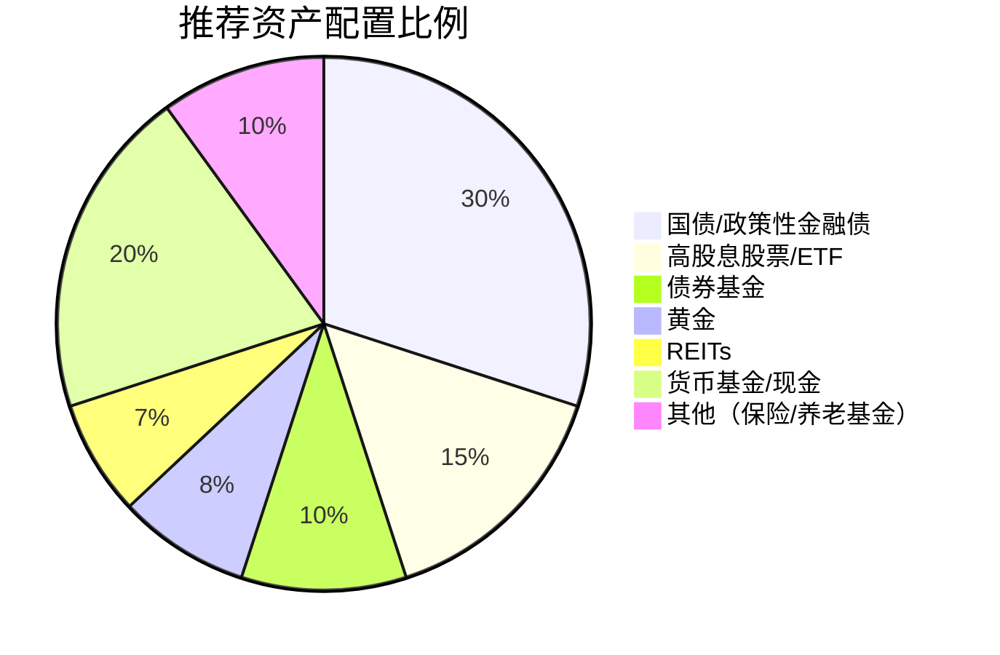
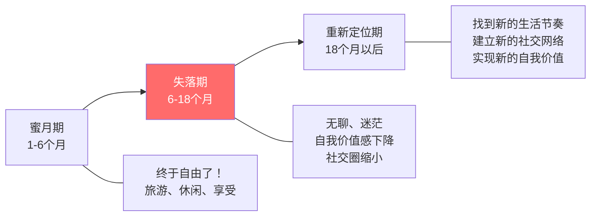
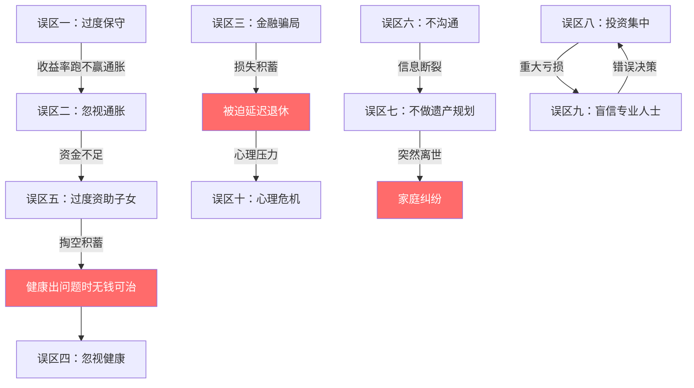

# 第20章 常见误区：50岁以上收获期的十大陷阱

50岁以后的人生，容错率急剧下降。年轻时犯一个投资错误，还有20年时间弥补；到了50岁以后，一次重大失误可能意味着延迟退休5年、降低晚年生活质量，甚至陷入财务困境。本章系统梳理50岁以上人群最容易踩入的十大误区，每个误区都从"典型表现→危害分析→数据支撑→纠正方案"四个维度展开，帮助你建立全面的风险防御体系。

---

## 误区一：过度保守，把所有钱存银行

### 典型表现

- "我年纪大了，经不起折腾，还是存银行安全"
- 所有资产都放在银行活期或定期存款
- 对任何带"风险"二字的投资都极度恐惧
- 认为"不亏就是赚"，把"不赔钱"当作投资目标
- 听到"基金""股票"就本能排斥，连国债逆回购都不愿了解

### 为什么这是误区？

过度保守的本质是一种"确定性的小亏"——你确定自己的购买力会逐年缩水，只是感觉上"没亏"。这就像一个人为了避免感冒而永远待在密封房间里，结果因为缺氧而生病。

**通胀的数学真相：**

假设年通胀率3%，10年后你的购买力将下降约26%。如果你有100万存在银行，活期利率约0.2%，10年后名义上变成102万，但实际购买力只相当于现在的75万。你"安全"地亏了25万。即使是定期存款（假设2%），10年后名义上变成122万，实际购买力约91万——仍然"安全"地亏了9万。

**医疗通胀更为严峻：**

普通CPI年涨幅约2-3%，但医疗费用的年均涨幅约6-8%，护理费用涨幅更高达8-10%。如果你现在每月医疗支出1000元，按6%的医疗通胀率，20年后需要3207元，30年后需要5743元。纯银行存款完全无法覆盖这种增长。

### 数据支撑

| 时间段 | 中国CPI累计涨幅 | 上证指数涨幅 | 银行定期存款累计收益 | 黄金涨幅 |
|--------|----------------|-------------|-------------------|---------|
| 2003-2013 | 约30% | 约100% | 约35% | 约300% |
| 2013-2023 | 约25% | 约0% | 约30% | 约80% |
| 2003-2023 | 约70% | 约100% | 约60% | 约500% |

关键启示：完全存银行的20年里，你的实际购买力在下降。即使股市波动巨大，长期来看仍然跑赢了存款。

### 纠正方案

**核心原则：** 50岁以后不是不能承担任何风险，而是要承担"经过计算的风险"。你的目标是让投资组合的收益率至少跑赢通胀2-3个百分点。

**推荐资产配置框架（50-60岁）：**

| 资产类别 | 配置比例 | 预期年化收益 | 风险等级 | 具体品种举例 |
|---------|---------|------------|---------|------------|
| 国债/政策性金融债 | 30-40% | 2.5-3.5% | 极低 | 10年期国债、国开债、储蓄国债 |
| 高股息股票/ETF | 15-20% | 4-6%（含股息） | 中低 | 沪深300红利ETF、银行股、公用事业股 |
| 债券基金 | 10-15% | 3-5% | 低 | 纯债基金、一级债基 |
| 黄金 | 5-10% | 长期抗通胀 | 中 | 黄金ETF、实物金条 |
| REITs | 5-10% | 4-7% | 中 | 公募REITs（高速公路、仓储物流类） |
| 货币基金/现金 | 15-20% | 1.5-2% | 极低 | 货币基金、银行活期+ |
| 医疗/养老相关 | 5% | 视品种 | 中 | 养老目标基金、医药ETF |

**操作要点：**

1. **"核心+卫星"策略**：核心部分（60-70%）配置国债、债券基金、货币基金，确保基本收益和流动性；卫星部分（30-40%）配置高股息股票、黄金、REITs，争取超额收益
2. **再平衡机制**：每半年检查一次各类资产比例，偏离目标超过5个百分点时进行调整
3. **阶梯式过渡**：如果之前全部存银行，不要一次性转换，建议用6-12个月逐步调整

---

## 误区二：忽视通胀，认为"够花了"

### 典型表现

- "我退休金5000块，加上老伴的，够花了"
- 不考虑未来物价上涨，用今天的消费水平规划未来30年
- 认为"我花钱不多，不需要太多积蓄"
- 没有计算过退休后到底需要多少钱

### 为什么这是误区？

通胀是退休生活中最安静、最持久的"财富杀手"。它不像股市暴跌那样引人注目，但每年3%的通胀率，20年后会让你的购买力缩水45%。更可怕的是，你几乎感觉不到这个过程——直到有一天发现，原来100元能买到的东西，现在需要180元。

**通胀的复合效应：**

假设你60岁退休，每月需要1万元生活费：

| 年龄 | 每月所需金额（按3%通胀） | 每月所需金额（按4%通胀） | 每年所需金额（按3%通胀） |
|------|----------------------|----------------------|---------------------|
| 60岁 | 10,000元 | 10,000元 | 120,000元 |
| 65岁 | 11,593元 | 12,167元 | 139,116元 |
| 70岁 | 13,439元 | 14,802元 | 161,268元 |
| 75岁 | 15,580元 | 18,009元 | 186,960元 |
| 80岁 | 18,061元 | 21,911元 | 216,732元 |
| 85岁 | 20,938元 | 26,658元 | 251,256元 |
| 90岁 | 24,273元 | 32,434元 | 291,276元 |

也就是说，如果你60岁时觉得每月1万"够花了"，到90岁时你需要每月2.4万才能维持相同的生活水平。30年退休生涯的总资金需求约为650万元（按3%通胀），而非简单的360万元（12,000×30年）。

**不同生活成本的通胀差异：**

| 支出类别 | 年均通胀率 | 20年后涨幅 | 说明 |
|---------|----------|----------|------|
| 食品 | 3-4% | 80-120% | 猪肉、蔬菜等波动大 |
| 医疗 | 6-8% | 220-380% | 药品、检查、手术费用 |
| 护理 | 8-10% | 380-560% | 保姆、养老院费用 |
| 居住 | 2-3% | 50-80% | 物业、维修、水电 |
| 交通 | 2-3% | 50-80% | 公交、打车 |
| 娱乐旅游 | 3-5% | 80-160% | 旅游、文化消费 |

### 纠正方案

**第一步：精确计算退休资金需求**

使用"分段估算法"：

1. 列出当前每月各项支出（住房、食品、医疗、交通、娱乐、其他）
2. 剔除退休后不再有的支出（通勤、工作餐、职业装等）
3. 增加退休后新增的支出（更多旅游、更多医疗保健）
4. 按不同通胀率计算未来各阶段的金额
5. 加总得出退休总资金需求

**第二步：建立抗通胀收入来源**

| 收入来源 | 抗通胀能力 | 说明 |
|---------|----------|------|
| 社保养老金 | 强 | 与社会平均工资挂钩，天然抗通胀 |
| 企业年金 | 中 | 部分有通胀调整机制 |
| 高股息股票 | 中强 | 优质公司股息通常随业绩增长 |
| REITs | 中强 | 租金收入通常随通胀调整 |
| 房产租金 | 中 | 租金通常随市场调整 |
| 黄金 | 强 | 长期抗通胀，但波动大 |
| 固定收益产品 | 弱 | 名义收益固定，实际收益被通胀侵蚀 |

**第三步：定期审视和调整**

- 每年至少做一次退休资金需求的重新计算
- 关注CPI和医疗价格指数的变化
- 根据实际情况调整投资组合和支出计划

---

## 误区三：被高收益承诺吸引，落入金融骗局

### 典型表现

- 被"年化收益15%""保本保息"的承诺吸引
- 投资来路不明的"理财产品""私募基金"
- 通过微信群、社区活动认识的"理财顾问"推荐的产品
- 先收到几次"收益"，然后投入更多，最终血本无归
- "朋友介绍的，应该没问题"

### 为什么50+人群是重灾区？

根据公安部数据，老年人金融诈骗案件占金融诈骗案件的30%以上，平均涉案金额超过20万元。50岁以上人群容易受骗的原因是多重的：

1. **信息不对称**：对新型金融产品和骗局手法了解不足
2. **社交信任惯性**：过去几十年建立的"熟人可靠"的信念，在金融领域可能致命
3. **收益焦虑**：退休后收入下降，对"多赚一点"有强烈渴望
4. **孤独感利用**：骗子通过嘘寒问暖建立情感依赖，降低防备心理
5. **认知衰退**：50岁以后，复杂金融产品的理解能力可能下降

### 常见骗局类型详解

**1. 高收益理财骗局（庞氏骗局变种）**

- 手法：承诺8-20%的年化收益，用后来投资者的钱支付前期投资者的"收益"
- 识别：收益率远超市场水平（银行理财4%左右，它给你15%）、资金去向不透明、没有正规金融牌照
- 案例：某"养老服务公司"以投资养老项目为名，承诺年化12%收益，非法集资超过5亿元，涉及投资者2000余人，最终跑路

**2. 养老投资骗局**

- 手法：以"养老公寓""养老社区""候鸟式养老"为名，收取高额会员费或床位预订费
- 识别：要求一次性支付大额费用（如30万-100万）、承诺未来享受养老服务但合同模糊、实际建设进度远落后于宣传
- 案例：某"养老庄园"项目收取会员费后，庄园建设烂尾，投资者血本无归

**3. 以房养老骗局**

- 手法：诱导老人将房产抵押给"贷款公司"，获得的贷款投入所谓的"高收益项目"，承诺既能住着房子又能赚高收益
- 识别：涉及房产抵押的任何投资都应高度警惕、合同中出现"抵押""担保"字眼要仔细审查
- 后果：一旦"投资项目"崩盘，老人不仅失去投资本金，还可能失去唯一的住房

**4. 保健品/药品骗局**

- 手法：以免费体检、免费旅游、免费讲座为诱饵，推销高价保健品或"特效药"
- 识别：产品价格远超同类商品、夸大疗效（"包治百病"）、通过情感营销（"阿姨/叔叔您要对自己好一点"）促成购买
- 数据：中国保健品市场乱象严重，部分产品成本不足售价的10%

**5. 数字货币/区块链骗局**

- 手法：以"区块链""数字货币""Web3.0"为名，包装成高科技投资
- 识别：白皮书模糊、团队信息不实、承诺固定收益（真正的加密货币不可能承诺固定收益）、要求拉人头发展下线

### 识别骗局的决策流程

### 纠正方案

**防骗五原则：**

1. **收益红线原则**：任何承诺年化收益超过6%的产品，都需要极其严格的审查。记住这个公式——银行存款利率（约2%）是"无风险收益"的锚点，超过这个锚点越多，风险越大
2. **资质验证原则**：任何投资产品，都要在中国证监会、银保监会、中国基金业协会等官方网站查询其资质。私募基金可在基金业协会官网（www.amac.org.cn）查询备案信息
3. **家人会商原则**：任何超过月收入的投资决策，都必须与配偶或成年子女商量。骗子最怕你和家人商量——因为家人没有被情感营销洗脑
4. **冷静期原则**：遇到"今天不投就没有名额了"的催促，强制自己等待至少72小时。真正的投资机会不会因为3天就消失
5. **书面留痕原则**：所有投资都要有正式合同，合同要自己保留一份。口头承诺不算数

**已经遇到疑似骗局怎么办：**

1. 立即停止追加投资
2. 保存所有聊天记录、转账记录、合同文件
3. 拨打110报警，同时向当地金融监管部门举报
4. 咨询律师，了解维权途径
5. 不要因为"丢人"而沉默——沉默只会让更多人受害

---

## 误区四：忽视健康，用身体换钱

### 典型表现

- "身体还行，不需要体检"
- "工作太忙，没时间运动"
- 退休后继续高强度工作赚钱
- 不注意饮食和睡眠，觉得"扛一扛就过去了"
- 生病了不去医院，自己买药吃
- 认为体检是"浪费钱"

### 为什么这是误区？

健康是50+人群最大的"隐性资产"。一次重大疾病不仅意味着巨额医疗支出，还可能打乱所有的财务规划。更关键的是，50岁以后身体的"容错率"急剧下降——30岁时熬一个夜第二天就能恢复，50岁以后可能需要一周。

**健康问题的财务冲击：**

| 健康事件 | 典型费用范围 | 对财务规划的影响 |
|---------|------------|---------------|
| 重大手术（心脏、骨科等） | 10-50万元 | 可能耗尽数年积蓄 |
| 癌症治疗（手术+化疗+靶向） | 30-100万元 | 可能需要卖房或借债 |
| 长期慢性病管理（糖尿病、高血压） | 每年2-5万元 | 持续侵蚀退休金 |
| 中风后长期护理 | 每月5,000-15,000元 | 可能持续5-10年甚至更久 |
| 阿尔茨海默症护理 | 每月8,000-20,000元 | 可能持续8-15年 |

**健康管理的投资回报率（ROI）：**

| 健康投资 | 年度成本 | 可能避免的支出 | ROI估算 |
|---------|---------|-------------|--------|
| 每年全面体检 | 2,000-5,000元 | 10-50万元（早期发现重大疾病） | 20-100倍 |
| 每周运动3次 | 时间成本 | 延长健康寿命5-10年，减少医疗支出 | 难以估量 |
| 合理饮食 | 略高于垃圾食品 | 减少50%慢性病风险 | 10倍以上 |
| 充足睡眠（7小时/天） | 无额外成本 | 减少心血管疾病、认知衰退风险 | ∞ |
| 牙齿定期检查 | 每年1,000-2,000元 | 避免种牙（单颗1-3万元） | 5-15倍 |

### 纠正方案

**50+健康管理行动清单：**

**体检项目（每年一次）：**

| 必检项目 | 意义 | 建议频率 |
|---------|-----|---------|
| 血常规+尿常规 | 基础健康筛查 | 每年 |
| 血脂四项 | 心血管风险评估 | 每年 |
| 血糖+糖化血红蛋白 | 糖尿病筛查 | 每年 |
| 肝功能+肾功能 | 肝肾疾病筛查 | 每年 |
| 肿瘤标志物 | 癌症早期筛查 | 每年 |
| 胃肠镜 | 胃癌/肠癌筛查 | 每3-5年（50岁以上） |
| 低剂量螺旋CT | 肺癌筛查（尤其吸烟者） | 每年 |
| 骨密度检测 | 骨质疏松筛查 | 每2年 |
| 眼底检查 | 糖尿病视网膜病变等 | 每年 |
| 颈动脉超声 | 脑卒中风险评估 | 每1-2年 |

**运动方案（每周至少3次，每次30-60分钟）：**

| 运动类型 | 推荐项目 | 频率 | 注意事项 |
|---------|---------|-----|---------|
| 有氧运动 | 快走、游泳、骑车 | 3-5次/周 | 心率控制在（220-年龄）×60-70% |
| 力量训练 | 弹力带、轻哑铃、自重训练 | 2-3次/周 | 防止肌肉流失，保护关节 |
| 柔韧性训练 | 瑜伽、拉伸 | 每天 | 防止关节僵硬，减少受伤风险 |
| 平衡训练 | 太极、单脚站立 | 2-3次/周 | 防跌倒（老年人骨折致死率高） |

**饮食原则：**

- 每天摄入至少500克蔬菜和200克水果
- 蛋白质摄入：每公斤体重1-1.2克（60公斤体重每天60-72克蛋白质）
- 控盐：每天不超过5克（约一啤酒瓶盖）
- 控油：每天不超过25克
- 充足饮水：每天1500-2000毫升
- 减少加工食品、腌制食品的摄入

**购买充足的医疗保险：**

| 保险类型 | 作用 | 建议 |
|---------|-----|-----|
| 社会医保 | 基础保障 | 必须有，注意缴费年限 |
| 百万医疗险 | 大病保障 | 50-60岁抓紧购买，超过60岁可能买不了 |
| 重疾险 | 收入补偿 | 50岁以后性价比下降，酌情考虑 |
| 意外险 | 意外保障 | 保费低，建议购买 |
| 长期护理险 | 护理保障 | 关注政策试点，有条件可购买商业版 |

---

## 误区五：过度资助子女，掏空自己的养老钱

### 典型表现

- 帮子女买房付首付，掏空全部积蓄
- 帮子女还房贷，自己的生活质量下降
- 帮子女带孩子，放弃自己的社交和兴趣
- 把所有财产都提前给了子女
- "孩子过得好就是我过得好"

### 为什么这是误区？

"中国式父母"最大的误区就是过度牺牲自己。你掏空积蓄帮子女买房，万一自己生病需要30万手术费，怎么办？向子女要回来？子女可能也背着房贷、养着孩子，根本拿不出来。最终结果是：你既没有保障自己的晚年，还可能成为子女的负担。

**"资助子女"的机会成本：**

假设你有100万积蓄，60岁退休：

| 选择 | 60-80岁的资金状况 | 80岁以后的状况 |
|------|----------------|-------------|
| 全部资助子女 | 资金归零，完全依赖退休金和子女 | 如果子女有能力且愿意赡养，尚可；否则处境艰难 |
| 保留80万+资助20万 | 80万按保守投资（年化3%），20年后约144万 | 有充足的资金应对医疗和护理需求 |
| 保留100万 | 100万按保守投资（年化3%），20年后约180万 | 财务充裕，可以自主选择养老方式 |

**更深层的问题——"掏空"对家庭关系的伤害：**

1. 掏空自己后向子女要钱，角色从"资助者"变成"索取者"，心理落差巨大
2. 子女可能因为内疚而被迫赡养，关系变得不健康
3. 如果有多个子女，资助不均可能引发家庭矛盾
4. 你的"过度牺牲"可能让子女形成依赖心理，不利于他们成长

### 纠正方案

**资助子女的"三不"原则：**

1. **不掏空**：任何资助都不能动用"安全垫"资金（至少保留5年基本生活费用）
2. **不借债**：绝不为了资助子女而借债或抵押房产
3. **不牺牲**：资助子女不能以牺牲自己的基本生活质量为前提

**合理的资助方式：**

| 资助方式 | 适合场景 | 注意事项 |
|---------|---------|---------|
| 出首付的一部分（非全部） | 子女购房 | 金额不超过积蓄的20-30% |
| 教育基金 | 孙辈教育 | 设定上限，不影响自身生活 |
| 提供住处 | 子女过渡期 | 明确期限和边界 |
| 传授经验和人脉 | 子女创业 | 比直接给钱更有价值 |
| 精神支持 | 子女遇到困难 | 陪伴和鼓励往往比金钱更重要 |

**与子女沟通的脚本：**

> "孩子，爸妈愿意在力所能及的范围内帮你，但我们也需要为自己的晚年留够保障。我们的健康和独立，其实也是对你最大的帮助——因为我们不需要你为我们的医疗和护理费用操心。"

---

## 误区六：不和家人沟通，独自做财务决策

### 典型表现

- "我的钱我做主，不需要和别人商量"
- 不告诉配偶自己的全部财务状况
- 不和子女讨论遗产安排
- 独自做重大投资决策
- 保险单、存折、房产证藏在只有自己知道的地方
- 觉得"谈钱伤感情"

### 为什么这是误区？

50岁以后的财务决策不仅影响自己，更影响整个家庭。最坏的情况是：你突然离世或丧失行为能力，配偶不知道家里有多少钱、存在哪里、买了什么保险、欠了什么债。家庭可能因此陷入混乱。

**不沟通的四大后果：**

1. **信息断裂风险**：万一你出事（突发疾病、意外），配偶不知道家庭财务全貌，可能错过保险理赔、无法取出存款、不知道有哪些债务
2. **决策偏差风险**：独自决策缺乏不同视角。你的风险偏好可能不适合家庭整体情况
3. **信任危机**：如果配偶后来发现你隐瞒了财务状况（无论好坏），信任关系会受到严重损害
4. **遗产纠纷**：没有提前沟通的遗产安排，往往成为家庭矛盾的导火索

### 纠正方案

**建立"家庭财务透明机制"：**

**第一步：制作《家庭财务档案》**

| 档案内容 | 具体信息 | 存放位置 |
|---------|---------|---------|
| 银行账户 | 所有银行、账号、大致余额 | 保险箱+配偶知情 |
| 投资账户 | 证券公司、基金公司、账号 | 保险箱+配偶知情 |
| 房产信息 | 房产证、位置、贷款情况 | 保险箱+配偶知情 |
| 保险单据 | 所有保单、保险公司、保额、受益人 | 保险箱+配偶知情 |
| 债务信息 | 房贷、车贷、其他借款 | 配偶必须知情 |
| 遗嘱 | 遗嘱原件、律师联系方式 | 律师事务所+配偶知情 |
| 数字资产 | 网银密码、支付宝/微信支付密码 | 密码管理器+配偶知情 |

**第二步：定期召开"家庭财务会议"**

- 频率：每季度一次
- 参与者：夫妻双方（必要时包括成年子女）
- 议程：回顾收支情况、讨论大额支出计划、审视投资表现、更新财务档案
- 氛围：平和、理性，避免指责和争吵

**第三步：重大决策的"48小时规则"**

任何涉及以下金额的投资或支出决策，强制执行48小时冷静期，并在此期间与配偶讨论：
- 超过月收入2倍的单笔支出
- 任何新的投资产品
- 任何涉及房产的决策
- 任何涉及借贷的决策

---

## 误区七：不做遗产规划，认为"还早"

### 典型表现

- "我还健康，不需要立遗嘱"
- "我的财产不多，不需要规划"
- "等老了再说"
- 没有遗嘱，没有保险受益人指定，没有信托
- 认为遗产规划是有钱人的事

### 为什么这是误区？

遗产规划不是"准备后事"，而是"保护家人"。没有遗产规划，你的财产可能无法按照你的意愿分配，家人可能因为遗产分配产生不可调和的矛盾。

**没有遗产规划的法律后果：**

根据《中华人民共和国民法典》继承编：

1. **法定继承的顺序**：第一顺序为配偶、子女、父母；第二顺序为兄弟姐妹、祖父母、外祖父母
2. **法定继承的分配**：同一顺序继承人一般均等分配
3. **可能的问题**：
   - 你想把房子留给配偶，但法定继承下子女也有份
   - 你有非婚生子女或养子女，法定继承可能引发争议
   - 你的父母仍在世，他们也有继承权，可能导致房产被多人共有
   - 没有遗嘱的情况下，遗产可能被冻结数月甚至数年

**真实案例：**

一位65岁的老人突然去世，留下200万存款和1套房产（市值300万）。因为没有遗嘱，三个子女对遗产分配产生分歧——大儿子认为自己照顾父母最多应该多分，二女儿认为应该均分，小儿子认为房子应该归自己（因为父母曾口头承诺过）。最终对簿公堂，诉讼费用花了20万，耗时2年，三兄妹从此不相往来。

**如果这位老人提前立了遗嘱：**
- 明确房产归谁、存款如何分配
- 做了公证遗嘱
- 告知了子女遗嘱的存放位置
- 整个遗产分配过程可能只需要1-2个月，零诉讼费用

### 纠正方案

**遗产规划的五步法：**

**第一步：梳理资产清单**

列出所有资产和负债：

| 资产类型 | 具体内容 | 估值 | 备注 |
|---------|---------|------|-----|
| 房产 | 位置、面积、产权人 | 市场价 | 是否有贷款 |
| 银行存款 | 银行、账号、金额 | | |
| 投资 | 股票、基金、债券 | 市值 | |
| 保险 | 保单、保额 | | 注意受益人 |
| 车辆 | 品牌、型号 | 二手价 | |
| 其他 | 收藏品、珠宝等 | 评估价 | |
| **负债** | 房贷、车贷等 | 剩余本金 | |

**第二步：确定分配意愿**

- 每项资产想留给谁？
- 是否有特殊安排（如某件收藏品给特定的人）？
- 是否想做慈善捐赠？
- 对子女的分配是否有差异化考量？

**第三步：选择传承工具**

| 工具 | 适用场景 | 优势 | 劣势 | 费用 |
|------|---------|------|------|------|
| 公证遗嘱 | 绝大多数家庭 | 法律效力最强、成本低 | 仍需经过继承程序 | 数百元 |
| 遗嘱信托 | 资产较多、子女年幼或有特殊需求 | 专业管理、防止挥霍 | 设立门槛较高 | 数万元起 |
| 人寿保险 | 希望定向传承、规避债务 | 指定受益人、理赔快速 | 保费成本 | 视保额 |
| 生前赠与 | 希望提前转移财产 | 税务优势（目前中国无赠与税） | 失去控制权 | 公证费 |
| 家族信托 | 高净值家庭（通常1000万以上） | 资产隔离、专业管理、税务规划 | 门槛高、费用高 | 设立费+管理费 |

**第四步：执行和告知**

- 立即行动——不要等到"更合适的时候"
- 做公证遗嘱（法律效力最强）
- 更新所有保险的受益人
- 告知家人遗嘱的存放位置和律师联系方式
- 建立家庭财务档案

**第五步：定期更新**

- 每3-5年审视一次遗产规划
- 家庭状况变化时及时更新（离婚、再婚、子女结婚、添孙等）
- 法律法规变化时咨询律师

---

## 误区八：投资过于集中，把鸡蛋放在一个篮子里

### 典型表现

- 所有钱都买了某一家银行的理财产品
- 所有钱都买了某一只股票（常常是自己公司的股票）
- 所有资产都是房产（可能有3-4套但都是住宅）
- 把所有钱押在一个行业（如全部买银行股或全部买白酒股）
- "我了解这个行业，不会有问题"

### 为什么这是误区？

集中投资在顺风时收益确实更高，但50岁以后，你已经没有足够的时间来弥补重大亏损。一个-50%的亏损需要+100%的收益才能回本——在你55岁时亏掉一半，可能需要到65岁才能恢复，而这10年本应是你最需要稳定现金流的时期。

**集中投资的真实案例：**

| 案例 | 集中在哪 | 发生了什么 | 后果 |
|------|---------|----------|------|
| 某银行员工 | 全部买了自己银行的股票 | 银行股价下跌60% | 退休金缩水大半 |
| 某退休教师 | 200万全买了一个银行理财产品 | 产品暴雷 | 血本无归，靠低保生活 |
| 某企业主 | 5套房产全在同一城市 | 当地房市低迷，难以变现 | 想卖卖不掉，现金流断裂 |
| 某股民 | 全仓某白酒股 | 行业政策变化，股价腰斩 | 被迫延迟退休3年 |

### 纠正方案

**分散投资的四个维度：**

**维度一：跨资产类别分散**

**维度二：跨地域分散**

| 地域 | 配置方式 | 比例建议 |
|------|---------|---------|
| A股 | 沪深300ETF、中证红利ETF | 占股票仓位的60-70% |
| 港股 | 港股通ETF、H股ETF | 占股票仓位的20-30% |
| 海外 | QDII基金（标普500ETF等） | 占股票仓位的5-10% |

**维度三：跨行业分散**

即使只投资A股，也不要集中在单一行业。建议覆盖：
- 金融（银行、保险）
- 消费（食品饮料、家电）
- 医疗（医药、医疗器械）
- 公用事业（电力、水务）
- 科技（适度配置）

**维度四：跨时间分散（定投策略）**

不要一次性投入大额资金，而是分批买入：
- 100万资金，分12个月投入，每月约8.3万
- 这样可以平滑买入成本，降低"买在高点"的风险

**硬性规则：任何单一资产不超过总资产的20%**

---

## 误区九：盲目相信"专业人士"，不做独立判断

### 典型表现

- 完全依赖理财顾问的建议，自己不学习
- 不了解自己买了什么产品，只知道"收益不错"
- 不看合同条款就签字
- 别人说什么就买什么，缺乏独立判断
- "人家是专业的，肯定比我懂"

### 为什么这是误区？

"专业人士"有三个你必须了解的真相：

1. **利益冲突**：很多理财顾问的收入来自销售佣金。他们推荐的产品，可能是佣金最高的，而不一定是最适合你的。一个年化4%的基金佣金可能只有0.5%，而一个年化"预期8%"的理财产品佣金可能高达3-5%——你猜他们会推荐哪个？

2. **专业不等于为你着想**：银行柜员推荐的"理财产品"可能实际上是保险产品；证券公司客户经理频繁建议你交易是因为他赚手续费；保险代理人只推荐自家公司的产品，即使别家更便宜

3. **知识不对称被利用**：金融产品的复杂性本身就是一种销售工具。当你听不懂产品说明时，你更容易被"专家"牵着走

**常见"话术"解码：**

| 理财顾问说的话 | 实际意思 | 你应该问的问题 |
|-------------|---------|-------------|
| "这款产品历史收益很好" | 过去不代表未来 | "最差的时候亏了多少？" |
| "这是银行自己的产品" | 可能是代销 | "出了问题银行兜底吗？" |
| "很多老客户都买了" | 从众心理营销 | "具体多少人？买了多少？" |
| "现在买正好赶上好时机" | 促成交易 | "如果现在不买，过一个月还能买吗？" |
| "风险很低的" | 模糊表述 | "具体是什么风险等级？R1还是R2？" |
| "收益比存款高多了" | 对比不当 | "风险也比存款高多了吧？" |

### 纠正方案

**建立"三层验证"机制：**

1. **自我学习层**：花时间学习基础的投资知识（不需要成为专家，但要能看懂产品说明书）
2. **多方咨询层**：任何重大决策，至少咨询2-3个不同渠道的"专业人士"
3. **家人审议层**：最终决策前，和家人一起讨论

**独立判断的五个检查点：**

| 检查点 | 具体行动 |
|--------|---------|
| 产品本质 | 这个产品的底层资产是什么？钱投到哪里去了？ |
| 风险等级 | 银行理财产品的风险等级（R1-R5）是什么？我能承受吗？ |
| 费用结构 | 申购费、赎回费、管理费、托管费分别是多少？ |
| 流动性 | 我什么时候能取出来？有锁定期吗？提前赎回有什么损失？ |
| 最坏情况 | 如果亏，最多亏多少？我能不能承受？ |

---

## 误区十：忽视心理健康，退休后"无所事事"

### 典型表现

- 退休后整天在家看电视、刷手机
- 不与朋友联系，社交圈急剧缩小
- 没有兴趣爱好，觉得"做什么都没意思"
- 感到无聊、失落、无价值感
- 失眠、焦虑、情绪低落
- 对配偶变得不耐烦，家庭关系紧张
- "我这辈子就这样了"

### 为什么这是误区？

退休后的心理健康问题比财务问题更隐蔽、更持久，也更难解决。钱的问题可以计算、可以规划、可以补救；但心理问题如果被忽视，会像慢性毒药一样慢慢侵蚀你的生活质量，甚至身体健康。

**退休心理危机的三个阶段：**

**数据支撑：**

- 退休后第一年，约30%的人会出现不同程度的心理问题（焦虑、抑郁、失眠）
- 退休后社交网络平均缩小40%（失去了工作中的社交关系）
- 退休后认知功能下降速度比在职时快2倍（缺乏脑力刺激）
- 退休后离婚率在部分国家有所上升（夫妻24小时相处，矛盾暴露）
- 孤独感对健康的危害，相当于每天吸15支烟（来自《Perspectives on Psychological Science》的研究）

**退休身份认同危机：**

工作中，你的身份是"某某公司的某某经理"——这个身份给了你社会地位、社交网络、日常结构和自我价值感。退休后，这个身份突然消失了。如果你没有建立新的身份认同，就会陷入"我是谁？我还有什么用？"的存在性焦虑。

### 纠正方案

**退休心理建设的四大支柱：**

**支柱一：建立新的日常结构**

退休不是"什么都不做"，而是"做自己选择做的事"。建议制定一个"退休日程表"：

| 时间段 | 周一 | 周二 | 周三 | 周四 | 周五 | 周末 |
|-------|------|------|------|------|------|------|
| 7:00-8:00 | 晨练 | 晨练 | 晨练 | 晨练 | 晨练 | 自由安排 |
| 9:00-11:00 | 学习/阅读 | 志愿服务 | 学习/阅读 | 志愿服务 | 社交活动 | 家庭时间 |
| 14:00-16:00 | 兴趣爱好 | 社区活动 | 兴趣爱好 | 朋友聚会 | 兴趣爱好 | 休闲 |
| 19:00-21:00 | 家庭时间 | 家庭时间 | 家庭时间 | 家庭时间 | 家庭时间 | 家庭时间 |

**支柱二：培养新的社交网络**

- 参加社区活动（合唱团、太极班、书法班）
- 做志愿者（社区服务、公益组织、学校辅导）
- 加入兴趣社群（摄影、钓鱼、旅行、读书）
- 保持与老同事的联系（定期聚会）
- 利用互联网社交（但不要沉迷）

**支柱三：找到新的自我价值**

退休后可以通过以下方式继续创造价值：

| 方式 | 适合人群 | 收获 |
|------|---------|------|
| 兼职顾问/导师 | 有专业经验的人 | 收入+价值感 |
| 写作/回忆录 | 有表达欲望的人 | 传承+价值感 |
| 社区服务 | 热心公益的人 | 社交+价值感 |
| 带孙辈 | 喜欢孩子的人 | 亲情+价值感 |
| 学习新技能 | 好奇心强的人 | 成长+价值感 |
| 创业/小生意 | 有想法的人 | 收入+挑战感 |

**支柱四：保持认知活力**

- 每天阅读30分钟以上（书籍、长文章，而非碎片化信息）
- 学习一项新技能（乐器、外语、编程、绘画）
- 玩智力游戏（围棋、桥牌、数独）
- 参加课程（老年大学、线上课程）
- 定期与不同背景的人交流

**何时需要专业帮助？**

如果出现以下情况，建议寻求专业心理咨询或就医：
- 持续两周以上的情绪低落、兴趣丧失
- 严重的失眠（连续一个月以上）
- 反复出现"活着没意思"的想法
- 社交回避，不愿与任何人接触
- 身体不适但检查不出原因

---

## 误区的连锁效应：一个误区如何引发多个问题

以上十大误区并非孤立存在，它们之间存在复杂的连锁关系：

**最危险的连锁路径：**

过度保守 → 跑不赢通胀 → 资金缩水 → 为了多赚被高收益吸引 → 落入骗局 → 损失惨重 → 健康出问题无钱可治 → 成为子女负担

这条路径在现实中屡见不鲜。避免它的方式是：**系统性地解决所有误区，而不是头痛医头。**

---

## 综合自查清单与行动计划

### 自查评分表

对以下每个问题，诚实打分（1-5分，1=完全不符合，5=完全符合）：

| 序号 | 自查问题 | 评分 | 风险等级 |
|------|---------|------|---------|
| 1 | 我的投资组合中有抗通胀资产（股票、REITs、黄金），占比至少30% | | 过度保守风险 |
| 2 | 我计算过退休后需要多少钱，考虑了3%以上的通胀率 | | 通胀风险 |
| 3 | 我知道如何识别金融骗局，从未被"高收益"诱惑 | | 骗局风险 |
| 4 | 我每年做全面体检，每周运动3次以上 | | 健康风险 |
| 5 | 我资助子女的金额没有超过积蓄的30% | | 过度资助风险 |
| 6 | 我的配偶知道家庭所有财务信息（账户、保险、遗嘱） | | 沟通风险 |
| 7 | 我已经立了遗嘱，并且定期更新 | | 遗产规划风险 |
| 8 | 我的任何单一资产不超过总资产的20% | | 集中投资风险 |
| 9 | 我了解自己买的每一个投资产品的底层资产和风险 | | 盲信风险 |
| 10 | 我退休后有明确的生活规划（日常安排、社交、兴趣） | | 心理风险 |

**评分解读：**

| 总分 | 风险等级 | 建议 |
|------|---------|------|
| 40-50分 | 低风险 | 继续保持，每年审视一次 |
| 30-39分 | 中等风险 | 找出得分最低的3项，优先改进 |
| 20-29分 | 较高风险 | 建议系统性地重新规划，必要时咨询专业人士 |
| 10-19分 | 高风险 | 立即行动，建议寻求专业财务顾问和家人的帮助 |

### 优先改进计划模板

| 优先级 | 需改进的误区 | 具体行动 | 完成时间 | 负责人 |
|--------|------------|---------|---------|--------|
| P0（立即） | | | | |
| P1（本周） | | | | |
| P2（本月） | | | | |
| P3（本季度） | | | | |

---

> **记住：50岁以后，每一个决策都更加重要——因为你没有"重来"的机会。但好消息是，意识到问题本身就是解决问题的第一步。从今天开始，逐一检查、逐一改进，你的收获期一定会更加安全、从容、幸福。**
