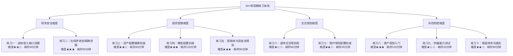
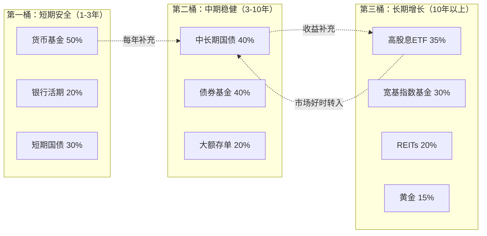
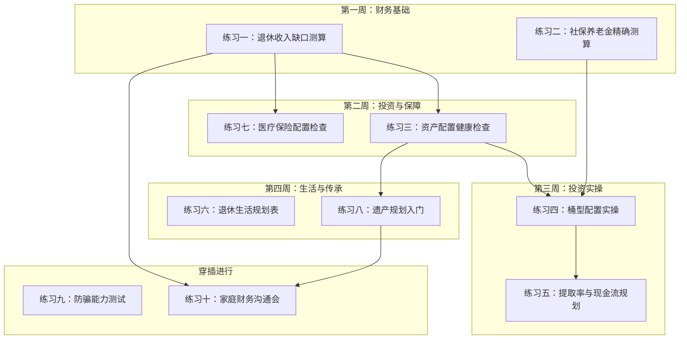

# 第20章 练习方法：50岁以上收获期的实操训练

## 为什么需要专门的练习？

理论读了一百遍，不如动手做一遍。50岁以上人群的财务规划有一个特殊难点：**容错空间极小**。20多岁投资亏了30%，还有30年时间翻盘；55岁亏了30%，可能意味着延迟退休5年甚至永远无法恢复。因此，这个阶段的每一个财务决策都需要精确计算、反复验证，而不是"凭感觉"或"听别人说"。

本节的8个练习覆盖了收获期最核心的四个维度——**财务安全、投资管理、生活规划、风险防控**。每个练习都不是纸上谈兵，而是可以填入你真实数据、得出真实结论的工具。

### 练习体系总览



### 如何使用这些练习

| 你的情况 | 建议路径 |
|---------|---------|
| 距离退休5年以上 | 按顺序完成全部10个练习，重点在练习一、二、四 |
| 距离退休1-5年 | 优先练习一、二、三、五、七，其他逐步补充 |
| 已经退休 | 重点练习三、四、五、六，遗产规划和防骗测试也要做 |
| 刚满50岁，第一次规划 | 先做练习一和练习九，了解全局后再逐一完成其他 |
| 配偶/家人一起参与 | 练习十必须一起做，其他练习各自填写后对比讨论 |

**工具准备：** 计算器、最近12个月的银行流水、社保缴费记录、保险合同、投资账户截图。把这些材料提前准备好，做练习时效率会高很多。

***

## 练习一：退休收入缺口测算

> 难度：★★☆　|　耗时：约60分钟　|　前置材料：近12个月支出记录、社保缴费记录

### 为什么这个练习排第一？

退休收入缺口是所有退休规划的起点。不知道缺口有多大，就不知道需要准备多少钱；不知道需要多少钱，就不知道投资该怎么做。很多人退休后才发现"钱不够花"，根本原因就是从未认真算过这笔账。

根据中国社科院2024年发布的《中国养老金精算报告》，城镇职工基本养老保险的平均替代率（养老金占退休前工资的比例）约为43%，也就是说如果你退休前月薪1万元，退休后社保养老金大约4300元。剩下的5700元缺口，需要靠企业年金和个人储蓄来填补。

### 步骤

**第1步：测算退休后的年支出**

很多人犯的第一个错误是"拍脑袋"估算支出。正确的方法是先记录3个月的实际支出，再逐项调整。

| 支出项目 | 当前月支出（元） | 退休后预计月支出（元） | 变化原因 |
|---------|----------------|---------------------|---------|
| 食品饮料 | | | 退休后有更多时间做饭，可能减少外卖 |
| 居住费用（房贷/房租/物业） | | | 房贷可能已还清，但物业费不变 |
| 水电燃气 | | | 在家时间更长，水电可能增加10-20% |
| 交通出行 | | | 不通勤后大幅减少，但旅游交通增加 |
| 通讯费用 | | | 基本不变 |
| 医疗保健 | | | **退休后显著增加，建议按当前的2-3倍估算** |
| 保险费用 | | | 部分保险到期或转换，需重新评估 |
| 服装美容 | | | 可能减少，但品质要求可能提高 |
| 文化娱乐 | | | 退休后时间充裕，此项通常增加 |
| 旅游休闲 | | | **退休后大幅增加，这是退休生活的核心享受** |
| 子女支持 | | | 如子女已独立可减少，但孙辈支出可能增加 |
| 赡养父母 | | | 50+人群的父母多已高龄，此项可能增加 |
| 社交应酬 | | | 职场应酬减少，但朋友聚会可能增加 |
| 人情往来 | | | 婚丧嫁娶随礼，需持续预算 |
| 其他支出 | | | 预留10-15%的弹性空间 |
| **月合计** | | | |
| **年合计（×12）** | | | |

**完成这个表格后，做两个检验：**

检验一：退休后月支出是否低于当前月支出的70%？如果低于70%，你可能低估了——很多退休者反映实际支出比预期高15-25%，主要因为医疗和休闲支出被低估。

检验二：是否包含了"一次性大额支出"？装修房屋、更换家电、子女结婚、孙辈出生礼金等，这些不常发生但金额大的支出，建议单独列出，按每年预留2-5万元计算。

**第2步：测算退休后的固定收入**

固定收入的关键是"确定性"。社保养老金几乎100%确定（除非政策大幅变化），但投资收益的确定性就低得多。

| 收入来源 | 退休后预计年收入（元） | 确定性 | 备注 |
|---------|---------------------|--------|------|
| 社保养老金 | | **高** | 可通过社保局官网或12333查询预估 |
| 企业年金 | | **高** | 仅限有企业年金的单位，咨询HR获取数据 |
| 商业养老保险 | | **高** | 查看保险合同中的年金领取条款 |
| 房租收入 | | 中 | 需考虑空置期、维修费、折旧 |
| 投资收益（保守估计） | | **低** | **只计入确定性收益，如国债利息，不计入股票预期收益** |
| 兼职/咨询收入 | | **低** | 不建议将此作为退休收入的核心来源 |
| 其他收入 | | | |
| **年合计** | | | |

**关键提醒：** 在计算"确定性收入"时，只把标为"高"的项目计入。投资收益和兼职收入虽然可能存在，但不应该被当作确定性收入来依赖。这是保守原则——为最坏的情况做准备。

**第3步：计算收入缺口**

公式很简洁：

```text
收入缺口 = 年支出 - 固定高确定性收入
所需储蓄总额 = 收入缺口 × 25（基于4%安全提取率）
```

**完整计算示例：**

假设老张，55岁，计划60岁退休：

- 退休后年支出：25万元
- 社保养老金：7.2万元/年（6000元/月）
- 企业年金：2.4万元/年（2000元/月）
- 房租收入：3.6万元/年（3000元/月，确定性为"中"，折半计入）
- 收入缺口 = 25 - 7.2 - 2.4 - 1.8 = **13.6万元/年**
- 所需储蓄总额 = 13.6 × 25 = **340万元**

这意味着老张在60岁退休时，需要有340万元的储蓄和投资组合（不含自住房产），才能支撑到终老。

**第4步：评估差距并制定追赶计划**

| 评估项 | 你的数据 |
|--------|---------|
| 当前储蓄/投资总额 | ________万元 |
| 所需储蓄总额 | ________万元 |
| 差距 | ________万元 |
| 距离退休还有 | ________年 |
| 每年需要额外储蓄（差距÷剩余年数） | ________万元 |
| 每月需要额外储蓄（÷12） | ________万元 |

**差距解读：**

- 如果每月额外储蓄金额 < 当前月收入的20%：情况良好，按计划执行即可
- 如果在20-40%之间：需要认真压缩支出或增加收入
- 如果 > 40%：需要重新审视退休目标——延迟退休、降低退休支出标准、或大幅调整投资策略

### 常见错误

| 错误 | 后果 | 正确做法 |
|------|------|---------|
| 只算日常支出，不算医疗和旅游 | 低估缺口30-50% | 参考退休者的实际支出数据 |
| 把投资收益算作确定性收入 | 高估确定性收入，缺口被掩盖 | 只计入"高确定性"收入 |
| 不考虑通胀 | 20年后的购买力只有现在的一半 | 年支出按3%年通胀率递增 |
| 忽略长寿风险 | 85岁以后可能"弹尽粮绝" | 按90岁甚至95岁寿命来规划 |
| 每年只算一次 | 情况变化时无法及时调整 | 至少每年重新测算一次 |

### 自检问题

- [ ] 我的退休支出估算是否参考了实际退休者的数据？
- [ ] 我是否只计算了高确定性收入？
- [ ] 我的规划寿命是否足够长（至少85岁）？
- [ ] 我是否考虑了通胀的影响？
- [ ] 如果差距很大，我有B计划吗？

### 频率

每年做一次全面测算，重大生活变化时（退休、换房、子女结婚、父母健康变化）即时更新。

***

## 练习二：社保养老金精确测算

> 难度：★★★　|　耗时：约90分钟　|　前置材料：社保缴费记录、个人账户余额

### 为什么要精确测算？

很多人只知道"退休后能拿养老金"，但不知道具体能拿多少。社保养老金是你退休收入中最稳定、最确定的部分，搞清楚它的精确金额，是整个退休规划的基础。

中国的社保养老金由两部分组成：**基础养老金**（与社平工资和缴费年限挂钩）和**个人账户养老金**（与个人账户积累额挂钩）。计算公式全国统一，但各地社平工资不同，所以同样的缴费在不同城市拿到的养老金差异很大。

### 步骤

**第1步：收集关键数据**

| 信息项 | 你的数据 | 获取方式 |
|--------|---------|---------|
| 当前年龄 | | — |
| 预计退休年龄 | | 男性60/女性干部55/女性工人50（特殊工种可提前） |
| 已缴费年限 | | 社保局查询或"掌上12333"App |
| 累计缴费年限（含视同缴费） | | 同上 |
| 缴费基数（月） | | 工资条或HR查询 |
| 当地上年度社平工资（月） | | 当地统计局或社保局官网 |
| 个人账户余额（元） | | 社保局查询或"掌上12333"App |
| 缴费指数（缴费基数÷社平工资） | | 自行计算 |
| 是否有视同缴费年限 | | 1997年前参加工作可能有 |

**关于缴费指数的解释：** 缴费指数 = 你的缴费基数 ÷ 当年社平工资。如果你一直按社平工资的100%缴费，指数就是1.0；按60%缴费，指数就是0.6；按300%封顶缴费，指数就是3.0。很多人长年的平均缴费指数在0.6-1.2之间。

**第2步：计算基础养老金**

公式：

```text
基础养老金 = (当地社平工资 + 本人指数化月平均缴费工资) ÷ 2 × 累计缴费年限 × 1%
```

其中：本人指数化月平均缴费工资 = 当地社平工资 × 平均缴费指数

**完整计算示例：**

王阿姨，55岁，在某二线城市工作30年，平均缴费指数0.8：
- 当地社平工资：7500元/月
- 指数化月平均缴费工资 = 7500 × 0.8 = 6000元/月
- 基础养老金 = (7500 + 6000) ÷ 2 × 30 × 1% = 6750 × 30 × 1% = **2025元/月**

**你的计算：**

```text
基础养老金 = (______ + ______) ÷ 2 × ______ × 1% = ______元/月
```

**缴费年限的杠杆效应：** 每多缴1年，基础养老金增加约0.5-1%的社平工资。如果社平工资是7500元，多缴1年大约多拿37-75元/月，看似不多，但20年累计就是9000-18000元。更重要的是，缴费年限直接影响基础养老金的基数。

**第3步：计算个人账户养老金**

公式：

```text
个人账户养老金 = 个人账户储存额 ÷ 计发月数
```

计发月数由退休时的年龄决定（基于平均余命计算）：

| 退休年龄 | 计发月数 | 含义 |
|---------|---------|------|
| 50岁 | 195 | 约16.3年发放完毕 |
| 55岁 | 170 | 约14.2年发放完毕 |
| 60岁 | 139 | 约11.6年发放完毕 |
| 65岁 | 101 | 约8.4年发放完毕 |

**重要说明：** 计发月数只用于计算初始月养老金。实际发放是终身的——即使个人账户的钱发完了，国家仍然按原标准继续发放，资金由统筹基金承担。所以活得越久，"赚"得越多。

**计算示例：**

王阿姨55岁退休，个人账户余额18万元：
- 个人账户养老金 = 180000 ÷ 170 = **1059元/月**

**你的计算：**

```text
个人账户养老金 = ________ ÷ ________ = ______元/月
```

**第4步：合计养老金**

```text
月养老金 = 基础养老金 + 个人账户养老金
```

王阿姨的月养老金 = 2025 + 1059 = **3084元/月**（年收入约37000元）

**替代率检验：** 月养老金 ÷ 退休前月工资 × 100%。如果低于40%，说明社保养老金不足以维持退休前的生活水平，必须依靠其他收入来源。

**第5步：延迟退休的增量测算**

2025年起中国实施渐进式延迟退休政策，每几个月延迟一个月。延迟退休对养老金有双重正效应：多缴年限增加基础养老金 + 个人账户多积累 + 计发月数减少（月领取额增加）。

| 退休年龄 | 基础养老金 | 个人账户养老金 | 月合计 | 与原计划对比 |
|---------|-----------|--------------|--------|------------|
| 原计划（55岁） | 2025 | 1059 | 3084 | — |
| 延迟1年（56岁） | 2138 | 1148 | 3286 | +6.5% |
| 延迟2年（57岁） | 2250 | 1252 | 3502 | +13.6% |
| 延迟3年（58岁） | 2363 | 1373 | 3736 | +21.1% |
| 延迟5年（60岁） | 2588 | 1727 | 4315 | +39.9% |

**解读：** 延迟5年退休，月养老金增幅接近40%。这个增幅来自三个因素叠加：多缴5年增加基础养老金、个人账户多积累5年、计发月数从170降到139。如果你的身体状况和工作状态允许，延迟退休是提升养老金最有效的方式。

### 常见错误

| 错误 | 正确做法 |
|------|---------|
| 用退休前最后一个月工资来估算养老金 | 养老金基于整个职业生涯的平均缴费，不是最后工资 |
| 忽略视同缴费年限 | 1997年前的工龄可能算作缴费年限，务必确认 |
| 以为缴费满15年就够了 | 15年只是最低门槛，缴费越多年养老金越高 |
| 不查询个人账户余额 | 定期查询，确保单位如实缴费 |
| 忽略地区差异 | 同样的缴费，在社平工资高的城市拿更多 |

### 工具推荐

| 工具 | 用途 | 获取方式 |
|------|------|---------|
| 掌上12333 App | 查询缴费记录、个人账户余额、养老金预估 | 各应用商店下载 |
| 国家社会保险公共服务平台 | 在线测算养老金 | http://si.12333.gov.cn |
| 当地社保局窗口 | 详细咨询、打印缴费明细 | 携带身份证前往 |
| 12333热线 | 政策咨询 | 直接拨打 |

### 频率

每年做一次测算，缴费基数调整或政策变化时即时更新。

***

## 练习三：资产配置健康检查

> 难度：★★☆　|　耗时：约45分钟　|　前置材料：所有投资账户的最新余额

### 为什么50+人群需要专门的资产配置检查？

资产配置的核心原则随年龄变化：年轻人可以承受高波动、追求高增长；50岁以上的人则需要优先考虑**本金安全**和**现金流稳定**。一次-30%的市场下跌，对30岁的人意味着"加仓机会"，对58岁的人可能意味着"延迟退休3年"。

本练习的核心逻辑是：**把你当前的资产配置与"适合50+人群的推荐配置"进行对比，找出偏差，制定调整计划。**

### 步骤

**第1步：盘点所有资产**

精确到万元。很多人对自己的资产总额只有一个模糊概念，这在50岁以后是不可接受的。

| 资产类别 | 金额（万元） | 占比 | 备注 |
|---------|------------|------|------|
| 银行活期 | | | 流动性最高，收益最低 |
| 银行定期/大额存单 | | | 注意到期时间和续存规则 |
| 货币基金 | | | 如余额宝、零钱通等 |
| 国债 | | | 记账式国债可交易，储蓄国债不可 |
| 债券基金 | | | 含纯债基金、一级债基、二级债基 |
| 股票 | | | 个股风险较高，注意集中度 |
| 股票基金/ETF | | | 指数基金优于主动管理基金（费率低） |
| REITs | | | 不动产投资信托，提供租金收益 |
| 黄金 | | | 实物金、纸黄金、黄金ETF均可 |
| 房产（自住） | | | 不计入投资资产，但影响整体财务状况 |
| 房产（投资/出租） | | | 需扣除未还贷款 |
| 保险（现金价值） | | | 仅限有现金价值的终身寿险/年金险 |
| 企业年金 | | | 退休后才能领取 |
| 其他（收藏品、P2P等） | | | P2P应全部退出 |
| **投资资产合计** | | **100%** | 不含自住房产 |

**第2步：与推荐配置对比**

以下是基于50-60岁人群的参考配置。具体比例因个人风险承受能力、收入来源和退休时间而异，但大框架是"固收为主、权益为辅、另类点缀"。

| 资产类别 | 当前占比 | 建议占比（55岁参考） | 差异 | 调整方向 |
|---------|---------|-------------------|------|---------|
| 现金/货币基金（流动性层） | | 15-20% | | 保障2年生活费 |
| 国债/大额存单（安全层） | | 30-40% | | 提供确定性收益 |
| 债券基金（稳健层） | | 10-15% | | 适度增强收益 |
| 高股息股票/ETF（收益层） | | 15-20% | | 抗通胀+现金流 |
| REITs（另类收益层） | | 5-10% | | 租金收益+分散化 |
| 黄金（避险层） | | 3-5% | | 对冲极端风险 |
| 成长型股票/基金 | | 0-5% | | 仅限风险承受力高的人 |

**不同退休阶段的配置差异：**

| 阶段 | 现金/货币 | 固收类 | 权益类 | 另类 | 核心目标 |
|------|----------|--------|--------|------|---------|
| 50-55岁（退休前） | 15% | 40% | 30% | 15% | 积累+过渡 |
| 55-60岁（即将退休） | 20% | 45% | 20% | 15% | 安全+现金流 |
| 60-70岁（退休初期） | 20% | 50% | 15% | 15% | 稳定提取 |
| 70岁以上（退休后期） | 25% | 55% | 10% | 10% | 本金保全 |

**第3步：风险评估清单**

逐项检查，每项不达标都是一个需要修复的问题：

| 检查项 | 达标标准 | 你的状况 | 是否达标 |
|--------|---------|---------|---------|
| 应急基金充足 | ≥24个月生活费（含医疗备用金） | | □是 □否 |
| 高风险资产占比 | ≤25%（股票+股票基金+个股） | | □是 □否 |
| 单一资产集中度 | 任何单一资产类别不超过总资产的30% | | □是 □否 |
| 单只个股占比 | 不超过总资产的5% | | □是 □否 |
| 流动性充足 | 30天内可变现资产 ≥ 12个月生活费 | | □是 □否 |
| 有抗通胀资产 | 高股息ETF+REITs+黄金合计 ≥ 20% | | □是 □否 |
| 无P2P/高风险理财 | P2P、虚拟货币、高杠杆产品 = 0 | | □是 □否 |
| 保险覆盖充分 | 重疾/医疗/意外险已配置 | | □是 □否 |
| 有稳定现金流资产 | 国债利息+股息+租金 ≥ 月支出的30% | | □是 □否 |

**第4步：制定调整计划**

不达标项需要制定具体的调整计划。调整原则：**渐进式调整，不要一次性大幅调仓**——市场择时的风险对50+人群尤其致命。

| 调整动作 | 当前状态 | 目标状态 | 调整金额（万元） | 时间表 | 优先级 |
|---------|---------|---------|----------------|--------|--------|
| | | | | | |
| | | | | | |
| | | | | | |

### 常见错误

| 错误 | 后果 | 正确做法 |
|------|------|---------|
| 50岁了还满仓股票 | 一次熊市可能亏掉5年积蓄 | 权益类占比逐步降至20%以下 |
| 把所有钱存银行定期 | 年化2-3%跑不赢通胀 | 配置国债、债券基金、高股息ETF |
| 过度集中在房产 | 房产流动性差，变现周期长 | 投资性房产不超过总资产的40% |
| 持有大量个股 | 个股风险远高于基金 | 个股占比不超过总资产的10% |
| 不做再平衡 | 涨得多的资产占比越来越高，风险失控 | 每半年再平衡一次 |

### 频率

每6个月做一次全面检查，市场大幅波动后（单月跌幅超过10%）即时检查。

***

## 练习四：桶型配置实操

> 难度：★★★　|　耗时：约120分钟　|　前置材料：练习一和练习三的结果

### 什么是桶型配置？

桶型配置（Bucket Strategy）是退休投资管理中最经典、最实用的策略之一，最早由美国财务规划师 Harold Evensky 在1985年提出。核心思想是：**把退休资产按使用时间分成不同的"桶"，每个桶用不同的投资策略**——短期用的钱绝对安全，长期用的钱可以承受波动。

这个策略的精妙之处在于：它同时解决了两个矛盾的需求——短期需要安全（不能亏），长期需要增长（跑赢通胀）。通过分桶，你不需要在"安全"和"增长"之间做二选一的痛苦抉择。

### 桶型配置结构图



### 步骤

**第1步：确定每桶的规模**

基于练习一的年支出数据：

| 参数 | 计算方式 | 你的数据 |
|------|---------|---------|
| 年支出（含弹性） | 练习一结果 × 1.1 | ________万元 |
| 第一桶（1-3年生活费） | 年支出 × 3 | ________万元 |
| 第二桶（3-10年生活费） | 年支出 × 7 | ________万元 |
| 第三桶（剩余资产） | 总资产 - 第一桶 - 第二桶 | ________万元 |
| 第三桶占总资产比例 | 第三桶 ÷ 总资产 | ________% |

**第三桶占比的健康范围：**

- 20-40%：保守型，适合身体状况一般或没有其他收入来源的人
- 40-60%：平衡型，适合大多数50+人群
- >60%：偏激进，仅适合有稳定其他收入来源且风险承受力高的人
- <20%：过于保守，长期可能跑不赢通胀

**第2步：为每桶选择具体投资品种**

| 桶 | 目标金额 | 具体品种建议 | 预期年化收益 | 风险等级 |
|------|---------|------------|------------|---------|
| 第一桶 | 万 | 货币基金50%、银行活期/通知存款20%、1年内国债30% | 1.5-2.5% | 极低 |
| 第二桶 | 万 | 3-5年国债30%、纯债基金30%、大额存单20%、银行理财（R2级）20% | 2.5-4% | 低 |
| 第三桶 | 万 | 沪深300ETF 25%、中证红利ETF 25%、公募REITs 20%、黄金ETF 15%、纳斯达克100ETF 15% | 5-8%（长期） | 中 |

**品种选择的核心原则：**

第一桶：只选确定性最高的品种。货币基金和银行存款虽然收益低，但"不亏"就是最大的收益。第一桶是你的"安心钱"——知道未来3年的生活有着落，你才能安心持有第二桶和第三桶的波动资产。

第二桶：以固定收益为主。国债是"金边债券"，违约风险为零；纯债基金波动小、收益稳定；大额存单受存款保险保护（50万以内）。第二桶的任务是提供比第一桶略高的收益，同时保持较低的波动。

第三桶：这是抵御通胀的核心。高股息ETF提供稳定的分红收入（3-5%股息率），宽基指数基金分享经济增长的红利，REITs提供不动产租金收益，黄金对冲极端风险。第三桶的短期波动可以忽略——你10年内不需要动用这笔钱。

**第3步：制定桶间资金流转规则**

桶型配置不是"放进去就不管了"，而是需要定期从收益桶向安全桶补充资金。

| 流转规则 | 具体操作 | 触发条件 |
|---------|---------|---------|
| 年度补充 | 每年1月，从第三桶的年度收益中，向第二桶补充年支出的1/7 | 每年固定执行 |
| 二级补充 | 每年1月，从第二桶的年度收益中，向第一桶补充1年生活费 | 每年固定执行 |
| 紧急补充 | 如果第一桶低于2年生活费，从第二桶直接转入 | 触发时立即执行 |
| 超额转入 | 如果第三桶年度收益超过15%，将超出部分转入第二桶 | 收益好的年份 |
| 亏损保护 | 如果第三桶年度亏损超过15%，暂停向第二桶的补充，用第二桶收益补充第一桶 | 市场大跌时 |

**第4步：制定再平衡规则**

| 检查频率 | 检查内容 | 操作标准 |
|---------|---------|---------|
| 每半年（6月和12月） | 各桶的实际金额 vs 目标金额 | 任何一桶偏差超过±20%时触发再平衡 |
| 市场暴跌后（单月跌幅>10%） | 第一桶是否充足 | 第一桶低于2年生活费时紧急补充 |
| 每年1月 | 各桶的投资品种和比例 | 根据市场环境微调品种 |

**再平衡的操作方法：** 不要一次性大幅调整。如果第三桶超过目标的120%，把超出部分分3-6个月逐步转入第二桶。一次性大额转入可能在不利的市场时点操作，造成不必要的损失。

### 常见错误

| 错误 | 后果 | 正确做法 |
|------|------|---------|
| 只设一桶（全部保守） | 长期跑不赢通胀，20年后购买力大幅缩水 | 至少设三桶，让第三桶跑通胀 |
| 第一桶太小 | 遇到市场下跌被迫割肉 | 第一桶至少覆盖2年生活费 |
| 不执行补充规则 | 桶型配置失去意义 | 设定日历提醒，每年1月固定执行 |
| 第三桶选了太多个股 | 个股暴跌可能拖垮整个配置 | 以ETF为主，个股不超过第三桶的20% |
| 市场下跌时恐慌卖出第三桶 | 卖在最低点，错过反弹 | 只要第一桶够用，第三桶的波动不需要理会 |

### 自检问题

- [ ] 我的第一桶是否足以覆盖未来2-3年的生活费？
- [ ] 我是否有明确的桶间资金流转规则？
- [ ] 我是否设定了再平衡的触发条件和执行频率？
- [ ] 我是否理解"第三桶的短期波动不重要"这个核心理念？
- [ ] 我的配偶是否了解这个配置的逻辑？（避免市场下跌时被要求卖出）

### 频率

每年1月做一次全面审视和调整，每半年检查一次各桶的规模和比例。

***

## 练习五：提取率与现金流规划

> 难度：★★★　|　耗时：约90分钟　|　前置材料：练习一、二、四的结果

### 为什么需要单独规划提取率？

退休后最大的财务风险不是"投资亏了"，而是"花太快了"。提取率（每年从投资组合中提取的比例）是决定你的钱能撑多久的最关键变量。

**4%法则的由来：** 1994年，美国财务规划师 William Bengen 分析了1926-1992年的历史数据，发现如果退休第一年提取投资组合的4%，之后每年按通胀调整，那么在任何25年期间（包括大萧条、二战、石油危机等极端时期），钱都不会花光。这就是著名的"4%安全提取率"。

**中国的情况有所不同：** 4%法则是基于美国市场的历史数据，中国市场的波动率更高、债券收益率更低。更保守的建议是：**第一年提取率不超过3.5%，之后按通胀调整**。如果你的退休期超过30年（即55岁前退休），建议进一步降至3%。

### 步骤

**第1步：计算你的安全提取率**

| 计算项 | 公式 | 你的数据 |
|--------|------|---------|
| 投资组合总额 | 来自练习三 | ________万元 |
| 年支出（含弹性） | 来自练习一 | ________万元 |
| 高确定性年收入 | 来自练习一（社保+企业年金） | ________万元 |
| 需要从投资组合提取的金额 | 年支出 - 高确定性收入 | ________万元 |
| 第一年提取率 | 提取金额 ÷ 投资组合总额 | ________% |

**提取率评估标准：**

| 提取率 | 风险等级 | 建议 |
|--------|---------|------|
| < 3% | 极安全 | 可以适当提高生活品质 |
| 3-3.5% | 安全 | 适合大多数退休者 |
| 3.5-4% | 适中 | 需要配合动态调整策略 |
| 4-5% | 偏高 | 需要压缩支出或增加确定性收入 |
| > 5% | 危险 | 资金可能在20年内耗尽，必须调整 |

**第2步：选择提取策略**

三种主流提取策略的对比：

| 策略 | 操作方式 | 优点 | 缺点 | 适合人群 |
|------|---------|------|------|---------|
| 固定金额法 | 每年提取固定金额，按通胀调整 | 支出可预测，便于规划 | 市场差时可能加速消耗 | 追求稳定的人 |
| 固定比例法 | 每年提取投资组合的固定比例 | 永远不会"花光" | 收入波动大 | 能接受收入波动的人 |
| 动态调整法 | 市场好多提，市场差少提 | 平衡了安全性和生活品质 | 需要每年重新计算 | 大多数退休者（推荐） |

**动态调整法的实操规则：**

```text
如果上一年投资组合收益 > 10%：提取率 = 基准提取率 × 1.15（最多不超过5%）
如果上一年投资组合收益在 -5% 到 10% 之间：提取率 = 基准提取率
如果上一年投资组合收益 < -5%：提取率 = 基准提取率 × 0.8（最低不低于2%）
```

**第3步：制作现金流日历**

退休后的现金流管理比工作时更重要——工作时每月有工资进账，退休后需要自己"发工资"。

| 月份 | 固定收入（社保等） | 从投资组合提取 | 预计支出 | 现金流余额 |
|------|------------------|--------------|---------|-----------|
| 1月 | | | | |
| 2月 | | | | |
| 3月 | | | | |
| ... | | | | |
| 12月 | | | | |

**现金流管理技巧：**

- 每年1月从投资组合提取全年所需金额，放入第一桶（货币基金+银行活期）
- 固定收入（社保养老金）按月自动到账
- 大额支出（旅游、体检、保险续费）提前规划，从第一桶专项预留
- 年中如果第一桶余额低于6个月生活费，从第二桶补充

**第4步：压力测试**

用历史数据模拟你的提取计划在不同市场环境下的表现：

| 场景 | 投资组合变化 | 你的提取金额 | 组合剩余 | 是否安全 |
|------|------------|------------|---------|---------|
| 正常年份（收益5%） | | | | |
| 牛市年份（收益15%） | | | | |
| 熊市年份（亏损15%） | | | | |
| 连续2年熊市（-15%, -10%） | | | | |
| 金融危机（第一年-30%，之后逐步恢复） | | | | |

**关键发现：** 很多人在压力测试后发现，连续2年熊市+正常提取会导致资金在20年内耗尽。这正是桶型配置的价值——第一桶保证你在熊市中不需要卖出第三桶的资产。

### 常见错误

| 错误 | 后果 | 正确做法 |
|------|------|---------|
| 退休第一年大手大脚 | "退休庆祝"花掉太多，后续被动 | 第一年的提取率从保守开始 |
| 不根据市场调整提取 | 市场差时还在大量提取，加速消耗 | 采用动态调整法 |
| 忘记考虑税费 | 实际到手比预期少 | 提取金额需考虑个税（如果适用） |
| 通胀只算3%，实际更高 | 中长期购买力下降比预期快 | 医疗支出按5%通胀率单独计算 |
| 配偶不参与规划 | 一方去世后另一方不知如何管理 | 两个人都要了解提取规则 |

### 频率

每年1月重新计算提取率和全年现金流计划，每季度检查一次现金流余额。

***

## 练习六：退休生活规划表

> 难度：★☆☆　|　耗时：约60分钟　|　前置材料：无

### 为什么退休生活需要规划？

退休后最常见的心理问题不是"钱不够"，而是"没事做"。工作了30-40年，突然每天24小时都是自由时间，很多人会陷入空虚、焦虑甚至抑郁。中国老龄科研中心的调查显示，退休后1年内出现明显心理不适应的比例高达60%。

退休生活规划的核心目标是：**用有意义的活动填满时间，保持身心健康和社会连接。** 财务规划确保你"有钱花"，生活规划确保你"有事做、有人陪、有价值感"。

### 步骤

**第1步：规划每日时间表**

不要追求"完美日程"，而是建立一个有弹性但有结构的日常节奏。人类需要节奏感——完全无序的生活会导致心理失衡。

| 时间段 | 活动建议 | 你的安排 | 频率 |
|--------|---------|---------|------|
| 6:30-7:00 | 起床、洗漱 | | 每天 |
| 7:00-8:00 | 晨练（散步/太极/八段锦） | | 每天 |
| 8:00-8:30 | 早餐 | | 每天 |
| 8:30-10:00 | 学习/阅读/线上课程 | | 每天 |
| 10:00-11:30 | 兴趣爱好（书法/园艺/摄影等） | | 每天 |
| 11:30-12:00 | 午餐准备 | | 每天 |
| 12:00-14:00 | 午餐、午休 | | 每天 |
| 14:00-15:30 | 社交活动/志愿服务/兼职工作 | | 每天 |
| 15:30-17:00 | 自由时间（购物/散步/见朋友） | | 每天 |
| 17:00-18:30 | 晚餐准备、晚餐 | | 每天 |
| 18:30-20:00 | 家人时间/看电视/打电话 | | 每天 |
| 20:00-21:30 | 阅读/写日记/轻松活动 | | 每天 |
| 21:30-22:00 | 洗漱、就寝准备 | | 每天 |

**时间分配的黄金比例：**

- 身体活动：每天至少1小时（运动、家务、散步）
- 脑力活动：每天至少1.5小时（阅读、学习、下棋、写东西）
- 社交活动：每天至少1小时（见面、电话、视频）
- 创造性活动：每天至少30分钟（园艺、烹饪、手工、摄影）
- 纯粹休闲：每天至少1小时（看剧、散步、发呆——发呆也是需要的）

**第2步：规划每周活动**

每周的结构比每天更重要——它给你"期待感"。

| 星期 | 上午 | 下午 | 晚上 |
|------|------|------|------|
| 周一 | 学习时间 | 兴趣小组活动 | 家庭晚餐 |
| 周二 | 运动（游泳/羽毛球） | 自由安排 | 阅读 |
| 周三 | 志愿服务/社区活动 | 朋友聚会 | 看电影/演出 |
| 周四 | 学习时间 | 购物/办事 | 家人视频通话 |
| 周五 | 运动 | 自由安排 | 周末计划 |
| 周六 | 家庭活动/孙辈陪伴 | 短途出游 | 社交聚餐 |
| 周日 | 休息/轻松阅读 | 家务整理 | 一周回顾 |

**第3步：探索和规划兴趣爱好**

退休后有时间培养"年轻时想做但没时间做"的事情。关键是：**不要只选一个爱好，至少培养3个不同类型的兴趣**——一个动的（运动）、一个静的（阅读/书法）、一个社交的（合唱团/棋牌）。

| 兴趣爱好 | 类型 | 每周投入时间 | 月费用预算 | 预期收获 |
|---------|------|------------|-----------|---------|
| | 动态/静态/社交 | | | |
| | 动态/静态/社交 | | | |
| | 动态/静态/社交 | | | |

**第4步：维护和拓展社交网络**

退休后最大的风险之一是社交萎缩——工作时的同事关系逐渐淡化，如果不主动维护，可能陷入孤立。

| 社交类型 | 当前频率 | 目标频率 | 具体安排 |
|---------|---------|---------|---------|
| 家人聚会 | | 每周至少1次 | |
| 老朋友见面 | | 每月至少2次 | |
| 新朋友（兴趣小组/社区） | | 每周至少1次 | |
| 志愿服务 | | 每周至少1次 | |
| 线上社交（视频通话/社群） | | 每天至少1次 | |

**第5步：规划"退而不休"**

很多50+人群不想完全退休，而是希望"退而不休"——用积累的经验和技能继续创造价值，但不再承受全职工作的压力。

| 方式 | 时间投入 | 收入预期 | 具体计划 |
|------|---------|---------|---------|
| 行业顾问/兼职 | 每周10-15小时 | 中 | |
| 社区志愿服务 | 每周5-10小时 | 无 | |
| 线上内容创作 | 每周5-10小时 | 低-中 | |
| 技能培训/教学 | 每周5-10小时 | 低-中 | |
| 兴趣变现（摄影/书法/手工） | 灵活 | 低 | |

### 常见错误

| 错误 | 后果 | 正确做法 |
|------|------|---------|
| 完全不规划，"顺其自然" | 3个月内陷入空虚和焦虑 | 退休前1年开始规划 |
| 日程排得太满 | 疲惫，失去退休的自由感 | 保留50%的自由时间 |
| 只看电视/刷手机 | 认知退化加速，社交萎缩 | 每天屏幕时间控制在3小时以内 |
| 不运动 | 身体机能快速下降 | 每天至少1小时中等强度运动 |
| 与社会完全脱节 | 孤独感和无价值感 | 保持至少3个社交渠道 |

### 频率

退休前1年开始规划，退休后每季度回顾和调整一次。前3个月是适应期，允许反复尝试和调整。

***

## 练习七：医疗保险配置检查

> 难度：★★☆　|　耗时：约45分钟　|　前置材料：社保卡、保险合同

### 为什么医疗保障是50+人群的第一优先级？

一次重大疾病的平均治疗费用在30-80万元，癌症的靶向治疗和免疫治疗费用可能超过100万元。如果没有充分的医疗保障，一场大病可能耗尽多年积蓄，甚至背上债务。

50岁以后，医疗支出的增长速度远超一般通胀——医疗通胀率通常在8-10%，是一般CPI的3倍左右。这意味着现在觉得"够用"的医疗储备，10年后可能远远不足。

### 步骤

**第1步：医保现状检查**

| 检查项 | 达标标准 | 你的状况 | 是否达标 |
|--------|---------|---------|---------|
| 医保缴费年限 | 男性≥25年，女性≥20年（各地不同） | | □是 □否 |
| 了解当地门诊报销比例 | 通常50-70%，起付线200-1500元 | | □是 □否 |
| 了解住院报销比例 | 通常70-90%，与医院等级挂钩 | | □是 □否 |
| 了解大病保险政策 | 超过起付线部分报销50-80% | | □是 □否 |
| 了解医保目录范围 | 甲类全额报销、乙类部分报销、丙类自费 | | □是 □否 |
| 已办理异地就医备案 | 如退休后异地居住，必须提前办理 | | □是 □否 |
| 了解门诊慢特病政策 | 高血压、糖尿病等可申请门诊慢特病，报销比例更高 | | □是 □否 |

**医保缴费年限不足怎么办？**

如果你到退休年龄时医保缴费年限不足，有三种选择：
1. **一次性补缴**：按当地规定的基数一次性补齐差额年限的费用（通常需要数万元）
2. **继续按月缴纳**：退休后继续按月缴纳医保费，直到满足年限
3. **转为城乡居民医保**：缴费低但报销比例也低，不建议作为首选

**第2步：商业保险检查**

| 保险类型 | 是否购买 | 保额（万元） | 年保费（元） | 续保条件 | 50+人群建议 |
|---------|---------|------------|------------|---------|------------|
| 百万医疗险 | □有 □无 | | | 保证续保几年？ | **必备**，选择保证续保20年的产品 |
| 重疾险 | □有 □无 | | | | 55岁以后不建议新购（保费倒挂） |
| 意外险 | □有 □无 | | | | **必备**，50+人群意外骨折风险高 |
| 长期护理险 | □有 □无 | | | | 强烈建议，应对失能风险 |
| 防癌险 | □有 □无 | | | | 买不了重疾险的替代方案 |
| 防癌医疗险 | □有 □无 | | | | 百万医疗险的替代方案（三高人群可买） |

**50+人群保险配置的优先级：**

1. **百万医疗险**（或防癌医疗险）：解决大额医疗费用，年保费1000-3000元
2. **意外险**：解决意外伤害和骨折，年保费200-500元
3. **长期护理险**：解决失能后的护理费用，年保费500-2000元
4. **防癌险**：如果买不了重疾险，防癌险是退而求其次的选择

**55岁以后不建议新购重疾险的原因：** 55岁购买20万保额的重疾险，20年总保费可能接近甚至超过保额（保费倒挂），从经济角度看不划算。把同样的钱用来买百万医疗险+建立专项医疗储备金，效果更好。

**第3步：医疗费用预算**

| 费用类型 | 当前年支出（元） | 退休后预计（元） | 增长原因 |
|---------|----------------|----------------|---------|
| 日常门诊 | | | 退休后看病频率增加 |
| 慢性病用药 | | | 年龄增长，慢病管理费用持续增加 |
| 年度体检 | | | 50+需要更全面的体检项目 |
| 保健品/营养补充 | | | 适度补充，避免过度消费 |
| 牙科/眼科 | | | 50+人群的高发需求 |
| 中医理疗/康复 | | | 可选项目，按需安排 |
| **合计** | | | |

**第4步：保障缺口分析**

这是最关键的一步——量化你面对重大疾病时的自付风险。

| 分析项 | 金额（万元） |
|--------|------------|
| 预计最大医疗支出（重大疾病，含靶向药） | |
| 医保报销（按70%估算） | |
| 百万医疗险报销（扣除1万免赔额后） | |
| 自付缺口 | |
| 专项医疗储备金目标（自付缺口×1.5） | |
| 当前医疗相关储蓄 | |
| 差距 | |

**如果差距较大，补救方案：**

- 增加百万医疗险的保额（如果健康条件允许）
- 每月定投医疗专项基金（货币基金+短债基金）
- 考虑购买惠民保（各城市的普惠型补充医疗保险，年保费100-200元）
- 保持健康的生活方式（这是最经济的"保险"）

### 常见错误

| 错误 | 后果 | 正确做法 |
|------|------|---------|
| 以为社保医保就够了 | 大病自付部分可能高达数十万 | 医保+百万医疗险+专项储备三重保障 |
| 55岁后才想起买保险 | 保费高、选择少、可能被拒保 | 50岁就开始配置商业保险 |
| 只买重疾险不买医疗险 | 重疾险确诊才赔，医疗险实报实销 | 优先百万医疗险，再考虑重疾险 |
| 不看续保条件 | 产品停售后失去保障 | 选择保证续保的产品 |
| 忽略长期护理险 | 失能后的护理费用是"隐形大山" | 50+人群应认真考虑 |

### 频率

每年做一次全面检查，特别是在保险续保前1个月。每年体检后根据健康状况调整保险配置。

***

## 练习八：遗产规划入门

> 难度：★★★　|　耗时：约120分钟　|　前置材料：房产证、保险合同、投资账户信息

### 为什么50岁就要开始遗产规划？

中国有句老话叫"不见棺材不落泪"——很多人觉得遗产规划是"身后事"，不着急。但现实是：**没有遗产规划的家庭，往往在最悲痛的时候还要面对财产纠纷。**

根据中国裁判文书网的数据，2023年全国继承纠纷案件超过12万件，其中大量是因为"没有遗嘱"或"遗嘱无效"导致的。一份合法有效的遗嘱，可以避免家人在你离世后对簿公堂。

遗产规划不仅是"分钱"，更包含三个层面：
1. **财产清单**：让家人知道你有哪些资产、在哪里、怎么取
2. **分配意愿**：明确你希望财产如何分配
3. **税务优化**：合理安排减少未来的税费负担

### 步骤

**第1步：制作完整的资产清单**

这是遗产规划的基础。如果你突然离世，你的家人是否知道你有哪些资产？在哪里？

| 资产类型 | 具体内容 | 价值（万元） | 所在机构 | 账号/密码存放位置 |
|---------|---------|------------|---------|-----------------|
| 银行存款 | | | | |
| 投资账户（股票/基金） | | | | |
| 房产 | | | 房产证在： | |
| 人寿保险 | | | | |
| 企业年金/职业年金 | | | | |
| 公积金 | | | | |
| 社保个人账户 | | | | |
| 债权（别人欠你的钱） | | | 借条在： | |
| 车辆 | | | | |
| 贵重物品（珠宝/收藏品） | | | | |
| 数字资产（支付宝/微信余额） | | | | |
| **合计** | | | | |

**数字资产不要遗忘：** 支付宝余额、微信零钱、数字货币、网络店铺、游戏装备等数字资产也需要列入清单。很多人去世后，家人根本不知道这些数字资产的存在。

**第2步：了解法定继承规则**

在没有遗嘱的情况下，遗产按照《民法典》第1127条的规定分配：

```text
第一顺序继承人：配偶、子女、父母
  → 同一顺序继承人一般均分
  
如果没有第一顺序继承人：
第二顺序继承人：兄弟姐妹、祖父母、外祖父母
```

**关键知识点：**

- 婚后取得的财产一般是夫妻共同财产，只有一半是遗产
- 非婚生子女、养子女、有抚养关系的继子女享有同等继承权
- 丧偶儿媳/女婿对公婆/岳父母尽了主要赡养义务的，可以作为第一顺序继承人
- 继承人可以放弃继承权，但必须在遗产处理前明确表示

**第3步：选择遗嘱形式**

中国法律认可六种遗嘱形式，每种有不同的要求和适用场景：

| 遗嘱形式 | 要求 | 优点 | 缺点 | 推荐指数 |
|---------|------|------|------|---------|
| 自书遗嘱 | 亲笔书写全文、签名、注明年月日 | 免费、私密 | 容易因格式问题被质疑 | ★★★ |
| 代书遗嘱 | 两个以上见证人、其中一人代书 | 适合书写困难的人 | 见证人要求严格 | ★★★ |
| 打印遗嘱 | 两个以上见证人、每页签名、注明日期 | 清晰易读 | 法律要求严格 | ★★★★ |
| 录音录像遗嘱 | 两个以上见证人、记录遗嘱人和见证人的姓名和日期 | 直观 | 技术要求高 | ★★★ |
| 口头遗嘱 | 仅限危急情况、两个以上见证人 | 紧急可用 | 危急情况解除后可以其他形式取代 | ★ |
| **公证遗嘱** | 到公证处办理 | **法律效力最强** | 需要费用（几百到几千元） | **★★★★★** |

**强烈建议：** 去公证处办理公证遗嘱。费用不高（通常500-2000元），但法律效力最强，被推翻的概率最低。

**第4步：制定受益人安排**

| 资产 | 第一受益人 | 比例 | 第二受益人 | 比例 | 备注 |
|------|-----------|------|-----------|------|------|
| 人寿保险 | | | | | 保险受益人优先于遗嘱 |
| 银行存款 | | | | | |
| 房产 | | | | | 需考虑配偶的居住权 |
| 投资账户 | | | | | |
| 其他 | | | | | |

**重要提醒：** 人寿保险的受益人是"指定受益人"，不走遗产继承程序，直接由保险公司赔付给受益人。所以保险受益人的指定非常重要——如果写的是"法定"，则按遗产继承处理，可能引发纠纷。

**第5步：告知家人**

遗产规划做完后，最重要也是最容易被忽略的一步：**告诉家人**。

- [ ] 告知配偶重要文件的存放位置（遗嘱、房产证、保险合同、银行卡）
- [ ] 告知子女遗嘱的存在和大致内容（不需要透露具体金额，但要知道在哪里找到遗嘱）
- [ ] 告知家人紧急联系人信息（律师、理财顾问、保险经纪人）
- [ ] 制作一份"家庭财务联络单"——列出所有机构的联系方式和账号

**推荐工具：** 制作一个"紧急信封"，里面放一份资产清单、遗嘱副本、重要文件复印件、紧急联系人列表。把这个信封交给配偶或信任的家人，约定"只有在紧急情况下才能打开"。

### 常见错误

| 错误 | 后果 | 正确做法 |
|------|------|---------|
| 完全不做遗产规划 | 家人可能不知道你有哪些资产，财产可能被冻结 | 50岁就开始做 |
| 遗嘱格式不合法 | 遗嘱被法院判定无效，按法定继承处理 | 办理公证遗嘱 |
| 不告诉家人遗嘱在哪里 | 遗嘱找不到等于没有 | 告知至少一位家人 |
| 只写遗嘱不指定保险受益人 | 保险金按遗产处理，可能引发纠纷 | 明确指定保险受益人 |
| 忘记更新遗嘱 | 资产变化后遗嘱与实际不符 | 每3-5年更新一次 |

### 频率

50岁开始制定，每3-5年更新一次。家庭结构变化（子女结婚、孙辈出生、离婚再婚）时即时更新。

***

## 练习九：防骗能力测试

> 难度：★☆☆　|　耗时：约20分钟　|　前置材料：无

### 为什么50+人群是金融诈骗的高危目标？

50岁以上人群是金融诈骗的主要目标群体，原因有三：一是有一定积蓄；二是对新型金融产品的了解相对有限；三是"面子心理"——不好意思向子女或朋友求证。

根据公安部数据，2023年全国电信网络诈骗案件中，50岁以上受害者的平均损失金额是30岁以下群体的3.7倍。更触目惊心的是，很多受害者损失的是养老钱——一生的积蓄在几天内化为乌有。

### 诈骗识别的核心公式

**记住这个公式，能帮你识别90%以上的金融骗局：**

```text
承诺高收益 + 声称低风险或无风险 + 制造紧迫感 = 几乎100%是骗局
```

任何合法的金融产品都不可能同时满足"高收益"和"零风险"——这是金融学最基本的原理（风险与收益正相关）。如果有人告诉你"收益高、没风险、赶紧买"，三个条件满足两个就可以高度怀疑。

### 测试题

**请判断以下情况是否可能是骗局，并说明理由：**

**题目1：** 某理财产品通过微信群推广，承诺年化收益12%，保本保息，认购门槛1万元。
□ 正规产品　□ 可能是骗局

> **答案：骗局。** 三重危险信号叠加——年化12%远超市场合理收益（银行理财3-4%）、"保本保息"违反资管新规（2022年起所有理财产品不得承诺保本）、微信群推广是非正规渠道。这是典型的"庞氏骗局"特征——用后来投资者的钱支付早期投资者的"收益"。

**题目2：** 某银行理财经理推荐一款年化收益3.8%的R2级银行理财产品。
□ 正规产品　□ 可能是骗局

> **答案：正规产品。** 银行理财产品年化3-4%属于正常水平，R2级表示中低风险。但注意：即使是银行理财产品也不保本，只是亏损概率较低。

**题目3：** 某公司推出"养老投资项目"，投资10万元，每月返还1万元，12个月回本后继续享受收益。
□ 正规产品　□ 可能是骗局

> **答案：骗局。** 月返还10%，年化收益120%——没有任何合法投资能实现这种回报率。这是最经典的"庞氏骗局"——前几个月会正常返还（用你的本金还给你），等你追加投资或推荐更多人加入后，资金链断裂，血本无归。

**题目4：** 某保险代理人推荐一款终身寿险，年缴费5万元，缴费10年，保额100万元，附带身故保障和现金价值增长。
□ 正规产品　□ 需要核实　□ 可能是骗局

> **答案：需要核实。** 终身寿险是正规保险产品，但50岁以后购买保费很高（杠杆率低）。关键要核实：保险公司的资质（银保监会官网可查）、产品条款（现金价值表）、退保损失（前几年退保可能损失50%以上保费）。不要在销售压力下当场签字。

**题目5：** 某"投资老师"在直播间推荐股票，声称"跟着我买，保证一个月赚30%"，并展示多张"学员盈利截图"。
□ 正规服务　□ 可能是骗局

> **答案：骗局。** 三个危险信号——"保证赚钱"（没有人能保证股票收益）、直播间荐股（非正规投资顾问渠道）、"盈利截图"（可以用模拟盘伪造）。中国证监会明确规定，任何个人和机构不得以"保证收益"的方式推荐股票。

**题目6：** 某高端养老社区推出"床位预订"计划，投资50万元可以获得优先入住权，每年还有8%的床位收益分红。
□ 正规产品　□ 高度可疑　□ 骗局

> **答案：高度可疑。** "以养老为名的非法集资"是近年来高发的诈骗类型。特征：高额资金入场（50万）、承诺固定收益（8%）、以实物（床位）为噱头。合法的养老社区通常按月/年收费，不会要求一次性缴纳大额资金并承诺分红。

**题目7：** 一位多年未联系的老同学介绍你参加一个"上市公司定增项目"，声称收益可达50%，但需要100万元起投，名额有限。
□ 正规投资　□ 高度可疑　□ 骗局

> **答案：高度可疑。** "内部项目"+"老同学介绍"+"高额收益"+"名额有限"——这是典型的"杀熟"套路。真正的上市公司定增有严格的审批流程和投资者门槛（合格投资者认定），不会通过私人关系拉人。即使项目存在，"收益可达50%"也是最乐观的预期，不等于保证收益。

**题目8：** 某银行的5年期定期存款，年利率2.65%，到期一次性还本付息。
□ 正规产品　□ 需要确认

> **答案：正规产品。** 银行定期存款受存款保险保护（50万以内），年利率2.65%在当前利率环境下属于正常水平。但建议在银行柜台或官方App办理，不要通过第三方渠道。

**题目9：** 某"数字货币交易所"推出新币认购，投入1万元，预计上市后翻5-10倍，项目方有知名投资人背书。
□ 正规投资　□ 高度可疑　□ 骗局

> **答案：骗局概率极高。** "新币认购+翻倍预期+名人背书"是加密货币诈骗的标准模板。名人背书可以用P图伪造，即使是真的也可能被"收钱站台"。中国境内所有加密货币交易所均为非法运营。

**题目10：** 你的子女推荐你购买一款年化收益5%的信托产品，发行方是知名信托公司，底层资产是市政基建项目。
□ 正规产品　□ 需要核实

> **答案：需要核实但可能性较高。** 信托产品年化4-6%属于正常水平，市政基建类信托相对安全。但需要核实：信托公司是否持有银保监会颁发的牌照、产品是否在银保监会备案、是否有增信措施（担保、抵押）。起投门槛通常100万元。

### 评分标准

| 答对题数 | 评级 | 建议 |
|---------|------|------|
| 9-10题 | 优秀 | 保持警惕，继续关注新型诈骗手法 |
| 7-8题 | 良好 | 回顾答错的题目，加强对相关类型骗局的识别 |
| 5-6题 | 及格 | 建议认真阅读防骗指南，做任何投资前先咨询家人 |
| 4题以下 | 危险 | 强烈建议将"大额支出前必须与家人商量"作为铁律 |

### 防骗铁律（建议打印贴在家里）

1. **没有"保本高收益"这回事。** 如果有人告诉你收益高又没风险，那就是骗局。
2. **不在微信群、直播间、电话里做投资决策。** 正规投资需要面对面、有书面合同、有冷静期。
3. **大额支出（超过5万元）必须和配偶或子女商量。** 把这条作为家庭规则。
4. **不因为"名额有限""今天截止"而仓促决定。** 好的投资机会不会因为你犹豫一天就消失。
5. **每年关注一次最新的诈骗手法。** 骗子在"进化"，你的防骗知识也要"更新"。

### 频率

每年做一次测试，更新对新型诈骗手法的了解。建议和配偶一起做，互相监督。

***

## 练习十：家庭财务沟通会

> 难度：★★☆　|　耗时：约90分钟　|　前置材料：练习一至八的完成结果

### 为什么需要家庭财务沟通？

50+人群的财务决策不是一个人的事——它影响配偶的退休生活、父母的养老安排、子女的婚房支持、孙辈的教育基金。然而，很多家庭的财务状况只有一个人清楚，甚至夫妻之间都不完全了解对方的资产和负债。

这种信息不对称的风险是巨大的：如果主要财务管理人突然生病或离世，另一方可能完全不知道家里的钱在哪里、有哪些保险、有什么贷款。一份完整的家庭财务沟通，可以避免这种"财务失联"的风险。

### 步骤

**第1步：准备家庭财务全景图**

在正式沟通前，先由主要财务管理人整理出完整的家庭财务全景图：

| 项目 | 本人 | 配偶 | 合计 |
|------|------|------|------|
| 月收入 | | | |
| 年收入 | | | |
| 总资产 | | | |
| 总负债 | | | |
| 净资产 | | | |
| 社保养老金预估 | | | |
| 商业保险 | | | |
| 每月固定支出 | | | |

**第2步：召开家庭财务会议**

建议每半年召开一次正式的家庭财务会议，讨论以下议题：

| 议题 | 讨论内容 | 决策记录 |
|------|---------|---------|
| 收支回顾 | 过去半年的实际收入和支出 vs 预算 | |
| 投资表现 | 投资组合的收益情况，是否需要调整 | |
| 保险检查 | 保险是否到期、是否需要增减 | |
| 大额支出计划 | 未来半年的大额支出预期（旅游、装修、子女等） | |
| 健康状况 | 双方的健康状况和医疗支出 | |
| 遗产规划 | 遗嘱和受益人是否需要更新 | |
| 子女/父母 | 子女和父母的财务需求变化 | |
| 防骗警报 | 最近是否遇到可疑的投资推荐或诈骗 | |

**第3步：建立家庭财务应急机制**

| 机制 | 具体安排 |
|------|---------|
| 紧急联系人 | 除配偶外，至少一位信任的家人知道财务概况 |
| 重要文件存放 | 遗嘱、保险合同、房产证的存放位置，至少两人知道 |
| 账户密码 | 使用密码管理器或"紧急信封"方式保管 |
| 应急资金 | 至少一人有独立的应急资金（不依赖另一个人的账户） |
| 律师/顾问联系 | 家庭律师和理财顾问的联系方式，双方都知道 |

**第4步：沟通技巧**

财务沟通最容易引发争吵。以下是经过验证的沟通技巧：

- **用数据说话，不用情绪说话。** "我们上半年超支了2万"比"你怎么又乱花钱"有效100倍。
- **先听后说。** 先了解对方的想法和担忧，再提出自己的建议。
- **聚焦未来，不翻旧账。** "下半年我们可以怎么调整"比"你去年就不该买那个"有意义。
- **设定"安全词"。** 如果讨论变得情绪化，任何一方可以说"暂停"，冷静30分钟后再继续。
- **每次会议不超过90分钟。** 超过90分钟效率急剧下降，可以分多次讨论。

### 常见错误

| 错误 | 后果 | 正确做法 |
|------|------|---------|
| 一个人管所有钱，另一方完全不参与 | 一方去世后另一方束手无策 | 双方都了解家庭财务全貌 |
| 从不开家庭财务会议 | 问题积累到无法解决 | 每半年固定召开 |
| 把财务沟通变成吵架 | 双方逃避沟通 | 用数据说话，设定沟通规则 |
| 不告诉子女家庭财务状况 | 子女无法在紧急情况下帮忙 | 适度透露（不需要全部细节） |
| 只讨论"花钱"，不讨论"风险" | 遗漏最重要的保障议题 | 把保险和遗产规划纳入常规议题 |

### 频率

每半年召开一次正式的家庭财务会议。重大决策（大额投资、购房、保险变更）随时召开临时会议。

***

## 练习总结与执行路线图

### 练习全景图



### 四周执行计划

**第一周：摸清家底（财务基础）**

| 日期 | 任务 | 耗时 | 产出 |
|------|------|------|------|
| 周一 | 准备材料（银行流水、社保记录、保险合同） | 30分钟 | 材料齐全 |
| 周二-周三 | 练习一：退休收入缺口测算 | 60分钟 | 知道缺口有多大 |
| 周四-周五 | 练习二：社保养老金精确测算 | 90分钟 | 知道社保能拿多少 |
| 周末 | 练习九：防骗能力测试（和配偶一起） | 20分钟 | 知道自己的防骗水平 |

**第二周：保障与配置（投资与保险）**

| 日期 | 任务 | 耗时 | 产出 |
|------|------|------|------|
| 周一-周二 | 练习三：资产配置健康检查 | 45分钟 | 知道当前配置是否合理 |
| 周三-周四 | 练习七：医疗保险配置检查 | 45分钟 | 知道医疗保障是否充足 |
| 周末 | 讨论调整方案（和配偶） | 60分钟 | 初步调整计划 |

**第三周：投资实操（桶型配置与现金流）**

| 日期 | 任务 | 耗时 | 产出 |
|------|------|------|------|
| 周一-周三 | 练习四：桶型配置实操 | 120分钟 | 三桶的具体方案 |
| 周四-周五 | 练习五：提取率与现金流规划 | 90分钟 | 年度提取计划 |
| 周末 | 用压力测试验证方案 | 60分钟 | 确认方案经得起考验 |

**第四周：生活与传承（规划未来）**

| 日期 | 任务 | 耗时 | 产出 |
|------|------|------|------|
| 周一-周二 | 练习六：退休生活规划表 | 60分钟 | 每日/每周时间安排 |
| 周三-周五 | 练习八：遗产规划入门 | 120分钟 | 遗嘱草稿+资产清单 |
| 周末 | 练习十：家庭财务沟通会 | 90分钟 | 全家达成共识 |

### 长期维护日历

| 频率 | 任务 | 对应练习 |
|------|------|---------|
| **每月** | 检查第一桶余额、更新支出记录 | 练习四、五 |
| **每季度** | 回顾退休生活规划、调整兴趣爱好 | 练习六 |
| **每半年** | 资产配置再平衡、医疗保险检查、家庭财务会议 | 练习三、七、十 |
| **每年** | 退休收入缺口测算更新、社保养老金测算、防骗测试更新 | 练习一、二、九 |
| **每3-5年** | 遗嘱审视和更新 | 练习八 |
| **重大变化时** | 所有相关练习即时更新 | 全部 |

### 最后的话

这10个练习不是"做完就扔"的作业，而是伴随你整个退休生活的工具。每年做一次全面更新，每次重大生活变化时即时调整。

更重要的是：**这些练习的价值不在于"算出了精确的数字"，而在于"养成了系统思考的习惯"。** 当你习惯了用数据而不是感觉来做财务决策，当你习惯了定期审视而不是被动应对，你就已经比90%的同龄人更有准备了。

退休不是终点，而是新生活的起点。做好准备，然后——享受它。
