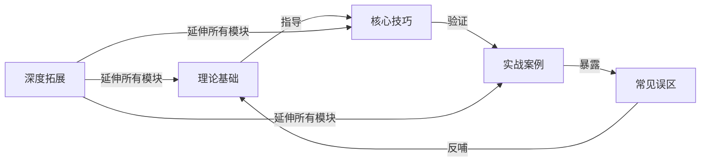

# 第20章 本章小结：50岁以上，收获是最大的智慧

## 一、全章知识体系总览

本章围绕"收获期"这一核心主题，从理论根基、实操技巧、真实案例和认知陷阱四个维度构建了完整的知识体系。以下思维导图展示了各模块之间的逻辑关系：

```mermaid
graph TB
    A["第20章：50岁以上·收获期"] --> B["理论基础"]
    A --> C["核心技巧"]
    A --> D["实战案例"]
    A --> E["常见误区"]
    A --> F["深度拓展"]

    B --> B1["生命周期财务理论"]
    B --> B2["退休收入三支柱"]
    B --> B3["养老金精算"]
    B --> B4["长寿风险管理"]
    B --> B5["资产配置理论"]
    B --> B6["行为金融学特征"]

    C --> C1["社保优化"]
    C --> C2["退休资金管理"]
    C --> C3["投资组合调整"]
    C --> C4["健康管理"]
    C --> C5["财富传承"]
    C --> C6["退而不休"]

    D --> D1["高管优雅退休"]
    D --> D2["工薪族退休规划"]
    D --> D3["自由职业者养老"]
    D --> D4["银发经济创业"]
    D --> D5["海外养老"]
    D --> D6["防诈骗教训"]

    E --> E1["过度保守"]
    E --> E2["忽视通胀"]
    E --> E3["金融骗局"]
    E --> E4["忽视健康"]
    E --> E5["过度资助子女"]
    E --> E6["不做遗产规划"]

    F --> F1["退休收入规划"]
    F --> F2["社会保障优化"]
    F --> F3["老年投资策略"]
    F --> F4["财富传承规划"]
    F --> F5["退休心理健康"]
    F --> F6["银发经济机遇"]

    style A fill:#2d3748,color:#fff
    style B fill:#2b6cb0,color:#fff
    style C fill:#2f855a,color:#fff
    style D fill:#c05621,color:#fff
    style E fill:#c53030,color:#fff
    style F fill:#6b46c1,color:#fff
```



**模块之间的逻辑关系：**



理论告诉我们"为什么"，技巧告诉我们"怎么做"，案例展示了"做得怎样"，误区提醒我们"别犯什么错"。四个模块环环相扣，构成从认知到行动的完整闭环。

---

## 二、理论基础：六根支柱

### 2.1 生命周期财务理论的终点

生命周期财务理论（Life-Cycle Hypothesis）指出，人一生的消费应该平滑分布——年轻时借贷消费（教育贷款），中年时储蓄积累，老年时消耗储蓄。50岁以后，你正式进入"消耗"阶段。但这里的"消耗"不是坐吃山空，而是**有计划、有节奏地将积累转化为生活品质**。

这个阶段的核心认知转变是：你的"资产"不再只是银行卡里的数字，还包括**健康、关系、经验和时间**。钱只是工具，最终服务的是生活本身。

### 2.2 退休收入三支柱——三条腿的凳子

退休收入的稳定性取决于三条腿是否均衡：

| 支柱 | 内容 | 替代率 | 确定性 | 覆盖率 |
|------|------|--------|--------|--------|
| 第一支柱 | 社保养老金 | 35-45% | 高 | ~95% |
| 第二支柱 | 企业年金/职业年金 | 10-20% | 高 | ~10% |
| 第三支柱 | 个人储蓄与投资 | 自主控制 | 低 | 取决于个人 |

**核心洞察：** 中国的企业年金覆盖率极低（约10%），这意味着大多数人只有"两条腿"——社保和个人储蓄。两条腿的凳子天然不稳，因此个人储蓄的规划和管理变得更加关键。如果你恰好拥有企业年金，恭喜你多了一条稳固的腿；如果没有，你需要在个人储蓄上投入更多精力。

### 2.3 养老金精算——精确到月的计算

养老金计算不是"大概"的事。基础养老金和个人账户养老金各有明确公式：

```text
基础养老金 = (当地社平工资 + 本人指数化月平均缴费工资) ÷ 2 × 缴费年限 × 1%
个人账户养老金 = 个人账户储存额 ÷ 计发月数
```

其中计发月数与退休年龄直接挂钩：50岁退休为195个月，55岁为170个月，60岁为139个月，65岁为101个月。延迟退休不仅增加缴费年限，还减少计发月数，双重提升每月养老金。

### 2.4 长寿风险管理——活得久也是风险

这听起来有些反直觉，但长寿确实是财务风险。假设你60岁退休、月需1万元、年通胀3%：

| 年龄 | 每月实际需要 | 累计需要 |
|------|------------|---------|
| 60岁 | 10,000元 | — |
| 70岁 | 13,439元 | ~144万 |
| 80岁 | 18,061元 | ~340万 |
| 90岁 | 24,273元 | ~610万 |

活得越久，需要的钱越多。应对策略包括终身年金化（把一部分资产转化为终身收入）、延迟退休（增加积累、减少消耗）、保守提取率（4%法则的动态调整版本）和适度的支出弹性。

### 2.5 资产配置理论——从增长到保全

50岁以后的资产配置逻辑与年轻时完全不同：

| 维度 | 20-40岁 | 50岁以上 |
|------|---------|----------|
| 首要目标 | 资本增值 | 本金保全 |
| 风险偏好 | 积极 | 保守 |
| 股票占比 | 60-80% | 15-30% |
| 债券占比 | 10-20% | 35-50% |
| 现金占比 | 5-10% | 15-25% |
| 时间视野 | 20-30年 | 10-20年 |
| 关键指标 | 年化收益率 | 提取可持续性 |

**核心原则：** 50岁以后，"不亏钱"比"多赚钱"更重要。一次-30%的损失，可能意味着延迟退休5年甚至更久。但"保守"不等于"全存银行"——通胀是隐性亏损，过度保守实际上是在"安全地亏钱"。

### 2.6 行为金融学——你比你以为的更不理性

50岁以上人群在投资中有几个典型的行为偏差：

- **损失厌恶加剧：** 年龄越大，对亏损的敏感度越高，容易在市场下跌时恐慌卖出
- **过度自信：** 多年的投资经验可能带来"我什么都懂"的错觉，忽视风险
- **锚定效应：** 固守过去的投资经验（如"买房肯定赚"），不愿接受新现实
- **从众心理：** 容易被"大家都在买"所影响，尤其在社区和微信群中
- **确认偏差：** 只关注支持自己判断的信息，忽视反面证据

认识到这些偏差的存在，是避免犯错的第一步。

---

## 三、核心技巧：六个维度的实操要点

### 3.1 社保优化——第一支柱的最大化

社保养老金是大多数人的"铁饭碗"，但很多人并不清楚如何最大化它的价值。

**关键优化方向：**

| 优化维度 | 具体策略 | 预期效果 |
|---------|---------|---------|
| 缴费年限 | 争取缴满30年以上，断缴及时补缴 | 每多1年，基础养老金+1% |
| 缴费基数 | 在法律允许范围内选择较高基数 | 个人账户积累更快 |
| 退休时机 | 评估延迟退休的收益比 | 每延迟1年，养老金+2-3% |
| 转移接续 | 多地工作过的及时办理社保转移 | 确保缴费年限完整记录 |
| 医保连续 | 确保医保缴费达标（男25年/女20年） | 退休后终身享受医保 |
| 企业年金 | 了解领取方式（一次性/分期/转年金） | 避免一次性领取的税务损失 |

**实操建议：** 登录国家社会保险公共服务平台（si.12333.gov.cn），查询你的缴费记录和预估养老金。如果发现断缴记录，立即咨询当地社保局了解补缴政策。

### 3.2 退休资金管理——桶型配置与动态提取

退休资金管理的核心框架是"桶型配置"——将资产按时间维度分桶：

| 桶 | 时间跨度 | 资产类别 | 目标 | 占比 |
|----|---------|---------|------|------|
| 第一桶 | 1-3年 | 货币基金、活期存款、短期国债 | 流动性保障 | 15-25% |
| 第二桶 | 3-10年 | 中长期国债、高等级债券基金、大额存单 | 稳定收益 | 35-45% |
| 第三桶 | 10年以上 | 高股息ETF、REITs、指数基金、黄金 | 抗通胀增长 | 25-35% |

**桶型配置的精髓：** 每年从第三桶的收益中向第二桶补充，从第二桶的收益中向第一桶补充。这样即使股市大跌，你的短期生活费（第一桶）不受影响，中期生活费（第二桶）也有保障。你有10年的时间等股市恢复，而不是被迫在低点卖出。

**动态提取策略：** 不固定每年提取金额，而是根据市场表现动态调整。市场好多提一些（上限5%），市场差少提一些（下限2.5%），正常年份按4%提取。这种策略比固定4%提取能多支撑5-8年。

### 3.3 投资组合调整——保守但不僵化

适合50岁以上人群的三种投资组合模型：

| 类型 | 现金 | 债券 | 股票 | REITs | 黄金 | 适合人群 |
|------|------|------|------|-------|------|---------|
| 保守型 | 30% | 40% | 15% | 10% | 5% | 风险承受力低、已有充足积蓄 |
| 平衡型 | 20% | 35% | 25% | 15% | 5% | 风险承受力中等、积蓄尚可 |
| 积极型 | 15% | 25% | 35% | 15% | 10% | 风险承受力较高、有其他收入来源 |

**高股息策略详解：** 50岁以上投资者特别适合高股息策略。选择连续5年以上稳定分红的股票或ETF，年股息率在3-5%之间。股息收入可以补充退休现金流，即使股价短期下跌，只要公司基本面健康，分红不会中断。典型的高股息标的包括银行股、公用事业股、红利指数ETF等。

### 3.4 健康管理——最大的隐性资产

健康是50+人群最被低估的"资产"。以下数据说明了健康管理的财务意义：

| 项目 | 年度成本 | 不做的潜在代价 | 投资回报比 |
|------|---------|--------------|-----------|
| 全面体检 | 2,000-5,000元 | 大病治疗10-50万 | 1:50+ |
| 每周3次运动 | 0-3,000元 | 延长健康寿命5-10年 | 无法估量 |
| 合理饮食 | 基本无额外成本 | 减少50%慢性病风险 | 无法估量 |
| 充足睡眠 | 0元 | 认知衰退加速 | 无法估量 |
| 百万医疗险 | 1,500-3,000元/年 | 自付大病费用 | 1:100+ |

**50岁以上体检重点筛查：**

| 年龄段 | 重点项目 | 频率 |
|--------|---------|------|
| 50-60岁 | 肠镜、胃镜、肺部CT、心脏彩超、颈动脉超声 | 每年1次 |
| 60-70岁 | 增加上述项目+骨密度、眼底检查、认知功能筛查 | 每年1次 |
| 70岁以上 | 全面筛查+跌倒风险评估、营养评估 | 每年1-2次 |

### 3.5 财富传承——不仅是"传钱"

财富传承是50岁以后最重要的财务课题之一。核心传承工具对比：

| 工具 | 适用场景 | 优势 | 劣势 | 门槛 |
|------|---------|------|------|------|
| 遗嘱 | 所有人 | 简单、成本低 | 可能被质疑、需公证 | 低 |
| 保险 | 中产及以上 | 指定受益人、杠杆放大 | 产品选择复杂 | 中 |
| 赠与 | 生前转移 | 减少遗产规模 | 失去控制权 | 低 |
| 信托 | 高净值人群 | 资产隔离、条件控制 | 门槛高、费用高 | 高（1000万+） |
| 家族企业传承 | 企业主 | 保持企业连续性 | 最复杂 | 高 |

**传承的核心理念：** 传承不仅是"传钱"，更是"传能力"和"传价值观"。提前培养子女的财商、责任感和独立能力，比直接给钱更有价值。定期召开家庭财务会议，让家人了解家庭财务状况和你的意愿，是避免未来纠纷的最有效方式。

### 3.6 退而不休——经验的二次变现

退休不等于停止创造价值。50岁以上人群的"经验资本"是年轻人无法比拟的。

**经验变现的五条路径：**

1. **咨询顾问：** 利用行业经验和人脉，为企业或个人提供咨询服务。时薪通常在300-2000元，每周工作10-15小时即可获得可观收入
2. **培训授课：** 将专业知识转化为课程，在企业内训、行业协会、在线平台分享。单次课酬从几千到数万不等
3. **内容创作：** 通过公众号、短视频、播客分享经验和见解。前期收入可能不高，但积累到一定粉丝量后可以接广告、做知识付费
4. **社区服务：** 担任社区顾问、业委会成员、志愿者等。虽然不一定有直接收入，但能保持社会连接和价值感
5. **兴趣创业：** 将兴趣爱好（书法、摄影、园艺等）转化为小规模的商业活动

**关键原则：** 退而不休的首要目的不是赚钱，而是保持活力和社会连接。收入是副产品，价值感和社交才是核心目标。

---

## 四、实战案例的深层启示

本章六个真实案例覆盖了50+人群的典型画像，每个案例都揭示了独特的教训：

### 案例启示提炼

| 案例 | 核心人物 | 核心问题 | 关键策略 | 最大启示 |
|------|---------|---------|---------|---------|
| 企业高管 | 王志远，56岁 | 收入断崖式下降，资产集中于房产 | 卖房分散投资、桶型配置、支出调整 | 高收入不等于高保障，退休规划要提前3-5年 |
| 工薪族 | 李大姐，52岁 | 月薪8000，积蓄有限 | 社保最大化、极度节俭、小额投资 | 即使收入不高，合理的规划也能保障基本养老 |
| 自由职业者 | 张先生，55岁 | 无社保、无企业年金 | 灵活就业社保+商业养老保险+自建投资组合 | 没有"铁饭碗"更需要提前规划，每一分钱都要有安排 |
| 银发创业 | 陈伯伯，58岁 | 退休后精神空虚 | 利用行业经验做咨询+线上课程 | 退休是新事业的起点，经验是最值钱的资产 |
| 海外养老 | 刘夫妇，53岁 | 国内养老成本高 | 泰国养老方案对比分析 | 海外养老是选项之一，但需要全面评估医疗、法律、文化适应 |
| 金融诈骗 | 赵阿姨，62岁 | 被"高收益理财"骗走积蓄 | 事后止损、报警、家庭重建 | 任何承诺"保本高收益"的都是骗局，永远和家人商量 |

### 从案例中提取的五条铁律

**铁律一：退休规划至少提前5年。** 无论是高管还是工薪族，临时抱佛脚的退休规划效果都大打折扣。资产配置调整需要时间，社保优化需要时间，生活方式的转变更需要时间。

**铁律二：资产分散是生存法则，不是投资建议。** 案例中几乎每个主人公都有资产过度集中的问题。50岁以后，任何单一资产超过总资产的30%都是在赌博。

**铁律三：现金流比资产总额更重要。** 拥有价值1800万房产但月现金流紧张的高管，不如月稳定收入1万但无贷款的退休教师过得安心。退休规划的核心是"现金流规划"。

**铁律四：家人是最好的"风控系统"。** 金融诈骗案例中的赵阿姨，如果在投资前和家人商量，就不会损失积蓄。任何重大财务决策都应该有家人参与。

**铁律五：退休是转型，不是终点。** 陈伯伯的案例证明，退休后的人生可以更精彩——前提是你有规划、有目标、有行动。

---

## 五、十大误区的核心教训

本章详细剖析了50+人群最容易犯的十个错误。这里不再重复每个误区的细节（详见"常见误区"一节），而是提炼出贯穿所有误区的**三个底层认知陷阱**：

### 陷阱一：静态思维——用今天的眼光看明天的问题

过度保守、忽视通胀、不做遗产规划，本质上都是"静态思维"的表现。你用今天的购买力衡量"够不够"，用今天的健康状况衡量"需不需要"，用今天的家庭结构衡量"规不规划"。但世界在变——通胀在侵蚀你的财富，身体在衰老，家庭关系在演变。

**破解方法：** 每年做一次"全面体检"——不仅是身体体检，还包括财务体检、保险体检、遗产体检。用动态的眼光看待自己的处境。

### 陷阱二：过度自信——"我的经验足够了"

盲目相信专业人士（因为觉得"专家说的肯定对"）和投资过于集中（因为觉得"这个我懂"），看似矛盾，实则都是过度自信的不同表现。前者是"我判断人的眼光不会错"，后者是"我判断投资的眼光不会错"。

**破解方法：** 建立"决策检查清单"。任何投资决策前，逐项核对：是否有正规资质？年化收益是否超过8%？是否需要拉人头？是否催促快速决策？是否不让和家人商量？五个问题中有任何一个"是"，就应该停下来。

### 陷阱三：情感绑架——"为了家人好"

过度资助子女、不和家人沟通，表面看是"爱"，实际是用情感绑架自己的理性判断。掏空积蓄帮子女买房，结果自己生病无钱可治，反而成为子女的负担。不和家人沟通，以为是"不想让他们担心"，结果万一出事，家人手足无措。

**破解方法：** "先保全自己，再帮助家人"不是自私，而是最大的负责。就像飞机上的安全指示——先给自己戴好氧气面罩，再帮助他人。定期召开家庭财务会议，让每个人都了解家庭的财务状况和应急方案。

---

## 六、行动清单：从知到行的路线图

读完本章，知识只有转化为行动才有价值。以下行动清单按紧迫程度分为四个层级：

### 第一周：紧急且重要——摸清家底

| 行动 | 具体步骤 | 参考章节 |
|------|---------|---------|
| 测算退休收入缺口 | 用"支出预算法"计算退休后年支出，减去社保和企业年金收入，得出缺口 | 练习方法·练习一 |
| 查询社保养老金预估 | 登录si.12333.gov.cn或当地社保局官网，查询缴费记录和预估养老金 | 练习方法·练习二 |
| 检查医保是否充足 | 确认缴费年限是否达标、了解报销比例、评估是否需要补充商业医疗险 | 练习方法·练习六 |

### 第一个月：重要但不紧急——优化结构

| 行动 | 具体步骤 | 参考章节 |
|------|---------|---------|
| 资产配置健康检查 | 盘点所有资产，评估是否过度集中，制定调整计划 | 练习方法·练习三 |
| 开始制定遗嘱 | 列出资产清单、确定受益人、选择遗嘱形式、咨询律师 | 练习方法·练习七 |
| 防骗能力自测 | 完成防骗测试题，答错3题以上需认真学习防骗知识 | 练习方法·练习八 |
| 家庭财务会议 | 与配偶开一次正式的财务会议，讨论退休规划和应急方案 | 常见误区·误区六 |

### 第一季度：战略级——建立体系

| 行动 | 具体步骤 | 参考章节 |
|------|---------|---------|
| 建立桶型配置 | 按1-3年/3-10年/10年以上三个时间桶分配资产 | 练习方法·练习四 |
| 制定退休生活规划 | 规划每日时间表、每周活动、兴趣爱好、社交安排 | 练习方法·练习五 |
| 全面体检 | 安排50+重点筛查项目（肠镜、胃镜、肺部CT等） | 核心技巧·健康管理 |
| 咨询专业人士 | 分别咨询理财顾问、律师、保险经纪人，获得专业建议 | 深度拓展 |

### 每年持续：长期维护

| 行动 | 频率 | 说明 |
|------|------|------|
| 更新退休收入测算 | 每年1次 | 根据最新收入、支出、资产数据重新计算 |
| 资产配置再平衡 | 每半年1次 | 检查各桶规模，偏离目标10%以上需调整 |
| 全面体检 | 每年1次 | 50岁以上重点筛查，结果存档对比 |
| 遗嘱审视和更新 | 每3-5年1次 | 资产变化、家庭结构变化时及时更新 |
| 家庭财务会议 | 每季度1次 | 与配偶同步财务状况，讨论重大决策 |
| 保险体检 | 每年1次 | 续保前检查保额是否充足、产品是否过时 |

---

## 七、收获期的核心理念


**1. 安全第一**

保护已积累的财富，比追求更多的财富更为重要。50岁以后，"不亏钱"比"多赚钱"更重要。你已经没有足够的时间来弥补重大亏损——一次-30%的损失可能意味着延迟退休5年。安全性、流动性、收益性，这个排序不能变。

**2. 享受当下**

在确保财务安全的前提下，尽情享受退休生活。你辛苦了一辈子，值得享受劳动成果。不要因为过度节俭而委屈自己，也不要因为过度担忧未来而忘记活在当下。适度消费是对自己几十年辛勤工作的回报。

**3. 传承有序**

将财富和智慧传递给下一代，留下有意义的遗产。传承不仅是"传钱"，更是"传能力"和"传价值观"。提前规划、与家人充分沟通、选择合适的传承工具，是避免家庭纠纷和财富流失的关键。

**4. 终身成长**

退休不是学习和成长的终点，而是新的起点。保持好奇心和学习热情，让大脑保持活跃。学习新技能、探索新领域、结交新朋友——这些活动不仅延缓认知衰退，还能带来新的价值感和成就感。

**5. 社会连接**

保持与家人、朋友和社区的连接，是幸福晚年的关键。孤独是晚年最大的敌人。研究表明，社交活跃的老年人比社交孤立的老年人寿命长7-10年。主动维护社交网络、参加社区活动、做志愿服务，是保持社会连接的有效方式。

---

## 八、与全书的衔接

第20章作为"收获期"，是全书四个人生阶段的终点：

| 人生阶段 | 年龄段 | 核心主题 | 关键策略 |
|---------|--------|---------|---------|
| 第一阶段 | 20-30岁 | 播种期 | 建立储蓄习惯、学习投资基础、开始社保缴纳 |
| 第二阶段 | 30-40岁 | 耕耘期 | 提高收入、积极投资、建立家庭保障 |
| 第三阶段 | 40-50岁 | 守护期 | 风险管理、子女教育金、中年职业转型 |
| **第四阶段** | **50岁以上** | **收获期** | **保全财富、退休规划、传承安排** |

前三个阶段的每一个决策，都会影响收获期的质量。20岁时开始的社保缴纳，决定了50年后养老金的多少。30岁时建立的投资习惯，决定了50岁时资产配置的合理性。40岁时做的风险管理，决定了50岁时面对意外的从容程度。

**但如果你在前三个阶段做得不够好，也不要绝望。** 本章的工薪族案例（李大姐）证明，即使收入不高、起步较晚，通过合理的规划和严格的执行，依然可以拥有有尊严的退休生活。关键是**现在就开始行动**。

---

> **最后的忠告：** 财富只是幸福晚年的一个组成部分。健康、关系、意义和内心的平静，才是真正的"财富"。在追求财务安全的同时，不要忽视这些更加珍贵的人生财富。
>
> 正如一位智者所说："人生最大的财富不是你拥有多少钱，而是你在人生的最后一天，能够微笑着说'我度过了充实而有意义的一生'。"
>
> 祝你在人生的收获期，收获健康、收获幸福、收获内心的平静。
