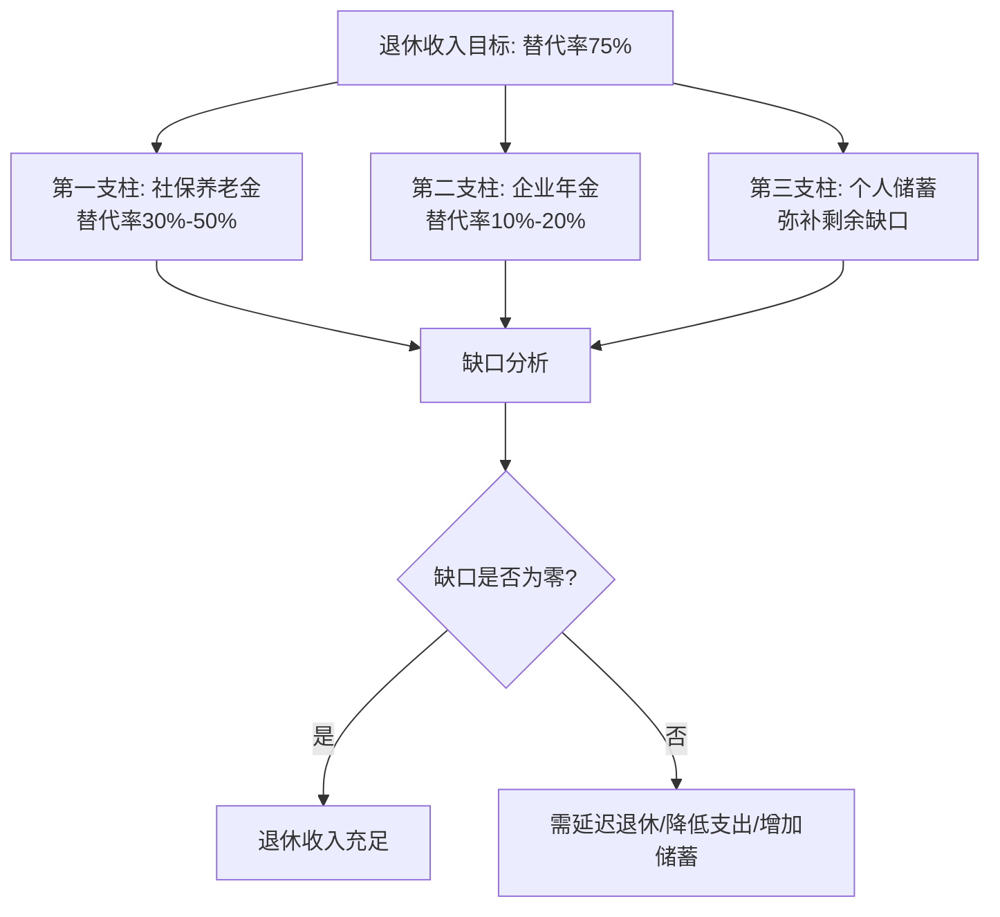
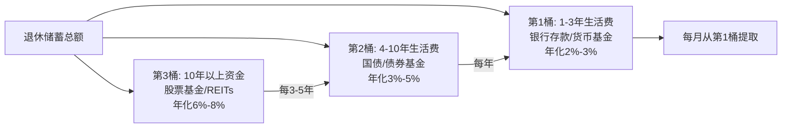

# 深度拓展：50岁以上人群的退休与财富全周期管理

50岁是人生财务的分水岭。前半生积累的财富，从此刻起需要从"增长模式"切换到"保全+收益模式"。本章从退休收入体系、社保精算优化、老年投资组合、财富传承架构、心理健康管理、银发经济机遇六大维度，系统构建50岁以上人群的完整财富管理框架。

***

## 一、退休收入规划

### 1.1 退休收入的来源结构

50岁以上人群面临的最核心财务问题是：如何确保退休后有足够的收入来维持期望的生活水平。退休收入通常来自以下几个来源：

**1. 社会养老保险（第一支柱）**

这是大多数人退休后最重要的收入来源。养老金由基础养老金和个人账户养老金两部分组成，计算涉及缴费年限、缴费基数、当地社会平均工资等多个因素。根据人社部数据，2024年全国企业退休人员月均养老金约3400元，但地区差异巨大——北京、上海等地超过5000元，而部分中西部省份不足2500元。

**2. 企业年金和职业年金（第二支柱）**

部分企业和机关事业单位提供的补充养老保险。截至2024年底，全国企业年金覆盖职工约3200万人，仅占城镇职工基本养老保险参保人数的约7%。企业年金的覆盖率在中国仍然较低，但在大型国企（如中石油、国家电网）和外企中较为普遍。职业年金则覆盖所有机关事业单位工作人员，缴费比例为单位8%+个人4%。

**3. 个人储蓄和投资（第三支柱）**

包括银行存款、基金、股票、债券等金融资产，以及出租房产的租金收入等。个人养老金制度自2022年11月在全国36个先行城市启动试点，2024年12月已推广至全国，年缴费上限12000元，可享受税收递延优惠。

**4. 商业养老保险**

通过购买商业养老保险产品获得的年金收入。包括传统年金险、增额终身寿险、分红险等形态。商业养老保险的核心优势是"终身领取"——无论活多久，保险公司都必须按合同支付，这是社保之外唯一能对冲长寿风险的金融工具。

**5. 其他收入**

包括子女赡养（法律规定子女有赡养义务）、兼职工作或顾问收入、知识产权收入（版税、专利许可费）、政府补贴（高龄津贴、低保、特困供养）、住房反向抵押（以房养老）等。

### 1.2 退休收入的"三条腿凳子"理论

国际上将退休收入体系比喻为"三条腿凳子"（Three-Legged Stool），这个模型最早由美国大都会人寿保险公司在1950年代提出，至今仍是退休规划的核心框架：

**第一条腿：社会保障（社保养老金）**

| 维度 | 说明 |
|------|------|
| 功能定位 | 提供基本生活保障，是"兜底线"的角色 |
| 金额水平 | 替代率通常为30%-50%（即退休后收入为退休前的30%-50%） |
| 优势 | 安全、稳定、终身领取、与通胀挂钩（每年调整） |
| 劣势 | 替代率不足以维持退休前的生活水平；受政策调整影响（如延迟退休） |
| 2024年全国平均 | 企业退休人员月均约3400元 |

**第二条腿：雇主福利（企业年金/职业年金）**

| 维度 | 说明 |
|------|------|
| 功能定位 | 补充社保的不足，属于"锦上添花" |
| 金额水平 | 取决于企业年金计划的设计和投资收益 |
| 优势 | 有雇主的缴费匹配（通常企业出大头）；享受税收优惠 |
| 劣势 | 覆盖率低（仅约7%的城镇职工享有）；可携带性差（换工作可能损失）；领取方式受限 |
| 典型替代率 | 额外增加10%-20%的替代率 |

**第三条腿：个人储蓄（自主积累）**

| 维度 | 说明 |
|------|------|
| 功能定位 | 弥补前两条腿的不足，是"自力更生"的部分 |
| 金额水平 | 完全取决于个人积累和投资收益 |
| 优势 | 完全自主控制；灵活度高；可选择的投资品种丰富 |
| 劣势 | 需要自行管理，存在投资风险和长寿风险；需要自律和纪律 |
| 补充幅度 | 目标替代率75%时，需弥补25%-45%的缺口 |

**关键原则：三条腿缺一不可。** 只依赖社保养老金是不够的，只依赖个人储蓄风险太大。最稳健的退休收入结构是三条腿并重。如果缺少企业年金（第二条腿），就需要在第三条腿上投入更多。

### 1.3 退休收入的规划方法

**方法一：收入替代率法**

收入替代率是指退休后收入占退休前收入的比例。国际劳工组织（ILO）建议最低替代率为40%，OECD国家平均约62%。在中国，综合考虑生活成本和医疗支出，70%-80%的替代率可以维持退休前的生活水平。

具体计算步骤：

1. **确定退休前的年收入**：取近5年平均值，避免单一年份波动。例如：年收入20万元。
2. **计算目标退休收入**：退休前年收入 × 75% = 20万 × 75% = 15万元/年。
3. **计算社保和企业年金的预期收入**：登录"国家社会保险公共服务平台"（si.12333.gov.cn）查询养老金预估，假设社保年收入7.2万元（月均6000元），企业年金1.2万元/年。
4. **计算个人储蓄需补充的金额**：15万 - 7.2万 - 1.2万 = 6.6万元/年。
5. **计算需要积累的个人储蓄总额**：假设60岁退休、预期寿命85岁，退休年数25年，考虑3%通胀，需要约108万元的退休储蓄（使用精算公式计算现值）。

**方法二：支出预算法**

从退休后的生活支出出发，反推需要多少退休收入。这种方法更贴近实际，因为不同人的生活方式差异很大。

具体步骤：

1. **详细列出退休后的每月支出项目**：

| 类别 | 具体项目 | 月估算（元） | 备注 |
|------|----------|-------------|------|
| 住房 | 房贷/租金、物业、维修 | 2000 | 假设已还清房贷 |
| 饮食 | 日常餐饮、营养补充 | 2500 | 注重营养均衡 |
| 医疗 | 门诊、药品、体检 | 1000 | 慢性病管理 |
| 交通 | 公交、打车、偶尔出行 | 500 | |
| 通讯 | 手机、网络 | 200 | |
| 娱乐 | 旅游、兴趣爱好、社交 | 1500 | 退休后旅游增加 |
| 日用品 | 衣物、家居用品 | 500 | |
| 人情往来 | 子女、亲友、礼金 | 800 | |
| 预备金 | 突发支出 | 1000 | 家电维修等 |
| **合计** | | **10000** | 年12万 |

2. **区分"必需支出"和"可选支出"**：必需支出（住房、饮食、医疗、通讯）约5700元/月；可选支出（娱乐、旅游、人情）约3300元/月。
3. **计算总支出**：必需支出 × 12 = 6.84万/年（底线）；总支出 × 12 = 12万/年（舒适）。
4. **扣除社保和企业年金的收入**：12万 - 8.4万 = 3.6万/年缺口。
5. **确定需要的个人储蓄总额**：3.6万 × 25年 × 1.3（通胀系数）≈ 117万元。

**方法三：精算法（蒙特卡洛模拟）**

使用精算模型，综合考虑通胀、投资回报率、预期寿命、医疗费用增长等因素，通过蒙特卡洛模拟（Monte Carlo Simulation）计算退休金需求。这种方法最为精确——不是给出一个"点估计"，而是给出一个概率分布："在95%的模拟情景下，你的退休金够用到85岁"。

具体方法：
- 使用在线退休计算器（如嘉实基金退休计算器、蚂蚁财富养老金计算器）
- 或使用Excel/Python自行建模，关键参数包括：预期收益率（保守取4%-5%）、通胀率（取3%）、预期寿命（取85-90岁，留安全边际）、医疗费用增长率（通常高于一般通胀，取5%-6%）

### 1.4 退休收入的领取策略

**1. 社保养老金的领取时机**

中国的法定退休年龄正在逐步延迟。根据2025年1月1日起实施的渐进式延迟退休方案：

| 人群 | 原退休年龄 | 延迟后退休年龄 | 过渡期 |
|------|-----------|--------------|--------|
| 男性职工 | 60岁 | 63岁 | 2025-2040年（15年过渡） |
| 女性干部 | 55岁 | 58岁 | 2025-2035年（10年过渡） |
| 女性工人 | 50岁 | 55岁 | 2025-2035年（10年过渡） |

**延迟退休的经济分析：**

每延迟一年退休，养老金的变化如下：
- **缴费年限增加1年**：基础养老金增加约1%的社平工资
- **个人账户积累增加**：多缴一年的8%缴费+投资收益
- **计发月数减少**：例如60岁退休计发139个月，61岁退休计发约129个月
- **综合效果**：每延迟一年，月养老金大约增加3%-5%

假设某人60岁退休时月养老金5000元，延迟到63岁退休可能达到5500-5800元，同时少领3年养老金（约18万），需要约10-12年才能"回本"。因此，是否延迟退休需要根据个人健康状况、工作意愿、财务状况综合判断。

**弹性退休选择指南：**

| 情形 | 建议 | 理由 |
|------|------|------|
| 健康良好+工作意愿强 | 延迟退休 | 增加收入，保持社会连接 |
| 健康一般+有足够储蓄 | 按时退休 | 享受生活比多赚养老金更重要 |
| 健康较差 | 按时或提前（如有可能） | 健康是最大的财富 |
| 社保缴费年限不足 | 延迟退休补缴 | 确保满足最低缴费年限（目前为15年，2030年起逐步提高到20年） |

**2. 个人储蓄的提取策略——"4%法则"及其变体**

美国财务规划师William Bengen在1994年提出的"4%法则"是全球最广泛使用的退休提取策略：第一年提取退休储蓄总额的4%，之后每年按通胀调整。

| 策略 | 方法 | 优点 | 缺点 | 适用场景 |
|------|------|------|------|---------|
| 固定金额法 | 每年提取固定金额 | 可预测性强，便于预算 | 不考虑通胀和投资回报变化 | 收入来源已很稳定 |
| 固定比例法 | 每年提取储蓄总额的4%-5% | 随资产规模动态调整 | 提取金额随市场波动 | 愿意接受收入波动 |
| 动态提取法（推荐） | 好年景多提、差年景少提 | 兼顾生活需求和资产保值 | 需要自我约束 | 大多数退休人群 |
| 按需提取法 | 需要多少提多少 | 最灵活 | 可能过度消费 | 有其他稳定收入来源 |
| 分桶策略 | 将资金分为短期/中期/长期三桶 | 兼顾安全性和收益性 | 管理稍复杂 | 有中等投资经验的人 |

**分桶策略详解（推荐）：**

**具体操作**：假设退休储蓄200万元，年支出12万元。
- 第1桶（36万）：存银行活期+短期理财，覆盖3年生活费
- 第2桶（60万）：买国债+债券基金，覆盖4-10年
- 第3桶（104万）：配置股票基金+REITs，争取长期增值

每年年底，从第2桶补充第1桶至36万；每3-5年，根据第3桶的收益情况补充第2桶。这样既保证了短期内有钱花，又不会因为短期市场波动而被迫卖出长期投资。

***

## 二、社会保障优化

### 2.1 社保养老金的精算计算

中国的社保养老金由两部分组成：

**基础养老金 = （当地上年度在岗职工月平均工资 + 本人指数化月平均缴费工资）÷ 2 × 缴费年限 × 1%**

其中，"本人指数化月平均缴费工资"= 当地社平工资 × 本人平均缴费指数。平均缴费指数是指你每年缴费基数与当年社平工资的比值的平均值。如果一直按最低基数（60%社平工资）缴费，平均缴费指数为0.6；如果按社平工资缴费，指数为1.0。

**个人账户养老金 = 个人账户储存额 ÷ 计发月数**

计发月数根据退休年龄确定，这是基于平均预期寿命精算得出的：

| 退休年龄 | 计发月数 | 退休年龄 | 计发月数 |
|---------|---------|---------|---------|
| 50岁 | 195个月 | 58岁 | 148个月 |
| 55岁 | 170个月 | 59岁 | 143个月 |
| 60岁 | 139个月 | 61岁 | 129个月 |
| 62岁 | 125个月 | 63岁 | 117个月 |

**实例计算：**

张先生，60岁退休，工龄35年，当地社平工资8000元/月，平均缴费指数1.0，个人账户储存额25万元。

- 基础养老金 =（8000 + 8000 × 1.0）÷ 2 × 35 × 1% = 2800元/月
- 个人账户养老金 = 250000 ÷ 139 = 1799元/月
- **合计：4599元/月**

如果张先生平均缴费指数为0.6（按最低基数缴费）：
- 基础养老金 =（8000 + 8000 × 0.6）÷ 2 × 35 × 1% = 2240元/月
- 合计：约4039元/月

**关键发现**：缴费基数从60%提高到100%，基础养老金增加25%，但当期缴费增加67%。这意味着高基数缴费的"边际回报"是递减的。

### 2.2 社保优化策略

**策略一：延长缴费年限（最高优先级）**

缴费年限是影响养老金水平的最重要因素。每多缴一年，基础养老金增加约1%的社平工资。根据2030年起的新规，最低缴费年限将从15年逐步提高到20年（每年增加6个月）。

实操建议：
- 50岁时如果缴费年限不足15年，应立即考虑补缴方案
- 如果接近退休但缴费年限差几年，可选择延迟退休继续缴费
- 灵活就业人员可以自愿选择缴费基数和年限

**策略二：提高缴费基数**

在法律允许的范围内（社平工资的60%-300%），选择较高的缴费基数。但要注意"性价比"：

| 缴费基数 | 平均缴费指数 | 基础养老金（35年工龄） | 每月多缴（相比60%） | 每月多领（相比60%） | 多缴/多领比 |
|---------|------------|-------------------|-----------------|-----------------|-----------|
| 60%社平 | 0.6 | 2240元 | — | — | — |
| 100%社平 | 1.0 | 2800元 | +320元 | +560元 | 1:1.75 |
| 200%社平 | 2.0 | 4200元 | +1120元 | +1960元 | 1:1.75 |
| 300%社平 | 3.0 | 5600元 | +1920元 | +3360元 | 1:1.75 |

注：以社平工资8000元/月、个人缴费比例8%计算。

结论：从60%提高到100%性价比最高；超过200%后，"投资回报"与直接理财相当。

**策略三：选择合适的退休时机**

如果健康状况允许且工作意愿存在，延迟退休可以带来三重好处：
1. 多缴社保增加缴费年限
2. 个人账户多积累一年
3. 计发月数减少（每月领取金额增加）

**策略四：跨地区社保转移**

如果在多个城市工作过，需要及时办理社保转移接续手续。办理流程：
1. 在新就业地建立社保关系后，向新参保地社保经办机构提出转移申请
2. 新参保地审核后向原参保地发出联系函
3. 原参保地办理转出手续，划转资金
4. 新参保地接收并完成接续

注意事项：转移时只转个人账户资金和统筹基金的一部分（12%），不是全部统筹基金。因此频繁转移可能"亏"统筹部分。建议在确定退休地后再统一办理转移。

**策略五：补缴社保**

对于缴费年限不足的人群：
- **职工社保**：2016年后大部分地区已禁止一次性补缴超过3年的社保。如果差的年限不多，可选择延迟退休逐年补缴。
- **灵活就业社保**：部分地区允许补缴，但政策差异大，需咨询当地社保局。
- **城乡居民社保**：允许补缴，但待遇水平远低于职工社保。

### 2.3 医保的深度优化

医疗保险是退休生活中最重要的保障之一。老年人的医疗支出是刚性需求，且随年龄增长呈指数级上升——60-70岁的年均医疗支出是50-60岁的1.5-2倍，70岁以上是2-3倍。

**1. 确保医保缴费年限达标**

大多数地区要求男性缴满25-30年、女性缴满20-25年，退休后才能享受终身医保待遇（不再缴费仍可报销）。各省市标准不同：

| 地区 | 男性最低年限 | 女性最低年限 | 备注 |
|------|-----------|-----------|------|
| 北京 | 25年 | 20年 | 2001年前参加工作的另有规定 |
| 上海 | 15年 | 15年 | 全国最低标准之一 |
| 广东 | 15-30年（各地不同） | 15-25年 | 省内各市标准不一 |
| 四川 | 25年 | 20年 | |

如果缴费年限不足，可选择：
- 延迟退休继续缴纳
- 一次性补缴差额年限（部分地区允许）
- 转为城乡居民医保（保障水平降低）

**2. 了解医保报销的实操细节**

以2024年某省会城市职工医保为例：

| 项目 | 在职人员 | 退休人员 | 备注 |
|------|---------|---------|------|
| 门诊起付线 | 1500元/年 | 1200元/年 | 退休人员更低 |
| 门诊报销比例 | 70% | 80% | 退休人员更高 |
| 住院起付线 | 800元/次 | 600元/次 | 退休人员更低 |
| 住院报销比例 | 85% | 90% | 退休人员更高 |
| 年度封顶线 | 30万元 | 30万元 | 超出部分自费或大病保险报销 |

**关键点**：退休人员的医保待遇优于在职人员——起付线更低、报销比例更高。这是延迟退休的隐性收益之一。

**3. 补充商业医疗保险的策略**

医保的报销范围有限（进口药、靶向药、ICU等很多不在报销范围内），建议构建"三重保障"：

| 层级 | 产品类型 | 年费用 | 保额 | 覆盖范围 |
|------|---------|-------|------|---------|
| 第一层 | 基本医保 | 已缴 | 30万 | 甲类药品+基本诊疗 |
| 第二层 | 百万医疗险 | 1000-3000元 | 200-600万 | 自费药、进口药、ICU |
| 第三层 | 防癌险/重疾险 | 3000-8000元 | 10-50万 | 确诊即赔，弥补收入损失 |

50岁以上购买百万医疗险的注意事项：
- 55岁以下仍可正常投保百万医疗险，保费约1500-2500元/年
- 55-60岁部分产品需要体检，保费上升到3000-5000元/年
- 60岁以上可选择防癌医疗险（只保癌症），保费约1000-2000元/年
- 有慢性病（高血压、糖尿病）的人群，可选择"慢病版"百万医疗险

**4. 异地就医备案（退休后异地居住必备）**

如果退休后居住地与参保地不同，必须办理异地就医备案，否则报销比例会大幅降低。

办理方式（2024年起已实现全国联网）：
1. **线上办理**：登录"国家医保服务平台"APP → 异地就医备案 → 填写信息 → 即时生效
2. **线下办理**：到参保地医保经办窗口填写《异地就医登记备案表》
3. **所需材料**：身份证、社保卡、异地居住证明（居住证或房产证）

备案后，在居住地的定点医院就医可直接结算，报销比例与参保地相同（或略低5%-10%）。

### 2.4 长期护理保险

长期护理保险（长护险）是社保"第六险"，自2016年开始试点，截至2024年已覆盖全国49个城市。

**什么是长护险？** 当参保人因年老、疾病、伤残导致失能（生活不能自理，如无法独立完成吃饭、穿衣、洗澡、如厕、行动、上下床6项中的3项以上），长护险支付护理费用。

**报销标准（以试点城市为例）：**
- 机构护理：报销70%-85%，每月限额2000-3000元
- 居家护理：报销75%-90%，每月限额1500-2500元
- 亲情护理（家属照护）：部分地区给予补贴，每月500-1000元

**参保方式**：职工医保参保人自动纳入长护险试点，无需额外缴费（从医保统筹基金划转）；居民医保参保人按年缴费，个人约30-90元/年。

**为什么50岁以上人群必须关注长护险？** 根据国家卫健委数据，中国60岁以上老年人中，失能/半失能比例约为18%，约4500万人。失能后的护理费用是退休后最大的财务风险之一——专业护理机构月费用5000-15000元，远超大多数人的养老金水平。

***

## 三、老年投资策略

### 3.1 老年投资的基本原则——"守富"五原则

50岁以上人群的投资核心目标已从"增值"转为"保值+现金流"。具体遵循以下五原则：

**原则一：安全性第一（本金保护）**

在投资回报和安全性之间，优先选择安全性。保护本金不受损失比追求高回报更为重要。数学上，亏损50%需要上涨100%才能回本。对于即将退休或已退休的人，没有"时间换空间"的机会——因为退休后的现金流依赖于本金。

**量化标准**：
- 投资组合的最大回撤不应超过10%-15%
- 高风险资产（股票、股票基金）占比不超过30%
- 每年可承受的投资亏损上限 = 投资总额 × 3%-5%

**原则二：流动性优先（随时可用）**

保持足够的流动性资产，以应对突发的医疗费用或其他紧急支出。

**流动性分层建议**：
- 第一层（随时可取）：银行活期+货币基金，覆盖6个月生活费
- 第二层（1-3天到账）：短期理财+国债逆回购，覆盖2年生活费
- 第三层（1周-1月到账）：债券基金+定期存款，覆盖3-5年
- 第四层（1月以上）：股票基金+REITs+房产，长期增值

**原则三：收入导向（现金流优先）**

投资策略应从"资本增值"转向"收入生成"。优先选择能够提供稳定现金流的投资品种。目标是让投资产生的被动收入覆盖日常支出，无需动用本金。

**原则四：分散化（不把鸡蛋放在一个篮子里）**

分散化包括三个维度：
- **资产类别分散**：股票、债券、现金、房产、黄金
- **地域分散**：国内、海外（通过QDII基金）
- **时间分散**：定投、分批买入，避免择时风险

**原则五：简化管理（越老越简单）**

随着年龄增长，投资管理应该越来越简化：
- 50-60岁：可以适度关注市场，每季度调整一次
- 60-70岁：以指数基金和自动定投为主，每半年检查一次
- 70岁以上：以存款、国债、年金为主，几乎不需要主动管理

### 3.2 适合老年人的投资品种详解

**1. 银行存款和大额存单**

| 维度 | 活期存款 | 定期存款（3年） | 大额存单（20万起） |
|------|---------|---------------|------------------|
| 年利率 | 0.2% | 1.95%-2.35% | 2.35%-2.65% |
| 安全性 | 极高（存款保险50万） | 极高 | 极高 |
| 流动性 | 极好 | 提前支取损失利息 | 可转让 |
| 适合人群 | 日常零用 | 1-3年内确定不用的资金 | 有20万以上闲钱 |

实操建议：采用"阶梯存款法"——将资金分为5份，分别存1年、2年、3年、4年、5年定期，每年到期一份。这样既享受较高利率，又每年有资金到期可用。

**2. 国债**

国债是"金边债券"，以国家信用为担保，是安全性最高的投资品种之一。

| 类型 | 期限 | 年利率（2024年参考） | 付息方式 | 购买方式 |
|------|------|-------------------|---------|---------|
| 储蓄国债（凭证式） | 3年/5年 | 2.38%/2.50% | 到期一次付息 | 银行柜台 |
| 储蓄国债（电子式） | 3年/5年 | 2.38%/2.50% | 按年付息 | 银行网银/手机银行 |
| 记账式国债 | 1-50年 | 随市场波动 | 半年付息 | 证券账户 |

储蓄国债每月10日发行，额度有限，需要"抢购"。建议：
- 提前在银行开户并绑定手机银行
- 发行日早上8:30准时购买
- 电子式国债可设置自动续购

**3. 债券基金**

| 类型 | 年化收益（近5年） | 最大回撤 | 适合场景 |
|------|-----------------|---------|---------|
| 纯债基金 | 3%-5% | -2%到-5% | 替代定期存款 |
| 一级债基 | 4%-7% | -3%到-8% | 参与新股收益 |
| 二级债基 | 5%-10% | -5%到-15% | 适度参与股市 |

推荐选择标准：
- 基金规模5亿-100亿（太小有清盘风险，太大操作不灵活）
- 成立3年以上，经历过完整的债市牛熊
- 基金经理任职2年以上
- 管理费率低于0.4%/年

**4. 高股息股票和ETF**

高股息策略是老年人参与股市的最佳方式——不依赖股价上涨，靠分红获取收益。

核心标的：
- **红利ETF**（510880）：跟踪上证红利指数，股息率约4%-5%
- **中证红利ETF**（515080）：覆盖面更广，股息率约4%-6%
- **银行ETF**（512800）：银行股平均股息率5%-7%
- **长江电力**（600900）：水电龙头，股息率约3.5%-4%，业绩极其稳定
- **中国神华**（601088）：煤炭龙头，股息率5%-8%，分红慷慨

股息再投资策略：将每年收到的股息自动再投入，利用复利效应。假设初始投资100万元，股息率5%，股息再投资，20年后资产可达约265万元（年化5%复利）。

**5. REITs（不动产投资信托基金）**

中国公募REITs自2021年6月上市以来，已形成涵盖产业园、高速公路、仓储物流、保障性租赁住房等资产类别的市场。

| 代码 | 名称 | 底层资产 | 分红率 |
|------|------|---------|-------|
| 508056 | 中金普洛斯REIT | 仓储物流 | 约4%-5% |
| 180801 | 首创水务REIT | 污水处理 | 约6%-8% |
| 508027 | 东吴苏园REIT | 产业园 | 约4%-6% |
| 508058 | 厦门安居REIT | 保租房 | 约4%-5% |

REITs的优势：强制分红（至少90%可分配利润用于分红）、与股债相关性低、门槛低（1000元起）。

**6. 年金保险**

年金保险是唯一能提供"终身收入"的金融工具，核心价值在于对冲长寿风险——活多久领多久。

| 类型 | 特点 | 适合场景 |
|------|------|---------|
| 即期年金 | 一次性缴费，立即开始领取 | 60岁以上，需要马上有收入 |
| 递延年金 | 分期缴费，约定年龄开始领取 | 50-55岁，为退休提前准备 |
| 增额终身寿 | 保额逐年增长，灵活减保取现 | 追求灵活性+确定性 |
| 分红年金 | 保底收益+分红 | 愿意接受收益波动 |

年金险的IRR（内部收益率）通常在2%-3.5%之间（预定利率下调后），看似不高，但胜在"确定性"——不受市场波动影响，终身支付。

### 3.3 老年投资组合建议——按年龄递进

**50-55岁组合（临退休过渡期）：**

| 资产类别 | 配比 | 具体标的 | 预期收益 |
|---------|------|---------|---------|
| 现金及等价物 | 15% | 货币基金+活期 | 1.5%-2% |
| 国债+债券基金 | 40% | 储蓄国债+纯债基金 | 3%-5% |
| 高股息股票/ETF | 25% | 红利ETF+银行ETF | 5%-8%（含股息） |
| REITs | 10% | 仓储+水务REITs | 4%-6% |
| 黄金 | 5% | 黄金ETF（518880） | 跟随金价波动 |
| 年金保险 | 5% | 递延年金 | 2.5%-3%（确定） |

**55-65岁组合（退休初期）：**

| 资产类别 | 配比 | 具体标的 | 预期收益 |
|---------|------|---------|---------|
| 现金及等价物 | 20% | 货币基金+活期+短期理财 | 2%-2.5% |
| 国债+债券基金 | 40% | 国债+纯债基金+一级债基 | 3%-5% |
| 高股息股票/ETF | 20% | 红利ETF | 4%-7% |
| REITs | 10% | 公募REITs | 4%-6% |
| 黄金 | 5% | 黄金ETF | 跟随金价 |
| 年金保险 | 5% | 即期年金/增额寿 | 2.5%-3% |

**65岁以上组合（稳健老年期）：**

| 资产类别 | 配比 | 具体标的 | 预期收益 |
|---------|------|---------|---------|
| 现金及等价物 | 30% | 大额存单+货币基金 | 2%-2.5% |
| 国债+债券基金 | 45% | 国债+纯债基金 | 3%-4% |
| 高股息股票/ETF | 10% | 红利ETF | 4%-6% |
| 年金保险 | 10% | 即期年金 | 2.5%-3% |
| 黄金 | 5% | 黄金ETF | 跟随金价 |

### 3.4 老年投资的六大误区

**误区一：全部存银行——被通胀慢性侵蚀**

将所有资产存入银行虽然安全，但无法抵御通货膨胀的侵蚀。假设年通胀率为3%，10年后购买力将下降约26%。如果退休后生活25年，物价将翻一倍——今天的1万元购买力相当于25年后的2万元。这意味着即使你的存款数字不变，实际购买力在持续缩水。

纠正方案：至少将30%-40%的资产配置在能跑赢通胀的品种中（如高股息ETF、REITs、债券基金）。

**误区二：追求高收益——被骗子盯上**

一些老年人被高收益的承诺所吸引，投资于高风险的理财产品、P2P平台、非法集资、"养老项目"骗局等。典型特征：
- 承诺年化收益超过8%且"保本保息"
- 以"养老""健康"为噱头的非法集资
- 电话/微信推荐的"原始股""新三板"
- "以房养老"骗局（骗取房产抵押）

**识别骗局的简单法则**：年化收益超过银行定期存款3倍以上的，99%有猫腻。2024年银行3年定期利率约2%，那么承诺6%以上的项目就需要高度警惕。

**误区三：投资过于集中——一把梭哈的代价**

将所有资产集中在单一品种（如全部买银行理财、全部买某只股票、全部买房）会带来巨大的集中风险。历史教训：
- 2022年银行理财大面积亏损（R2级理财也亏了），很多老年人的"全部身家"都在里面
- 2015年股市暴跌，全仓股票的人一个月损失40%
- 2021年以来房地产下行，多套房持有者资产大幅缩水

纠正方案：即使是最保守的配置，也至少要分散在3种以上不相关的资产类别中。

**误区四：忽视流动性——有钱却取不出来**

一些投资产品虽然收益率较高，但流动性较差（如长期封闭的理财产品、房产、信托等）。在需要紧急用钱时，这些资产可能无法及时变现或需要大幅折价。

案例：王阿姨65岁，50万全部买了5年期封闭理财产品。第3年查出癌症需要手术费20万，理财产品无法提前赎回，只好找亲友借钱。教训：至少保留2-3年生活费在随时可取的账户中。

**误区五：被"保本"话术误导**

很多老年人认为银行理财产品是"保本"的。事实上，自2022年1月1日起，资管新规全面实施后，所有银行理财产品都已"净值化"，不再保本保息。即使是R1（低风险）产品，理论上也可能亏损。

真正保本的只有三类：银行存款（50万以内）、国债、年金保险的保底收益。

**误区六：投资决策受情绪驱动**

行为金融学研究表明，老年投资者更容易受到"损失厌恶"和"锚定效应"的影响：
- 市场下跌时恐慌卖出，将浮亏变成实亏
- 市场上涨时追涨买入，在高点建仓
- 对某只股票的"买入价"念念不忘，不愿止损

纠正方案：制定投资纪律（如"亏损超过10%必须止损""盈利超过20%分批止盈"），并严格执行。

***

## 四、财富传承规划

### 4.1 财富传承的紧迫性

财富传承规划是指将自己的财富按照意愿传递给下一代的过程。对于50岁以上的人群，这项规划迫在眉睫：

- **代际传承高峰到来**：中国第一代改革开放创业者（1945-1965年出生）正集中进入退休和传承阶段。据招商银行估算，未来10年中国将有约50万亿元的财富面临代际传承。
- **缺乏规划的代价巨大**：没有遗嘱的情况下，遗产按法定继承分配——可能与你的意愿完全不同。更严重的是，继承人之间可能因遗产分配产生家庭纠纷，对簿公堂。
- **税务窗口**：虽然中国目前没有遗产税，但这一税种已讨论多年，未来开征的可能性不能排除。提前规划可以利用当前的政策窗口。

### 4.2 财富传承的五大工具详解

**1. 遗嘱——最基础但最重要的工具**

遗嘱是最基本的财富传承工具。通过遗嘱，可以指定财产的分配方式和受益人。

**中国法律认可的六种遗嘱形式：**

| 形式 | 要求 | 效力 | 建议 |
|------|------|------|------|
| 自书遗嘱 | 亲笔书写全文+签名+日期 | 有效 | 最简单，但容易因形式瑕疵被推翻 |
| 代书遗嘱 | 2个以上见证人+代书人+遗嘱人签名+日期 | 有效 | 适用于书写困难的老人 |
| 打印遗嘱 | 每页签名+2个以上见证人每页签名+日期 | 有效（2021年民法典新增） | 推荐使用 |
| 录音录像遗嘱 | 2个以上见证人+记录姓名/日期 | 有效 | 作为辅助证据 |
| 口头遗嘱 | 仅限危急情况+2个以上见证人 | 危急解除后可改用其他形式 | 尽量不用 |
| 公证遗嘱 | 到公证处办理 | 效力最高（但不再优先，以最后为准） | 强烈建议 |

**遗嘱的关键注意事项：**
- **必留份制度**：遗嘱不能剥夺缺乏劳动能力又没有生活来源的继承人的必要份额
- **夫妻共同财产**：只能处分自己的一半，不能替配偶做决定
- **定期更新**：建议每3-5年或重大生活变化时（离婚、再婚、子女出生/去世）更新遗嘱
- **保管**：原件交给遗嘱执行人或律师保管，公证处留档

**2. 生前赠与——提前转移的策略**

在生前将财产赠与继承人，可以减少遗产规模，降低未来的遗产税风险。

**赠与的税务分析：**
- 直系亲属间赠与房产：免征增值税和个人所得税，但受赠人需缴3%契税
- 赠与现金：直系亲属间免税
- 赠与股权：可能涉及个人所得税（按"财产转让所得"）

**赠与的时间策略：**
- 不要一次性赠与大额资产——保留控制权很重要
- 可以利用每年的免税额度分批赠与（目前中国没有赠与税，但未来可能设立）
- 赠与前考虑：如果受赠人离婚，赠与的财产可能被分割

**3. 人寿保险——杠杆传承的利器**

人寿保险是财富传承的重要工具。通过指定受益人，保险金可以直接支付给受益人，不纳入遗产分配。

**保险传承的核心优势：**
- **指定受益人**：保险金直接给受益人，不参与遗产分配，避免继承纠纷
- **债务隔离**：保险金不属于被保险人的遗产，原则上不用偿还被保险人的债务（恶意避债除外）
- **杠杆效应**：年缴10万保费，可能获得100万保额的赔付
- **税务优势**：保险赔付金目前免征个人所得税
- **隐私保护**：保险赔付不需要像遗产那样公开

**适合传承的保险产品：**

| 产品 | 适合场景 | 传承方式 |
|------|---------|---------|
| 定期寿险 | 保障家庭经济支柱身故风险 | 赔付保额给受益人 |
| 终身寿险 | 确定性传承，不受寿命影响 | 身故赔付保额 |
| 增额终身寿 | 保额逐年增长，兼顾增值和传承 | 身故赔付增长后的保额，生前可减保取现 |
| 年金险+万能账户 | 兼顾养老和传承 | 年金用于养老，剩余账户价值传承 |

**4. 家族信托——高净值人群的首选**

家族信托是将资产委托给信托公司管理，按照委托人的意愿分配给受益人的法律架构。

**家族信托的核心功能：**
- **资产隔离**：信托资产独立于委托人和受益人的个人资产，不受债务追索、离婚分割的影响
- **条件分配**：可以设定分配条件（如子女考上大学时分配教育金、30岁时分配创业金等）
- **跨代传承**：信托存续期可达几十年甚至永续，实现"富过三代"
- **专业管理**：由信托公司进行专业投资管理
- **防止挥霍**：避免一次性大额继承导致的挥霍

**家族信托的门槛和费用：**

| 维度 | 说明 |
|------|------|
| 最低设立金额 | 通常1000万元（部分信托公司300万起） |
| 管理费 | 0.5%-1.5%/年 |
| 设立费 | 一次性1-5万元 |
| 信托期限 | 最短5年，通常20-50年或永续 |
| 适合人群 | 可投资资产3000万以上的家庭 |

**5. 家族企业传承——最复杂的传承形式**

对于拥有家族企业的家庭，企业传承是财富传承中最复杂的部分。全球家族企业的平均寿命仅为24年，能传到第二代的不到30%，传到第三代的不到13%。

**家族企业传承的四步法：**

第一步：**选择继承人**——不是选"最亲的人"，而是选"最合适的人"。评估维度：管理能力、行业认知、团队领导力、价值观一致性。

第二步：**设计股权架构**——通过持股公司、有限合伙、家族信托等架构，实现控制权与收益权的分离。例如：创始人持有"金股"保留否决权，同时将收益权逐步转让给继承人。

第三步：**建立治理制度**——制定家族宪章（Family Constitution），明确家族成员在企业中的权利和义务、冲突解决机制、退出机制等。

第四步：**渐进式交接**——不要"一夜交权"，而是在3-5年内逐步过渡：
- 第1年：继承人进入核心管理层，但重大决策仍由创始人拍板
- 第2-3年：继承人独立负责部分业务线
- 第4-5年：创始人退居"董事长"角色，继承人担任CEO全面管理

### 4.3 财富传承中的沟通艺术

**1. 家庭财富会议的组织**

定期召开家庭财富会议是预防继承纠纷的最有效方式。建议每年至少召开一次。

**会议议程模板：**
1. 资产总览：让所有家庭成员了解家庭的资产规模和构成
2. 传承安排：解释遗嘱和信托的安排，说明分配理由
3. 风险提示：告知可能的风险（如债务、税务、婚姻风险）
4. 期望沟通：了解子女的需求、想法和期望
5. 角色分工：明确每个家庭成员在传承中的角色和责任

**2. 与配偶的沟通要点**

- 婚前财产和婚后财产的界定
- 再婚家庭中前婚子女和现婚子女的利益平衡
- 配偶的养老安排
- 重大财产处分的协商机制

**3. 与子女的沟通策略**

- 避免"突然告知"——应该循序渐进地让子女了解家庭财务状况
- 不要只谈"分钱"——更要传递价值观、责任和期望
- 倾听子女的想法——他们可能有不同的需求和规划
- 书面记录——重要的决定应该形成书面文件，双方签字确认

***

## 五、退休心理健康

### 5.1 退休后的心理危机——比你想象的更普遍

退休不仅仅是职业生涯的结束，更是一种生活方式的根本转变。心理学研究表明，约30%的退休人员在退休后的前两年经历不同程度的心理问题。

**1. 身份认同危机——"我是谁？"**

很多人将自己的身份与职业紧密绑定。退休后，失去了"某公司经理""某领域专家"的身份标签，可能产生身份迷失感。这种危机在曾经位高权重的人身上尤为明显——从"前呼后拥"到"无人问津"，心理落差巨大。

**典型表现**：
- 退休后频繁提到"我当年在公司的时候……"
- 对退休生活感到无意义、无目标
- 对曾经感兴趣的事物失去热情

**2. 社交网络萎缩——从"满桌"到"冷清"**

工作场所是大多数人最重要的社交场所之一。退休后，与同事的联系通常在3-6个月内迅速减少。研究显示，退休后社交网络平均缩小30%-40%。

**社交萎缩的恶性循环**：社交减少 → 孤独感增加 → 情绪低落 → 更不愿社交 → 社交进一步萎缩 → 抑郁风险上升。

**3. 日常结构的丧失——"自由"的陷阱**

工作提供了日常生活的结构——固定的作息时间、明确的任务和目标、定期的社交互动。退休后，这种结构突然消失。很多人最初享受"每天睡到自然醒"的自由，但3-6个月后开始感到空虚和无序。

**4. 价值感的缺失——"我还有什么用？"**

工作不仅提供收入，还提供价值感和成就感。退休后，如果没有找到新的价值来源，可能产生"无用感"和"被社会抛弃感"。特别是传统观念中"男主外"的男性，退休后的身份危机往往比女性更严重。

**5. 经济焦虑——"钱够花吗？"**

即使有充足的退休金，一些人仍然会对经济状况感到焦虑。这种焦虑源于：
- 对未来不确定性的恐惧（"万一生大病怎么办？"）
- 对通胀的担忧（"物价会涨多少？"）
- 对投资损失的恐惧（"股市跌了怎么办？"）
- 对"人还在钱没了"的长寿恐惧

### 5.2 维护退休心理健康的六大策略

**策略一：提前3年规划退休生活（过渡期设计）**

退休规划不应在退休前一个月才开始，而应在退休前3年就启动。

| 时间节点 | 行动 |
|---------|------|
| 退休前3年 | 开始培养工作之外的兴趣爱好；建立非工作社交圈 |
| 退休前2年 | 逐步减少工作时间（如从全职转为兼职/顾问） |
| 退休前1年 | 制定详细的退休生活日程表；与家人沟通期望 |
| 退休前3个月 | 完成工作交接；整理办公物品；与同事告别 |
| 退休后第1周 | 按照新日程表开始生活，保持规律作息 |
| 退休后第1个月 | 加入至少1个社区组织或兴趣小组 |

**策略二：建立新的日常结构（给"自由"加个框架）**

退休后不是"什么都不做"，而是"做自己想做的事"。建议制定一份"退休日程表"：

| 时间 | 周一 | 周二 | 周三 | 周四 | 周五 | 周六 | 周日 |
|------|------|------|------|------|------|------|------|
| 7:00-8:00 | 晨练 | 晨练 | 晨练 | 晨练 | 晨练 | 晨练 | 睡到自然醒 |
| 8:00-9:00 | 早餐+新闻 | 早餐+新闻 | 早餐+新闻 | 早餐+新闻 | 早餐+新闻 | 早餐+新闻 | 早午餐 |
| 9:00-11:00 | 书法课 | 读书 | 书法课 | 志愿服务 | 书法课 | 家庭活动 | 家庭活动 |
| 11:00-12:00 | 散步 | 散步 | 散步 | 散步 | 散步 | 家庭活动 | 家庭活动 |
| 12:00-14:00 | 午餐+午休 | 午餐+午休 | 午餐+午休 | 午餐+午休 | 午餐+午休 | 外出午餐 | 午餐+午休 |
| 14:00-16:00 | 园艺/手工 | 社交活动 | 摄影/旅行 | 理财学习 | 老友聚会 | 休闲 | 休闲 |
| 16:00-18:00 | 接孙辈 | 散步 | 接孙辈 | 散步 | 散步 | 休闲 | 准备下周计划 |
| 18:00-20:00 | 晚餐+家庭时间 | 晚餐+家庭时间 | 晚餐+家庭时间 | 晚餐+家庭时间 | 晚餐+家庭时间 | 电影/演出 | 晚餐+家庭时间 |
| 20:00-22:00 | 阅读 | 看剧 | 阅读 | 看剧 | 社交 | 社交 | 阅读 |

**策略三：寻找新的身份认同——从"职业人"到"生活人"**

不要将自己的身份局限于职业身份。退休后，可以探索多种新身份：

| 旧身份 | 新身份 | 行动路径 |
|--------|--------|---------|
| 公司经理 | 社区志愿者领袖 | 加入居委会/业委会，组织社区活动 |
| 工程师 | 业余发明家 | 利用专业知识进行小发明、小创造 |
| 教师 | 老年大学讲师/线上课程创作者 | 在老年大学或B站分享知识 |
| 销售 | 旅行达人/摄影爱好者 | 用社交能力拓展新爱好 |
| 财务 | 家庭CFO/社区财务顾问 | 管理家庭资产，为邻居提供财务建议 |

**策略四：保持社会连接——对抗孤独的"疫苗"**

孤独是老年人健康的"隐形杀手"。研究表明，长期孤独对健康的危害相当于每天吸15支烟。保持社会连接的具体方法：

- **加入组织**：老年大学、兴趣社团、社区合唱团、广场舞队
- **志愿服务**：社区服务、图书馆志愿者、博物馆讲解员、环保志愿者
- **代际连接**：与孙辈建立深度关系，参与他们的成长
- **数字化社交**：学会使用微信视频通话、抖音、小红书，与远方的亲友保持联系
- **定期聚会**：与老同事、老同学每月至少聚会一次

**策略五：终身学习——让大脑保持年轻**

退休是终身学习的新阶段。大脑和肌肉一样——不用就退化。研究显示，持续学习可以将认知衰退的风险降低30%-50%。

推荐学习方向：
- **技能类**：乐器、书法、绘画、摄影、烹饪、园艺
- **知识类**：历史、哲学、文学、心理学、金融
- **技术类**：智能手机高级使用、短视频制作、在线购物、社交媒体
- **语言类**：英语口语（为旅行准备）、方言学习

学习渠道：
- **线下**：老年大学（几乎每个城市都有，学费低廉，每学期200-500元）
- **线上**：中国大学MOOC、学堂在线、B站、抖音
- **社区**：社区图书馆、文化中心

**策略六：正视心理健康——该求助时就求助**

如果出现以下症状持续2周以上，应寻求专业帮助：
- 持续的情绪低落、对任何事都提不起兴趣
- 失眠或嗜睡
- 食欲明显变化（暴食或厌食）
- 反复出现死亡或自杀的念头
- 严重的焦虑和恐惧

求助渠道：
- **心理咨询**：当地心理咨询机构，费用约200-500元/次
- **心理热线**：全国心理援助热线400-161-9995
- **医院**：精神科/心理科门诊，可使用医保报销
- **社区**：社区卫生服务中心的心理咨询服务

### 5.3 退休后的夫妻关系——从"同事"到"室友"再到"伴侣"

退休对夫妻关系的冲击被严重低估。两个人从"每天相处几个小时"变成"24小时在一起"，很多隐性矛盾会爆发。

**常见的退休夫妻冲突模式：**

| 冲突类型 | 表现 | 根源 |
|---------|------|------|
| 空间冲突 | "你怎么老在我眼前晃？" | 丧失个人空间 |
| 家务冲突 | "你退休了怎么不做饭？" | 家务分工期望不一致 |
| 作息冲突 | "你能不能别那么早起？" | 生活节奏不同步 |
| 消费冲突 | "你怎么又买这个？" | 消费观念差异 |
| 社交冲突 | "你天天出去聚会！" | 社交需求不对称 |
| 兴趣冲突 | "你怎么就爱看手机？" | 兴趣爱好不匹配 |

**退休夫妻关系维护指南：**

1. **保留个人空间**：每人有自己的"领地"（一间书房、一个角落），每天有至少2小时的独处时间
2. **明确家务分工**：不要假设"谁有空谁做"，而是明确分工——谁做饭、谁洗碗、谁打扫
3. **共同项目**：一起做一件事——旅行、种花、做饭、学跳舞，共同目标增进感情
4. **各自社交**：不要所有社交活动都绑定在一起，每人有自己的朋友圈
5. **财务透明**：退休后的收入和支出双方都清楚，避免因"藏私房钱"产生信任危机
6. **定期"约会"**：即使退休了，也要有"二人世界"——一起看电影、一起吃烛光晚餐
7. **学习冲突管理**：退休后吵架频率上升是正常的，关键是学会"建设性吵架"——就事论事，不翻旧账

***

## 六、银发经济机遇

### 6.1 银发经济的市场规模与趋势

中国正在快速进入老龄化社会。关键数据：

| 年份 | 60岁以上人口 | 占总人口比例 | 银发经济市场规模 |
|------|------------|------------|----------------|
| 2023年 | 2.97亿 | 21.1% | 约7万亿元 |
| 2025年（预计） | 3.2亿 | 22.5% | 约9万亿元 |
| 2030年（预计） | 3.7亿 | 26.0% | 约15万亿元 |
| 2035年（预计） | 4.2亿 | 30.0% | 约30万亿元 |

银发经济不是"夕阳产业"，而是"朝阳产业"。它涵盖养老服务、健康管理、文化旅游、金融科技、适老化科技等多个赛道，年均增速超过15%。

### 6.2 银发经济的五大投资赛道

**赛道一：养老服务（最大赛道）**

中国"9073"养老格局：90%居家养老、7%社区养老、3%机构养老。这意味着：

- **居家养老服务**是最大市场——上门护理、家政服务、送餐服务、适老化改造
- **社区养老**是政策重点——日间照料中心、社区食堂、嵌入式小型养老机构
- **机构养老**是高端市场——养老社区（CCRC）、护理院、康复中心

投资标的参考：
- A股养老概念：凤凰股份（养老地产）、双箭股份（养老服务）、悦心健康（养老+医疗）
- 港股：中国健康科技集团、松龄护老集团
- 养老REITs（未来可能上市）

**赛道二：健康管理与医疗器械**

老年人的健康管理需求远超年轻人——慢性病管理、康复护理、健康监测、辅助器具。

细分市场：
- **慢病管理**：高血压、糖尿病、心血管疾病的长期管理平台和设备
- **康复护理**：康复医院、康复器械（如步态训练机器人）
- **辅助器具**：助听器（市场规模约100亿元，年增20%）、轮椅、电动代步车
- **健康监测**：智能手环/手表、家用血压计、血糖仪、远程心电监测

**赛道三：老年文旅与教育**

退休人群有时间和消费意愿，文旅和教育是"精神消费"的核心。

- **老年旅游**：银发旅游市场年规模约7000亿元，定制化、慢节奏、康养型旅游产品需求旺盛
- **老年大学**：全国老年大学在校学员约1300万人，但学位供不应求，缺口巨大
- **老年社交**：兴趣社群、俱乐部、主题活动的组织和平台

**赛道四：养老金融**

- **养老目标基金**：公募基金中的养老FOF（基金中基金），目标日期型和目标风险型
- **养老储蓄**：2022年起试点的特定养老储蓄产品，利率高于普通定期
- **个人养老金产品**：个人养老金账户可投资的基金、保险、存款、理财产品
- **住房反向抵押**：以房养老，将房产抵押给保险公司，每月领取养老金

**赛道五：适老化科技**

- **智能家居**：适老化智能家居（语音控制灯光/窗帘/电视、跌倒检测传感器、智能药盒）
- **陪伴机器人**：具备语音交互、视频通话、健康提醒功能的陪伴机器人
- **适老化APP**：大字体、大按钮、简化操作的手机应用（微信"关怀模式"、支付宝"长辈模式"）
- **远程医疗**：在线问诊、远程会诊、送药上门

### 6.3 银发经济中的创业机会——50岁创业的独特优势

50岁以上人群在银发经济创业中有独特优势——你既是"生产者"也是"消费者"，你比年轻人更懂老年人的需求。

**低门槛创业方向：**

| 方向 | 启动资金 | 核心能力要求 | 收入预期 |
|------|---------|------------|---------|
| 老年兴趣班 | 1-5万 | 特长技能+教学能力 | 月入3000-10000 |
| 社区养老服务 | 5-20万 | 组织能力+人脉 | 月入5000-20000 |
| 适老化产品代理 | 3-10万 | 销售能力 | 月入5000-30000 |
| 老年自媒体 | 0.5-2万 | 内容创作+坚持 | 月入1000-50000 |
| 旅游定制服务 | 2-5万 | 旅游经验+服务意识 | 月入5000-20000 |

**老年自媒体的成功案例：**
- "末那大叔"的父亲"北海爷爷"：78岁，抖音粉丝超过500万
- "济公爷爷"游本昌：90岁高龄，通过短视频传递正能量
- "只穿高跟鞋的汪奶奶"：70多岁，抖音粉丝超1500万

这些案例说明：老年人的内容创作有独特的魅力和市场。关键不是技术多好，而是真实、有温度、有故事。

### 6.4 "退而不休"的五种模式

越来越多的50岁以上人群选择"退而不休"——在退休后继续从事某种形式的工作或创造活动。这种模式的好处：

- **财务补充**：增加退休收入，减轻财务压力
- **社交保持**：维持社会连接，避免孤独感
- **价值实现**：保持价值感和成就感
- **健康促进**：保持大脑活跃，延缓认知衰退。研究表明，退休后继续工作的老年人，患阿尔茨海默症的风险降低约30%
- **兴趣发展**：将兴趣爱好转化为收入来源

**"退而不休"的五种模式：**

| 模式 | 说明 | 收入水平 | 适合人群 |
|------|------|---------|---------|
| 顾问/咨询 | 利用行业经验为老东家或同行提供顾问服务 | 500-3000元/天 | 有专业积累的中高层 |
| 兼职/弹性工作 | 在零售、教育、社区服务等领域从事弹性工作 | 2000-5000元/月 | 愿意保持工作节奏的人 |
| 兴趣创业 | 将爱好变成事业——烘焙、园艺、手工、摄影 | 0-数万/月不等 | 有特长且愿意投入的人 |
| 知识分享 | 线上/线下分享经验——写作、讲课、做自媒体 | 1000-数万/月 | 有表达欲和知识积累的人 |
| 志愿服务 | 不以赚钱为目的，但保持社会参与 | 无收入/少量补贴 | 经济无忧、追求意义的人 |

***

## 七、防骗指南——守住你的"养老钱"

### 7.1 针对老年人的六大金融骗局

老年人是金融诈骗的重灾区。据公安部数据，2023年全国60岁以上老年人被诈骗案件中，金融类诈骗占比超过40%，人均损失金额约8万元，远高于年轻人群体。

**骗局一：高息理财骗局**

手法：以"养老项目""海外投资""区块链"等名义，承诺年化收益12%-30%，定期返息。前期按时付息获取信任，后期卷款跑路。

识别方法：任何承诺"保本保息"且年化超过6%的理财产品，都极有可能是骗局。正规银行理财年化收益通常在2%-4%之间。

**骗局二："以房养老"骗局**

手法：诱导老人将房产抵押给"投资公司"，承诺每月支付高额养老金。实际上，房产被转卖或二次抵押，老人既失去房产又拿不到养老金。

识别方法：正规的"以房养老"（住房反向抵押养老保险）只能通过保险公司办理，需在中国银保监会备案。

**骗局三：保健品骗局**

手法：通过"免费体检""免费旅游""健康讲座"等方式接近老人，夸大产品功效，以几千甚至几万元的价格销售成本几十元的保健品。

识别方法：保健品不能替代药物，不能声称有治疗功效。认准"蓝帽子"标志（国家保健食品批准文号）。

**骗局四："杀猪盘"投资骗局**

手法：通过微信、抖音等社交平台结识老人，建立感情关系后，诱导其在虚假投资平台上投资。前期"小赚"建立信任，后期大额投入后平台"跑路"。

识别方法：任何网上认识的人让你投资的，100%是骗局。正规投资只能在银行、券商、基金公司等持牌机构进行。

**骗局五：冒充公检法骗局**

手法：冒充公安局、检察院、法院工作人员，以"涉嫌犯罪""银行账户异常"为由，要求老人将资金转入"安全账户"。

识别方法：公检法机关绝不会通过电话要求转账。接到此类电话直接挂断，并拨打110核实。

**骗局六：免费赠品骗局**

手法：以"免费领鸡蛋""免费领血压计"为诱饵，将老人聚集后推销高价产品或服务。

识别方法：天下没有免费的午餐。所有"免费"的背后都有商业目的。

### 7.2 防骗四原则

1. **不贪心**：高收益必然是高风险，年化超过6%就要警惕
2. **不着急**：任何要求"立即决定""名额有限"的，都是施压手段
3. **不独断**：任何投资决定都要和家人商量，不要自己偷偷做
4. **不转账**：任何陌生账户的转账要求都要拒绝

***

## 八、50岁以上的财务检查清单

### 8.1 退休准备检查（50-55岁执行）

- [ ] 已使用退休计算器估算退休后的收入和支出
- [ ] 已确定目标退休年龄（考虑延迟退休政策）
- [ ] 社保缴费年限已确认，不足部分已制定补缴计划
- [ ] 企业年金（如有）的权益已确认并了解领取方式
- [ ] 退休金缺口已计算，且有明确的储蓄/投资计划
- [ ] 退休后的医疗保险已安排（缴费年限达标或补缴方案）
- [ ] 异地就医备案已完成（如计划异地养老）

### 8.2 投资组合检查（每年执行一次）

- [ ] 投资组合的风险水平与年龄匹配（50岁以上高风险资产≤30%）
- [ ] 至少2-3年的生活费用在高流动性资产中
- [ ] 投资组合已在3种以上不相关资产类别中分散
- [ ] 高风险投资已逐步降低比例
- [ ] 投资收入的稳定性已评估（股息+利息能否覆盖基本支出）
- [ ] 已使用分桶策略管理不同期限的资金

### 8.3 保险保障检查（每2年执行一次）

- [ ] 百万医疗险或防癌医疗险已投保
- [ ] 重疾险保额是否仍然充足（考虑医疗费用通胀）
- [ ] 长期护理保险是否已参保或了解当地政策
- [ ] 人寿保险的受益人信息已更新
- [ ] 保单清单已整理（保单号、保险公司、保障内容、缴费日期）
- [ ] 保单已告知家人（避免"睡眠保单"）

### 8.4 遗产规划检查（每3-5年执行一次）

- [ ] 遗嘱已订立且符合法定形式（建议公证遗嘱）
- [ ] 遗嘱内容反映当前意愿和最新资产状况
- [ ] 保险受益人已指定且与遗嘱一致
- [ ] 重要文件（房产证、存折、保单、遗嘱）已妥善保管并告知遗嘱执行人
- [ ] 家人已了解遗产安排（至少核心继承人知情）
- [ ] 是否需要设立家族信托（资产超过1000万时建议考虑）

### 8.5 健康管理检查（每年执行一次）

- [ ] 每年进行一次全面体检（含肿瘤标志物、心脑血管筛查）
- [ ] 慢性病已得到有效管理（血压、血糖、血脂达标）
- [ ] 健康生活方式已建立（规律运动、均衡饮食、充足睡眠）
- [ ] 急救知识已学习，紧急联系方式已准备（120、家属、社区）
- [ ] 长期护理计划已考虑（万一失能，由谁照护、在哪里照护）

### 8.6 生活规划检查（退休前1年执行）

- [ ] 退休后的居住安排已确定（留在本地/异地/海外养老）
- [ ] 退休后的日常活动已规划（至少3项固定活动）
- [ ] 社交网络已建立和维护（至少参加1个社区组织或兴趣小组）
- [ ] 兴趣爱好已培养（至少有1项可以独立进行的爱好）
- [ ] 家庭关系已妥善处理（与配偶沟通退休期望、与子女沟通赡养安排）
- [ ] 防骗意识已建立（全家人都了解常见骗局和防范方法）

***

## 九、结语

50岁以上的人生阶段，是一个收获与传承并重的时期。经过几十年的努力工作和财富积累，你终于可以放慢脚步，享受人生的果实。

**但享受并不意味着放弃规划。** 恰恰相反，退休后的财务规划和生活规划可能比工作时期更加重要——因为你没有了"重新来过"的机会，每一个决策都需要更加谨慎。

**本章核心理念：**

1. **安全第一**：保护已积累的财富，比追求更多的财富更为重要。本金的安全性是一切退休规划的基础。
2. **现金流为王**：退休后的核心不是"资产总额多少"，而是"每月能稳定收到多少钱"。
3. **享受当下**：在确保财务安全的前提下，尽情享受退休生活。不要为了"多留点给子女"而过度节省。
4. **传承有序**：将财富和智慧传递给下一代，留下有意义的遗产。但传承不是"等我走了再说"，而是现在就开始规划和沟通。
5. **终身成长**：退休不是学习和成长的终点，而是新的起点。保持好奇心和学习能力，是延缓衰老的最好方法。
6. **社会连接**：保持与家人、朋友和社区的连接，是幸福晚年的关键。孤独是老年人最大的敌人。
7. **防骗意识**：守住你的"养老钱"。任何时候，任何投资决定都要和家人商量。

**最后的忠告：** 财富只是幸福晚年的一个组成部分。健康、关系、意义和内心的平静，才是真正的"财富"。在追求财务安全的同时，不要忽视这些更加珍贵的人生财富。

正如一位智者所说："人生最大的财富不是你拥有多少钱，而是你在人生的最后一天，能够微笑着说'我度过了充实而有意义的一生'。"

祝你在人生的收获期，收获健康、收获幸福、收获内心的平静。
