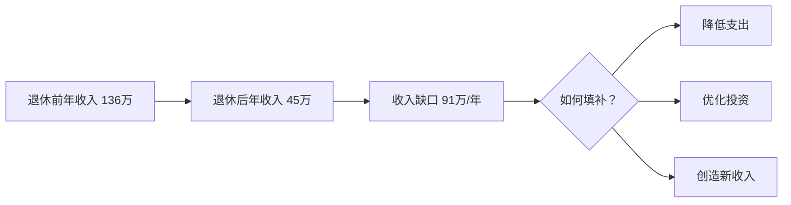
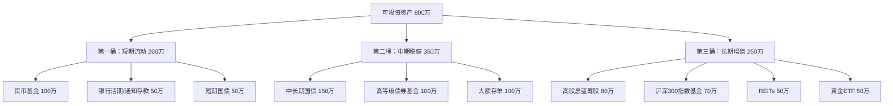
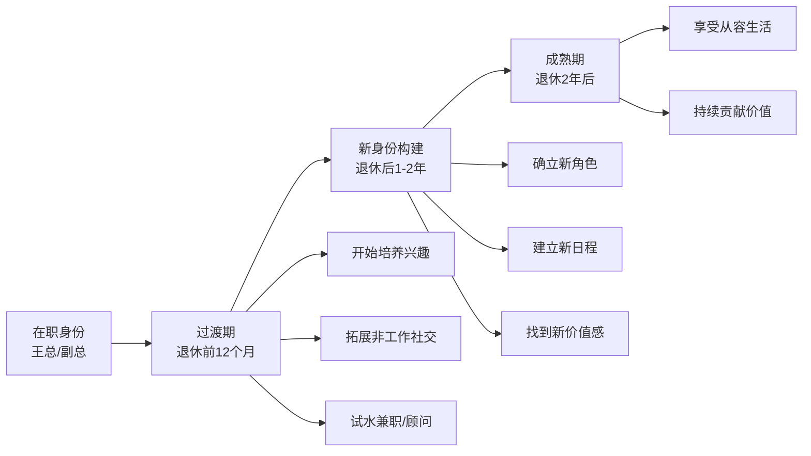

## 案例一：企业高管的优雅退休——从年薪百万到从容生活

企业高管是退休落差最大的群体之一。在职时年薪百万、出入有车、社交圈光鲜；退休后收入骤降、人走茶凉、身份感消失。本案例完整还原一位国企副总经理从「即将退休的焦虑」到「从容生活的掌控」的全过程，涵盖收入测算、资产重构、支出转型、心理调适、家庭沟通、税务筹划六大维度，为同类人群提供可复制的操作框架。

---

### 一、人物画像与财务全景

#### 1.1 基本信息

| 维度 | 详情 |
|------|------|
| 姓名 | 王志远（化名） |
| 年龄 | 56岁 |
| 职位 | 某大型国有能源集团副总经理 |
| 在职年薪 | 120万（含绩效奖金40万、职务津贴12万、公积金单位缴存6万） |
| 配偶 | 张丽华，52岁，原国企行政岗，已退休，月养老金5000元 |
| 子女 | 女儿王小禾，28岁，互联网公司产品经理，已婚，经济独立 |
| 健康状况 | 本人轻度脂肪肝、血脂偏高（控制中）；配偶健康良好 |

#### 1.2 家庭资产负债表

| 资产类别 | 具体项目 | 市值（万元） | 占比 |
|---------|---------|------------|------|
| **房产** | 自住房（北京三环，140㎡） | 700 | 38.9% |
| | 投资房A（北京朝阳，80㎡出租中） | 400 | 22.2% |
| | 投资房B（海南三亚，60㎡度假房） | 100 | 5.6% |
| **金融资产** | 银行理财 | 150 | 8.3% |
| | 定期存款 | 100 | 5.6% |
| | 股票账户 | 80 | 4.4% |
| | 基金（混合型） | 50 | 2.8% |
| | 企业年金账户 | 20 | 1.1% |
| **其他** | 车辆（奥迪A6） | 20 | 1.1% |
| | 个人收藏（字画、邮票） | 30 | 1.7% |
| **资产合计** | — | **1800** | **100%** |

| 负债项目 | 金额（万元） |
|---------|------------|
| 房贷（投资房A） | 80 |
| **净资产** | **1720** |

#### 1.3 年度收支表（退休前）

| 收入项 | 金额（万元/年） | 支出项 | 金额（万元/年） |
|-------|--------------|-------|--------------|
| 工资及奖金 | 108 | 日常生活 | 15 |
| 职务津贴 | 12 | 餐饮应酬 | 12 |
| 租金收入 | 6 | 交通出行 | 8 |
| 投资收益（估算） | 10 | 子女相关 | 3 |
| | | 旅游休闲 | 6 |
| | | 保险费用 | 2 |
| | | 人情往来 | 5 |
| | | 其他（购物、物业等） | 9 |
| **收入合计** | **136** | **支出合计** | **60** |

**关键数据**：年结余约76万，储蓄率56%。表面看财务状况健康，但收入高度依赖工资（占比79%），一旦退休，收入结构将发生根本性变化。

---

### 二、问题诊断：高管退休的五大核心挑战

#### 2.1 收入断崖式下跌

这是最直观的问题。退休后工资收入从108万/年降至养老金约18万/年，降幅达83%。即便加上租金和投资收益，总收入也从136万降至约45万——仅为退休前的33%。



**更深层的问题**：高管在职期间，许多开支由公司承担（用车、差旅、餐饮、通讯），退休后这些隐性福利全部消失，实际可支配收入的下降幅度比账面数字更大。王志远估算，公司隐性福利折合约15-20万/年。

#### 2.2 资产结构严重失衡

房产占总资产67%，远超合理比例。问题包括：

- **流动性极差**：房产变现周期长（3-6个月），紧急用钱时无法快速筹集
- **集中风险**：房地产市场下行时，资产大幅缩水
- **维护成本高**：物业费、维修基金、房产税（未来可能开征）持续消耗现金流
- **租金回报率低**：投资房A年租金6万，市值400万，租金回报率仅1.5%，低于银行定期存款
- **机会成本**：400万房产资金如果配置在稳健投资组合中，年化4-5%可获得16-20万收益

#### 2.3 消费惯性难以短期扭转

高收入时期的消费模式已经固化：高端餐饮、品牌消费、频繁应酬、头等舱出行。这些消费不仅是物质享受，更是社交身份的象征。退休后突然降级消费，不仅生活质量下降，更可能产生心理落差。

**行为经济学视角**：这涉及「棘轮效应」——人的消费习惯一旦形成就很难向下调整。研究表明，收入突然下降后，消费水平通常需要2-3年才能逐步调适到位。

#### 2.4 社交网络面临重组

企业高管的社交圈高度依赖职位。退休后，原有的社交网络可能迅速萎缩：

- **下属关系**：离开公司后自然淡化
- **业务伙伴**：失去利益纽带后联系减少
- **同行圈子**：行业会议、论坛邀请不再
- **「人走茶凉」效应**：需要2-3年才能看清哪些是真朋友

#### 2.5 身份认同危机

这是最容易被忽视、却影响最深远的问题。王志远在公司工作了30年，从基层工程师一步步升到副总经理。这个职位不仅是收入来源，更是他人生价值的核心锚点。退休意味着：

- 失去「王总」的身份标签
- 失去每天被需要、被尊重的感觉
- 失去制定决策、影响他人的权力
- 失去明确的生活目标和节奏

**心理学研究**：哈佛大学的一项持续75年的研究表明，退休后最幸福的人不是最富有的，而是拥有清晰生活目标和稳定社会关系的人。

---

### 三、系统性解决方案

#### 3.1 第一步：退休收入精算（提前24个月）

王志远聘请了一位持证理财规划师（CFP），进行了详细的退休收入测算。

**3.1.1 社保养老金测算**

王志远社保缴费年限32年，缴费基数长期为社平工资的3倍（上限）。按照现行公式：

```text
基础养老金 = （社平工资 + 指数化缴费工资）÷ 2 × 缴费年限 × 1%
         = （12000 + 36000）÷ 2 × 32 × 1%
         = 7680 元/月

个人账户养老金 = 个人账户储存额 ÷ 计发月数
             = 420000 ÷ 139（60岁退休）
             = 3022 元/月

月养老金合计 ≈ 10700 元/月 → 约 12.8万/年
```

考虑到企业年金（退休后可按月领取约4000元/月），王志远的社保+企业年金年收入约 **17.6万元/年**。

**3.1.2 综合退休收入测算表**

| 收入来源 | 退休前（万元/年） | 退休后（万元/年） | 变化幅度 |
|---------|----------------|----------------|---------|
| 工资/绩效 | 108 | 0 | -100% |
| 职务津贴 | 12 | 0 | -100% |
| 社保养老金 | 0 | 12.8 | 新增 |
| 企业年金 | 0 | 4.8 | 新增 |
| 配偶养老金 | 0 | 6.0 | 已有 |
| 租金收入 | 6 | 6 | 不变 |
| 投资收益 | 10 | 15 | +50% |
| 独立董事收入 | 0 | 15 | 新增 |
| **合计** | **136** | **59.6** | **-56%** |

即便加上独立董事收入，退休后总收入仍下降近半。但与纯被动收入（不含董事收入）的44.6万相比，支出若控制在40万以内，缺口可控。

**3.1.3 长寿风险模拟**

理财规划师用蒙特卡洛模拟了不同寿命情景下的资金可持续性：

| 假设条件 | 结果 |
|---------|------|
| 通胀率3%，投资回报4.5%，寿命85岁 | 资金在83岁耗尽 |
| 通胀率3%，投资回报4.5%，寿命85岁 + 独立董事收入15万/年 | 资金可持续至92岁 |
| 通胀率3%，投资回报5%，寿命90岁 + 独立董事收入 + 降低支出至35万 | 资金可持续至95岁 |

**结论**：独立董事收入（或其他主动收入）是关键变量。没有主动收入，仅靠被动收入在85岁前面临资金耗尽风险。

#### 3.2 第二步：资产配置重构（提前18-24个月）

**3.2.1 房产处置策略**

| 房产 | 处置方案 | 时间安排 | 理由 |
|------|---------|---------|------|
| 投资房A（朝阳） | 出售 | 退休前12-18个月 | 租金回报率仅1.5%，远低于资金的机会成本 |
| 海南度假房 | 保留 | — | 兼具自用和度假功能，未来可作为冬季养老居所 |
| 自住房 | 保留 | — | 核心居所，不建议变动 |

**投资房A出售的具体操作**：
1. **定价策略**：参考同小区近6个月成交价，定价略低于市场价2-3%以加速成交
2. **租客处理**：提前3个月通知租客，按合同约定退还押金，协助其寻找新住处
3. **税费测算**：增值税（满2年免征）、个人所得税（满五唯一免征）、中介费约1%，综合税费约8-12万
4. **净回收资金**：约380-390万

**3.2.2 「三桶水」资产配置模型**

出售房产后，王志远的可投资资产约800万（原有400万金融资产 + 卖房回收390万）。规划师建议采用「三桶水」模型：



**桶型配置说明**：

| 桶 | 资金规模 | 覆盖年限 | 核心功能 | 投资品种 | 目标年化 |
|---|---------|---------|---------|---------|---------|
| 第一桶 | 200万 | 3-5年生活费 | 应急+日常开支 | 货币基金、活期、短期国债 | 2-2.5% |
| 第二桶 | 350万 | 7-10年生活费 | 稳健增值 | 国债、债券基金、大额存单 | 3.5-4.5% |
| 第三桶 | 250万 | 10年以上 | 长期增值对抗通胀 | 高股息股票、指数基金、REITs、黄金 | 5-8% |

**第一桶的核心逻辑**：无论市场如何波动，3-5年的生活费始终安全且随时可用。这给了投资者心理安全感，避免在市场下跌时被迫卖出长期资产。

**3.2.3 投资组合再平衡机制**

- **频率**：每半年检视一次，偏离目标配置超过5%时触发再平衡
- **规则**：卖出超配资产、买入低配资产，保持三桶比例稳定
- **提取顺序**：先用第一桶的收益覆盖日常开支；第一桶不足时从第二桶补充；第三桶原则上不动，仅在特殊情况下（如重大医疗支出）才动用

#### 3.3 第三步：支出结构转型（提前12个月开始渐进调整）

**3.3.1 支出重新分类**

将原有支出按「退休后是否必要」重新分类：

| 类别 | 退休前（万/年） | 退休后目标（万/年） | 调整策略 |
|------|--------------|----------------|---------|
| 日常生活（食、住、行） | 15 | 12 | 降低出行标准，减少外食频率 |
| 餐饮应酬 | 12 | 4 | 大幅削减商务应酬，保留核心社交 |
| 交通出行 | 8 | 3 | 退掉公司配车后改用私家车+打车 |
| 旅游休闲 | 6 | 5 | 从高端定制游转为品质自由行 |
| 保险费用 | 2 | 3 | 增加百万医疗险和意外险 |
| 人情往来 | 5 | 2 | 缩减社交圈，减少无效社交 |
| 其他（购物、物业等） | 9 | 6 | 降低品牌消费，关注性价比 |
| 健康管理 | （含在其他中） | 3 | 新增：体检、保健品、健身 |
| 兴趣爱好 | （含在其他中） | 2 | 新增：书法、摄影器材及课程 |
| **合计** | **60** | **40** | **降幅33%** |

**3.3.2 渐进式调整的关键**

王志远没有在退休当天突然改变生活方式，而是提前12个月开始逐步调整：

- **第1-3个月**：记录每日开支，建立消费意识（很多人不知道自己的钱花在哪里）
- **第4-6个月**：减少商务应酬频率，从每周3-4次降至1-2次
- **第7-9个月**：降低出行标准，从头等舱改为商务舱或高铁一等座
- **第10-12个月**：调整日常消费习惯，尝试更经济但同样有品质的生活方式

这种渐进式调整比「断崖式降级」更容易坚持，也减少了心理落差。

#### 3.4 第四步：保险保障完善（提前12个月）

| 险种 | 产品类型 | 年保费（元） | 保额 | 必要性说明 |
|------|---------|------------|------|----------|
| 百万医疗险 | 保证续保型 | 3500 | 400万 | 覆盖大病医疗费用，弥补医保不足 |
| 意外险 | 综合意外 | 800 | 100万 | 骨折、摔伤等老年高发意外 |
| 防癌险 | 给付型 | 6000 | 50万 | 56岁购买重疾险保费过高，防癌险是替代方案 |
| 长期护理险 | 年金型 | 12000 | 月付1万 | 对冲失能风险，建议60岁前投保 |

**不建议购买的险种**：
- **重疾险**：56岁投保，保费与保额接近甚至倒挂，不划算
- **定期寿险**：女儿已成家经济独立，无房贷压力，无需寿险保障
- **分红型保险**：收益低于自行投资，流动性差

**特别提醒**：高管人群的体检报告通常问题较多（脂肪肝、高血脂、结节等），投保时务必如实告知，避免理赔纠纷。如有被拒保的情况，可尝试多家保险公司核保，不同公司核保标准不同。

#### 3.5 第五步：主动收入规划——董事席位与咨询业务

**3.5.1 独立董事路径**

王志远的优势：30年国企管理经验、行业人脉广、具备高级职称。

**实操路径**：
1. **资格确认**：独立董事需具备上市公司要求的专业资质（会计、法律或行业专家），王志远具备行业专家资格
2. **人脉激活**：退休前6个月开始，通过行业协会、校友网络释放信号
3. **目标企业**：选择2-3家中小型上市公司或拟上市公司，聚焦能源和管理领域
4. **薪酬行情**：A股独立董事年薪酬通常8-20万/家，取中间值约15万/家
5. **时间投入**：每月约2-3天（出席董事会、审阅材料）
6. **风险提示**：独立董事承担法律责任（如公司财务造假），需关注企业合规性

**预期成果**：担任2家企业的独立董事，年收入约15-25万。

**3.5.2 企业咨询顾问**

利用行业经验和人脉，为中小企业提供管理咨询服务：
- **收费模式**：按项目收费（5-15万/项目）或按月度顾问费（1-3万/月）
- **工作量**：每周1-2天，灵活安排
- **启动方式**：先通过熟人介绍积累口碑，逐步建立品牌
- **预期年收入**：10-20万

**3.5.3 主动收入的战略意义**

主动收入的意义不仅是填补财务缺口，更重要的是：

- **保持社会连接**：工作中认识新朋友，维持社交活跃度
- **维持身份认同**：从「退休的王总」变为「王顾问」「王老师」
- **保持思维活跃**：持续使用专业技能，延缓认知衰退
- **增加财务安全边际**：减少对投资收益的依赖

#### 3.6 第六步：心理建设与生活重构

**3.6.1 退休身份转型模型**



**3.6.2 日程结构重建**

退休后最大的挑战之一是「无所事事」。王志远为自己设计了一套新日程：

| 时间 | 周一 | 周二 | 周三 | 周四 | 周五 | 周六 | 周日 |
|------|------|------|------|------|------|------|------|
| 7:00-8:00 | 晨练 | 晨练 | 晨练 | 晨练 | 晨练 | 晨练 | 休息 |
| 9:00-12:00 | 书法课 | 企业咨询 | 自由安排 | 独立董事 | 摄影外拍 | 家庭日 | 家庭日 |
| 14:00-17:00 | 阅读 | 企业咨询 | 行业协会 | 独立董事 | 后期处理 | 家庭日 | 家庭日 |
| 19:00-21:00 | 家庭时间 | 朋友聚会 | 家庭时间 | 家庭时间 | 电影/演出 | 家庭日 | 家庭日 |

**核心原则**：
- 每天至少有1件「有目的」的事（避免无所事事感）
- 每周至少2次社交活动（防止社交萎缩）
- 每月至少1次新体验（保持好奇心和活力）
- 保留适当的「自由时间」（退休生活不应该是另一种上班）

**3.6.3 夫妻关系调适**

王志远的妻子已退休3年，早已建立了自己的生活节奏。王志远退休后突然「闯入」她的空间，需要特别注意：

- **尊重妻子的独立空间**：她有自己的社交圈和日程，不要试图「共享一切」
- **家务分工明确**：避免「你反正没事做就多干点」的思维
- **共同活动 vs 各自活动**：保持7:3的比例——70%共同活动，30%各自独立
- **财务沟通透明**：每月做一次家庭财务回顾，双方对资产状况有清晰认知

---

### 四、税务筹划与合规

#### 4.1 房产出售的税务处理

投资房A出售涉及的主要税种：

| 税种 | 适用条件 | 税率/金额 | 王志远情况 |
|------|---------|----------|----------|
| 增值税 | 满2年免征 | 5%（不满2年） | 免征（持有超10年） |
| 个人所得税 | 满五唯一免征 | 差额的20%或全额的1% | 需缴纳（非唯一住房） |
| 契税 | 买方承担 | — | 不涉及 |
| 中介费 | — | 1-2% | 约4-8万 |

**节税建议**：如果先将投资房A过户为自住房（需满足条件），再出售原自住房（满五唯一），可以节省个税。但操作复杂且有政策风险，建议咨询专业税务师。

#### 4.2 投资收益的税务优化

- **股息红利**：持有超过1年的A股股息免征个人所得税
- **基金分红**：个人投资者的基金分红暂免个人所得税
- **国债利息**：免征个人所得税
- **银行存款利息**：暂免个人所得税（实际已取消利息税）

**策略**：优先配置免税收益品种（国债、长期持有的高股息股票、基金），提高税后收益。

#### 4.3 独立董事收入的个税

独立董事费按「劳务报酬所得」缴纳个人所得税：
- 每次收入不超过4000元：减除800元后按20%税率
- 每次收入超过4000元：减除20%后按20%-40%税率
- 年度汇算时并入综合所得，适用3%-45%超额累进税率

**注意**：王志远退休后综合所得大幅降低，适用税率从原来的30%+降至10-20%，独立董事收入的实际税负反而比在职时更低。

---

### 五、家庭沟通与传承规划

#### 5.1 与妻子的财务共识

王志远在退休前6个月，与妻子进行了三次深度财务对话：

**第一次对话：现状透明**
- 将家庭资产负债表完整展示给妻子
- 解释退休后收入变化的原因和幅度
- 让妻子对财务状况有真实的认知

**第二次对话：方案讨论**
- 讨论支出调整的具体方案
- 征求妻子对哪些支出可以削减、哪些必须保留的意见
- 达成「40万年支出」的共识

**第三次对话：角色分工**
- 明确家庭财务管理的分工（王志远负责投资决策，妻子负责日常记账）
- 建立月度财务回顾机制
- 约定重大支出（超过1万元）需双方协商

#### 5.2 与女儿的传承沟通

王志远与女儿的传承沟通采取了渐进策略：

**阶段一：信息共享**
- 告知女儿家庭的财务概况（不需要精确数字）
- 解释退休后生活方式的变化
- 让女儿理解父母的财务决策

**阶段二：期望对齐**
- 明确告知女儿：父母的养老资金充足，不需要她经济支持
- 同时也明确：大额财产传承会通过合理方式安排，不会影响父母的生活质量
- 了解女儿对未来财产安排的想法和需求

**阶段三：方案共识**
- 计划将海南度假房将来作为传承资产留给女儿
- 金融资产的传承通过保险+遗嘱组合方式安排
- 每3-5年更新一次传承方案

#### 5.3 遗嘱与传承工具

王志远的传承工具组合：

| 工具 | 用途 | 具体安排 |
|------|------|---------|
| 公证遗嘱 | 整体资产分配 | 自住房由配偶和女儿均分；金融资产配偶60%、女儿40% |
| 人寿保险 | 指定受益 | 购买终身寿险100万，受益人为女儿（免遗产纠纷） |
| 生前赠与 | 逐步转移 | 每年赠与女儿不超过免税额度的现金 |
| 遗嘱执行人 | 确保执行 | 指定律师作为遗嘱执行人 |

---

### 六、实际执行结果

#### 6.1 退休两年后的财务状况

王志远58岁时的实际数据：

| 项目 | 数据 |
|------|------|
| 年收入 | 养老金12.8万 + 企业年金4.8万 + 配偶养老金6万 + 租金6万 + 投资收益22万 + 独立董事15万 + 咨询收入8万 = **74.6万** |
| 年支出 | 约38万 |
| 年结余 | 约36.6万 |
| 投资资产 | 约850万（初始800万 + 收益积累 + 结余再投资） |
| 房产 | 自住房700万 + 海南房100万 |
| 净资产 | 约1750万（较退休前略有增长） |

#### 6.2 生活质量评估

| 维度 | 退休前 | 退休后 | 评价 |
|------|-------|-------|------|
| 收入水平 | 136万/年 | 74.6万/年 | 下降但充足 |
| 自由时间 | 极少 | 充裕 | 显著提升 |
| 压力水平 | 高（KPI、政治） | 低 | 显著改善 |
| 社交质量 | 广但浅 | 少但深 | 质量提升 |
| 夫妻关系 | 聚少离多 | 朝夕相处 | 需调适但总体改善 |
| 身体健康 | 亚健康 | 改善中 | 有时间锻炼和调理 |
| 兴趣发展 | 无暇顾及 | 书法、摄影 | 显著提升 |
| 人生满足感 | 中等 | 较高 | 找到了新的价值感 |

#### 6.3 关键转折点回顾

**第一个转折点：卖房决策**。这是最艰难的决定。投资房A持有15年，从150万涨到400万，王志远有很深的「房子只涨不跌」的心理依赖。最终促使他下决心的是理财规划师的一句话：「您的房子每年为您赚6万租金，同样的钱放在国债里可以赚14万——您每年亏8万，只为了一种安全感。」

**第二个转折点：第一次说「不」**。退休后第三个月，一位老朋友邀请他参加一个高端商务晚宴（需要AA制，每人5000元）。他第一次婉拒了。事后他说：「那一刻我意识到，我不需要靠参加这些活动来证明自己的价值。」

**第三个转折点：第一笔咨询费**。退休后第8个月，一家中型能源企业通过朋友介绍，请他做管理咨询，项目费8万。他说：「这8万块钱比在职时的120万年薪让我更有成就感——因为这是凭我的能力和经验挣的，不是凭职位。」

---

### 七、可复用的操作框架

#### 7.1 高管退休规划时间表

| 阶段 | 时间节点 | 核心任务 |
|------|---------|---------|
| 启动期 | 退休前24个月 | 聘请理财规划师、开始财务盘点、启动房产处置 |
| 调整期 | 退休前18个月 | 资产配置重构、保险方案确定、支出结构调整启动 |
| 过渡期 | 退休前12个月 | 董事席位落实、兴趣爱好培养、社交网络拓展 |
| 深化期 | 退休前6个月 | 家庭财务对话、遗嘱制定、心理咨询（如需要） |
| 适应期 | 退休后0-12个月 | 新日程建立、投资组合监控、支出跟踪 |
| 稳定期 | 退休后12-24个月 | 方案优化、年度回顾、传承方案更新 |

#### 7.2 核心检查清单

**财务维度**：
- [ ] 退休收入测算完成，缺口明确
- [ ] 资产配置重构方案确定并开始执行
- [ ] 应急基金到位（3-5年生活费）
- [ ] 保险方案确定并投保
- [ ] 税务筹划方案确认
- [ ] 遗嘱和传承工具就位

**生活维度**：
- [ ] 至少2项兴趣爱好已培养
- [ ] 非工作社交网络已建立
- [ ] 日常日程结构已设计
- [ ] 夫妻退休生活计划已沟通
- [ ] 与子女的传承沟通已完成

**心理维度**：
- [ ] 对退休身份转变有心理准备
- [ ] 已找到或正在寻找新的价值感来源
- [ ] 对「人走茶凉」有预期和接受
- [ ] 必要时已预约心理咨询

---

### 八、案例启示与常见陷阱

#### 8.1 三大核心启示

**启示一：高管退休最大的挑战不是钱，而是身份认同和生活方式的转变。** 王志远的净资产1720万，即便不做任何优化，靠吃老本也够生活到90岁。真正的挑战是如何从「王总」转变为「王老师」「王顾问」「一个热爱书法和摄影的退休老人」。

**启示二：提前规划越早越好，24个月是最低要求。** 资产重构需要时间（卖房不是一天能完成的），心理调适更需要时间（身份转变不可能一夜之间发生）。越早开始，调整越从容。

**启示三：主动收入是退休生活的「安全阀」。** 不仅是财务安全阀（填补收入缺口），更是心理安全阀（保持价值感和社会连接）。退休后完全不工作并不适合所有人，尤其是曾经身居高位的管理者。

#### 8.2 常见陷阱

| 陷阱 | 表现 | 后果 | 避免方法 |
|------|------|------|---------|
| 过度保守 | 退休后全部存银行 | 被通胀侵蚀，10年后购买力下降30%+ | 保持合理的投资组合，至少30%配置在抗通胀资产 |
| 补偿性消费 | 退休后突然有时间，报复性消费 | 储蓄加速消耗 | 提前制定预算，坚持记账 |
| 面子投资 | 被朋友拉去投资「高回报」项目 | 本金损失 | 坚守「不懂不投」原则，任何投资先咨询专业人士 |
| 子女啃老 | 无条件资助子女买房/创业 | 养老资金被挪用 | 设定资助上限，优先保障自身养老 |
| 忽视健康 | 舍不得花钱体检和健康管理 | 小病变大病，医疗费用暴增 | 每年体检，建立健康预算（3-5万/年） |
| 过度节俭 | 退休后一切从简，生活品质骤降 | 心理落差大，影响幸福感 | 该省的省，该花的花——健康、兴趣、社交值得投入 |

***

> **本案例核心公式**：优雅退休 = 充足的被动收入 + 适度的主动收入 + 合理的支出结构 + 清晰的人生目标 + 稳定的社会关系。五个要素缺一不可，财务只是其中一个维度。
