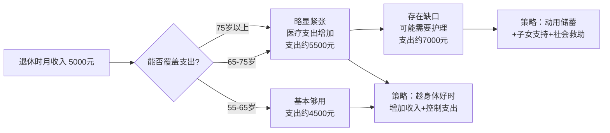

## 案例二：普通工薪族的退休规划——月薪8000如何安享晚年

> **案例定位**：本案例面向中国最常见的普通工薪阶层——月薪在6000-10000元之间、依靠工资积累储蓄、没有大额投资收益、对金融产品了解有限的中老年人群。与案例一的高管群体不同，工薪族退休规划的核心不是"如何管理巨额资产"，而是"如何用有限资源构建安全、体面的退休生活"。

### 背景画像

刘阿姨，53岁，某三线城市（湖北宜昌）事业单位普通职员，行政岗位，月薪8000元（含绩效）。已离异8年，独居；一个儿子30岁，已婚并在省会城市定居，经济上独立。

**家庭资产负债表：**

| 资产类别 | 金额（万元） | 占比 | 说明 |
|---------|------------|------|------|
| 自住房产 | 150 | 53.6% | 三室一厅，90㎡，无房贷 |
| 银行存款 | 80 | 28.6% | 活期+定期，年化约1.8% |
| 基金投资 | 30 | 10.7% | 混合基金，不清楚具体持仓 |
| 社保个人账户 | 20 | 7.1% | 累计缴费28年 |
| **合计** | **280** | **100%** | — |

**月度收支现状：**

| 项目 | 金额（元） |
|------|----------|
| 税后工资 | 8,000 |
| 生活支出 | -4,500 |
| 人情往来 | -500 |
| 给父母补贴 | -800 |
| 结余 | **2,200** |

**核心问题清单：**

1. **收入断崖**：退休后工资收入将从8000元/月降至约4000元/月（养老金），降幅达50%
2. **资产集中度过高**：53.6%资产锁定在自住房产中，无法产生现金流
3. **投资知识匮乏**：80万存款长期存活期或短期定期，实际购买力在逐年缩水
4. **独居风险**：缺乏日常照护支持，突发疾病或意外时无人及时发现
5. **医疗费用焦虑**：53岁开始出现慢性病（高血压），对未来医疗支出有强烈不确定感
6. **心理落差**：从"有工作的人"变成"退休的人"，身份认同面临挑战

### 第一步：精准测算退休收入——搞清楚"钱够不够"

#### 1.1 养老金测算方法

工薪族退休后最核心的收入来源是社保养老金。很多人对养老金金额没有概念，这里给出具体的计算方法。

**养老金计算公式（2024年标准）：**

```text
月养老金 = 基础养老金 + 个人账户养老金

基础养老金 = 退休时当地社平工资 × (1 + 本人平均缴费指数) ÷ 2 × 缴费年限 × 1%

个人账户养老金 = 个人账户累计储存额 ÷ 计发月数
```

**刘阿姨的具体计算：**

| 参数 | 数值 | 说明 |
|------|------|------|
| 退休时当地社平工资 | 约6,500元/月 | 宜昌2024年社平工资参考值 |
| 平均缴费指数 | 0.8 | 按80%基数缴纳（事业单位常见） |
| 缴费年限 | 30年 | 25岁入职，55岁退休 |
| 个人账户累计 | 约20万元 | 含利息 |
| 计发月数 | 170个月 | 55岁退休对应值 |

**计算结果：**

```text
基础养老金 = 6500 × (1 + 0.8) ÷ 2 × 30 × 1%
           = 6500 × 0.9 × 30 × 1%
           = 6500 × 0.27
           = 1,755 元/月

个人账户养老金 = 200,000 ÷ 170
               = 1,176 元/月

月养老金合计 = 1,755 + 1,176 = 2,931 元/月
```

> **注意**：事业单位还有职业年金（2014年10月后缴纳），这部分大约能增加500-800元/月。综合来看，刘阿姨退休后养老金约为 **3,500-3,800元/月**。

#### 1.2 退休前后收入对比

| 收入来源 | 退休前（元/月） | 退休后（元/月） | 变化 |
|---------|---------------|---------------|------|
| 工资/养老金 | 8,000 | 3,600 | -55% |
| 存款利息 | 1,200（年化1.8%） | 1,200 | 不变 |
| 基金分红 | 约200 | 约200 | 不变 |
| **合计** | **9,400** | **5,000** | **-47%** |

**收入缺口分析**：如果维持当前4,500元/月的生活水平，退休后每月缺口约1,300元（按无额外收入计算）。这个缺口看似不大，但必须考虑以下因素：

- **通胀侵蚀**：按3%年通胀率，10年后4,500元的购买力仅相当于现在的3,350元
- **医疗支出增长**：60岁后医疗支出通常是50岁时的2-3倍
- **护理费用**：75岁后可能需要家政或护理服务，三线城市约3,000-5,000元/月



#### 1.3 长寿风险评估

根据国家统计局数据，中国女性平均预期寿命已达80.5岁。刘阿姨有50%的概率活到85岁以上。按退休年龄55岁计算：

- **保守估计**：退休生活30年（到85岁）
- **乐观估计**：退休生活35年（到90岁）

**总资金需求测算**（按当前购买力）：

| 阶段 | 年限 | 月均支出（元） | 小计（万元） |
|------|------|--------------|------------|
| 55-65岁（活力期） | 10年 | 4,500 | 54 |
| 65-75岁（平稳期） | 10年 | 5,500 | 66 |
| 75-85岁（衰退期） | 10年 | 7,000 | 84 |
| **合计** | **30年** | — | **204** |

养老金总额（30年）：3,600 × 12 × 30 = 129.6万元

**资金缺口 = 204 - 129.6 = 74.4万元**

这意味着刘阿姨需要用投资收益和储蓄来填补这74.4万元的缺口。好消息是，她目前有110万可投资资产（存款80万+基金30万），如果合理配置，完全可以覆盖。

### 第二步：社保优化——把"国家的钱"拿满

#### 2.1 确认社保权益清单

很多工薪族对自己的社保存量权益了解不够。刘阿姨在退休前应该去社保局打印一份完整的《社会保险个人权益记录》，确认以下关键信息：

| 核查项目 | 具体内容 | 为什么重要 |
|---------|---------|----------|
| 累计缴费年限 | 含视同缴费年限 | 直接影响基础养老金计算 |
| 个人账户余额 | 含历年利息 | 直接影响个人账户养老金 |
| 平均缴费指数 | 每年缴费基数/当年社平工资 | 影响基础养老金计算 |
| 缴费连续性 | 是否有断缴月份 | 断缴可能影响医保待遇 |

#### 2.2 延迟退休策略

2025年起中国实施渐进式延迟退休政策。对于刘阿姨（1971年出生），原法定退休年龄为55岁（女干部/管理岗），可能需要延迟数月到1年。

**延迟退休的经济价值：**

```text
每延迟1年退休的收益：
1. 多缴1年社保 → 基础养老金增加约 6500 × 0.9 × 1% = 58.5元/月
2. 个人账户多积累约 8000 × 8% × 12 = 7,680元
3. 计发月数减少 → 个人账户月领取额增加
4. 多领1年工资 8000 × 12 = 96,000元

综合收益：每年约增加养老金60元/月 + 多领9.6万工资
```

**建议**：如果单位允许且身体条件良好，延迟1-2年退休是划算的。但不建议为了多几百元养老金而勉强工作——健康永远排在金钱前面。

#### 2.3 医保关键节点

| 事项 | 要求 | 刘阿姨现状 | 操作建议 |
|------|------|----------|---------|
| 退休医保 | 女性累计缴费≥20年 | 已缴28年 | ✅ 已达标 |
| 大病医保 | 随职工医保自动享受 | — | 确认参保状态 |
| 门诊统筹 | 2023年起全国推行 | — | 了解本地起付线和报销比例 |
| 异地就医 | 需备案 | 儿子在省会 | 提前办理异地就医备案 |

### 第三步：资产配置重塑——让钱"活"起来

#### 3.1 当前配置诊断

刘阿姨现有110万可投资资产的配置存在严重问题：

| 资产 | 金额（万） | 年化收益 | 实际购买力变化（通胀3%） |
|------|----------|---------|----------------------|
| 银行活期/短期定期 | 80 | 1.8% | **每年缩水约 -1.2%**，即 -9,600元 |
| 混合基金（不清楚持仓） | 30 | 不确定 | 风险不透明 |
| **合计** | **110** | — | **整体在贬值** |

**核心问题**：80万存款的利率（1.8%）跑不赢通胀（3%），实际购买力每年缩水约1万元。10年后，这80万的购买力仅相当于现在的60万。

#### 3.2 目标配置方案：三桶资金模型

工薪族退休资产配置的核心原则是"安全第一，收益第二"。采用"三桶资金"模型，按时间维度分层管理：

```mermaid
graph TB
    subgraph 第一桶：即时流动池
        A[货币基金 20万] --> A1[随时可取<br/>年化约2%]
        B[活期存款 5万] --> B1[日常开销周转]
    end
    subgraph 第二桶：中期稳定池
        C[3年期国债 25万] --> C1[年化约2.8%]
        D[大额存单 30万] --> D1[3年期 年化约2.6%]
        E[纯债基金 15万] --> E1[年化约3-4%<br/>有一定波动]
    end
    subgraph 第三桶：长期增值池
        F[高股息ETF 10万] --> F1[银行/电力/煤炭<br/>年股息率4-6%]
        G[沪深300指数基金 5万] --> G1[长期年化约7-8%<br/>波动较大]
    end
    A --> H[合计 110万<br/>目标年化 3.5-4.5%]
    B --> H
    C --> H
    D --> H
    E --> H
    F --> H
    G --> H
```

**详细配置方案：**

| 桶 | 资产类别 | 金额（万） | 占比 | 预期年化 | 流动性 | 风险等级 |
|---|---------|----------|------|---------|-------|---------|
| 第一桶 | 货币基金 | 20 | 18.2% | 2.0% | T+0/T+1 | 极低 |
| 第一桶 | 活期存款 | 5 | 4.5% | 0.2% | 即时 | 无 |
| 第二桶 | 3年期国债 | 25 | 22.7% | 2.8% | 到期兑付 | 极低 |
| 第二桶 | 3年期大额存单 | 30 | 27.3% | 2.6% | 到期兑付 | 极低 |
| 第二桶 | 纯债基金 | 15 | 13.6% | 3.5% | T+3 | 低 |
| 第三桶 | 高股息ETF | 10 | 9.1% | 5.0% | T+1 | 中 |
| 第三桶 | 沪深300指数基金 | 5 | 4.5% | 7.0% | T+1 | 中高 |
| **合计** | — | **110** | **100%** | **约3.3%** | — | — |

**组合预期年收益 = 110万 × 3.3% = 约3.6万元/年 = 3,000元/月**

加上养老金3,600元/月，退休后月收入约6,600元，高于当前月支出4,500元，有充足的安全边际。

#### 3.3 配置执行时间表

不要一次性调整，分3个月逐步完成：

| 时间 | 操作 | 注意事项 |
|------|------|---------|
| 第1周 | 去银行打印基金持仓明细 | 搞清楚现在买的到底是什么基金 |
| 第1-2周 | 赎回高风险基金（如有） | 注意赎回费，持有不足7天费率1.5% |
| 第2-4周 | 开通国债逆回购账户 | 需要证券账户，选大型券商 |
| 第1个月 | 买入第一桶（货币基金25万） | 选择规模>100亿的货基 |
| 第2个月 | 购买3年期国债25万 | 国债每月10日发行，需抢购 |
| 第2个月 | 办理3年期大额存单30万 | 起存20万，利率可谈 |
| 第3个月 | 购买纯债基金15万 | 选择成立>3年、规模>10亿的产品 |
| 第3个月 | 定投高股息ETF 10万（分5个月） | 每月投2万，避免择时风险 |
| 第3-8个月 | 定投沪深300指数基金5万 | 每月投1万 |

#### 3.4 每年再平衡规则

每年1月检查一次资产比例，偏离目标超过5%时进行调整：

```text
检查规则：
1. 第一桶占比应在 20-25% 之间
   - <20%：从第二/三桶赎回补充
   - >30%：将多余部分转入第二桶
   
2. 第三桶占比应在 10-15% 之间
   - >20%：股市过热，适当减仓
   - <8%：股市低迷，适当加仓

3. 每年提取生活费从第一桶出
   - 不动第二、三桶
   - 第一桶低于15万时，从第二桶赎回补充
```

### 第四步：医疗保障加固——堵住最大的财务漏洞

#### 4.1 风险敞口分析

对50岁以上工薪族而言，医疗支出是退休财务中最大的不确定性来源。一次重大疾病可能耗尽数十年积蓄。

**常见重大疾病治疗费用参考（2024年三线城市）：**

| 疾病 | 治疗费用（万元） | 医保报销后自费（万元） | 康复费用（万元） |
|------|---------------|--------------------|--------------|
| 心脏支架手术 | 8-15 | 3-6 | 2-5/年 |
| 脑卒中 | 10-30 | 4-12 | 3-8/年 |
| 乳腺癌（早期） | 15-25 | 5-10 | 2-3/年 |
| 肺癌 | 20-50 | 8-20 | 5-10/年 |
| 骨折（髋关节置换） | 5-10 | 2-4 | 1-2 |

即使有医保，自费部分加上康复费用，一次大病可能需要10-30万。这就是为什么商业保险在退休规划中不可或缺。

#### 4.2 保险配置方案

53岁购买保险面临两个现实约束：一是可选产品少（很多产品投保年龄上限55或60岁），二是保费贵（年龄越大保费越高）。

| 险种 | 建议 | 年保费（估） | 保额 | 理由 |
|------|------|------------|------|------|
| 百万医疗险 | **必买** | 1,500-2,000元 | 200-400万 | 覆盖大病住院，社保报销后1万免赔 |
| 意外险 | **必买** | 200-400元 | 50万 | 50岁以上跌倒骨折概率高 |
| 重疾险 | **不建议** | 8,000-12,000元 | 30万 | 保费倒挂（总保费>保额），不划算 |
| 防癌险 | 可考虑 | 1,000-2,000元 | 20万 | 比重疾险便宜，专门保癌症 |
| 长期护理险 | 关注政策 | — | — | 多地试点中，未来可能普及 |

**百万医疗险选购要点：**

1. **保证续保期**：优先选择保证续保20年的产品（如平安长相安、太平洋蓝医保）
2. **健康告知**：刘阿姨有高血压，需要如实告知。部分产品对1级高血压（收缩压<160）可正常承保
3. **增值服务**：关注是否有住院垫付、质子重离子治疗、外购药报销
4. **免赔额**：1万元免赔额是行业标准，不要为了0免赔额多花冤枉钱

**投保操作时间表：**

```text
第1周：整理健康资料（近2年体检报告、病历）
第2周：在2-3个平台比价（支付宝、慧择、小雨伞）
第3周：确认健康告知无误后投保
第4周：确认保单生效，保存电子保单
每年续保前1个月：检查产品是否停售，必要时更换
```

### 第五步：生活规划——退休不是终点，是新起点

#### 5.1 收入补充方案

仅靠养老金和投资收益，生活可以维持但缺少弹性。适当的退休后收入不仅能缓解财务压力，更重要的是保持社会连接和自我价值感。

**适合53-65岁退休女性的兼职方向：**

| 方向 | 预期月收入 | 时间投入 | 技能要求 | 刘阿姨适配度 |
|------|----------|---------|---------|------------|
| 兼职会计/财务 | 2,000-4,000元 | 每周15-20小时 | 有会计基础 | ★★★★★ |
| 社区团购团长 | 1,000-3,000元 | 每天2-3小时 | 会用手机 | ★★★★ |
| 老年大学助教 | 500-1,500元 | 每周6-10小时 | 耐心、会教 | ★★★ |
| 手工/烘焙售卖 | 1,000-3,000元 | 灵活 | 需要学 | ★★★ |
| 养老院志愿者（有补贴） | 500-1,000元 | 每周8小时 | 体力好 | ★★★ |

**建议组合**：兼职会计（2,000元/月）+ 社区团购（1,000元/月）= 月增收约3,000元

退休后前10年（55-65岁）是"黄金增收期"——身体尚好、精力充沛、经验丰富。抓住这个窗口期多积累，为75岁以后的高支出阶段做准备。

#### 5.2 支出结构优化

退休后支出不是简单地"减少"，而是"重新分配"——减少工作相关支出，增加健康和生活品质支出。

| 支出项目 | 退休前（元/月） | 退休后建议（元/月） | 变化 | 说明 |
|---------|---------------|-------------------|------|------|
| 餐饮 | 1,500 | 1,800 | +300 | 增加营养投入，买好食材 |
| 水电物业 | 500 | 500 | 不变 | — |
| 交通 | 400 | 100 | -300 | 不用通勤了 |
| 通讯 | 100 | 100 | 不变 | — |
| 衣物 | 300 | 150 | -150 | 减少职场着装需求 |
| 医疗保健 | 200 | 500 | +300 | 定期体检+保健品 |
| 人情往来 | 500 | 300 | -200 | 退休后社交圈缩小 |
| 父母补贴 | 800 | 0 | -800 | 父母已90+，假设已不需要 |
| 兴趣爱好 | 0 | 400 | +400 | 摄影器材、合唱团等 |
| 旅游 | 200 | 500 | +300 | 退休后有时间了 |
| 应急储备 | 400 | 350 | -50 | — |
| **合计** | **4,900** | **4,700** | **-200** | — |

**关键发现**：退休后总支出并没有大幅下降，但结构更健康——减少了"不得不花"的钱（通勤、职场社交），增加了"值得花"的钱（健康、兴趣、旅游）。

#### 5.3 独居安全体系建设

独居是刘阿姨退休后面临的最大非财务风险。根据统计数据，独居老人意外发现延迟是导致严重后果的主要原因。

**安全体系搭建清单：**

| 层级 | 措施 | 成本 | 优先级 |
|------|------|------|-------|
| 技术层 | 安装智能门锁（带远程通知） | 800-1,500元 | 高 |
| 技术层 | 佩戴智能手环（跌倒检测+SOS） | 200-500元 | 高 |
| 技术层 | 安装烟雾/燃气报警器 | 100-300元 | 高 |
| 社交层 | 与邻居建立互助关系 | 0元 | 高 |
| 社交层 | 每天与儿子视频通话（固定时间） | 0元 | 高 |
| 社交层 | 加入社区老年活动群 | 0元 | 中 |
| 服务层 | 注册社区居家养老服务 | 0-500元/月 | 中 |
| 医疗层 | 签约家庭医生 | 0元（社区卫生中心） | 高 |
| 医疗层 | 常用药品备足1个月用量 | 约200元/月 | 高 |

**每日安全检查习惯：**

```text
早上 7:00  起床后给儿子发一条微信（报平安）
晚上 8:00  固定时间视频通话
每周一     去社区活动中心（建立固定社交节奏）
每月15日   家庭医生随访/自测血压血糖
每季度     全面体检一次（利用医保门诊统筹）
```

#### 5.4 心理过渡方案

退休后的心理落差往往被低估。从"每天有事做、有人找、有价值感"到"突然闲下来"，很多人会出现焦虑、抑郁、失眠等问题。

**退休心理过渡四阶段模型：**


**各阶段应对策略：**

| 阶段 | 典型表现 | 应对方法 |
|------|---------|---------|
| 蜜月期 | 兴奋、放松、享受自由 | 趁热情高，建立新习惯和社交圈 |
| 失落期 | 焦虑、失眠、自我怀疑 | 正常现象，不要自我否定；发展1-2个新爱好 |
| 调整期 | 逐渐适应，偶尔反复 | 增加社交活动，尝试兼职工作 |
| 稳定期 | 接纳新身份，生活充实 | 保持节奏，定期反思和调整 |

**刘阿姨的具体行动：**

1. 退休前3个月开始：每周去老年大学旁听1次课（提前建立社交圈）
2. 退休后第1个月：办理老年大学正式入学（智能手机课+摄影课）
3. 退休后第2个月：加入社区合唱团（每周排练2次）
4. 退休后第3个月：开始兼职会计工作（保持专业价值感）
5. 持续：每年学习1项新技能（烘焙、书法、太极等）

### 第六步：风险情景模拟——最坏情况怎么办？

好的退休规划不仅要考虑"正常情况"，更要考虑"万一"。以下是对刘阿姨影响最大的三种风险情景：

#### 情景一：重大疾病（概率约30%）

**假设**：65岁时确诊肺癌中期，治疗费用25万，医保报销后自费10万

| 应对措施 | 资金来源 | 金额 |
|---------|---------|------|
| 住院治疗自费部分 | 百万医疗险报销 | 约9万（1万免赔自付） |
| 免赔额 | 第一桶资金 | 1万 |
| 康复期营养费 | 第一桶资金 | 约2万/年 |
| 收入损失（无法兼职） | 养老金+投资收益 | 仍可覆盖基本生活 |

**结论**：有百万医疗险的情况下，大病不会击穿财务底线。关键是要在健康时买好保险。

#### 情景二：投资亏损（概率约40%）

**假设**：股市大跌30%，第三桶基金亏损

| 资产 | 原值（万） | 亏损后（万） | 影响 |
|------|----------|------------|------|
| 高股息ETF | 10 | 7 | 股息收入减少约1,500元/年 |
| 沪深300指数 | 5 | 3.5 | 浮亏1.5万 |
| **合计影响** | — | -4.5万 | 对总收入影响<5% |

**结论**：由于第三桶仅占总资产的13.6%，即使大幅亏损，对整体生活影响有限。这就是"三桶模型"的安全性——高风险资产占比小，亏了也不伤筋动骨。

**应对策略**：不卖出，等待反弹。同时用第一桶和第二桶的稳定收益维持生活。

#### 情景三：通货膨胀超预期（概率约20%）

**假设**：年通胀率达到5%（而非预期的3%），物价10年上涨63%

| 时间点 | 月支出（当前购买力4,500元） | 月收入 | 缺口 |
|--------|--------------------------|--------|------|
| 退休时（55岁） | 4,500元 | 6,600元 | 盈余2,100元 |
| 65岁 | 7,335元 | 约8,500元（养老金调整+投资增长） | 盈余1,165元 |
| 75岁 | 11,955元 | 约10,000元 | 缺口1,955元 |

**应对策略**：

1. 养老金会随社平工资增长而调整（通常每年涨3-5%），有一定的抗通胀能力
2. 高股息ETF和指数基金的收益与经济增长挂钩，天然抗通胀
3. 如果75岁后出现缺口，可以逐步变现第三桶资产
4. 最后防线：将自住房产反向抵押（以房养老），每月可获约3,000-5,000元

### 常见误区与纠正

在帮助普通工薪族做退休规划时，以下是最常见的错误认知：

| 误区 | 真相 | 后果 |
|------|------|------|
| "钱全存银行最安全" | 银行利率低于通胀，存款在"安全地贬值" | 10年后购买力缩水20%+ |
| "退休后花得少，够用了" | 医疗和护理支出会在70岁后急剧增加 | 前松后紧，晚景凄凉 |
| "买理财保险比存款好" | 很多年金险IRR仅2-3%，不如国债 | 资金被锁定，灵活性极差 |
| "子女会养老" | 子女有自己的家庭和压力 | 过度依赖导致双方关系紧张 |
| "有医保就够了" | 医保有封顶线、自费药、进口药不报 | 大病自费部分可能10万+ |
| "炒股能赚大钱" | 50岁以上亏不起，时间不够回本 | 亏损直接影响退休生活质量 |
| "房子是最好的投资" | 自住房不产生现金流 | 有资产无收入，守着金山要饭 |

### 进阶优化建议

对于有一定学习能力和执行力的读者，以下是进一步优化退休财务的策略：

#### 1. 税务优化

虽然工薪族的税务空间有限，但仍有一些可以利用的政策：

- **个人养老金账户**：每年最高缴存12,000元，可抵扣个税。对于月薪8000元的刘阿姨，适用3%税率，每年节税360元。金额不大但长期累积也有价值
- **大病医疗专项扣除**：医保目录内自付超过15,000元的部分，可在80,000元限额内据实扣除
- **赡养老人扣除**：如果刘阿姨的父母仍在世（需赡养），每月可扣除3,000元

#### 2. 以房养老策略

如果到70岁后投资资产消耗较多，可以考虑：

| 方案 | 操作 | 预期收益 | 适合场景 |
|------|------|---------|---------|
| 出租一间卧室 | 整理出一间房出租 | 800-1,500元/月 | 愿意与人合住 |
| 整套出租+搬小房 | 大房出租，租小房住 | 净差价1,000-2,000元/月 | 不介意搬家 |
| 反向抵押 | 将房产抵押给保险公司 | 3,000-5,000元/月 | 无子女继承需求 |

#### 3. 社会救助资源

不要觉得"不好意思"申请社会救助。以下是合法合规的保障资源：

- **高龄津贴**：80岁以上每月可领50-500元（各地标准不同）
- **养老服务补贴**：低收入老人可申请居家养老服务
- **医疗救助**：大病自费部分超过一定金额可申请二次报销
- **社区食堂**：很多社区开设了老年食堂，每餐5-10元

### 案例复盘：刘阿姨退休3年后的真实状况

退休3年后（58岁），刘阿姨的生活发生了以下变化：

**财务状况：**

| 项目 | 退休前预期 | 退休3年后实际 | 差异 |
|------|----------|-------------|------|
| 月养老金 | 3,600元 | 3,900元 | +300（养老金年度调整） |
| 兼职收入 | 2,000元/月 | 3,500元/月 | +1,500（会计兼职客户增加） |
| 投资收益 | 3,000元/月 | 2,800元/月 | -200（股基略亏，债基稳健） |
| **月总收入** | **8,600元** | **10,200元** | **+1,600** |
| 月支出 | 4,700元 | 4,200元 | -500（退休后社交支出减少） |
| **月结余** | **3,900元** | **6,000元** | **+2,100** |

**资产变化：**

| 资产类别 | 退休时（万） | 3年后（万） | 变化 |
|---------|------------|-----------|------|
| 自住房产 | 150 | 155 | +5（房价微涨） |
| 货币基金 | 25 | 22 | -3（部分用于生活） |
| 国债+存单 | 55 | 58 | +3（利息再投入） |
| 基金投资 | 30 | 35 | +5（配置优化后收益改善） |
| **合计** | **260** | **270** | **+10** |

**生活状态：**

- 身体：高血压控制良好，每天步行8000步，每周打2次太极拳
- 社交：合唱团好友12人，每周聚会3次；老年大学同学经常一起拍照采风
- 工作：兼职会计有5个固定客户，工作时间灵活，每月实际工作约60小时
- 心理：找到了退休后的节奏，不再感到失落，反而觉得"比上班时还充实"
- 与儿子关系：每周视频3次，每年儿子接她去省会住1-2个月

**关键启示**：普通工薪族退休的核心不是"有多少资产"，而是"现金流是否稳定+支出是否可控+生活是否有意义"。刘阿姨月入过万靠的不是投资暴富，而是养老金+兼职+稳健投资的三重保障。量入为出、适度投资、保持工作、丰富社交——这四个支柱撑起了一个普通工薪族有尊严、有质量的退休生活。

***
