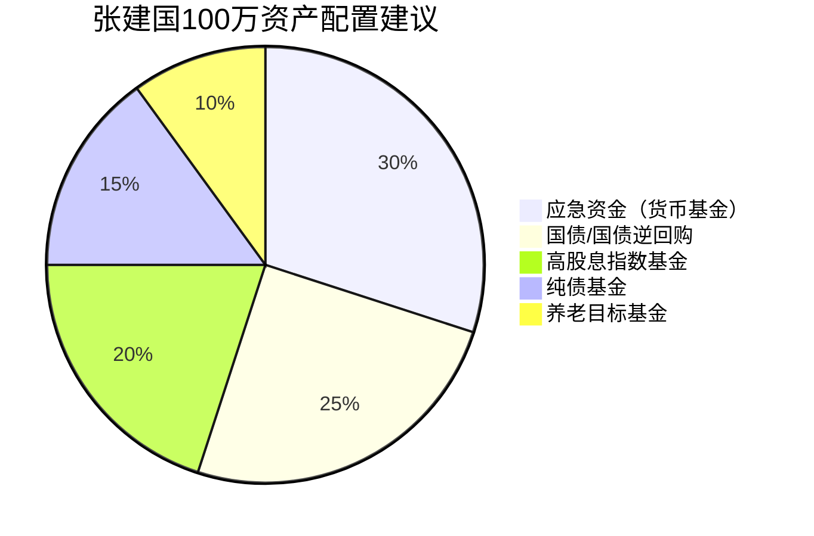
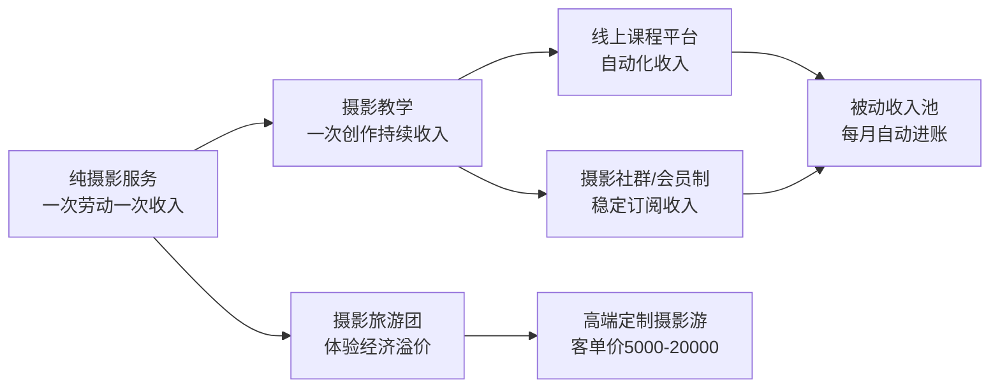
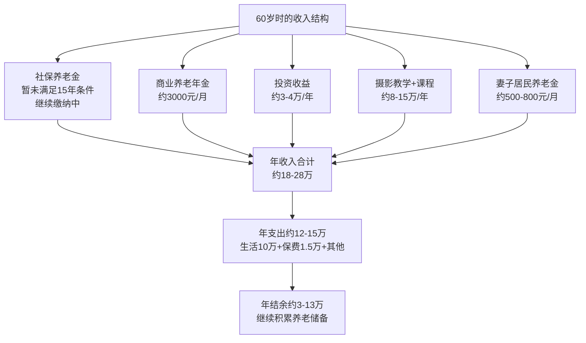

## 案例三：自由职业者的养老方案——没有社保怎么办？

### 引言：2亿灵活就业者的养老困境

中国灵活就业人口已超过2亿，涵盖自由职业者、个体工商户、网约车司机、外卖骑手、自媒体从业者、独立设计师等群体。这个庞大群体面临一个共同的结构性风险：**没有用人单位为其缴纳社保，养老完全靠自己**。

与企业职工相比，自由职业者在养老规划上面临三重劣势：

| 维度 | 企业职工 | 自由职业者 |
|------|----------|------------|
| 养老保险 | 单位缴16%+个人缴8%=24% | 全额自费，费率20%（仅12%进统筹） |
| 医疗保险 | 单位缴8-10%+个人缴2% | 全额自费，或参加城乡居民医保 |
| 失业/工伤/生育 | 单位缴纳 | 通常无法参保 |
| 公积金 | 单位+个人各5-12% | 部分城市允许灵活就业缴存 |
| 收入稳定性 | 工资相对固定 | 波动大，丰年荒年交替 |
| 企业年金 | 部分企业有 | 完全没有 |

本案例通过张建国的真实场景，系统展示一个"零社保"自由职业者如何从55岁开始构建完整的养老保障体系。

---

### 案例背景

**基本信息：**

| 项目 | 详情 |
|------|------|
| 姓名 | 张建国 |
| 年龄 | 55岁 |
| 职业 | 自由摄影师（从业20年） |
| 年收入 | 20-30万（波动大，旺季可达40万，淡季可能不足15万） |
| 婚姻 | 已婚，妻子50岁（全职家庭主妇，无收入） |
| 子女 | 女儿25岁，某985高校研二在读 |
| 居住 | 二线城市，自住房1套（市值300万，无贷款） |

**资产全景：**

| 资产类别 | 金额（万元） | 说明 |
|----------|-------------|------|
| 自住房产 | 300 | 自住，不产生现金流 |
| 银行存款 | 100 | 活期+定期，综合年化约1.5% |
| 相机器材 | 50 | 专业器材，属于生产工具，有折旧 |
| 其他资产 | 50 | 车辆（20万）、收藏品（15万）、家具家电（15万） |
| **净资产合计** | **500** | 但能产生被动收入的金融资产仅100万 |

**关键问题清单：**

1. 从未缴纳任何社会保险（养老、医疗、失业均无）
2. 收入不稳定，无法预测未来现金流
3. 妻子无工作、无社保、无退休金
4. 女儿读研每年学费+生活费约5-8万
5. 对养老完全没有系统规划，"走一步看一步"
6. 相机器材50万是贬值资产，且维修成本高
7. 无任何商业保险保障

---

### 深度诊断：张建国面临的五大风险

在制定方案之前，必须先认清风险的全貌。很多自由职业者不是不愿意规划，而是没有意识到风险有多大。

#### 风险一：医疗费用无底洞

55岁是健康的分水岭。根据国家卫健委数据，55-65岁人群慢性病患病率超过60%。没有医保的情况下：

- 一次心脏支架手术：8-15万
- 一次癌症治疗（含化疗/靶向）：30-80万
- 一次骨折住院：3-8万
- 年度慢性病用药：1-3万

**没有任何保障的张建国，一场大病就可能耗尽全部存款。**

#### 风险二：现金流断裂

自由职业收入的本质是"用时间换钱"。随着年龄增长：

- 体力下降，无法高强度拍摄（婚礼跟拍一天12小时）
- 客户偏好年轻摄影师
- 技术迭代快（视频/无人机/AI修图）
- 55岁到65岁的收入可能逐年递减30-50%

#### 风险三：长寿风险

2025年中国人均预期寿命已达79岁，一二线城市超过82岁。如果活到85岁，从60岁退休到85岁需要25年的生活费。按每年12万计算，需要300万——而张建国能产生现金流的金融资产只有100万。

#### 风险四：配偶保障真空

妻子50岁，无社保、无收入、无技能。如果张建国发生意外或丧失劳动能力，妻子将面临"零收入+零保障"的极端困境。

#### 风险五：资产结构失衡

500万净资产看似不少，但拆解后发现：

- 自住房300万：不产生现金流，无法变现（卖了住哪？）
- 相机器材50万：折旧资产，5年后可能只值20万
- 车辆20万：消耗品，每年贬值+养护成本3万
- 实际可用于养老的金融资产：仅100万存款

**核心矛盾：资产总额看起来够，但能产生现金流的资产远远不够。**

---

### 系统解决方案

#### 第一步：社保补缴——养老的地基（优先级最高）

社保是所有养老规划的基石。自由职业者参加社保有两个通道：

**通道一：灵活就业人员职工养老保险**

| 项目 | 说明 |
|------|------|
| 参保条件 | 本地户籍或持居住证的灵活就业人员 |
| 缴费基数 | 当地社平工资的60%-300%，自行选择 |
| 缴费比例 | 20%（其中8%进个人账户，12%进统筹账户） |
| 退休年龄 | 男60岁，女55岁 |
| 最低缴费年限 | 15年（累计） |
| 养老金计算 | 基础养老金+个人账户养老金 |

**张建国的具体操作：**

55岁开始缴纳，到60岁只能缴5年，不满足15年要求。有三条路：

1. **延迟退休至70岁**：缴满15年后领取养老金（60岁缴到70岁）。但70岁才开始领，回本周期长。
2. **一次性补缴**：部分地区允许一次性补缴不足年限。2024年后政策收紧，但各地执行口径不同，务必到当地社保局窗口咨询。
3. **转入城乡居民养老保险**：门槛低，缴费灵活，但养老金金额也低（多数地区每月200-500元）。

**建议策略：双轨并行**

- 主轨：以灵活就业身份缴纳职工养老保险（选最低基数，年缴费约1-1.5万）
- 副轨：同时为妻子缴纳城乡居民养老保险（选最高档次，年缴费约5000-8000元）
- 如果政策允许补缴，优先补缴张建国的职工养老（可能需要一次性支出10-20万）

**关键提醒：** 社保的核心价值不仅是养老金，更是**终身医保待遇**。职工医保缴满25-30年（各地不同），退休后免缴费享受医保报销。这对55岁的张建国来说，医疗保障的价值远超养老金本身。

#### 第二步：商业保险配置——筑起安全防线

社保是地基，商业保险是围墙。55岁投保商业保险面临两个现实困难：**保费贵、核保严**。但仍有必要配置。

**张建国的保险方案：**

| 险种 | 产品类型 | 年保费（估） | 保额 | 必要性 |
|------|----------|-------------|------|--------|
| 百万医疗险 | 保证续保20年款 | 2500-3500元 | 200-400万 | ★★★★★ |
| 意外险 | 综合意外险 | 300-500元 | 50-100万 | ★★★★★ |
| 防癌险 | 若百万医疗核保不通过 | 2000-4000元 | 100-200万 | ★★★★ |
| 定期寿险 | 保至65岁 | 3000-5000元 | 100万 | ★★★ |

**妻子的保险方案：**

| 险种 | 产品类型 | 年保费（估） | 保额 | 必要性 |
|------|----------|-------------|------|--------|
| 百万医疗险 | 保证续保20年款 | 2000-3000元 | 200-400万 | ★★★★★ |
| 意外险 | 综合意外险 | 300-500元 | 50-100万 | ★★★★★ |
| 防癌险 | 若百万医疗核保不通过 | 1500-3000元 | 100万 | ★★★★ |

**投保注意事项：**

1. **如实告知健康状况**：55岁多少有些健康问题（高血压、脂肪肝等），必须如实告知，否则理赔时会被拒赔
2. **优先选保证续保产品**：百万医疗险选"保证续保20年"的版本，避免因健康变化被拒续保
3. **55岁以上投保限制多**：部分产品投保年龄上限55或60岁，需要尽快投保
4. **保费预算控制**：两人合计年保费控制在1-1.5万，约占家庭年收入的5%

**不建议购买的险种：**

- 重疾险（55岁保费倒挂，交的保费比保额还高）
- 年金险（收益率低，不如自己投资）
- 万能险/分红险（费用不透明，实际收益远低于演示）

#### 第三步：资产配置重构——让钱生钱

张建国现有100万存款全部躺在银行，年化收益仅1.5%左右（约1.5万/年），跑不赢通胀。需要重新配置。

**重构原则：**

1. **安全性第一**：55岁没有"再来一次"的机会
2. **现金流优先**：优先选择能产生稳定现金流的资产
3. **分散配置**：不把鸡蛋放在一个篮子里
4. **流动性保留**：保留足够的应急资金

**建议配置方案：**

| 资产类别 | 金额（万） | 预期年化 | 年收益（元） | 说明 |
|----------|-----------|----------|-------------|------|
| 应急资金（货币基金） | 30 | 1.8-2.0% | 5400-6000 | 随时可取，覆盖6个月支出 |
| 国债/国债逆回购 | 25 | 2.5-3.0% | 6250-7500 | 国家信用，几乎零风险 |
| 高股息指数基金 | 20 | 4-6%（含股息） | 8000-12000 | 沪深300红利、中证红利等 |
| 纯债基金 | 15 | 3-4% | 4500-6000 | 波动小，收益稳定 |
| 养老目标基金（FOF） | 10 | 3-5% | 3000-5000 | 专为养老设计，自动调仓 |
| **合计** | **100** | **约3-4%** | **约3-4万** | 比纯存款多1.5-2.5万/年 |

**具体操作步骤：**

1. 留30万在余额宝/微信零钱通等货币基金，作为应急资金
2. 每月25号关注国债发行，用25万购买3年期或5年期储蓄国债
3. 在券商开户，用20万定投高股息ETF（如510880红利ETF），每月投入2万，10个月完成
4. 用15万买入纯债基金（如招商产业债A），一次性买入
5. 用10万买入养老目标基金（如目标日期2035的FOF基金）

**注意事项：**

- 高股息ETF采用定投而非一次性买入，降低择时风险
- 国债到期后及时续买，不要让资金空转
- 每年复盘一次配置比例，根据年龄和市场情况微调
- 相机器材50万属于"生产工具"，不建议变现，但需要做好折旧准备

#### 第四步：收入结构转型——从劳动收入到知识资产

这是张建国养老规划中最具战略意义的一步。自由职业者的核心问题是**用时间换钱**，一旦停止工作就没有收入。解决之道是建立**知识资产**——一次创作、持续收益的收入模式。

**转型路径：**

**具体收入转型方案：**

| 收入来源 | 当前状态 | 转型目标 | 时间投入 | 预期收入 |
|----------|----------|----------|----------|----------|
| 商业摄影 | 主要收入 | 逐步减少，只接高端单 | 每月5-8天 | 从20万降到8-10万/年 |
| 线上摄影课 | 无 | 在B站/网易云课堂上线 | 前期投入3个月录制 | 3-8万/年（持续增长） |
| 摄影旅游团 | 无 | 每月组织1-2次 | 每月2-4天 | 3-6万/年 |
| 摄影社群 | 无 | 建立付费社群（年费制） | 每周2-3小时维护 | 2-4万/年 |
| 作品版权 | 偶尔 | 入驻视觉中国/站酷海洛 | 上传即持续收益 | 1-2万/年 |
| 设备评测/推广 | 无 | 接品牌合作 | 每月1-2篇 | 1-3万/年 |
| **合计** | **20-30万** | **18-33万** | **更灵活** | **收入多元化+被动化** |

**为什么这个转型至关重要？**

1. **降低对体力的依赖**：教学和课程不需要扛器材跑一天
2. **建立复利效应**：课程录一次卖多次，社群建一次持续收费
3. **提高抗风险能力**：收入来源从1个变成5-6个
4. **延长职业寿命**：60岁、70岁照样可以教课、写书

#### 第五步：妻子的保障体系——不能忽视的另一半

张建国的妻子王丽华，50岁，家庭主妇，没有社保、没有收入、没有职业技能。这是整个家庭最大的风险敞口之一。

**必须立即做的事：**

1. **城乡居民养老保险**：立即参保，选择最高档次（多数地区最高档年缴5000-8000元），60岁开始领取基础养老金+个人账户养老金（预估每月500-1000元）
2. **城乡居民医疗保险**：立即参保（年缴约380-500元），住院可报销50-70%
3. **百万医疗险**：趁50岁还能投保，尽快购买保证续保20年的产品
4. **培养独立能力**：鼓励妻子学习基础理财知识，了解家庭资产状况

**长期规划：**

- 如果张建国先离世，妻子需要有独立生活的能力和经济来源
- 考虑为妻子购买一份定期寿险（张建国为受益人）或反过来
- 妻子可以学习简单的摄影后期处理，协助张建国的课程制作，既能增加收入，也能建立自己的技能

#### 第六步：女儿的教育投资与边界设定

女儿25岁研二，每年教育支出约5-8万。需要在支持和过度资助之间找到平衡。

**原则：**

- 支持到研究生毕业（还有1-2年），这是合理的教育投资
- 毕业后不再提供生活费，但可以支持首付（量力而行）
- 不要为了资助女儿而牺牲自己的养老储备

**具体建议：**

| 阶段 | 支持方式 | 金额/年 |
|------|----------|---------|
| 研二-研三 | 学费+生活费 | 5-8万 |
| 毕业后1年 | 过渡期租房补贴 | 1-2万 |
| 买房时 | 首付支持（可选） | 视当时资产状况 |
| 之后 | 精神支持为主 | 0 |

**关键认知：** 对子女最好的支持不是给钱，而是不成为他们的负担。如果张建国夫妇养老没有保障，将来女儿要同时赡养两个没有收入的老人，压力远超任何教育投入。

---

### 财务模型推演

#### 五年财务预测（60岁时）

**60岁时资产预期：**

| 项目 | 金额（万元） | 说明 |
|------|-------------|------|
| 金融资产 | 100-120 | 初始100万+投资收益+结余积累 |
| 社保个人账户 | 8-12 | 5年缴费积累 |
| 商业养老年金 | 已缴50万 | 60岁开始领取 |
| 自住房产 | 300+ | 保值或增值 |
| **净资产合计** | **约460-530** | 金融资产占比提升 |

#### 十年财务预测（65岁时）

| 项目 | 金额/状态 |
|------|----------|
| 社保缴纳 | 已缴10年，还差5年（争取补缴或延迟至70岁） |
| 商业养老年金 | 已领取5年，累计约18万 |
| 投资组合 | 约100-130万（收益+结余-取用） |
| 摄影教学收入 | 可能下降至5-8万/年（体力+精力） |
| 妻子居民养老金 | 约600-1000元/月 |
| 健康状况 | 需密切关注，慢性病管理成本上升 |

#### 极端场景压力测试

**场景一：张建国60岁突发重大疾病**

- 百万医疗险覆盖住院费用（200-400万保额）
- 应急资金30万覆盖自费部分和康复期
- 投资组合不动，持续产生收益
- 妻子有社保+商业保险，不依赖张建国

**场景二：张建国65岁丧失劳动能力**

- 如果缴满社保：可申请病残津贴
- 商业养老年金持续领取
- 投资收益3-4万/年
- 妻子有居民养老金+医保
- 总收入约10-15万/年，基本生活有保障

**场景三：张建国不幸离世**

- 妻子有居民养老金（500-1000元/月）
- 定期寿险赔付100万
- 投资组合继承
- 自住房产继承
- 妻子有基本保障，不会陷入困境

---

### 执行时间表

| 时间节点 | 行动项 | 优先级 |
|----------|--------|--------|
| 第1周 | 到社保局咨询灵活就业参保+补缴政策 | ★★★★★ |
| 第1周 | 为夫妻二人购买百万医疗险+意外险 | ★★★★★ |
| 第2周 | 妻子参加城乡居民养老保险+医保 | ★★★★★ |
| 第1月 | 开通券商账户，开始定投高股息ETF | ★★★★ |
| 第1月 | 购买国债，配置纯债基金 | ★★★★ |
| 第2-3月 | 录制第一门线上摄影课程 | ★★★★ |
| 第3月 | 建立摄影付费社群 | ★★★ |
| 第6月 | 组织第一次摄影旅游团 | ★★★ |
| 每季度 | 复盘财务状况，调整配置 | ★★★ |
| 每年 | 更新保险保障，检视社保缴费 | ★★★ |

---

### 常见误区与纠正

**误区一："没有社保就没救了"**

纠正：社保只是养老的一根支柱，商业保险+投资+知识资产同样可以构建完整的养老保障。社保的核心价值是医保而非养老金。

**误区二："55岁太晚了，规划没用了"**

纠正：55岁到85岁还有30年。100万如果配置得当，30年可以产生100-200万的收益。加上社保、商业保险和知识资产转型，完全可以过上有尊严的退休生活。

**误区三："买份年金险就够了"**

纠正：商业年金险的IRR（内部收益率）通常只有2-3%，跑不赢通胀。应该把年金险作为"底线保障"而非主要养老工具。自己配置投资组合的长期收益远高于年金险。

**误区四："存够300万就能退休"**

纠正：单纯靠存款养老，300万按每年花12万只能撑25年，还没考虑通胀。关键是建立**现金流管道**而非存一笔钱。

**误区五："等收入稳定了再规划"**

纠正：自由职业的收入永远不会"稳定"。正因为收入不稳定，才更需要提前规划。越晚开始，可选择的方案越少、成本越高。

---

### 工具与资源推荐

**社保查询与办理：**

- 国家社会保险公共服务平台：http://si.12333.gov.cn
- 各地社保局线下窗口（补缴政策必须窗口咨询）
- 电子社保卡小程序（查询缴费记录）

**保险选购平台：**

- 蚂蚁保（支付宝内）
- 微保（微信内）
- 慧择网（专业保险经纪）
- 小雨伞（比价平台）

**投资工具：**

- 券商APP（华泰、中信、招商等）：买ETF、国债
- 天天基金/蛋卷基金：买基金
- 余额宝/零钱通：货币基金

**知识变现平台：**

- B站课堂/网易云课堂/腾讯课堂：上线付费课程
- 小红书/抖音：引流+个人品牌建设
- 知识星球/小报童：付费社群

---

### 本案例核心启示

1. **自由职业者最大的风险不是收入低，而是没有兜底机制**。社保、保险、投资三道防线缺一不可。
2. **资产总额不等于养老能力**。500万净资产中，能产生现金流的金融资产只有100万，这才是真正的养老弹药。
3. **知识资产是自由职业者养老的王牌**。从"卖时间"转向"卖知识"，一次创作、持续收益，是对抗衰老和收入下降的最佳策略。
4. **配偶保障不能留白**。一个人的养老规划必须覆盖整个家庭，尤其是没有独立收入的配偶。
5. **55岁开始规划完全来得及**。关键是立刻行动，而非等待"更好的时机"。

> **一句话总结：** 自由职业者的养老 = 社保打底 + 商业保险兜底 + 投资组合增值 + 知识资产造血 + 配偶保障补位。五根柱子缺一不可，越早搭建越稳固。

***
