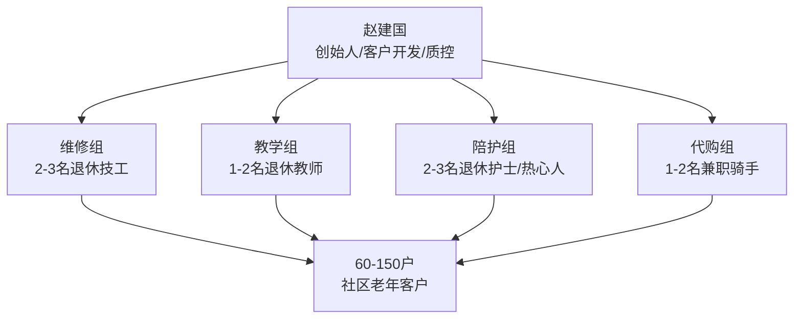

## 案例四：退休后的二次创业——55岁开始的银发经济

### 案例背景

赵建国，55岁，某中型制造企业车间主任，工龄32年。月薪8500元，退休后预计养老金约4200元/月。妻子李秀兰，53岁，社区卫生服务中心护士，月薪6800元，预计退休养老金约3500元/月。女儿赵敏，28岁，已婚已育，定居省会城市。

**家庭资产状况：**

| 资产类型 | 具体项目 | 市值（万元） |
|---------|---------|------------|
| 房产 | 自住房一套（三线城市老城区，105㎡） | 85 |
| 房产 | 老家宅基地房屋（闲置） | 15 |
| 金融资产 | 银行定期存款 | 32 |
| 金融资产 | 国债 | 10 |
| 金融资产 | 货币基金 | 8 |
| 其他 | 公积金账户余额 | 12 |
| **合计** | | **162** |

**家庭月度支出：** 约5800元（含生活费3500、水电物业600、人情往来500、交通通讯400、医疗保健300、其他500）

**核心困境：**

赵建国面临的不是"能不能退休"的问题，而是"退休后怎么活"的问题。具体表现为三个层面：

**第一层：经济层面。** 夫妻双方退休后合计养老金约7700元/月，扣除生活支出5800元后仅余1900元。这笔钱要覆盖人情往来、季节性支出（取暖费、过年开销）、偶尔的旅行和不可预见的医疗开支，明显捉襟见肘。更重要的是，随着年龄增长医疗支出会持续上升——据国家卫健委数据，60岁以上老年人年均医疗支出是40-50岁群体的2.3倍。

**第二层：心理层面。** 赵建国在工厂干了32年，从学徒工一路干到车间主任。退休意味着失去每天早上6点起床的理由，失去被需要的感觉，失去与几十号工友朝夕相处的社交圈。心理学研究表明，退休后6个月内是抑郁症高发期，男性退休者的抑郁发生率比在职时高出40%。

**第三层：能力层面。** 赵建国会电焊、懂机械维修、熟悉工厂管理流程，但这些技能在传统就业市场上几乎没有用武之地——没有企业会雇佣一个55岁的车间主任。然而，这些技能如果换一个视角看，恰恰是银发经济中的稀缺资源。

### 银发经济的市场背景：为什么这是一个黄金赛道

在分析赵建国的具体创业路径之前，有必要理解银发经济的宏观环境。这不是一个"退而求其次"的选择，而是一个正在爆发的万亿级市场。

**市场规模与增长趋势：**

中国60岁以上人口在2025年已达3.1亿，占总人口的22%。预计到2035年将突破4亿。银发经济市场规模在2024年约为7万亿元，预计2035年将达到30万亿元，年复合增长率约13%。国务院办公厅2024年1月印发的《关于发展银发经济增进老年人福祉的意见》是国家层面首个银发经济专项政策文件，标志着银发经济从"市场自发"进入"政策推动"的新阶段。

**银发经济的核心赛道：**

| 赛道 | 市场规模（2024年） | 年增长率 | 适合50+创业者的切入点 |
|------|------------------|---------|-------------------|
| 养老服务 | 2.8万亿 | 15% | 居家养老服务、社区助餐 |
| 健康管理 | 1.5万亿 | 18% | 健康咨询、慢病管理指导 |
| 老年教育 | 3000亿 | 25% | 兴趣培训、技能传承 |
| 适老化改造 | 2000亿 | 20% | 家居适老化评估与施工 |
| 老年旅游 | 5000亿 | 12% | 银发主题旅行团 |
| 辅助器具 | 1500亿 | 16% | 产品代销、使用指导 |

**为什么50+创业者反而有优势？**

这个问题的答案藏在信任经济学里。银发经济的服务对象是老年人，而老年人最信任的恰恰是同龄人——他们有共同的生活经历、相似的语言习惯、一致的价值观。一个25岁的年轻人向70岁的老人推销养老服务，老人的第一反应是"你懂什么"；而一个55岁的人来做同样的事，天然就有一层信任基础。这就是银发经济创业者的核心护城河：**年龄即信用**。

### 赵建国的创业路径：从零到月入12000元的完整复盘

#### 第一阶段：发现需求（第1-2个月）

赵建国的创业灵感来自一个偶然事件。退休后第三周，隔壁单元76岁的独居老人王大爷家里的水龙头坏了，漏水漏了一地。王大爷打了物业电话，物业说不负责室内维修；打了几个维修师傅的电话，不是嫌活小不来，就是要价200元上门费。赵建国听说后，拎着工具箱半小时就给修好了，换了个水龙头芯，成本8块钱。

王大爷拉着赵建国的手说："建国啊，你要是能专门给我们这些老家伙修修东西就好了，外面找的人不放心，不是漫天要价就是糊弄人。"

这句话让赵建国开始认真思考：社区里像王大爷这样的独居老人、空巢老人有多少？他们日常生活中最头疼的事情是什么？

**需求调研方法：**

赵建国用了两周时间，在小区和周边社区做了一次非正式调研。他的方法很简单但很有效：

1. **社区广场蹲点法**：每天早晚在小区广场、公园、菜市场这些老年人聚集的地方溜达，主动搭话聊天。不是推销，就是闲聊——聊身体、聊子女、聊生活中的烦心事。两周下来，他跟100多位老人聊过天。

2. **问题记录法**：每次聊天，他都在手机备忘录里记下老人们提到的具体困难。两周下来整理出一份清单。

3. **需求频率排序法**：把所有问题按出现频率排序，找出最高频的需求。

**调研结果——老年人最头疼的十大问题（按频率排序）：**

| 排名 | 问题 | 提及频率 | 现有解决方式 | 痛点 |
|------|------|---------|------------|------|
| 1 | 家里水电维修找不到靠谱的人 | 78% | 物业（不负责室内）/ 58到家（太贵） | 贵、不放心、等太久 |
| 2 | 智能手机不会用（挂号、缴费、视频通话） | 72% | 子女教（记不住、不好意思总问） | 子女没耐心、学了就忘 |
| 3 | 买菜做饭越来越力不从心 | 65% | 子女送饭 / 外卖（不会点） | 不想麻烦子女、外卖不合口味 |
| 4 | 家里适老化改造不知道找谁做 | 58% | 自己凑合 / 子女帮忙找 | 不知道改什么、怕被坑 |
| 5 | 慢性病用药管理混乱 | 52% | 社区医院（排队太久） | 药种类多、记不住怎么吃 |
| 6 | 出行不便（打车、坐公交） | 48% | 子女接送（子女忙） | 不会用打车软件 |
| 7 | 家电不会操作（新电视、洗衣机） | 45% | 看说明书（字太小） | 功能太多、怕按坏 |
| 8 | 孤独、没人说话 | 42% | 电视 / 邻居偶尔串门 | 精神空虚 |
| 9 | 收拾家务力不从心 | 38% | 钟点工（贵） | 每周一次不够、每天请不起 |
| 10 | 怕被骗（电信诈骗、保健品骗局） | 35% | 子女提醒（不在身边） | 手段太多、防不胜防 |

这份清单让赵建国看到了巨大的机会。他没有试图解决所有问题，而是聚焦在前三项高频需求上——因为他恰好具备解决这些问题的能力。

#### 第二阶段：确定服务方向与模式设计（第2-3个月）

**服务定位：社区"全能管家"式居家养老服务**

赵建国最终确定的服务模式，用一句话概括就是："老年人生活中的'万能儿子'"——子女不在身边时，他来解决各种生活难题。

这个定位的核心逻辑是：老年人需要的不是某一项专业服务（如专业的水电维修公司、专业的手机教学），而是一个**可信赖的、综合性的、随叫随到的生活帮手**。专业公司的问题是"太专业"——水龙头坏了找水电工，手机不会用找年轻人，家电坏了找售后，老人要记三个电话号码、面对三个陌生人。而赵建国提供的是一站式服务，一个电话搞定所有问题。

**具体服务内容：**

| 服务类别 | 具体项目 | 定价 | 单次耗时 | 技能要求 |
|---------|---------|------|---------|---------|
| 居家维修 | 水电维修、换灯泡、修门锁、通下水道 | 30-80元/次 | 30-60分钟 | ★★★（核心技能） |
| 手机教学 | 微信使用、手机挂号、在线缴费、视频通话 | 50元/小时 | 1-2小时 | ★★（自学掌握） |
| 家电使用指导 | 电视、洗衣机、空调、微波炉操作教学 | 30元/次 | 30分钟 | ★★（看说明书） |
| 陪同就医 | 挂号、取药、陪同检查、记录医嘱 | 150元/半天 | 3-4小时 | ★（体力活） |
| 代购代买 | 买菜、买药、买日用品 | 20元/次+实报实销 | 1-2小时 | ★（腿脚勤快） |
| 适老化评估 | 评估居家安全隐患并给出改造建议 | 200元/次 | 2-3小时 | ★★（培训学习） |
| 安全巡查 | 定期上门检查独居老人安全状况 | 500元/月（每周2次） | 30分钟/次 | ★（责任心） |

**包月套餐设计：**

单项收费容易让老人觉得"每花一分钱都要计较"，体验不好。赵建国设计了三种包月套餐：

| 套餐名称 | 月费 | 包含内容 | 目标客户 |
|---------|------|---------|---------|
| 基础关怀 | 600元/月 | 每周2次上门巡查 + 每月2次小维修 + 手机问题随时电话指导 | 身体尚可的独居老人 |
| 安心生活 | 1000元/月 | 基础关怀 + 每月4次代购 + 每月1次陪同就医 | 行动不便的老人 |
| 全面守护 | 1500元/月 | 安心生活 + 每月1次适老化评估 + 紧急随叫随到 | 高龄独居/空巢老人 |

**定价逻辑：** 基础关怀600元/月，相当于每天20元——比请钟点工便宜得多（钟点工每小时40-60元），而且是"自己的人"，老人心理上更容易接受。赵建国的定价策略是：**比子女请假来帮忙便宜，比外面找人便宜30%-50%，但比免费帮忙有尊严**。

#### 第三阶段：技能补课与工具准备（第3-4个月）

赵建国的维修技能是现成的，但其他服务需要补课。他用一个月时间做了以下准备：

**手机教学能力速成：**

赵建国自己对智能手机也只是"会用"的水平。他专门花了两周时间，把老年人最常用的20个手机操作场景全部练习到熟练：

- 微信：发消息、语音通话、视频通话、发朋友圈、收付款、小程序
- 支付宝：扫码付款、生活缴费、挂号预约
- 医院挂号：本地三家主要医院的微信公众号/小程序挂号流程
- 打车：滴滴出行叫车（含电话叫车功能）
- 其他：健康码（如果还在用）、公交扫码、电视投屏

每个操作他都用手机录屏做成短视频教程，发给客户后老人可以反复看。这个"视频教程"后来成了他最有效的获客工具——老人们转发给朋友，比任何广告都管用。

**适老化评估知识学习：**

赵建国通过三个渠道学习适老化评估知识：

1. **民政部官网**：下载了《老年人居家适老化改造项目和老年用品配置清单》，里面有详细的改造项目和标准
2. **短视频平台**：搜索"适老化改造"相关视频，学习其他城市的案例
3. **社区民政部门**：主动联系街道民政科，了解当地适老化改造补贴政策（很多城市对80岁以上老人有免费适老化改造补贴）

**工具与物料准备：**

| 项目 | 投入成本 | 说明 |
|------|---------|------|
| 工具箱升级 | 500元 | 补充了万用表、管道疏通器、玻璃胶枪等 |
| 工作服 | 200元 | 定制了印有"赵师傅·居家服务"的马甲，提升专业感 |
| 名片 | 100元 | 500张，正面印服务项目和电话，背面印微信二维码 |
| 手机支架 | 50元 | 上门教学时固定手机，方便老人看清操作步骤 |
| 常用配件库存 | 800元 | 水龙头芯、灯泡、门锁、开关面板、水管接头等 |
| **合计** | **1650元** | |

#### 第四阶段：获客与口碑积累（第4-8个月）

**第一批客户从哪里来？**

赵建国的获客策略非常朴素但极其有效——**从身边人开始，用服务换口碑，用口碑换客户**。

**第1周：种子客户（5户）**

- 王大爷（灵感来源，免费服务，换来第一个好评和口头推荐）
- 同小区4位老人（王大爷介绍的，以"邻居帮忙"的名义低价服务）

**第2-4周：口碑扩散（15户）**

种子客户的口碑效应比想象中更强。王大爷逢人就说"建国修东西又快又好还不贵"，小区里的老人们口口相传。第一个月结束时，赵建国已经服务了15户家庭。

**第2-3个月：社区渗透（40户）**

赵建国做了三件事来加速获客：

1. **社区活动赞助**：出资200元买了些水果和糕点，在小区广场办了一次"老年人手机使用免费教学"活动。来了30多人，现场教会了15位老人用微信视频通话。活动结束后，8位老人当场留了联系方式。

2. **与社区居委会合作**：主动联系居委会，提出免费为社区独居老人提供每月一次安全巡查服务。居委会正愁没人做这件事，欣然同意，并在社区公告栏张贴了他的服务信息。

3. **物业合作**：跟小区物业达成协议——业主室内维修需求，物业推荐赵建国（物业不负责室内维修，但业主经常打电话找物业）。作为回报，赵建国免费帮物业处理一些公共区域的小维修。

**第4-8个月：稳定增长（50-60户）**

到第8个月，赵建国的客户数量稳定在50-60户，其中包月客户25户，其余为按次服务客户。

**获客成本分析：**

| 获客方式 | 投入成本 | 获客数量 | 单客成本 |
|---------|---------|---------|---------|
| 口碑推荐 | 0元 | 35户 | 0元 |
| 社区活动 | 200元 | 8户 | 25元 |
| 居委会推荐 | 0元 | 10户 | 0元 |
| 物业推荐 | 0元 | 5户 | 0元 |
| 名片散发 | 100元 | 2户 | 50元 |
| **合计** | **300元** | **60户** | **5元/户** |

获客成本极低，这是银发经济社区服务的核心优势之一。老年人圈子小、信任度高、传播效率高——一个满意的老年客户平均能带来2.3个新客户。

#### 第五阶段：收入结构与财务模型（第8个月后稳定运行）

**月度收入明细（稳定期数据）：**

| 收入来源 | 客户数/次数 | 单价 | 月收入（元） |
|---------|-----------|------|------------|
| 基础关怀包月 | 12户 | 600元/月 | 7200 |
| 安心生活包月 | 8户 | 1000元/月 | 8000 |
| 全面守护包月 | 5户 | 1500元/月 | 7500 |
| 按次维修服务 | 约20次 | 平均50元/次 | 1000 |
| 按次手机教学 | 约8次 | 50元/次 | 400 |
| 陪同就医 | 约4次 | 150元/次 | 600 |
| 适老化评估 | 约2次 | 200元/次 | 400 |
| **月收入合计** | | | **25100** |

**月度支出明细：**

| 支出项目 | 金额（元） | 说明 |
|---------|-----------|------|
| 交通费 | 600 | 电动车充电+偶尔公交 |
| 配件耗材 | 400 | 水龙头芯、灯泡等常用配件 |
| 通讯费 | 100 | 手机话费 |
| 工具维护 | 100 | 工具损耗更换 |
| 保险 | 200 | 个人意外险+第三者责任险 |
| 其他 | 200 | 名片印刷、工作服更新等 |
| **支出合计** | **1600** | |

**月净收入：25100 - 1600 = 23500元**

**加上夫妻双方养老金7700元，家庭月总收入约31200元，年收入约37.4万元。**

这个收入水平不仅远超退休前的家庭收入（赵建国月薪8500 + 妻子月薪6800 = 15300元/月），而且工作强度远低于上班——每天实际服务时间约5-6小时，周末基本休息。

### 成果数据

| 指标 | 创业起步时 | 第4个月 | 第8个月（稳定期） |
|------|----------|--------|----------------|
| 月收入 | 0元 | 8500元 | 23500元（净） |
| 客户总数 | 0户 | 25户 | 60户 |
| 包月客户 | 0户 | 8户 | 25户 |
| 客户复购率 | 0% | 72% | 85% |
| 包月续费率 | 0% | — | 92% |
| 客户满意度 | — | — | 96% |
| 每日工作时间 | 0小时 | 6-7小时 | 5-6小时 |
| 获客成本 | 300元 | 300元 | 300元 |

### 关键成功因素分析

赵建国的案例之所以成功，不是因为他特别聪明或特别勤奋，而是因为他踩中了五个关键要素：

**要素一：选对了赛道——银发经济的结构性机会**

银发经济不是"夕阳产业"，而是"朝阳产业中的夕阳人群"。中国每年新增老年人口超过1000万，而养老服务供给严重不足。民政部数据显示，全国养老护理员缺口超过200万人。赵建国进入的不是红海市场，而是一片蓝海。

更重要的是，这个赛道的护城河不是技术或资本，而是**信任和关系**。一个年轻创业者即使投入100万，也很难在短期内建立起赵建国花两个月用真诚服务换来的信任网络。

**要素二：找到了精准切入点——社区级综合服务**

赵建国没有做"大而全"的养老服务平台，而是聚焦在自己所在社区半径3公里范围内的综合服务。这个切入点的优势在于：

- **低启动成本**：不需要租店面、不需要雇人、不需要开发APP
- **高频复购**：老年人的需求是持续性的，不是一锤子买卖
- **口碑效应强**：社区是天然的熟人网络，好服务自带传播力
- **竞争壁垒高**：外来者很难渗透社区信任网络

**要素三：用"包月制"锁定了稳定现金流**

包月套餐的设计是整个商业模式的关键创新。按次收费的缺点是收入不稳定、客户忠诚度低。包月制的优势在于：

- 对客户：省心，不用每次找人、比价、担心被坑
- 对赵建国：收入可预期、客户粘性高、服务时间可规划
- 对双方：建立了长期关系，从"交易"变成了"服务"

25户包月客户贡献了22700元/月，占月收入的90%。这才是稳定的"工资替代"收入。

**要素四：用"免费+低价"完成了冷启动**

赵建国的第一单是免费的（帮王大爷修水龙头），前5单是低价的。这不是亏本赚吆喝，而是用最小的成本完成了三件事：

1. 验证了需求真实存在（老人们确实愿意为此付费）
2. 积累了第一批口碑素材（王大爷逢人就夸）
3. 磨练了服务流程（前5单暴露了很多操作层面的问题）

**要素五：用"视频教程"创造了裂变传播**

手机教学录屏做成短视频这个小创意，意外成了最有效的获客工具。老年人收到视频后会转发给老伙伴："你看，赵师傅教的，一看就会。"这个传播链条的效率远超任何线上广告。

### 赵建国踩过的三个坑

在创业过程中，赵建国并非一帆风顺。以下是他在前8个月遇到的三个主要问题和解决方案：

**坑一：定价太低导致"忙死了却不赚钱"**

前两个月，赵建国的定价是维修20元/次、手机教学30元/小时。结果每天从早忙到晚，月收入却只有4000多元。更要命的是，低价吸引了一批"价格敏感型"客户——他们对服务要求高、付费意愿低、还喜欢讨价还价。

**解决方案：** 第三个月果断提价50%，同时推出包月套餐。短期内流失了约30%的客户，但剩下的客户质量明显提高，总收入反而上升了。

**教训：** 银发经济的定价不是越低越好。老年人对"便宜没好货"的认知根深蒂固——太便宜反而让他们不放心。合理的定价本身就是一种信任信号。

**坑二：没有边界导致"随叫随到变全年无休"**

有几位包月客户把"紧急随叫随到"理解成了"随时可以找你聊天"。有位阿姨甚至每天晚上8点打电话跟赵建国聊半小时家常，严重影响了家庭生活。还有客户半夜11点打电话说"电视遥控器找不到了"。

**解决方案：** 在服务协议中明确"服务时间"（早8点到晚6点）和"紧急情况"的定义（仅限漏水、停电、人身安全等）。非紧急需求在服务时间外不响应。对需要陪伴聊天的客户，单独推出"陪伴服务"按小时收费。

**教训：** 服务边界必须从第一天就建立清楚。老年人的需求是无限的，你的时间是有限的。没有边界的服务最终会压垮你自己。

**坑三：忽视了风险管理——差点吃官司**

有一次帮一位老人换灯泡，老人在递灯泡时不小心从椅子上摔下来，手腕骨裂。虽然赵建国第一时间送老人去了医院，医疗费也只花了2000多元，但老人的子女态度很强硬，认为赵建国应该负全责。最后花了两周时间调解，赵建国承担了全部医疗费2300元，又额外补偿了1000元才了结。

**解决方案：** 这件事之后，赵建国做了三个改变：
1. 购买了个人意外险和第三者责任险（年保费2400元，保额50万）
2. 与每位客户签署简单的服务协议，明确双方权责
3. 涉及登高、用电等有风险的操作，坚持让客户远离操作区域

**教训：** 社区服务看似低风险，但服务对象是老年人——任何小意外都可能变成大麻烦。保险和服务协议是底线，不能省。

### 从个人到团队：规模化路径

赵建国的模式在第8个月后已经趋于稳定。如果他想进一步扩大规模，以下是可行的路径：

**路径一：横向复制——扩展服务半径**

从一个社区扩展到周边3-5个社区，服务范围从3公里扩大到10公里。需要增加交通工具（从电动车升级为微型面包车），可能需要雇一个助手分担维修工作。

**预期效果：** 客户数从60户扩展到120-150户，月收入有望达到4-5万元。

**路径二：纵向深耕——增加高价值服务**

在现有客户基础上，叠加高附加值服务：

- **居家适老化改造**：评估+设计+施工监理，单户收费2000-5000元
- **健康管理助手**：与社区卫生中心合作，提供用药提醒、陪同复诊、健康档案管理
- **数字化生活服务**：帮老人代管各类APP账号、设置自动缴费、安装智能家居设备

**路径三：平台化——从"自己干"到"带人干"**

招募社区里的其他退休人员（特别是退休医生、退休教师、退休电工等有专业技能的人），组建一个"银发服务团队"。赵建国负责客户开发和质量管控，其他人负责具体服务。收入按比例分成。

**路径四：与政府合作——承接政府购买服务**

很多地方政府有"居家养老服务"的政府购买项目，为80岁以上老人、低保老人、失能老人等提供免费或低价的上门服务。赵建国可以注册成为养老服务供应商，承接政府订单。

**操作步骤：**
1. 注册个体工商户或民办非企业单位
2. 到区民政局养老服务科备案
3. 参与政府购买服务项目的招投标
4. 按照政府标准提供服务并接受考核

政府购买服务的单价通常较低（每小时30-50元），但订单量大、回款稳定，可以作为基础收入保障。

### 给50+创业者的实操建议

基于赵建国的案例，提炼出可复制的实操建议：

**建议一：创业前先做"三圈分析"**

在决定做什么之前，画三个圈：

- **能力圈**：你会什么？（赵建国：电焊、维修、工厂管理）
- **需求圈**：周围的人需要什么？（赵建国：老人需要靠谱的生活帮手）
- **兴趣圈**：你愿意做什么？（赵建国：喜欢跟人打交道、享受被需要的感觉）

三个圈的交集就是你的最佳创业方向。如果只有能力没有需求，做出来没人买单；只有需求没有能力，服务质量跟不上；有能力有需求但没兴趣，干不了三个月就会放弃。

**建议二：启动资金控制在5000元以内**

50+创业的核心原则是**低成本试错**。不要一上来就租店面、买设备、雇员工。先用最小的成本验证需求，跑通商业模式，再考虑投入。

| 启动阶段 | 建议投入 | 上限 |
|---------|---------|------|
| 调研阶段 | 0元（靠腿和嘴） | 0元 |
| 工具和物料 | 1000-2000元 | 3000元 |
| 首月运营费 | 500-1000元 | 2000元 |
| **合计** | **1500-3000元** | **5000元** |

超过5000元的启动项目，对于50+初次创业者来说风险过高。如果前两个月没有跑通模式，损失也在可控范围内。

**建议三：第一周就要开始赚钱**

不要相信"先烧钱后赚钱"的互联网思维。50+创业者的每一分钱都是养老钱，不能烧。第一周就要有收入，哪怕只有100元。收入是最好的验证信号——如果有人愿意付钱，说明你做对了；如果没人愿意付钱，赶紧调整方向。

**建议四：用"服务协议"保护自己**

即使是帮邻居修水龙头，也要有简单的书面约定。内容至少包括：

- 服务内容和范围
- 收费标准和支付方式
- 双方的权利和义务
- 安全责任的划分
- 争议解决方式

不需要找律师，网上有很多模板可以参考。关键是让双方对服务内容和费用有清晰的共识，避免事后扯皮。

**建议五：保险是底线，不能省**

为老年人提供服务，意外风险不可忽视。以下保险建议购买：

| 保险类型 | 年保费 | 保额 | 作用 |
|---------|-------|------|------|
| 个人意外险 | 300-500元 | 20-50万 | 工作中自己受伤的保障 |
| 第三者责任险 | 500-800元 | 50万 | 服务过程中客户受伤的赔偿 |
| 财产损失险 | 200-300元 | 10万 | 服务过程中客户财产损坏的赔偿 |
| **合计** | **1000-1600元** | | |

这笔钱不能省。一次意外赔偿可能抵得上你半年的收入。

### 适合50+创业者的银发经济方向清单

除了赵建国选择的"社区综合服务"，还有以下方向适合50+创业者：

| 方向 | 核心能力要求 | 启动成本 | 月收入预期 | 难度 |
|------|-----------|---------|-----------|------|
| 社区助餐/送餐 | 烹饪、食品安全 | 5000-20000元 | 5000-15000元 | ★★ |
| 老年兴趣班（书法、太极、合唱） | 特定才艺 | 1000-3000元 | 3000-8000元 | ★★ |
| 陪诊服务 | 医院流程熟悉、耐心 | 500元 | 3000-6000元 | ★ |
| 适老化改造评估 | 相关知识学习 | 2000元 | 5000-10000元 | ★★★ |
| 老年旅游领队 | 组织能力、应急处理 | 3000元 | 5000-15000元 | ★★★ |
| 健康管理助手 | 基础医学知识 | 1000元 | 3000-8000元 | ★★ |
| 老年用品代销 | 销售能力、渠道 | 5000-10000元 | 3000-10000元 | ★★ |
| 代办服务（跑腿、排队、手续） | 腿脚勤快、流程熟悉 | 500元 | 3000-6000元 | ★ |

### 常见误区与风险提示

**误区一："银发经济就是伺候老人"**

银发经济的服务对象确实是老年人，但核心不是"伺候"，而是**赋能**——帮助老年人维持独立生活的能力、提升生活品质、延缓功能衰退。带着"伺候"的心态去做，服务质量和客户体验都会打折扣。

**误区二："只要服务好就能赚钱"**

服务好是基础，但赚钱还需要**商业模式设计**。赵建国之所以能月入2万多，不是因为他修水龙头修得好，而是因为他设计了包月套餐锁定了稳定现金流。如果你只做按次收费，同样的服务量收入可能只有一半。

**误区三："老年人不会用互联网，所以不需要线上推广"**

老年人自己不用互联网，但他们的子女用。赵建国后来做了一个简单的微信公众号（女儿帮忙注册的），发布服务内容和价格，老人的子女看到后会推荐给父母。线上渠道的获客效率其实比线下更高，只是触达路径经过了子女这个中间环节。

**误区四："一个人干不了大事"**

赵建国的月收入已经超过了很多白领。50+创业不需要做"大事"——服务好社区里的60户老人，年收入就能超过30万。这比大多数打工人收入都高，而且工作时间更灵活、压力更小、成就感更强。

**风险提示：**

1. **健康风险**：服务工作需要体力，注意劳逸结合，定期体检
2. **法律风险**：务必购买保险、签署服务协议，避免口头约定
3. **依赖风险**：不要过度依赖少数大客户，保持客户结构的多样性
4. **政策风险**：关注当地养老服务政策变化，及时调整服务模式
5. **竞争风险**：随着银发经济升温，可能有更多竞争者进入，持续提升服务质量是根本

### 经验总结

赵建国的案例浓缩为五条核心经验：

**第一条：选对方向比努力更重要。** 银发经济是50+创业者最天然的赛道——你就是目标客户群的同龄人，你理解他们的需求、痛点和心理。这种"同理心优势"是年轻创业者无法复制的。

**第二条：从身边开始，用口碑裂变。** 不要花钱投广告，不要搞复杂的营销。从服务好身边的第一个老人开始，口碑会帮你完成后续的获客。在熟人社区里，一次好服务等于十个广告。

**第三条：包月制是社区服务的最佳商业模式。** 它把不确定的零散收入变成了可预期的稳定现金流，同时大幅提高了客户粘性。设计好包月套餐，就等于给自己的收入装了一个"安全阀"。

**第四条：低成本启动，快速验证。** 50+创业者的每一分钱都是养老钱。用最少的钱验证需求，跑通模式后再考虑扩大投入。第一周就要有收入，这是最好的验证信号。

**第五条：保险和服务协议是底线。** 为老年人提供服务，任何小意外都可能变成大麻烦。花1000多块钱买保险、花半天时间拟服务协议，可能帮你避免几万块的损失。

---

> **赵建国的故事告诉我们：退休不是终点，而是新起点。55岁开始创业，不晚。你的年龄、经验、阅历不是劣势，而是银发经济中最稀缺的资源。关键不是"能不能做"，而是"敢不敢迈出第一步"。**
