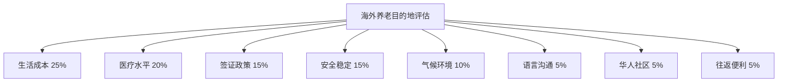
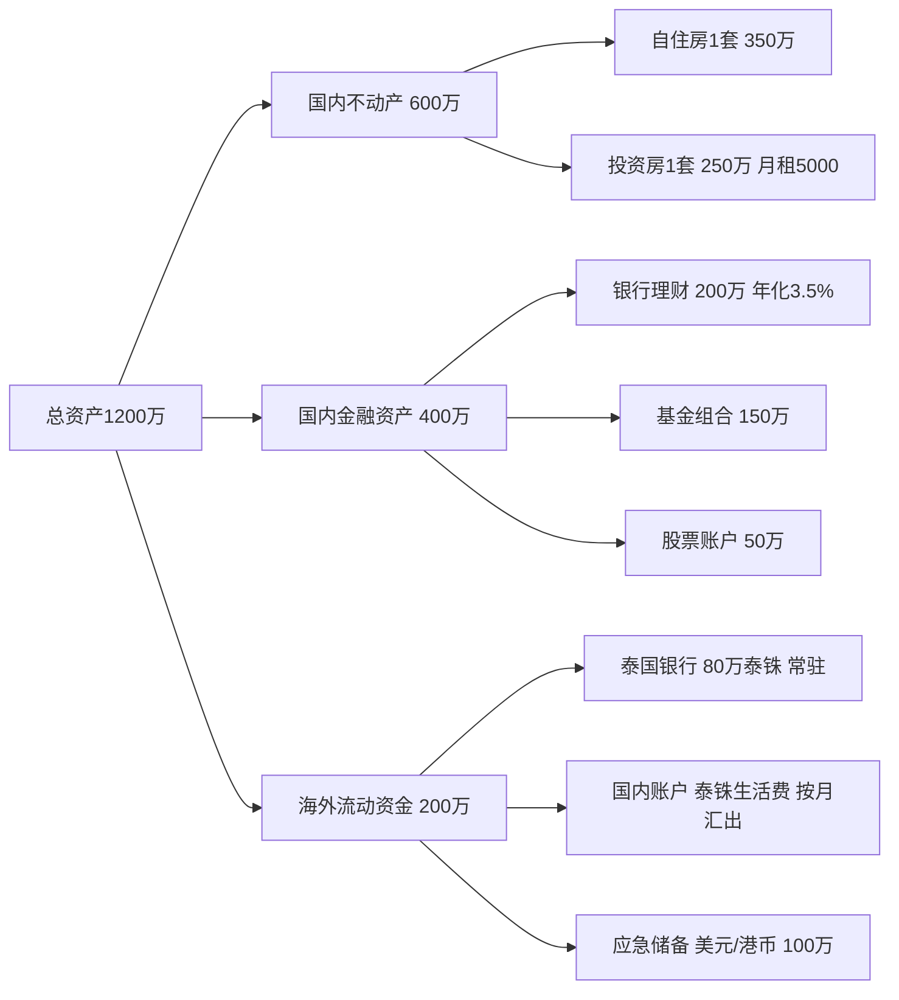

## 案例五：海外养老规划——泰国养老的可行性分析

### 案例背景

赵先生，58岁，退休企业主。退休金加投资收益约30万元/年，妻子55岁，家庭净资产约1200万元，女儿已在加拿大定居。赵先生夫妇身体健康，有基本英语沟通能力，对东南亚文化有一定了解。

赵先生面临的核心矛盾是：国内一线城市生活成本持续攀升，尤其医疗和护理费用增长显著；同时冬天气候寒冷，关节不适加重；女儿远在加拿大，未来可能需要靠近女儿生活。他们希望探索一种既能降低生活成本、又能提升生活质量的养老方式，海外养老进入视野。

### 问题分析：为什么考虑海外养老？

#### 国内养老的成本压力

根据2025年数据，一线城市养老院中档水平月费用约8000-15000元，高端养老社区月费2-5万元。居家养老如需聘请护工，月费用约6000-12000元。加上日常生活开支，一对老年夫妇在一线城市的年支出通常在20-40万元之间。

赵先生夫妇年收入30万元，在国内一线城市生活虽然不至于拮据，但余量有限，一旦遇到大额医疗支出或需要长期护理，财务压力会迅速增大。

#### 海外养老的核心吸引力

海外养老并非"逃避"，而是一种理性的资源配置方式：

- **成本套利**：利用汇率和物价差异，同等生活质量下支出降低40%-70%
- **气候优势**：热带/亚热带地区全年温暖，有利于关节、心血管等老年常见病
- **医疗旅游**：部分东南亚国家医疗水平高、费用低，形成成熟的医疗旅游产业链
- **生活体验**：接触不同文化，保持社交活跃，延缓认知衰退

#### 海外养老的适用人群画像

并非所有人都适合海外养老，以下条件满足越多，可行性越高：

| 条件 | 说明 | 赵先生是否满足 |
|------|------|--------------|
| 经济基础稳定 | 有持续的被动收入（退休金、租金、投资收益），年收入≥15万元 | ✓ 30万/年 |
| 身体状况良好 | 生活能自理，无重大慢性病需频繁就医 | ✓ 夫妇均健康 |
| 语言基础 | 具备基本英语或目的地语言能力 | ✓ 基本英语 |
| 适应能力 | 对异国文化持开放态度，能接受饮食和生活习惯差异 | ✓ 有东南亚旅行经验 |
| 家庭支持 | 配偶愿意同行，子女支持或不在身边 | ✓ 女儿在海外 |
| 有退路 | 国内保留房产和社保，随时可以回国 | ✓ 保留国内资产 |

### 解决方案：四步决策框架

#### 第一步：目标国家系统调研

海外养老目的地选择需要从8个维度系统评估，而非仅看"便宜"或"温暖"。

**评估维度与权重**



**热门目的地深度对比**

| 维度 | 泰国 | 马来西亚 | 葡萄牙 | 加拿大 | 日本 | 越南 |
|------|------|---------|--------|--------|------|------|
| **月生活成本（双人）** | 6000-12000元 | 8000-15000元 | 12000-20000元 | 20000-35000元 | 15000-25000元 | 5000-10000元 |
| **医疗水平** | ★★★★ 私立医院达国际水准 | ★★★☆ 公立一般、私立较好 | ★★★★ 欧洲中上水平 | ★★★★★ 全球顶尖 | ★★★★★ 全球顶尖 | ★★★ 快速发展中 |
| **签证便利性** | 养老签门槛低 | 第二家园门槛中等 | D7签证需被动收入证明 | 需依亲或投资移民 | 经营管理签门槛高 | 签证政策不稳定 |
| **政治稳定性** | ★★★☆ 偶有政局波动 | ★★★★ 稳定 | ★★★★★ 欧盟成员国 | ★★★★★ 高度稳定 | ★★★★★ 高度稳定 | ★★★☆ 体制不同 |
| **气候** | 热带，分雨旱季 | 热带，全年湿热 | 地中海气候，四季温和 | 寒冷，冬季漫长 | 温带，四季分明 | 热带，南部湿热 |
| **语言障碍** | 中等，旅游区英语可通 | 低，华人占23% | 较高，需学葡语 | 低，英法双语 | 中高，需学日语 | 中等，英语普及率低 |
| **华人社区** | 大，曼谷/清迈/芭提雅 | 非常大，槟城/吉隆坡 | 小，里斯本有少量 | 非常大，温哥华/多伦多 | 中等，东京/大阪 | 中等，胡志明市 |
| **往返中国** | 直飞3-5小时 | 直飞4-6小时 | 转机12-18小时 | 直飞10-12小时 | 直飞2-4小时 | 直飞3-4小时 |

**泰国胜出的关键因素**

赵先生最终选择泰国，基于以下综合考量：

1. **养老签证门槛极低**：年满50岁、存款80万泰铢（约16万人民币）即可申请，无需购房、无需投资、无需语言考试
2. **医疗水平被低估**：泰国私立医院（如曼谷医院、Bumrungrad）是亚洲顶级水平，JCI认证医院超过60家，心脏手术、关节置换等费用仅为欧美的1/3-1/5
3. **生活成本极具竞争力**：清迈双人月支出可控制在6000-10000元，包含舒适公寓、外出就餐、交通和娱乐
4. **华人生态成熟**：清迈有大量华人长住社区，中文服务（餐厅、诊所、旅行社）覆盖广泛
5. **距离中国近**：清迈直飞昆明2小时、直飞广州3.5小时，回国探亲非常方便

#### 第二步：泰国养老详细方案

##### 签证办理全流程

泰国针对50岁以上外国人提供"Non-Immigrant O-A签证"（长期养老签证），具体流程如下：

**申请条件**

| 条件 | 具体要求 | 说明 |
|------|---------|------|
| 年龄 | 50周岁及以上 | 以护照出生日期为准 |
| 财务证明 | 泰国银行账户存款≥80万泰铢 | 约16万人民币，需存入后保持2个月以上 |
| 或收入证明 | 月收入≥6.5万泰铢 | 约1.3万人民币，或年收入≥78万泰铢 |
| 健康证明 | 无传染性疾病 | 需在泰国指定医院体检 |
| 无犯罪记录 | 本国无犯罪证明 | 需公证并双认证 |
| 医疗保险 | 住院保额≥40万泰铢，门诊≥4万泰铢 | 必须购买泰国认可的保险 |

**办理流程（时间线）**

```text
第1-2周：准备材料
  ├── 开具无犯罪记录证明（户籍所在地派出所）
  ├── 公证处公证 + 外交部双认证（约1-2周）
  └── 准备银行存款证明

第3周：国内申请签证
  ├── 前往泰国驻华使领馆申请Non-Immigrant O-A签证
  ├── 提交材料：护照、照片、财务证明、健康证明、保险单
  └── 签证费：约1000元，处理时间3-5个工作日

第4周：入境泰国
  ├── 入境后90天内到移民局报到
  ├── 开设泰国银行账户（Bangkok Bank / Kasikorn Bank）
  └── 存入80万泰铢并保持余额

每年续签
  ├── 到期前45天内办理
  ├── 需证明账户余额仍≥80万泰铢
  ├── 每90天到移民局报到一次（可邮寄）
  └── 续签费：1900泰铢/年
```

**注意事项**

- O-A签证首次有效期1年，之后每年续签
- 每90天必须向移民局报到（TM47表格），可本人到场或邮寄
- 签证期间不可在泰国工作
- 如离开泰国再入境，需办理回头签（Re-Entry Permit），单次1000泰铢，多次3800泰铢
- 2024年起泰国推出10年长期养老签证（LTR Visa），门槛更高但免去每年续签麻烦

##### 住宿方案对比

清迈是泰国养老最受欢迎的城市之一，生活成本低于曼谷，气候更凉爽（海拔300米），华人社区成熟。

**清迈住宿选择**

| 类型 | 月租金 | 特点 | 适合人群 |
|------|--------|------|---------|
| 古城内公寓 | 2000-4000元 | 生活便利，步行可达夜市和寺庙，但较嘈杂 | 喜欢热闹、不介意噪音 |
| 古城外公寓（Nimman区域） | 3000-6000元 | 现代化社区，咖啡馆和餐厅密集，年轻人多 | 追求品质生活 |
| 别墅/独栋（Mae Rim/San Sai） | 4000-10000元 | 空间大，有花园，安静，需自驾 | 喜欢安静、有车 |
| 养老社区 | 5000-15000元 | 配套医疗、餐饮、社交活动，有中文服务 | 需要照料或社交 |

赵先生夫妇选择在Nimman区域租住一间50平方米的精装公寓，月租3500元，含游泳池和健身房，步行10分钟有大型超市（Tesco Lotus）和医院（Chiang Mai Ram Hospital）。

##### 生活费用明细

以下为赵先生夫妇在清迈的月度支出实际记录（取6个月平均值）：

| 支出项目 | 月均金额（元） | 说明 |
|---------|--------------|------|
| 房租 | 3500 | 50㎡公寓，含物业费 |
| 餐饮 | 2500 | 自己做饭占60%，外出就餐40% |
| 交通 | 800 | 租摩托车300元 + Grab打车500元 |
| 水电网 | 400 | 电费为主（空调使用） |
| 通讯 | 100 | 泰国电话卡（True/AIS） |
| 日用品 | 500 | 超市采购 |
| 娱乐社交 | 1000 | 咖啡、电影、短途旅行 |
| 医疗保健 | 600 | 常规体检、药品、保健品 |
| 服装 | 200 | 泰国衣物便宜 |
| 杂项 | 400 | 礼物、捐赠、理发等 |
| **合计** | **10000** | **两人总支出** |

年总支出约12万元，加上回国机票（约1万元/年，清迈-昆明往返）和年度体检（约5000元），**年总支出约13.5万元**，仅为国内一线城市同类生活水准的45%-55%。

##### 医疗保障方案

海外养老最让人担忧的是医疗问题。赵先生采用"三层医疗保障"策略：

**第一层：泰国本地医疗保险**

- 购买泰国Luma Health或Pacific Cross的住院保险
- 年保费：约8000-15000元/人（50-60岁）
- 覆盖范围：住院、手术、门诊（部分）、紧急救援
- 推荐保额：住院≥100万泰铢，年度上限≥300万泰铢

**第二层：国内社保保留**

- 继续缴纳国内城镇职工医保（赵先生已满足最低缴费年限）
- 每年回国期间进行年度体检和专科就诊
- 重大疾病可回国治疗，享受国内医保报销

**第三层：国际紧急救援**

- 购买含紧急医疗撤离的旅行保险（如安联全球救援）
- 年费约2000-3000元
- 覆盖紧急情况下转运至最近的高水平医院或回国治疗

**泰国医疗的实际体验**

赵先生在清迈的就医经历：

- **常规体检**：Chiang Mai Ram Hospital，全套体检约1500元（国内同类约4000元），结果当天出，有中文翻译
- **牙科治疗**：种植牙约6000元/颗（国内约12000-20000元），泰国有大量JCI认证牙科诊所
- **中医调理**：清迈有华人开设的中医诊所，针灸推拿约200元/次
- **紧急就医**：拨打1669（泰国急救电话），救护车免费，响应时间约15分钟

#### 第三步：资产安排与资金管理

##### 资产配置策略

海外养老的资产配置核心原则是"国内保底、海外流动"：



##### 跨境汇款方案

| 方式 | 手续费 | 到账时间 | 汇率 | 推荐度 |
|------|--------|---------|------|--------|
| 银行电汇 | 150-300元/笔 | 1-3个工作日 | 银行挂牌价，较差 | ★★★ |
| Wise（原TransferWise） | 约0.5%-1% | 1-2个工作日 | 接近中间价 | ★★★★★ |
| 支付宝国际汇款 | 约50元/笔 | 即时-1天 | 较好 | ★★★★ |
| 泰国ATM取现 | 150泰铢/笔+国内银行手续费 | 即时 | 较差 | ★★ |

赵先生采用方案：每月通过Wise从国内账户汇入2万泰铢到泰国Kasikorn Bank账户，手续费约30元，到账时间1天。大额支出（如年度保险、机票）使用国内信用卡在泰国刷卡支付。

##### 汇率风险管理

泰铢兑人民币汇率波动较大，近5年波幅约±15%。应对策略：

1. **分批换汇**：不一次性换大量泰铢，按季度分批换汇，平滑汇率波动
2. **保留人民币资产**：大部分资产留在国内，仅按需汇出生活费
3. **美元对冲**：在海外账户持有部分美元资产，泰铢贬值时用美元支付
4. **关注汇率窗口**：利用汇率相对低位时多换一些（Wise有汇率提醒功能）

#### 第四步：生活安排与社会融入

##### 年度时间安排

赵先生夫妇的"候鸟式"养老日历：

| 时段 | 地点 | 活动 | 天数 |
|------|------|------|------|
| 1-3月 | 清迈 | 避开国内寒冬，享受清迈凉季（15-28℃） | 90天 |
| 4月 | 回国 | 清明祭扫 + 年度体检 + 亲友聚会 | 30天 |
| 5-7月 | 清迈 | 清迈雨季，物价更低，室内活动为主 | 90天 |
| 8月 | 回国 | 暑假与女儿团聚（女儿从加拿大回国） | 30天 |
| 9-11月 | 清迈 | 雨季尾声，水灯节等节日 | 90天 |
| 12月 | 回国 | 元旦春节前回国，与亲友过年 | 30天 |

全年在泰国约270天，在国内约90天，完美平衡海外生活和国内亲情。

##### 社交圈建设

海外养老最大的挑战不是经济，而是社交和心理适应。赵先生的社交策略：

**华人圈子**

- 加入"清迈华人养老群"（微信群，约500人），定期组织聚餐和短途旅行
- 参加清迈华人协会的活动（春节联欢、中秋聚会等）
- 在古城的华人餐厅和茶馆结识长期居住的华人

**本地社交**

- 在公寓的公共区域（泳池、健身房）与邻居打招呼，建立日常社交
- 参加清迈大学的泰语课程（免费或低价），认识其他外国学员
- 做志愿者：在当地的国际学校教中文，每周2小时

**线上保持**

- 每周与国内亲友视频通话
- 在社交媒体记录清迈生活，保持与国内朋友的连接
- 加入"海外华人养老"论坛，分享经验、获取信息

##### 文化适应与常见挑战

| 挑战 | 具体表现 | 应对方法 |
|------|---------|---------|
| 语言障碍 | 看病、办事、购物时沟通困难 | 学习基础泰语200句；使用Google翻译；找华人中介 |
| 饮食差异 | 泰国菜偏辣偏甜，长期吃不习惯 | 自己做饭为主；清迈有很多中餐馆；带国内调料 |
| 孤独感 | 远离亲友，节日会想家 | 候鸟式安排，每3个月回国一次；积极社交 |
| 文化冲击 | 泰国的"慢慢来"文化，办事效率低 | 调整心态，把"慢节奏"当作享受而非障碍 |
| 法律风险 | 不熟悉泰国法律，容易踩坑 | 咨询律师；不参与任何灰色地带活动 |
| 天气适应 | 4-5月极热（40℃+），雨季出行不便 | 热季开空调；雨季安排室内活动 |

### 风险分析与应对预案

#### 系统性风险

**政治风险**

泰国历史上偶有政局波动（如2014年军事政变），但对外国退休人员的日常生活影响极小。泰国政府将养老产业视为重要收入来源，养老签证政策一直稳定。

应对预案：保留国内居所，确保随时可以回国。关注中国驻清迈总领馆的安全提醒。

**汇率风险**

如前所述，泰铢波动可能增加生活成本。极端情况下（泰铢大幅贬值或升值），需要调整预算。

应对预案：资产分散配置，保留足够的人民币资产作为缓冲。

**医疗风险**

随着年龄增长，医疗需求必然增加。泰国虽然私立医院水平高，但费用也在逐年上涨。

应对预案：三层医疗保障（见上文）。80岁以上如需长期护理，可考虑回国或转至费用更低的地区（如清莱）。

#### 个人风险

**签证政策变化**

泰国养老签证政策总体稳定，但细节可能调整（如存款金额、保险要求）。

应对预案：每年续签前45天关注移民局最新政策；与可靠的签证中介保持联系（费用约3000-5000元/年）。

**家庭变故**

如配偶健康状况恶化需要回国治疗，或女儿需要帮忙带孙辈。

应对预案：候鸟式安排本身就是弹性方案；国内保留自住房；泰国租房而非买房，退出成本低。

**认知能力下降**

75岁以后，认知能力下降可能导致在海外生活困难。

应对预案：提前与女儿沟通长期安排；考虑在70岁以后转入清迈的养老社区（有24小时护理服务）；购买长期护理保险。

### 买房 vs 租房深度分析

很多海外养老者会考虑在泰国购买公寓。赵先生经过详细分析后，决定前期租房、后期再考虑买房。

| 维度 | 租房 | 买公寓 |
|------|------|--------|
| **前期投入** | 押二付一，约1万元 | 清迈公寓30-80万元 |
| **月均成本** | 3000-5000元 | 无月供，但有物业费300-800元/月 |
| **灵活性** | 随时可以换地方或回国 | 卖出需要时间，流动性差 |
| **法律风险** | 低 | 外国人只能买公寓（不能买地/别墅），且外国人持有比例≤49% |
| **升值潜力** | 无 | 清迈公寓年增值约2-4%，低于国内一线城市 |
| **继承问题** | 无 | 外国人持有的泰国房产继承流程复杂 |

**赵先生的结论**：租房的灵活性对"试水期"更重要。在清迈住满3年、确认长期定居意愿后，再考虑购买一套小公寓（30-50万元）作为长期居所。买房预算不超过总资产的5%，不影响整体财务安全。

### 实施结果与数据追踪

赵先生实施3年后的实际状态：

**财务数据**

| 指标 | 国内养老（模拟） | 泰国养老（实际） | 差异 |
|------|----------------|----------------|------|
| 年生活支出 | 25万元 | 13.5万元 | -46% |
| 年医疗支出 | 3万元 | 1.5万元（含保险） | -50% |
| 年总支出 | 28万元 | 15万元 | -46% |
| 资产增值 | 4%（保守） | 5%（国内资产+租金收入） | +1% |
| 年结余 | 2万元 | 15万元 | +13万元 |

3年累计多结余约39万元，这笔钱用于充实应急储备和偶尔的旅行（已去过日本、新西兰、巴厘岛）。

**生活质量数据**

- 体检指标：3年内各项指标稳定或改善（血压从140/90降至130/85，体重减少5公斤）
- 运动频率：从每周1次增至每周5次（游泳、散步、太极）
- 社交活跃度：从"基本宅家"变为"每周至少3次社交活动"
- 心理状态：自评幸福感从6分提升至8.5分（10分制）

**关键转折点**

- 第6个月：度过最初的适应期，开始享受清迈的慢节奏生活
- 第12个月：泰语达到基础交流水平，能独立去市场买菜和看病
- 第18个月：在清迈建立了稳定的社交圈，不再感到孤独
- 第24个月：开始考虑购买公寓，从"体验者"转变为"定居者"
- 第30个月：父亲生病回国照顾3个月，验证了"候鸟式"的灵活性

### 核心启示与决策清单

#### 五个核心启示

1. **海外养老不是"省钱"那么简单**——它是对生活方式的重新设计，成本降低只是附带收益，真正价值在于生活品质的提升
2. **前期调研比前期投入更重要**——花3个月做详细调研（包括短期体验居住），比直接签一年租约更明智
3. **保持退路是最大的安全网**——国内保留房产和社保，泰国租房而非买房，确保任何时候都可以体面地回国
4. **社交是养老质量的核心变量**——无论在哪里养老，没有社交的生活都是贫瘠的，要主动投入精力建设社交圈
5. **医疗规划要趁早**——在身体健康时就建立好医疗保障体系，不要等到生病了才去想

#### 海外养老可行性自测清单

在做出决定前，逐项确认：

- [ ] 年被动收入≥15万元，且有6个月以上的应急储备
- [ ] 身体状况能自理，无需要频繁住院的慢性病
- [ ] 配偶/伴侣愿意同行，且双方对目的地达成共识
- [ ] 国内保留至少1套房产和完整的社保
- [ ] 子女理解并支持，且有紧急联络机制
- [ ] 已到目的地短期体验居住≥2周
- [ ] 了解目的地的签证政策、税务规定和法律风险
- [ ] 已建立或规划好医疗保障方案（本地保险+国内社保+紧急救援）
- [ ] 有基础的目的地语言能力或可靠的翻译服务
- [ ] 心理上准备好了适应新文化、新节奏、新社交圈

如果以上10项中有3项以上不满足，建议暂缓海外养老计划，先补齐短板。

#### 其他热门养老目的地快速指南

如果泰国不是最优选择，以下目的地也值得考虑：

**马来西亚（第二家园计划）**

- 门槛：存款100万林吉特（约155万人民币）或月收入4万林吉特
- 优势：华人占23%，中文沟通无障碍；医疗水平高（吉隆坡有大量JCI医院）；英语通用
- 适合：英语好、不想学新语言、重视华人社区的退休者
- 推荐城市：槟城、吉隆坡、新山

**葡萄牙（D7被动收入签证）**

- 门槛：月被动收入≥760欧元（约6000人民币）
- 优势：欧盟身份，可自由通行申根区；气候温和；医疗水平高；安全稳定
- 适合：想要欧洲生活体验、有欧盟旅行需求的退休者
- 推荐城市：里斯本、波尔图、阿尔加维

**日本（经营管理签证）**

- 门槛：注册资金500万日元（约25万人民币），需有实际经营
- 优势：医疗水平世界顶级；文化相近；治安极好；饮食健康
- 适合：喜欢日本文化、愿意学习日语、有一定经营能力的退休者
- 推荐城市：福冈、大阪、京都

### 常见误区与纠正

| 误区 | 真实情况 |
|------|---------|
| "泰国医疗落后" | 泰国私立医院达到国际水准，JCI认证数量亚洲第二（仅次于印度），心脏手术、关节置换等复杂手术水平很高 |
| "养老签证可以永久居留" | 养老签每年续签，且每90天需报到，不是永居权；如需永居需另外申请 |
| "在泰国买房就可以长期住" | 外国人不能在泰国买地（只能买公寓），且买房不等于获得签证，仍需单独办理养老签 |
| "海外养老很孤独" | 泰国华人社区非常活跃，清迈有大量长期居住的华人，社交机会丰富 |
| "生活成本一定很低" | 曼谷的生活成本接近国内二线城市，只有清迈、清莱等地才有显著的成本优势 |
| "不需要学当地语言" | 基础泰语能让日常生活质量大幅提升，完全依赖英语/中文会限制社交和办事效率 |

***

