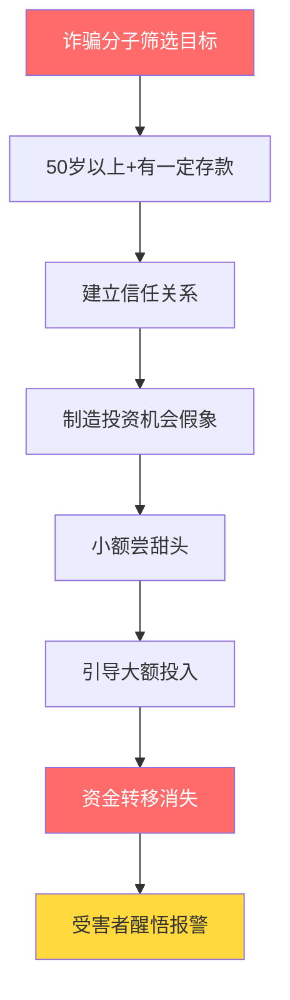
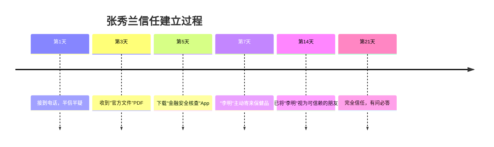
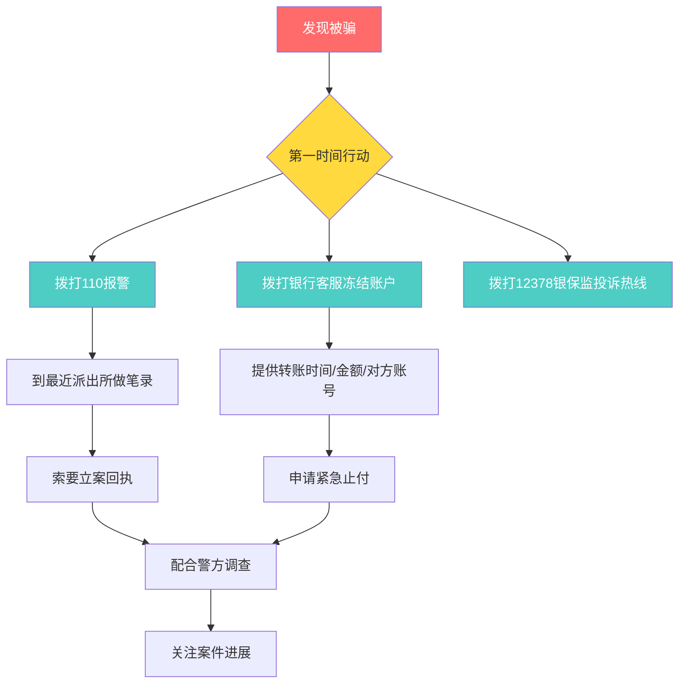

## 案例六：被骗后的教训——一个真实的金融诈骗案例

> 本案例基于真实金融诈骗事件改编，人物信息已做脱敏处理。50岁以上人群是金融诈骗的高发受害群体，了解诈骗全流程和防范要点，是收获期资产保全的第一道防线。

### 案例背景：一位退休教师的遭遇

#### 人物画像

| 项目 | 信息 |
|------|------|
| 姓名 | 张秀兰（化名） |
| 年龄 | 58岁 |
| 职业 | 退休中学教师 |
| 退休金 | 每月6,200元 |
| 家庭状况 | 丧偶，独居，儿子在外地工作 |
| 资产状况 | 存款约45万元，一套自住房产 |
| 投资经验 | 几乎为零，仅买过银行定期存款和国债 |
| 社交特征 | 性格热情，乐于助人，对"权威人士"信任度高 |

#### 为什么50岁以上人群容易成为目标

50岁以上人群被诈骗分子"精准锁定"，并非因为智商不够，而是因为以下结构性因素叠加：

1. **信息不对称**：对新型金融产品和互联网投资渠道了解有限，无法快速辨别真伪
2. **信任惯性**：成长于熟人社会，对"官方身份""专家头衔"的信任度高于年轻一代
3. **孤独缺口**：退休后社交圈缩小，子女不在身边，情感需求容易被利用
4. **资产集中**：一生积蓄往往集中在银行账户中，一旦被骗损失巨大
5. **沉没成本心理**：投入后不愿承认被骗，倾向于继续追加以"挽回损失"

---

### 诈骗全流程还原

#### 第一阶段：精准接触（第1-7天）

2024年3月的一个下午，张秀兰接到一个电话，对方自称是"中国银保监会消费者权益保护中心"的工作人员"李明"，工号"BJ-2024-0837"。

"李明"准确说出了张秀兰的姓名、身份证号前几位、以及她持有的某银行账户信息（这些信息来自此前一次数据泄露）。他声称：

> "张女士，我们在例行检查中发现您名下的一笔定期存款利率存在问题，银行未按规定给您上浮利率，涉及金额补偿约3,200元。银保监会正在集中处理此类问题，请您配合核实。"

**诈骗手法拆解：**

| 手法 | 具体操作 | 心理机制 |
|------|----------|----------|
| 身份伪装 | 冒充银保监会（现已更名金融监管总局），提供工号 | 权威效应：对官方机构天然信任 |
| 信息轰炸 | 准确说出个人信息，制造"正规机构"印象 | 确认偏误：信息越具体越觉得是真的 |
| 利益诱饵 | 3,200元利率补偿，金额不大不小 | 损失厌恶：属于自己的钱不拿白不拿 |
| 紧迫感 | "集中处理""限时办理" | 稀缺效应：怕错过机会 |

张秀兰当时半信半疑，但对方的信息太准确了，她决定"配合核实"。

#### 第二阶段：建立深度信任（第8-21天）

"李明"没有立即索要钱财，而是指导张秀兰：

1. **加了微信**，头像是穿制服的照片，朋友圈转发银保监会的新闻
2. **发来"官方文件"**——一份盖有"中国银保监会"红头的PDF文件，标题是《关于集中清理银行存款利率差的通知》，文件编号、印章一应俱全
3. **要求张秀兰下载一个名为"金融安全核查"的App**，声称是银保监会官方应用，用于"核实账户信息"
4. **每天嘘寒问暖**，聊家常、问身体，甚至在张秀兰提到膝盖不好后，寄了一盒"保健品"到家里

这个App实际上是诈骗团伙定制的仿冒应用，界面与银保监会官网高度相似，但功能是采集用户输入的银行账户、密码、验证码。

**信任建立的关键节点：**

#### 第三阶段：小额甜头（第22-35天）

"李明"告诉张秀兰，利率补偿已审批通过，但需要她先在App中"激活补偿通道"。操作步骤如下：

1. 在App中输入银行卡号和密码
2. 系统显示"补偿金3,200元已到账"（实际是诈骗团伙从其他赃款中转出的真实资金）
3. 张秀兰去银行ATM查询，确实多了3,200元

这笔钱是真的到了账。这正是诈骗最阴险之处——**先给你真的甜头，让你放下所有戒备**。

张秀兰事后回忆："那一刻我彻底相信了，觉得人家是真正在帮我。"

#### 第四阶段：引导大额投资（第36-50天）

取得完全信任后，"李明"话锋一转：

> "张姐，我跟您说个内部消息。银保监会在清理过程中发现，有一批银行不良资产正在打包处置，收益很高，年化能到15%-20%。这是给参与清理工作的内部人员的福利额度，我可以帮您争取一个名额。"

他展示了App中的"资产包"页面：

| 资产包名称 | 投资金额 | 预期年化 | 期限 |
|-----------|----------|----------|------|
| 稳健型A包 | 5万元 | 12% | 30天 |
| 进取型B包 | 20万元 | 18% | 60天 |
| 尊享型C包 | 50万元 | 22% | 90天 |

张秀兰先投了5万元的A包。30天后，App显示收益6,000元，加上本金5.6万元全部"到账"（账面数字，实际已被转走）。

此时张秀兰的心态已经完全转变——从"要不要试试"变成了"这么好的机会不能错过"。

#### 第五阶段：收割（第51-55天）

"李明"告诉张秀兰，C包（50万元）只剩最后两个名额，而且"银保监会马上要关闭这个通道"。张秀兰做了以下操作：

- 取出银行定期存款35万元
- 向儿子借了5万元（谎称装修房子）
- 加上账户中的活期余额，共计投入**42万元**

投入后第3天，App显示"资产包正在处置中，请耐心等待"。

第5天，"李明"的微信显示"对方已不是您的好友"。

App无法登录。

电话打不通。

张秀兰这才意识到——**被骗了**。

---

### 受害者心理变化轨迹

**关键心理节点分析：**

| 阶段 | 心理状态 | 诈骗方操作 | 受害者决策 |
|------|----------|-----------|-----------|
| 初期 | 警惕 | 提供准确个人信息降低戒心 | 决定"听听看" |
| 中前期 | 犹疑 | 寄送实物、日常关怀建立情感连接 | 开始主动联系对方 |
| 中期 | 信任 | 先给真金白银的小额回报 | 主动输入敏感信息 |
| 中后期 | 贪婪+信任 | 制造稀缺感和紧迫感 | 大额投入、借钱投入 |
| 后期 | 震惊+否认 | 失联 | 反复拨打对方电话，不愿报警 |

---

### 事后处置与追讨过程

#### 报警与立案

张秀兰在发现被骗后的第2天才鼓起勇气报警，因为她最初还抱着"可能系统在维护"的幻想。

**报警时间线：**

| 时间 | 操作 | 结果 |
|------|------|------|
| 被骗第2天 | 拨打110报警 | 转接反诈中心 |
| 第3天 | 到派出所做笔录 | 立案侦查，案号登记 |
| 第5天 | 银行协助冻结部分账户 | 仅追回2.3万元（已转出大部分资金） |
| 第30天 | 警方通报 | 诈骗团伙在境外，追回难度极大 |
| 第180天 | 案件进展 | 主要嫌疑人被抓获，但资金已挥霍大部分 |

**最终追回金额：约4.7万元，损失约37.3万元。**

#### 张秀兰面临的连锁损失

| 损失类型 | 具体内容 | 金额/影响 |
|----------|----------|-----------|
| 直接经济损失 | 投入资金无法追回 | 约37.3万元 |
| 信用损失 | 向儿子借款无法归还，家庭关系紧张 | 亲情裂痕 |
| 心理创伤 | 焦虑、失眠、自我否定，持续半年以上 | 需要心理疏导 |
| 机会成本 | 原计划的旅游、学习等退休生活被迫取消 | 生活质量下降 |
| 社会关系 | 觉得丢人，减少社交活动 | 孤立化加剧 |

---

### 诈骗手法深度拆解

#### 本案例中使用的六种核心骗术

**1. 权威身份伪装**

诈骗分子不仅冒充银保监会，还精心构建了一整套"证据链"：

- 红头文件PDF（伪造公章、文号）
- 仿冒App（高仿银保监会官网界面）
- 制服照片（用于微信头像和朋友圈）
- 工号和座机号码（座机通过VoIP改号实现）

**辨别要点：** 正规金融监管机构绝不会通过电话要求个人下载App、提供银行卡密码或进行转账操作。银保监会（现金融监管总局）的官方App只有"金融监管"一个，且仅用于信息查询，不具备任何资金操作功能。

**2. 精准个人信息获取**

诈骗分子能说出张秀兰的姓名、身份证号、银行卡号等信息，来源可能是：

- 暗网购买的泄露数据（一条完整个人信息售价0.5-5元）
- 之前参与过的问卷调查、免费体检等活动中的信息收集
- 快递面单、银行对账单等纸质信息的翻拍

**3. 先给甜头再收割**

3,200元的"利率补偿"和5万元投资的6,000元收益，都是诈骗团伙从赃款中拨出的"诱饵资金"。从ROI角度看，诈骗团伙用不到1万元的诱饵，换来了42万元的收割——投入产出比超过40倍。

**4. 情感操控**

"李明"每天嘘寒问暖、寄送保健品、关心张秀兰的身体状况，这些都不是闲聊，而是标准的"情感养猪"手法。诈骗培训教材中明确要求：

- 前7天只聊家常，不谈钱
- 记住目标的生日、喜好、家人情况
- 在目标遇到困难时主动提供帮助
- 制造"只有我才真心关心你"的依赖感

**5. 沉没成本锁定**

当张秀兰投入5万元后，即使产生过怀疑，也很难抽身——因为承认被骗意味着"5万元白亏了"。诈骗分子正是利用这种心理，在第一笔投资"成功"后迅速引导追加。

**6. 稀缺与紧迫**

"最后两个名额""马上关闭通道"——这些话术的目的是压缩受害者的理性思考时间。当人处于紧迫状态时，大脑会切换到直觉决策模式，跳过风险评估。

---

### 被骗后的正确处置流程

如果不幸遭遇金融诈骗，以下是经过验证的最佳处置流程：

**关键时间节点：**

| 时间窗口 | 可执行操作 | 追回概率 |
|----------|-----------|----------|
| 转账后30分钟内 | 银行紧急止付 | 60%-80% |
| 转账后2小时内 | 银行账户冻结 | 30%-50% |
| 转账后24小时内 | 报警+银行协查 | 10%-30% |
| 转账后72小时 | 资金可能已多层转移 | <10% |
| 超过7天 | 资金基本已出境或变现 | <5% |

**黄金30分钟操作清单：**

1. **立即拨打银行客服电话**（工行95588、建行95533、农行95599等），要求对涉及账户进行"紧急止付"
2. **拨打110报警**，说明是电信诈骗，要求转接反诈中心
3. **保留所有证据**：聊天记录、转账凭证、对方电话号码、App截图
4. **不要删除任何通信记录**，包括通话录音、短信、微信消息
5. **通知银行挂失涉及的银行卡**，防止二次损失

---

### 金融诈骗的常见类型与识别方法

#### 针对50岁以上人群的六大诈骗类型

| 诈骗类型 | 典型话术 | 识别特征 | 近年发案趋势 |
|----------|----------|----------|-------------|
| 冒充公检法 | "你涉嫌洗钱/犯罪" | 要求转账到"安全账户" | 持续高发 |
| 虚假投资理财 | "保本保息，年化20%+" | 承诺固定高收益 | 快速增长 |
| 冒充亲友 | "我是你儿子/女儿，急需用钱" | 紧急、不让你核实 | 传统高发 |
| 以房养老骗局 | "把房子抵押，每月领养老金" | 要求办理房产抵押 | 新型高发 |
| 保健品/收藏品诈骗 | "这个有收藏价值，会升值" | 夸大产品价值 | 长期存在 |
| 杀猪盘 | 网恋后引导投资 | 感情+投资组合拳 | 爆发式增长 |

#### 防骗核心口诀

**"三不一多"原则：**

- **不轻信**：不轻信来历不明的电话和信息
- **不透露**：不向陌生人透露个人身份信息、银行账户、验证码
- **不转账**：不向陌生人转账汇款
- **多核实**：遇到涉及钱财的事情，先通过官方渠道核实

**"六个一律"：**

1. 接到陌生电话谈到银行卡的，一律挂掉
2. 谈到"电话转接公检法"的，一律挂掉
3. 要求点击链接的短信，一律删除
4. 微信陌生人发来的链接，一律不点
5. 提到"安全账户"的，一律是诈骗
6. 要求提供验证码的，一律拒绝

---

### 家庭防诈体系搭建

#### 子女可以做什么

| 行动 | 具体做法 | 频率 |
|------|----------|------|
| 信息同步 | 告知父母近期高发诈骗手法 | 每月至少1次 |
| 技术辅助 | 在父母手机安装"国家反诈中心"App | 一次性+定期检查 |
| 设立"冷静机制" | 约定超过5,000元的支出必须先电话确认 | 长期执行 |
| 定期查账 | 帮助父母定期查看银行流水，发现异常 | 每季度1次 |
| 情感陪伴 | 增加通话和探望频率，减少孤独感 | 每周至少2次通话 |

#### 个人防诈检查清单

在做任何涉及资金的操作前，逐条核对：

- [ ] 对方是否主动联系你？（主动联系的"好事"99%是骗局）
- [ ] 对方是否要求保密？（正规机构不会要求你对家人保密）
- [ ] 是否承诺固定高收益？（年化超过6%就要高度警惕）
- [ ] 是否要求下载非官方渠道的App？（只从应用商店下载）
- [ ] 是否要求提供短信验证码？（验证码=密码，绝不能给）
- [ ] 是否制造紧迫感？（"限时""最后机会"是经典话术）
- [ ] 是否可以和家人商量？（如果对方说"不能告诉别人"，100%是骗局）

---

### 法律救济途径

#### 受害者可采取的法律行动

| 途径 | 适用情形 | 操作方式 | 预期效果 |
|------|----------|----------|----------|
| 刑事报案 | 确定被诈骗 | 携带证据到派出所报案 | 追究诈骗者刑事责任 |
| 民事诉讼 | 知道诈骗者身份信息 | 向法院提起民事赔偿诉讼 | 追回经济损失 |
| 银行投诉 | 银行未尽到提醒义务 | 拨打12378或到银保监投诉 | 可能获得部分赔偿 |
| 法律援助 | 经济困难无力聘请律师 | 到当地法律援助中心申请 | 免费法律服务 |

#### 关键法律条文

- **《刑法》第266条**：诈骗公私财物，数额较大的，处三年以下有期徒刑、拘役或者管制，并处或者单处罚金；数额巨大或者有其他严重情节的，处三年以上十年以下有期徒刑；数额特别巨大的，处十年以上有期徒刑或者无期徒刑。
- **《反电信网络诈骗法》（2022年12月1日施行）**：明确了电信运营商、银行、互联网平台的反诈义务，受害者有权要求相关机构配合追回资金。

---

### 张秀兰的重建之路

#### 经济重建

| 阶段 | 时间 | 措施 |
|------|------|------|
| 紧急止损 | 被骗当月 | 冻结所有银行卡，更换新卡，修改所有密码 |
| 开源节流 | 1-6个月 | 减少不必要开支，利用教师特长做线上辅导 |
| 稳健理财 | 6个月后 | 将剩余资金分散存入不同银行定期，不再追求高收益 |
| 长期规划 | 1年后 | 重新制定退休生活计划，适当降低预期 |

#### 心理重建

张秀兰在社区心理咨询师的帮助下，经历了以下心理恢复过程：

1. **接受阶段**（1-2个月）：承认被骗的事实，停止自责
2. **倾诉阶段**（2-4个月）：向信任的亲友讲述经历，卸下心理包袱
3. **学习阶段**（4-6个月）：主动学习防诈知识，参加社区防诈讲座
4. **助人阶段**（6个月后）：在社区做防诈志愿者，用自己的经历帮助他人

> 张秀兰后来在社区防诈讲座上说："我不再觉得丢人。如果我的经历能让哪怕一个人不被骗，那这37万就没有白亏。"

---

### 本案例的核心教训

#### 五个"永远记住"

1. **永远记住：天上不会掉馅饼。** 年化收益超过银行存款利率3倍以上的投资，都要打一个大大的问号。
2. **永远记住：正规机构不会电话要密码。** 任何通过电话、短信、微信索要银行卡密码和验证码的，都是骗子。
3. **永远记住：先给甜头是要钓大鱼。** 如果一个"投资"让你先赚了钱，这恰恰是最危险的信号。
4. **永远记住：拿不准的事先问家人。** 诈骗分子最怕你跟别人商量，因为他们的话经不起推敲。
5. **永远记住：被骗不丢人，不报警才丢人。** 及时报警是保护自己和他人最好的方式。

#### 给50岁以上读者的资产保全建议

| 建议 | 具体做法 | 理由 |
|------|----------|------|
| 分散存放 | 不同银行、不同产品、不同期限 | 单点损失可控 |
| 设立家庭联签 | 大额支出需配偶或子女确认 | 增加一道安全阀 |
| 定期审计 | 每季度检查银行流水和投资账户 | 及早发现异常 |
| 保持学习 | 关注金融监管部门发布的风险提示 | 提升辨别能力 |
| 安装反诈工具 | 国家反诈中心App、开通银行动账提醒 | 技术辅助防护 |

---

### 附录：实用防诈资源

| 资源 | 联系方式 | 功能 |
|------|----------|------|
| 全国反诈专线 | 96110 | 预警劝阻、咨询举报 |
| 报警电话 | 110 | 遭遇诈骗立即报警 |
| 银保监投诉热线 | 12378 | 银行保险相关投诉 |
| 国家反诈中心App | 各应用商店搜索下载 | 来电预警、身份核验 |
| 12321举报中心 | www.12321.cn | 举报诈骗电话和短信 |
