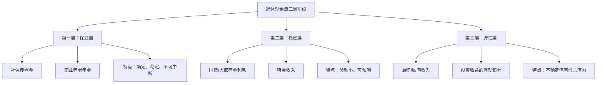
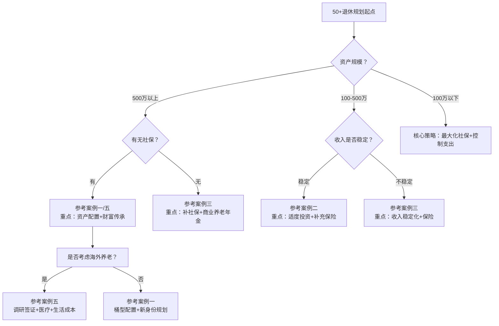

## 案例总结与启示

前面六个案例覆盖了50岁以上人群最常见的退休财务场景：高收入企业高管、普通工薪族、自由职业者、退而不休的创业者、海外养老者，以及遭遇金融诈骗的受害者。每个案例都有独特的处境和解法，但放在一起看，会发现一组贯穿所有案例的共同规律。本章将这些规律提炼为可复用的决策框架，帮助你在自己的退休规划中少走弯路。

### 六个案例的横向对比

先把六个案例的关键数据拉到同一张表上，才能看出规律。

| 维度 | 案例一：高管 | 案例二：工薪族 | 案例三：自由职业 | 案例四：创业 | 案例五：海外养老 | 案例六：诈骗教训 |
|------|------------|-------------|---------------|------------|---------------|---------------|
| 年龄 | 56岁 | 53岁 | 55岁 | 55岁 | 58岁 | 50+ |
| 退休前收入 | 120万/年 | 9.6万/年 | 20-30万/年 | — | 30万/年(退休后) | — |
| 净资产 | 1800万 | 280万 | 500万 | — | 1200万 | — |
| 核心问题 | 收入断崖、身份落差 | 收入有限、投资盲区 | 无社保、收入不稳 | 退休空虚、需要价值感 | 生活成本、跨境规划 | 贪念、信息不对称 |
| 解法核心 | 资产配置重构+新身份 | 量入为出+适度投资 | 补社保+商业保险 | 二次创业+技能变现 | 降成本+国际视野 | 风险识别+止损 |
| 退休后年收入 | 54万 | 10.8万 | 20万 | 14.4万 | 30万 | — |
| 年支出 | 38万 | 7万 | 12万 | — | 12万 | — |
| 年结余 | 16万 | 3.8万 | 8万 | — | 18万 | — |

从这张表中可以提炼出几个关键发现。

**发现一：收入替代率是核心指标。** 案例一的高管退休后收入仅为退休前的33%，但通过资产重配和独立董事收入，最终达到了40%。案例二的工薪族退休后收入替代率为72%，反而更从容。这说明绝对金额不等于安全感，收入替代率和支出弹性才是关键。

**发现二：资产配置调整是所有案例的共同动作。** 不管是1800万还是280万，所有人都需要重新审视自己的资产配置。高资产人群的问题是过度集中在房产，中等资产人群的问题是过度集中在存款。方向不同，但"需要调整"这个结论完全一致。

**发现三：现金流比资产总值更重要。** 案例二的刘阿姨净资产只有280万，但因为建立了稳定的现金流（养老金+兼职+投资收益），生活得非常从容。案例一的王志远净资产1800万，但如果只看资产总值不做现金流规划，退休后反而可能入不敷出。

### 从案例中提炼的七条核心原则

#### 原则一：先测算，再行动——用数据代替直觉

六个案例中最成功的三个（案例一、二、五），无一例外都做了详细的退休收入测算。最失败的案例六，正是因为没有理性分析就盲目追求高收益。

退休收入测算的核心公式：

```text
退休收入缺口 = 退休后年支出 - 退休后年收入
需要补充的资金总额 = 退休收入缺口 × 预期退休年数 × (1 + 通胀系数)
```

具体步骤：

第一步，列出退休后的所有收入来源。社保养老金可以通过当地社保局官网或12333热线查询预估金额。企业年金咨询单位人事部门。租金收入按当前水平估算。投资收益按保守的3%-4%年化估算。

第二步，列出退休后的所有支出项目。将支出分为三类：刚性支出（吃住行、水电、基本医疗）、弹性支出（旅游、社交、爱好）、应急支出（大病、意外、子女求助）。刚性支出是底线，弹性支出可以压缩，应急支出需要专项储备。

第三步，计算缺口。如果缺口为正（收入大于支出），恭喜你，只需做好资产保全。如果缺口为负，你需要计算需要额外准备多少钱，以及在退休前的剩余工作年限里如何积累这笔钱。

一个实用的速算法：如果退休后年缺口为5万，预期退休30年，按3%通胀调整，大约需要准备250-300万的补充资金。这个数字看起来吓人，但如果还有10年退休，每月定投1.5万到年化5%的投资组合中，就可以实现。

#### 原则二：建立三层现金流防线

所有成功案例都建立了多层现金流结构，而不是依赖单一收入来源。归纳为"三层防线"模型：

第一层防线是保底层——社保养老金和商业养老年金。这一层的特点是确定性强，不受市场波动影响，金额虽小但稳定可靠。案例三的张建国通过补缴社保+购买商业养老年金，建立了每月约3800元的保底收入。

第二层防线是稳定层——低风险投资收益和租金收入。国债利息、大额存单利息、房租收入都属于这一层。案例一的王志远通过"桶型配置"，确保了每年约21万的稳定投资收益和租金收入。

第三层防线是弹性层——兼职收入、顾问费、创业收入。这一层金额不确定，但可以显著改善生活品质。案例一做独立董事年入15万，案例二做兼职会计年入3万，案例三做摄影教学年入10万。金额不同，但作用相同——弥补前两层的不足，同时保持社会参与感。



#### 原则三：资产配置必须因年龄而变

50岁以后的资产配置和30岁时完全不同。年轻时可以承受大起大落，因为时间站在你这边。但50岁以后，时间变成了你的敌人——一次重大亏损可能需要5-8年才能恢复，而你距离退休可能只有5-10年。

案例一的王志远在退休前就开始调整配置，采用了"桶型配置"策略。这个策略的核心思想是：把钱按用途分成不同的"桶"，每个桶的投资期限和风险等级不同。

| 桶 | 用途 | 金额 | 投资期限 | 配置品种 | 风险等级 |
|---|------|------|---------|---------|---------|
| 第一桶 | 3年生活费 | 180万 | 0-3年 | 货币基金、短期国债 | 极低 |
| 第二桶 | 中期资金 | 420万 | 3-10年 | 中长期国债、高等级债券基金 | 低 |
| 第三桶 | 长期资金 | 300万 | 10年以上 | 高股息股票、REITs、指数基金 | 中 |

这个策略的精妙之处在于：第一桶的钱随时可用，即使市场暴跌也不需要割肉卖股票。第二桶的钱追求稳定收益，跑赢通胀即可。第三桶的钱才去承担风险，争取长期增值。三桶之间定期再平衡——如果股市大涨，从第三桶卖出一部分充入第一桶和第二桶；如果股市大跌，不动第一桶和第二桶，第三桶自然会恢复。

一个更保守的替代方案是"债券阶梯"——将资金分散买入1年期、3年期、5年期、7年期、10年期的国债，每年都有债券到期，到期后根据当时的利率环境决定是续买还是使用。这种方式几乎零风险，适合极度厌恶风险的人群。

#### 原则四：社保是地基，能优化就优化

社保养老金是50+人群最重要的收入来源，但大多数人对社保政策知之甚少，导致白白损失了本可以拿到的养老金。

从案例中提炼的社保优化要点：

**缴费年限优化。** 养老金计算中，缴费年限是最重要的变量。每多缴1年，基础养老金增加约1%。如果你55岁时缴费年限为25年，再缴5年到60岁退休，基础养老金可以从25%的社平工资提高到30%，差距显著。案例二的刘阿姨就是通过延迟2年退休来增加缴费年限的。

**缴费基数优化。** 在职人员的缴费基数直接影响退休后的养老金。如果你的工资高于社平工资的60%，按实际工资缴纳是最优选择。灵活就业人员可以选择按60%下限缴纳（省钱）或按100%缴纳（多领），需要根据自身经济状况权衡。案例三的张建国以灵活就业身份参保，选择了适中的缴费档次。

**异地转移接续。** 如果你在多个城市工作过，一定要在退休前将各地社保关系转移合并到退休地。不同地区的社平工资差异巨大——同样缴费30年，在上海退休可能每月领6000元，在三线城市可能只有3000元。转移的时间窗口通常在退休前6-12个月，过早或过晚都可能产生麻烦。

**个人养老金账户。** 自2022年11月起，中国推出了个人养老金制度，每年最高缴存12000元，享受税收优惠（缴存时抵扣个税，领取时按3%税率）。对于边际税率高于3%的50+人群，这是一个确定性的收益。案例中虽然没有专门提到，但这是一个值得所有50+人群关注的工具。

#### 原则五：保险是最后的安全网，但要买对

五个正面案例中，每个都提到了保险配置。保险在50+人群中的角色不是投资增值，而是风险转移——把你自己承担不起的大额风险（重大疾病、意外伤残、长期护理）转移给保险公司。

50+人群的保险配置优先级：

| 优先级 | 险种 | 年保费参考 | 核心作用 | 购买注意事项 |
|-------|------|----------|---------|------------|
| 最高 | 百万医疗险 | 1000-3000元 | 覆盖大额医疗费用 | 注意续保条件，选择保证续保的产品 |
| 高 | 意外险 | 200-500元 | 覆盖意外伤残和医疗 | 注意年龄上限，多数产品65岁后不可续保 |
| 中 | 长期护理险 | 2000-5000元 | 覆盖失能后的护理费用 | 新兴险种，产品选择有限，但趋势向好 |
| 低 | 重疾险 | 8000-20000元 | 确诊即赔 | 50岁后保费极高，杠杆率低，不推荐新购 |

案例二的刘阿姨在53岁时咨询了重疾险，发现年保费高达1.5万以上，保额只有20万，果断放弃，转而用百万医疗险+意外险的组合。这个判断非常理性——50岁以后买重疾险，保费占保额的比例过高，不如把钱存起来当自保基金。

一个容易忽视的险种是长期护理险。随着中国老龄化加速，长期护理险正在全国试点推广。对于50+人群，失能风险不是小概率事件——据中国老龄科学研究中心数据，65岁以上老年人中，约有18%存在不同程度的失能。一旦失能，护理费用每月可达5000-15000元，是很多家庭难以承受的重负。

#### 原则六：防范诈骗是最好的"投资"

案例六虽然内容尚待补充，但它揭示了一个残酷的现实：50+人群是金融诈骗的重灾区。这不是因为50+人群"笨"，而是因为他们恰好处于"有钱、有信任感、信息更新慢"的三重弱势中。

根据公安部和银保监会的数据，50岁以上人群遭遇金融诈骗的几个典型模式：

**模式一：高收益理财骗局。** 承诺年化收益15%-30%，远超市场合理水平。常见包装有"养老项目""政府工程""海外基金"。核心识别方法：任何承诺年化收益超过8%且声称"保本保息"的产品，几乎都可以判定为骗局。

**模式二：以房养老骗局。** 骗子以"以房养老"为名，诱导老人将房产抵押获取贷款，贷款资金被骗子卷走，老人不仅失去房子还背上债务。核心识别方法：正规的"以房养老"反向抵押贷款只有少数保险公司和银行有资质办理，绝不会通过个人或小公司操作。

**模式三：亲情诈骗。** 冒充子女、孙辈打电话称急需用钱，或冒充公检法称涉嫌犯罪需要"安全转账"。核心识别方法：接到任何要求转账的电话，先挂断，用自己存的号码回拨确认。

**模式四：保健品/养老投资骗局。** 通过免费体检、免费旅游等方式接近老年人，推销高价保健品或养老院预付费产品。核心识别方法：任何需要"先交大钱再享受服务"的养老产品，都需要反复核实。

防诈骗的核心心法只有三条：第一，天上不会掉馅饼，高收益必然高风险；第二，任何要求你"保密"不让家人知道的投资，100%有问题；第三，不确定的事情，先跟子女或信任的朋友商量，不急于当场决定。

#### 原则七：退休是新起点，不是终点

五个正面案例中最成功的共同特征是：当事人没有把退休当作人生的终点，而是当作新阶段的起点。案例一的王志远找到了独立董事的新身份，案例二的刘阿姨发展了兼职和社交，案例三的张建国转型为摄影教学，案例五的赵先生开启了海外新生活。

退休后"无所事事"的代价远超想象。世界卫生组织的研究显示，退休后缺乏社交和目标感的人群，认知衰退速度比保持活跃的人群快40%，患抑郁症的概率高出2-3倍。从财务角度看，抑郁和认知衰退会导致医疗支出大幅增加，远超提前预防的成本。

因此，"退休生活规划"不是一个可选的附加项，而是退休财务规划的有机组成部分。你需要在退休前2-3年开始思考：我退休后每天做什么？和谁在一起？我的价值感来自哪里？这些问题的答案，直接影响你需要多少钱（忙碌的人花钱少，空虚的人花钱多），也直接影响你能活多久（有目标感的人平均多活7-10年）。

### 不同人群的决策路径

基于六个案例，可以为不同类型的50+人群梳理出几条典型的决策路径。



**高资产人群（净资产500万以上）：** 核心任务是资产配置优化和财富传承。你需要关注的不是"够不够花"，而是"如何安全地传递给下一代"。参考案例一的桶型配置和本书财富传承章节的内容。特别注意：高资产人群更容易成为金融诈骗的目标，因为你有钱且可能有"投资"的意愿。

**中等资产人群（净资产100-500万）：** 核心任务是现金流管理和社会保障优化。你需要在有限的资源中找到最优的配置方案。参考案例二的"量入为出"和案例三的"补社保+商业保险"。特别注意：不要因为焦虑而盲目追求高收益，稳定的4%-5%年化收益远比冒险的15%更安全。

**低资产人群（净资产100万以下）：** 核心任务是最大化社保收益和控制支出。社保养老金是你的生命线，必须确保缴费年限和缴费基数都达到最优。同时严格控制支出，把每一分钱都花在刀刃上。参考案例二的方案，但要更激进地压缩弹性支出。特别注意：不要因为资产少就放弃规划——越是资源有限，越需要精密的规划。

**无社保人群：** 这是最需要紧急行动的群体。参考案例三的张建国，立即以灵活就业身份开始缴纳社保。如果已经超过法定退休年龄但缴费不满15年，可以咨询当地社保局是否允许一次性补缴。同时配置商业养老年金作为替代。特别注意：无社保意味着完全自费医疗，百万医疗险是绝对必须配置的。

### 常见误区复盘

将六个案例中出现的和隐含的误区整理为对照表，帮助你自查和纠偏。

| 误区 | 正确做法 | 出现案例 | 后果 |
|------|---------|---------|------|
| 退休后把所有钱存银行 | 分层配置，跑赢通胀 | 案例二(初期) | 20年后购买力缩水45% |
| 房产占总资产比例过高 | 适当减持房产，增加流动性 | 案例一(初期) | 急需用钱时无法变现 |
| 追求高收益忽视风险 | 8%以上收益要高度警惕 | 案例六 | 本金全部损失 |
| 50岁后不买保险 | 百万医疗险+意外险必备 | — | 一场大病可能清空积蓄 |
| 退休后无所事事 | 提前培养兴趣和社交圈 | — | 认知衰退+抑郁+医疗费增加 |
| 过早把财产过户给子女 | 保留控制权，用信托/保险传承 | — | 失去经济自主权 |
| 忽视社保优化 | 延迟退休/提高基数/转移合并 | 案例二(初期) | 每月少领数百至数千元 |
| 海外养老不做实地调研 | 先短住3-6个月再决定 | — | 水土不服、语言障碍 |

### 行动清单：退休前的最后冲刺

不管你处于50+的哪个阶段，以下清单都值得逐项检查。打勾表示已完成，未打勾的就是你需要立即行动的事项。

**财务基础（退休前2-3年完成）：**

- [ ] 完成退休收入测算，明确收入缺口金额
- [ ] 盘点所有资产和负债，计算真实净资产
- [ ] 确认社保缴费年限和预估养老金金额
- [ ] 评估房产占总资产比例，超过70%需考虑减持
- [ ] 建立2-3年生活费的应急资金（货币基金）

**保障体系（任何时候开始都不晚）：**

- [ ] 百万医疗险已配置且保证续保
- [ ] 意外险已配置
- [ ] 评估是否需要长期护理险
- [ ] 确认医保缴费年限达标
- [ ] 如无社保，已开始以灵活就业身份缴纳

**投资配置（退休前1-2年调整到位）：**

- [ ] 建立"桶型配置"或"债券阶梯"
- [ ] 投资组合中高风险资产比例不超过20%-30%
- [ ] 设置再平衡规则（偏离目标5%即调整）
- [ ] 消除所有高收益承诺的"理财产品"

**传承规划（退休前开始，持续更新）：**

- [ ] 已起草或更新遗嘱
- [ ] 已指定遗嘱执行人
- [ ] 已明确保险受益人
- [ ] 已与家人进行财务沟通

**生活规划（退休前2年开始）：**

- [ ] 已确定退休后的居住安排
- [ ] 已培养至少2个兴趣爱好
- [ ] 已建立退休后的社交网络
- [ ] 已规划退休后的"工作"（兼职、顾问、志愿服务）

### 最后的忠告

六个案例、七条原则、一张行动清单——这些都是工具，不是答案。真正的答案在你自己的生活中。

50岁以后，你已经走过了人生的大半程。你经历过经济周期的起落，见证过行业的兴衰，积累了丰富的人生阅历。这些都是年轻人无法比拟的优势。退休规划的本质不是和数字较劲，而是想清楚一个问题：**我想要什么样的后半生？**

如果你想要一个安稳的后半生，那就做好现金流管理和风险控制。如果你想要一个精彩的后半生，那就在此基础上加上新身份和新体验。如果你想要一个有意义的后半生，那就再加上传承和贡献。

但不管选择哪种后半生，有一件事是共同的：**现在就开始行动。** 退休规划最可怕的敌人不是市场下跌、不是政策变化、不是通货膨胀——而是拖延。每多拖一天，你就少一天的准备时间，而时间是你最稀缺的资源。

正如案例二中刘阿姨说的那句话："退休不可怕，可怕的是退休了还不知道自己要什么。" 知道自己要什么，然后用本书提供的工具去实现它——这就是50+退休规划的全部。

***

> **本节小结：** 六个案例揭示了50+退休规划的七条核心原则——先测算再行动、建立三层现金流防线、因年龄调整资产配置、优化社保、合理配置保险、防范诈骗、把退休当新起点。不同资产水平的人群有不同的决策路径，但核心逻辑一致：用数据代替直觉，用制度代替运气，用行动代替焦虑。
