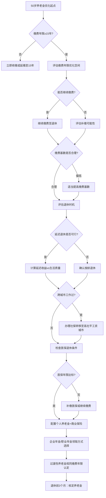

## 社保养老金优化的六个核心技巧

社保养老金是绝大多数中国人退休后最核心、最稳定的收入来源。对于50岁以上的人群而言，距离退休仅有5-15年时间窗口，社保缴费的每一个决策——多缴一年还是少缴一年、按什么基数缴、何时退休、在哪里退休——都会直接影响未来20-30年每月到手的养老金金额。优化社保不是"差不多就行"的事情，差一年缴费可能意味着终身少拿数万元。

本节从养老金的计算原理出发，系统梳理六个可操作的优化技巧，帮助你在退休前的最后窗口期最大化养老金收益。

### 养老金计算的底层原理

要优化养老金，首先必须理解它的计算方式。很多人缴了二三十年社保，却从未搞清楚自己的养老金到底是怎么算出来的。只有理解公式，才能找到优化空间。

#### 中国城镇职工养老金的三部分构成

2024年起，中国城镇职工基本养老金由三部分组成：

| 组成部分 | 适用人群 | 计算方式 |
|---------|---------|---------|
| **基础养老金** | 所有参保人 | 与社平工资、缴费年限、缴费指数挂钩 |
| **个人账户养老金** | 所有参保人 | 个人账户储存额 ÷ 计发月数 |
| **过渡性养老金** | 1997年前参加工作的"中人" | 与视同缴费年限、过渡系数挂钩 |

#### 基础养老金计算公式

基础养老金 = 退休时当地上年度社平工资 ×（1 + 本人平均缴费工资指数）÷ 2 × 缴费年限 × 1%

拆解这个公式，有四个关键变量：

**变量一：当地社平工资。** 这是你退休时所在城市的上年度全口径城镇单位就业人员平均工资。2023年各主要城市数据：北京约13,930元/月、上海约13,692元/月、深圳约13,730元/月、广州约12,650元/月、杭州约11,830元/月、成都约10,560元/月。社平工资越高的城市退休，基础养老金越高——这是选择退休城市的重要考量。

**变量二：本人平均缴费工资指数。** 这是你历年缴费基数与当年社平工资之比的平均值。按最低基数（社平工资的60%）缴费，指数为0.6；按实际工资缴费，指数取决于你的收入水平；按最高基数（社平工资的300%）缴费，指数为3.0。这个指数直接影响基础养老金的计算基数。

**变量三：缴费年限。** 包括实际缴费年限和视同缴费年限（1997年前的连续工龄）。每多缴一年，基础养老金增加1个百分点。这是最容易优化的变量——多工作一年，养老金就多一份。

**变量四：1%的系数。** 这是法定系数，个人无法改变。

#### 个人账户养老金计算公式

个人账户养老金 = 个人账户储存额 ÷ 计发月数

**个人账户储存额** 是你历年缴费中划入个人账户的部分（目前为缴费基数的8%）及其累计利息。这笔钱完全属于你个人，去世后可以由继承人继承。

**计发月数** 根据退休年龄确定，由国务院统一规定。以下是完整对照表：

| 退休年龄 | 计发月数 | 退休年龄 | 计发月数 |
|---------|---------|---------|---------|
| 40岁 | 233 | 56岁 | 164 |
| 41岁 | 230 | 57岁 | 158 |
| 42岁 | 226 | 58岁 | 152 |
| 43岁 | 223 | 59岁 | 145 |
| 44岁 | 220 | 60岁 | 139 |
| 45岁 | 216 | 61岁 | 132 |
| 46岁 | 212 | 62岁 | 125 |
| 47岁 | 208 | 63岁 | 117 |
| 48岁 | 204 | 64岁 | 109 |
| 49岁 | 199 | 65岁 | 101 |
| 50岁 | 195 | 66岁 | 93 |
| 51岁 | 190 | 67岁 | 84 |
| 52岁 | 185 | 68岁 | 75 |
| 53岁 | 180 | 69岁 | 65 |
| 54岁 | 175 | 70岁 | 56 |
| 55岁 | 170 | | |

计发月数的含义是：将个人账户的钱在对应年限内平均发放完毕。假设个人账户有20万元，60岁退休（计发月数139），则每月领取 200,000 ÷ 139 ≈ 1,439元；如果延迟到65岁退休（计发月数101），则每月领取 200,000 ÷ 101 ≈ 1,980元——同样的钱，每月多领541元。

需要注意的是，计发月数仅用于计算初始养老金。实际发放时，即使个人账户资金发放完毕，养老金仍然照常发放，由统筹基金兜底。所以活得越久，"赚"得越多。

#### 过渡性养老金（"中人"专享）

1997年国务院统一养老保险制度前参加工作、之后退休的人员（俗称"中人"），有一笔过渡性养老金：

过渡性养老金 = 退休时社平工资 × 本人平均缴费指数 × 视同缴费年限 × 过渡系数（1.0%-1.4%，各省不同）

这笔钱是对"中人"在个人账户制度建立前没有个人账户积累的补偿。如果你在1997年前已经参加工作，这部分金额可能相当可观，需要特别关注。

#### 完整计算示例

**案例：** 张先生，55岁，某二线城市工作30年，平均缴费指数0.8，个人账户储存额18万元，当地社平工资9,000元/月，2025年60岁退休。

| 项目 | 计算过程 | 金额 |
|------|---------|------|
| 基础养老金 | 9,000 ×（1+0.8）÷ 2 × 30 × 1% | 2,430元/月 |
| 个人账户养老金 | 180,000 ÷ 139 | 1,295元/月 |
| **合计** | | **3,725元/月** |

养老金替代率 = 3,725 ÷（9,000 × 0.8）= 51.7%。国际劳工组织建议的最低替代率为55%，中国实际平均替代率约为45%。张先生的养老金处于中等水平，但仍需要其他收入来源来维持退休前的生活水平。

---

### 技巧一：缴费年限最大化——每多一年都是终身收益

缴费年限是影响养老金的最核心变量，没有之一。在养老金计算公式中，缴费年限同时出现在基础养老金（每多一年 +1%）和个人账户（每多一年多积累一年）两个部分，是唯一一个"双重杠杆"变量。

#### 缴费年限的收益量化

延续上述案例，假设张先生将缴费年限从30年延长到35年（其他条件不变）：

| 缴费年限 | 基础养老金 | 个人账户养老金 | 合计 | 增量 |
|---------|-----------|-------------|------|------|
| 30年 | 2,430元 | 1,295元 | 3,725元 | — |
| 31年 | 2,511元 | 1,338元 | 3,849元 | +124元/月 |
| 32年 | 2,592元 | 1,381元 | 3,973元 | +248元/月 |
| 33年 | 2,673元 | 1,424元 | 4,097元 | +372元/月 |
| 34年 | 2,754元 | 1,467元 | 4,221元 | +496元/月 |
| 35年 | 2,835元 | 1,510元 | 5,345元 | +620元/月 |

每多缴一年，月养老金增加约124元。如果退休后领取25年（至85岁），一年增量 = 124 × 12 = 1,488元，25年累计增量 = 37,200元。而这多缴一年的个人缴费成本约为 9,000 × 0.8 × 8% × 12 = 6,912元。投入产出比约为 1:5.4，远超任何稳健理财产品。

#### 50岁以上的具体操作策略

**策略一：断缴续接。** 如果你的社保曾经中断过（换工作、创业、失业等原因导致），现在是续接的最佳时机。大多数地区允许灵活就业人员以个人身份续缴职工养老保险。携带身份证到当地社保经办机构办理灵活就业参保登记即可，缴费基数可在当地社平工资的60%-300%之间自主选择。

**策略二：延缴至满15年。** 如果到达法定退休年龄时缴费年限不足15年，根据《社会保险法》第十六条规定，可以延长缴费至满15年后办理退休。2011年7月1日前参保的人员，延长缴费5年后仍不足15年的，可以一次性补缴至满15年。

**策略三：延迟退休继续缴费。** 如果你身体健康、仍有工作能力，延迟退休是最优策略。每延迟一年，不仅增加缴费年限，还增加个人账户积累，同时减少计发月数——三重收益叠加。

**策略四：补缴机会评估。** 各地补缴政策差异极大。2016年人社部已严格限制一次性补缴，但部分地方仍有特殊政策（如知青下乡、军转干部、国企改制下岗人员等特殊群体）。如果你符合特殊条件，务必在窗口期内办理。注意：任何声称"花钱就能补缴社保"的中介服务，大概率是骗局。

**策略五：视同缴费年限认定。** 如果你在1997年前有连续工龄（国企、集体企业、机关事业单位），务必确保这段工龄被认定为视同缴费年限。需要提供原始档案材料（招工表、转正定级表、工资审批表等），到社保经办机构办理认定。视同缴费年限的认定直接关系到过渡性养老金的发放，一旦漏认，损失巨大。

#### 常见误区

**误区一："缴满15年就够了，多缴不划算。"** 这是最常见的错误认知。15年只是领取养老金的最低门槛，不是最优选择。如前计算，多缴一年的投入产出比约为1:5.4，远超银行存款和国债。而且养老金是终身领取的，活得越久收益越高。

**误区二："反正要延迟退休了，现在断缴无所谓。"** 2025年起实施的渐进式延迟退休政策确实会延长缴费年限，但这不意味着你可以主动断缴。断缴期间没有个人账户积累，也不计入缴费年限，白白浪费了时间窗口。

**误区三："补缴都一样，什么时候办都行。"** 补缴政策随时可能收紧。2016年后全国性一次性补缴通道已基本关闭，地方性政策也在持续收紧。如果你有补缴资格，应尽早办理。

---

### 技巧二：缴费基数优化——在当期成本与未来收益间找平衡

缴费基数直接影响两个关键指标：本人平均缴费工资指数（影响基础养老金）和个人账户储存额（影响个人账户养老金）。在法律允许的范围内，选择合适的缴费基数是一项需要精打细算的决策。

#### 缴费基数与养老金的量化关系

假设社平工资9,000元/月，缴费30年，60岁退休：

| 缴费基数 | 缴费指数 | 月缴费成本（个人8%） | 基础养老金 | 个人账户养老金 | 合计养老金 |
|---------|---------|-----------------|-----------|-------------|-----------|
| 5,400元（60%） | 0.6 | 432元 | 2,160元 | 936元 | 3,096元 |
| 7,200元（80%） | 0.8 | 576元 | 2,430元 | 1,248元 | 3,678元 |
| 9,000元（100%） | 1.0 | 720元 | 2,700元 | 1,560元 | 4,260元 |
| 13,500元（150%） | 1.5 | 1,080元 | 3,375元 | 2,340元 | 5,715元 |
| 27,000元（300%） | 3.0 | 2,160元 | 5,400元 | 4,680元 | 10,080元 |

#### 三类人群的优化策略

**高收入人群（实际工资高于社平工资）：** 如果你一直在按最低基数缴费（部分企业为了降低成本会这么做），需要评估是否值得提高缴费基数。将基数从60%提高到100%，每月个人多缴 720 - 432 = 288元，但每月养老金增加 4,260 - 3,096 = 1,164元。假设退休后领取25年，总收益增加 1,164 × 12 × 25 = 349,200元，总成本增加 288 × 12 × 30 = 103,680元，投入产出比约1:3.4。

需要注意的是，缴费基数调整通常在每年的社保基数申报期进行（各地时间不同，一般在7月前后）。你需要携带工资证明到社保经办机构或通过单位HR申报。

**中等收入人群（实际工资接近社平工资）：** 建议按实际工资水平缴费，不要为了省几百块钱而选择最低基数。退休后几十年的养老金差异，远大于在职时每月节省的金额。

**低收入人群（经济压力较大）：** 如果确实无力承担较高缴费，按最低基数（60%）缴费是合理选择。但要确保缴费年限达标——对于低收入人群，缴费年限比缴费基数更重要。先保证"不断缴"，再考虑"多缴"。

#### 灵活就业人员的特别说明

灵活就业人员的养老保险缴费比例为20%（其中12%入统筹、8%入个人账户），比企业职工（个人8%+企业16%=24%）低，但所有费用都由个人承担。缴费基数可在社平工资的60%-300%之间自主选择。

**关键决策：** 灵活就业人员面临的核心问题是"缴多少档"。经济条件允许的情况下，建议选择80%-100%档位，兼顾当期负担和退休收益。如果经济紧张，60%档位也不丢人，关键是不要断缴。

**政府补贴：** 部分地区对灵活就业人员参保有社保补贴政策（"4050"补贴：女性40岁以上、男性50岁以上的灵活就业人员可申请社保补贴，补贴标准一般为缴费额的50%-70%，补贴期限最长3年，距退休不足5年的可延长至退休）。务必到当地人社局咨询是否符合条件，这是实打实的减负政策。

---

### 技巧三：延迟退休的三重收益——2025年新政下的决策框架

2025年1月1日起，中国正式实施渐进式延迟法定退休年龄政策。这是1978年以来退休制度的最大变革，直接影响所有50岁以上人群的退休时间表。

#### 新政策的核心内容

根据《国务院关于渐进式延迟法定退休年龄的办法》，自2025年起用15年时间逐步延迟：

| 人群 | 原退休年龄 | 目标退休年龄 | 过渡期 | 每4个月延迟 |
|------|-----------|------------|-------|-----------|
| 男性职工 | 60岁 | 63岁 | 15年（2025-2039） | 延迟1个月 |
| 女性干部 | 55岁 | 58岁 | 12年（2025-2036） | 延迟1个月 |
| 女性工人 | 50岁 | 55岁 | 15年（2025-2039） | 延迟1个月 |

**举个例子：** 1965年出生的男性，原应2025年满60岁退休，新政策下需延迟1-3个月退休（具体取决于出生月份）。1970年出生的女性干部，原应2025年满55岁退休，新政策下需延迟1-4个月退休。

#### 弹性退休制度

新政策引入了"弹性退休"机制：

- **弹性提前退休：** 可以在法定退休年龄之前最多3年退休，但不得低于原法定退休年龄。例如男性法定退休年龄延迟到62岁时，最早仍可60岁退休。
- **弹性延迟退休：** 可以在法定退休年龄之后最多3年退休。例如法定退休62岁时，最晚可65岁退休。

这意味着你拥有了一定的自主选择权，可以根据自身情况灵活安排退休时间。

#### 延迟退休的三重收益详解

延迟退休不仅是政策要求，从养老金优化角度看，它带来三重叠加收益：

**收益一：增加缴费年限。** 每多缴一年，基础养老金增加约1%。以社平工资9,000元、缴费指数0.8为例，每多一年增加基础养老金 = 9,000 × 0.9 × 1% = 81元/月。

**收益二：增加个人账户积累。** 多缴一年，个人账户多存入缴费基数的8%及其利息。假设缴费基数7,200元，年利率3%，一年新增 = 7,200 × 8% × 12 = 6,912元，加上利息收入。

**收益三：减少计发月数。** 60岁退休计发月数139，61岁退休计发月数132。假设个人账户20万元，60岁退休每月领取 200,000 ÷ 139 = 1,439元；61岁退休（加上一年积累后约207,000元）每月领取 207,000 ÷ 132 = 1,568元——增加129元/月。

**三重收益合计（延迟1年）：**

| 收益来源 | 月增量 | 说明 |
|---------|-------|------|
| 基础养老金增加 | +81元 | 缴费年限+1年 |
| 个人账户积累增加 | +50元 | 多缴一年+利息 |
| 计发月数减少 | +129元 | 分母从139降到132 |
| **合计** | **+260元/月** | |

如果延迟5年退休（60→65岁），月养老金增量可达1,500-2,000元，总增幅约30%-40%。

#### 延迟退休的决策框架

延迟退休并非适合所有人。以下是决策时需要权衡的因素：

| 维度 | 倾向延迟退休 | 倾向按时退休 |
|------|------------|------------|
| 健康状况 | 身体健康，预期寿命长 | 有慢性病，预期寿命受限 |
| 工作状态 | 工作压力小，有稳定收入 | 工作强度大，身心疲惫 |
| 经济需求 | 养老金缺口大，需要更多积累 | 已有充足储蓄，不依赖高养老金 |
| 家庭因素 | 无特殊照护需求 | 需要照顾父母/配偶/孙辈 |
| 职业类型 | 技术/管理/专业岗位 | 体力劳动/高危岗位 |

**决策公式：** 如果（延迟退休的养老金增量 × 预期领取年数）>（延迟期间的生活成本 + 机会成本），则延迟退休在财务上是划算的。但财务只是考量因素之一，生活质量和个人意愿同样重要。

---

### 技巧四：社保转移接续——在正确的城市退休

社保转移接续是一个被严重低估的优化点。对于在多个城市工作过的人，选择在哪里退休，可能意味着养老金相差数千元。

#### 退休地确定规则

根据国办发〔2009〕66号文件，退休地按以下优先级确定：

1. **户籍所在地优先：** 如果一直在户籍地缴费，在户籍地退休。
2. **最后缴费满10年的城市：** 如果在非户籍地最后缴费满10年，在该城市退休。
3. **上一个满10年的城市：** 如果最后缴费地不满10年，转回上一个满10年的城市。
4. **转回户籍所在地：** 如果没有任何城市满10年，全部转回户籍所在地。

#### 社平工资差异的养老金影响

不同城市的社平工资差异巨大，直接影响基础养老金。以缴费30年、指数0.8为例：

| 城市 | 2023年社平工资（约） | 基础养老金 | 与四线城市差距 |
|------|-------------------|-----------|-------------|
| 北京 | 13,930元/月 | 3,762元/月 | +1,762元 |
| 上海 | 13,692元/月 | 3,698元/月 | +1,698元 |
| 深圳 | 13,730元/月 | 3,707元/月 | +1,707元 |
| 杭州 | 11,830元/月 | 3,194元/月 | +1,194元 |
| 成都 | 10,560元/月 | 2,852元/月 | +852元 |
| 四线城市 | 6,500元/月 | 2,000元/月 | — |

在一线城市退休，基础养老金可能比四线城市高出近一倍。这不是"钻空子"，而是政策允许的合理选择。

#### 转移接续的操作流程

**步骤一：确认目标退休城市。** 根据上述规则，确定你有资格在哪里退休。优先选择社平工资最高的满10年城市。

**步骤二：确保在目标城市缴费满10年。** 如果距离10年还差1-2年，优先在该城市继续缴费。

**步骤三：办理转移。** 在退休前1-2年，到目标城市的社保经办机构申请转移接续。现在全国已开通网上转移平台（"国家社会保险公共服务平台"），可以在线发起转移申请，无需两地来回跑。

**转移内容：** 个人账户全额转移，统筹账户按12%转移（不是全额）。统筹账户转移比例不影响你的养老金计算——基础养老金是按退休地社平工资计算的，与转移金额无关。

**步骤四：合并账户。** 如果存在多地参保记录，在退休前必须完成账户合并，否则可能影响养老金核定。建议提前3-6个月办理。

#### 特别提醒

**跨省流动频繁的人群：** 如果你在5个以上城市工作过且每个城市都不满10年，务必提前规划。退休前2-3年就在目标城市（通常是户籍地或最后一个满10年的城市）稳定参保，避免退休时手忙脚乱。

**省内外转移差异：** 同一省内转移通常更简单，部分省份已实现省内自动归集。跨省转移流程稍复杂，但全国统一平台已大幅简化了手续。

**重复参保处理：** 如果在多个城市同时缴纳了社保（理论上不允许，但实际中存在），需要在退休前清理重复账户。重复缴费期间只保留一个账户，另一个退还个人账户部分。

---

### 技巧五：医保与个人养老金双轨优化

#### 医疗保险：退休后的第一道防线

退休后，医疗支出是最大的财务不确定性。医保是抵御这一风险的第一道防线，但很多人对退休医保政策了解不足。

**医保退休条件：** 达到法定退休年龄时，职工医保缴费年限需满足当地要求：

| 地区类型 | 男性要求 | 女性要求 |
|---------|---------|---------|
| 大多数地区 | 累计缴费满25年 | 累计缴费满20年 |
| 部分地区（如广东、湖南等） | 累计缴费满30年 | 累计缴费满25年 |

退休时未达到缴费年限的，可以选择：
- **一次性补缴：** 按退休时缴费基数一次性补足差额年限的费用。
- **继续按月缴费：** 按在职标准继续缴费至满足年限。
- **转为居民医保：** 放弃职工医保，转入城乡居民医保（报销比例显著降低，不推荐）。

**医保优化策略：**

**策略一：确保医保与养老同步退休。** 如果养老保险缴费已满15年但医保未满25/30年，务必在退休前补齐医保年限。医保一旦断缴，从次月起停止报销（部分城市有2-3个月缓冲期），退休后补缴还需承担滞纳金。

**策略二：办理异地就医备案。** 如果退休后计划在非参保地居住（如从工作城市回老家、去子女所在城市），需要提前办理异地就医备案。目前备案已支持线上办理（"国家医保服务平台"APP或小程序），备案后在异地定点医院可以直接结算，报销比例通常比本地低5-10个百分点。

**策略三：了解大病保险和医疗救助。** 职工医保参保人自动享受大病保险（无需额外缴费），年度自付超过一定金额后由大病保险二次报销。低收入群体还可申请医疗救助。这些是医保体系的"隐藏福利"，很多人不知道。

**策略四：补充商业医疗保险。** 医保有起付线、封顶线、自费药品等限制，实际报销比例约为60%-80%。建议补充一份百万医疗险（年缴1,000-2,000元，保额200-400万元），覆盖医保外的自费药、进口药、ICU等高额支出。50-60岁是购买百万医疗险的最后窗口期，超过65岁大部分产品不再接受投保。

#### 个人养老金制度：第三支柱的补充

2022年11月，中国正式实施个人养老金制度，这是养老保障第三支柱的核心。2024年12月，制度已从36个试点城市推广至全国。

**核心规则：**
- 每年缴费上限：12,000元（2024年起全国统一）
- 税收优惠：缴费阶段税前扣除，投资收益暂不征税，领取时按3%税率单独计税
- 领取条件：达到法定退休年龄、完全丧失劳动能力、出国定居等

**谁适合参加？** 年收入超过约10万元（综合所得税率超过3%）的人群。因为领取时按3%计税，如果你的边际税率高于3%，参加个人养老金可以享受税收优惠。边际税率越高，节税效果越明显：

| 年应纳税所得额 | 边际税率 | 年缴费12,000元节税额 | 领取时税额（3%） | 净节税 |
|-------------|---------|------------------|---------------|-------|
| 0-36,000元 | 3% | 360元 | 360元 | 0元 |
| 36,000-144,000元 | 10% | 1,200元 | 360元 | 840元 |
| 144,000-300,000元 | 20% | 2,400元 | 360元 | 2,040元 |
| 300,000-420,000元 | 25% | 3,000元 | 360元 | 2,640元 |
| 420,000-660,000元 | 30% | 3,600元 | 360元 | 3,240元 |

**投资选择：** 个人养老金账户可投资四大类产品：储蓄存款（保本但收益低）、理财产品（中低风险）、公募基金（波动较大但长期收益高）、商业养老保险（保底收益+浮动收益）。对于50岁以上人群，建议以储蓄存款和低风险理财为主，少量配置养老目标基金。

**操作方式：** 在任意一家开通个人养老金业务的银行开立账户（工农中建交招等主要银行均可），每年往账户转入资金，在账户内选择投资产品。到退休时，账户内的资金（本金+收益）转入社保卡领取。

---

### 技巧六：企业年金与过渡性养老金的精准把控

#### 企业年金的领取策略

企业年金是养老保障第二支柱，由企业和职工共同缴费。截至2023年底，全国参加企业年金的职工约3,200万人，覆盖率不到10%。如果你有企业年金，说明你的单位福利较好。

**企业年金的领取方式选择：**

| 领取方式 | 适用场景 | 税务处理 | 优劣 |
|---------|---------|---------|------|
| **一次性领取** | 急需资金、预期寿命受限、金额较小 | 单独计税，不并入综合所得 | 税率较低但失去长期收益 |
| **分期领取** | 金额较大、希望稳定收入 | 并入综合所得计税 | 稳定但税负可能较高 |
| **购买商业年金** | 希望终身领取、对冲长寿风险 | 按商业年金规则计税 | 转移长寿风险但灵活性低 |

**税务优化建议：** 企业年金金额较大时（如50万元以上），一次性领取的税率可能低于分期领取的综合税率。但一次性领取后资金需要自行管理，存在投资风险和过度消费风险。建议根据个人实际情况综合评估。

**注意：** 企业年金的个人缴费部分（不超过本人工资的4%）在缴费时已经享受了税前扣除，投资收益在缴费阶段不征税，领取时才征税。

#### 过渡性养老金的认定与争取

过渡性养老金是针对1997年前参加工作的"中人"的特殊补偿，金额可能非常可观。以社平工资9,000元、缴费指数0.8、视同缴费年限10年、过渡系数1.2%为例：

过渡性养老金 = 9,000 × 0.8 × 10 × 1.2% = 864元/月

这笔钱是终身发放的。如果退休后领取25年，总计 864 × 12 × 25 = 259,200元。

**关键问题：视同缴费年限的认定。** 这是很多人容易忽视的环节。以下情况可能涉及视同缴费年限：

- 1992年前在国有企业、集体企业工作的连续工龄
- 机关事业单位2014年10月前的连续工龄
- 下乡知青的上山下乡时间
- 军人的服役年限
- 经劳动部门批准的亦工亦农人员的连续工龄

**认定需要的材料：** 人事档案（招工表、转正定级表、工资审批表、劳动合同等）、知青登记表、军人退伍证、上山下乡证明等。这些材料通常存放在原单位、人才市场或档案管理中心。如果你属于上述情况但尚未办理认定，务必在退休前1-2年主动联系社保经办机构办理，否则这部分养老金可能被遗漏。

#### 职业年金（机关事业单位专属）

2014年10月起，机关事业单位实行职业年金制度（相当于企业的企业年金），缴费比例为单位8%+个人4%。如果你在机关事业单位工作，职业年金是退休收入的重要组成部分。

职业年金的领取规则与企业年金类似，但通常只能选择按月领取（购买商业养老保险），不能一次性领取。按月领取时并入综合所得计税。

---

### 养老金优化的综合决策流程

将上述六个技巧整合为一个系统化的决策流程：

---

### 常见误区与风险提示

**误区一："社保不划算，不如自己投资。"** 社保养老金有三个个人投资无法比拟的优势：终身领取（对冲长寿风险）、与社平工资挂钩（对冲通胀风险）、国家信用背书（零违约风险）。这三点组合起来的价值，远超任何个人投资组合。

**误区二："交最低的、领最高的。"** 养老金计算公式是公开透明的，"交最低的"不可能"领最高的"。试图通过挂靠单位、虚假缴费等方式提高养老金，属于违法行为，一旦查实将被追回已领取的养老金并处以罚款。

**误区三："退休前突击提高缴费基数。"** 养老金计算用的是"平均缴费工资指数"，是历年平均值。退休前几年突击提高基数，对平均值的影响有限。最有效的方式是从一开始就按合理基数缴费。

**误区四："延迟退休政策跟我没关系。"** 2025年1月1日起，所有尚未退休的人都受到新政影响。务必根据自己的出生年月，精确计算新退休年龄和过渡期安排。可以在人社部官网或"掌上12333"APP查询个人专属的退休年龄。

**误区五："医保和养老是分开的，可以只交一个。"** 企业职工的社保是捆绑的（养老+医疗+失业+工伤+生育），不能选择性缴纳。灵活就业人员虽然可以单独缴纳养老保险，但放弃医保是极其危险的决策——一场大病可能花光所有积蓄。

**误区六："个人养老金没必要参加。"** 对于边际税率10%以上的人群，个人养老金的年化税收收益率在2-25年缴费期间约为0.5%-3%（取决于税率和缴费年限），加上投资收益，总回报显著高于普通储蓄。建议边际税率10%以上的中高收入人群积极参加。

---

### 实操工具与查询方式

| 操作 | 渠道 | 说明 |
|------|------|------|
| 查询个人社保缴费记录 | "掌上12333"APP、支付宝/微信社保服务 | 可查历年缴费基数、缴费月数、个人账户余额 |
| 测算退休养老金 | 各省社保局官网养老金测算工具、"掌上12333" | 输入缴费信息可估算退休养老金 |
| 查询新退休年龄 | 人社部官网退休年龄计算器 | 输入出生年月即可查新法定退休年龄 |
| 办理社保转移 | "国家社会保险公共服务平台"（si.12333.gov.cn） | 在线申请跨省转移，无需两地跑 |
| 办理异地就医备案 | "国家医保服务平台"APP | 线上备案，即时生效 |
| 开通个人养老金 | 任意开通业务的银行（工农中建交招等） | 携带身份证和社保卡到银行开立 |
| 查询企业年金 | 原单位HR或企业年金受托管理机构 | 了解账户余额和领取方式 |
| 视同缴费年限认定 | 当地社保经办机构 | 需携带人事档案材料 |

---

### 本节小结

社保养老金优化的六个核心技巧，本质上是六个决策窗口：

1. **缴费年限** —— 多缴一年，终身多拿。投入产出比约1:5。
2. **缴费基数** —— 适当提高，退休受益。在当期负担和未来收益间找平衡。
3. **退休时机** —— 2025年新政下精准计算，延迟退休有三重收益叠加。
4. **退休城市** —— 社平工资决定基础养老金，选对城市多拿数千元。
5. **医保与个人养老金** —— 医疗保障是退休第一防线，个人养老金节税显著。
6. **年金与过渡性养老金** —— 不要遗漏企业年金领取优化和视同缴费年限认定。

这些技巧的共同特点是：窗口期有限。50岁以上的人群距离退休5-15年，每一个决策的可逆性都在降低。建议在退休前2-3年，对照本文逐一检查，确保没有遗漏任何优化机会。
