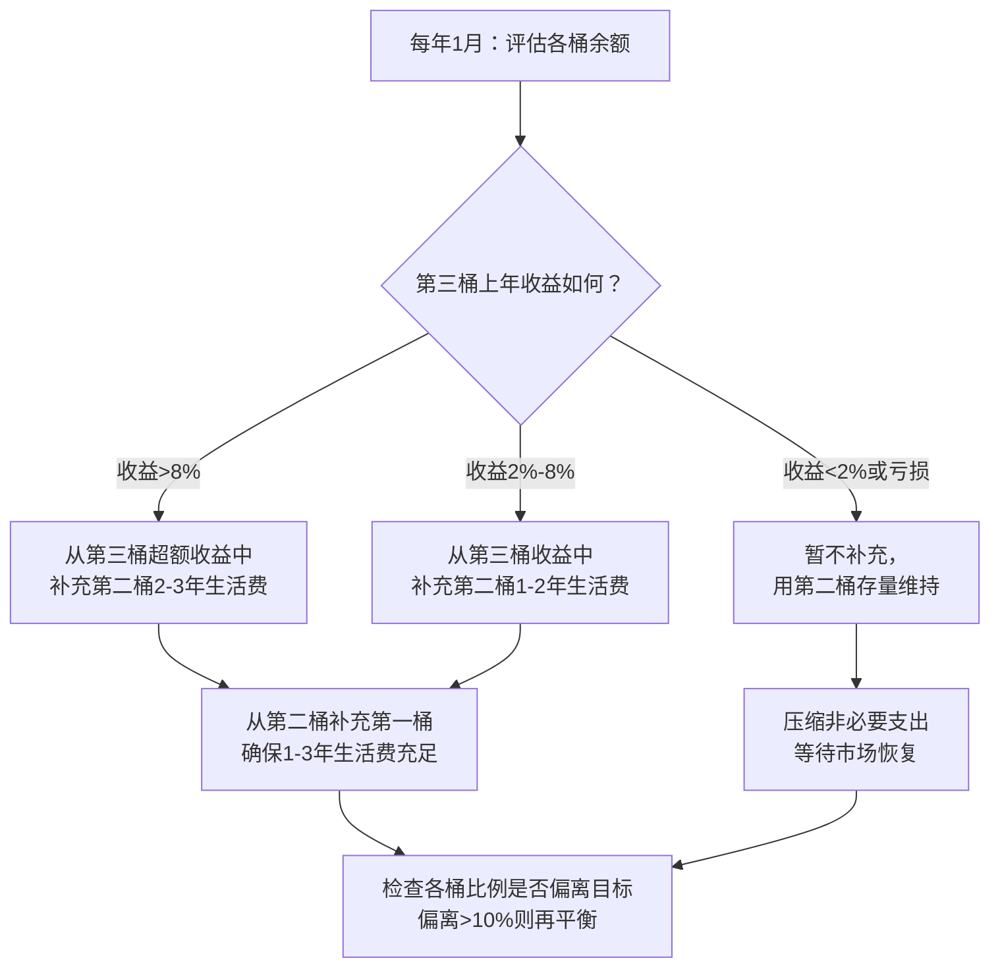
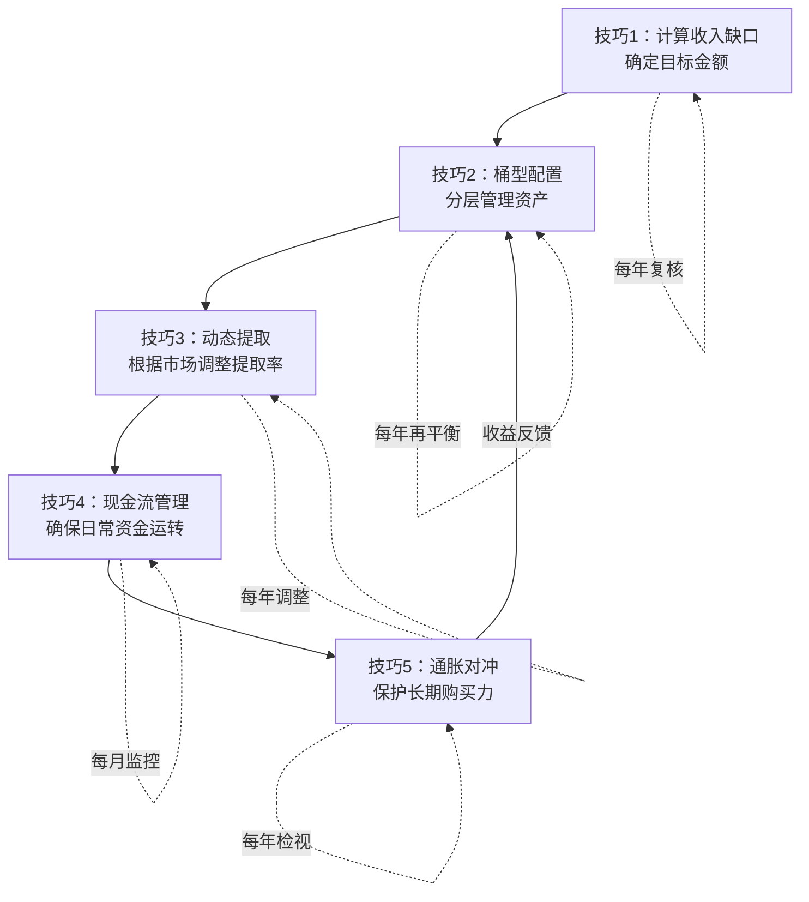

## 二、退休资金管理的五个核心技巧

退休资金管理是50岁以上人群最核心的财务课题。与积累期不同，退休期的资金管理面临三重矛盾：**需要持续提取以维持生活，又必须让资金跑赢通胀以抵御长寿风险；需要足够安全以避免重大亏损，又不能过于保守导致资产缩水；需要简化管理以降低认知负担，又必须保持足够的灵活性应对突发状况。**

这五个核心技巧构成一个完整的退休资金管理体系：先算清缺口（技巧1），再用桶型架构分层管理（技巧2），用动态提取规则平衡收支（技巧3），用现金流管理确保日常运转（技巧4），最后用通胀对冲策略保护购买力（技巧5）。五者缺一不可，共同构成退休期财务安全的基石。

### 技巧1：退休收入缺口计算——算清你到底需要多少钱

退休资金管理的第一步是算清账。很多人凭感觉估算退休需求，结果要么严重不足导致晚年窘迫，要么过度节俭白白牺牲了退休生活品质。科学的缺口计算需要四步走。

#### 第一步：精确计算退休后的年支出

退休后的支出不是简单地"打个七折"。不同类别的支出变化方向完全不同：

| 支出类别 | 退休后变化 | 原因 | 典型变化幅度 |
|---------|-----------|------|------------|
| 日常饮食 | 基本不变 | 一日三餐刚需 | -5%~+5% |
| 住房（房贷/物业） | 可能下降 | 房贷还清后大幅下降 | -30%~0% |
| 交通出行 | 明显下降 | 不再通勤 | -40%~-60% |
| 服装购置 | 下降 | 职业装需求消失 | -30%~-50% |
| 医疗保健 | 明显上升 | 慢性病、体检、用药 | +50%~+200% |
| 旅游休闲 | 大幅上升 | 时间充裕，补偿性消费 | +100%~+300% |
| 子女支持 | 逐步下降 | 子女经济独立 | -50%~-100% |
| 社交应酬 | 变化不定 | 职场社交减少，兴趣社交增加 | -30%~+30% |

**实操方法：用三档预算替代单一估算**

- **底线预算**：仅包含必需支出（饮食、住房、基础医疗、水电通讯），这是无论如何不能跌破的底线
- **舒适预算**：底线 + 适度旅游、兴趣爱好、社交活动，这是正常的退休生活标准
- **理想预算**：舒适 + 高品质旅游、子女资助、大额消费，这是理想中的退休生活

以二线城市为例，一对夫妻的三档预算可能是：
- 底线：15万/年（月均1.25万）
- 舒适：25万/年（月均2.08万）
- 理想：40万/年（月均3.33万）

#### 第二步：盘点退休后的固定收入来源

固定收入是退休生活的"压舱石"，需要逐一核实：

**社保养老金**是最核心的固定收入。查询方式有三种：登录"国家社会保险公共服务平台"在线测算；拨打12333社保热线咨询；携带身份证到当地社保局窗口查询。测算时注意区分"基础养老金"和"个人账户养老金"两部分，前者与社平工资和缴费年限挂钩，后者与个人账户累计储存额挂钩。

**企业年金**的覆盖率在中国仍然较低（约10%的职工），但如果有，这是一笔重要的补充收入。企业年金通常在退休时可以选择一次性领取或分期领取，分期领取更有利于税务规划和长期现金流。

**其他固定收入**包括：出租房产的租金收入（扣除空置期和维修成本后的净收入）、商业养老保险的定期给付、知识产权/专利的持续收益等。

#### 第三步：计算收入缺口

收入缺口 = 年支出 - 固定收入总额

**关键细节：不要只算一年的缺口，要按5年一个阶段计算。** 因为不同阶段的支出结构差异很大：

| 退休阶段 | 年龄区间 | 支出特征 | 典型年支出（舒适档） |
|---------|---------|---------|-------------------|
| 活跃期 | 60-70岁 | 旅游多、社交多、体力充沛 | 25-35万 |
| 平稳期 | 70-80岁 | 旅游减少、医疗增加 | 20-30万 |
| 高龄期 | 80岁以上 | 医疗/护理大幅增加 | 25-40万 |

注意高龄期的支出可能反弹——长期护理费用在中国一线城市可达每月5000-15000元，这是很多人忽视的重大风险。

#### 第四步：计算所需储蓄总额

最经典的计算方法是**4%安全提取率法则**（源自1998年Trinity Study）：如果你每年从投资组合中提取不超过4%，那么资金大概率可以支撑30年以上的退休生活。

所需储蓄总额 = 年收入缺口 × 25

**示例计算：**

假设张女士今年55岁，计划60岁退休，退休后选择舒适档生活（年支出25万），社保养老金预计6万/年，租金收入3万/年：

- 年收入缺口 = 25万 - 6万 - 3万 = 16万
- 所需储蓄总额 = 16万 × 25 = 400万
- 考虑通胀（5年积累期，年通胀3%）：400万 × (1.03)^5 ≈ 464万

**4%法则的中国化调整：** 4%法则基于美国股市历史数据，在中国需要保守一些。考虑到中国资本市场波动更大、无风险利率持续下行、医疗支出增速高于CPI等因素，建议将安全提取率调整为**3%-3.5%**，对应乘数为**28-33倍**。也就是说，上面的张女士实际需要准备 16万 × 30 ≈ 480万，再考虑通胀调整为 556万。

**常见误区：只算到"够用"，不考虑安全边际。** 建议在计算结果上增加20%-30%的安全余量，以应对长寿风险、医疗意外、通胀超预期等不确定因素。

### 技巧2：桶型配置的实操方法——把鸡蛋分装在不同时间维度的篮子里

桶型策略（Bucket Strategy）是退休资金管理中最重要的架构设计。它的核心思想是**按时间维度分层配置资产**——短期要用的钱放在安全的地方，长期不用的钱可以承受更多波动以获取更高收益。

#### 为什么桶型策略是退休期的最优架构

传统的"60/40股债平衡"策略在积累期运作良好，但在提取期存在致命缺陷：如果退休初期遭遇股市大跌（即"序列风险"），被迫在低点卖出股票来支付生活费，会导致资金加速耗尽。桶型策略通过**将短期需求隔离在安全资产中**，给长期投资留出恢复的时间。


#### 第一桶：安全垫（1-3年生活费）

这一桶的唯一使命是**确保你在任何市场环境下都有钱花**。绝对不能承受本金损失。

**配置方案（以100万为例）：**

| 资产类别 | 配置比例 | 金额 | 预期年化收益 | 特点 |
|---------|---------|------|------------|------|
| 货币基金 | 40% | 40万 | 1.5%-2.5% | 随时赎回，T+0或T+1到账 |
| 银行活期/通知存款 | 15% | 15万 | 0.2%-1.0% | 极高流动性，应对突发需求 |
| 短期国债（1年期） | 25% | 25万 | 1.5%-2.5% | 国家信用背书，安全性最高 |
| 银行大额存单（1年期） | 20% | 20万 | 1.5%-2.0% | 保本保息，50万以内受存款保险保护 |

**实操要点：**
- 货币基金选择规模500亿以上的产品（如天弘余额宝、南方现金增利等），流动性更好
- 短期国债通过银行柜台或证券账户购买，每月10日发行
- 大额存单起存门槛通常20万，利率比普通定存高0.1-0.3个百分点
- 第一桶的资金不要追求收益，**安全性和流动性是唯一目标**

#### 第二桶：稳定器（3-10年生活费）

这一桶的使命是**提供稳定收益，略高于通胀**，同时为第一桶提供补充资金。

**配置方案（以200万为例）：**

| 资产类别 | 配置比例 | 金额 | 预期年化收益 | 特点 |
|---------|---------|------|------------|------|
| 中长期国债（3-10年期） | 35% | 70万 | 2.0%-3.0% | 锁定利率，到期还本付息 |
| 高等级债券基金 | 35% | 70万 | 3.0%-5.0% | 专业管理，分散投资 |
| 银行大额存单（3年期） | 15% | 30万 | 2.0%-2.5% | 保本保息，利率锁定 |
| 可转债基金 | 15% | 30万 | 3.0%-8.0% | 进可攻退可守，波动适中 |

**债券基金选择标准：**
- 成立时间5年以上，经历过完整的利率周期
- 基金规模10-100亿（太小流动性差，太大收益被稀释）
- 最大回撤控制在5%以内
- 基金经理任职3年以上，风格稳定
- 推荐关注：纯债基金（如广发纯债、易方达稳健收益）和一级债基

#### 第三桶：增长引擎（10年以上资金）

这一桶的使命是**长期增值，抵御通胀**，为退休后20-30年的生活提供持续的购买力保障。

**配置方案（以300万为例）：**

| 资产类别 | 配置比例 | 金额 | 预期年化收益 | 特点 |
|---------|---------|------|------------|------|
| 高股息股票/ETF | 35% | 105万 | 5%-10% | 稳定分红+资本增值 |
| 宽基指数基金 | 30% | 90万 | 6%-10% | 分散风险，跟踪国运 |
| REITs（不动产信托） | 15% | 45万 | 4%-8% | 租金分红，抗通胀 |
| 黄金ETF | 10% | 30万 | 3%-8% | 避险资产，对冲极端风险 |
| QDII基金（海外配置） | 10% | 30万 | 4%-8% | 分散单一市场风险 |

**高股息股票/ETF推荐方向：**
- 银行股：四大行股息率常年5%-7%，波动小，适合养老收息
- 公用事业：电力、水务、燃气，现金流稳定，分红持续
- 红利ETF：如中证红利ETF（515080）、红利低波ETF（512890），一键配置高息股
- REITs：如鹏华前海万科REIT、中金普洛斯REIT，但需注意流动性风险

#### 桶的维护：动态再平衡机制

桶型策略不是"设置后遗忘"的，需要定期维护：

**年度维护流程：**



**具体操作规则：**
1. 每年1月评估上一年各桶的实际收益
2. 第三桶收益超过8%的年份，将超额收益的50%转入第二桶
3. 第三桶收益在2%-8%之间的年份，将收益的30%转入第二桶
4. 第三桶亏损的年份，不动用第三桶，用第二桶存量过渡
5. 每年从第二桶提取当年生活费转入第一桶
6. 每3年检查一次各桶比例，偏离目标超过10个百分点时再平衡

### 技巧3：动态提取策略——市场好时多花，市场差时少花

固定4%提取率虽然简单，但存在一个严重问题：**它不考虑市场环境。** 在牛市中提取4%过于保守（浪费了增值机会），在熊市中提取4%又过于激进（加速消耗本金）。动态提取策略根据市场表现调整提取率，既保护本金又不错过好年景。

#### 核心规则

| 市场表现（以沪深300为基准） | 提取率调整 | 心态管理 |
|---------------------------|-----------|---------|
| 市场上涨超过20% | 提取5%（享受收益） | 好年景适当犒赏自己 |
| 市场上涨5%-20% | 提取4%（正常提取） | 维持正常生活水准 |
| 市场波动在±5%以内 | 提取4%（正常提取） | 平淡是常态 |
| 市场下跌5%-10% | 提取3.5%（适度缩减） | 减少非必要开支 |
| 市场下跌10%-20% | 提取3%（明显缩减） | 削减旅游、娱乐等弹性支出 |
| 市场下跌超过20% | 提取2.5%（大幅缩减） | 仅维持基本生活，等待恢复 |

#### 完整示例：10年退休资金提取模拟

假设退休资金总额1000万，以沪深300全收益指数为基准：

| 年份 | 市场表现 | 提取率 | 提取金额 | 年初余额 | 年末余额（提取后+收益） |
|-----|---------|-------|---------|---------|---------------------|
| 第1年 | +25% | 5.0% | 50万 | 1000万 | 1187.5万 |
| 第2年 | -15% | 3.0% | 35.6万 | 1187.5万 | 973.8万 |
| 第3年 | +10% | 4.0% | 39.0万 | 973.8万 | 1032.2万 |
| 第4年 | -25% | 2.5% | 25.8万 | 1032.2万 | 748.4万 |
| 第5年 | +30% | 5.0% | 37.4万 | 748.4万 | 935.5万 |
| 第6年 | +5% | 4.0% | 37.4万 | 935.5万 | 944.9万 |
| 第7年 | -8% | 3.5% | 33.1万 | 944.9万 | 836.2万 |
| 第8年 | +15% | 4.0% | 33.4万 | 836.2万 | 928.2万 |
| 第9年 | -30% | 2.5% | 23.2万 | 928.2万 | 626.5万 |
| 第10年 | +20% | 5.0% | 31.3万 | 626.5万 | 720.3万 |

10年累计提取：346.2万，年均34.6万。资金余额从1000万变为720.3万，消耗率远低于固定4%提取（固定4%提取10年余额约为665万）。**动态策略的关键在于：熊市少提，牛市多提，整体消耗更慢。**

#### 底线提取规则

动态提取有一个重要补充：**无论市场表现如何，提取金额不能低于底线预算。** 如果市场持续低迷，而底线预算又高于动态计算的提取金额，差额从第一桶（安全垫）中弥补。这就是第一桶存在的意义——它为极端情况提供了缓冲。

#### 实操工具：提取决策日历

建议将提取决策固定在每年的特定时间点执行，避免情绪化操作：

- **1月初**：评估上一年市场表现，确定当年提取率
- **1月中旬**：根据提取率计算当年提取金额，从相应桶中划转到活期账户
- **7月初**：半年检视，如果上半年市场发生重大变化（涨跌幅超过15%），考虑调整下半年的提取节奏
- **12月底**：预判下一年的市场环境，提前规划

### 技巧4：现金流管理——让每一分钱在正确的时间出现在正确的账户

退休后的现金流管理与工作期间完全不同。工作时每月有工资进账，现金流天然规律；退休后收入来源分散、到账时间不一致，如果管理不当，可能出现"账户里有钱但活期账户没钱花"的尴尬。

#### 收入来源的时间分布

| 收入来源 | 到账频率 | 到账时间 | 月均金额（示例） | 备注 |
|---------|---------|---------|----------------|------|
| 社保养老金 | 每月 | 每月15-20日 | 5000元 | 最稳定的收入来源 |
| 企业年金 | 每月或每季 | 因单位而异 | 2000元 | 退休时确认领取方式 |
| 房租收入 | 每月 | 月初或约定日 | 3000元 | 注意空置期和维修扣款 |
| 投资分红 | 每季或每年 | 不固定 | 2000元（月均） | 波动较大，不可完全依赖 |
| 兼职/咨询 | 不定期 | 不固定 | 不确定 | 不纳入固定现金流规划 |

#### 三层账户体系

建议将退休资金分成三个账户层次：

**第一层：日常账户（银行活期）**
- 用途：日常消费、水电煤气、通讯费
- 余额：保持2-3个月的生活费（约3-5万）
- 资金来源：社保养老金、房租收入自动转入
- 管理工具：绑定微信/支付宝，设置自动缴费

**第二层：缓冲账户（货币基金/短期理财）**
- 用途：季度大额支出（保险费、物业费、体检费）、应急备用
- 余额：保持6-12个月的生活费（约10-20万）
- 资金来源：每季度从投资收益中补充
- 管理工具：设置自动赎回，需要时T+1到账

**第三层：投资账户（桶型策略组合）**
- 用途：长期增值，定期向缓冲账户补充
- 余额：退休储蓄的主体部分
- 资金来源：投资收益
- 管理工具：年度再平衡，按桶型策略维护

#### 支出分类与资金来源匹配

| 支出类型 | 示例 | 资金来源 | 支付方式 |
|---------|------|---------|---------|
| 固定支出 | 物业费、保险费、通讯费 | 日常账户（社保+租金） | 自动扣款 |
| 日常支出 | 餐饮、交通、日用品 | 日常账户 | 微信/支付宝 |
| 弹性支出 | 旅游、娱乐、购物 | 缓冲账户 | 信用卡（月还） |
| 大额支出 | 家电更换、装修 | 缓冲账户或投资账户 | 规划后提取 |
| 紧急支出 | 突发医疗、意外维修 | 应急基金（第一桶） | 即时提取 |
| 子女支持 | 婚嫁、购房资助 | 第三桶超额收益 | 规划后转账 |

#### 现金流日历模板

```text
每月固定日：
├── 1日：检查日常账户余额，确认房租到账
├── 5日：信用卡账单日，确认还款金额
├── 15日：社保养老金到账
├── 20日：检查日常账户余额，不足则从缓冲账户补充
└── 月底：记录本月实际支出，与预算对比

每季度：
├── 第1周：投资分红到账确认
├── 第2周：从投资账户向缓冲账户补充资金
└── 第3周：评估下季度大额支出计划

每年：
├── 1月：确定当年提取率和提取金额
├── 4月：年度再平衡（检查桶型比例）
├── 7月：半年财务检视
└── 10月：规划下一年度预算和大额支出
```

### 技巧5：通胀对冲策略——保护你的购买力不被悄悄侵蚀

通胀是退休资金的头号隐形杀手。假设年通胀率3%，20年后物价将上涨80%——也就是说今天每月1万元的生活费，20年后需要1.8万元才能维持同等水平。如果退休资金不能跑赢通胀，生活水平将逐年下降。

#### 通胀对冲资产矩阵

| 对冲工具 | 对冲效果 | 适合配置比例 | 风险等级 | 门槛 | 流动性 |
|---------|---------|------------|---------|------|-------|
| 股票/股票基金 | ★★★★★ | 15%-30% | 高 | 低 | 高 |
| REITs | ★★★★ | 5%-15% | 中高 | 中 | 中 |
| 黄金 | ★★★★ | 5%-10% | 中 | 低 | 高 |
| 通胀挂钩债券 | ★★★ | 5%-10% | 低 | 中 | 中 |
| 房产 | ★★★★ | 视持有情况 | 中 | 高 | 低 |
| 商品基金 | ★★★ | 0%-5% | 高 | 低 | 高 |

#### 策略一：保持适度的股票配置

很多人在50岁以后急于清仓股票，这是一个常见的过度反应。**即使是70岁的退休人士，也需要保持一定比例的股票配置**，因为退休期长达20-30年，纯固收资产的收益率（当前约2%-3%）远低于通胀+提取率的总和（约5%-7%），资金必然加速消耗。

**年龄适配的股票配置建议：**

| 年龄区间 | 股票配置比例 | 配置风格 |
|---------|------------|---------|
| 55-60岁 | 25%-35% | 均衡型，大盘蓝筹+红利股为主 |
| 60-70岁 | 20%-30% | 防守型，高股息+低波动为主 |
| 70-80岁 | 15%-20% | 极度防守型，红利ETF为主 |
| 80岁以上 | 10%-15% | 最低限度配置，以防资金过快消耗 |

**股票配置的核心原则：以收息为主，以增值为辅。** 选择那些每年稳定分红4%-6%的蓝筹股或红利ETF，即使股价不涨，光靠分红就能提供可观的现金流。

#### 策略二：配置REITs获取通胀保护性收益

REITs（不动产投资信托基金）的底层资产是商业地产、仓储物流、产业园区等，租金收入通常随通胀上调，是天然的抗通胀资产。

**中国公募REITs现状（截至2025年）：**
- 已上市30余只，覆盖产业园、高速公路、仓储物流、保障性住房等
- 分红收益率一般在3%-8%之间
- 通过证券账户即可购买，门槛低（1000元起）
- 注意：中国公募REITs历史较短，市场波动较大，建议控制在总资产的10%-15%

**选择REITs的四个标准：**
1. 底层资产类型稳定（优选产业园、仓储物流，避选高速公路——政策风险大）
2. 出租率高于85%（出租率是现金流的保障）
3. 分红记录连续3年以上
4. 管理人经验充足（优选头部基金公司产品）

#### 策略三：黄金作为极端风险的对冲工具

黄金不产生收益，但它的价值在于**与所有其他资产低相关甚至负相关**——当股市暴跌、货币贬值、地缘冲突时，黄金往往是唯一上涨的资产。

**退休人士配置黄金的方式：**

| 方式 | 优点 | 缺点 | 适合人群 |
|------|------|------|---------|
| 黄金ETF（如518880） | 交易便捷、费用低、门槛低 | 需要证券账户 | 有投资经验者 |
| 银行积存金 | 可定投、门槛低 | 手续费较高 | 新手 |
| 实物金条 | 实物持有、心理安全感 | 存储成本、买卖价差大 | 偏好实物者 |
| 黄金T+D | 可双向操作 | 杠杆风险大 | 不适合退休人士 |

**配置建议：** 黄金配置控制在总资产的5%-10%。采用"核心+卫星"策略：核心仓位（70%）长期持有不动，卫星仓位（30%）在金价大跌时逢低加仓。

#### 策略四：利用保险产品锁定部分现金流

年金险和增额终身寿险可以锁定长期利率（目前约2.5%-3.0%），虽然收益率看似不高，但在利率持续下行的环境中，锁定一个确定的长期收益率本身就是一种对冲通胀的策略——至少你不会因为利率下降而被迫接受更低的收益。

**适合退休人士的保险产品：**
- **年金险**：一次性或分期缴纳保费，从约定年龄开始每月领取，活多久领多久。适合对冲长寿风险。
- **增额终身寿险**：保额按约定利率（目前约2.5%）逐年递增，可以通过减保取现灵活使用资金。适合需要灵活性的退休人士。

**注意事项：**
- 保险产品的流动性极差，前几年退保会有较大损失
- 不要把超过30%的退休资金放在保险产品中
- 优先选择大公司产品（中国人寿、平安、太保等），偿付能力更可靠

### 综合运用：五个技巧的协同运作框架

五个技巧不是孤立的，而是构成一个有机的运作系统：



**年度运作循环：**

1. **每年1月**：复核收入缺口（技巧1），确认目标是否变化（如医疗支出增加、子女独立后支出减少）
2. **每年1月**：确定当年提取率（技巧3），计算提取金额
3. **每年1月**：从相应桶中划转资金到现金流账户（技巧2→技巧4）
4. **每年4月**：检查桶型比例，必要时再平衡（技巧2）
5. **每年7月**：半年检视，评估通胀对冲效果（技巧5）
6. **每月**：监控现金流账户余额，确保日常运转（技巧4）

### 常见误区与纠正

**误区一：退休后应该全部买国债和存款**

纠正：全部配置固收资产的年化收益约2%-3%，而通胀+提取率约5%-7%，每年净消耗2%-5%的本金。按此速度，1000万的退休资金在15-20年内就会耗尽。必须保持一定比例的权益类资产。

**误区二：桶型配置设置好就不用管了**

纠正：桶型策略需要年度维护。如果长期不调整，第三桶的股票比例可能因为市场涨跌而大幅偏离目标，要么承担了过多风险，要么错失了增值机会。

**误区三：动态提取太复杂，不如固定4%省心**

纠正：固定4%在连续熊市中是致命的——如果你在退休前3年遭遇大熊市，固定提取4%会严重消耗本金，即使后来市场恢复，基数已经大幅缩水。动态提取虽然需要每年调整一次，但这15分钟的操作可能让你的退休资金多撑5-10年。

**误区四：黄金不产生收益，不值得配置**

纠正：黄金的价值不在于收益，而在于对冲。2008年金融危机期间，沪深300暴跌66%，而黄金上涨5.8%。2020年疫情初期，股市暴跌而黄金创新高。5%-10%的黄金配置是"花小钱买保险"。

**误区五：现金流管理是小事，不需要系统化**

纠正：退休后的现金流断裂比年轻人的现金流断裂危险得多——年轻人可以加班赚钱，退休人士只能消耗储蓄。一个系统化的现金流管理体系可以避免"被迫在低点卖出资产"的悲剧。

**误区六：通胀对冲就是买股票**

纠正：股票确实是抵御通胀最有效的工具之一，但过度依赖单一资产会增加集中风险。真正的通胀对冲是多资产协同——股票提供增长、REITs提供租金增长、黄金提供避险、保险提供确定性。

### 进阶策略：针对不同资产规模的差异化方案

#### 资产规模300万以下：保守生存型

- 第一桶占比提高到30%（安全边际不足，需要更多缓冲）
- 第三桶以红利ETF为主，放弃个股（降低风险和管理难度）
- 考虑延迟退休或半退休（兼职补充收入）
- 通胀对冲以保险+红利ETF为主，放弃REITs和黄金（资产太少，分散配置意义有限）

#### 资产规模300-800万：标准平衡型

- 按标准桶型策略执行（20%/40%/40%）
- 通胀对冲按五策略配置
- 重点做好现金流管理，确保三个账户层次清晰
- 每年做一次全面财务检视

#### 资产规模800万以上：积极增长型

- 第一桶占比可降低到10%-15%（安全边际充足）
- 第三桶可以加入更多增值型资产（如QDII海外配置、优质成长股）
- 考虑设立家族信托，实现财富传承和税务优化
- 可以适当增加慈善捐赠，既减税又实现社会价值

### 本技巧要点回顾

退休资金管理的五个核心技巧形成一个完整的闭环：**算清缺口定目标，桶型配置搭架构，动态提取保平衡，现金流管保运转，通胀对冲护购买力。** 执行这套体系的关键不在于每个技巧有多复杂，而在于**坚持每年执行一次年度检视和再平衡**。退休资金管理是一项持续20-30年的长期工程，持续而稳定的执行远比偶尔的激进操作更重要。
