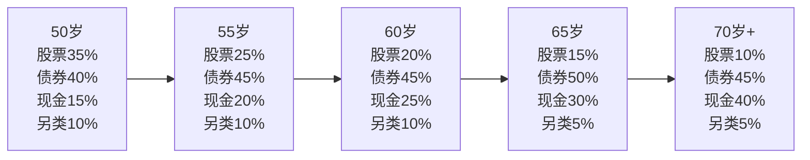
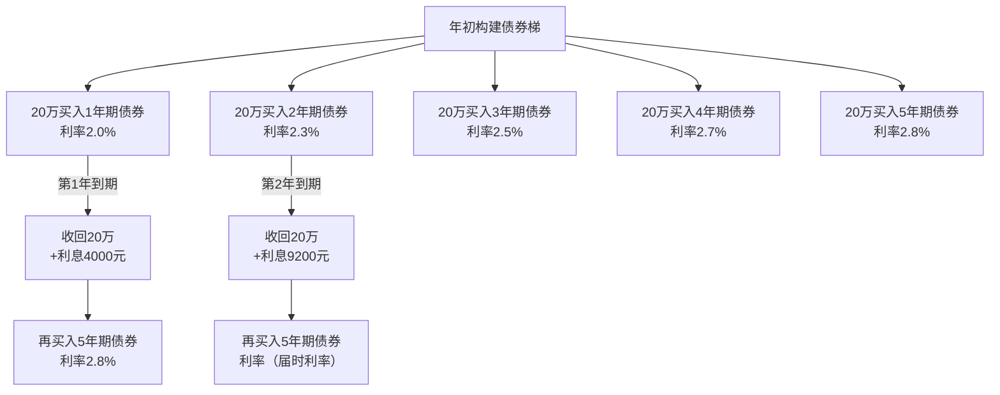

## 三、50+人群投资组合的五个核心技巧

50岁是投资生涯的分水岭。前半程追求资产增值，后半程转向资产保全与持续现金流。这个阶段的投资组合不是简单地"降低风险"，而是要在安全、收益、流动性之间找到精确的平衡点。本节提供五个经过实践验证的核心技巧，帮助50+人群构建适合自己的投资组合。

### 为什么要专门讨论50+投资组合？

50+人群面临独特的投资约束：

| 约束因素 | 具体表现 | 对投资的影响 |
|----------|----------|-------------|
| 时间窗口缩短 | 距退休5-15年，容错空间小 | 不能承受大幅亏损，回本时间不足 |
| 收入峰值回落 | 职场竞争力下降，收入增长放缓 | 储蓄增量减少，依赖存量资产 |
| 支出刚性增加 | 医疗、养老支出不可压缩 | 需要稳定的现金流覆盖刚性支出 |
| 长寿风险 | 可能活到90岁以上 | 资产需要跑赢通胀30-40年 |
| 心理承受力下降 | 亏损带来的焦虑更强烈 | 波动性管理比收益率更重要 |

这五个约束决定了50+投资组合的核心逻辑：**以现金流为核心，以风控为底线，以适度增值为追求**。

---

### 技巧1：年龄适配型资产配置

资产配置是投资组合的骨架。50+人群需要根据具体年龄段、收入状况、风险承受能力三个维度来确定配置比例。

#### 1.1 滑翔路径配置法

滑翔路径（Glide Path）理论认为，风险资产比例应随年龄递减。50+阶段的具体配置如下：

**各资产类别的具体构成：**

**货币基金/现金类（15%-40%）：**
- 银行活期/定期存款：用于日常开支，占比不超过现金类的30%
- 货币基金：年化收益2%-3%，流动性T+0，适合存放3-6个月生活费
- 短期国债（1年以内）：安全性最高，收益率略高于货币基金
- 大额存单：20万起存，利率比定期高0.2%-0.5%，适合大额资金暂存

**债券类（40%-50%）：**
- 国债：3年期和5年期储蓄国债，2024年利率约2.5%-2.8%，免利息税
- 政策性金融债：国开债、农发债，信用等同国债，收益率略高0.2%-0.5%
- 高等级企业债基金：仅限AAA级，年化收益3%-4%，波动可控
- 可转债基金：兼具债券底和股票弹性，适合50-55岁有经验的投资者

**股票类（10%-35%）：**
- 高股息蓝筹股：银行、电力、高速公路等，股息率4%-7%
- 宽基指数基金：沪深300、中证500，适合不擅长选股的投资者
- 红利ETF：中证红利ETF（515180）、红利ETF（510880），一键获取高股息组合
- 港股通标的：H股折价明显，股息率更高，但需注意汇率风险

**另类资产（5%-10%）：**
- 黄金ETF：对冲通胀和黑天鹅事件，占比5%即可
- REITs：公募REITs年化分红4%-6%，与股债相关性低

#### 1.2 三种典型配置方案

**方案一：稳健型（适合风险承受能力低、有稳定退休金的人）**

| 资产类别 | 50-55岁 | 55-60岁 | 60岁后 |
|----------|---------|---------|--------|
| 货币基金/存款 | 20% | 25% | 30% |
| 国债/高等级债 | 45% | 50% | 50% |
| 高股息股票/ETF | 20% | 15% | 10% |
| REITs | 10% | 5% | 5% |
| 黄金 | 5% | 5% | 5% |

预期年化收益：3%-5%，最大回撤控制在8%以内。

**方案二：平衡型（适合有一定投资经验、退休金不足的人）**

| 资产类别 | 50-55岁 | 55-60岁 | 60岁后 |
|----------|---------|---------|--------|
| 货币基金/存款 | 15% | 20% | 25% |
| 国债/高等级债 | 40% | 45% | 45% |
| 高股息股票/ETF | 25% | 20% | 15% |
| REITs | 10% | 10% | 10% |
| 黄金 | 10% | 5% | 5% |

预期年化收益：4%-7%，最大回撤控制在15%以内。

**方案三：进取型（适合退休金充足、有丰富投资经验的人）**

| 资产类别 | 50-55岁 | 55-60岁 | 60岁后 |
|----------|---------|---------|--------|
| 货币基金/存款 | 10% | 15% | 20% |
| 国债/高等级债 | 30% | 35% | 40% |
| 高股息股票/ETF | 35% | 30% | 25% |
| REITs | 10% | 10% | 10% |
| 黄金 | 10% | 5% | 5% |
| 另类（可转债等） | 5% | 5% | 0% |

预期年化收益：5%-9%，最大回撤可能达到20%，需要较强的心理承受能力。

#### 1.3 配置方案选择的自测清单

在选择方案前，回答以下问题：

1. 你是否有企业年金或职业年金？（有→可偏进取，无→偏稳健）
2. 你的社保养老金能否覆盖基本生活？（能→可偏进取，不能→偏稳健）
3. 你是否有房贷等负债？（有→必须偏稳健，无→可偏进取）
4. 你的配偶是否有独立收入/退休金？（有→可偏进取，无→偏稳健）
5. 你是否有重大疾病保险？（有→可偏进取，无→偏稳健）
6. 你能承受多大的账面亏损？（5%→稳健，10%→平衡，15%+→进取）

每回答一个"可偏进取"加1分，总分0-2分选稳健型，3-4分选平衡型，5-6分选进取型。

---

### 技巧2：高股息策略——用分红创造"第二份工资"

高股息策略是50+人群最友好的股票投资方式。它不依赖股价上涨，而是通过持续分红获得现金流，恰好匹配退休阶段的现金需求。

#### 2.1 高股息策略的底层逻辑

为什么高股息策略特别适合50+人群？

**原因一：现金流匹配。** 退休后最大的财务需求是稳定的现金流。高股息股票每季度或每年派息，相当于一份"额外工资"。假设持有100万元高股息组合，平均股息率5%，每年可获得5万元分红收入，相当于每月4000多元。

**原因二：下行保护。** 高股息股票通常是成熟行业的龙头企业，业务稳定，估值合理。当市场下跌时，高股息股票的跌幅通常小于大盘。2022年A股大跌期间，中证红利指数仅下跌约5%，而沪深300下跌超过20%。

**原因三：复利效应。** 将分红再投资，可以持续增加持股数量。假设初始投资100万元，股息率5%，股价年增长3%，10年后资产将增长到约216万元，其中分红再投资贡献了约40%的收益。

**原因四：抗通胀。** 优质企业的利润和分红通常随通胀增长。投资一家每年提价3%的公用事业公司，分红也会同步增长，从而跑赢通胀。

#### 2.2 高股息股票的选股标准

不是所有高股息股票都值得投资。股息率过高（超过10%）往往意味着股价大跌或分红不可持续。选股时需要同时满足以下条件：

| 选股条件 | 具体标准 | 原因 |
|----------|----------|------|
| 分红连续性 | 连续5年以上分红，最好连续10年 | 证明分红意愿和能力 |
| 股息率区间 | 4%-8% | 过低不划算，过高可能是陷阱 |
| 分红比例 | 30%-70% | 过低说明吝啬，过高说明不可持续 |
| 盈利稳定性 | 近5年ROE>10%，净利润无大幅波动 | 盈利是分红的基础 |
| 负债率 | <60%（金融业除外） | 高负债侵蚀分红能力 |
| 自由现金流 | 近3年自由现金流为正 | 利润不等于现金，要看真金白银 |
| 市值规模 | >100亿元 | 大公司更稳定，小公司波动大 |

**特别警惕的高股息陷阱：**

- **周期股伪装：** 煤炭、钢铁在景气顶峰时股息率很高，但利润不可持续，分红也会骤降。判断方法是查看过去10年的分红记录，是否有大幅波动。
- **一次性分红：** 某些公司出售资产后进行特别分红，推高当年股息率，但这种分红不可重复。
- **举债分红：** 公司借款来维持分红，说明经营现金流已经无法覆盖。检查资产负债率是否持续上升。
- **股价暴跌导致的高股息率：** 股价下跌50%，股息率从3%变成6%，但公司基本面可能恶化。

#### 2.3 高股息行业深度分析

**银行业（股息率5%-7%）：**

银行是A股分红最稳定的板块。四大行（工、农、中、建）连续20年以上分红，股息率常年保持在5%以上。风险点是房地产贷款质量和净息差收窄。建议优先选择国有大行，其次是招行、兴业等优质股份行。

投资方式：直接买入银行股（适合资金量大、有经验的投资者），或买入银行ETF（512800）。

**公用事业（股息率4%-6%）：**

电力、水务、燃气公司现金流稳定，受经济周期影响小。长江电力是典型代表，连续20年分红，股息率约3.5%-4%。风险点是电价政策调整和来水量波动。

投资方式：长江电力、华能国际等个股，或公用事业ETF。

**能源行业（股息率4%-8%）：**

中国神华是A股分红的标杆，2023年股息率超过7%。但煤炭价格受政策和国际市场影响大，周期性明显。石油股（中国石油、中国石化）也提供不错的分红，但油价波动影响大。

投资方式：适合有一定周期判断能力的投资者，不建议作为核心持仓。

**高速公路/交运（股息率4%-6%）：**

高速公路公司（宁沪高速、山东高速等）拥有稳定的通行费收入，分红可预测性强。港口和机场也属于这一类别。风险点是经济下行导致车流量下降。

投资方式：适合长期持有，作为组合中的"压舱石"。

#### 2.4 高股息ETF的选择

如果不想自己选股，高股息ETF是最简单的替代方案：

| ETF名称 | 代码 | 跟踪指数 | 股息率 | 管理费 | 特点 |
|----------|------|----------|--------|--------|------|
| 红利ETF | 510880 | 上证红利 | 5%-6% | 0.50% | 老牌红利ETF，流动性好 |
| 中证红利ETF | 515180 | 中证红利 | 5%-7% | 0.20% | 覆盖沪深两市，费率低 |
| 红利低波ETF | 512890 | 红利低波 | 4%-6% | 0.50% | 加入低波动因子，更稳健 |
| 恒生高股息ETF | 159726 | 恒生高股息 | 6%-8% | 0.60% | 港股高息股，汇率风险 |

**推荐组合：** 中证红利ETF（515180）作为核心持仓（费率最低），搭配红利低波ETF（512890）降低波动。

#### 2.5 分红再投资的实操方法

分红再投资是高股息策略的关键环节。具体操作：

**方法一：自动再投资。** 部分券商支持"分红自动再投资"功能，分红到账后自动买入原股票。适合懒人，但无法控制买入价格。

**方法二：手动再投资。** 分红到账后，在股价回调时手动买入。需要一定的择时能力，但可以提高再投资效率。

**方法三：跨品种再投资。** 将分红买入组合中表现最差的品种，相当于自动执行"低买"策略，同时实现再平衡。

**方法四：补充债券仓位。** 如果股票仓位已经偏高，用分红买入债券，降低组合整体风险。

---

### 技巧3：债券投资策略——稳定收益的压舱石

债券是50+投资组合的核心资产，占比通常在40%-50%。但债券投资并非"买了就不管"，需要策略性地选择品种和构建组合。

#### 3.1 国债投资的三种方式

**方式一：储蓄国债（电子式/凭证式）**

通过银行柜台或网银购买。2024年3年期储蓄国债利率约2.5%，5年期约2.8%。优势是安全性最高（国家信用）、免利息税、操作简单。劣势是额度有限（每期很快售罄）、不能提前转让（可以提前兑取但损失利息）。

**购买技巧：**
- 每月10日发行新一期，上午9点开始，建议提前到银行排队或8:50登录网银
- 电子式国债通过网银购买更方便，凭证式需要到柜台
- 如果一笔买不到，可以在后续几期分批购买，构建"国债梯"
- 提前兑取会扣减利息（持有不满6个月不计息），所以只用3年以上不会动用的资金购买

**方式二：记账式国债（交易所国债）**

通过证券账户在交易所买卖。价格随市场波动，可能赚取价差，也可能亏损。适合有证券账户的投资者。

**关键指标——久期：** 久期衡量债券价格对利率变化的敏感度。久期3年的国债，利率每上升1%，价格下跌约3%。50+投资者建议选择久期3-5年的品种，既能获得不错的收益率，又不会因利率波动承受过大价格风险。

**方式三：国债逆回购**

本质是用国债做抵押的短期借款，安全性等同国债。通过证券账户操作，期限有1天、2天、7天、14天、28天、91天、182天。季末、年末收益率飙升（有时达到5%-10%），是闲置资金的短期理财好工具。

**操作方法：** 在证券账户中选择"国债逆回购"，输入代码（如204001为沪市1天期）和金额即可。资金T+1可用，T+2可取。

#### 3.2 债券基金的选择

对于资金量较大或希望专业管理的投资者，债券基金是更好的选择。

**债券基金分类与选择：**

| 基金类型 | 风险等级 | 预期收益 | 适合人群 | 选择标准 |
|----------|----------|----------|----------|----------|
| 纯债基金（短债） | 低 | 2%-3% | 替代货币基金 | 规模>2亿，费率<0.3% |
| 纯债基金（中长债） | 中低 | 3%-4% | 核心债券配置 | 规模5-50亿，费率<0.4% |
| 一级债基 | 中 | 3%-5% | 稳健型投资者 | 历史最大回撤<3% |
| 二级债基 | 中 | 4%-8% | 能承受小幅波动 | 股票仓位<20%，费率<0.6% |
| 可转债基金 | 中高 | 5%-15% | 有经验的投资者 | 仅适合50-55岁 |

**债券基金筛选的五个关键指标：**

1. **基金经理任职年限：** 至少3年以上，经历过完整的利率周期
2. **历史最大回撤：** 纯债基金不超过2%，一级债基不超过3%，二级债基不超过5%
3. **基金规模：** 5亿-50亿最佳。规模太小有清盘风险，太大影响操作灵活性
4. **费率：** 管理费+托管费不超过0.5%，优先选择C类份额（适合持有1年以内）
5. **持仓集中度：** 前五大债券持仓不超过30%，避免单一发行人违约风险

#### 3.3 债券梯策略的完整实施

债券梯（Bond Ladder）是将债券投资分散到不同到期日的策略，兼顾收益和流动性。

**构建方法：**

假设总债券投资为100万元，分成5份各20万元：

**债券梯的优势：**
- **流动性：** 每年都有20万元到期，应急时不用折价卖出
- **收益性：** 大部分资金享受长期债券的较高利率
- **利率风险管理：** 如果利率上升，到期的20万可以买入更高利率的债券；如果利率下降，已锁定的长期债券仍然享受之前的高利率

**债券梯的实操要点：**
- 使用国债或政策性金融债构建，避免信用债违约风险
- 到期资金如果暂时不用，先放入货币基金，等待下一期国债发行
- 每年检查一次梯级结构，根据利率环境调整是否延长或缩短久期
- 如果预期利率大幅下降，可以考虑加长久期（买入更长期限的债券）

#### 3.4 债券投资的常见误区

**误区一：债券不会亏钱。** 事实是，债券基金在利率上升期间会亏损。2022年美国加息周期中，长期国债基金下跌超过10%。国内中长期纯债基金在2016-2017年也出现过阶段性亏损。应对方法是控制久期，不要过度集中在长期债券。

**误区二：只看收益率不看风险。** 信用债基金收益率高，但违约风险也高。2020年永煤违约事件导致多只信用债基金单日暴跌。50+投资者应以利率债和高等级信用债为主。

**误区三：忽略费率的影响。** 债券基金的年化收益率本身就不高（3%-5%），如果管理费收0.8%，实际收益可能只有2%-4%。选择费率低的基金，长期累积差异显著。

---

### 技巧4：再平衡策略——纪律性卖出高买低

再平衡是投资组合管理中最重要但最容易被忽视的环节。它的核心是：定期将组合恢复到目标配置比例，强制执行"卖高买低"的纪律。

#### 4.1 为什么必须再平衡？

假设初始配置为股票40%、债券60%，一年后股票上涨30%、债券上涨5%：

| 资产 | 初始配置 | 一年后 | 实际比例 |
|------|----------|--------|----------|
| 股票 | 40万（40%） | 52万 | 44.8% |
| 债券 | 60万（60%） | 63万 | 54.2% |
| 合计 | 100万 | 115万 | 100% |

股票比例从40%上升到44.8%，风险敞口增大了。如果不调整，一旦股市回调，损失会超出预期。再平衡就是卖出部分股票（约5.6万），买入债券，恢复40/60的目标比例。

**再平衡的三大好处：**
- **控制风险：** 防止单一资产过度集中
- **纪律性低买高卖：** 在高位减持、低位增持，克服人性的贪婪和恐惧
- **提升长期收益：** 学术研究表明，定期再平衡的组合长期年化收益比不调整高0.5%-1%

#### 4.2 再平衡的三种方法

**方法一：定期再平衡**

固定时间（每季度、每半年或每年）检查一次组合，将偏离目标比例的资产调整回来。

- **每季度一次：** 适合持有波动较大的资产（如股票比例较高）
- **每半年一次：** 适合大多数50+投资者，平衡了成本和效果
- **每年一次：** 适合债券为主的保守型组合

**方法二：阈值再平衡**

当某类资产偏离目标比例超过设定阈值时触发再平衡。常用阈值：
- 绝对阈值：偏离目标5个百分点（如目标40%，实际45%或35%时触发）
- 相对阈值：偏离目标20%（如目标40%，实际48%或32%时触发）

**推荐组合：** "定期+阈值"双重机制——每季度检查一次，但只有当偏离超过5%时才实际操作。这样既保持纪律性，又避免频繁交易。

**方法三：现金流再平衡**

不卖出已持有的资产，而是将新增资金（工资储蓄、分红收入、到期债券本金）全部买入低配资产，逐步将比例拉回目标。

**优势：** 避免卖出产生的交易费用和潜在税费；心理上更容易接受（不用"卖掉赚钱的"）。

**局限：** 如果新增资金量小，调整速度慢；如果资产偏离幅度大（超过10%），仅靠新增资金可能不够。

#### 4.3 再平衡的实操流程

**步骤一：确定目标配置**

根据技巧1选择的配置方案，明确每个资产类别的目标比例。

**步骤二：记录当前持仓**

建立一个简单的持仓表（Excel或记账APP），记录每个品种的名称、数量、当前市值。

**步骤三：计算偏离幅度**

| 资产类别 | 目标比例 | 当前市值 | 当前比例 | 偏离幅度 | 是否需要调整 |
|----------|----------|----------|----------|----------|-------------|
| 货币基金 | 15% | 18万 | 15.0% | 0% | 否 |
| 国债/债券 | 40% | 50万 | 41.7% | +1.7% | 否 |
| 高股息股票 | 25% | 35万 | 29.2% | +4.2% | 否（<5%） |
| REITs | 10% | 10万 | 8.3% | -1.7% | 否 |
| 黄金 | 10% | 7万 | 5.8% | -4.2% | 否（<5%） |
| 合计 | 100% | 120万 | 100% | — | — |

上例中没有资产偏离超过5%，不需要操作。

**步骤四：执行调整**

如果需要调整，优先使用现金流再平衡（将分红、到期债券买入低配品种）。如果偏离幅度大（>5%），则卖出超配品种、买入低配品种。

#### 4.4 再平衡的心理挑战

再平衡最大的敌人是人性。当股票大涨时，卖出股票买入债券感觉像是"放弃收益"。当股票大跌时，卖出债券买入股票感觉像是"接飞刀"。

**应对方法：**
- **自动化：** 设置日历提醒，到期就检查，检查就执行，不给自己犹豫的时间
- **小幅度操作：** 不需要精确到1%，偏离5%才动，减少操作频率
- **记录操作日志：** 每次再平衡后记录当时的市场情绪和操作结果。回看时你会发现，大多数时候"反人性"的操作最终都是对的
- **接受不完美：** 再平衡不会让你卖在最高点、买在最低点，它的目标是控制风险，不是择时

---

### 技巧5：风险管理工具——为组合加上"安全气囊"

50+投资者的最大风险不是收益太低，而是一次重大亏损导致无法恢复。风险管理的目标是：在正常年份获得合理收益，在极端年份将损失控制在可承受范围内。

#### 5.1 止损体系

止损是风险管理的第一道防线。50+投资者需要建立多层次的止损体系：

**个股止损：**
- 买入后设定15%-20%的止损线
- 触及止损线后卖出，不存侥幸心理
- 如果看好该股票，可以在更低位置（如跌30%后）分批买回，但必须有明确的买入计划

**行业止损：**
- 单个行业持仓不超过总资产的15%
- 如果某行业持仓因上涨超过20%，卖出超额部分

**组合止损：**
- 整体组合年度亏损超过10%时，审视配置是否合理
- 如果亏损超过15%，降低股票仓位至目标比例的一半
- 如果亏损超过20%，全部转入债券和货币基金，等待市场企稳后逐步恢复

**止损后的恢复策略：**
止损后不要急于"抄底"。采用"分批恢复"方法：市场企稳后（如连续3个月不再创新低），将股票仓位逐步从0%恢复到目标比例，每次增加5%-10%，间隔1-2个月。

#### 5.2 期权保护策略

对于持有较大股票仓位（50万元以上）的投资者，期权是一个有效的保护工具。

**保护性看跌期权（Protective Put）：**

原理：买入看跌期权，相当于为股票组合买了一份"保险"。如果股价下跌，期权的收益可以弥补股票的损失。

**具体操作：**
- 选择沪深300ETF期权（510300）
- 买入当月或下月的虚值看跌期权（行权价低于当前价格5%-10%）
- 成本约为组合价值的1%-3%/年
- 每月或每季度滚动操作

**成本控制技巧：**
- 只在估值偏高时（如沪深300 PE>13倍）才使用期权保护
- 选择虚值期权降低成本（但保护幅度也降低）
- 卖出更高行权价的看跌期权形成"价差"策略，进一步降低成本
- 不需要100%对冲，保护50%-70%的持仓即可

**期权保护的局限：**
- 需要开通期权交易权限（50万资金门槛+通过考试）
- 长期购买期权的成本会侵蚀收益
- 不适合小资金投资者

#### 5.3 分散投资的四维框架

分散投资是最基础也最有效的风险管理手段。50+投资者需要在四个维度上实现分散：

**维度一：资产类别分散**

不要把所有资金放在同一类资产中。即使是最安全的国债，也应该搭配股票和黄金。不同资产在不同经济环境下的表现不同：

| 经济环境 | 股票 | 债券 | 黄金 | 现金 |
|----------|------|------|------|------|
| 经济增长+温和通胀 | 优 | 中 | 中 | 差 |
| 经济衰退 | 差 | 优 | 中 | 优 |
| 高通胀 | 中 | 差 | 优 | 差 |
| 金融危机 | 差 | 优 | 优 | 优 |

**维度二：地域分散**

不要只投资A股。通过港股通、QDII基金等渠道配置海外市场：
- 港股：估值更低，股息率更高（同一公司H股通常比A股便宜20%-30%）
- 美股指数：通过QDII基金（如标普500ETF联接）配置，分散单一市场风险
- 注意：海外市场占比不宜超过股票仓位的30%，避免汇率风险和信息不对称

**维度三：行业分散**

单个行业持仓不超过股票仓位的20%。建议覆盖以下行业组合：
- 金融（银行+保险）：20%
- 公用事业（电力+水务）：15%
- 消费（食品饮料+家电）：15%
- 能源（煤炭+石油）：10%
- 医药：10%
- 交运（高速公路+港口）：10%
- 其他：20%

**维度四：时间分散（定投）**

不要一次性投入所有资金。将计划投入股票的资金分成12-24份，每月定投一份。这样可以平滑买入成本，避免在市场高点一次性买入。

**定投的增强策略——智慧定投：**
- 当沪深300 PE低于历史30%分位时，定投金额加倍
- 当沪深300 PE高于历史70%分位时，定投金额减半
- 当沪深300 PE高于历史90%分位时，暂停定投并开始分批卖出

#### 5.4 应急资金隔离

**必须保留的应急资金：**
- 金额：6-12个月的生活费（包括医疗备用金）
- 存放位置：货币基金+银行活期，确保随时可取
- 原则：应急资金不计入投资组合，不参与任何投资决策

**应急资金的额外考虑：**
- 如果有慢性病或家族病史，应急资金应增加到12-18个月生活费
- 如果子女可能需要经济援助（如买房首付），额外预留一笔"亲情资金"
- 如果有房贷，应急资金应包含6个月的房贷还款额

#### 5.5 防诈骗与资金安全

50+人群是金融诈骗的高发群体。保护投资组合的安全，首先要防止资金被骗：

**常见诈骗手段：**
- "高收益理财产品"：承诺年化收益10%以上，多为庞氏骗局
- "内部消息"：推荐某只股票即将大涨，实际是让散户接盘
- "以房养老"骗局：诱导老人将房产抵押借款投资
- "数字货币/虚拟币"：包装成高科技投资，实际多为传销

**防御原则：**
- 任何承诺"保本高收益"的投资都是骗局（银行存款利率是无风险收益的锚）
- 不向任何个人账户转账投资
- 大额投资决策（超过5万元）先与家人商量
- 不点击陌生链接，不下载非官方APP
- 定期检查银行账户异常交易

---

### 实战案例：55岁企业中层的投资组合构建

**基本情况：**
- 王先生，55岁，某制造企业中层管理者
- 年收入40万元，配偶年收入15万元
- 家庭可投资资产200万元
- 社保养老金预计每月6000元（退休后）
- 企业年金预计每月3000元（退休后）
- 房贷已还清，无负债
- 风险承受能力：中等

**目标：** 5年后退休，退休后每年需要生活费25万元

**退休收入测算：**
- 社保养老金：7.2万/年
- 企业年金：3.6万/年
- 收入缺口：25 - 7.2 - 3.6 = 14.2万/年
- 按4%提取率计算，需要投资组合规模：14.2 ÷ 4% = 355万

**现有200万如何配置：**

| 资产类别 | 配置比例 | 金额 | 具体品种 |
|----------|----------|------|----------|
| 货币基金 | 15% | 30万 | 余额宝/零钱通（10万）+ 短期国债（20万） |
| 中长期债券 | 40% | 80万 | 国债梯（40万）+ 高等级债基（40万） |
| 高股息股票 | 25% | 50万 | 中证红利ETF（30万）+ 银行股（20万） |
| REITs | 10% | 20万 | 公募REITs组合（3-5只分散） |
| 黄金 | 5% | 10万 | 黄金ETF（518880） |
| QDII基金 | 5% | 10万 | 标普500ETF联接 |

**未来5年的储蓄计划：**
- 每年储蓄约15万元（收入40万 - 生活费25万）
- 5年合计75万元
- 全部用智慧定投方式投入债券和高股息ETF

**预期结果：**
- 5年后投资组合规模：200万（现有）+ 75万（新增）+ 约40万（收益）= 315万
- 加上其他资产（房产等），基本满足355万的退休目标
- 退休后每年提取14.2万，加上社保和企业年金，生活无忧

---

### 常见误区与纠正

| 误区 | 错误认知 | 正确认知 |
|------|----------|----------|
| 50岁后应该全部买债券 | 债券收益跑不赢通胀，全部买债券会导致购买力下降 | 保持20%-30%的股票配置，用时间换收益 |
| 高股息股只看股息率 | 股息率过高可能是股价暴跌或分红不可持续 | 同时看分红连续性、盈利稳定性和负债率 |
| 再平衡太麻烦不想做 | 不再平衡会导致风险敞口失控 | 每年花1小时做一次再平衡，省去无数烦恼 |
| 把所有钱放在银行最安全 | 银行存款利率低于通胀，"安全"地亏钱 | 适度分散到债券和高股息股，跑赢通胀 |
| 退休后就不需要股票了 | 退休可能持续30年，需要股票提供增长 | 60岁后仍保持10%-20%的股票配置 |
| 跟着"专家"买股票 | "专家"推荐往往是让散户接盘 | 建立自己的投资体系，或选择指数基金 |

---

### 本节核心要点

1. **资产配置是投资组合的骨架。** 根据年龄、风险承受能力和退休收入状况，选择稳健型、平衡型或进取型配置方案。随着年龄增长，逐步降低股票比例，增加债券和现金比例。

2. **高股息策略是50+人群的"第二份工资"。** 选择连续5年以上分红、股息率4%-8%、盈利稳定的公司，或直接买入红利ETF。将分红再投资，实现复利增长。

3. **债券是稳定收益的压舱石。** 通过国债、高等级债券基金构建债券梯，兼顾收益和流动性。注意控制久期和信用风险。

4. **再平衡是纪律性"卖高买低"。** 每半年检查一次，偏离超过5%时触发调整。优先用现金流再平衡，减少交易成本。

5. **风险管理是投资的底线。** 建立多层次止损体系，通过四维分散（资产类别、地域、行业、时间）降低风险，保留6-12个月应急资金，警惕金融诈骗。
