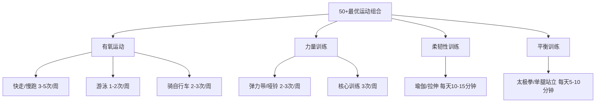
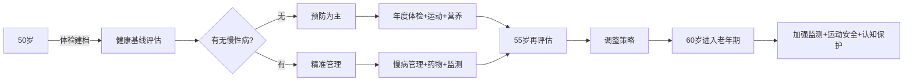

## 四、健康管理的五个核心技巧

50岁以后，健康不再是"有空再说"的事情——它是你最大的隐形资产。一场大病可以轻松吞噬几十年的积蓄，而良好的健康管理则是最高回报率的投资。本节从财务管理视角出发，提供五个可落地的健康管理核心技巧。

### 技巧1：构建年度健康预算体系

#### 为什么健康需要"预算"

很多人在50岁以后犯一个致命错误：在健康上要么过度节省（小病扛、体检逃），要么过度消费（被保健品推销、过度医疗）。这两种极端都会损害财务健康和身体健康。正确做法是像管理投资组合一样管理健康支出。

#### 年度健康预算框架

| 项目 | 年预算参考 | 说明 |
|------|-----------|------|
| 年度体检 | 1500-5000元 | 50+应包含肿瘤标志物、心脑血管筛查、骨密度 |
| 日常门诊 | 2000-5000元 | 慢性病管理、牙科、眼科等 |
| 保健品/营养补充 | 1000-3000元 | 维生素D、钙片、鱼油等基础补充剂 |
| 运动健身 | 1000-5000元 | 健身卡、游泳卡、太极拳课程等 |
| 预防性检查 | 2000-5000元 | 胃肠镜、低剂量CT、颈动脉超声等 |
| **合计** | **7500-23000元** | **约占年收入的3-8%** |

#### 预算分配原则

**"532"分配法：**
- **50%用于预防**：体检、疫苗（流感疫苗、带状疱疹疫苗、肺炎疫苗）、营养补充
- **30%用于治疗**：日常门诊、慢性病用药
- **20%用于储备**：作为大病应急金，可与医疗险自付部分共用

**关键数据**：50岁以上人群平均每年医疗支出约1.2万元（国家卫健委2023年数据），其中慢性病管理占60%以上。提前预算远好过事后被动应对。

#### 具体操作

1. **每年1月做健康预算规划**：参照上年支出，调整当年预算
2. **建立专用健康账户**：单独的银行账户或记账分类，避免与其他支出混淆
3. **每季度复盘一次**：检查预算执行情况，及时调整
4. **年末评估投入产出**：体检指标是否改善、慢性病是否控制稳定

### 技巧2：优化医疗保险配置

#### 医保是基础，但远远不够

基本医保的报销存在三个重大缺口：
- **起付线以下**：门诊起付线通常1300-2000元/年
- **封顶线以上**：基本医保年度封顶通常20-30万元
- **目录外费用**：进口药、靶向药、先进治疗手段很多不在目录内

50岁以上人群必须构建"医保+商保+自保"三层保障体系。

#### 三层保障体系详解

**第一层：基本医保（基础层）**
- 确保医保不断缴，连续缴费年限影响报销比例
- 门诊慢特病认定：高血压、糖尿病等可申请门诊慢特病待遇，报销比例提高到70-85%
- 大病医保：无需额外缴费，自动叠加，报销比例再提升10-15%

**第二层：商业保险（增强层）**

| 险种 | 50岁年保费参考 | 必要性 | 注意事项 |
|------|---------------|--------|---------|
| 百万医疗险 | 1200-2500元 | ★★★★★ | 注意续保条件，优选保证续保20年的产品 |
| 意外险 | 200-500元 | ★★★★★ | 50+骨质疏松，摔倒风险显著增加 |
| 防癌险 | 1000-3000元 | ★★★★ | 健康告知宽松，三高人群也可投保 |
| 重疾险 | 5000-15000元 | ★★★ | 50+投保杠杆比低，需仔细计算 |

**第三层：自保基金（兜底层）**
- 专门的大病应急基金，建议10-20万元
- 可以配置在货币基金或短期债券基金中，兼顾流动性和收益
- 每年补充，如果被使用了要优先恢复

#### 医保报销的实操技巧

1. **门诊优先用医保**：很多50+人群习惯门诊自费，实际门诊报销比例已提高到50-70%
2. **异地就医提前备案**：在国家医保服务平台APP上备案，报销比例不降低
3. **集采药品优先**：集中采购药品质量有保障，价格低60-90%
4. **慢性病长处方**：符合条件的慢性病可开12周长处方，减少就诊次数
5. **商业保险理赔要主动**：确诊后第一时间报案，保留所有原始票据

#### 常见误区

- ❌ "我还健康不需要商保"——50岁是最后的投保窗口期，等到体检异常就买不了了
- ❌ "重疾险保额越高越好"——50+重疾险保费高、杠杆比低，百万医疗险性价比更高
- ❌ "有了医保就够了"——一场癌症治疗平均花费30-50万，医保只能覆盖50-60%
- ❌ "保险是骗人的"——关键是选对产品、看清楚条款，正规理赔率超过97%

### 技巧3：慢性病的"精准管理"策略

#### 50+慢性病的经济影响

50岁以上人群慢性病患病率超过75%（中国疾控中心数据）。最常见的慢性病及其年度管理成本：

| 慢性病 | 年均管理费用 | 主要费用构成 |
|--------|------------|-------------|
| 高血压 | 3000-8000元 | 降压药、血压监测、定期复查 |
| 糖尿病 | 5000-15000元 | 降糖药/胰岛素、血糖监测、并发症筛查 |
| 冠心病 | 8000-30000元 | 药物、支架术后随访、心脏康复 |
| 骨质疏松 | 2000-6000元 | 钙片、维生素D、骨密度检查 |
| 慢阻肺 | 3000-10000元 | 吸入剂、肺功能检查、急性发作治疗 |

#### 精准管理四步法

**第一步：全面评估（每年1次）**
- 完整的血液检查（血糖、血脂、肝肾功能、甲状腺功能）
- 心脑血管风险评估（颈动脉超声、心电图、心脏超声）
- 肿瘤标志物筛查（PSA、AFP、CEA、CA19-9）
- 骨密度检测（双能X线吸收法）
- 眼底检查（糖尿病视网膜病变早期发现）

**第二步：制定管理计划**

以高血压为例的年度管理计划：
- 每日：定时服药、早晚测量血压并记录
- 每月：自测数据汇总，血压波动超过10mmHg时联系医生
- 每季度：复查血脂、血糖、肾功能
- 每年：心脏超声、颈动脉超声、眼底检查

**第三步：数字化工具辅助**

推荐工具：
- **血压/血糖记录**：用APP记录每日数据，生成趋势图供医生参考
- **用药提醒**：设置手机闹钟或使用智能药盒，避免漏服
- **在线复诊**：慢性病稳定的复诊可通过互联网医院完成，省时省力
- **健康档案**：建立个人电子健康档案，保存所有检查报告

**第四步：效果评估与调整**
- 控制达标率：血压<140/90mmHg、空腹血糖<7.0mmol/L、LDL-C<2.6mmol/L
- 如果连续3个月不达标，需调整用药方案
- 每年评估一次是否需要升级治疗

#### 慢性病管理的省钱策略

1. **优先使用集采药品**：集采降压药（氨氯地平）约1.5元/片，非集采品牌约5-8元/片，药效等价
2. **门诊慢特病认定**：认定后报销比例提高到70-85%，年节省数千元
3. **互联网医院复诊**：挂号费低至0-10元，药品可快递到家
4. **社区卫生服务中心**：配药方便、免挂号费、部分检查免费
5. **加入患者管理项目**：三甲医院的慢病管理项目通常免费，还能获得专家指导

### 技巧4：运动投资的"最优解"

#### 运动是最划算的投资

哈佛大学公共卫生学院研究表明，每周150分钟中等强度运动可以：
- 降低心血管疾病风险35%
- 降低2型糖尿病风险40%
- 降低结肠癌风险30%
- 降低全因死亡率约30%
- 年均节省医疗费用约4000-8000元

50+人群运动的核心原则是**安全第一、坚持第二、强度第三**。

#### 最优运动组合方案

**推荐周计划：**

| 星期 | 运动内容 | 时长 | 强度 |
|------|---------|------|------|
| 周一 | 快走+拉伸 | 40分钟+10分钟 | 中等 |
| 周二 | 弹力带力量训练 | 30分钟 | 中低 |
| 周三 | 游泳或骑车 | 30-45分钟 | 中等 |
| 周四 | 休息或散步 | 20分钟 | 低 |
| 周五 | 力量训练+平衡训练 | 30分钟+10分钟 | 中等 |
| 周六 | 太极拳/瑜伽 | 45分钟 | 低-中 |
| 周日 | 户外快走/爬山 | 60分钟 | 中等 |

#### 运动安全注意事项

**运动前必做的三件事：**
1. **心肺功能评估**：运动平板试验或心肺运动试验，排除运动禁忌
2. **骨关节评估**：膝关节、腰椎X光片，明确运动限制
3. **血压/血糖监测**：确认当前状态适合运动

**危险信号——立即停止运动并就医：**
- 运动中胸痛、胸闷、心悸
- 头晕、眼前发黑、呼吸困难
- 关节突发剧痛
- 血压异常升高（>180/110mmHg）

#### 运动投资的经济账

| 运动方式 | 年费用 | 设备投入 | 适合人群 |
|---------|--------|---------|---------|
| 快走/慢跑 | 200-500元（跑鞋） | 一双跑鞋 | 几乎所有人 |
| 游泳 | 2000-4000元 | 泳衣泳镜 | 关节不好的人群 |
| 太极拳 | 0-2000元 | 无 | 平衡能力差的人群 |
| 健身房 | 2000-5000元 | 无 | 需要器械辅助的人群 |
| 瑜伽 | 1000-3000元 | 瑜伽垫 | 柔韧性差的人群 |
| 乒乓球/羽毛球 | 500-2000元 | 球拍 | 喜欢社交运动的人群 |

### 技巧5：心理健康管理与认知保护

#### 心理健康是50+人群的"隐形危机"

50岁以后面临多重心理压力：
- **角色转换**：从职场主力到退休，自我价值感下降
- **子女独立**：空巢期的孤独感
- **身体衰退**：对衰老和疾病的焦虑
- **社交减少**：退休后社交圈急剧缩小
- **经济焦虑**：对退休金够不够用的担忧

中国精神卫生调查显示，50岁以上人群抑郁障碍患病率约4.5%，焦虑障碍约5.2%，且就诊率不足10%。

#### 认知保护的五维策略

**维度一：社交网络维护**
- 保持至少3-5个深度社交关系
- 每周至少参加1次集体活动（社区活动、兴趣小组、志愿服务）
- 学会使用微信视频通话等工具保持与远方亲友的联系
- 社交活跃的老年人认知衰退速度降低约40%（Lancet 2020）

**维度二：持续学习**
- 学习新技能：乐器、书法、摄影、外语、编程
- 阅读：每天30分钟以上，纸质书优于电子书
- 参加课程：老年大学、线上课程（费用通常很低或免费）
- 学习新事物能增加大脑神经突触连接，延缓认知衰退

**维度三：情绪管理**
- **正念冥想**：每天10-15分钟，降低焦虑和抑郁风险
- **写日记**：记录感恩事件，提升积极情绪
- **心理咨询**：出现持续2周以上的低落情绪时，及时寻求专业帮助
- 心理咨询费用参考：200-500元/次，互联网平台可低至100元/次

**维度四：睡眠管理**
- 50+人群理想睡眠时间：7-8小时/天
- 睡眠不足6小时：心血管风险增加20%，认知衰退风险增加30%
- 睡眠超过9小时：可能预示其他健康问题，需排查
- 实操建议：固定作息时间、卧室温度18-22℃、睡前1小时不看屏幕

**维度五：认知训练**
- 数独、象棋、桥牌等策略性游戏
- 学习新语言（多语使用者阿尔茨海默症发病平均延迟4-5年）
- 手工制作（编织、木工、园艺）锻炼精细运动和空间思维
- 每天15-30分钟的认知训练即可

#### 心理健康管理的投入产出

| 投入项目 | 年费用 | 预期回报 |
|---------|--------|---------|
| 社交活动 | 1000-3000元 | 降低抑郁风险50%，延缓认知衰退 |
| 兴趣学习 | 500-3000元 | 增强自我价值感，丰富退休生活 |
| 心理咨询 | 0-5000元 | 及时处理情绪问题，避免恶化 |
| 认知训练 | 0-500元 | 延缓认知衰退2-5年 |
| 定期脑健康检查 | 500-1500元 | 早期发现认知问题，及时干预 |

### 综合健康管理路线图

### 本节核心要点回顾

1. **健康需要预算**：年预算占收入3-8%，按"532"分配（预防50%、治疗30%、储备20%）
2. **医保是基础但不够**：构建"医保+商保+自保"三层保障体系
3. **慢性病要精准管理**：全面评估→制定计划→数字化工具→效果评估四步法
4. **运动是最划算的投资**：每周150分钟中等强度运动，安全第一
5. **心理健康同样重要**：社交、学习、情绪、睡眠、认知五维保护

> **关键数据**：健康管理做得好的50+人群，平均每年可节省医疗支出4000-8000元，同时提升生活质量，延长健康寿命5-10年。这不是花钱，而是用最小的成本保护你最大的资产——健康。
