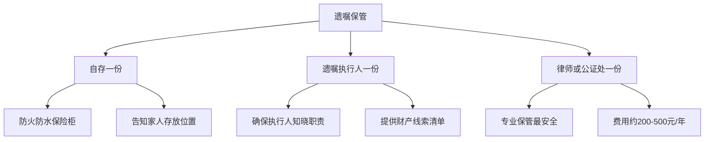
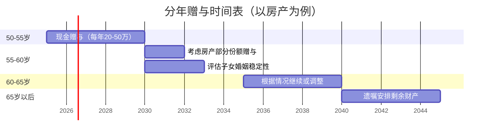
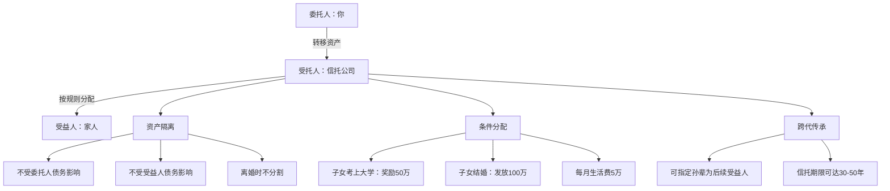
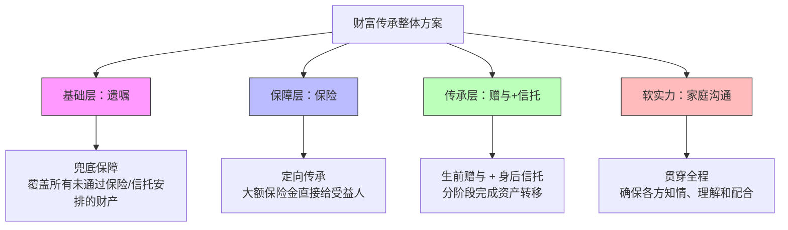

## 五、财富传承的五个核心技巧

财富传承不是"临终前安排一下"那么简单。它是一套系统工程，涉及法律、税务、保险、信托、家庭关系等多个维度。很多家庭因为传承规划缺失，导致亲人反目、资产缩水、甚至官司缠身。根据中国裁判文书网的数据，2023年全国继承纠纷案件超过12万件，其中超过60%的纠纷源于"没有遗嘱"或"遗嘱无效"。

本节将五个核心技巧逐一拆解，从法律依据到实操步骤，从入门方案到进阶策略，帮助你构建一套完整的财富传承体系。

---

### 技巧1：遗嘱制定——传承的法律基石

遗嘱是财富传承的基础工具。没有遗嘱，遗产将按法定继承分配，这往往与被继承人的真实意愿相去甚远。

#### 1.1 为什么必须立遗嘱

先看一个真实场景：老王有两段婚姻，与前妻育有一女，与现任妻子育有一子。老王去世时名下有一套市值500万的房产和200万存款，没有遗嘱。按照法定继承，现任妻子、女儿、儿子三人各得约233万。但老王生前曾多次表示"房子留给儿子"，女儿也已出嫁且经济条件好。没有遗嘱，老王的口头意愿毫无法律效力。

**法定继承的顺序（《民法典》第1127条）：**

| 顺序 | 继承人 | 说明 |
|:---:|------|------|
| 第一顺序 | 配偶、子女、父母 | 同一顺序继承人一般均分 |
| 第二顺序 | 兄弟姐妹、祖父母、外祖父母 | 仅在无第一顺序继承人时继承 |

法定继承的问题在于：它不考虑被继承人的意愿、继承人的实际需求、以及家庭关系的复杂性。遗嘱的作用，就是把"法律规定"替换为"我的意愿"。

#### 1.2 五种遗嘱形式的对比与选择

《民法典》规定了七种遗嘱形式，实际常用的有五种。每种形式的法律效力相同，但可靠性、成本、操作难度差异很大：

| 遗嘱形式 | 法律依据 | 要件要求 | 优点 | 缺点 | 适用场景 |
|---------|---------|---------|------|------|---------|
| 自书遗嘱 | 第134条 | 亲笔书写全文、签名、注明年月日 | 零成本、私密性强 | 笔迹鉴定风险、易被质疑 | 财产关系简单的家庭 |
| 代书遗嘱 | 第135条 | 两个以上见证人在场，其中一人代书，注明日期，代书人、其他见证人和遗嘱人签名 | 解决书写困难 | 见证人选择有讲究 | 书写困难的老年人 |
| 打印遗嘱 | 第136条 | 两个以上见证人在场，遗嘱人和见证人逐页签名并注明日期 | 清晰易读 | 2021年新增形式，实务判例少 | 遗嘱内容较多 |
| 录音录像遗嘱 | 第137条 | 两个以上见证人在场，遗嘱人和见证人记录姓名或肖像及日期 | 直观、可记录精神状态 | 技术保存要求高 | 需要证明遗嘱人神志清醒 |
| 公证遗嘱 | 第138条 | 经公证机构公证 | 法律效力最有保障 | 费用较高（200-500元）、需到场 | 高价值财产、家庭关系复杂 |

**关键提醒：** 2021年《民法典》取消了"公证遗嘱效力优先"的规定。现在多份遗嘱冲突时，以最后一份为准（第1142条）。这意味着你不需要为了修改遗嘱再去公证处，但同时也意味着你需要妥善保管遗嘱并告知家人。

#### 1.3 遗嘱的必备要素与模板

一份有效的遗嘱必须包含以下内容：

```text
遗  嘱

立遗嘱人：[姓名]，[性别]，[出生日期]，[身份证号]，住址：[详细地址]

本人头脑清醒，具有完全民事行为能力，特立此遗嘱，对本人所有的财产作如下处分：

一、财产清单
1. 不动产：位于[地址]的房产一套（房产证号：[证号]），建筑面积[面积]㎡
2. 银行存款：[银行名称]账号[账号]，截至立遗嘱日余额约[金额]元
3. 投资资产：[证券账户/基金/股票等详情]
4. 其他财产：[车辆、贵重物品、知识产权等]

二、分配方案
1. 位于[地址]的房产由[继承人姓名]（身份证号：[号码]）继承
2. 银行存款[金额]元由[继承人姓名]继承
3. [其他分配事项]

三、遗嘱执行人
指定[执行人姓名]（身份证号：[号码]，与本人关系：[关系]）为本遗嘱执行人。

四、附注
[特殊条件、未尽事宜说明]

本遗嘱一式[份数]份，分别由[保管人]各执一份。

立遗嘱人（签名）：___________
日    期：____年____月____日

见证人（签名）：___________    身份证号：___________
见证人（签名）：___________    身份证号：___________
```

#### 1.4 遗嘱的六大常见误区

| 误区 | 真实情况 | 后果 |
|------|---------|------|
| "口头说说就行" | 口头遗嘱仅在危急情况有效，危急解除后若能以书面或录音录像形式立遗嘱，口头遗嘱失效（第1138条） | 意愿无法执行 |
| "夫妻共立一份遗嘱" | 遗嘱必须由遗嘱人独立作出，夫妻共同遗嘱在法律上存在争议 | 可能被认定无效 |
| "把财产留给孙子" | 孙辈不属于法定继承人，需要用遗赠（第1133条第3款），受遗赠人需在知道后60日内表示接受 | 未及时接受视为放弃 |
| "遗嘱写了就万事大吉" | 遗嘱需要妥善保管，且定期更新（财产变动、继承人情况变化时） | 找不到遗嘱或内容过时 |
| "处分了不属于自己的财产" | 只能处分个人财产，夫妻共同财产中只能处分自己的份额（第1153条） | 该部分处分无效 |
| "见证人随便找" | 见证人不能是继承人、受遗赠人，也不能是与继承人有利害关系的人（第1140条） | 遗嘱可能无效 |

#### 1.5 遗嘱保管与更新

**保管方案：**



**更新触发条件：**
- 财产发生重大变化（买卖房产、大额投资）
- 继承人情况变化（出生、死亡、婚姻变动）
- 家庭关系变化（离婚、再婚、关系恶化）
- 每隔3-5年定期审视一次

---

### 技巧2：保险传承——杠杆放大传承金额

保险是被严重低估的传承工具。它的核心优势在于：用相对小的保费撬动大额的保险金，且保险金直接给付给指定受益人，不进入遗产分配程序，不受被继承人生前债务影响。

#### 2.1 保险传承的法律基础

根据《保险法》第42条，被保险人死亡后，有指定受益人的保险金不属于被保险人的遗产。这意味着：

- **债务隔离**：被继承人生前有债务的，保险金不需要先偿还债务
- **避免纠纷**：保险金直接打给受益人，不参与遗产分割
- **私密性强**：保险合同不需要公开，受益人领取保险金也不需要其他继承人同意

#### 2.2 适合传承的保险产品对比

| 产品类型 | 适合人群 | 传承功能 | 杠杆率 | 灵活性 | 年缴保费参考 |
|---------|---------|---------|:------:|:------:|-----------|
| 定额终身寿险 | 中高净值、资产明确 | 定向传承、债务隔离 | 中等（1.5-3倍） | 低 | 30-50岁：年缴3-10万 |
| 增额终身寿险 | 中等收入、长期规划 | 复利增值、灵活减保 | 低（1-1.5倍） | 高 | 年缴1-5万 |
| 大额年金险 | 需要终身现金流 | 定期给付、防止挥霍 | 无杠杆 | 中 | 年缴10-100万 |
| 保险金信托 | 高净值家庭 | 保险+信托双重功能 | 取决于寿险 | 高 | 保费≥100万起 |

#### 2.3 保险传承的实操要点

**受益人设置——最容易被忽视的细节：**

很多投保人填写受益人时只写"法定"或"法定继承人"，这是一个常见错误。"法定受益人"意味着保险金将作为遗产处理，失去了保险传承的核心优势。

**正确做法：**

```text
受益人设置示例：
第一顺位受益人：配偶 张某（身份证号：xxx），受益比例 100%
第二顺位受益人：儿子 王某（身份证号：xxx），受益比例 60%
              女儿 王某（身份证号：xxx），受益比例 40%

注意：
- 明确写姓名+身份证号，不要只写"妻子""儿子"
- 设置多顺位受益人，防止受益人先于被保险人身故
- 定期检查并更新（离婚后务必修改！）
```

**保费来源的合法性：**

保险金可能被法院追回的情形：
- 用非法所得（贪污、诈骗）购买保险——法院可强制退保
- 恶意避债：已知即将被追债时突击投保——债权人可申请撤销
- 保费与收入明显不匹配——可能被质疑资金来源

#### 2.4 保险传承的典型案例

**案例：老张的保险传承方案**

老张，55岁，企业主，家庭资产约2000万，其中企业股权1200万、房产500万、金融资产300万。老张最担心的是：企业经营风险可能影响家庭生活，且儿子对经营企业没有兴趣。

方案设计：
- 投保增额终身寿险，年缴50万，缴5年，总保费250万
- 第一受益人：配偶（60%），第二受益人：儿子（40%）
- 保单利益：身故保额从约270万逐年递增，到80岁时现金价值约500万

方案效果：
- 企业如果经营失败需要偿债，保单现金价值在一定条件下受到保护
- 老张去世后，保险金直接给配偶和儿子，不需要走遗产程序
- 如果老张晚年需要资金，可以通过减保取出现金价值

---

### 技巧3：赠与策略——生前传承的双刃剑

赠与是生前传承的主要方式。它的核心逻辑是：在遗产税尚未开征的窗口期，通过分年、分批赠与，将资产提前转移到下一代名下。

#### 3.1 赠与的税务现状

**当前中国赠与相关税费：**

| 赠与标的 | 税费项目 | 说明 |
|---------|---------|------|
| 现金 | 无税费 | 直接转账即可，但单笔超过5万需银行报备 |
| 房产（直系亲属间） | 契税3%、印花税0.05% | 免征增值税和个人所得税 |
| 房产（非直系亲属间） | 契税3%、个税20%、增值税（视情况） | 税费较高，不如买卖划算 |
| 股权（直系亲属间） | 印花税0.05% | 免征个人所得税 |
| 车辆 | 过户费约200-800元 | 需办理过户手续 |

**与继承的税费对比：**

目前中国尚未开征遗产税和赠与税（直系亲属间），但未来政策存在不确定性。以下是直系亲属间房产转移的三种方式对比：

| 方式 | 契税 | 个税 | 增值税 | 适用场景 |
|------|:----:|:----:|:------:|---------|
| 赠与 | 3% | 免 | 免 | 子女无购房资格时 |
| 买卖 | 1-3% | 满五唯一免 | 满二免 | 子女有购房资格 |
| 继承 | 免 | 免 | 免 | 被继承人去世后 |

#### 3.2 赠与的时机与节奏

赠与不是"一次性给完"，而是需要精心规划节奏。

**分年赠与策略：**



**不同资产的赠与策略：**

| 资产类型 | 推荐赠与时机 | 策略要点 |
|---------|------------|---------|
| 现金 | 子女结婚/购房/创业时 | 每次控制金额，避免一次性大额 |
| 房产 | 子女婚姻稳定3年以上 | 先赠与部分份额，观察后再赠与剩余 |
| 股权 | 企业经营稳定期 | 转让而非赠与，注意控制权保留 |
| 保险 | 越早越好 | 为子女投保，受益人写孙辈 |

#### 3.3 赠与的三大风险及应对

**风险一：子女婚姻风险**

赠与子女的财产，在子女离婚时可能被认定为夫妻共同财产（尤其是房产加名、现金混同的情况）。

应对措施：
- 赠与时签订书面赠与协议，明确"仅赠与[子女姓名]个人，不作为其夫妻共同财产"
- 房产只写子女一人名字，不要加配偶名
- 现金转入子女个人账户，不要进入夫妻联名账户
- 必要时建议子女签订婚前/婚内财产协议

**风险二：赠与后失去控制权**

财产一旦赠与出去，法律上就不再属于你。如果子女不孝、挥霍或被诈骗，你无法收回。

应对措施：
- 采用"附条件赠与"：在赠与协议中约定条件（如赡养义务、不得转让等）
- 分批赠与而非一次性给完
- 对于大额资产，优先考虑信托而非直接赠与
- 保留足够的养老资金，不要"倾囊相授"

**风险三：税务政策变化**

虽然目前直系亲属间赠与税负较轻，但未来政策可能调整。

应对措施：
- 关注政策动向，抓住当前窗口期
- 保留完整的赠与凭证（合同、转账记录、完税证明）
- 对于大额资产，咨询专业税务师

#### 3.4 赠与协议模板

```text
赠与协议

赠与人：[姓名]（身份证号：[号码]）
受赠人：[姓名]（身份证号：[号码]）

鉴于赠与人与受赠人为[父子/母子/父女/母女]关系，赠与人自愿将以下财产赠与受赠人：

一、赠与财产
[详细描述财产，包括名称、数量、价值、权属证明编号等]

二、赠与条件
1. 本赠与仅赠与受赠人个人，不作为受赠人的夫妻共同财产
2. 受赠人应履行对赠与人的赡养义务
3. [其他条件]

三、交付方式
[现金转账/房产过户/股权变更登记等]

四、税费承担
因本次赠与产生的税费，由[赠与人/受赠人/双方各半]承担

五、其他约定
[违约责任、争议解决方式等]

赠与人（签名）：___________    日期：___________
受赠人（签名）：___________    日期：___________
```

---

### 技巧4：家族信托入门——高净值家庭的终极方案

家族信托是目前最强大的传承工具，它能实现资产隔离、跨代传承、条件分配、专业管理等多重功能。但它的门槛也最高，不适合所有家庭。

#### 4.1 家族信托的核心原理

家族信托的本质是：你（委托人）把资产交给信托公司（受托人），由信托公司按照你设定的规则管理和分配给受益人。资产一旦进入信托，法律上就不再属于你，因此可以实现：



#### 4.2 家族信托的门槛与成本

| 项目 | 传统家族信托 | 保险金信托 | 家庭服务信托 |
|------|:----------:|:---------:|:----------:|
| 最低设立金额 | 1000万 | 保额≥100万 | 100万 |
| 信托管理费 | 0.5-1%/年 | 0.3-0.5%/年 | 0.5-1%/年 |
| 设立费用 | 5-20万 | 1-5万 | 1-3万 |
| 信托期限 | 5-50年 | 与保单期限一致 | 5-30年 |
| 适合人群 | 超高净值 | 中高净值 | 中等收入 |
| 资产类型 | 现金、股权、房产等 | 保险金 | 现金为主 |

#### 4.3 保险金信托——中产家庭的平替方案

对于资产规模达不到1000万但又想享受信托功能的家庭，保险金信托是最优解。

**运作模式：**

```text
投保人（你）
    │
    ▼
投保终身寿险/年金险（保额≥100万）
    │
    ▼
将保险金请求权装入信托（签订信托合同）
    │
    ▼
保险事故发生后，保险金进入信托账户
    │
    ▼
信托公司按你的规则分配给受益人
```

**保险金信托的优势：**
- 门槛低：100万保额即可，年缴保费可能只需3-5万
- 杠杆效应：用300万保费撬动1000万保额进入信托
- 分配灵活：可设定复杂的分配条件
- 税务优势：保险金进入信托可能享受税收优惠

#### 4.4 家族信托设立的关键决策

**决策一：信托架构设计**

| 架构类型 | 特点 | 适用场景 |
|---------|------|---------|
| 可撤销信托 | 委托人保留修改和撤销权 | 初次设立、想保留灵活性 |
| 不可撤销信托 | 设立后不可更改，资产隔离效果最强 | 资产保护需求强烈 |
| 保护性信托 | 受益人权益受保护，防止挥霍 | 子女理财能力弱 |
| 激励性信托 | 达成条件才分配，鼓励正向行为 | 希望激励子女上进 |

**决策二：受益人条款设计**

这是信托设计中最核心也最考验智慧的部分。一个好的受益人条款需要平衡"保障"和"激励"：

```text
受益人条款设计示例：

一、基本生活保障
受益人每月可领取生活费2万元，每年根据CPI调整

二、教育激励
1. 考取国内985/211高校：一次性奖励30万
2. 考取海外QS前100高校：一次性奖励50万
3. 取得硕士/博士学位：一次性奖励20万

三、创业支持
受益人年满25周岁后，可申请创业资金，上限100万，需提交商业计划书

四、婚育奖励
1. 结婚：一次性发放50万
2. 生育：每生育一孩发放20万

五、限制条款
1. 受益人涉及违法犯罪的，暂停分配
2. 受益人有赌博、吸毒等恶习的，暂停分配直至康复
3. 受益人被宣告破产的，分配款项用于偿还债务后的余额归受益人
```

#### 4.5 选择信托公司的注意事项

- **牌照资质**：确认持有银保监会颁发的信托牌照
- **管理规模**：家族信托管理规模越大，经验越丰富
- **投资能力**：了解信托公司的投资业绩和风控体系
- **服务团队**：是否有专属的信托经理和法律团队
- **费用透明度**：管理费、设立费、终止费是否清晰
- **信息化水平**：是否有在线查询系统，能否实时查看信托资产

---

### 技巧5：家庭财务沟通——传承成功的隐性关键

前面四个技巧都是"硬工具"，而家庭沟通是"软实力"。很多传承失败不是因为工具不对，而是因为沟通不到位——子女不知道有什么财产、不知道父母的意愿、甚至因为误解产生纠纷。

#### 5.1 为什么沟通比工具更重要

一组数据说明问题：
- 70%的财富传承失败源于家庭内部沟通不畅（数据来源：招商银行私人银行调研）
- 80%的遗产纠纷发生在"没有事先沟通"的家庭
- 65%的富二代表示"从未与父母讨论过财富传承话题"

#### 5.2 沟通的内容框架

**必须沟通的六个话题：**

| 话题 | 沟通内容 | 沟通目的 |
|------|---------|---------|
| 财产状况 | 大致的资产规模、主要资产类型、存放位置 | 让子女知道"有什么" |
| 传承意愿 | 你希望财产如何分配、为什么这么分 | 让子女理解"为什么" |
| 法律文件 | 遗嘱位置、保险合同、信托协议、律师联系方式 | 让子女知道"在哪里" |
| 应急方案 | 你突然失能或去世时的处理流程 | 让子女知道"怎么做" |
| 期望与担忧 | 对子女的期望、对财产被挥霍的担忧 | 建立双向理解 |
| 家庭价值观 | 财富观、消费观、教育观 | 传承的不仅是钱，更是价值观 |

#### 5.3 沟通的实操方法

**方法一：家庭财务会议**

建议每半年或一年召开一次家庭财务会议，形式可以是正式的，也可以是轻松的家庭聚餐。

```text
家庭财务会议议程（参考模板）

时间：[日期] [时间]
地点：[家中/餐厅/度假时]
参会人：[家庭成员名单]

一、开场（10分钟）
- 明确会议目的：不是讨论"谁拿多少"，而是"如何让家庭财富更好地服务于每个人"

二、财务状况更新（20分钟）
- 家庭资产概况（可以不透露具体数字，只讲大致规模和趋势）
- 近期重大财务决策及其原因
- 下一年的财务计划

三、传承规划讨论（30分钟）
- 遗嘱/保险/信托的最新安排
- 各方的想法和建议
- 需要调整的地方

四、家庭价值观讨论（20分钟）
- 子女的职业规划和财务状况
- 对第三代（孙辈）的教育规划
- 家庭慈善或公益计划

五、行动项确认（10分钟）
- 会议决议
- 各方待办事项
- 下次会议时间
```

**方法二：一对一深度对话**

有些敏感话题（如"为什么给哥哥多给妹妹少"）不适合在家庭会议上公开讨论，更适合一对一沟通。

一对一沟通的要点：
- 选择轻松的环境（散步、喝茶、旅行途中）
- 先倾听再表达，了解对方的真实想法
- 解释决策背后的原因，而不是简单通知结果
- 允许对方有情绪，不要急于"说服"
- 必要时引入第三方（律师、理财顾问）提供专业解释

**方法三：书面文件清单**

不管口头沟通多么充分，书面文件都是必须的。建议准备一份《家庭重要文件清单》：

```text
家庭重要文件清单

存放位置：[保险柜/律师处/银行保管箱]

一、法律文件
□ 遗嘱（原件）                              保管人：___________
□ 赠与协议（原件）                          保管人：___________
□ 信托合同（原件）                          保管人：___________
□ 婚前/婚内财产协议（如有）                  保管人：___________

二、保险文件
□ 人寿保险合同及保单                        保管人：___________
□ 健康保险合同                              保管人：___________
□ 保险受益人指定文件                        保管人：___________

三、财产证明
□ 房产证                                    存放位置：___________
□ 车辆登记证                                存放位置：___________
□ 银行卡及存折                              存放位置：___________
□ 证券账户信息                              存放位置：___________
□ 股权证明/公司章程                         存放位置：___________

四、个人信息
□ 身份证复印件                              存放位置：___________
□ 户口本                                    存放位置：___________
□ 结婚证                                    存放位置：___________
□ 社保卡及密码                              存放位置：___________

五、专业顾问联系方式
□ 律师：___________    电话：___________
□ 理财顾问：___________    电话：___________
□ 会计师：___________    电话：___________
□ 信托经理：___________    电话：___________
```

#### 5.4 沟通中的常见难题与应对

| 难题 | 应对策略 |
|------|---------|
| "谈钱伤感情" | 从家庭价值观切入，先讨论"财富的意义"，再讨论"如何分配" |
| 子女对分配方案不满 | 解释决策背后的逻辑（而非权威），允许提出替代方案，必要时引入第三方调解 |
| 子女之间互相攀比 | 强调"公平不等于平均"，根据各子女的实际需求差异化分配 |
| 配偶不配合 | 先与配偶达成共识，再一起与子女沟通，避免单方面通知 |
| 担心子女知道后不努力 | 采用"激励型信托"，将分配与成就挂钩 |
| 不知道何时开始 | 越早越好，可以从小金额赠与开始，逐步建立沟通习惯 |

---

### 五个技巧的协同应用

这五个技巧不是孤立的，而是可以组合使用的。一个完整的传承方案通常是多个工具的组合：



**不同资产规模的推荐方案：**

| 家庭资产规模 | 推荐方案 | 预算建议 |
|:----------:|---------|---------|
| 100万以下 | 遗嘱（自书或公证）+ 指定受益人的保险 | 保险保费占资产5-10% |
| 100-500万 | 遗嘱 + 终身寿险 + 分年赠与 | 保险保费占资产10-15% |
| 500-1000万 | 遗嘱 + 保险金信托 + 房产赠与 | 保险+信托费用占资产3-5% |
| 1000万以上 | 遗嘱 + 家族信托 + 保险 + 赠与组合 | 信托管理费约0.5-1%/年 |

---

### 常见误区总结

| 误区 | 正确认知 |
|------|---------|
| "我还年轻，不用急" | 越早规划成本越低、选择越多，意外不等人 |
| "有钱人才需要传承规划" | 一套房产、几百万存款也需要，否则法定继承可能违背你的真实意愿 |
| "立了遗嘱就不用管了" | 遗嘱需要定期更新，且不能替代保险和信托的功能 |
| "保险是骗人的" | 选对产品、正确设置受益人，保险是成本最低的传承杠杆工具 |
| "信托门槛太高" | 保险金信托100万保额即可，年缴保费可能只需几万 |
| "跟孩子谈钱不好意思" | 不谈才是最大的风险，沉默会导致误解和纠纷 |
| "给子女的钱越多越好" | 没有规划的大额赠与可能害了子女（挥霍、婚姻风险） |
| "传承规划找律师就行了" | 律师解决法律问题，但传承还涉及税务、保险、投资、家庭关系等维度 |

---

### 进阶：传承规划的动态管理

传承规划不是"一劳永逸"的，而是需要持续管理的动态过程。

**年度审视清单：**

```text
□ 遗嘱内容是否需要更新？（财产变动、继承人变化）
□ 保险受益人是否需要调整？（离婚、再婚、新增子女）
□ 信托条款是否需要修订？（受益人情况变化、分配条件调整）
□ 赠与计划是否在按节奏执行？
□ 家庭沟通是否定期进行？
□ 税务政策是否有变化需要应对？
□ 专业顾问团队是否需要更新？
□ 重要文件是否安全且家人知道位置？
```

**触发即时更新的事件：**
- 婚姻状况变化（结婚、离婚、丧偶）
- 家庭成员变化（出生、死亡、收养）
- 财产重大变动（买卖房产、企业上市、大额投资）
- 法律政策变化（遗产税立法、税法修订）
- 健康状况重大变化（重病确诊、失能风险）

---

传承不是终点，而是爱的延续。一个好的传承规划，不仅能保护家人的物质生活，更能传递你的价值观和人生智慧。从今天开始，哪怕只是写一份自书遗嘱、做一次家庭谈话，都是向正确的方向迈出的一步。
