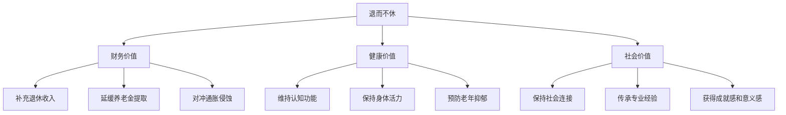
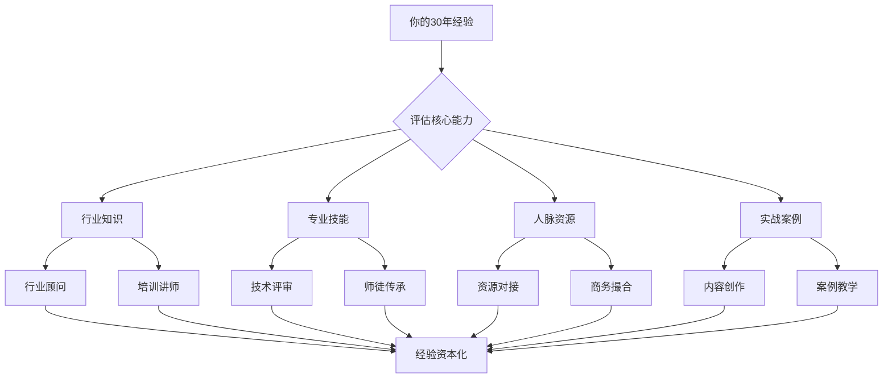
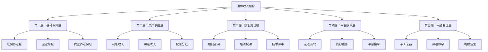
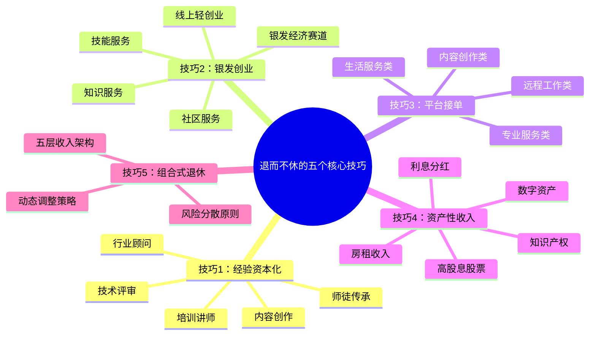

## 六、"退而不休"的五个核心技巧

### 为什么"退而不休"是50+人群的关键策略？

退休不等于停止创造价值。对于50岁以上的人群来说，"退而不休"不仅是补充收入的手段，更是维持身心健康、保持社会连接、实现人生价值的重要方式。日本厚生劳动省2023年的研究显示，退休后继续从事适度工作的人群，其认知衰退速度比完全退休者慢40%，抑郁发生率低55%。

"退而不休"的核心逻辑可以用一个公式表达：

> **退而不休 = 经验资本化 + 时间自由化 + 收入多元化**

你积累了30年的行业经验、人脉资源和专业技能，这些都是"经验资本"。退休后，你不再需要朝九晚五地出卖时间，而是可以选择性地将这些资本变现——以更灵活的方式、更少的时间投入、更高的单位时间回报。

#### 退而不休的三重价值

**财务价值：** 假设你退休后每月养老金5000元，如果通过"退而不休"额外获得3000-8000元/月的收入，不仅生活质量大幅提升，还可以延迟提取个人养老储蓄，让复利继续工作。按年化5%计算，延迟5年提取100万本金，最终多出约28万元收益。

**健康价值：** 《柳叶刀》2022年发表的一项追踪15万人的纵向研究表明，退休后保持适度工作（每周15-25小时）的人群，其全因死亡率比完全退休者低23%。适度工作提供了结构化的日常生活、社交互动和认知刺激——这三者是预防老年痴呆的关键因素。

**社会价值：** 退休后最大的挑战之一是社会角色的丧失。从"某公司经理"变成"退休老头"，这种身份转变带来的心理落差远超想象。继续从事有意义的工作，可以保持社会身份认同，获得尊重和成就感。

#### "退而不休" vs "退而不敢休"

必须区分两种情况：

| 维度 | 退而不休（主动选择） | 退而不敢休（被动无奈） |
|------|-------------------|---------------------|
| 动机 | 追求价值实现和生活充实 | 经济压力被迫继续工作 |
| 心态 | 从容、有选择权 | 焦虑、缺乏安全感 |
| 工作类型 | 可自主选择，匹配兴趣 | 被迫接受，不挑工作 |
| 时间安排 | 灵活自主，想停就停 | 不敢停，停了就没收入 |
| 收入预期 | 补充性收入，非必需 | 替代性收入，必需 |
| 健康影响 | 正面，适度刺激 | 负面，过度消耗 |

本节的目标是帮你实现第一种状态——在财务安全的基础上，主动选择退而不休，而不是因为养老金不足被迫继续劳作。

---

### 技巧1：经验资本化——把30年积累变成持续收入

#### 什么是经验资本化？

经验资本化是指将你多年积累的行业知识、专业技能、人脉资源和实战经验，转化为可变现的产品或服务。这是50+人群最独特的优势——年轻人有体力和技术，但没有你30年摸爬滚打积累的"隐性知识"。

隐性知识包括：行业潜规则、关键决策的判断逻辑、危机处理的经验、人脉关系的维护技巧、对人性的深刻洞察。这些东西无法从书本上学到，也无法通过短期培训获得——它们是时间的产物，是你的核心竞争力。

#### 经验资本化的五种变现路径

**路径一：行业顾问/咨询**

这是最直接的经验变现方式。退休后以独立顾问身份为原行业企业提供咨询服务，按项目或按小时收费。

实操步骤：
1. **梳理核心能力清单**：列出你最擅长的3-5个领域，每个领域写出具体的项目经历和成果
2. **确定目标客户画像**：哪些企业会需要你的经验？通常是中小企业（大企业有自己的专家团队，中小企业请不起全职专家但愿意付咨询费）
3. **定价策略**：初级顾问500-1000元/小时，资深顾问1500-3000元/小时，行业专家3000-5000元/小时。初期可以打7折积累案例和口碑
4. **获客渠道**：前同事推荐（最有效）、行业社群、领英/脉脉、行业协会、老客户转介绍
5. **交付标准化**：将咨询流程模板化，包括需求诊断→方案设计→实施指导→效果复盘四个阶段

收入预期：兼职顾问每月8000-30000元，每周投入10-15小时。全职顾问可达50000-100000元/月，但50+人群建议控制在兼职水平，保留足够的时间享受生活。

**路径二：培训讲师**

将专业知识通过培训课程传授给年轻从业者。可以是线下企业内训、公开课，也可以是线上录制课程。

关键步骤：
1. **课程设计**：不要试图讲"大而全"的课程，聚焦你最有深度的1-2个主题。例如：不是"财务管理"，而是"制造业成本控制的20个实战陷阱"
2. **平台选择**：
   - 线下：与培训机构合作（如时代光华、中智），他们负责招生和场地，你负责授课，分成比例通常5:5或6:4（讲师拿大头）
   - 线上：得到、知乎Live、B站付费课程、小鹅通自建课程
3. **定价参考**：企业内训8000-30000元/天（含课件和答疑），线上课程199-999元/人
4. **口碑积累**：前5场培训务必做到极致，收集学员评价和推荐信，后续获客成本大幅降低

**路径三：行业写作/自媒体**

通过文字或视频分享行业洞察，建立个人品牌，最终通过广告、付费专栏、出书等方式变现。

50+人群的内容优势：
- 你经历过行业周期，能给出"穿越牛熊"的视角
- 你的案例库比年轻博主丰富10倍
- 你的分析框架经过实战检验，更有说服力

推荐平台和形式：

| 平台 | 适合内容形式 | 变现方式 | 启动难度 |
|------|------------|---------|---------|
| 微信公众号 | 深度长文、行业分析 | 广告、付费阅读、课程导流 | 低 |
| 知乎 | 问答、专栏 | 知乎付费咨询、盐选专栏 | 低 |
| 抖音/视频号 | 短视频讲解、直播 | 直播打赏、带货、广告 | 中 |
| B站 | 中长视频教程 | 充电、花火广告 | 中高 |
| 得到/喜马拉雅 | 音频课程 | 付费订阅 | 中 |
| 出版社 | 实体书 | 版税（通常8-12%） | 高 |

**路径四：技术/行业裁判**

很多行业需要资深人士担任评审、仲裁、鉴定等工作。例如：建筑工程的质量鉴定、知识产权纠纷的技术评审、招投标的专家评委、行业协会的标准制定。

这类工作通常按次或按天计费，单次500-5000元不等，且时间投入少、社会地位高。进入渠道：向当地行业协会、仲裁委员会、政府采购专家库提交申请，一般需要中级以上职称和10年以上从业经验。

**路径五：师徒制传承**

将你的技能通过"师徒制"传授给年轻人，收取学费或分成。这在传统行业中尤为有效：中医、手工艺、烹饪、园艺、书法等。

现代版师徒制可以是：
- 线下小班教学（3-5人），每人学费5000-20000元/期
- 一对一辅导，按小时收费200-500元
- "学徒制"合作：免费教学，但学徒未来接单后分成10-20%

---

### 技巧2：银发创业——低风险的"小而美"生意

#### 50+创业的独特优势

创业不等于开公司、融资、烧钱。50+人群的创业应该是"小而美"——利用现有资源，服务明确需求，控制投入成本，追求稳定现金流而非爆发式增长。

50+创业者的三大优势：
1. **信任优势**：客户天然信任年长的服务提供者，尤其在教育、健康、财务等领域
2. **资源优势**：30年积累的人脉、行业认知和客户资源，是年轻人花钱都买不到的
3. **心态优势**：不急于求成，能接受缓慢增长，决策更加稳健

#### 五个适合50+的银发创业方向

**方向一：社区服务类**

以社区为半径，提供高频、刚需的服务。这是风险最低、启动最快的创业方式。

具体项目：
- **社区团购团长**：利用微信群组织社区居民团购生鲜、日用品，佣金收入3000-8000元/月
- **家政服务中介**：连接家政服务人员和社区居民，收取中介费，月收入5000-15000元
- **社区托管班**：为双职工家庭提供孩子放学后的托管服务，每人收费1500-3000元/月
- **老年活动组织**：组织广场舞、太极拳、书法等兴趣班，每人收费200-500元/月

启动资金：5000-20000元（主要用于物料和初期推广）
回本周期：1-3个月
风险等级：★☆☆☆☆（极低）

**方向二：技能服务类**

将个人技能直接变现为服务。

具体项目：
- **烘焙/烹饪工作室**：在家制作蛋糕、卤味、特色食品，通过微信和社区推广，月收入5000-20000元
- **园艺/花艺服务**：为家庭和企业提供绿植养护、庭院设计服务，单次收费300-2000元
- **维修/手工服务**：家电维修、家具翻新、裁缝改衣等，按件收费
- **摄影服务**：证件照、全家福、活动跟拍，单次收费200-1000元

启动资金：10000-50000元（主要用于设备和材料）
回本周期：2-6个月
风险等级：★★☆☆☆（低）

**方向三：知识服务类**

将专业知识和经验转化为付费服务（详见技巧1）。这里补充一些创业形态：

- **付费社群**：建立行业交流社群，年费299-999元/人，100人即可年收入3-10万
- **一对一咨询**：通过在行、知乎等平台接单，单次咨询200-1000元
- **企业顾问团**：同时为3-5家企业提供兼职顾问服务，每家2000-5000元/月

**方向四：银发经济赛道**

服务同龄人——这是一个快速增长且竞争相对较小的市场。

具体项目：
- **老年旅游定制**：为同龄人定制慢节奏、深度体验的旅游线路，每人收费3000-10000元
- **健康养生指导**：如果你有中医、营养学、运动康复背景，可以提供个性化健康管理服务
- **适老化改造咨询**：帮助老年人家庭进行适老化改造设计，单次收费2000-10000元
- **数字技能培训**：教同龄人使用智能手机、网购、视频通话等，每人收费500-2000元/期

**方向五：线上轻创业**

利用互联网平台，以极低成本启动的创业项目。

具体项目：
- **电商代发**：在拼多多、抖音小店开店，做一件代发，无需囤货，利润率10-30%
- **内容变现**：通过公众号、头条号、百家号发布内容，获取广告分成
- **线上教育**：在网易云课堂、腾讯课堂开设技能课程，录一次卖多次

启动资金：0-5000元
回本周期：1-3个月
风险等级：★☆☆☆☆（极低）

#### 创业决策矩阵

| 创业方向 | 启动资金 | 技能要求 | 时间投入 | 收入天花板 | 风险等级 | 推荐指数 |
|---------|---------|---------|---------|----------|---------|---------|
| 社区服务 | 低 | 低 | 中 | 8000-15000元/月 | ★☆☆☆☆ | ★★★★★ |
| 技能服务 | 中 | 高 | 中 | 10000-30000元/月 | ★★☆☆☆ | ★★★★☆ |
| 知识服务 | 低 | 高 | 低 | 10000-50000元/月 | ★☆☆☆☆ | ★★★★★ |
| 银发经济 | 中 | 中 | 中 | 15000-50000元/月 | ★★☆☆☆ | ★★★★☆ |
| 线上轻创业 | 极低 | 中 | 低 | 5000-20000元/月 | ★☆☆☆☆ | ★★★★☆ |

#### 创业风险控制的四条铁律

1. **投入上限原则**：初始投入不超过家庭流动资产的10%。如果失败，不影响生活质量
2. **验证先行原则**：先用最小成本验证需求，再逐步投入。例如：先在朋友圈卖10单蛋糕，确认有人买，再投资设备
3. **止损线原则**：设定明确的止损线。连续3个月亏损或累计亏损达到预算上限，果断止损
4. **隔离原则**：创业资金与养老资金完全隔离，绝不动用养老储蓄创业

---

### 技巧3：平台接单——用碎片时间创造持续收入

#### 互联网平台为50+人群打开的新机会

互联网平台经济的最大特点是"去中心化"——你不需要全职投入，不需要办公室，不需要员工，只需要一项可交付的技能和一部智能手机。对于50+人群来说，这是最灵活的"退而不休"方式。

#### 适合50+人群的平台接单方向

**方向一：专业服务类平台**

| 平台 | 服务类型 | 收费标准 | 适合人群 |
|------|---------|---------|---------|
| 猪八戒网 | 设计、文案、营销、开发 | 500-50000元/单 | 有专业技能者 |
| 在行 | 一对一咨询 | 200-2000元/小时 | 行业专家 |
| 律图/华律 | 法律咨询 | 50-500元/次 | 退休律师 |
| 丁香医生 | 健康咨询 | 50-300元/次 | 退休医生 |
| 海棠学社 | 课程教学 | 199-999元/课 | 教师、培训师 |

**方向二：生活服务类平台**

| 平台 | 服务类型 | 收费标准 | 适合人群 |
|------|---------|---------|---------|
| 58到家 | 家政、维修 | 100-500元/次 | 有动手能力者 |
| 美团/饿了么 | 众包配送 | 5-10元/单 | 有电动车者 |
| 闪取/达达 | 跑腿代购 | 10-50元/单 | 时间灵活者 |
| 闲鱼/转转 | 二手物品交易 | 按件计 | 擅长淘货者 |

**方向三：内容创作类平台**

| 平台 | 内容形式 | 收入来源 | 门槛 |
|------|---------|---------|------|
| 头条号/百家号 | 图文、微头条 | 广告分成 | 低 |
| 抖音/快手 | 短视频 | 直播打赏、带货 | 中 |
| 小红书 | 图文笔记 | 品牌合作、带货 | 中 |
| B站 | 中长视频 | 充电、花火 | 中高 |
| 喜马拉雅 | 音频节目 | 付费订阅、广告 | 低 |
| 微信公众号 | 深度文章 | 广告、付费阅读 | 低 |

**方向四：远程工作类平台**

| 平台 | 工作类型 | 收费标准 | 适合人群 |
|------|---------|---------|---------|
| 云队友 | 远程兼职 | 3000-10000元/月 | 办公技能者 |
| 甜薪工场 | 自由职业 | 按项目计 | 专业技能者 |
| 电鸭社区 | 远程工作 | 按月/项目计 | IT从业者 |
| Toptal | 高端自由职业 | $60-150/小时 | 高级技术人员 |

#### 平台接单的实操指南

**第一步：技能盘点**

用以下表格梳理你的可变现技能：

| 技能类别 | 具体技能 | 熟练程度 | 变现方式 | 目标平台 |
|---------|---------|---------|---------|---------|
| 专业技能 | 例：财务审计 | ★★★★★ | 咨询、代账 | 在行、猪八戒 |
| 办公技能 | 例：PPT制作 | ★★★★☆ | 定制设计 | 猪八戒、闲鱼 |
| 生活技能 | 例：烘焙 | ★★★★☆ | 定制蛋糕 | 朋友圈、小红书 |
| 语言技能 | 例：英语翻译 | ★★★☆☆ | 文档翻译 | 有道翻译、Gengo |

**第二步：账号搭建**

- 头像：使用真实、专业的照片（不需要西装革履，但要干净整洁）
- 简介：突出经验年限和核心能力，例如"30年财务管理经验，曾任某上市公司CFO"
- 案例：上传3-5个代表作品或服务案例
- 评价：初期可以通过低价或免费服务获得前10个好评

**第三步：定价策略**

新手定价公式：**市场均价 × 0.7 = 起步价**

前10单打7折积累口碑，之后逐步提价到市场均价。当好评率达到95%以上、复购率超过30%时，可以溢价20-50%。

**第四步：时间管理**

50+人群的时间管理原则：
- 每天平台工作不超过4小时
- 每周至少休息2天
- 设置"不可打扰时间"（用于健身、社交、兴趣爱好）
- 使用工具自动化：自动回复、模板消息、定时发布

---

### 技巧4：资产性收入——让钱替你工作

#### 从"人赚钱"到"钱赚钱"的转变

"退而不休"不仅包括"人继续工作"，更包括"让已有的资产继续产生收入"。50+人群应该逐步从"主动收入"（用时间换钱）过渡到"被动收入"（用资产生钱）。

#### 五种适合50+的资产性收入来源

**来源一：房租收入**

如果你有多余的房产，出租是最稳定的被动收入来源。但需要注意：

关键策略：
- **长租 vs 短租**：长租省心但收益较低（年化2-3%），短租收益高（年化4-8%）但需要管理精力。50+人群建议选择长租，或者委托给专业托管公司
- **以租养老**：如果只有一套自住房，可以考虑"以房养老"（反向抵押贷款），将房产价值转化为每月现金流。目前中国已有保险公司提供此类产品，60岁以上老人可将房产抵押给保险公司，每月领取养老金，去世后保险公司处置房产
- **REITs基金**：如果没有多余房产，可以通过公募REITs基金间接投资不动产，年化分红4-8%，门槛低（1000元起）

**来源二：利息和分红收入**

构建一个稳定的"利息收入组合"：

| 产品类型 | 预期年化收益 | 风险等级 | 流动性 | 推荐配置比例 |
|---------|------------|---------|-------|------------|
| 国债 | 2.5-3.5% | 极低 | 中 | 30% |
| 大额存单 | 2.5-3.0% | 极低 | 低 | 20% |
| 高等级债券基金 | 3-5% | 低 | 高 | 20% |
| 红利指数基金 | 4-6% | 中 | 高 | 15% |
| REITs基金 | 4-8% | 中 | 高 | 15% |

假设你有200万金融资产，按上述配置，年收入约7-10万元，折合每月6000-8000元。

**来源三：知识产权收入**

如果你曾经出版过书籍、申请过专利、开发过软件、创作过作品，这些知识产权可以在退休后继续产生收入：
- 书籍版税：每年几千到几万元
- 专利授权费：取决于行业和专利质量，每年几千到几十万元
- 软件授权：如果有持续用户，可以产生稳定的订阅收入

**来源四：数字资产收入**

互联网时代，很多"数字资产"可以持续产生收入：
- 自媒体账号（有一定粉丝基础的公众号、头条号等）
- 在线课程（录制一次，持续销售）
- 电子书/付费文档
- 小程序/网站（如果有技术背景）

**来源五：股息收入**

选择高股息蓝筹股，长期持有获取分红：
- 推荐标的：银行股（股息率5-7%）、公用事业股（股息率3-5%）、央企红利股（股息率4-6%）
- 操作策略：选择5-8只不同行业的高股息股票，分散持有，每年分红再投入
- 注意事项：不要追求高股息陷阱（股息率超过10%的公司往往基本面有问题）

#### 被动收入组合的构建步骤

1. **资产盘点**：列出所有可投资资产，扣除6个月应急资金和保险费用
2. **风险评估**：用"如果亏损20%，你能否承受？"来测试风险承受能力
3. **目标设定**：设定每月被动收入目标（建议为生活费的120%）
4. **产品选择**：根据风险偏好选择产品组合
5. **组合构建**：按比例配置各类资产
6. **定期再平衡**：每半年检查一次，偏离目标配置超过5%时调整
7. **收入提取**：只提取收益部分，不动用本金

---

### 技巧5：组合式退休——设计你的"退休收入组合"

#### 什么是组合式退休？

组合式退休（Portfolio Retirement）是指将多种收入来源组合在一起，形成一个稳定、多元、可持续的退休收入体系。它不是单一依赖养老金，也不是全靠投资收益，而是将"退而不休"的所有技巧整合为一个系统。

#### 退休收入组合的五层架构

**第一层：基础保障层（占总收入40-50%）**

这是你的"底线收入"——无论发生什么，这笔钱都有。包括社保养老金、企业年金、商业养老保险。这部分收入的特点是：确定、稳定、终身。

**第二层：资产收益层（占总收入20-30%）**

让已有的金融资产和实物资产为你工作。包括利息、房租、股息等。这部分收入的特点是：相对稳定、需要初始资本、受市场影响但波动可控。

**第三层：技能变现层（占总收入15-25%）**

将你的专业技能变现。包括顾问咨询、培训授课、技术评审等。这部分收入的特点是：单位时间价值高、需要主动投入时间、有社交价值。

**第四层：平台接单层（占总收入5-15%）**

利用互联网平台获取灵活收入。包括远程兼职、内容创作、平台接单等。这部分收入的特点是：灵活自由、可以随时调整、适合补充收入缺口。

**第五层：兴趣变现层（占总收入0-10%）**

将兴趣爱好转化为收入。包括手工艺品销售、兴趣教学、社群运营等。这部分收入的特点是：快乐驱动、收入不稳定但有成就感、是退休生活的"调味剂"。

#### 组合式退休收入测算表

以一个55岁退休、月生活费10000元的人为例：

| 收入来源 | 月收入 | 占比 | 启动条件 | 每月时间投入 |
|---------|-------|------|---------|------------|
| 社保养老金 | 4500元 | 37.5% | 缴满15年社保 | 0小时 |
| 企业年金 | 1500元 | 12.5% | 有企业年金 | 0小时 |
| 利息+股息 | 2000元 | 16.7% | 60万金融资产 | 2小时（管理） |
| 顾问咨询 | 2500元 | 20.8% | 行业经验 | 10小时/月 |
| 内容创作 | 1000元 | 8.3% | 自媒体账号 | 8小时/月 |
| 兴趣变现 | 500元 | 4.2% | 兴趣技能 | 4小时/月 |
| **合计** | **12000元** | **100%** | — | **24小时/月** |

这个组合的特点：
- 基础保障层（养老金+年金）覆盖50%的生活费，确保底线安全
- 资产收益层提供被动收入，不需要持续投入时间
- 技能变现层和平台接单层补充收入缺口，每月只需投入约24小时
- 兴趣变现层提供额外收入和生活乐趣
- 即使某一层收入中断，其他层仍能保障基本生活

#### 组合式退休的动态调整策略

退休收入组合不是一成不变的，需要根据年龄、健康、市场环境动态调整：

**55-65岁：积极变现期**
- 技能变现层占比可以提高到30-40%
- 时间投入可以适当增加（每周20-30小时）
- 趁身体好、精力足，最大化收入

**65-75岁：稳健收获期**
- 逐步降低技能变现层占比（减少到15-20%）
- 增加资产收益层占比（通过再投资增加本金）
- 时间投入控制在每周10-15小时

**75岁以上：安全守护期**
- 几乎完全依赖基础保障层和资产收益层
- 停止或大幅减少主动工作
- 重点是资产安全和医疗保障

---

### "退而不休"的风险控制与法律合规

#### 法律风险

1. **劳动关系问题**：退休后与用人单位不再是劳动关系，而是劳务关系。这意味着你不受《劳动法》保护，没有最低工资保障、工伤保险等。建议签订书面劳务协议，明确工作内容、报酬、责任和保险
2. **竞业限制**：如果退休前签订了竞业限制协议，退休后仍需遵守（通常2年内）。违反竞业限制可能面临高额赔偿
3. **税务问题**：退休后取得的劳务报酬、经营收入需要缴纳个人所得税。年收入超过12万元需要自行申报。建议咨询税务顾问，合理利用税收优惠政策
4. **知识产权归属**：退休前在职期间创作的作品、申请的专利，其知识产权归属可能与原单位存在争议。在开始变现前，务必厘清知识产权归属

#### 健康风险

1. **过度劳累**：50+人群的体力和精力有限，过度工作可能导致健康恶化。建议每周工作不超过25小时，每天不超过5小时
2. **压力管理**：创业和接单都有压力，50+人群对压力的承受能力下降。学会说"不"，拒绝超出能力范围的任务
3. **保险保障**：继续工作期间，确保有足够的医疗保险和意外保险覆盖

#### 财务风险

1. **前期投入过大**：创业或转型初期不要一次性投入大量资金，用"最小可行产品"（MVP）验证模式
2. **收入不稳定**：主动收入受个人状态和市场环境影响，波动较大。确保基础保障层覆盖基本生活费
3. **被骗风险**：50+人群是金融诈骗的高危人群。任何承诺"高回报、低风险"的项目都是骗局。投资前务必让子女或专业人士审核

---

### 常见误区与纠正

#### 误区一："退休了就该享清福，不该再工作"

**现实**：完全不工作、不学习、不社交的退休生活，是认知衰退和老年抑郁的温床。"退而不休"不是被迫劳作，而是主动选择有意义的活动来充实生活。关键在于：工作节奏由你掌控，做自己想做的事，而不是被别人安排。

#### 误区二："年轻人的平台我玩不转"

**现实**：抖音、小红书、B站上最火的创作者中，50+人群越来越多。"北海爷爷"（74岁，抖音粉丝1200万）、"末那大叔"的爷爷（80多岁，时尚博主）、"济公爷爷"（游本昌，90岁，B站爆火）。你不需要成为网红，只需要找到你的受众和内容定位。

#### 误区三："我这辈子就会干一件事，别的都不会"

**现实**：你认为的"只会一件事"，拆解开来包含大量可迁移技能。一个做了30年会计的人，其核心能力不仅是"做账"，还包括：数据分析能力、风险识别能力、合规管理能力、流程优化能力、Excel/财务软件操作能力。这些能力可以迁移到：财务咨询、代账服务、财务培训、数据分析兼职、Excel教学等多个方向。

#### 误区四："创业就是冒险，不适合我这个年纪"

**现实**：50+人群的创业应该是"小而美"的轻创业，不是年轻人那种"all in"式创业。投入不超过流动资产的10%，先验证需求再投入，设定止损线——这种创业方式的风险远低于炒股。

#### 误区五："养老金够花了，不需要再赚"

**现实**：在年通胀率3%的情况下，今天每月5000元的购买力，10年后只有3700元，20年后只有2800元。如果寿命达到85岁，你需要让财富支撑30年的支出——这还不考虑医疗费用的上涨。多一份收入来源，就多一份安全感。

---

### 实操工具箱

#### 工具一：个人能力变现评估表

| 评估维度 | 问题 | 你的回答 |
|---------|------|---------|
| 核心技能 | 你最擅长的3件事是什么？ | |
| 行业经验 | 你在哪些行业有10年以上经验？ | |
| 人脉资源 | 你能联系到多少行业内的关键人物？ | |
| 教学能力 | 你能把复杂知识讲得通俗易懂吗？ | |
| 时间预算 | 你每周愿意投入多少小时工作？ | |
| 收入目标 | 你每月需要多少额外收入？ | |
| 风险偏好 | 你能接受的最大投入金额是多少？ | |

#### 工具二：退而不休启动清单

- [ ] 完成个人能力评估
- [ ] 确定1-2个变现方向
- [ ] 注册必要的平台账号
- [ ] 准备个人简介和案例展示
- [ ] 完成第一单（可以免费或低价）
- [ ] 收集客户反馈和评价
- [ ] 制定每周工作时间表
- [ ] 设置收入和支出的记账系统
- [ ] 与家人沟通你的计划并获得支持
- [ ] 设定3个月的阶段性目标

#### 工具三：推荐资源

**书籍推荐：**
- 《退休后的人生设计》（张婍）：国内退休规划领域的实用指南
- 《百岁人生》（琳达·格拉顿）：长寿时代的人生规划
- 《第二曲线》（查尔斯·汉迪）：如何在职业生涯中期开启新方向
- 《精益创业》（埃里克·莱斯）：小成本验证商业模式的方法论

**在线课程：**
- 得到APP"超级个体"专栏：个人能力变现的方法论
- 网易云课堂"中老年创业指南"：专门针对50+人群的创业课程
- B站搜索"银发经济""退休创业"：大量免费的实操分享

**社群推荐：**
- 各地退休人员协会：线下交流和资源对接
- 行业校友会：利用校友关系获取机会
- 微信搜索"退休创业""银发经济"相关的交流群

---

### 本节核心要点回顾

**一句话总结：** 退而不休不是退而不敢休，而是在财务安全的基础上，用更少的时间、更高的效率、更灵活的方式，继续创造价值——既补充收入，又充实生活，真正实现"老有所为、老有所乐"。
