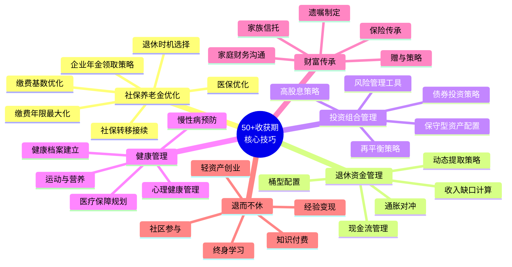
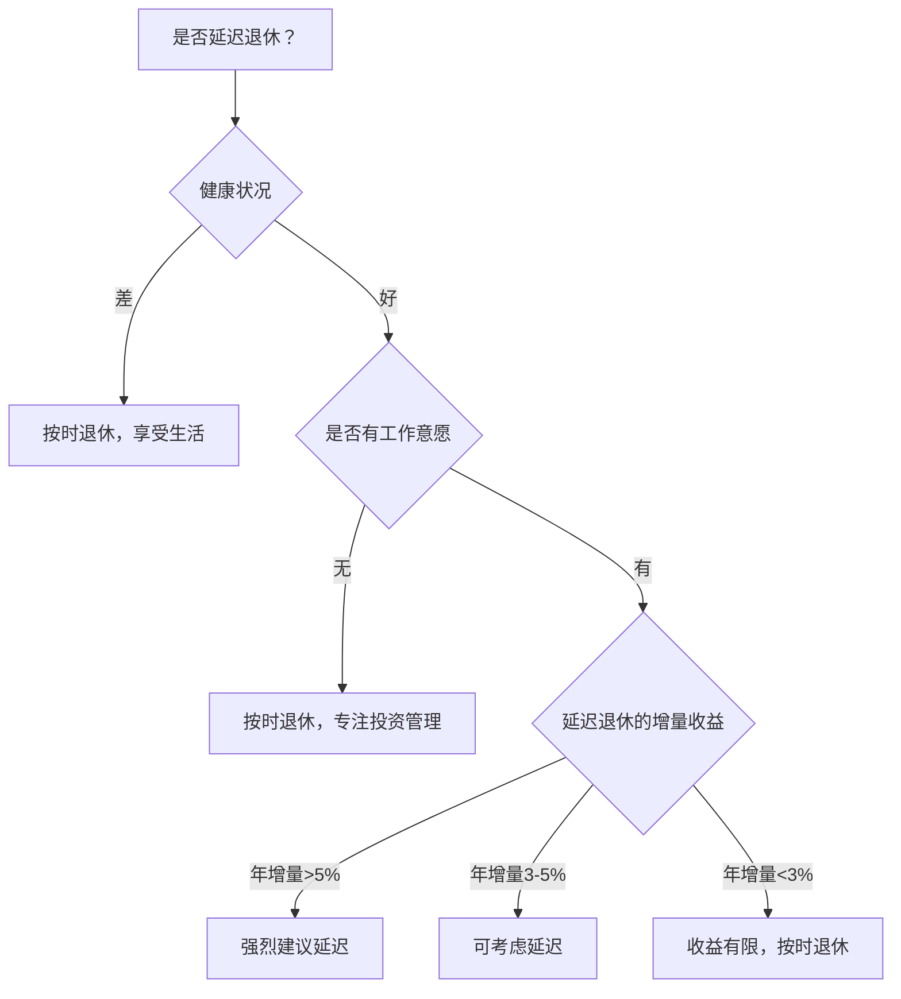
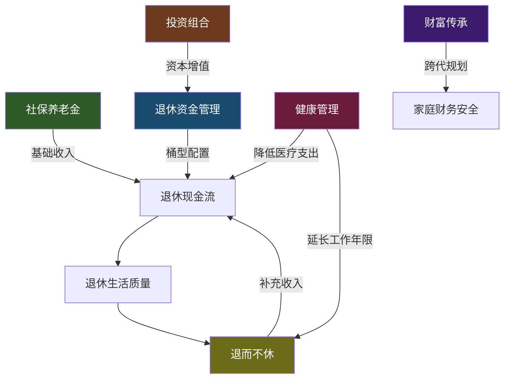

## 本节小结：50岁以上收获期核心技巧全景回顾

本节围绕50岁以上人群面临的六大核心财务课题展开，从社保养老金优化到退休后"退而不休"的收入再创造，构建了一套完整的收获期财务管理体系。以下逐一梳理每个模块的关键要点，并从全局视角提供整合建议。

### 一、六大核心技巧体系总览

### 二、各模块核心要点速查

#### 1. 社保养老金优化——打好地基

社保养老金是退休收入的第一支柱，也是最稳定、最确定的收入来源。六个核心技巧的逻辑关系如下：

| 技巧 | 核心目标 | 关键数据 | 优先级 |
|------|----------|----------|--------|
| 缴费年限最大化 | 增加基础养老金 | 每多缴1年，基础养老金+1% | ★★★★★ |
| 缴费基数优化 | 提高个人账户积累 | 基数越高，个人账户越多 | ★★★★ |
| 退休时机选择 | 三重收益叠加 | 延迟1年退休，养老金增加3-5% | ★★★★★ |
| 社保转移接续 | 合并多地缴费记录 | 最后缴费满10年城市为退休地 | ★★★ |
| 医保优化 | 保障医疗支出 | 男25年/女20年为缴费门槛 | ★★★★ |
| 企业年金领取 | 最大化年金收益 | 一次性 vs 分期 vs 购买年金 | ★★★ |

**核心公式：** 基础养老金 = 社平工资 × (1 + 缴费指数) / 2 × 缴费年限 × 1%

**最常见的决策困境：** 是否延迟退休？决策框架如下——

#### 2. 退休资金管理——构建安全垫

退休资金管理的核心逻辑是"先算缺口，再建水桶，动态提取，对冲通胀"。

**四步缺口计算法：**
1. 算支出：列出退休后所有年度支出（区分必需 vs 可选）
2. 算收入：社保养老金 + 企业年金 + 固定收入（租金等）
3. 算缺口：年支出 - 固定收入 = 年缺口
4. 算总额：年缺口 × 25 = 所需储蓄总额（4%法则）

**桶型配置的核心思路：**

| 桶 | 覆盖年限 | 资产类型 | 目标 |
|----|----------|----------|------|
| 第一桶（安全桶） | 1-3年 | 货币基金、活期、短期国债 | 随时可用，绝对安全 |
| 第二桶（稳定桶） | 3-10年 | 中长期国债、高等级债基、大额存单 | 稳定收益，略超通胀 |
| 第三桶（增长桶） | 10年以上 | 高股息股票、REITs、指数基金、黄金 | 资本增值，抵御通胀 |

**动态提取的四大规则：**
- 正常年份：提取4%
- 市场涨超20%：提取5%（享受收益）
- 市场跌超10%：提取3%（适度收缩）
- 市场跌超20%：提取2.5%（大幅收缩保护本金）

#### 3. 投资组合管理——守住收益

50岁以上人群的投资组合管理核心原则是"保守为主，适度进攻，定期再平衡"。

**年龄与风险资产配比参考：**

| 年龄段 | 货币/国债 | 债券基金 | 高股息股票 | REITs | 黄金 |
|--------|-----------|----------|------------|-------|------|
| 50-55岁 | 15% | 40% | 25% | 10% | 5% |
| 55-60岁 | 20% | 45% | 20% | 10% | 5% |
| 60岁以上 | 25% | 45% | 15% | 10% | 5% |

**再平衡规则：** 每半年检查一次，任何一类资产偏离目标超过5%时触发。用新增资金买入低配资产是最优方式，避免卖出产生的税费和心理不适。

**三大风险管理工具：**
1. 止损线：单只股票亏损超20%止损，整体组合亏损超15%审视策略
2. 期权保护：买入看跌期权保护股票组合，成本约1-3%/年
3. 分散投资：跨资产类别、跨地域、跨行业、跨时间（定投）

#### 4. 健康管理——最重要的资产

健康是50岁以上人群最核心的"资产"。一次重大疾病可以消耗数十年积累的财富。健康管理不是可选项，而是财务规划的基础设施。

**健康管理的五个维度：**

| 维度 | 具体行动 | 财务影响 |
|------|----------|----------|
| 慢性病预防 | 定期体检、血压/血糖监测、早期干预 | 预防胜于治疗，节省大额医疗支出 |
| 运动与营养 | 每周150分钟中等强度运动、均衡饮食 | 降低医疗费用、提升生活质量 |
| 医疗保障规划 | 医保+百万医疗险+重疾险 | 覆盖大病风险，防止因病返贫 |
| 心理健康 | 社交活动、兴趣培养、心理咨询 | 减少因抑郁/焦虑导致的医疗支出 |
| 健康档案 | 建立完整的个人健康档案 | 便于就医、避免重复检查 |

**医疗保障配置建议（优先级排序）：**
1. 社保医保（基础，必须有）
2. 百万医疗险（覆盖大病住院，年费1000-2000元）
3. 意外险（50岁以上意外风险增加，年费200-500元）
4. 重疾险（50岁以上保费较高，需权衡性价比）
5. 防癌险（买不了重疾险的替代方案）

#### 5. 财富传承——跨代规划

财富传承不仅是"把钱留给谁"，更是一套系统的法律+金融+沟通框架。

**五种传承工具对比：**

| 工具 | 门槛 | 成本 | 灵活性 | 法律确定性 | 适合人群 |
|------|------|------|--------|------------|----------|
| 遗嘱 | 无 | 低（公证费数百元） | 高 | 中（可能被挑战） | 所有人 |
| 保险传承 | 年缴保费起 | 中等 | 低 | 高（指定受益人） | 有保险需求者 |
| 赠与 | 无 | 低（可能有税费） | 中 | 高 | 希望生前转移者 |
| 家族信托 | 1000万+ | 0.5-1%/年 | 高 | 高 | 高净值家庭 |
| 家庭沟通 | 无 | 无 | 高 | 无 | 所有人 |

**遗嘱效力层级提醒：** 2021年《民法典》取消了公证遗嘱的优先效力，以最后一份遗嘱为准。但公证遗嘱仍是最不容易被挑战的形式。

**传承规划的时间线建议：**
- 50-55岁：开始梳理资产，制定初步传承方案
- 55-60岁：完成遗嘱制定，配置传承型保险
- 60-65岁：与子女沟通传承意愿，设立信托（如有需要）
- 65岁以上：定期更新遗嘱，确保方案与当前资产匹配

#### 6. "退而不休"——收入再创造

退休不等于停止创造价值。50岁以上人群拥有年轻人无法替代的优势：行业经验、人脉网络、专业判断力和时间自由度。

**退而不休的五条路径：**

| 路径 | 启动成本 | 收入潜力 | 时间投入 | 技能要求 |
|------|----------|----------|----------|----------|
| 经验变现（顾问/咨询） | 极低 | 5000-30000元/月 | 灵活 | 专业经验 |
| 轻资产创业（社区服务） | 1-5万 | 3000-15000元/月 | 中等 | 运营能力 |
| 知识付费（课程/写作） | 低 | 2000-20000元/月 | 前期密集 | 表达能力 |
| 社区参与（志愿服务/兼职） | 无 | 1000-5000元/月 | 灵活 | 社交能力 |
| 终身学习转行 | 中等 | 视新领域而定 | 较多 | 学习能力 |

**退而不休的三条铁律：**
1. 不要投入全部积蓄创业——用"亏得起"的钱试错
2. 不要为了赚钱牺牲健康——健康是最大的本钱
3. 不要与社会脱节——保持社交网络是心理健康的基础

### 三、六大技巧的协同关系

这六个模块不是孤立的，而是一个相互支撑的系统。下图展示了它们之间的资金流和保障关系：

**协同效应的具体体现：**

1. **社保优化 ↔ 退休资金管理：** 社保养老金越高，退休资金缺口越小，所需储蓄总额越低
2. **健康管理 ↔ 投资组合：** 健康状况好，风险承受能力更强，投资组合可以更积极
3. **财富传承 ↔ 退休资金管理：** 传承规划需要预留资金，影响退休资金的可用额度
4. **退而不休 ↔ 退休资金管理：** 持续收入减少提取压力，延长资金存续时间
5. **健康管理 ↔ 财富传承：** 健康寿命越长，传承规划的时间窗口越大

### 四、50岁以上人群的年度行动清单

将六大模块落实为可执行的年度行动：

**每年1月——年度财务体检：**
- [ ] 更新资产负债表
- [ ] 检查社保缴费记录
- [ ] 审视投资组合再平衡需求
- [ ] 评估保险保障是否充足

**每年4月——健康体检：**
- [ ] 完成年度体检（重点关注心脑血管、肿瘤筛查）
- [ ] 更新健康档案
- [ ] 检查医保报销情况

**每年7月——投资组合再平衡：**
- [ ] 检查各类资产偏离度
- [ ] 执行再平衡操作
- [ ] 评估动态提取策略执行情况

**每年10月——传承规划审视：**
- [ ] 检查遗嘱是否需要更新
- [ ] 与家人沟通传承意愿
- [ ] 更新受益人信息（保险、银行账户）

**随时——退而不休机会评估：**
- [ ] 关注行业动态和新机会
- [ ] 维护人脉网络
- [ ] 学习新技能

### 五、本节关键认知升级

1. **社保不是"交够就行"。** 缴费年限、缴费基数、退休时机的每一个选择都直接影响未来几十年的收入水平。多缴一年、多涨一个基数，累积效应惊人。

2. **桶型配置不是"保守就行"。** 三个桶各有使命——安全桶保流动性，稳定桶抗通胀，增长桶博收益。关键是桶之间的动态补充机制。

3. **投资组合不是"越保守越好"。** 50岁以上仍然需要15-30%的权益类资产配置，否则20-30年的退休生活中，通胀会严重侵蚀购买力。

4. **健康管理不是"花钱就行"。** 预防性健康管理的成本远低于治疗成本。一次年度体检500元，一次心脏搭桥手术20万元——投入产出比不言自明。

5. **财富传承不是"立遗嘱就行"。** 遗嘱只是传承工具之一，保险、赠与、信托各有适用场景，家庭沟通更是避免纠纷的根本。

6. **退休不是"停下来就行"。** 退而不休的核心不是赚钱，而是保持社会连接、自我价值感和生活节奏。收入只是副产品。
