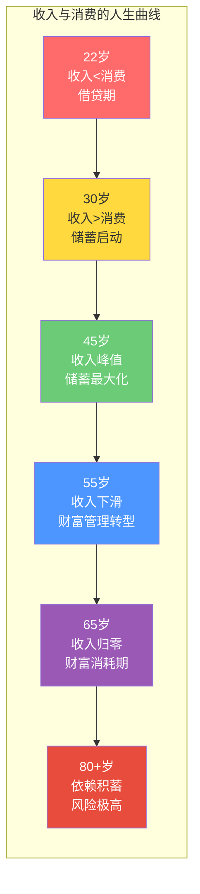

## 一、生命周期财务理论的收尾阶段

### 1.1 莫迪利安尼生命周期假说：理论根基

1954年，弗兰科·莫迪利安尼（Franco Modigliani）与理查德·布伦伯格（Richard Brumberg）提出了生命周期假说（Life-Cycle Hypothesis, LCH），这一理论为莫迪利安尼赢得了1985年诺贝尔经济学奖。其核心思想可以用一句话概括：**人的一生中，收入曲线与消费曲线并不重合，理性人会在高收入时期储蓄，在低收入时期动用储蓄，以实现整个生命周期内的消费平滑**。

这一理论基于三个关键假设：

1. **理性预期**：个人能够合理估计未来的收入流
2. **消费平滑偏好**：人们倾向于保持稳定的消费水平，而非收入高时奢侈、收入低时拮据
3. **遗产动机有限**：大多数人的储蓄目的不是留给后代，而是为自己的退休生活

**生命周期的五个阶段：**

| 阶段 | 年龄区间 | 收入特征 | 消费特征 | 储蓄状态 |
|------|---------|---------|---------|---------|
| 起步期 | 22-30岁 | 收入较低，增长快 | 消费高于收入（借贷） | 负储蓄或零储蓄 |
| 积累期 | 30-45岁 | 收入快速增长 | 消费增长较慢 | 大量正储蓄 |
| 巅峰期 | 45-55岁 | 收入达到顶峰 | 消费趋于稳定 | 储蓄达到峰值 |
| 过渡期 | 55-65岁 | 收入开始下降 | 消费维持或略降 | 储蓄减少或消耗开始 |
| 消耗期 | 65岁以上 | 主要靠资产收益 | 消费逐步降低 | 动用积累的财富 |

50岁以上的人生，正处于巅峰期向过渡期的关键转折点。用莫迪利安尼的原话说，这个阶段的核心任务是：**在人力资本（未来劳动收入的现值）加速折旧的过程中，确保金融资本（已积累的金融资产）的规模足以独立支撑剩余生命期的全部消费需求**。



### 1.2 人力资本与金融资本的终局转换

理解50岁以后的财务规划，必须先搞清楚两个核心概念：

**人力资本（Human Capital）**是你未来所有劳动收入的折现值。简单说，就是"你这个人还能赚多少钱"。一个人25岁时，人力资本可能是其一生中最大的"资产"——一个年薪30万的25岁年轻人，未来35年的劳动收入折现后可能高达600-800万。但到了55岁，同样的人只剩下5-10年的工作时间，人力资本急剧缩水到100-200万。

**金融资本（Financial Capital）**是你已经积累的、不再依赖于你的劳动能力的资产——银行存款、股票、基金、债券、房产等。

**50岁是一个分水岭**，此时人力资本与金融资本的比例发生根本性逆转：

| 年龄 | 人力资本占比 | 金融资本占比 | 核心任务 |
|------|-----------|-----------|---------|
| 25岁 | ~95% | ~5% | 投资自己，提升人力资本 |
| 35岁 | ~75% | ~25% | 加速储蓄，建立投资习惯 |
| 45岁 | ~50% | ~50% | 资产配置优化，风险平衡 |
| 50岁 | ~35% | ~65% | **关键转折：金融资本必须开始主导** |
| 55岁 | ~20% | ~80% | 降低风险，稳定现金流 |
| 60岁 | ~5% | ~95% | 金融资本完全独立支撑生活 |
| 65岁 | 0% | 100% | 动用积累，控制提取节奏 |

**50岁时的资本结构实例：**

假设王先生，52岁，年薪60万（税后），计划60岁退休：
- **人力资本**：还能工作8年，年薪60万，折现率取5%，人力资本约60万×(1-1.05^-8)/0.05 ≈ 387万
- **金融资本**：已积累存款+基金+股票+房产净值共约550万
- **结论**：金融资本已经大于人力资本，这意味着王先生活着的"底牌"已经从"还能赚钱"变成了"已经攒下的钱"。未来8年的工作收入是"加分项"，而非"必须项"

**60岁退休时的理想状态检验：**

退休资金是否充足，业界最常用的是**4%安全提取率法则**（源自1994年William Bengen的研究）：

| 年支出水平 | 所需金融资本（4%法则） | 所需金融资本（3.5%法则） | 月均可用金额 |
|-----------|---------------------|----------------------|------------|
| 20万/年 | 500万 | 571万 | 1.67万 |
| 30万/年 | 750万 | 857万 | 2.50万 |
| 40万/年 | 1000万 | 1143万 | 3.33万 |
| 50万/年 | 1250万 | 1429万 | 4.17万 |
| 80万/年 | 2000万 | 2286万 | 6.67万 |

> **为什么要同时看3.5%法则？** 4%法则基于美国1926-1992年的历史数据回测，假设投资组合为50%股票+50%债券。在当前全球低利率环境下，以及考虑到中国投资者可能面临更高的通胀压力和医疗支出增长，3.5%的安全提取率更为审慎。如果你计划在50岁就退休（意味着资金需要支撑40年以上），甚至应该考虑3%的安全提取率。

### 1.3 永续年金理论与退休资金需求计算

退休资金需求的数学本质是一个**有限年金现值问题**——你需要一笔钱，在未来N年内每年支出X万元，同时这笔钱在未支出的部分还能产生投资收益。

**基本公式：**

$$PV = PMT \times \frac{1 - (1+r)^{-n}}{r}$$

其中：
- PV = 退休时需要的总资金
- PMT = 每年需要提取的金额
- r = 预期实际投资回报率（扣除通胀后）
- n = 预期退休年数

**三种计算方法的对比：**

**方法一：4%法则（最简单）**

| 项目 | 说明 |
|------|------|
| 原理 | 历史回测表明，每年提取初始投资组合的4%（后续随通胀调整），30年内几乎不会耗尽 |
| 公式 | 退休资金 = 年支出 × 25 |
| 优点 | 计算简单，容易记忆 |
| 缺点 | 假设30年期限，不适用于提前退休；未考虑中国市场特征 |
| 适用 | 60-65岁退休，预期寿命90岁以内 |

**方法二：3.5%法则（更保守）**

| 项目 | 说明 |
|------|------|
| 原理 | 考虑到低利率环境和长寿风险，降低提取率以增加安全边际 |
| 公式 | 退休资金 = 年支出 ÷ 3.5% = 年支出 × 28.6 |
| 优点 | 安全边际更大，更能应对不确定的市场环境 |
| 缺点 | 需要积累更多资金，可能过度保守 |
| 适用 | 55岁前退休，或预期寿命超过90岁 |

**方法三：动态提取法（最科学）**

| 项目 | 说明 |
|------|------|
| 原理 | 不固定提取比例，根据市场表现和剩余寿命动态调整 |
| 公式 | 基准提取率 = 1 ÷ 剩余预期寿命，再根据市场估值调整 |
| 优点 | 最大化资金使用效率，降低过早耗尽的风险 |
| 缺点 | 需要持续管理，提取金额不稳定 |
| 适用 | 有基本投资管理能力的退休者 |

**动态提取法的具体操作：**

```text
每年初计算：
  基准提取额 = 当前资产总额 ÷ 剩余预期寿命（年）
  市场调整系数：
    - 如果沪深300市盈率 < 12倍（低估）：提取额 × 1.0（正常提取）
    - 如果沪深300市盈率 12-18倍（合理）：提取额 × 0.95（略减）
    - 如果沪深300市盈率 > 18倍（高估）：提取额 × 0.90（减少提取）
  最终提取额 = 基准提取额 × 市场调整系数
  下限 = 年基本生活支出（不低于此数）
  上限 = 年支出 × 110%（不超过此数）
```

**计算案例：**

李女士，58岁，计划60岁退休，当前金融资产800万，预期寿命85岁（退休后还有25年），年支出目标35万。

**用4%法则：** 需要 35万×25 = 875万 → 800万不够，缺口75万，需在2年内补足或降低支出

**用3.5%法则：** 需要 35万×28.6 = 1001万 → 缺口201万，压力较大

**用动态提取法：** 退休时资产假设增长到880万（年化5%），第一年提取 = 880万÷25 = 35.2万 → 基本满足

### 1.4 生命周期理论的中国化修正

莫迪利安尼的理论诞生于20世纪50年代的美国，直接套用到中国会出现几个重大偏差，需要做修正：

**修正一：代际转移支付**

中国家庭中，父母对子女的财务支持远超西方——子女结婚买房的首付、孙辈的养育费用等，这些支出在生命周期理论中并未充分考虑。50岁以上的人群中，很多人仍在为子女的婚房还贷。这意味着中国的"消耗期"可能比理论预期来得更早、更猛。

**修正二：医疗支出的非线性增长**

美国有Medicare等较为完善的老年人医保体系，而中国的医保报销存在封顶线、自付比例和目录外用药等问题。60岁以后的医疗支出不是线性增长，而是在75岁左右出现跳跃式增长：

| 年龄段 | 年均医疗支出（估算） | 特征 |
|--------|-------------------|------|
| 50-60岁 | 0.5-1.5万 | 慢性病管理为主 |
| 60-70岁 | 1.5-4万 | 住院频率增加 |
| 70-80岁 | 4-10万 | 大病风险上升 |
| 80岁以上 | 10-30万+ | 护理费用占比增大 |

**修正三：通胀结构差异**

中国的CPI构成中，食品和居住权重较高，而老年人的消费结构中，医疗和护理服务的权重远高于年轻人。过去10年，中国医疗类CPI年均涨幅约3-5%，远高于整体CPI的2-3%。用整体通胀率来估算退休资金需求，会系统性地低估实际需求。

**修正四：社保养老金的不确定性**

中国的社保养老金替代率（养老金占退休前工资的比例）持续下降，从2000年的约70%降至2023年的约40%。同时，延迟退休政策正在逐步实施。50岁以上的人群需要假设：自己能拿到的社保养老金可能比当前公布的公式计算值低10-20%。

**修正五：住房资产的特殊性**

中国家庭资产中，房产占比高达60-70%，远高于美国的25-30%。这意味着很多家庭的"金融资本"其实大部分锁在房子里。房产的流动性差，变现成本高（税费、折价），不能简单等同于金融资产。在计算退休资金时，建议只计入"可变现房产净值的70%"（扣除交易税费和折价）。

### 1.5 生命周期收尾阶段的三步规划框架

基于修正后的生命周期理论，50岁以上的财务规划可以分为三个子阶段：

**第一阶段：50-55岁——财务盘点与缺口修补**

这是最关键的窗口期。你还有5-10年的收入期，但时间已经不多了。

```text
核心任务清单：
□ 计算当前金融资本总额（净资产 - 自住房产价值）
□ 估算退休后的年支出（区分必要支出和可选支出）
□ 用4%法则或3.5%法则计算退休资金缺口
□ 制定5年补缺计划（增加储蓄率、优化投资、延迟退休等）
□ 检查社保缴费年限是否达标（养老15年、医疗男25/女20年）
□ 评估企业年金/职业年金的预期金额
□ 购买或完善商业医疗保险（百万医疗+重疾险）
□ 开始遗嘱和财富传承的初步规划
```

**第二阶段：55-60岁——资产配置转型**

从"增长型"配置转向"收入型"配置，核心是降低波动、增加现金流。

| 配置维度 | 50岁前（增长型） | 55-60岁（平衡型） | 60岁后（收入型） |
|---------|---------------|-----------------|---------------|
| 权益类（股票/基金） | 50-60% | 30-40% | 15-25% |
| 固收类（债券/存款） | 20-30% | 35-45% | 45-55% |
| 现金/货币基金 | 5-10% | 10-15% | 15-20% |
| 另类（黄金/REITs） | 5-10% | 5-10% | 5-10% |
| 预期年化收益 | 8-10% | 5-7% | 3-5% |
| 最大回撤容忍 | -30% | -15% | -8% |

**第三阶段：60岁以后——精细提取与风险管理**

进入实际消耗期，核心是"钱不能断、不能乱、不能被骗"。

- 建立"三层资金桶"：第一桶（1-2年生活费，现金/货基）、第二桶（3-5年支出，债券/存款）、第三桶（长期增值，股息基金/REITs）
- 每年做一次财务健康检查
- 重大支出决策（如资助子女、大额消费）需要配偶和子女共同讨论
- 定期评估提取率是否可持续


### 1.6 常见误区与纠正

**误区一："退休后花得少，不用存那么多"**

❌ 很多人以为退休后没有通勤、应酬等支出，花费会大幅减少。实际上，退休后有更多自由时间，旅游、兴趣爱好、社交活动的支出可能反而增加。更重要的是，医疗和护理支出会随年龄增长而大幅上升。

✅ 正确做法：用退休前实际支出的80-100%作为退休支出估算基准，再额外预留20-30%的医疗准备金。

**误区二："有社保就够了"**

❌ 中国社保养老金的替代率约40%，如果退休前月薪2万，退休后社保养老金可能只有8000元左右。这个落差会严重影响生活质量。

✅ 正确做法：社保只是第一支柱，必须建立第二支柱（企业年金）和第三支柱（个人储蓄+商业保险）。

**误区三："房子就是最好的养老资产"**

❌ 自住房虽然价值高，但不产生现金流。除非卖掉或反向抵押，否则房子对日常养老支出毫无帮助。而且中国房产流动性越来越差，变现周期长、折价高。

✅ 正确做法：自住房不计入可投资资产。如果有多套房产，应在流动性尚可时（55-65岁之间）择机处置，将不动产转化为金融资产。

**误区四："子女会赡养我"**

❌ 随着独生子女一代承担4-2-1家庭结构的压力，以及年轻人自身就业和住房压力的增大，依赖子女养老越来越不现实。

✅ 正确做法：将子女赡养视为"锦上添花"而非"雪中送炭"，财务规划中不计入子女赡养收入。

**误区五："现在还早，过几年再规划"**

❌ 50岁以后，每耽误一年，可利用的投资复利周期就少一年。假设年化收益6%，100万晚投资5年，最终会少赚约34万。

✅ 正确做法：今天就开始。哪怕只是做一次简单的资产负债盘点，也比继续拖延强。

### 1.7 本节核心公式速查表

| 概念 | 公式 | 说明 |
|------|------|------|
| 4%法则退休资金 | 年支出 × 25 | 30年内安全提取 |
| 3.5%法则退休资金 | 年支出 × 28.6 | 更保守，适合提前退休 |
| 人力资本现值 | Σ(未来各年税后收入 ÷ (1+r)^n) | r取无风险利率+2% |
| 有限年金现值 | PMT × [1-(1+r)^(-n)] / r | 退休资金需求的精确计算 |
| 社保基础养老金 | (社平工资 + 指数化工资) / 2 × 缴费年限 × 1% | 每多缴1年增加1% |
| 个人账户养老金 | 个人账户储存额 ÷ 计发月数 | 60岁退休计发139个月 |
| 收入替代率 | 退休后收入 ÷ 退休前收入 | 目标70-80% |
| 安全提取率上限 | 1 ÷ 预期退休年数 | 动态提取的起点 |
