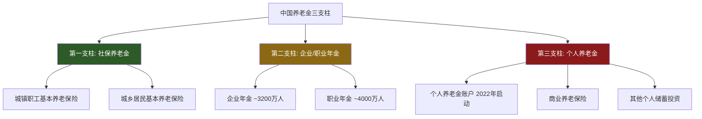
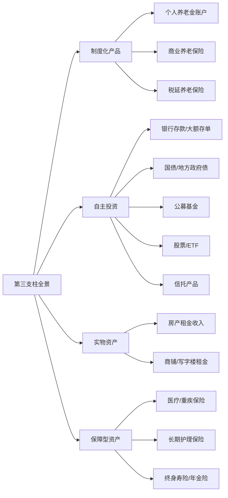
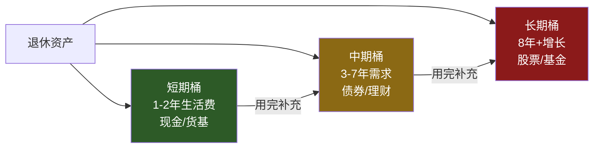

## 二、退休收入的三支柱理论

退休收入规划的核心框架，是世界银行在1994年首次提出、并在2005年完善的"多支柱养老金体系"模型。理解这一体系，不仅帮助你搞清楚"退休钱从哪来"，更能帮你找到"还缺多少、怎么补"的系统性答案。对于50岁以上即将或已经退休的读者，这是一切后续财务决策的地基。

### 2.1 三支柱体系的起源与演变

#### 2.1.1 世界银行的原始模型

1994年，世界银行在《防止老龄危机：保护老年人和促进增长的政策》（*Averting the Old Age Crisis*）报告中，首次提出了三支柱养老金体系的概念。这一模型的提出背景是全球老龄化加速和现收现付制（Pay-As-You-Go）养老金体系的可持续性危机。

原始三支柱：

| 支柱 | 定位 | 资金来源 | 管理主体 | 核心目标 |
|------|------|----------|----------|----------|
| 第一支柱 | 公共养老金 | 税收/社保缴费 | 政府 | 消除老年贫困 |
| 第二支柱 | 职业养老金 | 雇主+雇员缴费 | 企业/基金 | 维持退休生活水平 |
| 第三支柱 | 个人储蓄 | 个人收入 | 个人 | 提升退休生活质量 |

2005年，世界银行将模型扩展为五支柱：增加了零支柱（非缴费型养老金，即普惠性老年津贴）和第四支柱（非正规保障，如家庭支持、医疗护理等）。但对于中国读者，三支柱模型仍然是最实用的分析框架。

#### 2.1.2 中国的三支柱实践

中国从1991年开始逐步构建多层次养老保险体系，但三支柱发展极不均衡：

三支柱的占比严重失衡：第一支柱占养老金总资产的约65%，第二支柱约30%，第三支柱仅约5%。这意味着中国退休人员高度依赖政府主导的社保养老金，第二、第三支柱的补充作用远未发挥。

**关键数据对比（2024年）：**

| 指标 | 中国 | 美国 | 日本 | 德国 |
|------|------|------|------|------|
| 第一支柱替代率 | 35%-45% | 40% | 35% | 42% |
| 第二支柱覆盖率 | ~7% | ~55% | ~10% | ~65% |
| 第三支柱渗透率 | <5% | ~40% | ~25% | ~20% |
| 养老金/GDP | ~5% | ~150% | ~30% | ~8% |

这组数据说明了两个残酷事实：一是中国的养老金总储备远低于发达国家；二是绝大多数中国人只能依赖第一支柱和自己。对于50岁以上的读者，这意味着第三支柱（个人储蓄投资）不是"锦上添花"，而是"雪中送炭"。

### 2.2 第一支柱：社会保障（社保养老金）深度解析

#### 2.2.1 制度架构

中国的基本养老保险分为两个体系：

**城镇职工基本养老保险**（覆盖企业职工、灵活就业人员、机关事业单位人员）：
- 缴费比例：企业缴16%（2019年降费率后），个人缴8%
- 灵活就业人员：个人缴20%，其中8%进入个人账户，12%进入统筹账户
- 缴费基数上限：当地社平工资的300%
- 缴费基数下限：当地社平工资的60%

**城乡居民基本养老保险**（覆盖未参加职工养老保险的城乡居民）：
- 缴费档次：每年200元至数千元不等（各地标准不同）
- 政府给予缴费补贴
- 基础养老金由中央和地方财政共同承担
- 待遇水平显著低于城镇职工养老保险

#### 2.2.2 养老金计算公式详解

城镇职工基本养老金由两部分组成：

**基础养老金 = （当地上年度在岗职工月平均工资 + 本人指数化月平均缴费工资）÷ 2 × 缴费年限 × 1%**

其中，"本人指数化月平均缴费工资 = 当地上年度在岗职工月平均工资 × 本人平均缴费指数"。

平均缴费指数是你每年缴费基数与当年社平工资之比的平均值。按60%基数缴费，指数为0.6；按100%基数缴费，指数为1.0；按300%封顶缴费，指数为3.0。

**个人账户养老金 = 个人账户储存额 ÷ 计发月数**

计发月数根据退休年龄确定（基于城镇人口平均预期寿命减去退休年龄的精算模型）：

| 退休年龄 | 计发月数 | 对应寿命假设 |
|----------|----------|--------------|
| 40岁 | 233个月 | 约59岁 |
| 45岁 | 216个月 | 约63岁 |
| 50岁 | 195个月 | 约66岁 |
| 55岁 | 170个月 | 约69岁 |
| 60岁 | 139个月 | 约72岁 |
| 65岁 | 101个月 | 约73岁 |

需要注意：计发月数只是计算月数，不是领取期限。个人账户领完后，由统筹基金继续按原标准发放——这意味着活得越久，"赚"得越多。这是社保养老金最重要的优势之一：终身给付，对冲长寿风险。

#### 2.2.3 实际计算案例

**案例一：一线城市企业中层**

王女士，上海，55岁退休，缴费年限30年，平均缴费指数1.2，2024年上海社平工资12307元/月，个人账户储存额28万元：

- 基础养老金 = （12307 + 12307 × 1.2）÷ 2 × 30 × 1% = （12307 + 14768）÷ 2 × 0.3 = 4061元/月
- 个人账户养老金 = 280000 ÷ 170 = 1647元/月
- 合计养老金 = 5708元/月
- 替代率 = 5708 ÷ （12307 × 1.2） = 38.7%

**案例二：三线城市普通职工**

李先生，某三线城市，60岁退休，缴费年限25年，平均缴费指数0.6，当地社平工资6500元/月，个人账户储存额12万元：

- 基础养老金 = （6500 + 6500 × 0.6）÷ 2 × 25 × 1% = （6500 + 3900）÷ 2 × 0.25 = 1300元/月
- 个人账户养老金 = 120000 ÷ 139 = 863元/月
- 合计养老金 = 2163元/月
- 替代率 = 2163 ÷ （6500 × 0.6） = 55.5%

**案例三：高收入人群**

张先生，北京，60岁退休，缴费年限35年，平均缴费指数2.5（高基数缴费），2024年北京社平工资11500元/月，个人账户储存额55万元：

- 基础养老金 = （11500 + 11500 × 2.5）÷ 2 × 35 × 1% = （11500 + 28750）÷ 2 × 0.35 = 7044元/月
- 个人账户养老金 = 550000 ÷ 139 = 3957元/月
- 合计养老金 = 11001元/月
- 替代率 = 11001 ÷ （11500 × 2.5） = 38.3%

三个案例揭示了一个关键规律：**即使缴费基数很高，替代率也很难超过40%-45%**。这就是为什么第二、第三支柱不可或缺。

#### 2.2.4 养老金调整机制

中国每年会根据经济发展、物价变动和职工工资增长情况调整养老金。2005-2024年，企业退休人员养老金已连续20年上调，但涨幅逐年收窄：

- 2005-2015年：年均涨幅约10%
- 2016-2020年：年均涨幅约5%
- 2021-2024年：年均涨幅约3%-4%

未来随着老龄化加剧和基金支付压力增大，涨幅可能进一步收窄至2%-3%，甚至可能出现个别年份不调整的情况。在做退休规划时，建议按每年2%的养老金增长假设来保守估算。

#### 2.2.5 社保养老金的隐性风险

虽然社保养老金被认为是"最安全"的退休收入来源，但仍存在以下风险：

1. **替代率下降风险**：随着社平工资增长快于养老金调整，实际购买力可能下降
2. **政策变动风险**：延迟退休、缴费年限调整等政策变化
3. **地区差异风险**：不同城市的养老金水平差距可达2-3倍
4. **通胀侵蚀风险**：养老金调整幅度可能低于实际通胀率（特别是医疗、养老服务等老年人主要支出的通胀率往往高于CPI）
5. **基金可持续性风险**：部分省份已出现当期收不抵支的情况

### 2.3 第二支柱：雇主福利（企业年金/职业年金）

#### 2.3.1 企业年金制度

企业年金是企业及其职工在依法参加基本养老保险的基础上，自愿建立的补充养老保险制度。

**核心规则：**
- 企业缴费不超过职工工资总额的8%
- 个人缴费不超过本人工资的4%
- 企业与个人缴费合计不超过职工工资总额的12%
- 企业缴费部分可以设定归属期（最长8年），即员工需服务满一定年限才能完全获得企业缴费部分的所有权
- 投资运营由企业年金基金受托人、账户管理人、托管人、投资管理人共同管理

**领取方式：**
- 退休后一次性领取（需缴纳个人所得税）
- 退休后分期领取（按月/按季/按年，享受税收优惠分摊）
- 出国定居时可一次性领取
- 完全丧失劳动能力时可领取
- 死亡后由继承人继承

**税收优惠：**
- 企业缴费部分在不超过职工工资总额5%的标准内，可在企业所得税前扣除
- 个人缴费部分在不超过本人工资4%的标准内，可在个人所得税前扣除
- 基金投资收益暂不征税
- 领取时按"工资薪金所得"计税

#### 2.3.2 职业年金制度

职业年金适用于机关事业单位工作人员，2014年10月起实施。

**核心规则：**
- 单位缴费比例为本单位工资总额的8%
- 个人缴费比例为本人缴费工资的4%
- 合计12%，全部进入个人账户
- 与企业年金不同，职业年金是强制性的（对适用人群）

**领取方式：**
- 退休后按月领取，直至个人账户余额用完
- 也可以选择一次性购买商业养老保险
- 出国定居时可一次性领取
- 死亡后由继承人继承

#### 2.3.3 覆盖率困境与应对

截至2023年底的数据显示：

| 指标 | 企业年金 | 职业年金 |
|------|----------|----------|
| 参加人数 | ~3200万 | ~4000万 |
| 基金规模 | ~3.1万亿 | ~2.6万亿 |
| 覆盖率 | 城镇职工的~7% | 机关事业单位的~100% |
| 人均积累 | ~9.7万元 | ~6.5万元 |

覆盖率低的根本原因：
- 对企业而言，这是额外的人工成本负担（最高12%的工资总额）
- 中小企业利润率低，无力承担
- 缺乏强制性，完全靠企业自愿
- 员工对长期锁定资金有顾虑

**如果你没有企业年金怎么办？**

对于绝大多数在民营企业、中小企业工作的读者，第二支柱基本是空白。这不代表你"缺了一条腿"就无法退休，而是需要把第三支柱做得更大来补偿。具体策略见下一节。

### 2.4 第三支柱：个人储蓄与投资（深度展开）

第三支柱是50岁以上读者最需要关注、也最有掌控力的部分。2022年11月，中国正式启动个人养老金制度，标志着第三支柱从"自发行为"走向"制度化"。

#### 2.4.1 个人养老金账户制度

**基本规则：**
- 每年缴费上限12000元（2024年起部分试点城市已提高至更高额度）
- 在中国境内参加城镇职工基本养老保险或城乡居民基本养老保险的劳动者均可参加
- 缴费享受税前扣除（对于适用个税的纳税人有实际节税效果）
- 投资收益暂不征税
- 领取时按3%单独计税

**税收优惠的实际价值：**

| 边际税率 | 年缴12000元节税额 | 30年累计节税 |
|----------|-------------------|--------------|
| 3% | 360元 | 10800元 |
| 10% | 840元 | 25200元 |
| 20% | 2040元 | 61200元 |
| 25% | 2640元 | 79200元 |
| 30% | 3240元 | 97200元 |
| 35% | 3840元 | 115200元 |
| 45% | 5040元 | 151200元 |

注意：对于边际税率3%的人群（月应纳税所得额不超过3000元），个人养老金的税收优惠几乎没有意义——存入时省3%，取出时交3%，等于白折腾。只有边际税率10%及以上的人群，才有实际的节税收益。

**投资品种选择：**

个人养老金账户内的资金可投资于：
- 储蓄存款（利率通常略高于普通定期）
- 理财产品（银行养老理财产品）
- 商业养老保险
- 公募基金（养老目标基金，包括目标日期基金和目标风险基金）

#### 2.4.2 第三支柱的完整图谱

个人养老金账户只是第三支柱的一部分。完整的第三支柱包括：

#### 2.4.3 50岁以上人群的第三支柱配置策略

对于即将或已经退休的50岁以上读者，第三支柱的配置应遵循以下原则：

**原则一：安全性优先，收益性其次**

退休后的投资与工作期间完全不同——你没有时间等待市场回升。一次30%的亏损，需要43%的涨幅才能回本。在退休阶段，守住本金比追求高收益更重要。

**原则二：现金流为王**

退休后的核心需求是"每月有钱花"，而不是"账面资产有多少"。投资应优先考虑能产生稳定现金流的资产：利息、股息、租金、年金给付。

**原则三：分散风险，不把鸡蛋放在一个篮子里**

即使追求安全，也不应把所有资金放在单一渠道。银行可能破产（虽然50万以内有存款保险），单一股票可能暴跌，单一房产可能贬值。分散是唯一的免费午餐。

**具体配置建议（按风险偏好分层）：**

| 风险偏好 | 现金/存款 | 债券/国债 | 基金 | 股票/ETF | 保险 | 房产 |
|----------|-----------|-----------|------|----------|------|------|
| 保守型（不愿承受任何亏损） | 40% | 30% | 10% | 0% | 15% | 5% |
| 稳健型（可接受小幅波动） | 25% | 30% | 20% | 5% | 15% | 5% |
| 平衡型（可接受中等波动） | 15% | 25% | 25% | 15% | 10% | 10% |
| 积极型（有投资经验，可接受较大波动） | 10% | 15% | 30% | 25% | 10% | 10% |

注：以上为退休后资产配置建议，退休前（50-60岁仍在工作）可适当提高权益类资产比例。

#### 2.4.4 关键资产类别详解

**银行存款与大额存单：**
- 50万以内受存款保险保护
- 大额存单利率通常高于普通定期0.1-0.3个百分点
- 建议分散在2-3家银行，每家不超过50万
- 注意区分"存款"和"理财产品"——后者不受存款保险保护
- 可以使用"阶梯存款法"：将资金分为1年、2年、3年、5年定期，每年都有到期资金可用

**国债：**
- 由国家信用背书，安全性最高
- 储蓄国债（电子式）按月付息，适合需要稳定现金流的退休人员
- 2024年3年期储蓄国债利率约2.38%，5年期约2.5%
- 记账式国债可以在二级市场交易，但存在价格波动风险
- 每月10日发售，需要在银行柜台或网上银行抢购（额度有限）

**公募基金：**
- 养老目标基金（FOF）：专业管理，分散投资，适合没有基金选择能力的人
- 纯债基金：年化收益通常在3%-5%，波动较小
- 红利指数基金：跟踪高股息率股票指数，提供稳定分红
- 货币基金：流动性最好，适合存放应急资金

**商业养老保险：**
- 年金险：一次性或分期缴费，退休后按月/按年领取，终身给付
- 增额终身寿险：保额逐年增长，兼具保障和储蓄功能
- 选择时重点关注：保证利率、分红水平、退保费用、领取灵活性

**房产租金收入：**
- 在一二线城市，房产的租售比通常只有1.5%-2.5%（即年租金/房价），远低于理财收益
- 但在三四线城市，租售比可达3%-5%
- 需要考虑的因素：空置期、维修成本、物业管理、房产税预期、流动性差
- 如果持有多套房产，退休后出售一套变现用于理财可能是更优选择

### 2.5 三支柱的协同与优化

#### 2.5.1 替代率目标与缺口分析

退休后的理想生活需要多少收入？通常用"替代率"来衡量——即退休后收入占退休前收入的比例。

不同生活标准对应的替代率需求：

| 生活标准 | 替代率需求 | 说明 |
|----------|-----------|------|
| 基本生存 | 40%-50% | 维持温饱，医疗基本保障 |
| 舒适退休 | 60%-70% | 保持退休前的生活水平 |
| 品质退休 | 70%-80% | 旅游、爱好、更好的医疗 |
| 奢华退休 | 80%+ | 高端消费、代际支持 |

**缺口计算示例：**

赵先生，退休前月收入15000元，目标替代率70%，即退休后需要月收入10500元。

- 第一支柱（社保养老金）：预计5500元/月
- 第二支柱（企业年金）：无
- 缺口 = 10500 - 5500 = 5000元/月 = 60000元/年

假设退休后预期寿命30年，考虑3%的通胀，60000元/年的缺口在30年间的总需求约为280万元（考虑通胀的精算现值）。这就是第三支柱需要补上的金额。

#### 2.5.2 三支柱的最优提取顺序

退休后的资产提取顺序直接影响总税负和资产寿命：

**推荐提取顺序：**

1. **先用第二支柱**（企业年金/职业年金）：退休时即开始领取，避免资金长期锁定
2. **再用第一支柱**（社保养老金）：终身给付，越晚用越"值"（但实际是退休即领）
3. **最后用第三支柱**：让投资继续增长，但需要平衡"增长"和"及时享受"

实际上，第一支柱和第二支柱通常在退休时自动开始发放，不需要主动决策。真正需要规划的是第三支柱的提取策略：

- **4%法则**：每年从投资组合中提取不超过4%，理论上可以让资金支撑30年。但这个法则基于美国股市的历史回报，在中国市场可能需要调整为3%-3.5%
- **桶形策略**：将资产分为短期桶（1-2年生活费，存现金/货基）、中期桶（3-7年，存债券/稳健理财）、长期桶（8年+，投资股票/基金）
- **动态调整**：根据市场表现和剩余资产调整提取比例，好年份多提一点，差年份少提一点

#### 2.5.3 长寿风险管理

50岁退休人员的预期寿命远超一般人想象：

- 50岁男性：预期剩余寿命约30年（活到80岁）
- 50岁女性：预期剩余寿命约34年（活到84岁）
- 如果身体健康、生活方式良好，有50%的概率活到85岁以上
- 有10%的概率活到90岁以上

这意味着你的退休储蓄需要支撑30-40年的生活。应对长寿风险的工具：

1. **终身年金保险**：将一部分资产转化为终身现金流，无论活多久都有钱领
2. **社保养老金最大化**：尽可能延长缴费年限、提高缴费基数，因为社保是终身给付
3. **延迟领取策略**：如果有其他收入来源，推迟开始从投资组合提取的时间
4. **保留一定的增长性资产**：不要把所有钱都放在低收益的"安全"资产中，否则通胀会在30年内吃掉大部分购买力

#### 2.5.4 通胀对冲策略

假设年通胀率为3%，30年后物价将上涨到现在的2.44倍。也就是说，今天每月5000元的购买力，30年后需要12200元才能维持。

对冲通胀的工具：

1. **通胀保值债券**：中国尚未发行类似美国TIPS的产品，但国债利率通常已包含通胀预期
2. **权益类资产**：长期来看，优质股票的回报通常能跑赢通胀
3. **REITs（不动产投资信托基金）**：租金通常随通胀上涨
4. **实物资产**：黄金、房产等在高通胀时期通常表现较好
5. **社保养老金**：每年调整机制具有一定的通胀对冲功能
6. **通胀挂钩的年金产品**：部分商业年金提供递增给付选项

### 2.6 常见误区与纠正

**误区一："我有社保就够了"**

现实：社保替代率通常只有35%-45%，意味着退休后收入直接腰斩。如果退休前月入15000，退休后社保只能给你5000-6000元。除非你大幅降低生活标准，否则仅靠社保远远不够。

纠正：社保是基础，不是全部。至少需要一个补充方案。

**误区二："企业年金反正没有，不用管了"**

现实：确实，超过90%的职工没有企业年金。但这不意味着你应该忽视这个支柱——它的缺失意味着你需要在第三支柱上多准备。缺口越大，第三支柱的任务越重。

纠正：明确自己的缺口，然后有针对性地在第三支柱上弥补。

**误区三："退休了就不需要投资了"**

现实：退休后可能还有30-40年的生活需要资金。如果所有钱都存银行活期，3%的通胀会在24年后让购买力减半。

纠正：退休后仍然需要投资，只是策略要更保守、更注重现金流。

**误区四："个人养老金每年才12000，杯水车薪"**

现实：个人养老金账户的制度价值大于金额价值。它提供了一个税收优惠的合法通道，而且金额上限未来很可能会提高。12000元/年按6%年化收益，30年后约100万元。

纠正：不要因为金额小就放弃，积少成多，制度红利不可忽视。

**误区五："把房子留给子女，自己靠养老金就行"**

现实：如果只有一套自住房，它不产生任何现金流。如果有多套房产，需要评估"持有出租"vs."出售理财"的收益对比。在很多城市，出售一套房产后做稳健理财的现金流，远高于租金收入。

纠正：房产是资产，但不是退休现金流的最优来源。需要具体计算后决策。

**误区六："子女会赡养我"**

现实：独生子女一代面临4-2-1甚至8-4-2-1的家庭结构压力，一对夫妻可能需要赡养4位甚至8位老人。过度依赖子女赡养，既不现实，也会给子女带来巨大压力。

纠正：经济独立是老年人尊严的基础。尽可能自给自足，子女的支持作为锦上添花而非雪中送炭。

### 2.7 50岁才开始规划，还来得及吗？

很多人到了50岁才开始认真思考退休规划，心里会焦虑"太晚了"。答案是：50岁开始规划完全来得及，但需要更积极的策略。

**50-55岁的关键五年（仍在工作）：**

1. 最大化社保缴费：如果条件允许，按最高基数缴费，每多缴一年，基础养老金增加约1%
2. 开通个人养老金账户：每年缴满12000元，享受税收优惠
3. 清理非核心资产：闲置的、低效的资产变现后重新配置
4. 补齐保障缺口：确保医疗险、重疾险、意外险覆盖充足
5. 估算退休开支：详细列出退休后的预期开支，包括医疗、旅游、子女支持等

**55-60岁的收尾阶段：**

1. 确定退休后的居住安排（是否换房、是否异地养老）
2. 完成投资组合的"去风险化"——逐步降低权益类资产比例
3. 学习基本的财务管理技能（如果之前没有投资经验）
4. 建立3-6个月的应急资金储备
5. 与家人沟通退休计划和财务安排

**60岁及以后：**

1. 执行"桶形策略"的资产提取计划
2. 每年评估一次资产组合和提取比例
3. 根据健康状况和实际开支动态调整
4. 考虑购买终身年金保险对冲长寿风险
5. 保持适度的社交和学习活动（这本身就是一种"无形资产"）

### 2.8 三支柱自检清单

用以下清单快速评估你的三支柱状态：

**第一支柱自检：**
- [ ] 你知道自己退休后每月能领多少养老金吗？
- [ ] 你清楚自己的缴费年限和缴费基数吗？
- [ ] 你是否在缴费基数较低的城市缴费？是否考虑过转移？
- [ ] 你是否了解延迟退休政策对自己的影响？

**第二支柱自检：**
- [ ] 你的企业是否有企业年金？
- [ ] 如果有，你知道企业缴费部分的归属条件吗？
- [ ] 你知道退休后可以领取多少企业年金吗？
- [ ] 如果没有，你是否计算过这造成的退休收入缺口？

**第三支柱自检：**
- [ ] 你是否开通了个人养老金账户？
- [ ] 你是否有系统的储蓄/投资计划？
- [ ] 你的投资组合是否有明确的资产配置比例？
- [ ] 你是否知道退休后每月需要多少生活费？
- [ ] 你是否有应急资金（3-6个月生活费）？
- [ ] 你的医疗保险是否充足？
- [ ] 你是否考虑过长寿风险（活到90岁以上的资金准备）？

如果以上清单中有超过一半的项目你回答"否"或"不确定"，那么你需要立即开始补课。好消息是，你正在阅读这篇文章，这本身就是行动的第一步。
