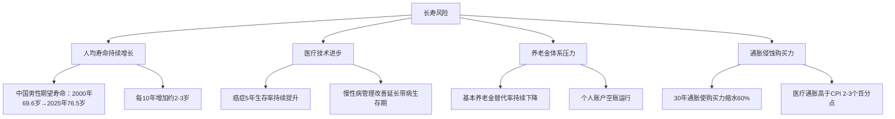

## 三、养老金精算与长寿风险管理

50岁之后，退休不再是遥远的概念，而是一个可以精确计算的财务事件。养老金精算就是用数学方法回答一个核心问题：**你准备的钱够不够花到生命终点？** 长寿风险管理则是在此基础上，确保即使你比预期多活10年、20年，生活质量也不会大幅下降。

这两个问题的答案，决定了你退休后是安心享受生活，还是每天焦虑地计算余额。

---

### 1. 为什么50岁必须开始精算

#### 1.1 从"还有时间"到"时间紧迫"的转折点

50岁之前，你还有10-15年的收入期，时间可以弥补规划不足。50岁之后，情况发生根本变化：

- **收入窗口收窄**：距离退休仅剩10-15年，主动收入即将归零
- **容错空间缩小**：一次重大投资失误可能无法通过后续收入弥补
- **医疗支出上升**：50岁后慢性病发病率陡增，医疗开支成为刚性支出
- **通胀侵蚀加速**：20-30年的退休期中，通胀会将购买力腰斩再腰斩

#### 1.2 精算思维 vs 经验思维

大多数人靠"感觉"判断退休准备是否充足——"差不多够了吧"、"到时候再说"。精算思维完全不同：

| 维度 | 经验思维 | 精算思维 |
|------|----------|----------|
| 寿命预期 | "我活到80岁差不多" | 基于生命表计算期望寿命和概率分布 |
| 收入测算 | "退休金应该够花" | 精确计算替代率和缺口 |
| 支出估算 | "到时候花不了多少钱" | 区分基本生活、医疗、通胀三类支出 |
| 投资策略 | "稳一点就行" | 基于久期匹配和风险容忍度的资产配置 |
| 风险应对 | "车到山前必有路" | 压力测试+对冲策略 |

50岁是建立精算思维的最后窗口——再晚，调整空间就太小了。

---

### 2. 养老金精算的核心概念

#### 2.1 生命表与期望寿命

生命表（Life Table）是精算的基础工具，它记录了不同年龄段人群的死亡概率和预期剩余寿命。

**中国经验生命表（2010-2013）关键数据：**

| 年龄 | 男性期望寿命 | 女性期望寿命 | 男性活到85岁概率 | 女性活到85岁概率 |
|------|------------|------------|----------------|----------------|
| 50岁 | 30.2年（至80.2岁） | 34.8年（至84.8岁） | 31.5% | 46.2% |
| 55岁 | 25.9年（至80.9岁） | 30.2年（至85.2岁） | 34.8% | 50.1% |
| 60岁 | 21.6年（至81.6岁） | 25.7年（至85.7岁） | 38.7% | 54.6% |
| 65岁 | 17.5年（至82.5岁） | 21.4年（至86.4岁） | 43.2% | 59.8% |

**关键洞察：**

- **期望寿命是平均值**，不是你的寿命。有50%的人会超过期望寿命
- **女性比男性多活4-5年**，但退休更早，需要准备的资金更多
- **活得越久，期望寿命越长**——65岁还活着的人，期望寿命比出生时的期望寿命还要长
- 一个50岁男性有31.5%的概率活到85岁，这个概率不低——你需要为这个"不太可能"做好准备

**实操建议：** 不要用期望寿命做退休规划。**建议用期望寿命+5年作为规划基准**，即男性规划到85岁，女性规划到90岁。如果家族有长寿史，再加5年。

#### 2.2 替代率（Replacement Ratio）

替代率 = 退休后收入 ÷ 退休前收入 × 100%

这是衡量退休生活质量的最核心指标。

**国际通行标准：**

| 替代率 | 生活质量描述 |
|--------|------------|
| 70%-80% | 维持退休前生活水平（发达国家推荐值） |
| 60%-70% | 基本舒适，需要调整部分消费习惯 |
| 50%-60% | 节俭生活，需要削减非必要开支 |
| <50% | 生活质量明显下降 |

**中国的现实情况：**

- 城镇职工基本养老保险的替代率约为 **40%-45%**（逐年下降趋势）
- 机关事业单位养老金替代率约为 **70%-80%**（并轨后逐步降低）
- 城乡居民养老保险的替代率仅 **15%-25%**

**缺口计算公式：**

```text
月度养老金缺口 = 退休前月收入 × 目标替代率 - 基本养老金月收入

示例：
退休前月收入：15,000元
目标替代率：70%
基本养老金月收入：5,500元（估算）

月度缺口 = 15,000 × 70% - 5,500 = 10,500 - 5,500 = 5,000元
年度缺口 = 5,000 × 12 = 60,000元
```

#### 2.3 养老金替代率的精算模型

基本养老金的计算涉及多个变量：

**城镇职工基本养老金 = 基础养老金 + 个人账户养老金**

```text
基础养老金 = (全省上年度在岗职工月平均工资 + 本人指数化月平均缴费工资) ÷ 2 × 缴费年限 × 1%

个人账户养老金 = 个人账户储存额 ÷ 计发月数
```

**计发月数对照表（国发[2005]38号）：**

| 退休年龄 | 计发月数 | 说明 |
|----------|----------|------|
| 50岁 | 195 | 女工人退休年龄 |
| 55岁 | 170 | 女干部退休年龄 |
| 60岁 | 139 | 男性退休年龄 |
| 65岁 | 101 | 延迟退休后 |
| 70岁 | 56 | 更晚退休 |

**精算实例：**

假设某人60岁退休，缴费30年，当地社平工资8,000元/月，本人平均缴费指数1.0，个人账户余额250,000元：

```text
基础养老金 = (8,000 + 8,000) ÷ 2 × 30 × 1% = 2,400元/月
个人账户养老金 = 250,000 ÷ 139 = 1,799元/月
月度养老金合计 = 2,400 + 1,799 = 4,199元/月

如果退休前月收入12,000元：
替代率 = 4,199 ÷ 12,000 = 35.0%（远低于70%目标）
月度缺口 = 12,000 × 70% - 4,199 = 4,201元
```

这个计算清晰地表明：**仅靠基本养老金，替代率严重不足**，必须通过其他渠道补充。

#### 2.4 资金需求总额精算

退休所需资金总额的计算，需要考虑三个核心变量：

```text
退休资金需求 = 年度支出 × 退休年数 × 通胀调整系数

其中：
- 年度支出 = 退休前年收入 × 目标替代率
- 退休年数 = 预期寿命 - 退休年龄
- 通胀调整系数需要逐年计算（复利效应）
```

**简化版"25倍法则"（源自4%提取率）：**

退休所需资金 = 年度开支 × 25

例如：退休后年开支10万 → 需要250万

但这个法则有两个重要前提：
1. 假设退休后生活25-30年
2. 假设投资回报率能跑赢通胀4个百分点

**更精确的计算需要使用精算年金公式：**

```text
退休资金需求 = Σ(第t年支出 / (1+r)^t)，t从1到n

其中：
r = 投资回报率 - 通胀率（实际回报率）
n = 退休年数
第t年支出 = 基准年度支出 × (1+通胀率)^t
```

---

### 3. 长寿风险的本质与量化

#### 3.1 什么是长寿风险

长寿风险（Longevity Risk）是指个人或群体的实际寿命超过预期寿命，导致养老金储备不足的风险。

用大白话说：**不是你花得太多，而是你活得太久。**

长寿风险包含两层含义：

1. **个体长寿风险**：你个人比预期多活了10年，但钱只准备了到80岁的
2. **系统性长寿风险**：整个社会的人均寿命都在增长，所有养老金体系都面临压力

#### 3.2 长寿风险的量化方法

**方法一：蒙特卡洛模拟**

通过大量随机模拟来估计退休资金耗尽的概率：

```text
模拟参数：
- 初始退休资金：200万元
- 年度支出：12万元（起始值）
- 通胀率：3%（均值，标准差1%）
- 投资回报率：6%（均值，标准差8%）
- 模拟次数：10,000次
- 退休年龄：60岁

模拟结果示例：
- 资金在80岁耗尽的概率：15%
- 资金在85岁耗尽的概率：38%
- 资金在90岁耗尽的概率：62%
- 资金能维持到95岁的概率：28%
```

**方法二：精算存活概率表**

根据生命表计算你活到每个年龄的概率，然后计算在每个年龄段资金耗尽的条件概率：

```text
60岁退休，200万资金，年支出12万（含通胀调整）：

年龄  | 存活概率 | 资金余额(万元) | 资金耗尽概率
------|----------|----------------|-------------
65岁  | 96.2%    | 172            | 0%
70岁  | 90.1%    | 138            | 2.1%
75岁  | 80.3%    | 96             | 12.5%
80岁  | 65.8%    | 42             | 35.7%
85岁  | 46.2%    | 0              | 62.1%
90岁  | 25.3%    | -48万(负债)    | 100%
```

#### 3.3 长寿风险的四大驱动因素



#### 3.4 中国特有的长寿风险加剧因素

1. **计划生育的遗产**：4-2-1家庭结构意味着子女赡养压力巨大，传统"养儿防老"模式不可持续
2. **独生子女一代的双重压力**：50后60后退休时，他们的独生子女正处于事业和育儿的双重压力期
3. **城乡二元结构**：农村养老金水平远低于城镇，但农村医疗资源更匮乏
4. **延迟退休的不确定性**：渐进式延迟退休政策会影响养老金领取时间和金额
5. **房产依赖症**：很多家庭70%以上的资产是房产，流动性差，变现成本高

---

### 4. 长寿风险管理的六大策略

#### 4.1 策略一：分层资金池架构

将退休资金分为三个层次，对应不同的时间跨度和风险偏好：

```mermaid
graph LR
    subgraph 第一层：即时层
        A[2年生活费<br/>现金/货基<br/>随时可取]
    end
    subgraph 第二层：中期层
        B[3-10年生活费<br/>债券/固收+<br/>稳健增值]
    end
    subgraph 第三层：长期层
        C[10年以上资金<br/>权益/房产/年金<br/>对抗通胀]
    end
    
    A --> B --> C
```

**具体配置建议（以200万退休资金、年支出12万为例）：**

| 层级 | 金额 | 占比 | 资产类别 | 目标 |
|------|------|------|----------|------|
| 即时层 | 24万 | 12% | 货币基金、大额存单、国债逆回购 | 流动性，随时可用 |
| 中期层 | 60万 | 30% | 中短债基金、银行理财、国债 | 稳健收益，3-5%年化 |
| 长期层 | 116万 | 58% | 指数基金、REITs、养老目标基金、年金险 | 对抗通胀，6-8%年化 |

**每年再平衡规则：**
- 每年初将长期层收益补充到即时层，确保即时层始终有2年生活费
- 如果长期层表现好，超额收益转入中期层作为"安全垫"
- 如果长期层大幅缩水，缩减当年支出5-10%，等待恢复

#### 4.2 策略二：年金化策略（Annuity）

年金是唯一能对冲"活得太久"风险的金融工具——你向保险公司缴纳一笔钱，保险公司承诺在你存活期间每月支付固定金额。

**年金的核心优势：**
- **终身领取**：无论活多久，每月都有钱拿
- **消除不确定性**：不需要自己管理投资
- **强制储蓄**：避免早期过度消费

**年金的劣势：**
- **通胀侵蚀**：固定年金的购买力随时间下降
- **流动性差**：一旦购买，本金通常无法取回
- **收益率偏低**：内部回报率通常低于自行投资
- **信用风险**：依赖保险公司的偿付能力

**年金产品对比：**

| 类型 | 特点 | 适合人群 | 预期月领/10万保费 |
|------|------|----------|------------------|
| 即期年金 | 一次性缴费，次月开始领取 | 60岁+急需现金流 | 约500-600元/月 |
| 递延年金 | 分期缴费，约定年龄开始领取 | 50-55岁有规划期 | 视缴费期和领取期而定 |
| 增额年金 | 每年领取金额按固定比例增长 | 担心通胀 | 起始较低，后期递增 |
| 万能型年金 | 保底收益+浮动收益 | 想要保底又有增值空间 | 保底400元/月，实际可能更高 |

**年金精算定价原理：**

保险公司定价基于"大数法则"——集合大量投保人，利用死亡率表计算预期支付年数：

```text
公平年金价格 = Σ(P(t) × PMT / (1+r)^t)，t从1到无穷

其中：
P(t) = 第t年存活概率
PMT = 每期支付金额
r = 保险公司投资回报率
```

**实操建议：** 不要把所有钱都年金化。建议将退休资金的20%-30%用于购买年金，作为"基础收入层"，其余资金自行管理以获取更高回报。

#### 4.3 策略三：动态提取率策略

传统的"4%法则"（每年提取退休资金的4%）过于简单。动态提取率根据市场表现和剩余寿命调整提取金额。

**三种动态策略：**

**（1）基于市场表现的动态提取**

```text
规则：
- 前一年投资回报 > 8%：提取率上调0.5%
- 前一年投资回报 4%-8%：维持当前提取率
- 前一年投资回报 0%-4%：提取率下调0.5%
- 前一年投资回报 < 0%：提取率下调1%

示例（基础提取率4%）：
第1年回报12% → 提取率4.5%
第2年回报-5% → 提取率3.5%
第3年回报6% → 提取率4.0%
```

**（2）基于剩余寿命的动态提取**

每年根据生命表更新期望剩余寿命，重新计算提取率：

```text
年度提取额 = 当前资金余额 ÷ 剩余期望寿命

示例：
65岁，资金余额180万，剩余期望寿命18年
当年提取额 = 180万 ÷ 18 = 10万

70岁，资金余额155万，剩余期望寿命15年
当年提取额 = 155万 ÷ 15 = 10.3万
```

**（3）地板-天花板策略（Floor-Ceiling）**

设置提取金额的下限（地板）和上限（天花板）：

```text
规则：
- 地板 = 上一年提取金额 × 90%（最多降10%）
- 天花板 = 上一年提取金额 × 105%（最多涨5%）

效果：保证生活水平不会剧烈波动
```

#### 4.4 策略四：长寿风险对冲资产配置

某些资产类别天然具有对冲长寿风险的特性：

**通胀保护类：**
- **TIPS（通胀保护债券）**：本金随CPI调整，确保实际购买力
- **REITs（房地产信托）**：租金收入通常随通胀增长
- **大宗商品ETF**：直接跟踪商品价格，天然抗通胀

**收入稳定类：**
- **高股息股票组合**：成熟企业的稳定分红
- **基础设施基金**：收费公路、电力等公用事业的稳定现金流
- **租赁房产**：长期租金收入（需考虑管理成本和空置率）

**推荐的"抗长寿风险"组合：**

| 资产类别 | 配置比例 | 功能 |
|----------|----------|------|
| 宽基指数基金 | 30% | 长期资本增值，跑赢通胀 |
| 高股息蓝筹 | 15% | 稳定现金流 |
| REITs | 10% | 租金收入+通胀对冲 |
| 中长期国债 | 20% | 稳定收益，降低波动 |
| TIPS/通胀保值债 | 10% | 直接对冲通胀 |
| 年金保险 | 15% | 终身收入保障 |

#### 4.5 策略五：延迟退休与收入延续

每多工作一年，对退休财务的改善是三重的：

1. **多一年收入积累**：继续存钱和投资
2. **少一年资金消耗**：退休资金多撑一年
3. **养老金增加**：缴费年限每多一年，基础养老金增加约1%

**延迟退休的财务影响测算：**

假设60岁退休 vs 65岁退休：

| 指标 | 60岁退休 | 65岁退休 | 差异 |
|------|----------|----------|------|
| 缴费年限 | 30年 | 35年 | +5年 |
| 个人账户余额 | 25万 | 38万 | +13万 |
| 月度养老金 | 4,199元 | 5,942元 | +1,743元 |
| 退休资金储备 | 200万 | 285万 | +85万 |
| 资金耗尽年龄 | 约80岁 | 约90岁 | +10年 |

**半退休模式（Phased Retirement）：**

不是所有人都能或愿意全职工作到65岁。半退休模式是一种折中方案：

- 55-60岁：从全职转为兼职/顾问/自由职业
- 60-65岁：仅承接项目制工作，收入减半但覆盖基本开支
- 65岁+：完全退休，依靠养老金和投资收入

这种模式的关键是：**在50岁时就开始为半退休做准备**——建立副业、培养可变现的技能、构建人脉网络。

#### 4.6 策略六：医疗费用的专项规划

医疗支出是退休后最大的不确定性之一，也是长寿风险的重要组成部分。

**中国退休人员医疗支出估算：**

| 年龄段 | 年均医疗支出（不含大病） | 大病概率 | 大病平均费用 |
|--------|------------------------|----------|-------------|
| 60-70岁 | 8,000-15,000元 | 8%/年 | 15-30万元 |
| 70-80岁 | 15,000-30,000元 | 15%/年 | 20-50万元 |
| 80岁+ | 30,000-60,000元 | 25%/年 | 25-60万元 |

**医疗费用精算：**

```text
假设60岁退休，预期寿命85岁：

基础医疗费用总额 = Σ(各年龄段年均费用 × 存续年数)
≈ 8,000×10 + 20,000×10 + 40,000×5 = 48万元

大病储备金（概率加权）：
60-70岁：8% × 10年 × 20万 = 16万
70-80岁：15% × 10年 × 35万 = 52.5万
80-85岁：25% × 5年 × 40万 = 50万
合计期望值 ≈ 118.5万

考虑大病概率叠加（一生中至少得一次大病的概率很高）：
保守估计需要单独准备 80-120万 的医疗储备
```

**医疗费用应对组合：**

| 工具 | 作用 | 建议配置 |
|------|------|----------|
| 基本医保 | 覆盖基础门诊和住院 | 必须参保 |
| 百万医疗险 | 大病住院费用报销 | 50岁前投保，锁定费率 |
| 重疾险 | 确诊即赔，弥补收入损失 | 50岁前投保，保额30-50万 |
| 医疗专项储蓄 | 自付部分和未覆盖项目 | 单独账户，50-100万 |
| 长期护理险 | 失能后的护理费用 | 有条件的话配置 |

---

### 5. 三支柱养老金体系的精算分析

#### 5.1 三支柱模型概览

中国正在构建"三支柱"养老金体系，每一支柱的精算特征完全不同：

```mermaid
graph TB
    subgraph 第一支柱：基本养老保险
        A1[城镇职工基本养老保险]
        A2[城乡居民基本养老保险]
    end
    subgraph 第二支柱：企业/职业年金
        B1[企业年金<br/>覆盖率<10%]
        B2[职业年金<br/>机关事业单位强制]
    end
    subgraph 第三支柱：个人养老金
        C1[个人养老金账户<br/>年缴上限12,000元]
        C2[商业养老保险]
        C3[养老目标基金]
    end
    
    A1 --> D[退休收入]
    A2 --> D
    B1 --> D
    B2 --> D
    C1 --> D
    C2 --> D
    C3 --> D
```

#### 5.2 第一支柱精算评估

**城镇职工基本养老保险的可持续性问题：**

- 替代率从2000年的70%+下降到当前的40%左右，仍在持续下滑
- 个人账户"空账"规模超过万亿，实际运行更接近"现收现付"
- 抚养比（缴费人数/领取人数）从2000年的5:1下降到当前的约2.5:1，预计2035年降至2:1
- 基金收支平衡压力巨大，部分省份已出现当期收不抵支

**对个人的含义：** 不要过度依赖第一支柱。把它当作"基础保障"而非"全部依靠"。

#### 5.3 第二支柱精算评估

**企业年金：**
- 覆盖率极低，仅约3000万职工（占城镇职工的不到10%）
- 主要集中在国企和大型民企
- 如果你有企业年金，一定要参与——这是"白拿的钱"

**企业年金的预估收益：**

```text
假设企业与个人各缴4%，月缴基数10,000元：
月缴总额 = 10,000 × 8% = 800元
年缴总额 = 800 × 12 = 9,600元
缴费20年，年化收益5%：
终值 ≈ 9,600 × [(1.05^20 - 1) / 0.05] ≈ 318,000元
按139个月计发 → 约2,288元/月
```

**职业年金：**
- 机关事业单位强制参加
- 个人缴4%，单位缴8%
- 收益可观，但受制于投资管理水平

#### 5.4 第三支柱精算评估

**个人养老金账户：**

2022年11月正式实施，核心特征：
- 年缴上限12,000元（未来可能上调）
- 享受税收优惠：缴费抵扣个税，投资收益免税，领取时按3%征税
- 可投资范围：储蓄、理财、基金、保险四类产品

**税收优惠的实际价值（不同收入人群）：**

| 月收入 | 边际税率 | 年缴12,000元节税额 | 节税比例 |
|--------|----------|-------------------|----------|
| 8,000-17,000元 | 10% | 1,200元 | 10% |
| 17,000-30,000元 | 20% | 2,400元 | 20% |
| 30,000-40,000元 | 25% | 3,000元 | 25% |
| 40,000-60,000元 | 30% | 3,600元 | 30% |
| 85,000元+ | 45% | 5,400元 | 45% |

**关键结论：** 月收入低于8,000元的人群（适用3%税率），个人养老金没有税收优势——因为领取时也是按3%征税。只有边际税率高于3%的纳税人才真正受益。

**第三支柱的精算局限：**
- 年缴12,000元的上限太低，难以真正弥补养老金缺口
- 即使缴费30年、年化收益6%，终值也仅约100万，月领约6,000元
- 对高收入人群：杯水车薪
- 对低收入人群：税收优惠有限

---

### 6. 50岁的精算行动清单

#### 6.1 精算自查五步法

**第一步：摸清家底（1小时内完成）**

```text
资产清单：
□ 基本养老保险个人账户余额（登录当地社保网站查询）
□ 企业年金/职业年金余额（问HR或登录年金管理平台）
□ 个人养老金账户余额
□ 银行存款和理财产品
□ 基金和股票账户
□ 房产市值（参考同小区近期成交价）
□ 其他资产（保单现金价值、借出的钱等）

负债清单：
□ 房贷余额
□ 车贷余额
□ 其他负债

净资产 = 资产总计 - 负债总计
```

**第二步：测算养老金收入（30分钟）**

```text
使用"国家社会保险公共服务平台"的养老金测算工具：
https://si.12333.gov.cn

或手动计算（见本文2.3节公式）

记录：
□ 预计月度基本养老金：______元
□ 预计月度企业/职业年金：______元
□ 预计月度个人养老金：______元
□ 月度养老金收入合计：______元
```

**第三步：测算退休支出（30分钟）**

```text
基本生活支出：
□ 食品和日用品：______元/月
□ 水电燃气物业：______元/月
□ 交通通讯：______元/月
□ 医疗保健：______元/月（预估，含保险）
□ 文化娱乐：______元/月
□ 人情往来：______元/月
□ 其他：______元/月
合计：______元/月

注意：用今天的物价计算，后续用通胀率调整
```

**第四步：计算缺口（10分钟）**

```text
月度养老金缺口 = 月度支出 - 月度养老金收入
年度养老金缺口 = 月度缺口 × 12
退休年数 = 目标寿命 - 退休年龄
资金总缺口 = 年度缺口 × 退休年数 × 通胀调整系数
```

**第五步：制定补缺计划（1小时内完成）**

```text
□ 还有____年退休
□ 需要额外积累____万元
□ 每年需要存/投资____万元
□ 每月需要存/投资____元
□ 预期投资回报率：____%
□ 是否需要调整退休年龄：是/否
□ 是否需要调整退休后支出预期：是/否
```

#### 6.2 不同资金状况的应对方案

**情况一：养老金充足（缺口为负或很小）**

恭喜！你的主要任务是保值和防风险：
- 重点做好医疗费用规划
- 考虑购买年金锁定终身收入
- 适度配置抗通胀资产
- 制定遗产规划

**情况二：有缺口但可控（缺口占总需求20%以内）**

通过调整可以弥补：
- 延迟退休2-3年
- 适度降低退休支出预期（5-10%）
- 提高投资配置中权益类比例
- 考虑退休后兼职收入

**情况三：缺口较大（缺口占总需求20-50%）**

需要系统性调整：
- 延迟退休5年以上或转为半退休模式
- 大幅优化资产配置（减少房产持有、增加金融资产）
- 考虑置换到生活成本更低的城市
- 最大化利用第三支柱税收优惠
- 子女赡养协商

**情况四：严重不足（缺口超过50%）**

需要根本性改变：
- 延长工作年限，探索"退而不休"模式
- 重新评估房产（卖大买小、以房养老、出租部分房间）
- 极简生活方式规划
- 申请政府补贴和救助
- 家庭互助养老

---

### 7. 常见误区与纠正

#### 误区一："我有养老金就够了"

**现实：** 基本养老金替代率仅40%左右，且呈下降趋势。仅靠基本养老金，生活水平会大幅下降。

**纠正：** 养老金只是"地基"，还需要第二、三支柱和个人储蓄作为"楼层"。

#### 误区二："退休后花得少"

**现实：** 退休初期（60-75岁）的支出可能确实减少（不用通勤、不用买职业装），但75岁后的医疗和护理费用会急剧增加。

**纠正：** 退休后支出呈"U型曲线"——初期下降，中期平稳，后期陡增。规划时要覆盖整个退休期，尤其不能忽略最后10-15年的高额支出。

#### 误区三："房子就是最好的养老保障"

**现实：** 房产流动性差，变现需要时间和成本。如果急需用钱（比如大病），卖房可能被迫低价出手。而且中国的房产税预期、房屋老龄化维护成本都是隐患。

**纠正：** 房产是资产的一部分，但不能是全部。需要保持一定比例的流动金融资产。

#### 误区四："投资回报率越高越好"

**现实：** 高回报必然伴随高风险。退休后的资金没有"回血"机会——亏掉的本金不会自动恢复。

**纠正：** 退休投资的核心是"不亏损"，而不是"高收益"。先确保本金安全，再追求合理回报。

#### 误区五："精算太复杂，我算不来"

**现实：** 精确精算确实需要专业知识，但个人退休规划不需要那么精确。关键数字只有几个：退休总需求、已有储备、缺口、每年需存多少。

**纠正：** 用本文提供的简化公式和工具，花一个下午就能完成基本的精算评估。不精确的计划远好于没有计划。

#### 误区六："通胀没那么可怕"

**现实：** 3%的通胀率在20年后会让你的购买力缩水45%。如果医疗通胀是5-6%，30年后的医疗费用将是现在的4-5倍。

**纠正：** 退休规划必须用实际回报率（名义回报率-通胀率）计算，不能用名义回报率。

---

### 8. 工具与资源

#### 8.1 养老金计算工具

| 工具 | 用途 | 获取方式 |
|------|------|----------|
| 国家社保公共服务平台 | 养老金测算、缴费查询 | si.12333.gov.cn |
| 人社部12333 APP | 社保查询、养老金测算 | 各应用商店下载 |
| 个人养老金信息平台 | 第三支柱产品查询和购买 | 第三方平台（支付宝/银行APP等） |

#### 8.2 精算辅助工具

| 工具 | 用途 | 说明 |
|------|------|------|
| Excel/表格软件 | 退休资金缺口计算 | 用本文公式自行建模 |
| 蒙特卡洛模拟工具 | 退休资金耗尽概率 | Portfolio Visualizer等在线工具 |
| 生命表查询 | 期望寿命和存活概率 | 国家统计局/精算协会发布 |

#### 8.3 专业服务

当以下情况出现时，建议寻求专业精算师或理财规划师的帮助：

- 净资产超过500万，资产结构复杂
- 有企业年金、股权激励等非标准收入
- 涉及跨境养老（海外资产、移民）
- 有特殊健康状况需要长期护理规划
- 涉及遗产规划和代际财富传承

---

### 9. 关键认知总结

1. **精算不是玄学**：用数学回答"钱够不够"的问题，50岁是建立精算思维的最后窗口
2. **长寿是风险也是祝福**：关键在于是否有财务准备去享受多出来的岁月
3. **三支柱缺一不可**：基本养老、企业/职业年金、个人养老金和储蓄，层层叠加
4. **动态管理优于静态规划**：每年根据实际情况调整策略，而非一成不变
5. **医疗费用是最大变量**：专项规划，专项储备，不要寄望于"应该不会生大病"
6. **延迟退休是最强杠杆**：多工作一年的财务效果，相当于多存好几年的钱
7. **分层配置是核心方法**：即时层保安全，中期层保稳定，长期层保增值
8. **年金是唯一对冲工具**：把一部分钱变成终身收入，消除"活太久没钱花"的风险

> 50岁不是规划养老的终点，而是精确规划的起点。用精算的方法，把不确定性变成可控的概率，这就是长寿风险管理的本质。
