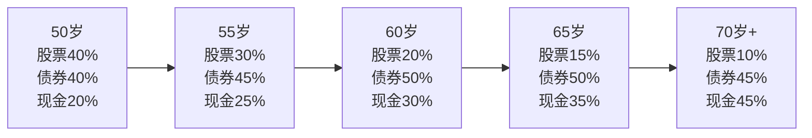
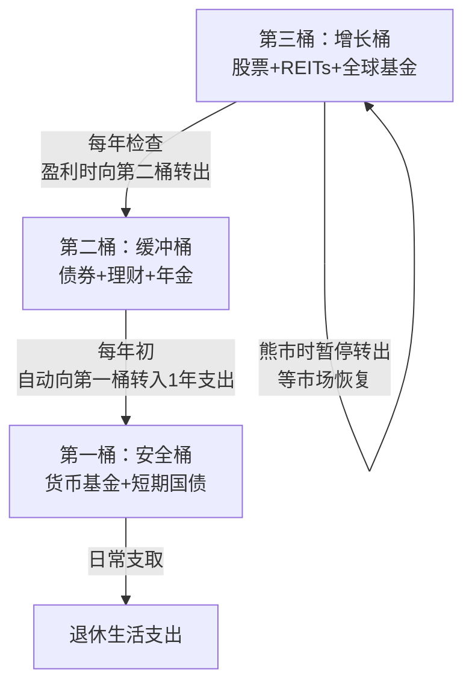
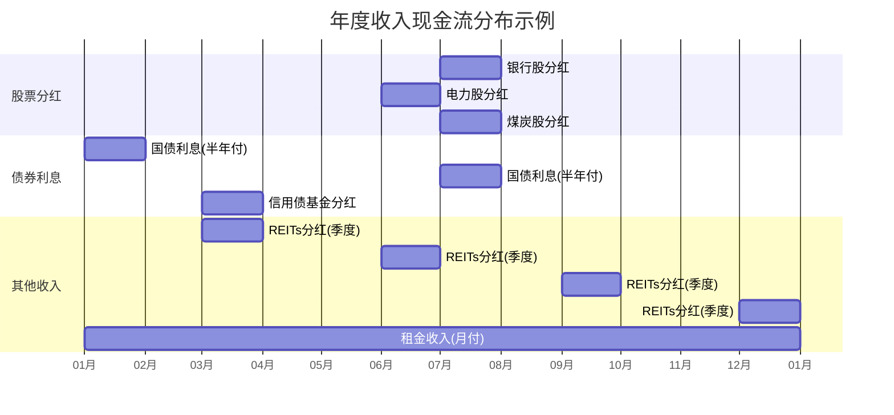
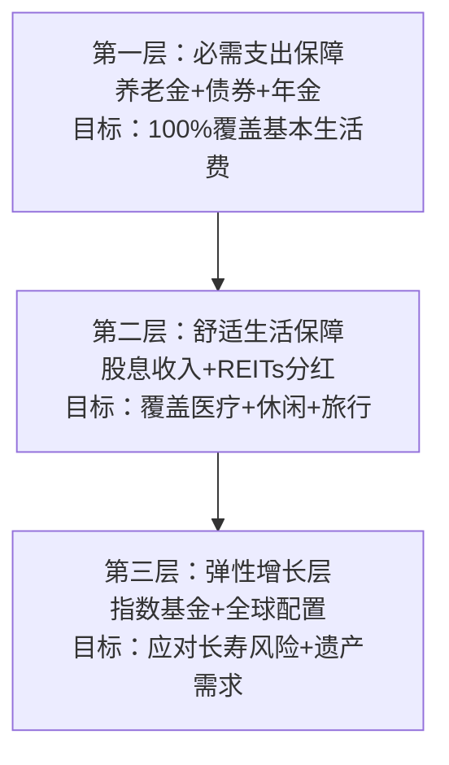

## 四、50+人群的资产配置理论

50岁是人生的财务分水岭——前半生积累财富，后半生守护和消耗财富。这个阶段的资产配置不再是"怎么赚更多"，而是"怎么确保够用一辈子"。本节系统介绍适用于50岁以上人群的核心配置理论，从经典的滑翔路径到前沿的负债驱动投资，帮助读者建立科学的退休资产配置框架。

### 4.1 滑翔路径理论在50+阶段的应用

"滑翔路径"（Glide Path）理论源于美国养老金管理实践，核心思想是：随着退休时间临近，投资组合应逐步从高风险资产向低风险资产转移，如同飞机降落时的滑翔轨迹——平稳下降，而非骤然俯冲。

#### 4.1.1 理论基础与演变

滑翔路径的学术根基来自三个理论：

**生命周期假说（Life-Cycle Hypothesis）**：由弗兰科·莫迪利亚尼（Franco Modigliani）于1954年提出。该理论认为，理性人会将一生的收入平滑分配到各阶段消费。年轻时收入低于消费潜力，可以借贷或承担高风险投资；中年时收入达到峰值，偿还债务并积累储蓄；退休后消耗储蓄。因此，风险承受能力随年龄递减。

**人力资本理论**：年轻人拥有人力资本（未来劳动收入的折现值），这部分"资产"相对稳定，相当于隐性债券，因此可以将金融资产更多配置于股票。50岁以后，人力资本大幅缩水，金融资产成为主要依靠，必须降低风险敞口。

**目标日期基金实践**：先锋集团（Vanguard）、富达（Fidelity）等机构的目标日期基金（Target-Date Fund）将滑翔路径产品化。以先锋2035目标退休基金为例，其股票配置从距退休25年的75%逐步降至退休时的约50%，退休后继续降至30%左右。

#### 4.1.2 50岁以后各阶段的配置基准

下表给出基于主流研究的配置建议，实际操作需根据个人情况调整：

| 年龄段 | 股票类资产 | 债券类资产 | 现金类资产 | 另类资产 | 核心逻辑 |
|:---|:---|:---|:---|:---|:---|
| 50-55岁 | 35-40% | 40-45% | 15-20% | 0-5% | 距退休10-15年，仍需适度增长 |
| 55-60岁 | 25-30% | 45-50% | 20-25% | 0-5% | 退休过渡期，稳定性优先 |
| 60-65岁 | 20-25% | 45-50% | 25-30% | 0-5% | 退休初期，收入导向 |
| 65-70岁 | 15-20% | 45-50% | 30-35% | 0-5% | 退休中期，防通胀+流动性 |
| 70岁以上 | 10-15% | 40-45% | 40-45% | 0-5% | 高龄期，安全性和流动性至上 |



> **关键数据**：根据晨星（Morningstar）2023年《目标日期基金景观报告》，全球主流目标日期基金在退休时点的平均股票配置为42%，退休20年后降至28%。这比传统建议略高，反映了低利率环境下对收益的更高需求。

#### 4.1.3 滑翔路径的中国本土化修正

直接套用美国数据在中国市场存在三个偏差，需要修正：

**偏差一：社保替代率差异**。美国社会保障的替代率约为40%，中国基本养老保险的替代率约为45%（体制内）或30-35%（企业职工）。替代率越低，退休后越依赖个人投资收益，风险资产配置应略高于美国标准。

**偏差二：资本市场成熟度差异**。中国债券市场的信用评级体系、流动性、品种丰富度不及美国成熟市场。实际操作中，"债券类资产"在中国可能需要以国债、政金债、高等级信用债基金为主，而非美国常见的公司债组合。

**偏差三：房产在中国家庭资产中的特殊地位**。中国家庭资产中房产占比高达60-70%，远高于美国的25-30%。自住房产虽然不产生现金流，但大幅降低了住房支出需求。如果有租金收入的房产，实际上已经承担了"收入型资产"的角色，金融资产配置可以适当提高风险偏好。

**本土化修正建议**：

| 修正维度 | 美国基准 | 中国修正 | 修正理由 |
|:---|:---|:---|:---|
| 55岁股票配置 | 25-30% | 30-35% | 社保替代率低，需更多增长 |
| 债券配置结构 | 公司债为主 | 国债+政金债为主 | 信用风险差异 |
| 现金配置 | 20-25% | 15-20% | 货币基金收益率较高 |
| 另类资产 | 0-5% | 视房产情况调整 | 房产已承担部分另类资产角色 |

#### 4.1.4 滑翔路径的局限性

滑翔路径并非完美方案，存在以下局限：

**忽略个人差异**。同样是55岁，一位有500万存款、无房贷、子女已独立的人，与一位只有100万存款、还有房贷、需要资助子女的人，风险承受能力天差地别。滑翔路径给出的是"平均值"，不能替代个性化评估。

**忽略市场估值**。滑翔路径按时间机械调仓，不考虑市场估值水平。如果在股市泡沫期（如2007年A股6000点附近）按计划仍保持35%的股票配置，可能遭受不必要的损失。相反，在市场极度悲观时（如2024年A股2700点附近）按计划减仓，可能错失廉价筹码。

**忽略长寿风险**。滑翔路径假设一个固定的退休年限（通常假设到85-90岁），但如果活到95岁甚至100岁，过于保守的配置可能导致后期资金不足。

**解决方案**：将滑翔路径作为"基准线"，在此基础上结合估值信号（如巴菲特指标、股债收益率比）和个人实际情况进行±10%的动态调整。这引出了下一节的动态资产配置理论。

### 4.2 桶型资产配置法

"桶型配置"（Bucket Strategy）由财务规划师哈罗德·埃文斯基（Harold Evensky）于1985年首次提出，后经韦斯·莫斯（Wes Moss）等人的实践推广，成为美国退休规划领域最受欢迎的配置方法之一。其核心思想是：将资产按时间维度分装到不同的"桶"中，每个桶使用不同的配置策略，从根本上解决"短期需要钱但长期需要增长"的矛盾。

#### 4.2.1 三桶模型详解

**第一桶：安全桶（1-3年生活费用）**

这一桶的唯一使命是：无论市场发生什么，未来3年的生活费不会受到任何影响。

资产配置细节：

| 资产类型 | 具体品种 | 预期年化收益 | 流动性 | 安全性 |
|:---|:---|:---|:---|:---|
| 货币基金 | 余额宝、零钱通等 | 1.5-2.5% | T+0/T+1 | 极高 |
| 银行活期/通知存款 | 大行活期/7天通知 | 0.2-1.5% | 即时/7天 | 极高 |
| 短期国债 | 1年期、3年期储蓄国债 | 2.0-2.8% | 持有到期 | 极高 |
| 短期银行理财 | R1-R2风险等级 | 2.5-3.5% | 视产品而定 | 高 |
| 大额存单 | 20万起存 | 2.0-2.6% | 可转让 | 极高 |

规模计算：假设月生活支出8000元，年支出约10万元，第一桶应保持30万元。如果退休后有养老金收入（如每月5000元），则第一桶可缩减至（8000-5000）×12×3 = 10.8万元。

**第二桶：缓冲桶（3-10年生活费用）**

这一桶是安全桶和增长桶之间的"缓冲区"，目标是在承担有限风险的前提下获得略高于通胀的收益，同时定期向第一桶"补水"。

资产配置细节：

| 资产类型 | 具体品种 | 预期年化收益 | 风险等级 | 适合比例 |
|:---|:---|:---|:---|:---|
| 中长期国债 | 5年期、10年期国债 | 2.5-3.2% | 低 | 30-40% |
| 高等级债券基金 | AAA级信用债基金 | 3.0-4.5% | 中低 | 20-30% |
| 银行中长期理财 | R2-R3风险等级 | 3.0-4.0% | 中低 | 15-20% |
| 保本型结构存款 | 挂钩利率/汇率 | 2.5-4.0% | 低 | 10-15% |
| 年金保险 | 固定收益型年金 | 2.5-3.5% | 极低 | 10-15% |

规模计算：接上例，第二桶应保持70万元（年支出10万×7年，减去养老金覆盖部分后约40-50万元）。

**第三桶：增长桶（10年以上生活费用）**

这一桶的使命是长期资本增值，抵御通胀，确保30年甚至更长的退休生涯中资产不会枯竭。

资产配置细节：

| 资产类型 | 具体品种 | 预期年化收益 | 风险等级 | 适合比例 |
|:---|:---|:---|:---|:---|
| 宽基指数基金 | 沪深300ETF、中证500ETF | 6-10% | 中高 | 30-40% |
| 高股息股票 | 银行、电力、高速公路龙头 | 4-8%（含股息） | 中 | 20-30% |
| REITs | 公募REITs（仓储、产业园） | 4-8% | 中 | 10-15% |
| 全球指数基金 | QDII基金（标普500/全球） | 6-10% | 中高 | 10-15% |
| 黄金ETF | 黄金基金 | 对冲通胀 | 中 | 5-10% |

#### 4.2.2 桶之间的运作机制

桶型配置不是"装好就不管"的静态方案，关键在于桶之间的资金流转：



**年度再平衡流程**：

1. **每年1月**：从第二桶转入第一桶，金额为当年预计生活支出（扣除养老金收入后的缺口）。
2. **每年6月/12月**：检查第三桶的盈亏情况。
3. **如果第三桶盈利超过15%**：将超额利润部分转入第二桶，补充缓冲。
4. **如果第三桶亏损超过20%**：暂停从第二桶向第一桶的转入（第二桶本身有3-10年的缓冲），等待市场恢复。
5. **每3-5年**：全面评估三个桶的规模是否需要调整（如生活支出变化、医疗费用增加等）。

#### 4.2.3 桶型配置的优势与陷阱

**核心优势**：

- **心理安全感**：知道自己未来3年的钱绝对安全，面对股市暴跌不会恐慌抛售。行为金融学研究表明，损失厌恶（Loss Aversion）是退休投资者最大的敌人，桶型配置从结构上解决了这个问题。
- **纪律性再平衡**：不需要判断市场时机，按规则操作即可。研究表明，系统性再平衡策略长期回报优于择时策略。
- **灵活性**：可以根据个人情况调整桶的数量（2桶、3桶、4桶均可）和每个桶的规模。

**常见陷阱**：

- **陷阱一：第一桶过大**。有些投资者因为恐惧，将5年甚至10年的生活费都放在现金里，导致长期收益率过低，反而增加了后期资金枯竭的风险。经验值：第一桶不超过总资产的20-25%。
- **陷阱二：第三桶过于保守**。有些人在第三桶里也放了大量债券，等于整个组合都偏向保守。第三桶是10年以上不用的钱，完全可以承受较高波动。
- **陷阱三：忘记"补水"**。桶型配置的精髓在于定期再平衡，如果只取不补，第一桶会越来越空，第三桶的钱却锁定在高风险资产中无法及时变现。
- **陷阱四：忽略通胀侵蚀**。第一桶里的钱每年贬值2-3%，如果规模过大（比如放了10年生活费），10年后的购买力会缩水20-30%。

#### 4.2.4 中国市场实操案例

**案例：王女士，55岁，计划60岁退休**

基本情况：
- 金融资产总额：200万元
- 退休后月养老金：6000元
- 退休后月生活支出：1.2万元
- 月养老金缺口：6000元，年缺口7.2万元

桶型配置方案：

| 桶 | 规模 | 占比 | 具体配置 |
|:---|:---|:---|:---|
| 第一桶（安全） | 22万元 | 11% | 余额宝10万 + 1年期国债12万 |
| 第二桶（缓冲） | 58万元 | 29% | 5年期国债20万 + 高等级债基20万 + 银行理财18万 |
| 第三桶（增长） | 120万元 | 60% | 沪深300ETF 40万 + 高股息组合30万 + 公募REITs 20万 + QDII基金20万 + 黄金ETF 10万 |

年度操作规则：
- 每年1月从第二桶转入第一桶7.2万元（当年养老金缺口）
- 第三桶年收益超过15%时，将超额部分转入第二桶
- 第三桶亏损超过20%时，暂停转入，动用第二桶余额维持生活

### 4.3 收入导向型投资理论

50岁以前，投资者的KPI是"资产总值增长"；50岁以后，KPI应该切换为"被动收入覆盖生活支出"。这种从"增值导向"到"收入导向"的转变，是退休投资最核心的范式转换。

#### 4.3.1 收入导向的理论基础

收入导向投资的理论根基是"4%法则"的修正版本。

**经典4%法则**：1994年，财务顾问威廉·本根（William Bengen）基于美国1926-1992年的历史数据，得出结论：退休第一年从投资组合中提取4%，之后每年按通胀率调整提取金额，在30年内资金耗尽的概率极低（不到5%）。

**4%法则的局限**：
- 基于美国市场数据，中国市场的波动率更高、债券收益率结构不同
- 当前全球利率环境与1990年代差异巨大
- 没有考虑长寿风险（30年够不够？）
- 没有考虑医疗费用的非线性增长

**修正版本——动态提取率**：根据杰德·比尔德（Jade Bickle）等学者的研究，更合理的做法是：

| 市场环境 | 建议提取率 | 说明 |
|:---|:---|:---|
| 股市估值处于历史低位（PE<12） | 4.5-5.0% | 低估意味着未来回报更高 |
| 股市估值正常（PE 12-20） | 3.5-4.5% | 标准区间 |
| 股市估值处于历史高位（PE>25） | 2.5-3.5% | 高估意味着未来回报更低 |

> **中国市场参考**：沪深300指数的PE中位数约为12-13倍。当PE低于10倍时（如2024年部分时点），属于明显低估，可以适度提高提取率；当PE超过18倍时，应降低提取率。

#### 4.3.2 收入型资产全景图

以下是适合50+人群的收入型资产详细对比：

| 资产类型 | 代表品种 | 预期年化收入 | 收入稳定性 | 本金波动 | 适合比例 |
|:---|:---|:---|:---|:---|:---|
| 高股息A股 | 工商银行、长江电力、中国神华 | 4-7%（含股息） | 中高 | 中 | 15-25% |
| 港股高息股 | H股银行、港股电信 | 5-8% | 中高 | 中高 | 5-10% |
| 公募REITs | 华安张江REIT、中金普洛斯REIT | 4-7% | 中 | 中 | 5-10% |
| 国债/政金债 | 10年期国债、国开债 | 2.5-3.5% | 极高 | 低 | 20-30% |
| 高等级信用债基金 | AAA级企业债基金 | 3.5-5.0% | 高 | 中低 | 10-15% |
| 银行大额存单 | 3年/5年期 | 2.0-2.8% | 极高 | 无 | 10-15% |
| 储蓄型保险 | 年金险、增额终身寿 | 2.5-3.0%（保证） | 极高 | 无 | 5-15% |
| 出租房产 | 一二线城市住宅/商铺 | 2-4%（租金回报率） | 中 | 低 | 视已有房产 |

#### 4.3.3 高股息策略的深度实施

高股息策略是收入导向投资的核心支柱，但简单地"买高股息股票"远远不够。

**股息率陷阱（Dividend Trap）**：

股息率 = 每股股息 / 股价。当股价暴跌时，股息率会被动升高，看起来很诱人，但可能意味着公司基本面恶化，未来将削减股息。

识别股息率陷阱的五个信号：

1. **连续2年股息率超过8%且股价持续下跌**：市场在定价基本面恶化
2. **派息率超过80%**：公司几乎没有留存利润用于再投资，分红不可持续
3. **营收连续3个季度下滑**：利润下滑必然导致未来股息削减
4. **行业处于结构性衰退**：如传统煤化工、低端制造
5. **大股东频繁减持**：内部人比外部投资者更了解公司真实状况

**优质高股息股票的筛选标准**：

```text
基础条件：
  - 连续5年以上稳定分红
  - 当前股息率 ≥ 3%
  - 派息率 ≤ 70%
  - 资产负债率 ≤ 60%（金融业除外）

质量条件：
  - ROE ≥ 10%
  - 营收近3年复合增长率 ≥ 0%（至少不萎缩）
  - 自由现金流为正

加分项：
  - 行业龙头或寡头地位
  - 具有定价权（能将成本上涨转嫁给下游）
  - 国企背景（分红政策更稳定）
```

**A股高股息组合示例（仅供参考，非投资建议）**：

| 行业 | 代表公司 | 近5年平均股息率 | 核心逻辑 |
|:---|:---|:---|:---|
| 银行 | 工商银行、建设银行 | 5-7% | 盈利稳定，分红政策明确 |
| 电力 | 长江电力、华能国际 | 3-5% | 公用事业，需求刚性 |
| 煤炭 | 中国神华、陕西煤业 | 5-8% | 资源禀赋，现金流充沛 |
| 高速公路 | 宁沪高速、山东高速 | 4-6% | 收费权稳定，经营杠杆低 |
| 电信 | 中国移动、中国电信 | 4-6% | 5G投资高峰已过，分红提升 |

#### 4.3.4 收入组合的现金流日历

收入导向投资需要建立清晰的"现金流日历"，确保每月都有收入到账：



> **实操提示**：A股分红集中在每年5-8月，容易出现"半年有分红、半年没收入"的情况。可以通过配置不同分红月份的港股、季度分红的REITs、月付租金的理财产品来平滑现金流。

### 4.4 动态资产配置与再平衡理论

静态配置（设好比例就不管）和动态配置（根据市场信号调整）是两种截然不同的哲学。50+人群需要在两者之间找到平衡。

#### 4.4.1 再平衡的数学基础

再平衡的本质是"纪律性地高卖低买"。假设初始配置为股票60%、债券40%，一年后股票涨了20%、债券涨了3%，组合变为：

- 股票：60×1.2 = 72，占比 72/(72+41.2) = 63.6%
- 债券：40×1.03 = 41.2，占比 36.4%

如果不做再平衡，股票占比会越来越高，偏离目标风险水平。再平衡就是卖出部分股票、买入债券，恢复60/40的比例。

**再平衡的收益来源**（学术上称为"再平衡红利"或"波动率收割"）：

假设两个资产长期收益率相同（都是6%），但相关性低，再平衡可以产生额外收益。数学上，再平衡收益 ≈ 0.5 × σ² × (1 - ρ)，其中σ是波动率，ρ是相关性。波动率越高、相关性越低，再平衡的额外收益越大。

对于50+人群，这意味着：即使你的股债配置比例不变，定期再平衡本身就能带来0.5-1.5%的年化超额收益。

#### 4.4.2 三种再平衡策略对比

| 策略 | 触发条件 | 优点 | 缺点 | 适合人群 |
|:---|:---|:---|:---|:---|
| 定期再平衡 | 每季度/半年/年 | 简单易执行，无情绪干扰 | 可能错过极端市场的调仓机会 | 大多数50+投资者 |
| 阈值再平衡 | 任一资产偏离目标±5% | 对市场变化响应更及时 | 需要频繁监控 | 有时间关注市场的投资者 |
| 混合策略 | 每季度检查，偏离>5%则调仓 | 兼顾纪律性和灵活性 | 稍复杂 | 推荐的主流方案 |

**阈值设定建议**：

- 股票类资产：偏离目标±5个百分点触发再平衡（如目标30%，跌到25%或涨到35%时调仓）
- 债券类资产：偏离目标±5个百分点触发
- 现金类资产：偏离目标±3个百分点触发（现金波动小，阈值应更窄）

#### 4.4.3 基于估值的动态调整

在滑翔路径的基础上叠加估值信号，可以显著提高长期收益。这一方法由罗伯特·席勒（Robert Shiller）的CAPE比率研究提供理论支持。

**简化版估值调整规则**：

```text
基础配置 = 滑翔路径给出的目标比例（如55岁，股票30%）

估值调整：
  沪深300 PE < 10 → 股票配置上调 5-10%（如35-40%）
  沪深300 PE 10-15 → 维持基础配置（30%）
  沪深300 PE 15-20 → 股票配置下调 5%（如25%）
  沪深300 PE > 20 → 股票配置下调 10%（如20%）

调整频率：每季度评估一次，避免频繁操作
调整幅度：单次不超过±5%，避免大幅偏离滑翔路径
```

> **重要提醒**：估值调整是"锦上添花"而非"救命稻草"。历史数据表明，估值调整可以在长期提高0.5-2%的年化收益，但短期内可能因为"买得太早"或"卖得太早"而承受心理压力。50+投资者应以滑翔路径为锚，估值调整为辅。

### 4.5 负债驱动投资理论（LDI）

负债驱动投资（Liability-Driven Investment）原本是养老金管理机构的核心方法论，但其思想完全适用于个人退休规划。

#### 4.5.1 核心思想

传统投资思维是"资产导向"——我有多少钱，怎么让它增值？

LDI思维是"负债导向"——我未来需要多少钱，怎么确保到时候有钱？

这种思维转变看似微小，实则根本性地改变了配置逻辑。

**个人退休负债的构成**：

| 负债类型 | 金额估算（月） | 不确定性 | 应对策略 |
|:---|:---|:---|:---|
| 基本生活费 | 5000-8000元 | 低（相对可控） | 养老金+债券利息覆盖 |
| 医疗费用 | 2000-10000元 | 高（随年龄递增） | 医保+商业保险+专项储备 |
| 护理费用 | 0-15000元 | 极高（80岁后可能突然产生） | 长期护理保险+专项基金 |
| 通胀侵蚀 | 每年2-3%的购买力下降 | 中（可预测但持续） | 通胀挂钩资产 |
| 应急支出 | 不定 | 高 | 现金储备 |

#### 4.5.2 LDI的三层架构



**第一层配置原则**：这一层的资产必须与负债"久期匹配"——未来5年需要的钱，用5年内到期的债券覆盖；未来10年需要的钱，用10年期国债覆盖。这和养老基金经理的做法完全一样。

**操作示例**：
- 未来第1年生活费缺口：7.2万元 → 用1年期国债覆盖
- 未来第2年生活费缺口：7.2万元 → 用2年期国债覆盖
- 未来第3年生活费缺口：7.4万元（考虑3%通胀）→ 用3年期国债覆盖
- ……以此类推至第10年

这种"债券阶梯"（Bond Ladder）技术是LDI的核心工具，确保每一笔未来支出都有确定性的资产对应。

#### 4.5.3 债券阶梯实操

**构建步骤**：

1. 计算每年的生活费缺口（总支出 - 养老金收入）
2. 将每年缺口按3%通胀率递增
3. 购买对应期限的国债或政金债，到期金额 = 该年缺口
4. 每年到期的债券自动补充当年生活费
5. 到期后用新增储蓄（如果有）或第三桶的收益重建新的阶梯

**示例**（年缺口7.2万，通胀3%）：

| 年份 | 所需金额 | 对应债券 | 购买金额（按3%折现） |
|:---|:---|:---|:---|
| 第1年 | 72,000元 | 1年期国债 | 69,903元 |
| 第2年 | 74,160元 | 2年期国债 | 69,870元 |
| 第3年 | 76,385元 | 3年期国债 | 69,801元 |
| 第4年 | 78,676元 | 5年期国债* | 67,795元 |
| 第5年 | 81,037元 | 5年期国债* | 69,844元 |

> *注：中国国债期限以1、3、5、7、10年为主，第4-5年可用5年期国债覆盖，到期后再投资。

### 4.6 序列风险——50+人群的头号隐形敌人

序列风险（Sequence of Returns Risk）是退休投资中最容易被忽视、却最具破坏力的风险。

#### 4.6.1 什么是序列风险

**积累期无序列风险**：如果一个人在30-50岁期间定投，先赚后亏和先亏后赚的最终结果相同（因为定投在低点买入了更多份额）。

**消耗期有序列风险**：退休后，投资者不仅不再投入，还在持续提取。如果在退休初期遭遇大熊市，被迫在低位卖出资产来支付生活费，剩余资产大幅缩水，即使后来市场恢复，本金也回不来了。

**数字示例**：

假设两位投资者各有100万，年提取7万，年化平均收益都是5%，但收益序列不同：

| 年份 | 投资者A（先涨后跌） | 投资者B（先跌后涨） |
|:---|:---|:---|
| 第1年 | +25% → 118万 → 提取7万 → 111万 | -25% → 68万 → 提取7万 → 61万 |
| 第2年 | +15% → 121万 → 提取7万 → 114万 | +30% → 76万 → 提取7万 → 69万 |
| 第3年 | -15% → 91万 → 提取7万 → 84万 | -10% → 59万 → 提取7万 → 52万 |
| 第4年 | -25% → 57万 → 提取7万 → 50万 | +25% → 63万 → 提取7万 → 56万 |
| 第5年 | +30% → 63万 → 提取7万 → 56万 | +15% → 63万 → 提取7万 → 56万 |
| **最终** | **56万** | **56万** |

看起来一样？错了。上表是简化的。实际计算中，由于提取是在年初进行的（第一年投资者B实际是在68万基础上提取，而非100万基础上），两人最终结果会显著不同。更重要的是，如果提取率更高（如10%），序列风险的破坏力会指数级放大。

#### 4.6.2 序列风险的应对策略

**策略一：现金缓冲（最常用）**

在退休前3年就开始建立"缓冲储备"，覆盖退休后3-5年的生活费。这样即使退休初期遭遇熊市，也不需要卖出股票。

**策略二：动态提取（最有效）**

不坚持固定金额提取，而是根据市场表现调整：
- 牛市年份（收益>10%）：正常提取，甚至可以多提取一些
- 正常年份（收益0-10%）：正常提取
- 熊市年份（收益<0%）：减少提取20-30%，动用缓冲储备

**策略三：部分年金化（最稳妥）**

将资产的30-50%购买终身年金保险，确保基本生活费有确定性来源。这样即使投资组合表现不佳，基本生存不受影响。年金的缺点是流动性丧失和收益率偏低，但对于防范序列风险效果最佳。

**策略四：延迟退休1-2年（最被低估）**

多工作1-2年，既多积累了1-2年的储蓄，又少了1-2年的提取，同时投资组合多了1-2年的增长时间。研究表明，延迟退休2年对退休资金充足率的提升效果，相当于将储蓄率提高5%持续10年。

### 4.7 资产配置中的税务优化

同样的资产配置，放在不同的"账户"里，税后收益可能相差甚远。这就是"资产位置"（Asset Location）理论——将税务效率最低的资产放在税收优惠账户中。

#### 4.7.1 中国投资的税务框架

| 资产类型 | 税种 | 税率 | 税务效率 |
|:---|:---|:---|:---|
| A股股息（持有>1年） | 个人所得税 | 免征 | 极高 |
| A股股息（持有<1年） | 个人所得税 | 20%（实际按持有期差异化） | 中 |
| A股资本利得 | 个人所得税 | 免征（目前） | 极高 |
| 基金分红 | 个人所得税 | 免征 | 极高 |
| 基金赎回收益 | 个人所得税 | 免征（目前） | 极高 |
| 国债利息 | 个人所得税 | 免征 | 极高 |
| 银行存款利息 | 个人所得税 | 免征（目前） | 极高 |
| 房租收入 | 个人所得税 | 20%（扣除费用后） | 低 |
| 理财产品收益 | 增值税+所得税 | 视产品类型而定 | 中 |

> **中国特殊优势**：A股的股息税（持有超1年免征）和资本利得税（暂免）政策，在全球主要市场中属于最优惠的水平。这意味着中国的50+投资者在税务优化方面有天然优势，可以更多关注"收益优化"而非"避税"。

#### 4.7.2 资产位置优化建议

```text
原则：高税负资产优先放入税收优惠账户

个人养老金账户（年缴1.2万，税收递延）：
  → 适合放入：债券基金（利息收入需缴税的品种）
  
普通证券账户：
  → 适合放入：A股高股息股票（持有超1年股息免税）
  → 适合放入：ETF基金（资本利得暂免）
  
银行账户：
  → 适合放入：国债（利息免税）
  → 适合放入：大额存单（利息免税）
```

### 4.8 常见误区与纠正

#### 误区一："50岁以后就应该全部买债券"

**错在哪里**：50岁到85岁还有35年，这么长的时间跨度完全可以承受适度的股票配置。如果全部买债券，年化收益约3%，30年后购买力缩水超过40%（考虑3%通胀）。

**正确做法**：根据距离用钱的时间分层配置。3年内要用的钱买债券和现金，10年以后才用的钱完全可以配股票。

#### 误区二："股债60/40经典比例不需要变"

**错在哪里**：60/40是30-40岁投资者的经典比例。50岁以后人力资本下降、医疗支出上升、投资期限缩短，风险承受能力显著降低。

**正确做法**：55岁左右调整为30/50/20（股票/债券/现金），65岁以后进一步调整为20/45/35。

#### 误区三："买了高股息股票就等于有了稳定收入"

**错在哪里**：股息不是保证的。2020年疫情期间，英国银行被监管要求暂停分红，壳牌石油70年来首次削减股息。A股历史上也有不少公司突然减少或取消分红。

**正确做法**：高股息股票是收入组合的重要组成部分，但不应该是唯一来源。将股息收入控制在总收入需求的30-40%以内，其余由债券利息、REITs分红、年金等多元来源覆盖。

#### 误区四："退休后不需要全球配置"

**错在哪里**：单一市场的系统性风险无法通过国内分散化消除。日本股市在1990年泡沫破裂后，日经225指数用了34年才回到1989年的高点。如果一个日本退休投资者只持有日本股票，他的退休生活将极其艰难。

**正确做法**：通过QDII基金配置10-20%的全球资产（如标普500指数基金、全球债券基金），分散单一市场风险。

#### 误区五："越早买年金越好"

**错在哪里**：年金的收益率通常在3%左右，如果在50岁就大量购买，等于放弃了50-65岁这15年可能获得的更高收益。而且年金一旦购买，流动性极差。

**正确做法**：60-65岁是购买年金的最佳窗口——此时距离预期寿命还有20-25年，年金的"长寿对冲"价值最大，同时保留了50-65岁期间的增长机会。

### 4.9 本节小结

50+人群的资产配置不是一个简单的比例问题，而是一个系统工程。核心要点回顾：

| 理论/方法 | 核心价值 | 适合场景 | 关键提醒 |
|:---|:---|:---|:---|
| 滑翔路径 | 提供年龄-风险的基准线 | 所有50+投资者 | 需本土化修正，不能机械套用 |
| 桶型配置 | 从结构上消除短期恐慌 | 容易焦虑的投资者 | 第一桶不宜过大，定期补水 |
| 收入导向 | 从"增值"转向"现金流" | 退休前后5年 | 警惕股息率陷阱 |
| 动态再平衡 | 纪律性高卖低买 | 所有投资者 | 混合策略（季度+阈值）最优 |
| LDI | 从"我有什么"转向"我需要什么" | 退休规划初期 | 债券阶梯是最核心工具 |
| 序列风险防范 | 保护退休初期不受熊市冲击 | 退休前后5年 | 现金缓冲+动态提取组合使用 |
| 税务优化 | 提高税后收益 | 所有投资者 | A股税务环境友好，重点在资产位置 |

**最终建议**：不要追求"最优"配置——不存在放之四海而皆准的最优比例。根据自己的收入来源、支出需求、风险承受能力和心理舒适度，选择一个"足够好"的方案，然后坚持执行、定期检视、适度调整。在退休投资中，"坚持"比"完美"重要一万倍。
