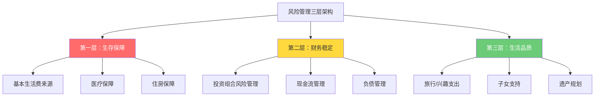
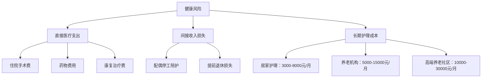

## 五、50+人群的风险管理理论

50岁是人生财务的分水岭。在此之前，你有时间、有体力、有机会从错误中恢复；在此之后，时间窗口收窄，试错成本指数级上升。一位55岁的人在2008年金融危机中损失40%的资产，和一位30岁的人遭受同样的损失，后果完全不同——前者可能永远无法恢复，后者还有35年的职业生涯可以弥补。

风险管理不是"买保险"那么简单。它是一套系统性的理论框架，帮助你在人生的收获期——这个最脆弱也最关键的阶段——守住财富、维持生活品质、从容应对不确定性。

### 5.1 风险管理的理论基础

#### 5.1.1 风险的本质定义

在金融学中，**风险（Risk）** 不等于"危险"。风险的本质是**实际结果偏离预期结果的可能性**，包括上行和下行两个方向。但对于退休人群，我们主要关注的是**下行风险（Downside Risk）**——因为退休后没有新的收入来源来弥补亏损。

50+人群的风险管理有一个根本性矛盾：

| 维度 | 年轻时期 | 50+收获期 |
|------|---------|----------|
| 收入来源 | 劳动收入为主，可再生 | 投资收入为主，不可再生 |
| 时间弹性 | 20-30年可以恢复亏损 | 5-15年恢复窗口，甚至没有 |
| 风险承受 | 高——可以从头再来 | 低——没有第二次机会 |
| 消费刚性 | 可以压缩开支 | 医疗、养老等刚性支出上升 |
| 认知能力 | 学习能力强，可适应变化 | 可能面临认知衰退 |

这个矛盾决定了50+人群的风险管理必须遵循一个核心原则：**优先保护下行空间，而非追求上行收益**。

#### 5.1.2 风险容忍度 vs 风险承受能力

很多人把这两个概念混为一谈，但它们是完全不同的：

**风险容忍度（Risk Tolerance）** 是心理层面的——你能承受多大的账面亏损而不恐慌？这与性格、经历、认知有关，是一个主观指标。

**风险承受能力（Risk Capacity）** 是财务层面的——你的财务状况客观上能承受多大的亏损？这与资产规模、收入来源、负债水平、家庭责任有关，是一个客观指标。

两者的关系：

```text
风险容忍度 > 风险承受能力 → 危险：你愿意承担的风险超过了你能承受的
风险容忍度 < 风险承受能力 → 保守：你可能过于谨慎，错失合理收益
两者匹配 → 理想状态
```

50+人群常见的错配是**风险容忍度高于风险承受能力**。原因包括：
- 过去几十年成功的投资经验带来的过度自信
- 不愿意承认自己"老了"，需要更保守的策略
- 对退休后支出的严重低估

**实操建议：** 每年做一次风险评估问卷（如FinaMetrica或Vanguard的风险评估工具），对比自己的财务状况，确保两者匹配。如果发现自己"胆子大于能力"，需要主动降低风险敞口。

#### 5.1.3 风险管理的三层架构

50+人群的风险管理不是一个动作，而是一个分层的体系：



**第一层是红色警戒线**——任何情况下都不能动用的底线保障。包括：基本生活费用的来源（社保+确定性收入）、基本医疗保障、住所。这一层的管理原则是"零风险"。

**第二层是黄色缓冲区**——维持财务稳定的安全垫。包括：投资组合的风险管理、日常现金流的规划、负债的控制。这一层的管理原则是"低风险、高流动性"。

**第三层是绿色改善区**——提升生活品质的可选支出。包括：旅行、兴趣爱好、帮助子女、遗产规划。这一层可以根据财务状况灵活调整。

**关键原则：只有在下一层稳固的情况下，才能考虑上一层。** 不要为了帮子女买房（第三层）而动用医疗储备金（第一层）。

### 5.2 五种核心风险的深度分析

50+人群面临五种核心财务风险，每一种都需要深入理解其机制、量化其影响、制定应对策略。

#### 5.2.1 长寿风险（Longevity Risk）

**定义与机制**

长寿风险是指活得比预期更久，导致储蓄提前耗尽的风险。这是50+人群面临的**首要风险**，因为所有其他风险都建立在"你还活着"这个前提之上。

根据中国国家统计局数据，2024年中国人均预期寿命为78.6岁，但这是出生时的预期寿命。一个已经活到50岁的人，预期寿命会更长——因为死亡率在年轻时已经筛选掉了一部分人。50岁中国男性的条件预期寿命约为80-82岁，女性约为83-85岁。

但预期寿命只是平均值。根据精算数据：

| 年龄 | 活到该年龄的概率（50岁男性） | 活到该年龄的概率（50岁女性） |
|------|--------------------------|--------------------------|
| 75岁 | 85% | 90% |
| 80岁 | 68% | 78% |
| 85岁 | 42% | 58% |
| 90岁 | 18% | 32% |
| 95岁 | 5% | 12% |

关键数据：一对50岁夫妻中，至少一人活到90岁的概率超过**50%**。这意味着你的退休规划必须覆盖至少35-40年。

**量化影响**

假设你55岁退休，月生活费1万元（含基本生活和医疗），年通胀率3%，投资收益率4%（扣除通胀后实际收益1%）：

- 如果活到80岁（25年），需要准备约270万元
- 如果活到85岁（30年），需要准备约340万元
- 如果活到90岁（35年），需要准备约420万元
- 如果活到95岁（40年），需要准备约510万元

每多活5年，需要多准备约70-90万元。长寿风险不是小概率事件，而是一个高概率、高影响的核心风险。

**应对策略**

1. **终身年金化（Life Annuity）**：将一部分资产购买终身年金保险，确保终身有收入。年金的本质是把长寿风险转移给保险公司——你活得越久，保险公司亏得越多，但你赚得越多。

2. **保守提取率**：传统的"4%法则"（每年提取总资产的4%）对于中国50+人群可能过于激进。考虑到中国较高的医疗通胀和较长的退休期，建议采用3-3.5%的初始提取率，后续根据投资表现动态调整。

3. **延迟退休/部分退休**：每延迟一年退休，效果相当于多储蓄5-8%。因为这一年你不仅没有支出退休金，还继续积累了社保缴费年限和投资收益。

4. **社保养老金最大化**：社保养老金是天然的终身年金——只要你活着，就一直发。尽量延长缴费年限、提高缴费基数，最大化社保养老金。

#### 5.2.2 通胀风险（Inflation Risk）

**定义与机制**

通胀风险是指物价上涨侵蚀购买力的风险。对于50+人群，通胀风险有两个特殊维度：

**维度一：医疗通胀远超CPI**

中国医疗费用的年均涨幅约6-8%，是CPI（2-3%）的2-3倍。这意味着：

| 当前年龄 | 当前年医疗支出 | 70岁时年医疗支出 | 80岁时年医疗支出 |
|---------|-------------|---------------|---------------|
| 50岁 | 2万元 | 5.4万元（20年后） | 9.7万元（30年后） |
| 50岁 | 5万元 | 13.5万元 | 24.3万元 |

计算依据：医疗通胀率6%，复利计算。

**维度二：退休期的通胀累积效应**

退休期长达30-40年，即使是温和的通胀也会产生巨大的累积效应：

| 年通胀率 | 10年后购买力 | 20年后购买力 | 30年后购买力 |
|---------|-----------|-----------|-----------|
| 2% | 0.82 | 0.67 | 0.55 |
| 3% | 0.74 | 0.55 | 0.41 |
| 4% | 0.68 | 0.46 | 0.31 |

3%通胀率下，30年后的100元只相当于今天的41元。如果你的退休收入不增长，生活品质将下降近60%。

**应对策略**

1. **资产配置中的通胀对冲**：保持一定比例的抗通胀资产：
   - 股票（长期来看是最佳的通胀对冲工具，但波动大）
   - REITs（不动产投资信托，租金收入随通胀增长）
   - 黄金（传统通胀对冲，但不产生收益）
   - 通胀挂钩债券（TIPS或类似产品，如果可获得）

2. **收入来源的通胀挂钩**：
   - 社保养老金（每年根据社平工资和物价调整）
   - 通胀挂钩年金（部分商业年金产品提供此选项）
   - 房租收入（租金通常随通胀上涨）

3. **支出端的通胀管理**：
   - 提前锁定长期成本（如一次性付清的医疗保险、固定利率贷款）
   - 调整消费结构（减少对通胀敏感的支出品类）
   - 考虑在低物价地区生活（二三线城市或乡村）

#### 5.2.3 市场风险（Market Risk）与序列风险（Sequence of Returns Risk）

**市场风险的基本机制**

市场风险是指投资组合价值因市场波动而下降的风险。对于50+人群，市场风险的特殊性在于：

- **恢复时间不足**：年轻人可以等市场恢复，但退休者可能在市场恢复前就需要用钱
- **提取加剧亏损**：在市场下跌时继续提取生活费，会加速资产缩水
- **心理压力巨大**：看着一辈子的积蓄缩水30-40%，对身心都是巨大打击

**序列风险——退休初期的隐形杀手**

序列风险是市场风险中**最危险、最容易被忽视**的一个维度。它的核心含义是：**投资收益的顺序对最终结果有决定性影响**。

即使两个人的长期平均收益完全相同，如果收益出现的顺序不同，最终财富可能天差地别。关键是，这种差异在退休初期最大——因为那时资产最多，每次提取的比例影响最大。

**详细数值示例**

假设两位投资者都在55岁退休，各有200万元，每年提取10万元作为生活费。

投资者A（先跌后涨）：前3年收益-20%、-15%、-10%，之后每年+8%
投资者B（先涨后跌）：前3年收益+8%、-10%、-15%，之后每年-20%
投资者C（平稳）：每年+3%

| 年份 | 投资者A | 投资者B | 投资者C |
|------|--------|--------|--------|
| 55岁（起始） | 200万 | 200万 | 200万 |
| 56岁 | 150万 | 206万 | 196万 |
| 57岁 | 118万 | 175万 | 192万 |
| 58岁 | 96万 | 143万 | 188万 |
| 59岁 | 93万 | 143万 | 183万 |
| 60岁 | 91万 | 145万 | 179万 |
| 65岁 | 108万 | 141万 | 158万 |
| 70岁 | 130万 | 137万 | 133万 |
| 75岁 | 156万 | 133万 | 100万 |
| 80岁 | 189万 | 128万 | 56万 |

注意：A和B的长期平均收益可能接近，但A在初期遭遇大跌，200万迅速缩水到96万——3年内蒸发了100多万。虽然之后恢复增长，但基数已经很小。而B初期保持稳定，虽然后期也遭遇大跌，但已经提取了多年的费用，且基数较大。

**序列风险的核心公式：**

```text
退休初期亏损 × 持续提取 = 资产加速耗竭
```

这就是为什么序列风险被称为"退休初期的隐形杀手"——它不是市场风险的简单叠加，而是市场风险与持续提取的**乘法效应**。

**应对策略**

1. **现金缓冲策略（Bucket Strategy）**：

   ```mermaid
   graph LR
       A[退休资产] --> B[短期桶：0-3年]
       A --> C[中期桶：3-10年]
       A --> D[长期桶：10年以上]
       
       B --> B1[现金/货币基金/短期国债]
       B --> B2[覆盖2-3年生活费]
       C --> C1[债券/稳健理财]
       C --> C2[中期收益和补充]
       D --> D1[股票/基金]
       D --> D2[长期增长抗通胀]
   ```

   短期桶确保2-3年内不需要卖出任何投资性资产，即使市场暴跌也不受影响。中期桶提供5-7年的缓冲。长期桶追求增长。短期桶用完后，从长期桶（在市场恢复后）补充。

2. **动态提取策略（Dynamic Withdrawal）**：在市场好的年份多提一点（比如4-5%），在市场差的年份少提一点（比如2-3%）。具体规则可以是：
   - 基准提取率：3.5%
   - 上一年投资收益>10%：提取率提高到4.5%
   - 上一年投资收益<0%：提取率降低到2.5%
   - 有地板（不低于2%）和天花板（不超过5%）

3. **退休前5年的"风险递降"**：从50岁开始，每年降低股票比例5-8%。到55岁退休时，股票占比从70%逐步降到40-50%。这不是一次性调整，而是渐进式过渡。

4. **部分年金化**：将30-40%的资产购买终身年金，确保基本生活费来源。剩余资产可以更积极地投资，因为即使亏损也不会影响基本生活。

#### 5.2.4 健康风险（Health Risk）

**定义与机制**

健康风险是指因重大疾病、意外伤害或慢性病导致巨额医疗支出的风险。这是50+人群面临的**最不可预测**的风险——你不知道什么时候会生病，也不知道会花多少钱。

**中国50+人群的健康风险数据**

根据《中国卫生健康统计年鉴》和商业保险理赔数据：

- 50岁以上人群重大疾病发病率为**25-30%**（即每4人中有1人在退休后罹患重疾）
- 重大疾病平均治疗费用为**30-50万元**，高端治疗可达100万以上
- 癌症5年生存率已提升至40%以上，但长期康复和护理费用可能超过治疗费用本身
- 慢性病管理（高血压、糖尿病等）年均费用约1-3万元，持续20-30年

**健康风险的三层影响**



很多人只关注直接医疗支出，忽视了间接损失和长期护理成本。实际上，对于慢性病或失能老人，长期护理成本可能是医疗费用的3-5倍。

**应对策略**

1. **医疗保障的"三层架构"**：
   - **第一层：社保医保**——覆盖基本医疗，报销比例50-85%，有起付线和封顶线
   - **第二层：商业医疗险**——百万医疗险（年费1000-3000元，保额200-600万），覆盖社保外费用
   - **第三层：重大疾病险**——确诊即赔，弥补收入损失和康复费用

2. **健康管理的"预防优先"**：每年全面体检（费用约2000-5000元），早期发现重大疾病可节省80%以上的治疗费用，并大幅提高生存率。

3. **长期护理险的配置**：社保长护险正在试点推广（已有49个城市试点），商业长护险也在逐步成熟。建议在50-55岁之间配置，此时保费相对可接受。

4. **健康生活方式的投资**：规律运动、合理饮食、戒烟限酒、心理健康维护——这些"免费"的措施，对降低健康风险的效果远超任何保险产品。

#### 5.2.5 政策风险（Policy Risk）

**定义与机制**

政策风险是指政府政策变化对退休收入和支出产生不利影响的风险。这是50+人群**最难预测、最难对冲**的风险之一。

**主要政策风险领域**

| 风险领域 | 可能的政策变化 | 影响 |
|---------|-------------|------|
| 社保养老金 | 延迟退休、降低替代率、调整计发办法 | 直接减少退休收入 |
| 医保政策 | 扩大自费项目、提高起付线、调整报销比例 | 增加医疗支出 |
| 税收政策 | 开征房产税、调整资本利得税、遗产税 | 减少净资产 |
| 房产政策 | 70年产权到期续费、房产税、限制出租 | 影响资产价值和收入 |
| 金融监管 | 理财产品打破刚兑、限制境外投资 | 影响投资收益 |

**中国当前面临的主要政策风险**

1. **延迟退休**：2025年起逐步实施延迟退休政策，男性从60岁延迟到63岁，女性从50/55岁延迟到55/58岁。对于接近退休的人影响直接。

2. **养老金替代率下降**：中国基本养老金替代率已从2000年的70%下降到目前的45%左右，预计将继续下降。这意味着仅靠社保养老金，退休后的生活品质将大幅下降。

3. **医保改革**：DRG/DIP付费改革、集采扩面等政策正在改变医疗费用结构，部分自费项目可能增加。

**应对策略**

1. **收入来源多元化**：不要把所有鸡蛋放在一个篮子里。社保+商业养老金+投资收益+房租+其他收入，任何单一来源的政策变化都不会造成致命打击。

2. **保持政策敏感度**：关注每年的政府工作报告、人社部和医保局的政策文件、以及税务政策的变化。不需要成为专家，但需要知道大方向。

3. **提前规划而非被动应对**：政策通常有过渡期。例如延迟退休政策从公布到完全实施有15年的过渡期。利用这个窗口期调整自己的退休规划。

4. **适度的国际分散**：如果有条件，可以考虑适度的海外资产配置，作为单一国家政策风险的对冲。但要注意外汇管制和税务合规。

### 5.3 两种常被忽视的风险

#### 5.3.1 行为风险（Behavioral Risk）

行为风险是指投资者自身的行为偏差导致的非理性决策风险。这是**造成投资损失的最大单一因素**——研究表明，行为偏差导致的年化损失约为1.5-2%，远超大多数管理费和交易成本。

50+人群常见的行为偏差：

| 偏差类型 | 表现 | 后果 | 纠正方法 |
|---------|------|------|---------|
| 损失厌恶 | 亏损时死扛不卖，盈利时过早卖出 | 赢小亏大 | 设定止损规则并严格执行 |
| 过度自信 | 凭"经验"做高风险投资 | 超出承受能力 | 每年做风险评估，对比实际配置 |
| 锚定效应 | 以买入价为参考，不愿接受亏损 | 错过调整时机 | 关注当前价值，不关注成本价 |
| 羊群效应 | 跟风投资热门产品 | 买在高点 | 坚持再平衡纪律，无视市场噪音 |
| 现状偏差 | 不愿改变现有配置 | 风险敞口过大 | 设定年度再平衡日，强制执行 |
| 近因偏差 | 过度关注最近的市场表现 | 追涨杀跌 | 回顾10年以上的历史数据 |

**行为风险管理的核心方法：建立"自动驾驶"系统**

不要依赖意志力来克服行为偏差——意志力是有限的资源。而是要建立一套自动运行的系统：

1. **投资政策声明（IPS）**：写一份书面的投资规则，包括资产配置目标、再平衡触发条件、提取规则等。在情绪稳定时制定，在市场波动时遵守。

2. **自动再平衡**：设定每季度或每半年自动再平衡一次，或者当某一资产类别偏离目标5%以上时触发再平衡。

3. **冷静期规则**：任何重大投资决策（超过总资产5%的调整），必须等待72小时再执行。72小时后再问自己：这个决定是基于逻辑还是情绪？

4. **信任但验证**：如果你有理财顾问，不要完全依赖他们。每年独立审查一次投资组合，对照IPS检查是否合规。

#### 5.3.2 认知衰退风险（Cognitive Decline Risk）

这是一个很少被讨论但**极其重要**的风险。研究表明：

- 金融决策能力在50岁左右达到顶峰，之后开始下降
- 60岁以后，金融诈骗受害者的比例急剧上升
- 认知衰退是渐进的，本人往往意识不到

**认知衰退对财务管理的影响**

- 更容易被高收益承诺所吸引（庞氏骗局、非法集资）
- 更难理解复杂的金融产品
- 更容易忘记账单支付、保险续费等日常事务
- 更容易做出冲动性的财务决策

**应对策略**

1. **简化财务结构**：在认知能力最强的时候（50-60岁），把财务结构简化到自己未来能管理的程度。减少账户数量、简化投资组合、使用自动化工具。

2. **建立信任网络**：指定1-2个信任的家人或朋友作为财务决策的"第二意见"。任何超过一定金额的决策，都需要他们的同意。

3. **法律保护**：提前办理意定监护公证和财务委托书。在意定清醒时，指定未来失能后的财务管理者。

4. **防诈骗机制**：与银行设定大额转账提醒、限制新开账户、设置亲友确认机制。

### 5.4 风险管理的定量框架

#### 5.4.1 蒙特卡洛模拟

蒙特卡洛模拟是评估退休计划成功率的标准工具。它通过随机模拟数千种可能的市场情景，计算你的退休资产在各种情况下的表现。

**核心概念：成功率（Success Rate）**

成功率是指在所有模拟情景中，退休资产足以覆盖整个退休期（比如到95岁）的比例。

| 成功率 | 含义 | 建议 |
|--------|------|------|
| >95% | 极其稳健 | 可以适当增加支出或减少储蓄 |
| 85-95% | 比较稳健 | 适合大多数人的目标区间 |
| 70-85% | 有一定风险 | 需要准备应对方案（如减少支出） |
| <70% | 风险较高 | 需要大幅调整计划 |

**简化版蒙特卡洛思维**

即使不使用专业软件，你也可以用蒙特卡洛的思维方式来思考：

1. **最佳情景**：市场年均收益8%，通胀2%，你活到85岁——钱够用吗？
2. **中性情景**：市场年均收益5%，通胀3%，你活到88岁——钱够用吗？
3. **最差情景**：前3年市场暴跌30%，通胀4%，你活到92岁——钱够用吗？

如果最差情景下钱也够用，你的计划就是稳健的。如果只有最佳情景才够用，你需要大幅调整。

#### 5.4.2 安全提取率（Safe Withdrawal Rate）

安全提取率是指在退休期间不会耗尽资产的最大年度提取比例。它受到以下因素影响：

| 因素 | 对安全提取率的影响 |
|------|------------------|
| 退休期长度 | 越长，提取率越低 |
| 股票配置比例 | 越高，波动越大，但长期收益越高 |
| 通胀率 | 越高，提取率越低 |
| 期望成功率 | 越高，提取率越低 |
| 有无终身年金 | 有年金兜底，提取率可以适当提高 |

**不同情景下的安全提取率参考**

| 退休期 | 股票占比40% | 股票占比60% | 股票占比80% |
|--------|-----------|-----------|-----------|
| 20年 | 4.5-5.0% | 4.8-5.5% | 5.0-5.8% |
| 30年 | 3.5-4.0% | 3.8-4.5% | 4.0-4.8% |
| 35年 | 3.0-3.5% | 3.3-3.8% | 3.5-4.2% |
| 40年 | 2.8-3.2% | 3.0-3.5% | 3.2-3.8% |

注：以上为基于历史数据的估算范围，实际结果取决于未来市场表现。

### 5.5 综合风险管理实操框架

#### 5.5.1 风险管理检查清单

50+人群应该每年做一次完整的风险管理检查：

**生存保障检查（第一层）**
- [ ] 社保养老金是否已办理？预计月领金额是多少？
- [ ] 基本医疗保险是否正常缴纳？报销范围和比例是否清楚？
- [ ] 是否有充足的商业医疗险（百万医疗+重疾险）？
- [ ] 住房是否自有且无贷款？是否有住所保障的备用方案？

**财务稳定检查（第二层）**
- [ ] 投资组合是否与风险承受能力匹配？
- [ ] 是否有2-3年的现金缓冲（不依赖投资变现）？
- [ ] 提取率是否在安全范围内？
- [ ] 是否已建立自动再平衡机制？
- [ ] 负债是否已清零或控制在极低水平？

**生活品质检查（第三层）**
- [ ] 是否有清晰的年度支出预算？
- [ ] 子女支持是否在可承受范围内？
- [ ] 遗嘱和遗产规划是否已制定？
- [ ] 意定监护和财务委托是否已办理？

#### 5.5.2 不同资产水平的风险管理策略

| 资产水平 | 核心策略 | 配置建议 |
|---------|---------|---------|
| <100万 | 最大化社保，控制支出，考虑延迟退休 | 70%保守+30%稳健 |
| 100-300万 | 社保+少量商业年金+稳健投资 | 50%稳健+30%保守+20%增长 |
| 300-500万 | 多元收入来源+适度投资增长 | 40%稳健+30%增长+20%保守+10%另类 |
| >500万 | 全面规划，考虑税务优化和遗产规划 | 35%增长+30%稳健+20%另类+15%保守 |

### 5.6 常见误区与纠正

**误区一："我有社保就够了"**
纠正：社保养老金替代率约45%，且可能继续下降。仅靠社保意味着退休后生活品质下降一半以上。社保是基础，但远远不够。

**误区二："退休后花得少，不需要太多钱"**
纠正：退休初期确实可能花得少（旅行、消费降低），但70岁以后医疗和护理支出会大幅上升。而且通胀会持续侵蚀购买力。实际数据表明，很多人的退休支出呈"微笑曲线"——初期低、中期高、末期最高。

**误区三："我房子值几百万，不怕没钱"**
纠正：房产是不动产，流动性差。你不能"吃"房子。卖房需要时间，而且可能在你最需要钱的时候（市场低迷）卖不上价。除非你计划卖房养老并有明确的执行方案，否则不要把自住房产计入可动用的养老资产。

**误区四："子女会照顾我"**
纠正：子女有自己的家庭和经济压力。"养儿防老"在现代社会越来越不可靠。把养老寄托在子女身上，既给子女增加负担，也让自己处于被动。应该做最坏的打算、最好的准备。

**误区五："投资收益能覆盖一切"**
纠正：投资收益是不确定的，而生活支出是确定的。不能用不确定的收入来覆盖确定的支出。至少基本生活费需要来自确定性来源（社保+年金+现金储备）。

**误区六："我还年轻，不用想这些"**
纠正：50岁不是"还年轻"——距离可能的30-40年退休期，每一年的准备都至关重要。风险管理越早开始，成本越低、效果越好。等到60岁才开始，很多工具（如保险）已经买不到了或非常昂贵。

### 5.7 本章小结

50+人群的风险管理不是"买几个保险产品"那么简单，而是一个系统工程。它涉及五个核心风险（长寿、通胀、市场、健康、政策）和两个常被忽视的风险（行为风险和认知衰退风险），需要在生存保障、财务稳定、生活品质三个层面建立完整的防御体系。

记住这个核心公式：

```text
稳健的退休 = 确定性收入（社保+年金）× 合理的提取率 × 抗通胀资产配置 × 充足的保险保障 × 理性的行为纪律
```

缺了任何一环，整个体系都可能出现漏洞。风险管理的终极目标不是消除风险——那是不可能的——而是在可承受的风险水平下，实现有品质的退休生活。
