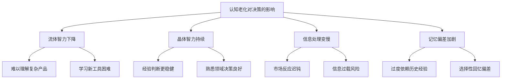
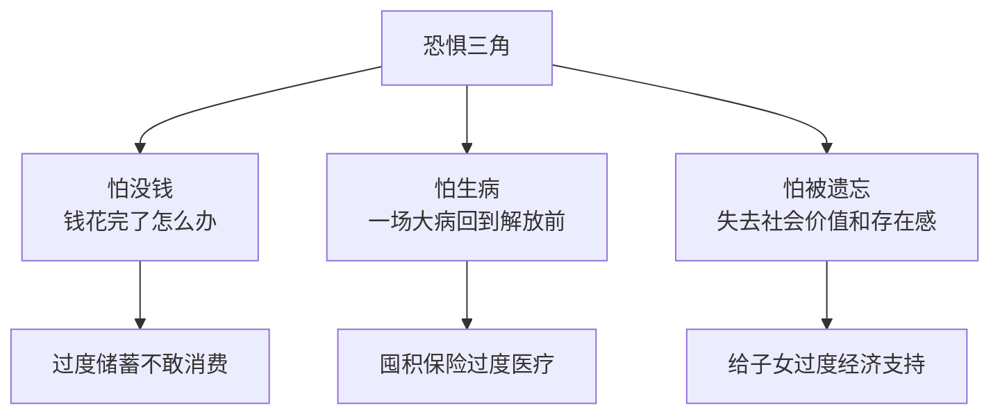

## 六、50+人群的行为金融学特征

传统金融学假设人是理性的——会冷静计算收益与风险，做出最优决策。但现实中，人的决策深受心理偏差影响。行为金融学（Behavioral Finance）正是研究这些"非理性"行为的学科，它揭示了为什么人们经常做出对自己不利的财务决策。

对于50岁以上的人群，行为金融学的洞察尤为关键。原因有三：第一，认知能力随年龄发生结构性变化，某些偏差会被放大；第二，退休前后的人生重大转变带来强烈情绪波动，干扰理性判断；第三，这个阶段的财务决策容错空间极小——50岁犯的投资错误，可能没有时间来弥补。

### 6.1 认知老化与决策能力的变化

#### 6.1.1 流体智力与晶体智力的分化

心理学家雷蒙德·卡特尔（Raymond Cattell）将智力分为两类：

| 维度 | 定义 | 50岁后趋势 | 对财务决策的影响 |
|------|------|------------|-----------------|
| 流体智力（Fluid Intelligence） | 处理新信息、解决新问题的能力 | 30岁后缓慢下降 | 难以理解复杂金融产品、新投资工具 |
| 晶体智力（Crystallized Intelligence） | 基于经验的知识和技能 | 持续增长到60-70岁 | 凭经验做出的判断往往更稳健 |

这一分化意味着：50+人群在熟悉的领域（如银行存款、股票买卖）依然决策良好，但在面对新型金融产品（如结构化理财、加密货币、期权策略）时容易犯错。

#### 6.1.2 信息处理速度下降

研究表明，50岁后信息处理速度每十年下降约15-20%。在投资决策中，这意味着：

- **反应变慢**：面对市场剧烈波动时，可能错过最佳操作窗口
- **信息过载**：同时处理多条财经新闻、研报时容易遗漏关键信息
- **简化倾向**：倾向于选择"看起来简单"的方案，即使不是最优的

#### 6.1.3 记忆偏差加剧

随着年龄增长，工作记忆（Working Memory）容量减少，但长期记忆依然稳固。这造成一个独特的决策陷阱：

- **过度依赖记忆而非数据**：凭"感觉"判断市场走势，而非分析当前数据
- **选择性回忆**：更容易记住成功案例，忘记失败经历，导致过度自信
- **锚定于记忆中的价格**：比如"这只股票我当年买过，10块钱"，而忽略当前基本面

### 6.2 50+人群的核心行为偏差

#### 6.2.1 损失厌恶（Loss Aversion）

丹尼尔·卡尼曼（Daniel Kahneman）和阿莫斯·特沃斯基（Amos Tversky）的前景理论指出：人对损失的痛苦感受约是对同等收益快乐感受的2-2.5倍。50+人群的损失厌恶更加强烈，原因在于：

- **时间窗口收窄**：年轻人亏了可以"等回来"，50+人群没有这个奢侈
- **本金即安全感**：退休金就是全部依靠，亏损意味着生活品质直接受损
- **社会比较压力**：同龄人已经退休享福，自己却在亏钱，心理落差巨大

**典型表现：**
- 市场下跌时恐慌性抛售，把浮亏变成实亏
- 过度配置低收益产品（银行存款、国债），实际购买力被通胀侵蚀
- 拒绝任何有波动性的投资，哪怕长期收益远超存款

**具体案例：** 张女士58岁，2020年初持有30万元股票基金。3月市场大跌20%，她的基金缩水到24万。出于恐惧，她全部赎回。到2020年底，市场反弹超过30%，她错失了约7.8万元的回升收益。如果她什么都不做，到年底基金价值将恢复到33万以上。

#### 6.2.2 现状偏差（Status Quo Bias）

现状偏差是指人们倾向于维持当前状态，即使改变可能带来更好的结果。在50+人群中，这种偏差表现为：

- **资产配置长期不变**：年轻时配置的激进组合，到50岁还没有调整
- **社保策略不做优化**：从不研究延迟退休、社保补缴等可能提高养老金的方案
- **保险不做更新**：10年前买的保险，保障范围和额度已不再适合当前需求

**为什么会这样？**
1. **决策疲劳**：一辈子做了无数决策，到这个年纪不想再折腾
2. **默认选项效应**：大多数人从不主动更改退休金账户的投资选项
3. **后悔规避**：改变后如果结果不好，会比不改变更后悔

**哈佛大学研究数据：** 在401(k)退休计划中，超过70%的参与者从未更改过投资选项。在50+年龄段，这一比例高达85%。

#### 6.2.3 锚定效应（Anchoring）

锚定效应是指人们在做决策时过度依赖第一个接触到的信息（"锚"）。50+人群的锚定效应尤为顽固：

**价格锚定：**
- "这只股票6000点的时候我都没卖，现在3000点怎么能卖？"
- "这套房子我买的时候200万，现在只值180万，我不能亏着卖"
- "黄金以前才200块一克，现在500块太贵了"

**历史经验锚定：**
- "我年轻的时候银行存款利率10%，现在才2%，钱还是存银行安全"
- "上次股灾之后就再也没碰过股票"（把一次极端经历泛化为永久策略）

**应对方法：** 每次做投资决策前问自己："如果我现在手里没有任何投资，我会选择当前这个配置吗？"如果答案是否定的，说明你在被锚定效应左右。

#### 6.2.4 心理账户（Mental Accounting）

理查德·塞勒（Richard Thaler）提出：人会在心里把钱分成不同的"账户"，并为每个账户设定不同的规则。这种思维方式在50+人群中表现得淋漓尽致：

| 心理账户 | 典型表现 | 实际问题 |
|---------|---------|---------|
| "养老钱" | 绝对不能动，只能存银行 | 过度保守，购买力被通胀吞噬 |
| "孩子的钱" | 给子女买房、带孙子花的钱 | 忽略自身养老需求 |
| "投资的钱" | 可以冒险，亏了不心疼 | 可能是养老本金的一部分 |
| "意外之财" | 中奖、退税、年终奖 | 花钱大手大脚，不做规划 |

**核心问题：** 钱是同质的。1万块钱无论来自工资、投资收益还是意外之财，其购买力完全相同。把它放在不同的"心理账户"会导致截然不同的消费和投资行为，这在经济学上是不合理的。

#### 6.2.5 从众行为（Herding Behavior）

50+人群的从众行为有其独特性：

- **跟同龄人比**：同事老王买了什么基金，我也要买
- **跟专家走**：电视上、微信公众号里"大师"推荐什么就买什么
- **跟热点跑**：哪个概念火就追哪个，比特币、新能源、AI概念股

**从众的心理根源：**
1. **信息不对称的补偿**：觉得自己不懂，不如跟着"懂的人"走
2. **归属感需求**：退休后社交圈缩小，通过共同投资话题维系社交
3. **责任分散**："大家都在买"给自己一个心理安慰，亏了也不是自己的错

**危险场景：** 2015年A股牛市期间，大量50+退休人士跟风入市，很多人在4000-5000点时加仓。股灾来临时，他们的损失远超年轻投资者，因为他们投入的往往是全部积蓄甚至借来的钱。

#### 6.2.6 近因偏差（Recency Bias）

近因偏差是指过度重视最近发生的事情，认为近期趋势会持续下去。50+人群的近因偏差与长期生活经验形成矛盾：

- **牛市中**："市场涨了两年了，肯定会继续涨"→ 过度乐观
- **熊市中**："市场跌了一年了，还会继续跌"→ 过度悲观
- **通胀期**："物价一直在涨，赶紧囤东西"→ 非理性消费

**与年轻人的差异：** 年轻人虽然也有近因偏差，但他们有更长的时间来"等回来"。50+人群如果在错误的时间做出错误决策（如在底部割肉），几乎没有挽回的余地。

#### 6.2.7 禀赋效应（Endowment Effect）

禀赋效应是指人们对自己已经拥有的东西赋予更高的价值。在50+人群中：

- **房产执念**："这房子住了30年了，不能卖"——即使卖房后租房+投资的收益远超持有
- **股票情感绑定**："这只股票我持有10年了，是老朋友了"——即使基本面已经恶化
- **保险退保犹豫**："交了8年保费了，退保太可惜"——即使保障已不匹配需求

#### 6.2.8 沉没成本谬误（Sunk Cost Fallacy）

沉没成本谬误是指因为已经投入了时间、金钱或精力，而继续一个不值得的项目。50+人群常见的沉没成本陷阱：

- **继续持有亏损股票**："已经亏了30%了，不能卖，等涨回来"——而不问"如果我手里有现金，会买入这只股票吗？"
- **维持亏损的生意**："投了50万开的店，不能关"——而不问"如果现在重新选，我还会开这个店吗？"
- **继续交不划算的保险**："已经交了10年了，再交5年就到期了"——而不问"这15年的总收益真的比其他投资方式好吗？"

### 6.3 人生阶段特有的心理因素

#### 6.3.1 身份认同转换

从"赚钱者"到"花钱者"的身份转换是50+人群面临的最大心理挑战之一。

**工作时：** 身份认同来自职业——"我是工程师""我是经理"。收入是主动的、可控的。

**退休后：** 身份认同需要重建。花积蓄而非赚工资，带来强烈的不安全感。许多人因此：
- 不敢花钱，即使财务状况允许
- 过度节省，影响生活品质
- 延迟退休，即使身体已经不允许

#### 6.3.2 恐惧三角

50+人群普遍存在"恐惧三角"心理：

这三种恐惧相互交织，共同扭曲财务决策。理解这些恐惧是改善决策的第一步。

#### 6.3.3 遗产动机与代际冲突

50+人群开始认真思考"留给后人什么"，这产生一系列行为偏差：

- **过度馈赠**：提前把资产给子女，导致自身养老资金不足
- **投资偏保守**：为了"保住本金给子女"而过度保守，实际购买力被通胀侵蚀
- **忽视税收规划**：不了解遗产税、赠与税相关规定，造成不必要的损失

### 6.4 投资决策中的典型行为模式

#### 6.4.1 过度交易与交易不足

50+人群在投资中同时存在两种看似矛盾的行为：

**过度交易：**
- 频繁买卖股票，试图"把握每一个波段"
- 换基金、换理财产品，总觉得"下一个更好"
- 研究显示：交易频率与投资收益呈负相关，年换手率超过300%的账户，平均收益低于市场8-10个百分点

**交易不足：**
- 该卖的不卖——持有的基金已经不符合风险偏好，但迟迟不调整
- 该买的不买——有一笔闲钱，放在活期账户半年没动
- 该换的不换——社保方案可以优化，但从不研究

#### 6.4.2 追涨杀跌的生命周期版本

年轻人追涨杀跌追的是热点板块和个股，50+人群追的是"理财产品"：

- **追涨**：某银行理财产品收益比别家高0.5%，立即把钱转过去
- **杀跌**：听到某个平台暴雷的消息，即使自己的产品完全无关，也要立刻赎回
- **信息来源单一**：主要靠微信群、朋友圈获取理财信息，缺乏独立判断

#### 6.4.3 分散化的误区

50+人群常常误解"分散投资"的含义：

| 误区 | 错误做法 | 正确理解 |
|------|---------|---------|
| 买了很多只股票就是分散 | 买了10只银行股 | 真正的分散是跨行业、跨资产类别 |
| 在不同银行买理财就是分散 | 3家银行各买了一些理财 | 底层资产可能完全一样（都是债券） |
| 买了很多保险就是分散 | 买了5份分红险 | 保障功能重叠，实际风险敞口集中 |
| 有了基金就是分散 | 全买了货币基金 | 收益一样低，没有真正分散风险 |

### 6.5 行为偏差的检测与纠正

#### 6.5.1 自我检测清单

用以下问题检测自己是否存在行为偏差（回答"是"越多，偏差越严重）：

**损失厌恶检测：**
1. 市场下跌5%时，你是否会感到明显的焦虑或失眠？
2. 你是否把超过50%的资产放在银行存款或货币基金中？
3. 你是否拒绝购买任何有波动性的投资产品？

**现状偏差检测：**
4. 你上一次调整投资组合是什么时候？（超过2年就有问题）
5. 你是否从未研究过社保优化方案？
6. 你购买保险后是否从未审视过保障是否足够？

**锚定效应检测：**
7. 你在做投资决策时，是否经常参考"当年的价格"？
8. 你是否因为"以前利率高"而对当前投资环境感到不满？
9. 你是否因为买入价而决定是否卖出？

**从众行为检测：**
10. 你的投资决策是否主要受朋友、同事或微信群的影响？
11. 你是否购买过自己完全不理解的金融产品？
12. 你是否因为"大家都在买"而投资了某个产品？

**沉没成本检测：**
13. 你是否因为"已经投了这么多"而继续持有亏损的投资？
14. 你是否因为"已经交了这么多年保费"而不愿意退保不划算的保险？

#### 6.5.2 纠正框架：STOP-THINK-ACT

当面临重大财务决策时，使用STOP-THINK-ACT框架：

**STOP（停下来）：**
- 不要在情绪激动时做决策
- 市场大跌时给自己24小时冷静期
- 听到"机会难得"时更要停下来

**THINK（想清楚）：**
- 这个决策是基于事实还是情绪？
- 如果我没有现在的持仓，会做同样的选择吗？
- 三年后的我会如何看待今天的决策？
- 我的信息来源是否可靠和多元？

**ACT（执行时设限）：**
- 设定止损线和止盈线，严格执行
- 大额决策（超过总资产10%）需要"睡眠测试"——睡一觉再决定
- 预设再平衡规则，不靠临场判断

#### 6.5.3 制度化防护措施

单靠意志力很难克服行为偏差，需要建立制度化的防护机制：

**1. 自动再平衡**
- 设定资产配置比例，每半年或每年自动调整一次
- 偏离目标超过5个百分点时触发再平衡
- 利用基金公司的自动再平衡功能

**2. 投资政策声明（IPS）**
- 写一份个人投资政策声明，明确：
  - 投资目标（收益率、时间期限）
  - 风险承受能力（最大可接受亏损）
  - 资产配置方案
  - 再平衡规则
- 市场波动时，重新阅读IPS，而不是凭感觉操作

**3. 决策顾问制度**
- 找一个信任的人（配偶、理财顾问、可信赖的朋友）
- 重大决策前必须征询对方意见
- 对方的角色是"挑战你的假设"，而不是"同意你的决定"

**4. 情绪日记**
- 记录每次重大投资决策时的情绪状态
- 定期回顾，识别自己的情绪模式
- 例如："每次大盘跌3%我就想卖""每次看到别人赚钱我就想追"

### 6.6 针对50+人群的行为金融学应用策略

#### 6.6.1 利用"默认选项"的力量

行为经济学发现，大多数人会接受默认选项。利用这一点：

- 设置工资的自动转账：发薪日自动转入投资账户，先储蓄后消费
- 设置基金定投：每月自动扣款买入，避免择时决策
- 设置自动再平衡：基金账户自动在年末恢复目标配置

#### 6.6.2 "预先承诺"策略

预先承诺（Pre-commitment）是指提前做出决定，并设置障碍阻止自己反悔：

- **定投承诺**：签订3年定投协议，中途赎回有惩罚
- **锁定期产品**：选择有锁定期的理财产品，强制自己长期持有
- **分批建仓**：有100万想投入股市，分成12份每月投10万，而非一次性投入

#### 6.6.3 框架效应的利用

同样一个事实，不同的表述方式会导致不同的决策：

| 负面框架（导致过度保守） | 正面框架（促进理性决策） |
|------------------------|------------------------|
| "这个基金可能亏20%" | "这个基金历史上80%的年份是正收益" |
| "退休后要花30年积蓄" | "合理规划可以让你30年不愁" |
| "股市风险很大" | "长期持有股票的收益远超存款" |

50+人群应该有意识地从正面框架看待投资，而不是被恐惧框架支配。

#### 6.6.4 社交环境的主动塑造

既然从众行为难以避免，不如主动选择"跟谁一起从众"：

- **加入理性的投资社群**：强调长期投资、资产配置，而非短线投机
- **远离制造焦虑的信息源**：取关那些动不动就"狼来了"的公众号
- **找到同频的伙伴**：与同样注重长期规划的同龄人交流，而非与投机者为伍

### 6.7 中国50+人群的行为金融学实证数据

#### 6.7.1 散户投资者的年龄特征

根据中国证券登记结算公司和上交所的研究数据：

- **50岁以上投资者**占A股散户的约25-30%，但贡献了约35-40%的交易量
- 50+投资者的**年均换手率**约为300-400%，高于市场平均水平
- 50+投资者的**平均收益**低于市场基准约5-8个百分点，主要原因是频繁交易和追涨杀跌
- 在市场下跌期间，50+投资者的**赎回比例**是30岁以下投资者的2倍以上

#### 6.7.2 理财产品选择偏差

50+人群在理财产品选择上表现出明显的行为特征：

- **过度偏好银行理财**：约65%的50+投资者将超过50%的金融资产配置在银行理财和存款中
- **对新型产品抗拒**：仅约8%的50+投资者持有指数基金，远低于30岁以下群体的25%
- **保险配置失衡**：约70%的50+人群购买了分红险或万能险，但纯保障型产品配置不足

#### 6.7.3 金融诈骗的脆弱性

行为金融学也解释了为什么50+人群更容易成为金融诈骗的受害者：

- **信任权威**：骗子常冒充"银行经理""证券分析师"，利用50+人群对权威的信任
- **损失厌恶被利用**："保本保息""稳赚不赔"正好击中50+人群的痛点
- **社交证明被伪造**：骗子安排"托"在群里晒收益，利用从众心理
- **紧迫感制造**："名额有限""今天不买就没了"，利用时间压力抑制理性思考

据公安部数据，50岁以上人群在金融诈骗受害者中占比约35%，但人均损失金额是年轻人的3-4倍。

### 6.8 行为金融学自检与行动计划

#### 6.8.1 个性化偏差评估

基于本节内容，完成以下自评（每项1-5分，5分表示偏差最严重）：

| 偏差类型 | 自评分数 | 你的具体表现 |
|---------|---------|------------|
| 损失厌恶 | _分 | |
| 现状偏差 | _分 | |
| 锚定效应 | _分 | |
| 心理账户 | _分 | |
| 从众行为 | _分 | |
| 近因偏差 | _分 | |
| 禀赋效应 | _分 | |
| 沉没成本 | _分 | |

总分超过24分的，需要立即采取纠正措施。

#### 6.8.2 30天行为改善计划

| 时间 | 行动 | 目的 |
|------|------|------|
| 第1周 | 完成自评表，识别最严重的3个偏差 | 建立自我认知 |
| 第2周 | 撰写个人投资政策声明（IPS） | 建立决策框架 |
| 第3周 | 设置自动定投和自动再平衡 | 用制度替代情绪 |
| 第4周 | 找到一位"决策顾问"，建立重大决策征询机制 | 建立外部约束 |

#### 6.8.3 长期行为修正工具箱

- **市场下跌时的检查清单**：提前准备好，下跌时按清单操作，而非凭感觉
- **年度投资回顾模板**：每年1月做一次全面回顾，对照IPS检查偏差
- **季度情绪审计**：每季度回顾自己的投资情绪日记，识别模式
- **金融知识更新计划**：每年至少读2本行为金融学或投资经典书籍

推荐书单：
- 《思考，快与慢》——丹尼尔·卡尼曼（行为金融学奠基之作）
- 《助推》——理查德·塞勒（如何利用行为经济学改善决策）
- 《非理性繁荣》——罗伯特·席勒（理解市场泡沫和投资者心理）
- 《投资中最简单的事》——邱国鹭（中国市场语境下的投资智慧）
