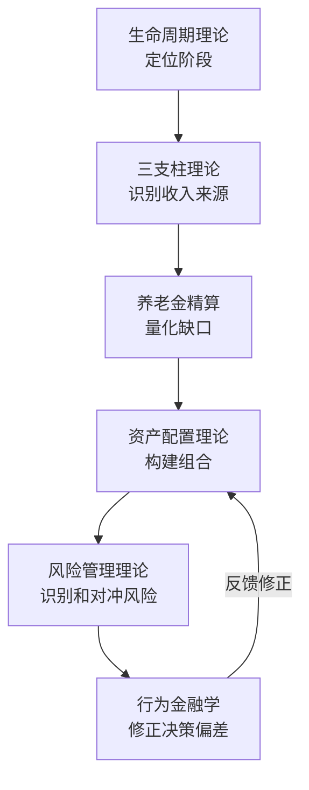

## 本节小结：理论基础的完整框架

本节围绕"50岁以上收获期"的财务理论，构建了六大理论支柱。这些理论不是孤立的学术概念，而是一套环环相扣的决策系统——从"你处于人生的哪个阶段"到"你的钱该怎么放"，再到"有哪些风险需要防"，最后到"你的心理会如何影响决策"。下面将这六个理论模块的精髓进行系统性提炼，并展示它们之间的逻辑关联。

---

## 一、六大理论模块的核心要义

### 1.1 生命周期财务理论——定位你所处的坐标

莫迪利安尼的生命周期假说为整个收获期的财务规划提供了底层逻辑。该理论的核心洞察是：**人一生的消费应该平滑分布，而不是跟随收入起伏**。50岁正处于"稳健期"向"消耗期"过渡的关键节点——收入可能仍在高位或已开始下降，但未来20-30年甚至更长时间的生活支出却不会停止。

**核心认知转变：人力资本与金融资本的终局转换。** 50岁时，你的"人力资本"（未来劳动收入的现值）已经大幅缩水，而"金融资本"（已积累的资产）应该成为生活的主要依靠。假设你年薪50万、还能工作10年，人力资本折现后约400万；但如果你的金融资本已经积累到500万以上，那么金融资本才是你真正的"家底"。到60岁退休时，人力资本归零，金融资本必须独立支撑全部退休生活。

**退休资金需求的精算基础：** 4%法则提供了一个简洁的计算框架——退休资金需求 = 年支出 x 25。如果年支出30万，你需要750万；年支出50万，你需要1250万。但在当前低利率和长寿风险并存的环境下，3.5%的提取率更为保守和安全（退休资金需求 = 年支出 x 28.6）。动态提取法则更进一步——不固定提取比例，市场好的年份多提（不超过5%），市场差的年份少提（不低于3%），可以更好地应对市场波动。

**一句话总结：** 生命周期理论告诉你"为什么需要规划"——因为你正在从"赚钱的人"变成"花积蓄的人"，这个转换需要精密的提前准备。

### 1.2 退休收入三支柱——三条腿的凳子

退休收入可以比喻为"三条腿凳子"——缺了任何一条腿，凳子都不稳：

| 支柱 | 内容 | 替代率 | 确定性 | 覆盖率 |
|------|------|--------|--------|--------|
| 第一支柱 | 社保养老金 | 35-45% | 高 | ~95% |
| 第二支柱 | 企业年金/职业年金 | 10-20% | 高 | ~10% |
| 第三支柱 | 个人储蓄与投资 | 自主控制 | 低 | 取决于个人 |

**社保养老金的精确计算：** 基础养老金 = (当地社平工资 + 本人指数化月平均缴费工资) / 2 x 缴费年限 x 1%；个人账户养老金 = 个人账户储存额 / 计发月数（50岁退休195个月，55岁170个月，60岁139个月，65岁101个月）。延迟退休不仅增加缴费年限，还减少计发月数，具有双重提升效应。

**覆盖率的残酷现实：** 截至2023年底，全国企业年金参加职工约3200万人，仅占城镇职工基本养老保险参保人数的约7%。这意味着绝大多数人没有第二支柱的保障，只有"两条腿"——社保和个人储蓄。两条腿的凳子天然不稳，因此个人储蓄的规划和管理变得更加关键。

**一句话总结：** 三支柱理论告诉你"钱从哪里来"——先算清楚社保能给你多少，再看企业年金有没有，最后确定个人储蓄需要补多大的缺口。

### 1.3 养老金精算与长寿风险管理——活得久也是风险

长寿风险是50+人群最反直觉的财务风险之一。很多人担忧"钱不够花"，却很少有人意识到"活得比预期更久"本身就是一种风险。

**长寿风险的量化：** 假设你60岁退休、月需1万元、年通胀3%：70岁时每月实际需要13,439元（累计约144万），80岁时需要18,061元（累计约340万），90岁时需要24,273元（累计约610万）。活得越久，需要的钱越多——而且医疗费用的通胀率（年均6-8%）远高于普通CPI（2-3%），70-80岁的医疗支出可能是50岁时的2-3倍。

**应对长寿风险的核心工具：**

- **终身年金化：** 把一部分资产转化为终身收入流（如终身年金保险），无论活多久都有收入
- **保守提取率：** 使用3.5%-4%的提取率而非更高比例，为长寿留出余量
- **延迟退休：** 增加积累期、减少消耗期，双重改善资金状况
- **支出弹性：** 在健康年份保持适度消费弹性，为高龄医疗支出预留空间

**一句话总结：** 养老金精算告诉你"够不够用"——精确计算社保养老金数额，量化长寿风险敞口，才能知道缺口有多大。

### 1.4 资产配置理论——从增长到保全的滑翔路径

50岁以后的资产配置逻辑与年轻时完全不同。年轻时追求"低买高卖"的资本利得，50岁以后应该转向"稳定的现金流收入"。

**滑翔路径理论的实际应用：**

| 年龄段 | 股票 | 债券 | 现金 | 另类资产 |
|--------|------|------|------|----------|
| 50-55岁 | 35-40% | 40-45% | 15-20% | 5% |
| 55-60岁 | 25-30% | 45-50% | 20-25% | 5% |
| 60岁以后 | 15-25% | 45-50% | 25-30% | 5% |

**桶型资产配置法的精髓：** 将资产按时间维度分为三桶——第一桶（1-3年生活费，货币基金或短期国债，保流动性）、第二桶（3-10年生活费，中长期国债或高等级债券基金，保稳定收益）、第三桶（10年以上，高股息股票或REITs或指数基金，保抗通胀增长）。每年从第三桶的收益中向第二桶补充，从第二桶的收益中向第一桶补充。这样即使股市暴跌，你的短期生活费不受影响，你有10年的时间等市场恢复。

**收入导向型投资的核心理念：** 不再追求"低买高卖"，转而追求"稳定的现金流收入"——通过股息、利息、租金等收入来支撑退休生活，减少对卖出资产的依赖。适合的收入型资产包括高股息股票（银行、公用事业、能源）、REITs、债券和债券基金、分红型保险产品、出租房产。

**一句话总结：** 资产配置理论告诉你"钱该怎么放"——从激进增长转向保守保全，用桶型配置和收入导向策略构建可持续的退休现金流。

### 1.5 风险管理理论——五种核心风险与序列风险

50岁以上人群面临五种核心财务风险，每一种都需要有针对性的应对策略：

| 风险类型 | 含义 | 应对策略 |
|---------|------|---------|
| 长寿风险 | 活得比预期更久，资金不够用 | 终身年金化、保守提取率 |
| 通胀风险 | 物价上涨侵蚀购买力 | 抗通胀资产（股票或REITs或黄金） |
| 市场风险 | 投资组合大幅缩水 | 分散投资、动态再平衡 |
| 健康风险 | 重大疾病导致巨额支出 | 充足保险、健康生活方式 |
| 政策风险 | 社保或税收或医疗政策变化 | 多元收入来源、关注政策变化 |

**序列风险——退休初期的隐形杀手：** 即使两位投资者的长期平均收益相同，如果退休初期遭遇市场下跌，会导致退休资金更快耗尽。因为退休初期资金量最大，此时的亏损绝对值也最大，且你需要同时承受"卖出亏损资产"和"不再有工资收入"的双重打击。应对策略包括：保持2-3年现金储备、退休前5年就开始降低投资组合波动性、使用动态提取策略。

**通胀风险的特殊性：** 对于50+人群，通胀有两个特殊威胁——一是医疗通胀（年均6-8%，远高于CPI的2-3%），二是时间跨度长（30年3%通胀意味着物价翻2.4倍）。社保养老金与通胀挂钩，是天然的抗通胀工具；投资组合中保持一定比例的抗通胀资产是必要的对冲手段。

**一句话总结：** 风险管理理论告诉你"可能出什么问题"——识别五种核心风险，特别警惕序列风险和医疗通胀，用保险和资产配置构建多层防线。

### 1.6 行为金融学——你比你以为的更不理性

50岁以上人群在投资中有几个典型的行为偏差，这些偏差不是"性格缺陷"，而是人类认知的系统性弱点：

**损失厌恶加剧：** 年龄越大，对亏损的敏感度越高。亏损100元的痛苦远大于赚100元的快乐，这种不对称的心理反应会导致在市场下跌时恐慌卖出，恰恰卖在最低点。

**过度自信陷阱：** 多年的投资经验可能带来"我什么都懂"的错觉。过去20年"买房肯定赚"的经验，在人口结构变化和城镇化放缓的新环境下可能不再适用。经验是资产，但固守经验就是负债。

**锚定效应：** 固守某个价格或标准作为参照点。比如"这只股票曾经涨到50块，现在才30块，肯定要涨回去"——但公司的基本面可能已经发生了根本变化。

**从众心理与确认偏差：** 在社区和微信群中容易被"大家都在买"所影响；同时只关注支持自己判断的信息，忽视反面证据。这两个偏差叠加，是老年人被金融骗局收割的主要心理原因。

**一句话总结：** 行为金融学告诉你"决策中会犯什么错"——认识这些偏差的存在，是避免犯错的第一步。

---

## 二、六大理论的逻辑关联——它们如何协同工作

这六个理论模块并非并列关系，而是形成了一条清晰的决策链路：

**第一环：定位（生命周期理论）。** 首先明确你处于"稳健期向消耗期过渡"的阶段，人力资本正在缩水，金融资本必须接棒。这一步决定了后续所有规划的基调——从"增长"转向"保全"。

**第二环：算账（三支柱 + 养老金精算）。** 明确阶段后，需要精确计算退休收入来源：社保能给多少？企业年金有没有？缺口有多大？这一步把抽象的"需要规划"转化为具体的"缺200万还是500万"。

**第三环：配置（资产配置理论）。** 知道缺口后，用滑翔路径和桶型配置理论决定资产如何分配。这一步把"需要500万"转化为"每年存多少、买什么、放在哪个桶里"。

**第四环：防护（风险管理理论）。** 配置完成后，识别可能破坏计划的风险因素——长寿、通胀、市场暴跌、大病、政策变化——并用保险和资产分散来构建防线。

**第五环：校准（行为金融学）。** 最后审视自己的决策过程，识别损失厌恶、过度自信、锚定效应等认知偏差，用制度化的"检查清单"和"家人商量机制"来修正。

**关键洞察：** 这条链路是循环的，不是一次性的。每年至少做一次完整的"理论体检"——重新定位、重新算账、重新配置、重新防护、重新校准。市场在变、政策在变、你的身体和家庭也在变，静态的方案注定会过时。

---

## 三、理论到实践的桥梁——每个理论对应的核心行动

理论的价值在于指导行动。以下是每个理论模块对应的最核心实操动作：

| 理论模块 | 核心问题 | 对应行动 | 优先级 |
|---------|---------|---------|--------|
| 生命周期理论 | 我处于什么阶段？ | 盘点人力资本和金融资本，计算转换进度 | 最高 |
| 三支柱理论 | 钱从哪里来？ | 查询社保预估、确认企业年金、计算个人储蓄缺口 | 最高 |
| 养老金精算 | 够不够用？ | 用4%法则或3.5%法则计算退休资金需求 | 高 |
| 资产配置理论 | 钱该怎么放？ | 建立桶型配置，按滑翔路径调整股债比例 | 高 |
| 风险管理理论 | 可能出什么问题？ | 检查保险覆盖、建立2-3年现金储备 | 高 |
| 行为金融学 | 决策中会犯什么错？ | 建立投资决策检查清单，重大决策必须和家人商量 | 中 |

**行动的优先级逻辑：** 先算账（知道缺口），再配置（填缺口），再防护（守住缺口），最后校准（确保自己不犯蠢）。如果跳过算账直接配置，你可能配了一个"看起来不错但根本不够"的组合。

---

## 四、理论的局限性——不能教条化

任何理论都有其适用边界，50+人群的财务规划尤其需要注意以下几点：

### 4.1 4%法则的中国适用性问题

4%法则基于美国市场的历史数据（1926-2020年），假设投资组合为60%股票+40%债券。但中国市场的波动性更大、债券收益率更低、通胀结构不同，直接套用4%法则可能过于乐观。建议：

- 在中国市场环境下，3%-3.5%的提取率更为保守
- 结合社保养老金的实际金额来调整个人提取率
- 使用动态提取法而非固定比例

### 4.2 三支柱理论的覆盖率陷阱

三支柱理论假设每个人都有三条腿，但现实中绝大多数中国人只有两条腿（社保+个人储蓄），企业年金覆盖率仅7%。这意味着你不能简单地按"三支柱"来规划，而是要根据自己的实际情况来判断有几条腿、每条腿有多粗。

### 4.3 滑翔路径的个体差异

滑翔路径给出的是"平均建议"，但每个人的风险承受能力、收入来源、家庭结构都不同。有稳定退休金的人可以承受更高的股票比例；没有退休金的人需要更保守的配置。关键是理解"随着年龄增长降低风险"的原则，而不是机械地照搬某个具体比例。

### 4.4 行为金融学的"知道不等于做到"

认识偏差不等于能克服偏差。研究表明，即使知道损失厌恶的存在，人们在实际决策中仍然会受到它的影响。因此，最有效的方法不是"告诉自己要理性"，而是建立制度化的决策流程——比如设定"亏损超过15%必须暂停操作24小时"的规则，或者"任何超过10万元的投资决策必须和配偶商量"的家庭协议。

---

## 五、核心公式速查表

以下汇总本节涉及的所有核心公式和关键数据，方便随时查阅：

| 公式/数据 | 内容 | 用途 |
|----------|------|------|
| 4%法则 | 退休资金 = 年支出 x 25 | 快速估算退休资金需求 |
| 3.5%法则 | 退休资金 = 年支出 x 28.6 | 保守估算退休资金需求 |
| 基础养老金 | (社平工资 + 指数化缴费工资) / 2 x 缴费年限 x 1% | 计算社保基础养老金 |
| 个人账户养老金 | 个人账户储存额 / 计发月数 | 计算社保个人账户养老金 |
| 计发月数 | 50岁=195, 55岁=170, 60岁=139, 65岁=101 | 根据退休年龄查表 |
| 通胀复利 | 终值 = 现值 x (1 + 通胀率)^年数 | 计算未来购买力 |
| 桶型配置 | 第一桶=年支出x3, 第二桶=年支出x7, 第三桶=剩余 | 按时间维度分配资产 |

---

## 六、从理论到下一节的过渡

本节的六大理论为"50岁以上收获期"的财务规划奠定了认知基础。但理论终究是地图，不是实际疆域。下一节"核心技巧"将把这六大理论转化为可操作的具体方法——如何最大化社保养老金？如何建立桶型配置？如何选择保险产品？如何进行财富传承？

**理论与技巧的对应关系：**

| 理论模块 | 对应核心技巧 |
|---------|------------|
| 生命周期理论 | 退休生活模式选择与支出规划 |
| 三支柱理论 | 社保养老金优化、企业年金领取策略 |
| 养老金精算 | 退休资金缺口测算与补充方案 |
| 资产配置理论 | 保守型投资组合构建、高股息策略 |
| 风险管理理论 | 保险配置方案、长期护理险规划 |
| 行为金融学 | 投资决策检查清单、防诈骗指南 |

带着本节的理论框架去阅读核心技巧，你会发现每一个技巧都不是"凭空出现的建议"，而是有明确理论支撑的系统性方法。理解了"为什么这样做"，执行时才会更有信心和定力。

---

> **本节核心记忆点：** 50岁以后的财务规划不是"凭感觉"的事，而是一套有理论支撑的精密系统。生命周期理论帮你定位，三支柱理论帮你算账，养老金精算帮你量化，资产配置理论帮你落地，风险管理理论帮你防守，行为金融学帮你校准。这六大理论贯穿整个收获期的规划体系，形成了从认知到行动的完整闭环。掌握这套理论体系，你就能在核心技巧部分理解每一个方法背后的深层逻辑，在实战案例中看到理论如何落地，在常见误区中识别哪些做法违反了理论原则。
>
> 理论是地图，行动是旅程。现在，是时候带着这张地图出发了。
