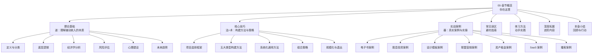

# 第21章 被动收入构建

## 为什么这一章值得你花时间

你每天工作 8 小时，一周 5 天，一年 50 周——总共 2000 小时。假设时薪 100 元，年收入 20 万。这个数字有一个硬上限：你不可能一天工作 25 小时。**用时间换钱的模式，天花板就是你自己的时间总量。**

被动收入打破了这个限制。它的核心逻辑是：**你投入一次时间和精力构建一个系统，这个系统在你停止投入之后仍然持续产生收入。** 不是因为你"不劳而获"，而是因为你的劳动被固化成了资产——一本书、一个软件、一套投资组合、一个自动化流程——资产在替你工作。

这不是鸡汤。全球高净值人群中，被动收入占总收入的比例平均超过 40%（来源：瑞银《2024 全球财富报告》）。美国国税局（IRS）的数据显示，收入前 1% 的纳税人，被动收入占比高达 63%。被动收入不是"锦上添花"，它是财富增长的核心引擎。

但这里有一个残酷的事实：**被动收入的"被动"是结果，不是起点。** 任何被动收入项目都需要前期大量的主动投入。一本电子书需要 3-6 个月的写作，一个 SaaS 产品需要 6-12 个月的开发，一个投资组合需要持续数年的资金积累和策略调整。那些告诉你"零成本零时间就能躺赚"的人，要么在卖课，要么在骗你。

本章的目标是：**帮你建立对被动收入的完整认知体系，掌握从零开始构建被动收入的系统方法，并通过真实案例理解每种被动收入类型的运作机制、收益预期和潜在风险。**

---

## 本章知识地图

本章按照"道-法-术-器"的逻辑分为四大板块，从理论到实操层层递进：



---

## 全章内容导读

### 第一部分：理论基础（道）

理论基础部分回答一个根本问题：**被动收入到底是什么，它为什么能成立？**

这一部分从被动收入的精确定义出发，破除"躺赚"的幻觉，建立正确的认知框架。你会学到：

**被动收入的五大类型及其运作原理：**

| 类型 | 核心资产 | 典型前期投入 | 收入持续性 | 典型收益率 |
|------|----------|-------------|-----------|-----------|
| 版税收入 | 知识产权（书、音乐、软件） | 3-12 个月创作 | 3-10 年（取决于内容生命周期） | 变动极大 |
| 股息收入 | 股票/基金/REITs | 持续资金积累 | 取决于公司经营 | 年化 2-8% |
| 租金收入 | 不动产 | 大额首付+装修 | 长期（20-40 年） | 年化 3-6% |
| 数字产品 | 电子书、模板、课程 | 1-6 个月制作 | 1-5 年 | 变动极大 |
| 自动化业务 | SaaS、电商、联盟营销 | 6-18 个月开发 | 取决于市场和维护 | 变动极大 |

理论部分还包括三个关键概念的深度解析：

1. **资产思维 vs 劳动思维**：劳动思维问"我这小时能赚多少钱"，资产思维问"我投入的这小时能变成一个持续产出多少的资产"。两者的决策逻辑完全不同，导致的财富结果也截然不同。

2. **复利效应**：被动收入最强大的地方不在于单笔收入的大小，而在于收益可以再投入。假设你每月被动收入 1000 元，全部再投入年化 6% 的资产，10 年后这笔再投资本身每月就能产生约 1400 元——这就是复利的力量。

3. **时间价值分析**：被动收入项目的真正回报率不能只看最终收入，必须除以前期总投入时间。一个花了 500 小时制作、每月收入 500 元的电子书，其"时间回报率"远低于一个花了 200 小时搭建、每月收入 2000 元的自动化网站。

此外，理论部分还涵盖风险评估框架和心理建设——因为被动收入项目最大的失败原因不是技术不行，而是心态崩了：前期看不到回报时过早放弃。

> 理论部分共 11 篇文章，建议按顺序阅读，预计阅读时间 2-3 小时。

### 第二部分：核心技巧（法+术）

核心技巧部分回答：**具体怎么做？**

这部分从项目选择开始，覆盖被动收入构建的完整生命周期：

**1. 项目选择框架（最关键的一步）**

选错项目，后面所有努力都是浪费。一个好的被动收入项目需要同时满足四个条件：

- **市场需求存在**：有人愿意为这个东西付钱
- **你有相关技能或资源**：不需要从零学习一个全新领域
- **前期投入可控**：不需要你辞职或投入全部积蓄
- **可规模化**：边际成本趋近于零（做一份卖一万份）

本章会提供一个完整的项目评估矩阵，包含 12 个评分维度，帮你在 30 分钟内完成项目可行性评估。

**2. 五大类型的详细构建方法**

每种被动收入类型都有其独特的构建路径。这部分不是泛泛而谈，而是给出可执行的步骤清单：

- **版税收入**：从选题→写作→出版→推广的完整流程，包括自出版平台选择（Amazon KDP vs 国内平台）、定价策略、长期推广方法
- **股息投资**：股息贵族筛选标准、组合构建方法（核心-卫星策略）、再投资计划（DRIP）、税务优化
- **数字产品**：从需求调研→产品设计→制作→上架→自动交付的全流程，覆盖电子书、设计模板、在线课程、工具类产品的各自要点
- **自动化业务**：SaaS 产品的 MVP 开发流程、电商自动化（代发货/POD）、联盟营销网站的内容策略和 SEO 方法
- **房产租金**：REITs 投资 vs 直接持有房产的对比分析、物业管理外包方法、租金收益最大化策略

**3. 系统化与规模化**

被动收入的"被动"不是天然的，是设计出来的。这部分教你：

- 如何用自动化工具减少人工干预（邮件营销自动化、客服 chatbot、自动发货系统）
- 如何通过 SOP（标准操作流程）把业务交给他人执行
- 如何用数据分析优化收入（转化率、客户获取成本、生命周期价值）
- 规模化的三条路径：横向扩展（更多产品）、纵向扩展（更高价格）、平台化（让别人在你的平台上卖）

**4. 组合策略与退出策略**

- 不要把所有鸡蛋放在一个篮子里——但也不要同时做 10 个项目。本章会给出一个经过验证的组合策略：**核心收入（1-2 个成熟项目）+ 增长收入（1-2 个发展中的项目）+ 探索收入（1 个试验性项目）**
- 退出策略同样重要：当一个项目不再值得维护时，如何最大化其剩余价值（出售、转让、转型）

> 核心技巧部分共 11 篇文章，建议结合实战案例一起阅读，预计阅读时间 3-4 小时。

### 第三部分：实战案例（器）

理论和方法最终要落地到案例上。本章精选了 7 个真实案例，覆盖从零资金到大资金、从纯线上到线下的多种被动收入类型：

| 案例 | 类型 | 前期投入 | 月均收入 | 达到稳定收入耗时 | 核心教训 |
|------|------|---------|---------|----------------|---------|
| 案例一 | 电子书被动收入 | 6 个月全职写作 | ¥3,000-8,000 | 8 个月 | 内容质量决定长尾收入 |
| 案例二 | 股息投资组合 | ¥50 万本金 | ¥2,000-3,500 | 3 年 | 纪律性比选股能力更重要 |
| 案例三 | 设计模板数字产品 | 3 个月兼职制作 | ¥5,000-15,000 | 5 个月 | 模板化思维是规模化的关键 |
| 案例四 | 自动化联盟营销 | 4 个月全职搭建 | ¥8,000-25,000 | 10 个月 | SEO 是最持久的流量来源 |
| 案例五 | 房产租金被动化 | ¥80 万首付 | ¥6,000-9,000 | 即时（但前期积累耗时 5 年） | 物业管理外包是"被动化"的关键 |
| 案例六 | SaaS 产品 | 8 个月全职开发 | ¥15,000-50,000 | 14 个月 | 解决真实痛点比炫技更重要 |
| 案例七 | 播客被动收入 | 2 个月筹备 | ¥2,000-12,000 | 12 个月 | 一致性比爆款更重要 |

每个案例都包含完整的背景介绍、构建过程、收入数据、踩过的坑和关键启示。不是那种"某人做了某事然后成功了"的鸡汤故事，而是有具体数字、具体工具、具体策略的可复制路径。

案例部分还包含三个综合分析文章：

- **项目对比总结**：横向对比所有案例的投入产出比、风险等级、技能门槛，帮你快速找到最适合自己的方向
- **实操清单**：从案例中提炼出的通用操作清单，可以直接套用到你自己的项目
- **常见失败原因**：总结了被动收入项目最常见的 12 种失败模式，以及对应的预防措施
- **成功者共同特质**：从案例中提炼出成功者的思维模式和行为习惯

> 实战案例部分共 11 篇文章，建议先通读全部案例建立全局视角，再深入研究与自己最相关的 2-3 个案例。

### 辅助章节

除了三大核心板块，本章还包括四个辅助章节：

- **常见误区**：列出被动收入构建中最常见的 15 个认知误区，逐一拆解。比如"被动收入就是不用工作""有了被动收入就可以辞职""被动收入项目越多越好"等。
- **练习方法**：针对本章核心知识点设计的实操练习，从项目评估到 MVP 搭建，每个练习都有明确的交付物和验收标准。
- **深度拓展**：为已完成基础学习的读者准备的进阶内容，包括被动收入的税务优化、跨境被动收入的法律合规、被动收入与 FIRE（财务独立提前退休）运动的关系等。
- **本章小结**：全章核心要点回顾、行动清单和下一步建议。

---

## 学习路径建议

不同背景的读者可以采用不同的学习路径：

### 路径一：零基础入门（推荐完整学习）

```text
章节概览（本文） → 理论基础（全部） → 核心技巧（全部）
→ 实战案例（全部） → 常见误区 → 练习方法 → 本章小结
```

预计总时间：10-15 小时。适合没有任何被动收入经验的读者。理论部分帮你建立正确的认知框架，避免走弯路。

### 路径二：有投资经验（跳过基础，聚焦应用）

```text
章节概览 → 理论基础（03 底层逻辑 + 04 经济学分析 + 07 风险评估）
→ 核心技巧（01 项目选择 + 02 构建方法 + 04 组合策略）
→ 实战案例（与自己方向相关的 2-3 个） → 常见误区 → 本章小结
```

预计总时间：5-7 小时。适合已有股票/基金/房产投资经验，想拓展到其他被动收入类型的读者。

### 路径三：已有项目在手（解决问题导向）

```text
章节概览 → 核心技巧（03 系统化方法 + 06 规模化 + 07 退出策略）
→ 实战案例（与自己项目类型匹配的案例） → 常见误区
→ 深度拓展 → 本章小结
```

预计总时间：3-5 小时。适合已经在做某个被动收入项目但遇到瓶颈的读者。

### 路径四：快速决策（30 分钟版）

```text
章节概览（本文） → 理论基础（02 五大类型）
→ 核心技巧（01 项目选择框架） → 实战案例（08 项目对比总结）
→ 实战案例（09 实操清单）
```

预计总时间：30-45 分钟。适合时间有限、想快速了解被动收入全貌并做出方向决策的读者。

---

## 关键概念速览

在正式学习之前，先熟悉以下核心概念。这些概念会在后续章节中反复出现：

| 概念 | 定义 | 为什么重要 |
|------|------|-----------|
| **被动收入** | 前期投入后能持续产生收益的收入形式，"被动"是结果而非起点 | 理解这一点才能避免"躺赚"幻觉 |
| **资产思维** | 把时间和精力投入到能持续产出的资产上，而非直接出卖时间 | 这是被动收入与主动收入的根本思维差异 |
| **前置投入** | 构建被动收入系统所需的前期时间和资金投入 | 帮你正确评估项目的启动成本 |
| **边际成本趋零** | 多生产一个单位产品的成本接近于零（数字产品的核心优势） | 这是被动收入能规模化的经济学基础 |
| **收入多元化** | 通过多个被动收入源分散风险 | 避免单一收入来源的脆弱性 |
| **MVP 验证** | 用最小可行产品验证被动收入项目的市场可行性 | 在投入大量时间前先确认方向正确 |
| **自动化系统** | 减少人工干预的收入生成流程 | "被动化"的核心手段 |
| **复利效应** | 收益再投入带来的指数级增长 | 被动收入长期威力的数学基础 |
| **长尾效应** | 数字产品发布后持续被搜索和购买的现象 | 解释为什么一个 3 年前的电子书仍在产生收入 |
| **时间回报率** | 项目总收益 ÷ 前期总投入时间 | 评估被动收入项目真实效率的核心指标 |

---

## 本章心法

> **被动收入不是"不劳而获"，而是"劳作一次，收获多次"。**
>
> 关键在于转变思维——从"出卖时间"转向"构建资产"。
>
> 但请注意：转变思维只是第一步。真正的挑战在于——在看不到回报的前期阶段，仍然坚持投入。这不是意志力的问题，而是方法论的问题：用 MVP 快速验证、用数据指导决策、用系统替代人力。这些方法，正是本章要教给你的。

---

**准备好了吗？让我们从理论基础开始，深入理解被动收入的本质。**
