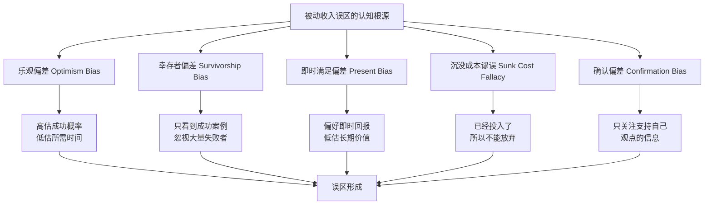
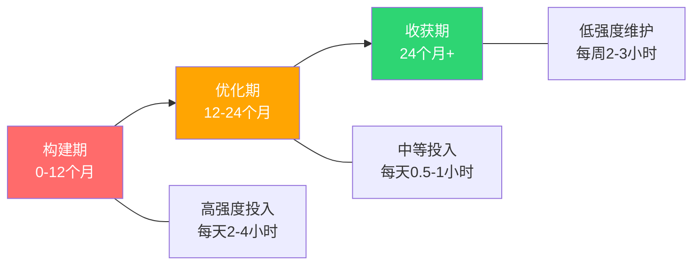
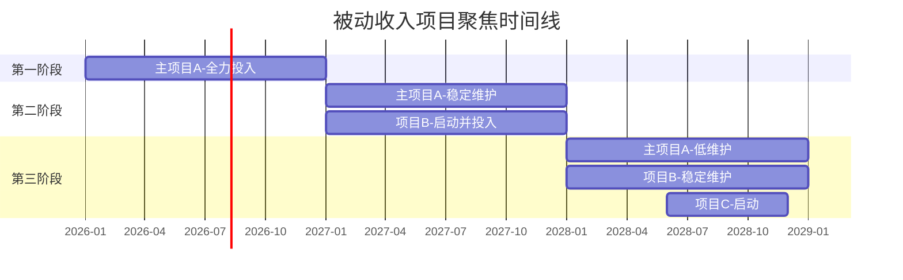
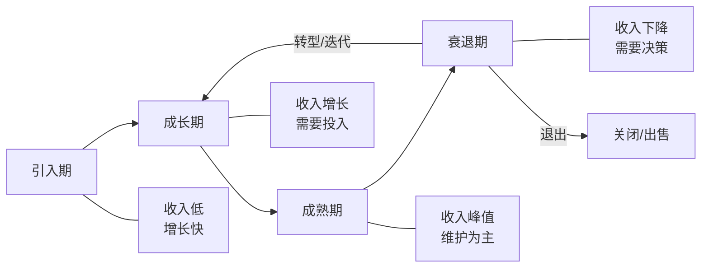
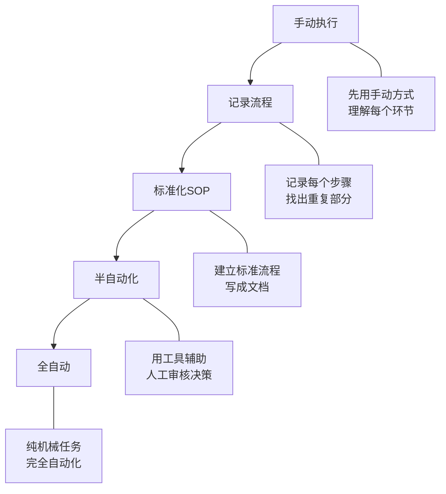
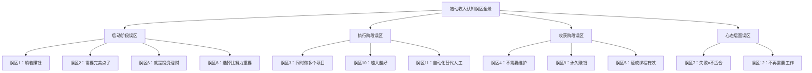

# 第21章 被动收入构建 — 常见误区

被动收入的概念看似简单，但大量实践者在认知层面存在系统性偏差。这些偏差不是个别现象，而是根植于人类认知的固有模式中。本章从认知科学出发，逐一拆解12个最常见的被动收入误区，帮助你在起步前就避开80%的弯路。

***

## 为什么我们容易陷入误区？

在逐个分析误区之前，有必要理解误区产生的认知根源。被动收入领域的误区之所以顽固，是因为它们恰好迎合了人类大脑的几种认知捷径。

### 认知偏差如何扭曲我们的判断



| 认知偏差 | 在被动收入中的典型表现 | 纠正方法 |
|---------|---------------------|---------|
| 乐观偏差 | "我3个月就能做到月入过万" | 参考行业中位数而非极端成功案例 |
| 幸存者偏差 | "那个博主做到了，我也能" | 主动搜索失败案例，了解真实成功率 |
| 即时满足偏差 | "做了2周没效果就放弃" | 设置最小验证期（至少3-6个月） |
| 沉没成本谬误 | "已经花了5000买课程，必须继续" | 只看未来收益，不看已投入成本 |
| 确认偏差 | "这个方法一定行，因为有人成功了" | 寻找反例，用数据而非个案做决策 |

认识到这些偏差的存在，是避免陷入误区的第一步。下面逐一拆解每个具体的误区。

***

## 误区一："被动收入就是躺着赚钱"

### 误区表现

这是被动收入领域流传最广、危害最大的认知偏差。很多人听到"被动收入"就联想到"不劳而获"——每天睡到自然醒，打开手机看看账户余额，钱就在那里自动增长。社交媒体上充斥着"被动收入5万/月，我只花了2小时"之类的标题，进一步强化了这种幻觉。

这种误区导致两个极端行为：
- **行动瘫痪型：** 觉得既然要"躺着赚钱"，那就等找到"最轻松"的方式再开始，结果永远不开始
- **快速放弃型：** 一旦发现需要大量前期投入，立刻认定"这不是被动收入"，转而寻找下一个"更轻松"的方案

### 认知根源

这个误区的形成与**即时满足偏差**和**框架效应**密切相关。"被动"这个词本身就带有强烈的暗示——它让人联想到"不用动"、"自动发生"。而社交媒体上的成功案例展示的通常是"结果"（收入截图），而非"过程"（数千小时的前期投入），这进一步扭曲了认知。

### 真相：被动收入的完整生命周期

被动收入的"被动"是相对于"主动"而言的，不是说完全不需要努力。准确地说，被动收入是**"用前期的主动投入换取后期的被动收益"**，其生命周期可以分为三个阶段：



每一个成功的被动收入项目背后，都有大量的前期投入：

| 被动收入类型 | 前期投入时间 | 达到稳定收入的周期 | 稳定期月均维护时间 |
|-------------|------------|------------------|------------------|
| 电子书/数字产品 | 200-500小时 | 6-12个月 | 4-8小时/月 |
| 内容型博客/网站 | 500-2000小时 | 12-24个月 | 8-12小时/月 |
| YouTube频道 | 300-1000小时 | 6-18个月 | 10-20小时/月 |
| 股息投资组合 | 100-300小时学习 | 3-5年 | 2-4小时/月 |
| SaaS工具 | 500-3000小时 | 12-36个月 | 20-40小时/月 |
| 联盟营销网站 | 400-1500小时 | 6-18个月 | 6-10小时/月 |

### 案例对比：幻想 vs 现实

**幻想版本：** "我写了一本电子书，上架后每天自动卖出10本，月入轻松过万。"

**现实版本：** 独立开发者小张的电子书收入之路——

| 时间节点 | 投入 | 状态 | 月收入 |
|---------|------|------|--------|
| 第1-3个月 | 每天3小时写作 | 完成初稿8万字 | 0 |
| 第4个月 | 修改、排版、设计封面 | 准备上架 | 0 |
| 第5个月 | 上架，开始推广 | 每天卖2-3本 | 600元 |
| 第6-8个月 | 写博客引流、优化标题 | 逐渐起量 | 2000元 |
| 第9-12个月 | 积累好评、拓展渠道 | 稳定出单 | 5000元 |
| 第13-18个月 | 出第二本、建立系列 | 飞轮效应 | 12000元 |

小张在前4个月的收入是零，前6个月的总收入不到5000元——相当于时薪不到10元。但到了第18个月，他的维护时间降到了每周3-4小时，时薪超过200元。这才是被动收入的真实面貌。

### 正确的认知

被动收入不是"不工作"，而是**"工作一次，收益多次"**。你是在用前期的时间投资，换取后期的时间自由。更准确的定义是：

> 被动收入 = 前期高强度主动投入 × 后期低强度系统维护 × 长期持续收益

与其期待"躺着赚钱"，不如做好"辛苦半年、舒服五年"的心理准备。

***

## 误区二："我需要一个完美的点子才能开始"

### 误区表现

很多人一直在等待一个"完美的创意"或"独一无二的点子"，迟迟不肯行动。他们的口头禅是：
- "这个方向已经有人做了，我做还有意义吗？"
- "我还没想到足够好的切入角度"
- "等我想到一个没人做过的领域再开始"

这种"完美创意焦虑"的本质是**用思考代替行动**——在脑子里构思100个方案，比动手做1个要容易得多，也安全得多。

### 认知根源

这个误区与**分析瘫痪（Analysis Paralysis）**和**损失厌恶（Loss Aversion）**直接相关。大脑会本能地回避风险：开始一个可能失败的项目意味着可能"浪费时间"，而"继续思考"则没有任何损失。但实际上，最大的损失恰恰是时间本身——你花在等待上的每一天，都是错过的复利增长。

### 真相：执行比创意重要100倍

市场上90%的成功被动收入项目，并不是靠独特的创意取胜，而是靠**持续的执行力和优化能力**。事实上，"已经有人做"恰恰证明了市场需求的存在：

| "红海"市场 | 依然有人成功的案例 | 成功原因 |
|-----------|------------------|---------|
| 电子书 | 独立作者月入2万+ | 精准定位细分受众、持续迭代 |
| PPT模板 | 设计师月入5万+ | 差异化风格、优质售后 |
| 评测网站 | 细分领域日流量1万+ | 深度垂直、真实体验 |
| Python教程 | 独立课程月销3万+ | 独特教学方法、实战项目 |
| 联盟营销 | 细分品类月佣3万+ | 深耕一个品类、建立信任 |

### 实操框架：从"想"到"做"的72小时法则

不要等到"想到完美点子"再行动，而是给自己设定一个72小时的行动框架：

**第1天（24小时内）：快速评估**
1. 列出你擅长的3个领域（技能、知识、经验）
2. 列出你愿意投入100小时以上的1个方向
3. 用Google Trends / 百度指数验证搜索趋势
4. 在小红书/知乎搜索该方向的"痛点问题"

**第2天（48小时内）：最小验证**
1. 选择一个最具体的切入点（不要太大）
2. 写出你的产品/内容的100字描述
3. 找到3个类似的成功案例，分析它们的差异化点
4. 确定你的独特价值主张（UVP）

**第3天（72小时内）：开始执行**
1. 创建项目文件夹和工作计划
2. 完成第一个最小交付物（如：博客的第一篇文章、电子书的大纲、模板的第一个页面）
3. 发布到一个平台，获取第一个外部反馈

**72小时后的迭代循环：** 每周回顾一次数据，根据反馈调整方向，而不是在脑子里反复推演。

### 关键认知

> 不要试图在岸上学会游泳。跳进水里，你会学得更快。

市场竞争的存在不是你不去做的理由，而是需求被验证的证据。你的优势不是"想到一个没人做过的点子"，而是"用你的独特视角和执行力，在已有市场中找到你的位置"。

***

## 误区三："我可以同时启动多个被动收入项目"

### 误区表现

有些人热情高涨，同时启动了5-6个被动收入项目：写电子书、做YouTube频道、开淘宝店、投资股票、写公众号、做播客……每天在不同项目之间来回切换，每个项目都投入一点时间，结果6个月后回顾发现——每个项目都处于"半成品"状态，没有一个能产生可观的收入。

### 认知根源

这种行为背后是**新奇偏好（Novelty Bias）**——大脑天生会被新鲜事物吸引，启动新项目的"快感"远大于深耕老项目的"枯燥"。同时，社交媒体上的"多重被动收入"叙事也在推波助澜，让人误以为成功者都是一口气建立了10个收入来源。

### 真相：资源聚焦的幂律法则

被动收入遵循典型的**幂律分布**——你80%的收入将来自1-2个项目，而不是均匀分布在多个项目中。同时做太多事情意味着每个项目都分不到足够的资源和精力。

**数学模型：** 假设你每天有3小时用于副业——

| 方案 | 每个项目时间/天 | 6个月后预期结果 |
|------|---------------|---------------|
| 同时做5个项目 | 36分钟 | 每个都在起步阶段，总收入≈0 |
| 同时做2个项目 | 90分钟 | 可能有1个开始产生收入 |
| 专注1个项目 | 180分钟 | 大概率进入稳定产出期 |

这不是简单的线性关系。专注带来的效率提升是**非线性**的——当你在一个方向上连续投入100小时后，你的认知深度、执行效率、资源积累都会产生复利效应。而每天36分钟的碎片化投入，永远无法突破这个临界点。

### 推荐的项目聚焦策略



**关键原则：** 与其在5个项目上各投入100小时，不如在一个项目上投入500小时。深度比广度更重要。只有当一个项目进入"稳定维护"阶段后，才启动下一个。

### 如何判断一个项目已经"稳定"？

满足以下3个条件中的至少2个，才考虑启动下一个项目：
1. **收入稳定：** 连续3个月月收入超过你的基本生活开销的30%
2. **自动化程度高：** 每周维护时间低于5小时
3. **增长趋势明确：** 不需要你的持续干预也能自然增长

***

## 误区四："被动收入不需要持续维护"

### 误区表现

有人认为被动收入一旦建成就可以完全不管了。这种想法会导致一系列连锁问题：电子书内容过时不更新导致差评增加、网站SEO排名下降导致流量归零、投资组合长期不调整导致风险集中、客户反馈不关注导致口碑崩塌。

### 真相：低维护 ≠ 零维护

即使是"最被动"的收入形式，也需要一定程度的维护。区别在于维护的频率和强度：

| 被动收入类型 | 维护频率 | 典型维护内容 | 不维护的后果 |
|-------------|---------|-------------|------------|
| 电子书 | 每6-12个月 | 更新过时内容、优化排版、回应评论 | 差评累积→销量断崖式下跌 |
| 博客网站 | 每周2-3小时 | 更新内容、SEO优化、技术维护 | 流量持续下降→广告收入归零 |
| 股息组合 | 每月1-2小时 | 检查持仓、调整比例、再投资 | 风险集中→一次黑天鹅损失惨重 |
| 租金房产 | 每月2-4小时 | 处理租客问题、设备维护 | 空置率上升→租金收入中断 |
| 数字产品 | 每月4-8小时 | 客户支持、产品迭代、营销推广 | 竞品超越→市场份额被抢 |
| 联盟网站 | 每月3-6小时 | 内容更新、链接检查、佣金跟踪 | 链接过期→佣金归零 |

### 维护成本的真实计算

在评估一个被动收入项目时，必须把维护成本计入：

```text
真实被动收入 = 毛收入 - 运营成本 - 维护时间成本

其中：
维护时间成本 = 每月维护小时数 × 你的时薪（按主业或市场价计算）
```

**案例：** 一个每月收入5000元的博客，如果需要每月投入20小时维护，而你的主业时薪是100元，那么真实被动收入是 5000 - 20×100 = 3000元。如果维护时间降到5小时，真实被动收入就变成了 5000 - 5×100 = 4500元。

这个计算方式帮助你做出更理性的决策：是继续优化现有项目降低维护成本，还是把精力投入到新的收入来源。

### 正确的预期

被动收入不是"零维护"，而是**"低维护"**。你仍然需要投入时间，但这个投入远小于主动收入所需的时间。理想的被动收入项目应该满足：

> 维护时间 ≤ 收入的10%时间当量

即如果这个项目每月收入10000元，你的维护时间不应该超过等值1000元的小时数。

***

## 误区五："速成课程能帮我快速实现被动收入"

### 误区表现

市面上有大量"被动收入速成课"，声称可以教你"30天赚到10万被动收入"、"零基础月入5万"、"我用这个方法3个月买了车"等。很多人花钱买了这些课程，结果发现要么内容空洞，要么方法不适用，要么需要额外投入大量资金才能执行。

### 认知根源

这个误区的产生与**权威偏误（Authority Bias）**和**社会认同（Social Proof）**密切相关。当一个"导师"展示豪车、名表和银行流水截图时，大脑会自动降低批判性思维的阈值。而"已有10000+学员"的标签，更是触发了"这么多人都买了，应该没问题"的从众心理。

### 真相：卖课本身就是他们的被动收入

**如果一个被动收入方法真的这么赚钱，为什么卖课的人不自己做，而要来教你？** 答案往往是：卖课本身就是他们的"被动收入"——他们赚的不是被动收入，而是你为"学习被动收入"支付的学费。

### 识别割韭菜课程的10个信号

| 信号 | 具体表现 | 为什么可疑 |
|------|---------|-----------|
| 不切实际的承诺 | "月入10万"、"零风险"、"30天见效" | 如果真能这样，他们不需要卖课 |
| 无法验证的案例 | "学员小王月入8万"但没有可查证信息 | 真实案例应该可以被独立验证 |
| 核心内容免费可得 | 课程精华在YouTube/知乎上都能找到 | 你付的是包装费，不是知识费 |
| 限时优惠催促 | "今天报名立减5000"、"仅剩3个名额" | 经典的销售压力话术 |
| 高价低质 | 课程价格数千元，内容却是基础知识 | 价格与价值严重不匹配 |
| 二次销售 | 基础课→进阶课→私董会→一对一 | 层层加码的销售漏斗 |
| 炫富营销 | 频繁展示奢侈品、旅行、豪车 | 用生活方式吸引而非用内容说服 |
| 缺乏退款政策 | "一经售出概不退款" | 对自己的产品没有信心 |
| 过度依赖个人 | "只有跟对人才能成功" | 把成功归因于个人而非方法论 |
| 模糊方法论 | 大量励志故事，具体操作语焉不详 | 真正的方法论应该是清晰可复制的 |

### 正确的学习路径

**阶段一：免费资源入门（0-3个月）**
- YouTube/B站：搜索"passive income"、"被动收入"相关频道
- 知乎/小红书：关注实际在做的人（有真实数据分享的）
- 播客：听真实的创业者访谈，了解真实过程
- 书籍：《富爸爸穷爸爸》《The 4-Hour Workweek》等经典

**阶段二：实践验证（3-6个月）**
- 选择一个方向开始执行
- 遇到具体问题时，搜索免费解决方案
- 加入免费社群（Reddit、Discord、微信群）获取同行经验

**阶段三：精准付费（6个月+）**
- 只在你已经实践过的领域付费学习
- 只购买你能明确说出"我要解决什么具体问题"的课程
- 优先选择有退款政策、有真实社区、有可验证案例的课程
- 价格上限：不超过你预期收益的10%

### 判断一个付费课程是否值得的标准

```text
值得付费 = 你已经在做 + 你遇到了具体瓶颈 + 这个课程能解决这个具体问题
         + 有退款政策 + 有可验证的成功案例 + 价格合理

不值得付费 = 你还没开始 + 课程承诺"从零到月入X万"
             + 主要靠炫富吸引 + 没有退款政策
```

***

## 误区六："被动收入就是投资理财"

### 误区表现

很多人把被动收入等同于投资理财，认为只有炒股、买基金、买房才算被动收入。这种窄化理解导致两个问题：一是让没有启动资金的人直接放弃；二是让人忽视了用技能和时间创造被动收入的可能性。

### 真相：被动收入的完整图谱

投资理财只是被动收入的五大类型之一。被动收入按投入要素可以分为三大类：

```mermaid
graph TD
    A[被动收入三大类型] --> B[用"钱"生钱]
    A --> C[用"时间+技能"生钱]
    A --> D[用"系统"生钱]
    
    B --> B1[股票股息]
    B --> B2[基金分红]
    B --> B3[房产租金]
    B --> B4[REITs]
    B --> B5[债券利息]
    B --> B6[P2P/借贷]
    
    C --> C1[电子书/课程]
    C --> C2[博客/自媒体]
    C --> C3[设计模板]
    C --> C4[软件插件]
    C --> C5[摄影作品]
    C --> C6[音乐版权]
    
    D --> D1[联盟营销网站]
    D --> D2[SaaS工具]
    D --> D3[自动化电商]
    D --> D4[会员制社群]
    D --> D5[App应用]
```

**关键区别：**

| 维度 | 用"钱"生钱 | 用"时间+技能"生钱 | 用"系统"生钱 |
|------|----------|-----------------|------------|
| 启动门槛 | 需要资金 | 需要技能和时间 | 需要技术能力和时间 |
| 风险等级 | 中-高 | 低-中 | 中 |
| 收入上限 | 取决于本金 | 取决于内容质量 | 取决于系统规模 |
| 复利效应 | 资产复利 | 知名度复利 | 流量/用户复利 |
| 适合人群 | 有闲置资金的人 | 有专业技能的人 | 有技术能力的人 |
| 典型回报周期 | 数年 | 6-18个月 | 12-36个月 |

### 选择适合你的起点

**如果你有资金（>10万）：** 从投资理财入手，同时用技能型被动收入补充
**如果你有技能（写作/设计/编程）：** 从内容创作或数字产品入手
**如果你有技术能力：** 从自动化系统（SaaS/联盟营销）入手
**如果你什么都没有：** 从最低门槛的内容创作起步（写博客、做公众号），用时间积累技能和初始资金

不要因为"没有钱投资"就放弃被动收入。时间、技能、知识都是可以产生被动收入的"资本"。

***

## 误区七："失败了说明我不适合做被动收入"

### 误区表现

有些人在第一次尝试被动收入项目失败后，就认为自己"不适合"做被动收入，从此放弃。这种"一击即退"的心态，本质上是对失败的错误归因。

### 认知根源

这个误区与**固定型思维模式（Fixed Mindset）**直接相关。持有固定型思维的人认为能力是天生的、不可改变的——"我失败了"意味着"我不具备这个能力"。而**成长型思维（Growth Mindset）**的人则把失败看作学习过程的一部分——"我失败了"意味着"我还需要学习更多"。

### 真相：失败是被动收入构建过程中的常态

**没有任何一个成功的被动收入创业者是一次就成功的。** 以下是真实的失败-成功路径：

**案例1：电子书作者的三次尝试**
| 尝试 | 投入时间 | 结果 | 失败原因 | 学到了什么 |
|------|---------|------|---------|-----------|
| 第1本 | 3个月 | 售出47本 | 选题太泛、没有目标读者 | 定位要精准到具体人群的痛点 |
| 第2本 | 2个月 | 售出230本 | 标题不吸引人、封面粗糙 | 标题和封面决定了第一印象 |
| 第3本 | 2个月 | 售出2100本 | — | 前两次的经验累积终于爆发 |

**案例2：联盟营销网站的迭代之路**
| 尝试 | 持续时间 | 月流量 | 月收入 | 关键调整 |
|------|---------|--------|--------|---------|
| 第1个站 | 6个月 | 200UV | 0 | 选错了细分领域，竞争太激烈 |
| 第2个站 | 4个月 | 800UV | 300元 | 领域对了，但内容质量不够 |
| 第3个站 | 8个月 | 15000UV | 8000元 | 深耕细分、内容质量、SEO优化 |

### 失败分析框架

每次失败后，用这个框架进行复盘：

```text
失败复盘四步法：

1. 事实层：发生了什么？（客观数据，不是感受）
   - 投入了多少时间/金钱？
   - 产出了什么成果？
   - 关键指标是什么？（流量/转化率/收入）

2. 归因层：为什么失败？（区分内因和外因）
   - 内因：选题/内容/推广/执行层面的问题
   - 外因：市场变化/竞争加剧/平台政策

3. 学习层：学到了什么？（可复用的经验）
   - 哪些做法是有效的，下次继续？
   - 哪些做法是无效的，下次避免？
   - 发现了什么新的认知？

4. 行动层：下次怎么改？（具体的改进措施）
   - 下一个项目的方向是什么？
   - 需要提前规避什么风险？
   - 需要学习什么新技能？
```

### 正确的态度

把每次失败看作是一次"投资"——你投入了时间和金钱，换来的是宝贵的经验和认知。这些经验会让你的下一次尝试更有可能成功。

> 被动收入领域的"失败"不是终点，而是学费。关键不是避免失败，而是**降低每次失败的成本**，**加快从失败中学习的速度**。

***

## 误区八："选择比努力更重要，我只需要找到正确的赛道"

### 误区表现

有些人花大量时间"研究赛道"——分析市场趋势、对比不同被动收入类型的ROI、计算哪个方向"最赚钱"。他们做了无数个Excel表格和SWOT分析，却迟迟没有开始执行。"选择"成了拖延的借口。

### 真相：选择和努力不是对立的

"选择比努力更重要"这句话本身没错，但它被过度解读了。真相是：

1. **大多数被动收入方向的"天花板"都足够高。** 电子书、博客、联盟营销、数字产品——每个方向都有人月入10万+，也都有一分钱没赚到的人。差距不在赛道，而在执行。

2. **最优选择只有事后才能确定。** 你无法在开始前就知道哪个方向最适合你。只有在实践中，你才能发现自己擅长什么、市场需要什么、你的热情在哪里。

3. **过度分析的机会成本很高。** 花3个月分析赛道，不如花3个月尝试一个方向。即使方向选错了，你获得的经验也比分析报告有价值得多。

### 实操建议：有限理性决策

不要追求"最优选择"，而是做"足够好的选择"然后快速执行：

```text
决策时间上限：
- 花在分析上的时间 ≤ 你计划投入总时间的10%
- 如果你计划投入500小时，最多花50小时做选择
- 50小时内做出决定，然后开始执行

选择标准（满足3个以上即可行动）：
1. 你对这个领域有兴趣或好奇心
2. 你在这个领域有一定的技能或知识基础
3. 市场上有人在这个方向赚钱（验证过的需求）
4. 你可以用业余时间开始（不需要辞职）
5. 初始投入在你可承受的范围内
6. 你能在3个月内看到初步反馈
```

### 赛道切换的正确时机

开始执行后，在以下情况下考虑切换方向：
- 连续6个月全力投入后没有任何正反馈（0收入、0增长）
- 你发现自己对这个方向完全丧失兴趣（热情枯竭）
- 市场发生了根本性变化（政策、技术变革）
- 你发现了明显更好的机会，且有数据支撑

不要因为"做得辛苦"就切换——辛苦是正常的。也不要因为"别人说另一个方向更好"就切换——噪音永远存在。

***

## 误区九："被动收入一旦建立就能永久赚钱"

### 误区表现

有人把被动收入想象成"建一次，赚一辈子"的事情，完全忽视了外部环境的变化。这种静态思维会导致：不关注技术迭代、不跟踪市场趋势、不适应平台规则变化。

### 真相：所有被动收入都有生命周期

没有任何一个被动收入来源是"永恒"的。每个项目都有其生命周期：



**常见被动收入来源的平均生命周期：**

| 收入类型 | 典型生命周期 | 衰退原因 | 延续策略 |
|---------|------------|---------|---------|
| 电子书 | 2-5年 | 内容过时、竞品涌现 | 定期更新版本、扩展系列 |
| 博客网站 | 3-8年 | 搜索算法变化、内容同质化 | 持续更新、多渠道分发 |
| YouTube频道 | 3-7年 | 算法变化、观众口味变化 | 内容迭代、平台多元化 |
| SaaS工具 | 5-15年 | 技术变革、竞品替代 | 持续开发、功能迭代 |
| 股息组合 | 10年+ | 经济周期、公司经营变化 | 定期再平衡 |
| 房产租金 | 20年+ | 区域发展变化 | 物业升级、区域轮动 |

### 建立"反脆弱"的被动收入体系

不要依赖单一收入来源，而是建立一个多层次的收入组合：

**核心层（60%精力）：** 1-2个已经验证的、稳定产生收入的项目
**探索层（30%精力）：** 1个处于成长期的新项目
**观察层（10%精力）：** 关注行业趋势、新技术、新平台

这个比例可以根据你的阶段动态调整：
- 初期：探索层80%、观察层20%（全力找到方向）
- 中期：核心层60%、探索层30%、观察层10%（稳定中求增长）
- 成熟期：核心层40%、探索层30%、观察层30%（防御衰退风险）

### 应对变化的实操方法

1. **设置预警指标：** 为每个被动收入来源设定"衰退信号"，如连续3个月收入下降20%以上
2. **定期扫描竞品：** 每季度花2小时了解你的竞争环境变化
3. **保持学习习惯：** 每周花3小时学习行业新知识、新技术
4. **维护退出通道：** 提前想好"如果这个项目不行了，我可以转做什么"

***

## 误区十："被动收入项目越大越好"

### 误区表现

有些人追求"大而全"——电子书要写20万字、网站要覆盖所有品类、课程要包含50节课。他们认为规模越大、覆盖越全，收入就会越高。

### 真相：小而精 > 大而全

在被动收入领域，**精准度比规模更重要**。一个100页的精准解决某个痛点的电子书，往往比一本500页的泛泛而谈的"大全"卖得更好。

**数据对比：**

| 维度 | 大而全方案 | 小而精方案 |
|------|----------|----------|
| 开发时间 | 6-12个月 | 1-3个月 |
| 上线速度 | 慢 | 快 |
| 目标受众 | 模糊 | 精准 |
| 转化率 | 低（1-2%） | 高（5-10%） |
| 口碑传播 | 弱 | 强（"这个正好解决了我的问题"） |
| 迭代灵活性 | 低（改动成本高） | 高（快速调整） |
| 心理压力 | 高（总觉得没做完） | 低（快速获得正反馈） |

### 最小可行产品（MVP）策略

在被动收入领域，MVP（Minimum Viable Product）策略同样适用：

**电子书MVP：** 先写一本30-50页的小册子，解决一个具体问题。上架后根据反馈决定是否扩展。
**课程MVP：** 先做一个3-5节的迷你课程，测试市场需求。有需求再扩展完整课程。
**模板MVP：** 先做1-2个高质量模板，测试平台和定价。验证后再批量制作。
**网站MVP：** 先做10-20篇高质量文章，测试流量和转化。有效果再扩展内容。

### 扩展的正确时机

只有当你的MVP达到以下指标时，才考虑扩大规模：
- 有稳定的用户/读者基础（至少100个活跃用户）
- 收到了明确的"希望有更多内容"的反馈
- 你的MVP已经证明了盈利模式可行
- 你有足够的时间和精力进行扩展

***

## 误区十一："我可以用自动化工具完全替代人工"

### 误区表现

有些人对"自动化"有不切实际的幻想，认为可以用工具完全替代人工投入：用AI写全部内容、用机器人自动推广、用脚本自动处理所有运营。结果往往是：内容质量低下、用户体验差、被平台处罚。

### 真相：自动化是放大器，不是替代品

工具和自动化可以**放大**你的效率，但不能**替代**你的判断力和创造力。以下是自动化的正确使用方式：

| 环节 | 可以自动化的部分 | 必须人工的部分 |
|------|----------------|--------------|
| 内容创作 | 初稿生成、格式排版、语法检查 | 选题判断、核心观点、个人经验 |
| 推广营销 | 定时发布、数据统计、基础SEO | 内容策略、品牌定位、用户互动 |
| 客户服务 | 常见问题自动回复、订单处理 | 复杂问题处理、用户关系维护 |
| 数据分析 | 数据采集、报表生成 | 趋势解读、策略决策 |

### 自动化的合理边界

**适合自动化的情况：**
- 重复性高、规则明确的任务（定时发布、数据备份）
- 大规模但低复杂度的任务（批量处理订单、格式转换）
- 需要7×24小时运行的任务（网站监控、自动回复）

**不适合自动化的情况：**
- 需要创意和判断的任务（内容创作的核心部分）
- 需要情感连接的任务（用户互动、品牌建设）
- 需要灵活应变的任务（危机处理、突发情况应对）

### 正确的自动化路径



**关键原则：** 先手动做，理解每个环节的价值和风险，然后再逐步自动化。不要跳过"理解"这一步直接上自动化工具。

***

## 误区十二："被动收入会让我不再需要工作"

### 误区表现

有些人把被动收入当作"逃避工作"的手段——他们的终极目标是"再也不用工作"。这种心态会导致两个问题：一是对被动收入的期望过高（"等我有了被动收入就辞职"）；二是在实现一定被动收入后陷入意义真空（"我每天干什么？"）。

### 真相：被动收入是手段，不是目的

被动收入的真正价值不是"让你不工作"，而是**"让你有选择工作的自由"**。

**被动收入的不同境界：**

| 境界 | 收入状态 | 心理状态 | 适合做什么 |
|------|---------|---------|----------|
| 基础保障 | 被动收入覆盖基本生活开销 | 有安全感，不再为生存焦虑 | 尝试感兴趣但收入不确定的方向 |
| 财务缓冲 | 被动收入覆盖全部生活开销 | 有底气，可以说"不" | 拒绝不想要的工作，选择有价值的项目 |
| 财务自由 | 被动收入远超生活开销 | 有自由，按兴趣选择 | 投入真正热爱的事业，即使不赚钱 |
| 财务充裕 | 被动收入可支持多人生活 | 有能力，可以帮到他人 | 创造社会价值，指导后来者 |

### 重新定义你的目标

不要把目标设定为"被动收入X万/月，然后辞职"，而是：

> 我希望通过被动收入获得足够的财务缓冲，让我能够选择做真正有价值的事情——无论是创业、写作、公益，还是陪伴家人。

这种重新定义有两个好处：
1. **降低心理压力：** 你不需要"赚到足够多的钱才能停下来"，而是"有了基础保障就可以开始追求更有意义的事"
2. **提升持续动力：** "为了自由而工作"比"为了赚钱而工作"更能持续产生动力

### 那些实现了"财务自由"的人在做什么？

观察已经实现被动收入覆盖生活开销的人，你会发现他们几乎没有人真的"不工作"了。他们通常会：
- 开始做自己真正热爱的项目（即使初期不赚钱）
- 用更多时间学习和成长
- 帮助他人实现类似的目标
- 投入公益或社会创新
- 降低工作强度，但不完全停止

**结论：** 被动收入的终极目标不是"不工作"，而是"自由地工作"。

***

## 误区全景图：12个误区的分类与关系

为了帮助你系统性地理解这12个误区，我们将它们按认知阶段分类：



### 误区速查表

| 序号 | 误区 | 核心纠正 | 行动建议 |
|------|------|---------|---------|
| 1 | 躺着赚钱 | 前期投入换后期收益 | 做好"辛苦半年、舒服五年"的准备 |
| 2 | 需要完美点子 | 执行力比创意重要100倍 | 72小时内开始行动 |
| 3 | 同时做多个项目 | 专注1个直到稳定 | 设定稳定标准后再开新项目 |
| 4 | 不需要维护 | 低维护≠零维护 | 把维护成本计入真实收入计算 |
| 5 | 速成课程有效 | 免费资源+实践才是正道 | 先实践6个月再考虑付费 |
| 6 | 就是投资理财 | 用时间/技能/系统也能生钱 | 根据自身资源选择起点 |
| 7 | 失败=不适合 | 失败是学费，不是终点 | 用四步复盘法分析每次失败 |
| 8 | 选择比努力重要 | 够好即可，执行优先 | 决策时间不超过总投入的10% |
| 9 | 永久赚钱 | 所有收入都有生命周期 | 建立核心+探索+观察三层体系 |
| 10 | 越大越好 | 小而精>大而全 | 先做MVP，验证后再扩展 |
| 11 | 自动化替代人工 | 自动化是放大器 | 先手动理解，再逐步自动化 |
| 12 | 不再需要工作 | 目标是自由地工作 | 用被动收入获得选择权 |

***

## 自我诊断：你当前的认知健康度

在结束本章之前，用以下12个问题做一次自我诊断。对每个问题诚实回答"是"或"否"：

```text
□ 1. 我期待被动收入能在3个月内产生显著收益
□ 2. 我已经花了超过1个月在"选方向"上还没开始
□ 3. 我同时在推进2个以上的被动收入项目
□ 4. 我认为一旦建好就不需要再投入时间
□ 5. 我正在考虑购买一个"被动收入速成课"
□ 6. 我认为只有投资理财才算被动收入
□ 7. 我之前的失败让我觉得"我不适合做这个"
□ 8. 我花在分析"哪个方向最好"上的时间比执行还多
□ 9. 我认为一个好的被动收入项目可以永远赚钱
□ 10. 我计划做一个"大全"型产品覆盖所有需求
□ 11. 我认为可以用AI/工具完成所有工作
□ 12. 我的目标是"赚够钱就再也不用工作"
```

**评分标准：**
- 回答"是"的数量 ≤ 3：认知健康，继续保持理性判断
- 回答"是"的数量 4-6：存在认知偏差，需要针对性纠正
- 回答"是"的数量 ≥ 7：强烈建议重新阅读本章，并在行动前调整认知

> **避坑心法：** 被动收入构建最大的敌人不是外部竞争，而是内部的错误认知。纠正这12个误区，你已经超越了90%的人。认知到位了，行动才有方向。
