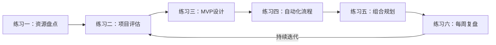
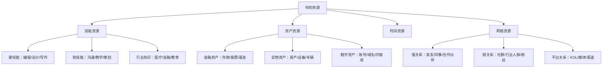
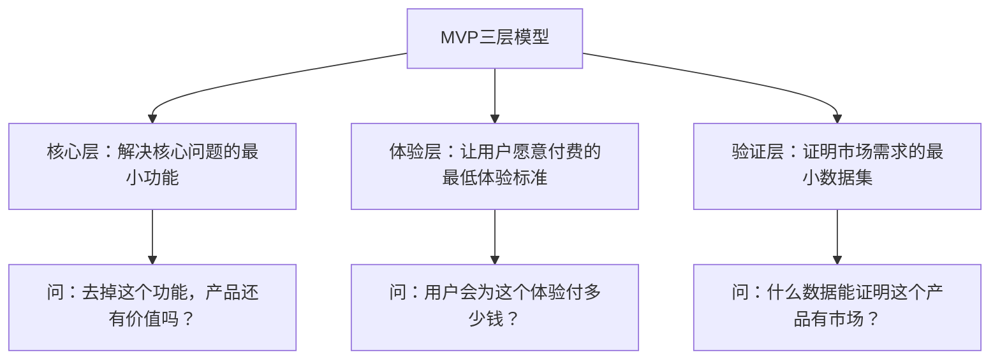

# 第21章 被动收入构建 — 练习方法

> 知道和做到之间隔着一万次练习。本章提供6个渐进式练习，从自我认知到系统构建，带你把被动收入从概念落地为可运转的商业模式。每个练习都包含理论框架、操作步骤、填写示例和常见误区，完成全部练习后，你将拥有一份可执行的被动收入蓝图。

## 练习概览与学习路径

6个练习按逻辑递进排列，建议按顺序完成，每个练习的输出是下一个练习的输入：



| 练习 | 核心能力 | 预计耗时 | 难度 |
|------|----------|----------|------|
| 练习一：资源盘点 | 自我认知 | 60分钟 | ★☆☆ |
| 练习二：项目评估 | 商业判断 | 90分钟 | ★★☆ |
| 练习三：MVP设计 | 产品思维 | 70分钟 | ★★☆ |
| 练习四：自动化流程 | 系统思维 | 60分钟 | ★★★ |
| 练习五：组合规划 | 战略规划 | 65分钟 | ★★★ |
| 练习六：每周复盘 | 持续改进 | 30分钟/周 | ★★☆ |

---

## 练习一：个人资源盘点

### 为什么这个练习重要

多数人高估了自己缺什么，低估了自己有什么。被动收入不是从零开始的创业，而是把你已有的资源（技能、资产、人脉、时间）重新组合，转化为可持续的收入流。资源盘点的目的是找到你的"杠杆支点"——用最少的启动成本，撬动最大的收入潜力。

### 盘点方法论：四维资源模型

被动收入的资源可以分为四个维度，每个维度都有不同的变现路径：



### 步骤一：技能盘点（30分钟）

列出你所有的专业技能和个人特长，用"熟练度×可变现度"双维度评估：

| 技能类别 | 具体技能 | 熟练程度（1-10） | 可变现程度（1-10） | 综合得分 | 被动收入路径示例 |
|----------|----------|------------------|-------------------|----------|-----------------|
| 专业技能 | Python编程 | 8 | 9 | 72 | 开发工具/模板出售、录制编程课程 |
| 专业技能 | 数据分析 | 7 | 8 | 56 | 提供数据报告模板、写行业分析付费专栏 |
| 兴趣爱好 | 健身 | 6 | 7 | 42 | 健身食谱电子书、训练计划模板 |
| 兴趣爱好 | 摄影 | 5 | 8 | 40 | 素材库上传（视觉中国/Shutterstock） |
| 行业经验 | 教育培训 | 8 | 8 | 64 | 在线课程、知识付费、教辅资料 |
| 行业经验 | 电商运营 | 7 | 9 | 63 | 代运营咨询、运营SOP模板 |
| 人脉资源 | 技术社群 | 6 | 6 | 36 | 社群付费会员、技术顾问 |
| 人脉资源 | 行业关系 | 5 | 7 | 35 | 中介撮合、资源对接服务 |

**填写指南：**
- **熟练程度**：1=刚入门，5=能独立完成，10=行业专家级
- **可变现程度**：1=几乎无法变现，5=有人愿意付费，10=市场需求旺盛
- **综合得分** = 熟练程度 × 可变现程度，得分 > 40 的技能优先考虑

**常见误区：**
- ❌ "我没什么特别的技能"——每个人都有，只是你习以为常了。会做PPT、能写清晰的邮件、擅长组织活动，这些都是技能
- ❌ "这个技能太普通了，没人会付费"——越基础的技能，受众越广。教Excel的课程比教量子力学的课程赚得多得多
- ❌ 只列硬技能不列软技能——沟通能力、教学能力、项目管理能力同样是高价值资源

### 步骤二：资产盘点（20分钟）

不只是"我有什么"，更要评估"这些资产能产生多少被动收入"：

| 资产类别 | 具体资产 | 当前状态 | 被动收入潜力 | 变现路径 |
|----------|----------|----------|-------------|----------|
| **金融资产** | 银行存款20万 | 活期0.2% | 理财2-4%/年 | 货币基金/大额存单/国债 |
| **金融资产** | 股票账户8万 | 散户操作 | 股息2-5%/年 | 高股息策略/指数基金定投 |
| **实物资产** | 闲置车位1个 | 空置中 | 300-500元/月 | 车位出租/共享停车 |
| **实物资产** | 相机+镜头 | 偶尔使用 | 100-300元/天 | 设备租赁/素材拍摄 |
| **数字资产** | 公众号5000粉 | 停更半年 | 广告/带货 | 恢复更新/接广告/知识付费 |
| **数字资产** | 个人博客 | 月访问2000 | 广告/联盟 | SEO优化/affiliate推广 |
| **知识资产** | 工作文档模板50+ | 内部使用 | 单次出售 | 打包成模板包出售 |
| **知识资产** | 读书笔记200+ | 私有 | 内容创作素材 | 加工成付费内容 |

**填写指南：**
- **当前状态**：如实描述，包括活跃/闲置/贬值等状态
- **被动收入潜力**：参考市场行情给出合理区间
- **变现路径**：越具体越好，最好能给出平台名称

### 步骤三：时间盘点（10分钟）

时间是最稀缺的资源。精确盘点你的时间，才能做出务实的规划：

| 时间段 | 工作日（周一至周五） | 周末（周六日） |
|--------|---------------------|---------------|
| 早晨 6:00-8:00 | □ 可用 ___分钟 | □ 可用 ___分钟 |
| 午休 12:00-13:30 | □ 可用 ___分钟 | — |
| 晚上 19:00-22:00 | □ 可用 ___分钟 | □ 可用 ___分钟 |
| 碎片时间（通勤等） | □ 可用 ___分钟 | □ 可用 ___分钟 |
| **每周总计** | ___小时 | ___小时 |

**时间利用建议：**
- **每周 < 5小时**：选择低启动成本、高自动化程度的项目（如理财、模板出售、素材上传）
- **每周 5-15小时**：可以选择内容创作类项目（如写书、做课程、运营自媒体）
- **每周 > 15小时**：可以启动较复杂的项目（如开发SaaS产品、建立电商体系）

**常见误区：**
- ❌ 高估可用时间——别忘了社交、运动、休息的时间也要预留
- ❌ 忽视碎片时间——通勤的30分钟可以用来构思文章大纲、回复客户消息
- ❌ 没有区分"深度时间"和"浅度时间"——写代码需要2小时不被打断，发社交媒体只需要10分钟

### 输出：资源盘点总表

完成以上三个步骤后，整合成一张总表，找到你的最优起点：

| 维度 | 第一名资源 | 得分/价值 | 适配的被动收入类型 |
|------|-----------|----------|-------------------|
| 最强技能 | ___ | ___分 | ___ |
| 最高价值资产 | ___ | ___元/月潜力 | ___ |
| 每周可用时间 | ___小时 | — | ___ |
| **建议起步方向** | ___ | | |

---

## 练习二：被动收入项目评估

### 为什么这个练习重要

想法不值钱，筛选想法的能力才值钱。多数人失败不是因为没想法，而是选了一个与自己资源不匹配的项目。SWOT-P评估框架帮你在动手之前做出理性决策，避免"拍脑袋"式创业。

### SWOT-P评估框架详解

传统SWOT分析（优势、劣势、机会、威胁）加上一个P（被动程度），专门为被动收入项目设计：

| 维度 | 评估内容 | 权重 | 评分标准 |
|------|----------|------|----------|
| **S - 技能匹配** | 你现有的技能和经验是否匹配项目需求 | 25% | 1=完全陌生，3=有基础，5=核心技能 |
| **W - 资金需求** | 启动和运营该项目需要多少资金 | 20% | 1=需要大额投入，3=中等投入，5=几乎零成本 |
| **O - 市场机会** | 目标市场的规模、增长趋势和竞争程度 | 25% | 1=红海且萎缩，3=有竞争但稳定，5=蓝海且增长 |
| **T - 时间投入** | 从启动到产生收入需要多长时间 | 15% | 1=需要1年以上，3=3-6个月，5=1个月内可见效 |
| **P - 被动程度** | 系统搭建完成后，每月需要投入多少维护时间 | 15% | 1=仍需全职投入，3=每周几小时，5=几乎全自动 |

### 步骤一：列出候选项目（10分钟）

基于练习一的资源盘点，列出3-5个候选项目。好的候选项目应该满足：
- 与你的核心技能高度相关
- 启动资金在你的承受范围内
- 有明确的目标用户群体
- 有可参考的成功案例

| 编号 | 项目名称 | 一句话描述 | 参考案例 |
|------|----------|-----------|----------|
| 1 | Python自动化脚本模板 | 将常用脚本打包出售给中小企业 | Gumroad上的脚本商店 |
| 2 | 行业数据分析付费专栏 | 每周发布某行业的深度分析报告 | 知识星球付费专栏 |
| 3 | 在线编程入门课程 | 录制一套系统的Python入门课程 | B站/网易云课堂课程 |
| 4 | 技术文档翻译服务 | 自动化+人工审核的翻译流程 | 有道/DeepL+人工校对 |
| 5 | 开源工具付费增值版 | 在开源基础上增加企业级功能 | WordPress付费插件 |

### 步骤二：SWOT-P评分（每个项目15分钟）

对每个项目逐维度打分，加权计算总分：

| 评估维度 | 权重 | 项目1：脚本模板 | 项目2：付费专栏 | 项目3：编程课程 | 项目4：翻译服务 | 项目5：增值工具 |
|----------|------|----------------|----------------|----------------|----------------|----------------|
| 技能匹配 | 25% | 5 | 4 | 4 | 3 | 5 |
| 资金需求 | 20% | 5 | 5 | 3 | 4 | 3 |
| 市场机会 | 25% | 3 | 4 | 5 | 3 | 4 |
| 时间投入 | 15% | 4 | 3 | 2 | 4 | 2 |
| 被动程度 | 15% | 4 | 3 | 5 | 3 | 5 |
| **加权总分** | 100% | **4.25** | **3.85** | **3.95** | **3.25** | **3.95** |

**加权总分计算方法：**

$$总分 = 技能匹配 \times 0.25 + 资金需求 \times 0.20 + 市场机会 \times 0.25 + 时间投入 \times 0.15 + 被动程度 \times 0.15$$

### 步骤三：排序与决策矩阵

将加权总分排序，并结合其他因素做最终决策：

| 排名 | 项目 | 加权总分 | 启动难度 | 情感热情 | 综合推荐 |
|------|------|----------|----------|----------|----------|
| 1 | Python脚本模板 | 4.25 | 低 | 高 | ⭐⭐⭐ 强烈推荐 |
| 2 | 在线编程课程 | 3.95 | 中 | 高 | ⭐⭐ 值得尝试 |
| 3 | 增值工具 | 3.95 | 高 | 中 | ⭐ 备选 |
| 4 | 付费专栏 | 3.85 | 低 | 中 | ⭐⭐ 值得尝试 |
| 5 | 翻译服务 | 3.25 | 中 | 低 | 暂不推荐 |

**决策建议：**
- 选择总分最高的1-2个项目作为主攻方向
- 如果前两名分数接近（差距 < 0.3），优先选择"启动难度低"的那个
- 情感热情是隐性权重——如果对一个项目毫无热情，很难坚持到产出被动收入的那天
- 第一次做被动收入项目，建议选启动难度最低的，先跑通流程建立信心

### 常见误区

- ❌ **选择太多**——同时做3个以上项目，每个都半途而废。建议先集中精力做好1个
- ❌ **只看市场机会不看技能匹配**——市场再大，你做不了也是白搭
- ❌ **忽视被动程度评分**——有些项目看似被动收入，实际上需要持续大量投入时间
- ❌ **过度分析不行动**——评估是为了做更好的决策，不是为了逃避决策。花1-2小时评估足矣

---

## 练习三：MVP设计

### 为什么这个练习重要

完美主义是被动收入的最大敌人。很多人花6个月打磨一个"完美"产品，上线后发现没人买。MVP（最小可行产品）的核心理念是：用最小的成本验证市场需求，然后根据反馈迭代优化。

### MVP设计的三层模型



### 步骤一：定义核心价值（20分钟）

用"价值画布"框架梳理产品定位：

| 要素 | 问题 | 你的回答 |
|------|------|----------|
| **目标用户** | 谁会为这个产品付费？越具体越好 | 示例：工作1-3年的Python开发者，月薪1-2万 |
| **核心痛点** | 他们遇到的最大问题是什么？ | 示例：日常工作中需要重复写自动化脚本，但没有现成模板 |
| **解决方案** | 你的产品如何解决这个问题？ | 示例：提供50+常用自动化脚本模板，开箱即用 |
| **替代方案** | 他们现在怎么解决这个问题？ | 示例：自己写、Google搜索、问同事 |
| **你的优势** | 为什么用户选择你而不是替代方案？ | 示例：模板经过实战验证，附带详细注释和使用文档 |
| **付费意愿** | 用户愿意为这个解决方案付多少钱？ | 示例：单个模板19-49元，模板包199-399元 |

### 步骤二：设计MVP（30分钟）

**MVP设计检查清单：**

```text
□ 核心功能是否足够小？（1-2周内能完成）
□ 是否解决了用户的核心痛点？（不是所有痛点，只是最痛的那个）
□ 用户是否能在5分钟内理解产品价值？
□ 是否有明确的交付物？（文件、链接、服务）
□ 是否设置了清晰的验收标准？
```

**MVP设计模板：**

| 项目 | 内容 |
|------|------|
| MVP名称 | 例：Python办公自动化脚本包 v0.1 |
| 包含内容 | 10个最常用的自动化脚本（Excel处理、邮件发送、文件整理） |
| 交付形式 | GitHub仓库 + 详细README + 使用视频 |
| 制作周期 | 2周（每天投入2小时） |
| 制作成本 | 0元（纯时间投入） |
| 定价策略 | 试销价49元（正式价199元） |
| 发布平台 | Gumroad / 小报童 / 自建网站 |

### 步骤三：验证计划（20分钟）

**验证的三个层次：**

| 验证层次 | 目标 | 方法 | 成功标准 |
|----------|------|------|----------|
| **兴趣验证** | 有人对这个产品感兴趣 | 社交媒体发帖、问卷调查 | 100人表示感兴趣 |
| **意向验证** | 有人愿意为它付费 | 预售页面、早鸟优惠 | 10人预付定金 |
| **价值验证** | 用户用了觉得值 | 交付MVP、收集反馈 | 70%用户给出正面评价 |

**兴趣验证的具体方法：**

1. **社交媒体测试**：在目标用户聚集的社区（V2EX、掘金、知乎）发帖描述你的产品概念，观察反应
2. **Landing Page测试**：用Notion或简单网页搭建产品介绍页，投放小额广告（100-200元），看转化率
3. **问卷调查**：设计5-10个问题的问卷，通过微信群/朋友圈分发，收集定量数据
4. **预售测试**：先收款再制作，这是最强的需求验证方式

**验证失败的应对策略：**

| 失败信号 | 可能原因 | 调整方向 |
|----------|----------|----------|
| 没人点击 | 标题/卖点不吸引人 | 换一个角度重新包装 |
| 点击了但不付费 | 价格太高或价值感不足 | 降低价格或增加内容 |
| 付费了但不满意 | 产品质量不达标 | 根据反馈改进核心功能 |
| 有付费但复购率低 | 一次性需求或体验差 | 增加持续价值或改善体验 |

### 常见误区

- ❌ **MVP太"M"**——质量太差，用户体验极差，反而损害品牌。MVP是"最小可行"不是"最烂版本"
- ❌ **MVP太"V"**——花3个月做了一个"精简版"完整产品。记住：MVP应该在1-4周内完成
- ❌ **不做验证就开工**——"我觉得这个产品一定有人要"是最危险的假设
- ❌ **验证失败就放弃**——一次验证失败不代表方向错了，可能只是包装、定价或渠道的问题

---

## 练习四：自动化流程设计

### 为什么这个练习重要

被动收入的核心是"被动"——系统搭建完成后，日常维护时间越少越好。自动化是实现"被动"的关键手段。一个高度自动化的被动收入系统，可以在你睡觉、旅行、做其他事情的时候持续为你赚钱。

### 自动化成熟度模型

| 级别 | 名称 | 描述 | 典型案例 |
|------|------|------|----------|
| L0 | 完全手动 | 每个环节都需要人工操作 | 手动发朋友圈卖货 |
| L1 | 部分自动化 | 部分环节使用工具辅助 | 用定时发布工具发内容 |
| L2 | 流程自动化 | 主要流程自动化，需人工监督 | 自动发货+手动处理售后 |
| L3 | 系统自动化 | 全流程自动化，仅需定期检查 | 自动发货+自动客服+自动复购 |
| L4 | 智能自动化 | 系统能自我优化和调整 | AI客服+智能推荐+动态定价 |

### 步骤一：绘制完整业务流程（20分钟）

以"在线课程"为例，完整的业务流程如下：


### 步骤二：评估每个环节的自动化程度（20分钟）

| 环节 | 当前方式 | 自动化程度 | 自动化方案 | 工具推荐 | 节省时间 |
|------|----------|-----------|-----------|----------|----------|
| 内容创作 | 手写文章/录视频 | L1 部分辅助 | AI辅助大纲生成、脚本润色 | ChatGPT/Claude + Notion AI | 40% |
| 平台发布 | 手动上传 | L2 流程自动 | 定时发布、多平台同步 | WordPress定时发布、蚁小二 | 80% |
| 流量获取 | 手动SEO/社群分享 | L1 部分辅助 | 自动SEO优化、邮件列表自动推送 | Ahrefs + Mailchimp | 50% |
| 用户注册 | 手动审核 | L3 系统自动 | 自动注册、自动分类标签 | 有赞/小鹅通自动注册 | 95% |
| 付费购买 | 手动收款 | L3 系统自动 | 在线支付、自动开通 | 支付宝/微信支付API | 99% |
| 课程交付 | 手动发链接 | L3 系统自动 | 付款后自动开通课程权限 | 小鹅通/Teachable | 99% |
| 学习服务 | 手动答疑 | L2 流程自动 | FAQ自动回复+人工兜底 | 企业微信自动回复 | 60% |
| 评价反馈 | 手动收集 | L2 流程自动 | 自动发送满意度调查 | 问卷星自动发送 | 80% |
| 复购推荐 | 手动营销 | L2 流程自动 | 自动推送新课程、老带新奖励 | 邮件自动化 + 分销系统 | 70% |

### 步骤三：设计自动化工具栈（20分钟）

根据你的项目类型，选择合适的自动化工具组合：

**内容创作者工具栈：**

| 功能 | 工具 | 费用 | 说明 |
|------|------|------|------|
| 内容管理 | WordPress + Notion | 免费/低成本 | 内容创作和发布的核心平台 |
| 定时发布 | WordPress内置 + Buffer | 免费 | 支持多平台定时发布 |
| 邮件营销 | Mailchimp / ConvertKit | 免费起 | 自动化邮件序列 |
| 支付处理 | Stripe / 支付宝 | 交易手续费 | 自动收款和发货 |
| 客户管理 | HubSpot CRM | 免费版 | 自动记录客户行为 |
| 数据分析 | Google Analytics | 免费 | 自动追踪流量和转化 |

**电商/模板卖家工具栈：**

| 功能 | 工具 | 费用 | 说明 |
|------|------|------|------|
| 店铺平台 | Gumroad / 小报童 / 有赞 | 平台抽成 | 一站式开店和支付 |
| 自动发货 | 平台内置 | 含在平台费中 | 付款后自动发送下载链接 |
| 客服机器人 | 企业微信 / Intercom | 免费/低成本 | 自动回复常见问题 |
| 库存管理 | Notion / Airtable | 免费 | 追踪产品和订单 |
| 营销自动化 | Zapier / 腾讯云HiFlow | 免费起 | 连接各平台自动触发动作 |

### 自动化实施路线图

不要试图一步到位，按优先级分阶段实施：

| 阶段 | 优先级 | 目标 | 典型动作 |
|------|--------|------|----------|
| 第一阶段 | 支付和交付自动化 | 用户付款后自动收到产品 | 接入支付API + 自动发货 |
| 第二阶段 | 流量获取自动化 | 持续获得新用户而不依赖手动推广 | SEO + 邮件列表 + 社媒定时发布 |
| 第三阶段 | 客户服务自动化 | 减少客服人工干预 | FAQ机器人 + 自动回复模板 |
| 第四阶段 | 运营优化自动化 | 系统能自我优化 | A/B测试 + 数据驱动决策 |

### 常见误区

- ❌ **过度自动化**——把所有环节都自动化，结果系统太复杂，维护成本反而更高。先自动化最有价值的环节
- ❌ **忽视人工环节的价值**——有些环节（如高端客户服务）恰恰需要人工来提升体验和溢价
- ❌ **工具选型贪多**——用10个工具不如用3个深度集成的工具。工具之间的数据打通比功能丰富更重要
- ❌ **不设监控**——自动化不等于"甩手不管"。设置告警机制，系统出问题时能及时发现

---

## 练习五：被动收入组合规划

### 为什么这个练习重要

单一收入源的风险很高——平台政策变化、市场需求波动、技术迭代都可能让你的收入瞬间归零。多元化的被动收入组合能有效分散风险，同时利用不同收入源之间的协同效应。

### 被动收入的三大类型

| 类型 | 特征 | 典型案例 | 收入曲线 |
|------|------|----------|----------|
| **资产型** | 一次性投入，长期产生回报 | 理财收益、房租收入、版税 | 📈 前期慢，后期稳定 |
| **内容型** | 持续创作，积累复利效应 | 在线课程、电子书、付费专栏 | 📈 前期慢，后期指数增长 |
| **系统型** | 搭建系统，持续运营 | SaaS产品、电商自动店、联盟营销 | 📈 前期投入大，后期高回报 |

### 步骤一：设定分阶段收入目标（15分钟）

目标设定要遵循SMART原则——具体、可衡量、可实现、相关、有时限：

| 时间节点 | 月收入目标 | 累计投入时间 | 累计投入资金 | 关键里程碑 |
|----------|-----------|-------------|-------------|-----------|
| 第3个月 | 500元 | 100小时 | 500元 | 第一个产品上线 |
| 第6个月 | 2,000元 | 250小时 | 1,000元 | 稳定出单，获得首批好评 |
| 第12个月 | 5,000元 | 500小时 | 2,000元 | 2-3个收入源运转正常 |
| 第24个月 | 15,000元 | 800小时 | 5,000元 | 被动收入覆盖基本生活开支 |
| 第36个月 | 30,000元 | 1,000小时 | 8,000元 | 被动收入超过工资收入 |

**目标校准参考：**
- 保守估计：参考同领域新手的平均收入水平
- 中性估计：参考同领域有1-2年经验者的收入水平
- 乐观估计：参考同领域头部玩家的收入水平
- **建议用保守估计做规划，用乐观估计做激励**

### 步骤二：设计收入组合（30分钟）

**组合设计的核心原则：**

1. **高低搭配**：一个快速变现的项目（现金流）+ 一个长期积累的项目（复利）
2. **风险分散**：不依赖单一平台、单一品类、单一用户群体
3. **协同效应**：不同收入源之间能互相导流、互相增强

| 收入源 | 类型 | 预期月收入 | 启动周期 | 每周维护 | 风险等级 | 依赖平台 |
|--------|------|-----------|----------|----------|----------|----------|
| 主收入源：在线课程 | 内容型 | 3,000-8,000元 | 2-3个月 | 2小时 | 中 | 小鹅通/自建 |
| 副收入源：模板/工具 | 资产型 | 1,000-3,000元 | 1个月 | 1小时 | 低 | Gumroad/小报童 |
| 第三收入源：联盟营销 | 系统型 | 500-2,000元 | 2周 | 0.5小时 | 高 | 各联盟平台 |
| 底层收入源：理财收益 | 资产型 | 200-500元 | 即时 | 0小时 | 低 | 银行/基金 |

### 步骤三：制定12个月行动计划（20分钟）

| 月份 | 阶段 | 主要任务 | 交付成果 | 预期收入 |
|------|------|----------|----------|----------|
| 第1月 | 基础搭建 | 完成资源盘点和项目评估，确定主攻方向 | 评估报告+项目方案 | 0元 |
| 第2月 | MVP制作 | 完成第一个MVP产品的制作和测试 | 产品v0.1上线 | 0元 |
| 第3月 | 市场验证 | 投放测试、收集反馈、迭代产品 | 首批付费用户 | 200-500元 |
| 第4月 | 流量建设 | 搭建SEO+社媒+邮件的流量体系 | 流量基础框架 | 500-1,000元 |
| 第5月 | 产品迭代 | 根据反馈优化产品，增加新功能/内容 | 产品v1.0 | 1,000-2,000元 |
| 第6月 | 自动化 | 实现支付、交付、客服的自动化 | 自动化系统上线 | 2,000-3,000元 |
| 第7月 | 扩展品类 | 启动第二个收入源（模板/工具类） | 第二个产品MVP | 2,500-4,000元 |
| 第8月 | 联盟营销 | 接入联盟营销体系，开始赚取佣金 | 联盟链接部署 | 3,000-5,000元 |
| 第9月 | 规模化 | 加大内容产出，扩大流量渠道 | 月产内容量翻倍 | 4,000-6,000元 |
| 第10月 | 优化提效 | 优化转化率，提升客单价 | 转化率提升20% | 5,000-8,000元 |
| 第11月 | 社群运营 | 建立用户社群，提升复购和口碑 | 付费社群上线 | 6,000-10,000元 |
| 第12月 | 总结复盘 | 全年复盘，规划下一年的收入组合 | 年度报告+次年计划 | 8,000-12,000元 |

### 风险管理矩阵

| 风险类型 | 具体风险 | 概率 | 影响 | 应对策略 |
|----------|----------|------|------|----------|
| 平台风险 | 平台政策变化/封号 | 中 | 高 | 多平台分发，建立私域流量池 |
| 市场风险 | 需求下降/竞争加剧 | 中 | 中 | 持续创新，建立差异化壁垒 |
| 技术风险 | 工具停服/技术故障 | 低 | 高 | 定期备份，备选工具方案 |
| 个人风险 | 时间不足/精力下降 | 中 | 中 | 高度自动化，减少维护依赖 |
| 法律风险 | 版权纠纷/合规问题 | 低 | 高 | 了解相关法规，必要时咨询律师 |

---

## 练习六：每周复盘模板

### 为什么这个练习重要

被动收入不是"设置好就忘了"，而是"设置好后持续优化"。每周花30分钟复盘，能帮你及时发现问题、抓住机会、保持方向正确。数据驱动的复盘比凭感觉判断有效10倍。

### 复盘的ORID框架

| 层次 | 名称 | 问题 | 作用 |
|------|------|------|------|
| O - Objective | 客观事实 | 这周发生了什么？数据表现如何？ | 建立事实基础 |
| R - Reflective | 感受反思 | 哪些让我兴奋？哪些让我沮丧？ | 识别情绪信号 |
| I - Interpretive | 分析解读 | 为什么会出现这些结果？ | 挖掘根因 |
| D - Decisional | 行动决策 | 下周我要做什么改变？ | 转化为行动 |

### 每周复盘模板

**一、客观数据（O）**

| 指标 | 本周 | 上周 | 环比变化 | 目标 | 达成率 |
|------|------|------|----------|------|--------|
| 投入时间 | ___小时 | ___小时 | ___% | ___小时 | ___% |
| 投入资金 | ___元 | ___元 | ___% | ___元 | ___% |
| 新增内容 | ___篇/个 | ___篇/个 | ___% | ___篇/个 | ___% |
| 网站流量 | ___UV | ___UV | ___% | ___UV | ___% |
| 新增用户 | ___人 | ___人 | ___% | ___人 | ___% |
| 付费转化 | ___人 | ___人 | ___% | ___人 | ___% |
| 本周收入 | ___元 | ___元 | ___% | ___元 | ___% |
| 客单价 | ___元 | ___元 | ___% | ___元 | ___% |

**二、感受反思（R）**

本周最让我有成就感的事情：
1. _______________
2. _______________

本周最让我沮丧/焦虑的事情：
1. _______________
2. _______________

本周意想不到的发现：
1. _______________
2. _______________

**三、分析解读（I）**

本周做得好的地方及原因：
1. _______________
2. _______________

本周做得不好的地方及原因：
1. _______________
2. _______________

用户反馈中的关键洞察：
1. _______________
2. _______________

**四、行动决策（D）**

下周必须完成的3件事（按优先级排序）：
1. 【最高优先级】_______________
2. 【高优先级】_______________
3. 【中优先级】_______________

需要停止做的事情：
- _______________

需要寻求帮助的事情：
- _______________

### 复盘的常见误区

- ❌ **只看收入数据**——收入是滞后指标，要看流量、转化率、复购率等先行指标
- ❌ **周复盘变成月复盘**——拖延复盘会让问题积累到无法挽回
- ❌ **只记录不分析**——"收入下降了"不是分析，"收入下降因为这周社媒发布频率从每天1篇降到2天1篇"才是分析
- ❌ **分析了不行动**——复盘的最终产出是"下周要做什么"，不是"这周做了什么"
- ❌ **过度追求数据完美**——初期数据波动是正常的，关注趋势比关注单点更重要

### 复盘频率与深度

| 复盘类型 | 频率 | 耗时 | 重点内容 |
|----------|------|------|----------|
| 每日快检 | 每天 | 5分钟 | 关键指标是否异常、当天任务完成情况 |
| 每周复盘 | 每周 | 30分钟 | 完整ORID复盘、下周计划制定 |
| 月度分析 | 每月 | 1小时 | 趋势分析、策略调整、资源重新分配 |
| 季度战略 | 每季度 | 2-3小时 | 方向评估、组合调整、目标修订 |
| 年度总结 | 每年 | 半天 | 全年回顾、次年规划、能力升级 |

---

## 进阶：从练习到系统的跨越

### 练习完成后的下一步

完成6个练习后，你已经有了完整的被动收入蓝图。接下来的执行阶段，需要关注以下几个进阶主题：

**1. 数据飞轮效应**

当你的被动收入系统开始运转，会产生数据飞轮：用户行为数据 → 产品优化 → 更好的用户体验 → 更多用户 → 更多数据。主动利用这个飞轮，能让你的收入增长速度越来越快。

**2. 复利思维的实践**

- **内容复利**：一篇好文章可以反复产生流量和收入，100篇文章的组合效应远大于单篇
- **品牌复利**：每一次正面用户体验都在积累品牌信任，信任是溢价的基础
- **技能复利**：做第一个产品学到的技能，能让第二个产品做得更快更好

**3. 从被动收入到资产**

最高级的被动收入不是"持续赚小钱"，而是"构建可出售的资产"。一个每月稳定收入5000元的在线课程业务，按照20-30倍月收入的估值，价值10-15万元。把你的被动收入项目当作资产来经营，最终可以选择出售套现。

---

> **练习心法：** 完成6个练习，你就有了从0到1的完整蓝图。但蓝图不等于大厦——从今天开始，每天投入哪怕30分钟，执行你的计划。第一个月最难，因为你还没有看到任何回报。但只要你坚持到第一个付费用户出现的那天，一切都会变得不一样。记住：最好的开始时间是一年前，其次是现在。
