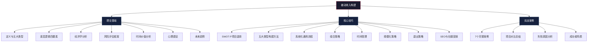
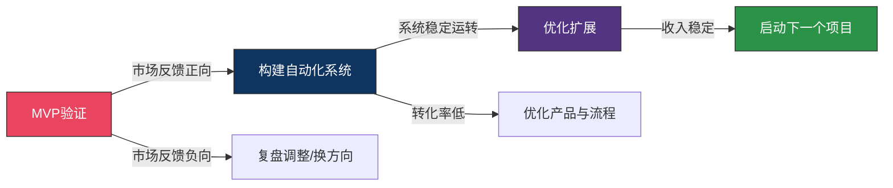

# 第21章 被动收入构建 — 本章小结

***

## 一、本章知识全景

被动收入构建是一套完整的"从思维到行动"的系统方法论。本章从理论基础、核心技巧、实战案例三个维度，层层递进地讲解了如何从零开始构建可持续的被动收入体系。以下是本章的完整知识地图：

***

## 二、核心理论回顾

### 2.1 被动收入的本质定义

被动收入不是"不劳而获"，而是**"劳作一次，收获多次"**。它的经济学本质是将一次性的时间投入转化为持续产出的资产，使收入的发生不再直接绑定个人时间。

被动收入与主动收入的根本区别：

| 维度 | 主动收入 | 被动收入 |
|------|----------|----------|
| 收入与时间的关系 | 线性绑定：工作才有收入 | 脱钩：系统运转即有收入 |
| 边际成本 | 固定（每多赚1元需多投入对应时间） | 趋近于零（数字产品多卖一份成本几乎为零） |
| 上限 | 受限于个人时间和精力 | 理论上无上限 |
| 风险特征 | 收入中断风险（失业、生病） | 市场风险、资产贬值风险 |
| 典型形态 | 工资、咨询费、接单收入 | 版税、股息、租金、数字产品销售 |

### 2.2 被动收入的五大类型

本章系统梳理了五大被动收入类型及其核心特征：

| 类型 | 核心特征 | 典型形态 | 启动资金 | 技能门槛 | 被动程度 |
|------|----------|----------|----------|----------|----------|
| 版税收入 | 一次创作多次收益 | 图书、音乐、软件授权、专利 | 低 | 中高（需创作能力） | 高 |
| 股息收入 | 钱生钱，复利增长 | 个股分红、ETF、REITs、债券 | 中高 | 低（需金融知识） | 极高 |
| 租金收入 | 实物资产出租 | 住宅、商铺、设备、空间 | 高 | 低 | 中（需管理） |
| 数字产品 | 边际成本趋近于零 | 电子书、模板、课程、工具 | 低 | 中（需专业技能） | 高 |
| 自动化业务 | 系统化运营 | 联盟营销、电商、SaaS、广告 | 中 | 中高（需技术/营销） | 中高 |

### 2.3 底层逻辑四要素

被动收入的底层逻辑可以归纳为四个核心要素，它们构成了整个被动收入体系的理论根基：

**要素一：资产思维替代劳动思维**

核心问题——"我现在做的事情，能否在我停止工作后继续产生价值？"如果答案是"能"，你就在做资产型工作；如果"不能"，就是在做消耗型工作。资产思维要求把每一小时的投入都视为对"未来资产"的投资，而非对"当下工资"的交换。

**要素二：系统化取代个人化**

把你的知识和能力封装到一个系统中，让系统代替你运转。系统化的本质是把你从"执行者"变成"设计者"——你不再亲自做所有事，而是设计一个能自动运转的机器。典型路径：个人服务→标准化流程→自动化交付→平台化运营。

**要素三：复利效应**

被动收入的真正威力在于复利。将收益再投入新资产，产生指数级增长。10万本金以年化5%股息率再投资，20年后本息合计约26.5万；如果同时叠加新的被动收入源，增长曲线更加陡峭。前期增长缓慢（竹子扎根期），后期增长惊人（竹子疯长期）。

**要素四：前期投入换后期产出**

被动收入构建的关键是接受前期的低回报甚至零回报。大多数人在这个阶段放弃：前3个月投入100小时收入为0，前6个月投入200小时收入仅数百元，前12个月投入500小时收入才开始稳定。耐心是被动收入构建中最稀缺的品质。

### 2.4 经济学与风险分析

**护城河理论**是评估被动收入可持续性的关键框架：

- **品牌护城河**：强大的品牌能持续吸引客户，降低获客成本
- **网络效应**：用户越多产品价值越大，后来者难以追赶
- **转换成本**：用户切换到其他产品的成本越高，留存越稳定
- **规模经济**：规模越大单位成本越低，利润率越高

**风险评估框架**要求从五个维度审视每个项目：市场风险（需求变化）、技术风险（被替代）、政策风险（法规变化）、运营风险（系统故障）、财务风险（资金链断裂）。没有护城河的被动收入项目很容易被竞争者侵蚀。

***

## 三、核心技巧总结

### 3.1 SWOT-P项目选择法

选择被动收入项目不能靠直觉，需要用SWOT-P框架进行系统评估：

| 维度 | 评估内容 | 评分标准（1-5分） |
|------|----------|-------------------|
| S - 技能匹配度 | 核心技能是否具备？学习成本多高？ | 1=完全不熟悉，5=核心优势 |
| W - 资金需求 | 启动资金？运营成本？回本周期？ | 1=需大额资金，5=几乎零成本 |
| O - 市场机会 | 市场规模？竞争程度？增长趋势？ | 1=红海市场，5=蓝海高增长 |
| T - 时间投入 | 建设时间？日常维护？产出周期？ | 1=超1000小时，5=100小时以内 |
| P - 被动程度 | 人工干预频率？自动化程度？更新频率？ | 1=持续投入，5=完全自动化 |

**决策规则**：总分18分以上的项目优先启动；任何单项低于2分的维度需要重点评估风险缓释方案。

### 3.2 五大类型的构建要点

**版税收入**：关键是选题定位（需求大但供给不足的细分领域）+ 出版路径选择（传统出版8%-15%版税 vs 自出版70%收益）+ 持续推广。数字素材版税（图虫、Shutterstock）适合设计能力强的人，积累1000+素材库可获稳定月收入。

**股息收入**：核心是分散化配置（15-30只不同行业高股息股或直接买红利ETF）+ 选股标准（股息率>4%、连续分红5年+、派息比例30%-70%）+ 股息再投资（DRIP）。REITs是低门槛替代方案，典型收益率5%-10%。

**租金收入**：选房看租售比（年租金/房价>3%）和交通配套。降低管理成本靠智能门锁+标准化合同+租房平台自动化。非传统租金（停车位、储物空间、设备出租）门槛更低。

**数字产品**：MVP策略——先做最小版本测试市场。电子书（3-5万字，定价29-99元，利润率90%+）、设计模板（Canva/PPT/Notion模板，积累100+可月入数千元）、付费工具（解决具体痛点的小工具/插件）。

**自动化业务**：联盟营销靠内容引流+SEO+自动化流程；电商靠Dropshipping/POD/虚拟商品降低库存风险；广告收入靠持续优质内容积累流量。

### 3.3 系统化构建三步法

**第一步：MVP验证** — 用最小成本测试市场反应。写10页mini电子书、拍10分钟短视频课程、先在二手平台试卖。核心原则：不要追求完美，先验证需求。

**第二步：构建自动化系统** — 四个自动化：销售自动化（平台处理订单支付）、交付自动化（数字产品自动发货）、客服自动化（FAQ+自动回复+机器人）、推广自动化（SEO+定时发布+邮件序列）。

**第三步：优化扩展** — 数据驱动决策，找到转化率最高的渠道；优化产品提升满意度和复购率；扩展产品线增加收入源；外包低价值工作聚焦高价值决策。

### 3.4 组合策略与风险管理

不要把所有鸡蛋放在一个篮子里。根据风险偏好选择组合：

| 风险类型 | 推荐组合 | 预期特征 |
|----------|----------|----------|
| 保守型 | 股息收入 + 租金收入 + 债券利息 | 稳定但增长慢，适合有资金积累者 |
| 平衡型 | 股息收入 + 数字产品 + 联盟营销 | 稳定与增长兼顾，适合多数人 |
| 进攻型 | 数字产品 + 自动化电商 + SaaS产品 | 高增长但波动大，适合技术/营销能力强的人 |
| 综合型 | 租金收入 + 数字产品 + 股息收入 + 联盟营销 | 最分散，抗风险能力最强 |

### 3.5 规模化与退出策略

**规模化路径**：从单一产品→产品矩阵→平台化运营。关键是找到可复制的增长引擎——哪个渠道的ROI最高，就集中资源放大。

**退出策略**：被动收入项目也有生命周期。当一个项目进入衰退期（收入连续6个月下滑、维护成本上升、市场被替代），需要果断退出并转向新的方向。数字产品和SaaS项目可以通过交易平台出售，实现一次性变现。

***

## 四、实战案例启示

本章通过7个真实案例覆盖了主要被动收入类型，以下是关键启示的横向对比：

| 案例 | 类型 | 启动周期 | 关键成功因素 | 主要风险 |
|------|------|----------|--------------|----------|
| 电子书被动收入 | 版税 | 3-6个月 | 选题精准+持续推广 | 内容过时、竞争加剧 |
| 股息投资组合 | 股息 | 即时（需本金） | 分散配置+长期持有+再投资 | 市场下跌、个股暴雷 |
| 设计模板生意 | 数字产品 | 1-3个月 | 高质量+高频更新+多平台上架 | 平台政策变化、审美迭代 |
| 联盟营销网站 | 自动化业务 | 3-12个月 | SEO能力+内容质量+选品 | 搜索算法变化、佣金下调 |
| 房产租金被动化 | 租金 | 6-12个月 | 选址+标准化管理+智能工具 | 空置、租客纠纷、政策调控 |
| SaaS产品 | 自动化业务 | 6-18个月 | 解决真实痛点+低流失率 | 技术债务、竞争、获客成本 |
| 播客被动收入 | 广告+版税 | 6-12个月 | 垂直领域+持续更新+社群运营 | 平台依赖、广告市场波动 |

**失败原因TOP 5**（从案例中提炼）：
1. **过早放弃**：在"竹子扎根期"就判定项目失败
2. **方向错误**：没有用SWOT-P评估就开始投入
3. **缺乏系统化**：始终停留在"亲自干活"阶段，无法脱身
4. **单一依赖**：只有一条收入线，一旦断裂全盘崩溃
5. **忽视维护**：以为"被动"就是"不用管"，导致资产贬值

**成功者共同特质**：
- **耐心**：接受前期低回报，信任长期复利
- **系统思维**：每一步都在构建可复用的系统而非一次性产出
- **数据驱动**：用数据而非直觉做决策
- **持续学习**：市场在变，技能和策略也要跟着迭代
- **风险意识**：从不把所有资源押在一个方向上

***

## 五、从知识到行动：完整路线图

### 5.1 被动收入构建的五个阶段

**阶段一：盘点与选择（第1-2周）**

盘点你的三类资源：技能资源（你会什么？擅长什么？）、资产资源（你有多少启动资金？有哪些闲置资产？）、时间资源（每周能投入多少小时？）。然后用SWOT-P框架评估3-5个候选项目，选择总分最高的1个启动。

**阶段二：MVP验证（第2-8周）**

用最小成本做出产品原型，投放到市场测试。验证标准：有人愿意付费（哪怕只有1个人）> 有人表达购买意愿 > 有人关注/收藏。如果验证失败，复盘原因——是产品问题还是渠道问题？调整后重新验证，或者换方向。

**阶段三：系统化构建（第2-6个月）**

把验证成功的产品打磨完善，构建自动化系统：销售→交付→客服→推广，四个环节逐一自动化。目标：你每天花在这个项目上的时间从4小时降到30分钟以内。

**阶段四：优化扩展（第6-12个月）**

用数据驱动优化：分析转化漏斗找到瓶颈，优化产品提升满意度，扩展产品线增加收入源。当第一个项目收入稳定后，启动第二个被动收入项目。

**阶段五：组合管理（12个月以后）**

管理3-5个被动收入源的组合，定期审视每个项目的健康度（收入趋势、维护成本、市场变化），淘汰衰退项目，补充新兴项目。目标：被动收入覆盖基本生活开支。

### 5.2 行动清单

**立即可做（本周）：**
- [ ] 完成个人资源盘点（技能、资产、时间三个维度各列出5项以上）
- [ ] 列出3-5个候选被动收入项目
- [ ] 用SWOT-P框架对每个项目打分，选出得分最高的1个

**短期计划（本月）：**
- [ ] 针对选定项目设计MVP方案（明确产品形态、目标用户、定价策略）
- [ ] 开始制作MVP（控制在40小时内完成）
- [ ] 学习项目所需的基础知识（列出学习清单，每天投入1-2小时）

**中期目标（3-6个月）：**
- [ ] 完成MVP并上架/发布到至少2个渠道
- [ ] 获取第一批付费用户（目标：至少10个）
- [ ] 根据用户反馈迭代产品至少2个版本
- [ ] 搭建自动化系统（销售+交付+客服+推广）

**长期目标（1年）：**
- [ ] 被动收入稳定覆盖至少一项固定开支（如话费、交通费）
- [ ] 启动第二个被动收入项目
- [ ] 建立包含至少3个收入源的被动收入组合
- [ ] 每月花在被动收入管理上的时间控制在10小时以内

***

## 六、关键认知校准

在被动收入构建过程中，有几个认知陷阱需要特别警惕：

| 常见误区 | 正确认知 | 行动建议 |
|----------|----------|----------|
| 被动收入 = 躺着赚钱 | 被动收入是"前期拼命干，后期轻松赚" | 接受前期高强度投入，信任长期回报 |
| 需要完美点子才能开始 | 完美的点子不存在，市场验证才是王道 | 先做MVP，用最小成本测试 |
| 同时启动多个项目提高成功率 | 精力分散导致每个项目都做不好 | 专注1个项目直到收入稳定再开下一个 |
| 被动收入 = 零维护 | 任何资产都需要维护和更新 | 每周预留固定时间做维护和优化 |
| 被动收入 = 投资理财 | 投资理财只是被动收入的一种形态 | 构建包含多种类型的收入组合 |
| 速成课程能教会我 | 被动收入没有捷径，只有踏实构建 | 远离"7天被动收入10万"的承诺 |
| 一次失败说明我不适合 | 失败是常态，成功者平均尝试3-5个项目 | 每次失败都做复盘，提取经验教训 |

***

## 七、本章核心公式

> **被动收入 = 前期投入 × 杠杆系数 × 时间**

- **前期投入**：你投入的技能、资金和时间的总和
- **杠杆系数**：资产的放大效应（数字产品杠杆最高，租金杠杆最低）
- **时间**：复利效应发挥作用的时间跨度

三者缺一不可。没有前期投入，杠杆无从谈起；没有杠杆，投入只能产生线性回报；没有时间，复利无法施展威力。

选择一个方向，专注投入，耐心等待——时间会给你答案。

***

*下一章，我们将探讨"知识产权变现"——如何将你的知识、创意和创新转化为持续的收入来源。*
