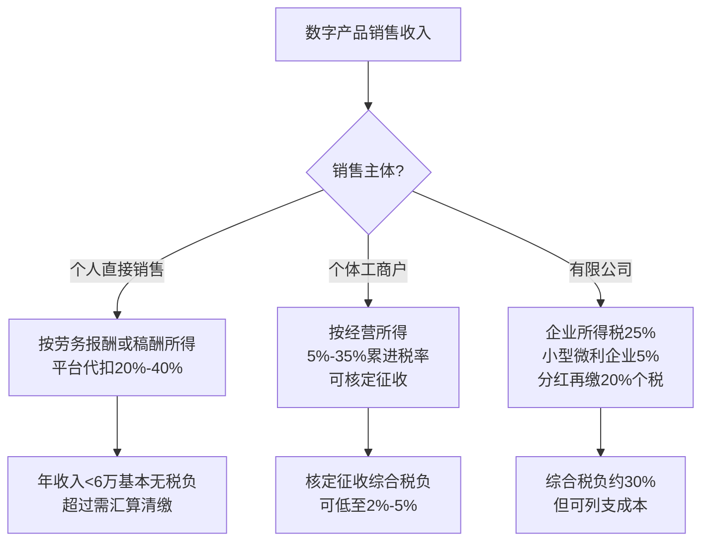
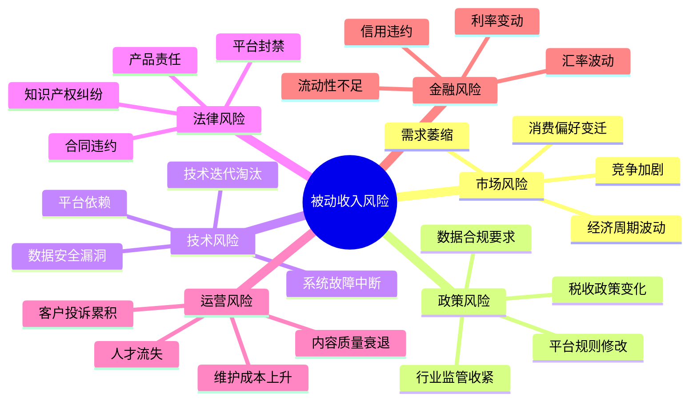
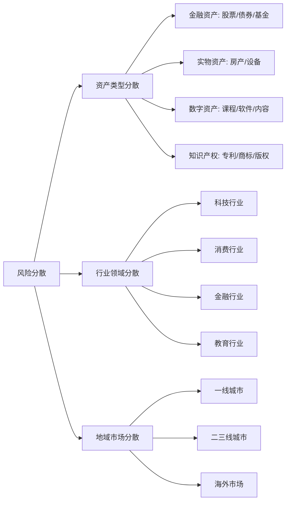
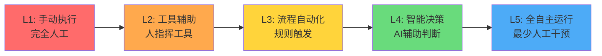
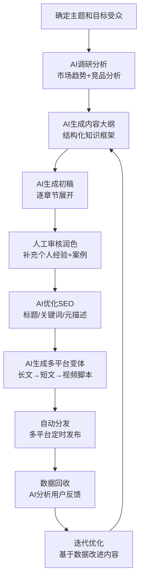
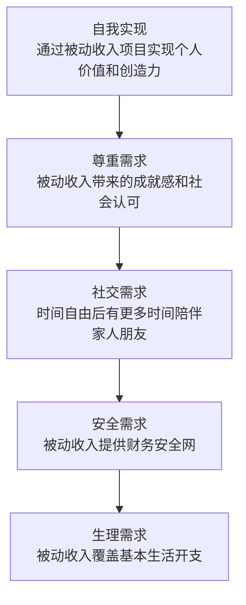
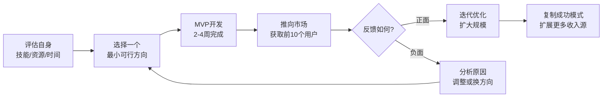

# 第21章 被动收入构建 — 深度拓展

本章从五个高级维度深化被动收入的构建能力：税务处理、风险管理、组合优化、自动化技术、心理建设。每个维度都遵循"道法术器"的逻辑——先理解底层原理，再掌握方法论，然后落到可执行的操作层面。

***

## 一、被动收入的税务处理

### 1.1 被动收入的税务分类框架

在中国税法框架下，被动收入并非一个统一的税法概念，而是分散在多个税目中。理解这些分类是合法节税的前提——选错税目，轻则多缴税，重则引发税务风险。

**利息、股息、红利所得**

个人从投资中获得的利息、股息和红利属于"利息、股息、红利所得"，适用20%的比例税率。但根据《个人所得税法》及相关优惠政策，从上市公司取得的股息红利享受差别化待遇：

| 持股期限 | 税务处理 | 实际税负 |
|---------|---------|---------|
| 超过1年 | 暂免征收个人所得税 | 0% |
| 1个月至1年 | 暂减按50%计入应纳税所得额 | 10% |
| 1个月以内 | 全额计入应纳税所得额 | 20% |

这一政策的深层意图是鼓励长期持有、抑制短线投机。对于被动收入构建者而言，**将持股周期拉长到1年以上是最基本的税务优化策略**。假设你持有某高股息蓝筹股，年股息率5%，持有1年以上享受免税，相当于你的实际收益率从4%（扣税后）提升到5%——这25%的差距在复利作用下会非常可观。

**财产租赁所得**

个人出租房屋、设备等财产取得的租金收入，适用20%的比例税率。但对个人出租住房取得的所得，暂减按10%的税率征收个人所得税。此外，还需要缴纳以下税费：

| 税种 | 税率 | 说明 |
|------|------|------|
| 增值税 | 5%征收率减按1.5% | 个人出租住房 |
| 房产税 | 4% | 个人出租住房优惠税率 |
| 城建税 | 增值税×7%/5%/1% | 取决于所在地区 |
| 教育费附加 | 增值税×3% | 与城建税同时缴纳 |
| 地方教育附加 | 增值税×2% | 与城建税同时缴纳 |
| 个人所得税 | 10% | 个人出租住房优惠税率 |

**特许权使用费所得**

个人提供专利权、商标权、著作权等无形资产使用权取得的收入，适用20%的比例税率。应纳税所得额 = 收入 × (1-20%)。需要特别注意：如果作者将文字作品手稿原件或复印件公开拍卖取得的所得，按"特许权使用费所得"纳税，而非"财产转让所得"。

**经营所得**

如果被动收入来源于个体工商户、个人独资企业或合伙企业的经营利润，则按"经营所得"缴纳个人所得税，适用5%-35%的超额累进税率：

| 全年应纳税所得额 | 税率 | 速算扣除数 |
|-----------------|------|-----------|
| 不超过30,000元 | 5% | 0 |
| 30,000-90,000元 | 10% | 1,500 |
| 90,000-300,000元 | 20% | 10,500 |
| 300,000-500,000元 | 30% | 40,500 |
| 超过500,000元 | 35% | 65,500 |

### 1.2 不同被动收入类型的具体税务处理

**房产租金收入的完整计算示例**

以月租金10,000元（含税）为例，逐步计算：

```text
第一步：不含税收入 = 10,000 ÷ (1+5%) = 9,523.81元
第二步：增值税 = 9,523.81 × 1.5% = 142.86元
第三步：城建税 = 142.86 × 7% = 10.00元（假设市区）
第四步：教育费附加 = 142.86 × 3% = 4.29元
第五步：地方教育附加 = 142.86 × 2% = 2.86元
第六步：房产税 = 9,523.81 × 4% = 380.95元
第七步：允许扣除的税费合计 = 142.86 + 10.00 + 4.29 + 2.86 + 380.95 = 540.96元
第八步：应纳税所得额 = (9,523.81 - 540.95 - 800) × (1-20%) = 6,546.29元
第九步：个人所得税 = 6,546.29 × 10% = 654.63元

每月税负合计 = 142.86 + 10.00 + 4.29 + 2.86 + 380.95 + 654.63 = 1,195.59元
综合税负率 ≈ 11.96%
```

**关键优化技巧**：如果出租多套房产，考虑设立个人独资企业统一管理，利用小规模纳税人增值税免征政策（月销售额10万以下免征增值税），并选择核定征收方式降低实际税负。

**数字产品销售收入的税务处理**

个人开发App、在线课程、设计模板等数字产品取得的收入，税务处理取决于销售模式：



**实操建议**：年收入10万以下的数字产品创作者，以个人名义销售即可，利用每年6万元的基本减除费用和专项附加扣除，实际税负可能为零。年收入10-50万区间，设立个人独资企业选择核定征收，综合税负可控制在3%-5%。年收入超过50万，建议设立有限公司，利用企业所得税优惠政策。

**股息红利收入的差异化处理**

| 来源类型 | 税务处理 | 实操要点 |
|---------|---------|---------|
| 非上市公司 | 20%全额纳税 | 分红前考虑再投资方案 |
| 上市公司 | 差别化（见1.1） | 持有超1年免税 |
| 公募基金分红 | 暂不征收个税 | 红利再投资免税 |
| 新三板公司 | 持股超1年免税 | 与上市公司同等待遇 |
| 合伙企业穿透 | 按合伙人各自税率 | 注意穿透税务处理 |

### 1.3 税务筹划的合法策略

**利用税收优惠政策**

国家层面的优惠政策不是"钻空子"，而是政策制定者主动引导的方向。合法利用这些政策是纳税人的权利：

- **科技型中小企业**：研发费用加计扣除比例100%
- **技术转让所得**：500万以下免征企业所得税，超过部分减半征收
- **小型微利企业**：年应纳税所得额300万以下，实际税率5%
- **增值税小规模纳税人**：月销售额10万以下免征增值税
- **个人养老金账户**：每年12,000元税前扣除

**选择合适的组织形式**

不同组织形式在被动收入场景下的税负差异巨大。以年利润50万元为例：

| 组织形式 | 税种及税率 | 大致综合税负 | 适用场景 |
|---------|-----------|-------------|---------|
| 个人（劳务报酬） | 个税20%-40% | 约25%-35% | 零散收入、试水阶段 |
| 个体工商户核定 | 个税核定约2%-5% | 约3%-6% | 中小规模、成本难核算 |
| 个人独资企业 | 个税经营所得5%-35% | 约10%-20% | 中等规模、有明确成本 |
| 有限公司 | 企税25%+分红20% | 约30%-35% | 大规模、需品牌形象 |
| 小型微利有限公司 | 企税5%+分红20% | 约24% | 年利润300万以下 |

**跨境被动收入的税务安排**

中国已与100多个国家和地区签订了避免双重征税协定（DTA）。对于涉及跨境的被动收入，需要重点关注：

- **税收协定优惠税率**：例如中-港股息预提税率为10%（低于国内法的20%）、利息预提税率为10%、特许权使用费预提税率7%-10%
- **饶让抵免**：部分协定包含饶让抵免条款，即使在来源国获得减免，在中国仍可按正常税率抵免
- **受控外国公司（CFC）规则**：如果在低税率地区设立公司但不分配利润，中国税务机关有权视同分配并征税

### 1.4 税务合规与风险防控

**金税四期下的合规要求**

金税四期系统实现了"以数治税"，大数据分析能力让税务机关能够交叉比对银行流水、社保数据、电商平台数据、不动产登记信息等多维数据。对于被动收入者，需要特别注意：

1. **银行流水与申报收入匹配**：频繁的大额进账但没有对应的纳税申报记录，会被系统自动标记
2. **电商平台数据对接**：淘宝、拼多多等平台已与税务系统打通，店铺收入完全透明
3. **房产租赁信息共享**：不动产登记信息与租赁备案数据逐步打通
4. **跨境收入监控**：CRS（共同申报准则）使得海外金融账户信息自动交换

**合规操作清单**

- 每项被动收入来源都建立独立的收入台账
- 保留所有交易凭证、合同、发票至少5年
- 有多项被动收入时，年度终了后及时办理综合所得汇算清缴
- 年收入超过12万元，即使已足额缴税，也建议自行申报
- 涉及跨境收入，主动申报海外收入，避免被认定为逃税

***

## 二、被动收入的风险管理

### 2.1 风险全景图

被动收入面临的风险并非单一维度，而是一个多层次、相互关联的风险网络。理解这个网络的结构，才能做到系统性的风险管理。



**市场风险深度分析**

市场风险是最常见也最容易被低估的风险。以在线课程为例，2020年疫情期间在线教育需求爆发，但2021年"双减"政策出台后，K12在线教育市场几乎瞬间崩塌。这不是黑天鹅事件，而是政策风险叠加市场风险的典型案例。

应对市场风险的核心策略是**趋势感知**——不是预测未来，而是提前感知变化的信号：
- 关注行业头部企业的战略转向（如果巨头在撤退，你也要考虑）
- 监测用户行为数据的变化趋势（留存率、活跃度、付费意愿）
- 跟踪政策制定者的公开表态和立法动态
- 建立行业信息网络，与同行保持信息交流

**政策风险实操应对**

政策风险的特点是影响面广、来得突然、个体难以左右。但可以做的是：

1. **政策敏感度训练**：定期关注国务院、各部委官网的政策公告，订阅行业政策解读类公众号
2. **合规先行**：在政策收紧之前就主动合规，这样政策变化时影响最小
3. **业务弹性设计**：确保业务模式在不同政策环境下都有调整空间
4. **政策储备金**：预留3-6个月的运营资金，应对政策过渡期的收入中断

### 2.2 风险识别与评估的实操方法

**风险矩阵法（Risk Matrix）**

这是最实用的风险评估工具。操作步骤如下：

第一步：列出所有可能的风险事件
第二步：评估每个风险的发生概率（1-5分）
第三步：评估每个风险的影响程度（1-5分）
第四步：计算风险值 = 概率 × 影响
第五步：按风险值排序，优先处理高风险项

示例——一个在线课程项目的风評矩阵：

| 风险事件 | 概率(1-5) | 影响(1-5) | 风险值 | 优先级 | 应对策略 |
|---------|-----------|-----------|--------|--------|---------|
| 平台抽成比例提高 | 4 | 3 | 12 | 高 | 多平台分发，建立私域 |
| 同类课程竞争加剧 | 5 | 3 | 15 | 高 | 持续更新内容，差异化定位 |
| 政策要求持证经营 | 3 | 5 | 15 | 高 | 提前了解资质要求 |
| 平台技术故障 | 2 | 2 | 4 | 低 | 多平台备份 |
| 个人精力不足 | 3 | 4 | 12 | 高 | 逐步外包非核心环节 |
| 内容被盗版 | 4 | 2 | 8 | 中 | 加水印，法律声明 |

**压力测试法**

模拟极端场景，检验被动收入系统的承压能力：
- **收入减半测试**：如果被动收入突然减少50%，你的财务状况能支撑多久？
- **单点故障测试**：如果最大的收入来源突然消失，其他来源能否覆盖基本生活开支？
- **成本激增测试**：如果运营成本翻倍（如平台佣金提高、广告费上涨），项目是否还能盈利？
- **流动性测试**：如果需要在30天内变现所有被动收入资产，能收回多少比例？

### 2.3 风险应对的实战策略

**风险分散的三重维度**

真正的风险分散不是"多买几只股票"那么简单，需要在三个维度同时分散：



**具体操作指南**：
- 至少拥有3种不同类型的被动收入来源
- 单一来源的收入占比不超过总收入的40%
- 至少有1种收入来源与经济周期负相关（如债券利息在股市下跌时表现稳定）
- 至少有1种收入来源不受中国政策直接影响（如海外平台的数字产品收入）

**应急预案模板**

为每个主要被动收入来源制定应急预案：

```text
被动收入应急预案
━━━━━━━━━━━━━━━━━━
收入来源：[名称]
当前月均收入：[金额]
风险触发条件：[什么情况下启动应急]
━━━━━━━━━━━━━━━━━━
应急措施（按优先级排列）：
1. [最快速的止损措施]
2. [收入替代方案]
3. [资产变现方案]

应急资金需求：[金额]
启动时限：[触发后X天内必须行动]
负责人/执行人：[姓名]
━━━━━━━━━━━━━━━━━━
定期检查：每[季度]评估一次预案有效性
```

### 2.4 被动收入的法律防护

**知识产权保护**

对于数字产品、内容创作类被动收入，知识产权是最核心的资产：

1. **著作权登记**：在中国版权保护中心进行作品登记，费用约300元/件，登记后在维权时无需证明权属
2. **商标注册**：如果建立了品牌，及时注册商标，第35类（广告销售）和第41类（教育娱乐）是被动收入领域的核心类别
3. **专利申请**：如果有技术创新，申请发明专利（保护期20年）或实用新型专利（保护期10年）
4. **商业秘密保护**：对于无法申请专利的技术诀窍（如定价算法、用户运营方法论），建立商业秘密保护体系

**合同风险管理**

被动收入涉及大量合同关系（平台合作协议、客户购买协议、外包服务协议等），需要特别注意：

- **平台协议的"坑"**：仔细阅读平台的用户协议和创作者协议，特别关注收益分成条款、内容所有权条款、独家排他条款、单方面修改权条款
- **客户协议的标准化**：建立标准化的产品销售协议模板，明确服务范围、退款政策、免责声明
- **外包合同的约束力**：与外包人员签订保密协议（NDA）和知识产权归属协议，确保外包成果的知识产权归你所有

***

## 三、被动收入组合优化

### 3.1 组合构建的核心原则

构建被动收入组合不是简单地"多搞几个收入来源"，而是像配置投资组合一样，有策略地选择和配比不同类型的被动收入，使得整体组合在收益性、稳定性、成长性之间达到最优平衡。

**四大构建原则**

| 原则 | 含义 | 实操标准 |
|------|------|---------|
| 多元化 | 不同类型、行业、地域 | 至少3种收入类型，单一类型占比<40% |
| 互补性 | 收入来源之间低相关性 | 经济下行时至少有1种收入逆势增长 |
| 流动性 | 保持一定比例的可快速变现资产 | 流动性资产占比>30% |
| 可持续性 | 优先选择长期稳定的收入源 | 避免依赖单一平台或单一热点 |

**收入来源的相关性分析**

这是组合优化的核心。你需要理解不同被动收入来源在不同经济环境下的表现：

| 经济环境 | 股息收入 | 房租收入 | 课程收入 | 债券利息 | 数字产品 |
|---------|---------|---------|---------|---------|---------|
| 经济扩张 | ↑↑↑ | ↑↑ | ↑ | → | ↑↑ |
| 经济衰退 | ↓↓ | ↓→ | ↑↑ | ↑ | ↓→ |
| 通货膨胀 | ↑ | ↑↑ | → | ↓↓ | → |
| 利率上升 | ↓ | ↓↓ | → | ↑ | → |
| 技术革命 | ↑↑ | → | ↓↑ | → | ↑↑↑ |

关键发现：**课程收入与股息收入呈弱负相关**——经济不好时人们更愿意学习充电，经济好时股市表现更好。这种组合天然具有对冲效果。

### 3.2 现代组合理论在被动收入中的应用

**有效边界概念**

现代投资组合理论（MPT，马科维茨1952年提出）的核心思想同样适用于被动收入组合：通过优化不同收入来源的配比，可以在给定风险水平下获得最大收益，或在给定收益水平下承受最小风险。

```text
预期收益
    ↑
    │        ★ 最优组合
    │      /  ·  ·  ·
    │    / · 有效边界
    │   /·
    │  /·
    │ /·
    │/·
    └──────────────→ 风险
```

**实操简化方法**

精确计算有效边界需要大量数据和复杂计算，但可以用简化方法：

1. **列出你的被动收入来源**及其历史月收入数据（至少12个月）
2. **计算每种来源的**：平均月收入、收入标准差（波动性）
3. **计算任意两种来源之间的相关系数**：用Excel的=CORREL()函数
4. **尝试不同配比**，找到整体波动最小的组合（即方差最小化）
5. **在最小方差组合附近**，选择收益更高的配比作为最终方案

**风险平价策略**

传统的资金配比（如60%股票+40%债券）可能导致风险高度集中在某一资产上。风险平价策略的思想是：**让每个收入来源对整体组合风险的贡献大致相等**。

简单操作方法：
1. 计算每个收入来源的历史波动率（月收入标准差）
2. 波动率高的来源分配较少资金，波动率低的来源分配较多资金
3. 确保每种来源的"资金占比 × 波动率"大致相等

示例：假设三种被动收入来源的月波动率分别为20%、10%、5%
- 风险平价配比 ≈ 1/20 : 1/10 : 1/5 = 1 : 2 : 4
- 即：高波动来源占14%，中波动来源占29%，低波动来源占57%

### 3.3 不同人生阶段的组合建议

被动收入组合不是一成不变的，需要随着人生阶段、风险承受能力、财务目标的变化而动态调整。

**积累期（22-30岁）**

此阶段特征：时间充裕、风险承受能力高、本金少、学习能力强。

```text
推荐组合配比：
├── 指数基金定投（35%）——长期复利，利用时间优势
├── 数字产品开发（30%）——发挥技术优势，边际成本为零
├── 内容创作/自媒体（25%）——积累个人品牌，未来可变现
└── 货币基金/存款（5%）——应急储备
```

核心策略：**用时间换资产**。这个阶段最宝贵的资产是时间和学习能力，应该把主要精力投入到技能提升和资产积累上，而不是追求眼前的现金收入。

**加速期（30-40岁）**

此阶段特征：收入快速增长、开始有资本积累、家庭责任增加、时间变得稀缺。

```text
推荐组合配比：
├── 股票股息收入（25%）——选择高股息蓝筹，长期持有
├── 房产租金收入（25%）——利用杠杆，稳定的现金流
├── 数字产品收入（20%）——已有积累的产品持续产生收入
├── 债券/固收（15%）——降低组合波动
├── 内容资产（10%）——已有内容持续产生长尾收益
└── 现金储备（5%）——应急
```

核心策略：**用资本换现金流**。利用前一阶段积累的资金和技能，开始构建更多资本密集型的被动收入来源。

**稳健期（40-50岁）**

此阶段特征：风险承受能力下降、资产规模较大、需要稳定现金流、开始考虑传承。

```text
推荐组合配比：
├── 债券利息（25%）——稳定收益，低波动
├── 房产租金收入（25%）——成熟物业，稳定现金流
├── 股票股息收入（20%）——高股息策略，防御性配置
├── 数字产品/内容资产（15%）——持续维护，低边际成本
├── 保险年金（10%）——锁定长期稳定收益
└── 现金及等价物（5%）——应急
```

核心策略：**稳定为王**。降低组合波动，确保被动收入能够覆盖生活开支，减少对主动收入的依赖。

**收获期（50岁以上）**

此阶段特征：以保本为主、需要稳定现金流支持退休生活、考虑资产传承。

```text
推荐组合配比：
├── 债券/固收（30%）——核心稳定器
├── 房产租金收入（25%）——选择性持有优质物业
├── 高股息股票（20%）——红利再投资
├── 保险年金（15%）——终身现金流保障
└── 现金及等价物（10%）——应急和日常开支
```

核心策略：**现金流覆盖生活**。被动收入的目标是完全覆盖生活开支，实现真正的财务自由。

### 3.4 组合绩效评估与再平衡

**四大评估指标**

| 指标 | 计算方法 | 健康标准 | 评估频率 |
|------|---------|---------|---------|
| 组合收益率 | 总被动收入 ÷ 总投入资产 | > 通货膨胀率 + 3% | 每季度 |
| 收入波动率 | 月收入标准差 ÷ 平均月收入 | < 30% | 每季度 |
| 最大回撤 | 最大累计收入下降幅度 | < 50% | 每半年 |
| 收入覆盖比 | 被动收入 ÷ 生活开支 | > 1.0（财务自由） | 每月 |

**再平衡操作指南**

当以下任一条件触发时，需要进行组合再平衡：
- 某类收入来源的占比偏离目标配置超过10个百分点
- 市场环境发生重大变化（如利率大幅变动、政策调整）
- 个人生活阶段发生转变（如结婚、生子、换工作）
- 连续两个季度组合收益低于预期

再平衡的具体操作：
1. 评估当前各类收入的实际占比
2. 计算与目标配置的偏差
3. 决定调整方向：增加低配类别的投入，减少超配类别的投入
4. 考虑税务影响：卖出资产可能产生税负
5. 分步执行：不要一次性大幅调整，分2-3次完成

***

## 四、自动化技术在被动收入中的应用

### 4.1 自动化的本质与层次

自动化不是简单地"用机器代替人"，而是按照复杂度和自主性分为五个层次：



被动收入的理想状态是达到L4-L5层次。但从L1直接跳到L5是不现实的，需要逐步演进。

**各层次的实际案例**（以在线课程为例）：

| 层次 | 课程制作 | 课程销售 | 客户服务 | 收入管理 |
|------|---------|---------|---------|---------|
| L1 手动 | 自己录制剪辑 | 自己推广 | 自己回复 | 自己记账 |
| L2 工具辅助 | 用剪映/Premiere | 用CRM管理客户 | 用模板回复 | 用Excel记录 |
| L3 流程自动化 | 预设模板批量生成 | 邮件自动序列 | 聊天机器人初步筛选 | 自动对账脚本 |
| L4 智能决策 | AI辅助内容生产 | 智能定价系统 | AI客服+人工兜底 | 智能报表+预警 |
| L5 全自主 | AI生成+人工审核 | 全自动销售漏斗 | 自动处理90%+ | 自动投资+再平衡 |

### 4.2 各被动收入类型的自动化方案

**内容创作的自动化栈**

```text
内容创作自动化技术栈
━━━━━━━━━━━━━━━━━━━━━━━
选题层：    Google Trends + 5118热词 + AI选题助手
        ↓
创作层：    ChatGPT/Claude（初稿）→ 人工润色 → AI查重
        ↓
制作层：    Canva（图文）+ 剪映（视频）+ PPT（课件）
        ↓
分发层：    Buffer/Hootsuite（多平台定时发布）
        ↓
分析层：    Google Analytics + 各平台数据后台
        ↓
优化层：    A/B测试标题/封面 → 数据驱动迭代
━━━━━━━━━━━━━━━━━━━━━━━
```

**具体工具配置示例——自动化内容分发**：

```python
# 使用 Python + 各平台API 实现内容自动分发
# 这是一个概念示例，展示自动化分发的逻辑

import schedule
import time
from datetime import datetime

class ContentDistributor:
    """自动内容分发系统"""
    
    def __init__(self):
        self.platforms = {
            'weixin': WeixinPublisher(),     # 微信公众号
            'zhihu': ZhihuPublisher(),       # 知乎
            'bilibili': BilibiliPublisher(), # B站
            'xiaohongshu': XHSPublisher(),   # 小红书
        }
        self.schedule_config = {
            'weixin': {'time': '08:00', 'format': 'article'},
            'zhihu': {'time': '10:00', 'format': 'article'},
            'bilibili': {'time': '18:00', 'format': 'video'},
            'xiaohongshu': {'time': '12:00', 'format': 'note'},
        }
    
    def create_content(self, topic):
        """AI辅助内容创作"""
        # 第一步：AI生成初稿
        draft = ai_writer.generate(topic, style='professional')
        # 第二步：人工审核和润色（可选）
        final = human_review(draft) if need_review else draft
        # 第三步：适配各平台格式
        for platform, config in self.schedule_config.items():
            adapted = self.adapt_format(final, config['format'])
            self.schedule_publish(platform, adapted, config['time'])
        return True
    
    def adapt_format(self, content, target_format):
        """根据平台特性自动适配内容格式"""
        adapters = {
            'article': ArticleAdapter(),  # 长文格式
            'video': VideoAdapter(),      # 视频脚本格式
            'note': NoteAdapter(),        # 图文笔记格式
        }
        return adapters[target_format].convert(content)
    
    def schedule_publish(self, platform, content, publish_time):
        """定时发布"""
        schedule.every().day.at(publish_time).do(
            self.platforms[platform].publish, content
        )
```

**电商被动收入的自动化流程**

```text
电商自动化全链路
━━━━━━━━━━━━━━━━━━━━━━━━━━━━━━
选品阶段：
  数据工具（生意参谋/蝉妈妈）→ 热门品类分析 → AI推荐选品
        ↓
采购阶段：
  1688自动比价 → 供应商评估矩阵 → 自动下单
        ↓
上架阶段：
  AI生成商品标题/描述 → 自动批量上架 → 多平台同步
        ↓
运营阶段：
  自动定价（参考竞品动态调价）→ 智能广告投放 → 库存预警补货
        ↓
客服阶段：
  AI客服处理80%常见问题 → 复杂问题转人工 → 自动生成FAQ
        ↓
财务阶段：
  自动对账 → 利润计算 → 税务申报辅助
━━━━━━━━━━━━━━━━━━━━━━━━━━━━━━
```

**房产租赁的智能家居自动化**

| 功能 | 实现方案 | 预估成本 | 节省的人工时间 |
|------|---------|---------|-------------|
| 智能门锁 | 小米/凯迪仕指纹锁 | 800-2000元/套 | 每次入住退房30分钟 |
| 远程抄表 | 智能水电气表 | 500-1500元/套 | 每月每户2小时 |
| 自动收租 | 微信/支付宝自动扣款 | 0元（功能免费） | 每月催租时间 |
| 维修派单 | 物业系统+微信工单 | 200-500元/月 | 维修协调时间 |
| 智能监控 | 摄像头+异常报警 | 300-800元/套 | 安全巡检时间 |
| 租客筛选 | 自动化背景调查 | 50-100元/次 | 看房筛选时间 |

**投资的量化自动化**

对于股息投资组合，可以构建简单的自动化再平衡系统：

```python
# 股息投资组合自动再平衡逻辑（概念示例）

import pandas as pd

class DividendPortfolioRebalancer:
    """股息组合自动再平衡"""
    
    def __init__(self, target_allocation: dict):
        """
        target_allocation: 目标配置比例
        例: {'沪深300ETF': 0.30, '中证红利ETF': 0.30, 
              '国债ETF': 0.20, '货币基金': 0.20}
        """
        self.target = target_allocation
        self.rebalance_threshold = 0.05  # 偏离5%触发再平衡
    
    def check_rebalance(self, current_values: dict) -> dict:
        """检查是否需要再平衡"""
        total = sum(current_values.values())
        current_alloc = {k: v/total for k, v in current_values.items()}
        
        actions = {}
        for asset, target_pct in self.target.items():
            current_pct = current_alloc.get(asset, 0)
            deviation = current_pct - target_pct
            
            if abs(deviation) > self.rebalance_threshold:
                action = '买' if deviation < 0 else '卖'
                amount = abs(deviation) * total
                actions[asset] = {
                    'action': action,
                    'amount': round(amount, 2),
                    'deviation': f'{deviation:+.1%}'
                }
        
        return actions if actions else None  # None表示无需调整
    
    def generate_trade_report(self, actions: dict) -> str:
        """生成交易指令报告"""
        report = "再平衡交易指令\n" + "="*40 + "\n"
        for asset, detail in actions.items():
            report += f"{asset}: {detail['action']} {detail['amount']}元"
            report += f"（偏离{detail['deviation']}）\n"
        return report
```

### 4.3 AI在被动收入中的深度应用

2024-2026年，AI技术（特别是大语言模型）已经从"辅助工具"进化为"协作伙伴"，在被动收入的多个环节发挥着关键作用。

**AI辅助内容创作的完整工作流**



**AI在不同被动收入场景中的应用成熟度**

| 应用场景 | AI成熟度 | 人工干预比例 | 推荐工具 |
|---------|---------|-------------|---------|
| 文章/博客写作 | 高 | 20-30% | ChatGPT、Claude、文心一言 |
| 电子书/课程脚本 | 中高 | 30-40% | ChatGPT + Claude |
| 图片/封面设计 | 高 | 10-20% | Midjourney、DALL·E、即梦 |
| 短视频制作 | 中 | 40-50% | 剪映AI、可灵 |
| 编程/技术文档 | 高 | 15-25% | Cursor、Claude Code |
| 数据分析报告 | 高 | 10-20% | ChatGPT Code Interpreter |
| 客户服务 | 中高 | 20-30% | Coze、Dify搭建AI客服 |
| 翻译/本地化 | 高 | 10-15% | DeepL、ChatGPT |

**构建AI驱动的被动收入系统**

以一个知识付费系统为例，展示AI如何深度嵌入全流程：

```text
AI驱动的知识付费系统架构
━━━━━━━━━━━━━━━━━━━━━━━━━━━━
前端获客层：
  AI生成SEO内容 → 搜索引擎自然流量
  AI生成短视频脚本 → 短视频平台流量
  AI优化广告投放 → 精准付费流量
        ↓
转化销售层：
  AI销售文案生成 → 高转化落地页
  AI个性化推荐 → 基于用户画像匹配课程
  AI自动化邮件序列 → 培育潜在客户
        ↓
内容交付层：
  AI辅助课程更新 → 内容保持时效性
  AI生成练习题/测验 → 自动化学习评估
  AI生成学习路径 → 个性化学习体验
        ↓
客户服务层：
  AI客服处理常见问题 → 7×24小时响应
  AI分析用户反馈 → 产品持续改进
  AI预警流失风险 → 主动挽留高价值用户
        ↓
运营分析层：
  AI生成运营报表 → 关键指标可视化
  AI预测收入趋势 → 提前规划资源
  AI识别增长机会 → 数据驱动决策
━━━━━━━━━━━━━━━━━━━━━━━━━━━━
```

### 4.4 自动化的成本效益分析

**自动化投入的计算框架**

在决定是否自动化某个环节时，需要进行严格的成本效益分析：

```text
自动化ROI = (节省的人工成本 + 带来的额外收入 - 自动化总成本) ÷ 自动化总成本 × 100%

其中：
- 节省的人工成本 = 人工时薪 × 每月节省小时数 × 12
- 带来的额外收入 = 因自动化而新增的月收入 × 12
- 自动化总成本 = 工具订阅费 + 初始设置成本 + 维护成本 + 学习成本
```

**常见自动化场景的ROI估算**

| 自动化场景 | 年投入成本 | 年节省人工 | 年增收 | ROI |
|-----------|-----------|-----------|--------|-----|
| 内容自动分发 | 2,000元 | 120小时 | — | 300%+ |
| AI客服系统 | 5,000元 | 500小时 | 提升转化10% | 500%+ |
| 电商自动定价 | 3,000元 | 60小时 | 提升利润5% | 400%+ |
| 投资自动再平衡 | 500元 | 24小时 | 提升收益1-2% | 1000%+ |
| 智能房产管理 | 8,000元 | 200小时 | — | 200%+ |

**关键原则**：优先自动化高频、重复、规则明确的环节。每次自动化决策前问三个问题：
1. 这个任务每月重复几次？（频率）
2. 每次需要多少时间？（时间成本）
3. 自动化后出错的后果有多严重？（风险评估）

如果频率 ≥ 4次/月，时间 ≥ 2小时/次，出错后果可控，则强烈建议自动化。

***

## 五、被动收入的心理建设

### 5.1 被动收入构建中的心理障碍

构建被动收入的最大障碍往往不是技术、资金或资源，而是心理层面的阻碍。理解这些心理机制，才能有针对性地突破。

**即时满足偏好（Present Bias）**

人类大脑天生倾向于选择即时的小奖励，而非延迟的大奖励。这在神经科学上有明确的解释——大脑的多巴胺系统对即时奖励的反应远强于对延迟奖励的反应。

在被动收入场景中的典型表现：
- "写书太慢了，不如先去做个能快速赚钱的兼职"
- "课程已经做了3个月还没什么收入，不如放弃"
- "每天维护内容太枯燥，不如去追个热点"

**突破方法**：
1. **设置即时反馈环**：将大目标拆解为每日可完成的小任务，每完成一个就记录下来。这种"打勾"的感觉能激活多巴胺系统
2. **建立"未来自我"连接**：研究显示，当人们看到自己未来的样子（通过AI模拟老化照片），更愿意为未来储蓄。定期想象未来的自己因为今天的努力而受益
3. **设置阶段性奖励**：每完成一个里程碑（如课程上线、第一笔收入），给自己一个具体的奖励

**损失厌恶（Loss Aversion）**

卡尼曼和特沃斯基的前景理论指出：人们对损失的敏感度约为收益的2.5倍。在被动收入构建中，这种心理表现为：

- "投入了3个月时间做课程，如果卖不出去怎么办？"——把已投入的时间视为"沉没成本"而非"投资"
- "花5000元买设备拍视频，万一亏了呢？"——过度关注可能的损失，忽略潜在收益
- "已经有稳定的工资收入，何必冒风险做副业？"——安于现状，恐惧改变

**突破方法**：
1. **预设最坏情况**：在开始之前就问自己"如果最坏的情况发生，我能承受吗？"如果答案是"能"，那就大胆去做
2. **分阶段投入**：不要一次性投入大量资金，而是分阶段、小步投入。这样即使失败，损失也在可控范围内
3. **重新定义损失**：将"失败"重新定义为"学费"。每次失败都是一次学习，这些经验的价值可能超过金钱投入

**完美主义陷阱**

完美主义者在被动收入构建中的典型表现：
- "这个课程大纲还不够完美，再改改"
- "等我技术再提升一些再开始写书"
- "这个App的功能还不够全面，不能上线"

完美主义的本质是**恐惧失败的伪装**——通过追求"完美"来避免被评判。但在被动收入领域，"完成"远比"完美"重要。

**突破方法**：
1. **MVP思维（最小可行产品）**：先做出一个能用的版本，推向市场，根据反馈迭代
2. **设置截止日期**：给每个项目设置硬性的发布日期，到了日期就必须发布，不管"完美"与否
3. **接受"够好"标准**：定义"够好"的具体标准，达到标准就停止打磨，开始下一个环节

### 5.2 建立被动收入思维模式

**从"时间换钱"到"系统赚钱"的思维转变**

```text
主动收入思维                    被动收入思维
━━━━━━━━━━━━━━━━━━━━         ━━━━━━━━━━━━━━━━━━━━
我今天能赚多少？              我今天能建立什么系统？
赚钱需要我持续投入            赚钱是系统自动运行的结果
我的时间=我的收入             我的系统=我的收入
停止工作=停止收入             停止工作≠停止收入
追求更高时薪                  追求更多收入来源
一个人单打独斗                借助技术/工具/团队
线性增长                      指数增长
```

**资产思维**

被动收入的核心是**构建能持续产生收入的资产**，而非出售自己的时间。你需要学会区分：

| 资产类型 | 具体例子 | 价值特征 |
|---------|---------|---------|
| 内容资产 | 电子书、课程、博客文章 | 一次创作，反复变现 |
| 技术资产 | 软件、App、自动化脚本 | 开发一次，持续产生收入 |
| 品牌资产 | 个人IP、社群影响力 | 随时间增值 |
| 金融资产 | 股票、债券、基金 | 资本增值+分红 |
| 实物资产 | 房产、设备 | 租金+增值 |
| 关系资产 | 人脉网络、合作伙伴 | 信息+机会 |

**复利思维**

爱因斯坦（据传）说过："复利是世界第八大奇迹。"在被动收入领域，复利不仅体现在金钱上，更体现在时间、知识和影响力上。

```text
复利效应的三种形式：
━━━━━━━━━━━━━━━━━━━━━━━━
金钱复利：
  本金 → 利息 → 利息的利息 → ...
  每月投资2000元，年化8%，30年后 ≈ 298万元

知识复利：
  学习 → 输出内容 → 获得反馈 → 更深入学习 → ...
  每篇文章都在前一篇的基础上更深入，读者也在积累

影响力复利：
  粉丝 → 口碑传播 → 更多粉丝 → 更大影响力 → ...
  1000个铁杆粉丝就能支撑一个创作者的被动收入
━━━━━━━━━━━━━━━━━━━━━━━━
```

### 5.3 动机维持系统

被动收入项目最大的敌人是"中途放弃"。据统计，超过70%的副业/被动收入项目在启动6个月内被放弃。建立一个有效的动机维持系统至关重要。

**SMART目标分解法**

以"建立月入1万元的被动收入"为例：

```text
年度目标（Specific + Measurable）：
  12个月内，被动收入达到每月10,000元

季度里程碑（Achievable + Time-bound）：
  Q1：完成第一个数字产品上线，月收入0-1,000元
  Q2：优化产品+启动第二个收入来源，月收入1,000-3,000元
  Q3：两个来源稳定+启动第三个，月收入3,000-6,000元
  Q4：三个来源协同+优化，月收入6,000-10,000元

月度任务（Relevant + Actionable）：
  每月完成：内容创作X篇/产品迭代X次/营销推广X次

每周检查点：
  周日晚复盘本周完成情况，调整下周计划

每日行动：
  每天至少投入2小时在被动收入项目上
```

**社会支持系统**

孤独是坚持的最大敌人。建立社会支持系统的方法：

1. **加入被动收入社群**：在知识星球、微信群、Discord找到同频的人
2. **找一个Accountability Partner（责任伙伴）**：每周互相汇报进度，互相督促
3. **公开展示进度**：在社交媒体上分享你的被动收入建设进度，公众承诺增加执行力
4. **找导师或榜样**：找到已经在被动收入领域取得成果的人，学习他们的路径

**习惯叠加法**

将被动收入的日常工作嵌入到已有习惯中：

```text
习惯叠加公式：在[已有习惯]之后，我会[被动收入行动]

示例：
  早上喝完咖啡后 → 写30分钟课程内容
  午休前10分钟 → 检查各平台数据
  晚饭后散步时 → 用语音记录内容灵感
  睡前30分钟 → 阅读行业资讯，积累选题
```

### 5.4 应对挫折的心理工具

**认知行为疗法（CBT）的三栏法**

当遇到挫折时，用三栏法重构认知：

```text
事件 | 自动化思维 | 理性重构
━━━━━|━━━━━━━━━━━|━━━━━━━━━
课程上  | "完了，这个方向      | "第一批用户反馈就是
线一个  | 没人买单，白做了     | 最宝贵的市场信号。
月只有  | 3个月。"            | 分析他们为什么不买，
2个购   |                     | 是定价问题、内容问
买      |                     | 题还是推广问题？"
━━━━━|━━━━━━━━━━━|━━━━━━━━━
被平台  | "太不公平了，我的    | "平台规则变化是所有
修改了  | 收入要断了，这下      | 创作者共同面对的挑
推荐规  | 完蛋了。"            | 战。先评估影响程度，
则      |                     | 再制定应对策略。这
        |                     | 也是建立私域流量的
        |                     | 警示信号。"
━━━━━|━━━━━━━━━━━|━━━━━━━━━
```

**成长型心态 vs 固定型心态**

| 场景 | 固定型心态 | 成长型心态 |
|------|-----------|-----------|
| 产品卖不动 | "我不适合做这个" | "我需要更了解市场需求" |
| 被客户差评 | "我做的东西不行" | "差评是最好的改进指南" |
| 竞争对手做得好 | "人家有天赋/资源" | "我可以学习他的方法" |
| 技术学不会 | "我太笨了" | "我只是还没找到正确的学习方式" |
| 项目失败了 | "我就是个失败者" | "这次学到了什么？下次怎么避免？" |

**情绪能量管理**

被动收入构建是一场马拉松，不是短跑。管理好情绪能量才能持久：

1. **识别情绪周期**：每个人都有高能量和低能量的时段。把创造性工作（写内容、设计产品）安排在高能量时段，把重复性工作（数据录入、格式调整）安排在低能量时段
2. **设置"充电"活动**：定期做能恢复能量的事情——运动、阅读、社交、旅行
3. **庆祝小胜利**：每完成一个小目标就庆祝一下，不要等到"大成功"才允许自己开心
4. **接受"低谷期"**：每个人的精力和动力都有波动，低谷期是正常的。低谷期做简单任务，高峰期做重要任务

### 5.5 被动收入与人生意义

**财务自由的真正含义**

很多人把财务自由理解为"有花不完的钱"，但真正的财务自由是：

```text
财务自由 = 被动收入 ≥ 生活开支 + 安全边际

其中：
- 被动收入：不需要你投入时间就能持续获得的收入
- 生活开支：维持你满意的生活方式所需的全部开支
- 安全边际：通常为生活开支的20%-50%，用于应对不确定性
```

当这个等式成立时，你获得了**选择的自由**——你可以选择继续工作（因为喜欢），也可以选择不工作（因为不需要）。这种选择权，才是财务自由最核心的价值。

**被动收入与马斯洛需求层次**



被动收入不仅仅是一个财务目标，它本质上是一种**生活方式的选择**——选择用系统替代时间，用资产替代劳动，用自由替代束缚。

**构建"有意义的被动收入"**

最高层次的被动收入，是那种既能产生收入、又能创造社会价值的项目。问自己三个问题：
1. 我的被动收入产品/服务，解决了什么人的问题？
2. 如果我的被动收入项目消失了，会有人感到遗憾吗？
3. 即使不赚钱，我是否仍然愿意做这件事？

如果三个问题的答案都是积极的，说明你找到了"有意义的被动收入"——它不仅养活你，还滋养你。

***

## 六、被动收入的长期演进路线图

### 6.1 从零到一：第一笔被动收入

大多数人卡在这一步。他们有想法、有动力，但不知道从哪里开始。以下是经过验证的最小化启动路径：



**第一笔被动收入的推荐路径（按难度排序）**

| 难度 | 路径 | 启动时间 | 首笔收入时间 | 初始投入 |
|------|------|---------|-------------|---------|
| ★ | 闲鱼/二手平台卖闲置 | 1天 | 1-7天 | 0元 |
| ★★ | 股票/基金投资分红 | 1天 | 1-3个月 | 1,000元+ |
| ★★ | 自媒体内容创作 | 1-2周 | 1-3个月 | 0元 |
| ★★★ | 电子书/模板销售 | 2-4周 | 1-2个月 | 0-500元 |
| ★★★ | 在线课程 | 1-3个月 | 2-4个月 | 500-2,000元 |
| ★★★★ | 小程序/工具开发 | 1-3个月 | 2-6个月 | 0-5,000元 |
| ★★★★ | 电商一件代发 | 1-2周 | 1-3个月 | 1,000-5,000元 |
| ★★★★★ | 房产投资出租 | 3-6个月 | 立即 | 50万+ |

### 6.2 从一到多：构建收入矩阵

当第一个被动收入来源稳定后（月入3,000元以上），开始构建收入矩阵：

**收入矩阵构建原则**：
1. 新增收入来源应该与现有来源有**协同效应**（如课程+电子书+社群）
2. 每个新来源的启动成本不超过月被动收入的50%
3. 同一时间最多启动1个新来源
4. 新来源成熟后再启动下一个（通常需要3-6个月）

**理想的被动收入矩阵示例**（知识创作者）：

```text
核心收入（占60%）：
  └── 在线课程（系统性课程产品）

辅助收入（占25%）：
  ├── 电子书（课程的衍生产品）
  ├── 付费社群（深度互动和答疑）
  └── 模板/工具（配套实用资源）

长尾收入（占15%）：
  ├── 联盟营销（推荐相关产品）
  ├── 广告收入（内容平台分成）
  └── 咨询/教练（高端1对1服务）
```

### 6.3 从多到优：系统化运营

当被动收入矩阵建立后，重点从"扩展"转向"优化"：

1. **数据驱动决策**：建立完整的数据看板，追踪每个收入来源的关键指标
2. **自动化运营**：将重复性工作系统化、自动化，减少人工干预
3. **团队化**：在收入达到一定规模后，开始组建小团队，将非核心工作外包
4. **品牌化**：从"做产品"升级到"建品牌"，提高溢价能力和用户忠诚度
5. **资产化**：将业务打造成可出售的资产，为未来的选择增加可能性

***

## 七、常见误区与纠正

### 7.1 认知误区

**误区一："被动收入就是不工作也有钱"**

纠正：被动收入的"被动"是相对的。前期需要大量投入（时间、精力、资金），后期的"被动"体现在系统运行后不需要持续的时间投入，但仍需要定期维护和优化。准确地说，被动收入是"一次投入、多次回报"，而非"零投入、有回报"。

**误区二："被动收入人人都能做到"**

纠正：被动收入需要特定的技能、资源和思维方式。没有相关技能的人需要先投资学习，这本身就是一种前期投入。而且，不同人的起点不同，有人有资金优势，有人有技术优势，有人有时间优势——选择适合自己优势的路径很重要。

**误区三："找到一个好的被动收入项目就能躺赢"**

纠正：不存在"一劳永逸"的被动收入项目。所有项目都需要持续关注市场变化、技术发展和用户需求，定期迭代和优化。真正的被动收入专家不是"不做任何事"的人，而是"只做最重要的事"的人。

### 7.2 操作误区

**误区四：同时启动太多项目**

常见表现：今天想做自媒体，明天想做电商，后天想做投资，结果每个都浅尝辄止。

纠正：**专注一个项目直到它产生稳定收入**，再启动下一个。同时做3个以上项目，每个项目的精力投入不足，很难做出成果。

**误区五：只关注收入不关注成本**

常见表现：看到月收入10,000元就兴奋，但忽略了平台佣金、推广费用、工具订阅、时间成本等。

纠正：关注**净利润率**而非总收入。被动收入的净利润率应该在60%以上（因为理论上边际成本很低），如果净利润率低于40%，说明成本结构有问题。

**误区六：忽视法律和税务合规**

常见表现：不开发票、不报税、使用盗版素材、忽视用户隐私保护。

纠正：合规是被动收入长期运行的基石。一次税务处罚或法律纠纷，可能让你多年的被动收入积累化为乌有。在项目启动之初就应该建立合规框架。

***

*本章深度拓展从税务处理、风险管理、组合优化、自动化技术、心理建设、长期演进路线图、常见误区七个维度，系统性地深化了被动收入的构建能力。掌握这些知识后，你不仅知道"做什么"，更知道"为什么做"和"怎么做好"。被动收入的构建是一场长期主义的修行——用系统替代时间，用资产替代劳动，用智慧替代蛮力。*
