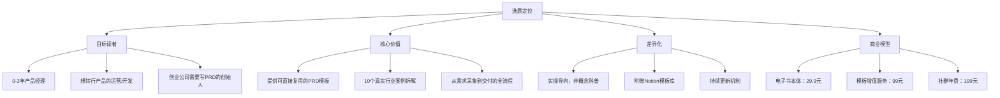
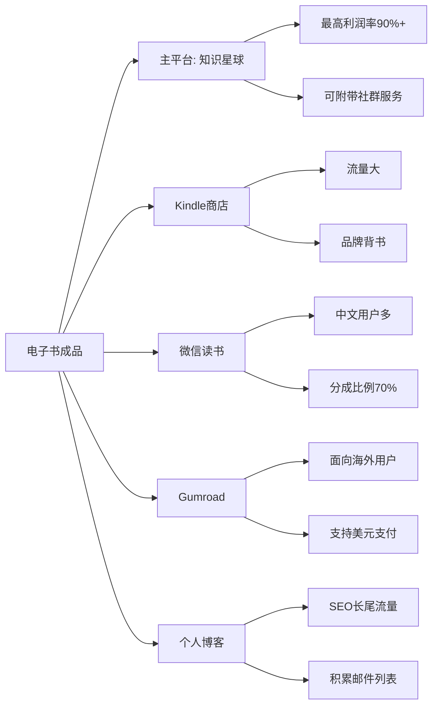
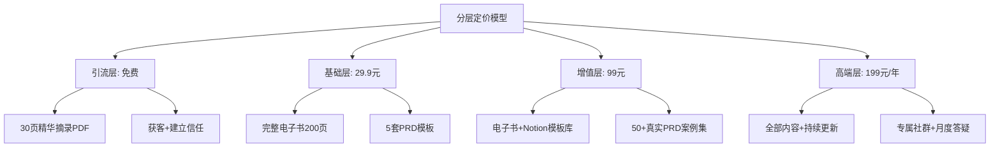
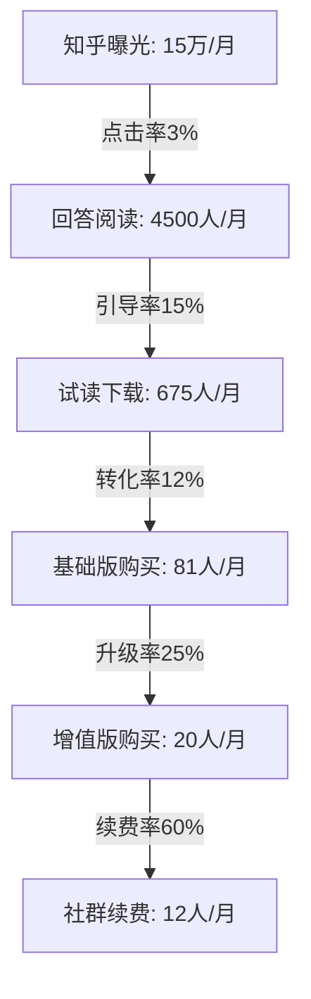
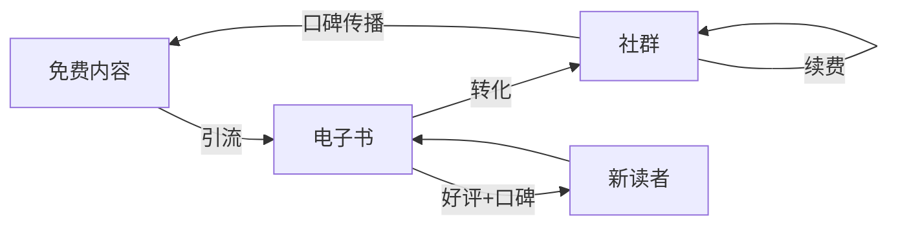
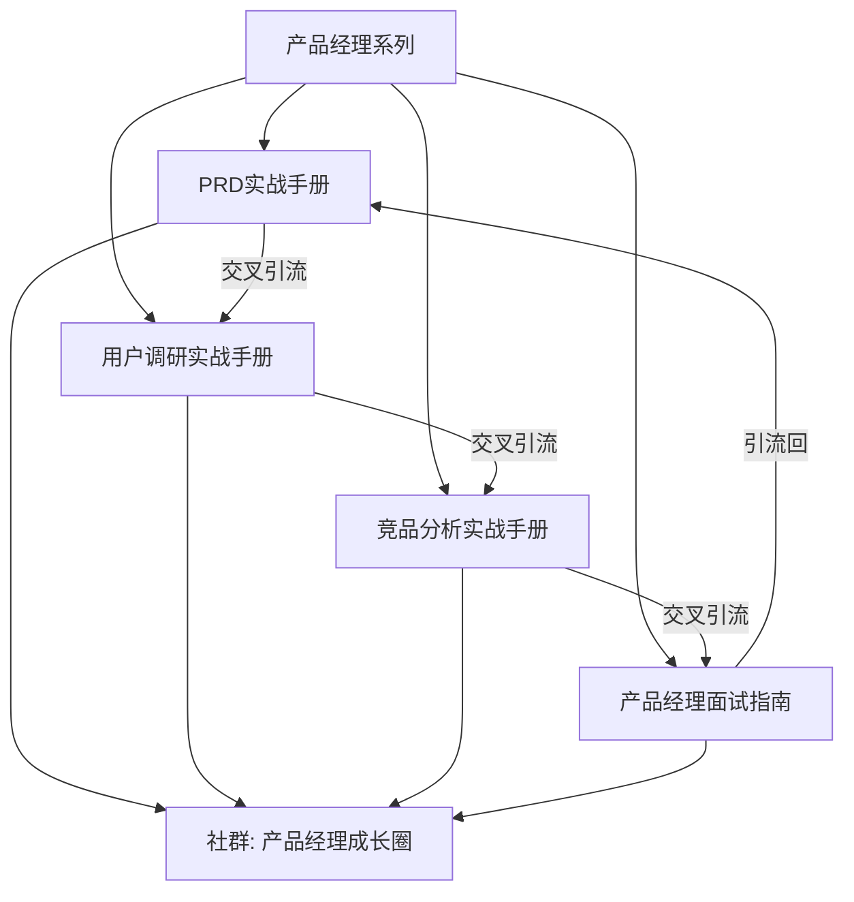

## 案例一：从零开始的电子书被动收入

### 案例背景

张晨，30岁，某二线城市互联网公司的产品经理，日常工作是需求分析和竞品调研。他有8年的行业经验，写作能力中等偏上，但从未接触过出版或内容创业。2023年初，他开始尝试在业余时间写电子书，目标是构建一条不需要持续投入时间就能产生收入的被动收入渠道。

**为什么选择电子书作为被动收入的切入点？**

电子书是门槛最低的数字产品之一。与开发SaaS、运营电商、管理房产相比，电子书的启动成本几乎为零——一台电脑、一个文字编辑器就足够了。更重要的是，电子书具有天然的"一次创作、多次销售"属性：

| 维度 | 电子书 | 自由职业 | 实体电商 | 房产投资 |
|------|--------|----------|----------|----------|
| 启动资金 | 0-500元 | 0-2000元 | 5000-50000元 | 50万+ |
| 技能门槛 | 中等（写作+排版） | 高（专业技能） | 中等（运营+供应链） | 高（资金+经验） |
| 时间投入模式 | 前期集中，后期极低 | 持续投入 | 持续运营 | 前期大量，后期管理 |
| 被动程度 | ★★★★★ | ★★☆☆☆ | ★★★☆☆ | ★★★★☆ |
| 收入上限 | 中等（单品有限，组合可观） | 高 | 高 | 高 |
| 风险等级 | 低 | 中 | 中高 | 高 |

张晨选择电子书的核心逻辑：用专业知识换取时间自由，用标准化产品替代一对一服务。

### 前期准备：从0到选题（第1-2周）

#### 第一步：技能盘点与市场调研

张晨没有盲目动笔，而是先做了系统性的准备工作。他的方法分为三个环节：

**环节一：个人技能盘点**

他用一张表格梳理了自己所有的知识资产：

```markdown
## 我的知识资产盘点

### 硬技能（可直接变现）
- 产品需求文档撰写（PRD）：8年经验，公司内部培训讲师
- 竞品分析：主导过30+竞品分析报告
- 用户调研：深度访谈200+用户
- 数据分析：SQL、Excel高级函数、基础Python
- Axure/Figma原型设计

### 软技能（间接价值）
- 跨部门沟通协调
- 项目管理（敏捷/瀑布）
- 向上汇报与演示

### 兴趣爱好（潜在方向）
- 效率工具（Notion、Obsidian）
- 个人知识管理
- 职场成长
```

**环节二：市场需求验证**

光有技能不够，必须验证市场是否愿意为这些知识付费。张晨用了四种方法：

**方法1：平台搜索分析**

在知乎、小红书、微信读书、亚马逊Kindle商店搜索相关关键词，记录搜索结果数量和热度：

| 搜索关键词 | 知乎话题浏览量 | Kindle相关书籍数 | 小红书笔记数 |
|-----------|--------------|-----------------|-------------|
| 产品经理入门 | 1.2亿 | 47本 | 8.6万 |
| PRD写作 | 3800万 | 12本 | 2.1万 |
| 竞品分析 | 5600万 | 8本 | 3.4万 |
| 用户调研方法 | 2100万 | 6本 | 1.2万 |
| Notion教程 | 8900万 | 15本 | 12万 |

**方法2：付费课程销量观察**

在网易云课堂、极客时间、知识星球搜索同类主题的付费产品，估算其市场规模：

- 极客时间上"产品经理实战"类课程，售价99-199元，销量通常在2000-10000份
- 知识星球中产品经理类社群，年费99-299元，活跃社群成员500-3000人
- 这说明产品经理群体有明确的付费学习意愿

**方法3：社群需求挖掘**

加入5个产品经理微信群和2个知识星球，观察群内高频讨论的问题。他发现以下几个问题被反复提及：

- "如何写一份让开发不吐槽的PRD？"
- "竞品分析到底该怎么写？模板有吗？"
- "新人产品经理怎么快速上手？"
- "产品经理35岁以后怎么办？"

**方法4：竞品书籍分析**

购买了Kindle上销量前5的同类电子书，逐一阅读并记录：

- 内容深度：大多停留在概念科普层面，缺乏实操细节
- 读者评价：好评集中在"入门友好"，差评集中在"太浅""没有模板""案例过时"
- 定价区间：9.9-39.9元
- 页数范围：80-250页

**核心发现：** 市场需求旺盛，但现有产品质量参差不齐，缺乏"拿来就能用"的实操型内容。这正是张晨的差异化切入点。

#### 第二步：确定选题与定位

基于调研结果，张晨确定了第一个电子书的选题：

> **《产品经理的PRD实战手册：从需求到交付的完整指南》**

选题定位的四个维度：



### 内容创作：从选题到成稿（第3-10周）

#### 大纲设计

张晨没有直接开始写正文，而是先用两周时间打磨大纲。他的大纲经历了三个版本的迭代：

**第一版大纲（过于学术化）：**

```text
1. 产品需求文档概述
2. PRD的理论基础
3. 需求分析方法论
4. 文档结构设计
5. 写作规范与标准
```

问题：太像教科书，读者看完还是不会写。

**第二版大纲（加入实操但缺乏场景）：**

```text
1. 什么是PRD
2. PRD的基本结构
3. 如何写用户故事
4. 如何写功能描述
5. 如何写验收标准
```

问题：解决了"怎么写"，但没解决"在什么场景下写"。

**第三版大纲（最终版，场景驱动）：**

```text
第一部分：认知篇——重新理解PRD
  1. PRD不是给老板看的，是给开发看的
  2. 一份好PRD的5个标准
  3. PRD的3种粒度：MVP版/标准版/完整版

第二部分：实战篇——10个行业PRD拆解
  4. 电商：商品详情页改版PRD
  5. 社交：消息已读功能PRD
  6. SaaS：权限管理系统PRD
  7. 金融：风控规则引擎PRD
  8. 教育：在线课堂互动功能PRD
  9. 医疗：电子处方流转PRD
  10. 出行：拼车匹配算法PRD
  11. 内容：推荐系统冷启动PRD
  12. 企业服务：工单系统PRD
  13. IoT：智能家居场景联动PRD

第三部分：工具篇——效率提升10倍
  14. PRD模板库（5套场景化模板）
  15. AI辅助写PRD的工作流
  16. 从PRD到原型的自动化流程

第四部分：进阶篇——从写PRD到管理需求
  17. 需求池管理与优先级排序
  18. 需求变更的处理策略
  19. 跨团队需求对齐的方法
```

**大纲迭代的关键教训：** 以读者的使用场景为中心，而不是以知识体系为中心。读者不是来学理论的，是来解决问题的。

#### 写作执行

张晨制定了严格的写作计划：

| 阶段 | 时间 | 任务 | 每日目标 |
|------|------|------|---------|
| 第1周 | 7天 | 大纲设计与素材收集 | 完成大纲终稿 + 收集20个PRD样本 |
| 第2-3周 | 14天 | 认知篇+实战篇前5章 | 每天2000字（约2小时） |
| 第4-5周 | 14天 | 实战篇后5章+工具篇 | 每天2500字（约2.5小时） |
| 第6周 | 7天 | 进阶篇+附录 | 每天3000字（约3小时） |
| 第7周 | 7天 | 通读修改+排版 | 全文校对2遍 |
| 第8周 | 7天 | 测试读者反馈+终稿 | 邀请10人试读 |

**写作过程中的关键技巧：**

**技巧1：先写骨架再填肉**

每一章先写出所有小标题和核心观点（每段一句话），形成"骨架稿"，然后再逐段扩展。这样做的好处是避免写到一半发现逻辑不通需要推翻重来。

**技巧2：用真实案例替代虚构场景**

张晨从自己8年的工作经历中提取了大量真实案例，经过脱敏处理后写入书中。比如"电商商品详情页改版PRD"这个案例，就来自他2021年主导的一个真实项目，从需求背景、用户调研、竞品分析到最终的PRD文档结构，全部真实还原。

**技巧3：每章结尾设置"行动清单"**

每一章结尾都有3-5个具体可执行的行动项，比如：

> **本章行动清单：**
> 1. 打开你最近写的一份PRD，用本章的5个标准逐项检查
> 2. 找一个开发同事，让他用5分钟读完你的PRD，记录他的疑问
> 3. 用本章提供的MVP模板，重写你当前正在做的项目PRD

**技巧4：AI辅助而非AI替代**

张晨使用AI工具提升效率，但严格控制AI的参与边界：

| 环节 | AI参与度 | 说明 |
|------|---------|------|
| 大纲优化 | 60% | 让AI检查逻辑完整性，补充遗漏 |
| 素材搜索 | 70% | 用AI快速检索行业数据和趋势 |
| 正文撰写 | 15% | 仅用于润色语句、调整措辞 |
| 案例分析 | 0% | 全部基于真实经验，AI无法替代 |
| 排版校对 | 80% | AI检查错别字、格式一致性 |

AI参与度低的核心原因：电子书的核心价值是作者的独特经验和真实案例，这是AI无法生成的。过度依赖AI会让内容失去灵魂，变成千篇一律的"AI味"文章。

#### 排版与封面设计

**排版工具选择：**

| 工具 | 适用平台 | 优点 | 缺点 | 推荐度 |
|------|---------|------|------|--------|
| Sigil | ePub | 免费、专业、可控性强 | 学习曲线陡 | ★★★★☆ |
| Calibre | 多格式 | 格式转换强大 | 排版精细度一般 | ★★★☆☆ |
| Vellum | ePub/Mobi | 排版精美、操作简单 | 仅Mac、付费 | ★★★★★ |
| Pandoc | 多格式 | 命令行、可自动化 | 需要手动调CSS | ★★★☆☆ |
| Typora+CSS | PDF/ePub | 实时预览、Markdown友好 | 大文件卡顿 | ★★★★☆ |

张晨最终选择了 **Markdown写作 + Pandoc转换 + Sigil精调** 的组合方案，既保持了写作的流畅性，又保证了最终成品的排版质量。

**封面设计：**

封面是读者对电子书的第一印象，直接影响点击率和转化率。张晨的封面设计策略：

- 用Canva制作初版（免费方案），测试市场反应
- 首月销量超过100份后，花费500元请专业设计师制作正式版
- 封面遵循"3秒法则"：读者在3秒内必须知道这本书讲什么
- 配色选择蓝灰色系（专业感），大字标题突出核心卖点

### 上架与分发：从成稿到收入（第11-14周）

#### 平台选择策略

张晨采用了"主平台+多渠道分发"的策略：



**各平台对比分析：**

| 平台 | 分成比例 | 流量来源 | 审核周期 | 适合阶段 |
|------|---------|---------|---------|---------|
| 知识星球 | 95%（扣除支付手续费） | 自有流量+星球搜索 | 即时 | 有粉丝基础 |
| Kindle KDP | 35%-70% | 亚马逊搜索流量 | 24-72小时 | 零基础起步 |
| 微信读书 | 约70% | 微信生态流量 | 1-2周 | 中文市场覆盖 |
| Gumroad | 90%+ | 自有流量 | 即时 | 海外市场 |
| 豆瓣阅读 | 约60% | 豆瓣社区流量 | 1-3天 | 文艺/深度内容 |
| 小报童 | 90%+ | 自有流量+推荐 | 即时 | 中文创作者社区 |

**张晨的实际选择：** 首发Kindle（获取初始流量和评价）+ 知识星球（高利润率+社群绑定）+ 个人博客（SEO长尾）。三个月后追加微信读书和小报童。

#### 定价策略

定价是电子书变现中最关键的决策之一。张晨采用了分层定价模型：



**定价依据：**

- 基础版29.9元：参考Kindle同类书籍9.9-39.9元的定价区间，取中位偏上
- 增值版99元：参考知识星球同类社群99-299元的定价，提供可量化的工具价值
- 高端版199元/年：参考极客时间课程99-199元的定价，提供持续服务价值

**关键定价原则：**

1. **价格锚定效应**：基础版29.9元的存在让99元的增值版显得"物超所值"
2. **免费引流**：30页精华摘录降低了用户的决策成本
3. **续费机制**：年费模式创造了持续收入流

#### 首发营销策略

张晨没有花钱投广告，而是用了零成本的内容营销策略：

**策略1：知乎长文引流**

在知乎回答10个与PRD相关的高流量问题，每个回答末尾自然引导到电子书。重点回答的问题包括：

- "产品经理如何写好PRD？"（浏览量1200万+）
- "PRD和BRD有什么区别？"（浏览量580万+）
- "有没有PRD模板可以分享？"（浏览量430万+）

每个回答控制在2000-3000字，提供实质性价值，在文末自然提及"我整理了一本完整的PRD实战手册"。注意：不能硬广，必须先提供价值再引导。

**策略2：小红书笔记种草**

制作15篇小红书笔记，每篇聚焦一个PRD写作的痛点：

- "为什么开发总说你的PRD看不懂？可能是这3个原因"
- "PRD里最常被忽略的一个章节，80%的产品经理都没写"
- "我用AI写PRD的完整工作流，效率提升3倍"

每篇笔记800-1200字，配3-5张信息量大的图片（截图或手绘流程图）。

**策略3：产品经理社群冷启动**

在5个产品经理微信群中，以"分享干货"的形式（而非广告）介绍自己的写作经验：

- 第1周：分享一个PRD写作的小技巧，引发讨论
- 第2周：分享一个完整的PRD案例片段，展示专业度
- 第3周：自然提及自己写了一本电子书，提供免费试读链接
- 第4周：邀请感兴趣的人加入试读者群，收集反馈

### 数据追踪与优化（第15周起持续）

#### 关键指标体系

张晨建立了一套完整的数据追踪体系：

| 指标类别 | 具体指标 | 目标值 | 追踪工具 |
|---------|---------|--------|---------|
| 流量指标 | 知乎回答日均曝光 | 5000+ | 知乎创作者中心 |
| 转化指标 | 试读→购买转化率 | 8%+ | 短链接统计 |
| 销售指标 | 月销量 | 50份+（初期） | 各平台后台 |
| 复购指标 | 增值版购买率 | 15%+ | 知识星球数据 |
| 口碑指标 | 好评率 | 90%+ | 平台评价 |
| 留存指标 | 社群月活跃度 | 60%+ | 知识星球统计 |

#### 数据驱动的迭代优化

**第一轮优化（上架后第2周）：** 根据试读反馈修改了3个章节的案例说明，增加了截图和步骤分解。

**第二轮优化（上架后第1个月）：** 发现"金融行业PRD"章节购买后跳出率最高（读者反馈太专业看不懂），增加了前置知识说明和简化版案例。

**第三轮优化（上架后第2个月）：** 根据读者需求新增了"AI辅助写PRD"章节（原大纲中未包含），这个章节后来成为书中最受欢迎的部分。

**第四轮优化（上架后第3个月）：** 将Kindle定价从39.9元调整为29.9元，月销量从35份提升到62份（提升77%），总收入反而增加了54%。

### 成果数据

经过6个月的运营，张晨的电子书项目取得了以下成果：

#### 收入数据

| 时间节点 | 月销量 | 月收入 | 累计收入 | 收入来源构成 |
|---------|--------|--------|---------|-------------|
| 第1个月 | 23份 | 687元 | 687元 | Kindle 100% |
| 第2个月 | 41份 | 1226元 | 1913元 | Kindle 70% + 知识星球 30% |
| 第3个月 | 58份 | 2480元 | 4393元 | Kindle 45% + 知识星球 40% + 微信读书 15% |
| 第4个月 | 67份 | 3210元 | 7603元 | 知识星球 50% + Kindle 30% + 微信读书 20% |
| 第5个月 | 72份 | 3580元 | 11183元 | 知识星球 55% + Kindle 25% + 微信读书 20% |
| 第6个月 | 81份 | 4120元 | 15303元 | 知识星球 58% + Kindle 22% + 微信读书 20% |

**关键洞察：** 收入来源从单一的Kindle销售，逐步转变为以知识星球社群为主的多元收入结构。社群收入的利润率更高（95% vs Kindle的70%），且具有续费属性。

#### 时间投入数据

| 阶段 | 时间投入 | 投入内容 | 占比 |
|------|---------|---------|------|
| 前期创作（8周） | 约120小时 | 调研+写作+排版 | 一次性投入 |
| 首发营销（4周） | 约40小时 | 知乎+小红书+社群 | 一次性投入 |
| 日常维护（持续） | 约3-5小时/周 | 回复读者问题+内容更新 | 持续投入 |
| 第二本书创作（并行） | 约10小时/周 | 新书写作 | 扩展投入 |

**时间价值计算：**

- 前6个月总投入时间：约220小时
- 前6个月总收入：15303元
- 时薪：约69.6元/小时
- 第6个月收入（4120元）对应当月投入时间（约20小时）的时薪：约206元/小时

随着销量增长和时间投入下降，时薪持续攀升——这正是被动收入的核心价值。

#### 转化漏斗数据



### 核心经验与方法论

#### 经验一：选题决定80%的成败

选题不是"我擅长什么就写什么"，而是"市场需要什么 × 我能提供什么独特价值"的交集。张晨的选题验证流程可以总结为一个公式：

> **好选题 = 刚需 + 高搜索量 + 低竞争质量 + 我有真实经验**

四个条件缺一不可。有刚需但竞争激烈（如"Python入门"），很难突围；竞争低但需求也低（如"如何给宠物龟写PRD"），市场太小。

#### 经验二：内容深度是核心壁垒

市场上80%的电子书停留在"概念科普"层面，读者看完觉得"有道理但不会用"。张晨的做法是每个知识点都做到"三层穿透"：

1. **是什么**（概念定义，10%篇幅）
2. **为什么**（原理机制，20%篇幅）
3. **怎么做**（具体步骤+模板+案例，70%篇幅）

比如讲"用户故事"，不是简单说"As a...I want...So that..."的格式，而是：

- 给出5个不同行业的用户故事实例
- 展示从用户访谈记录到用户故事的转化过程
- 提供一个用户故事质量自检清单
- 分析3个写得不好的用户故事，逐句拆解为什么不好

#### 经验三：免费内容是最好的销售员

张晨在知乎、小红书、个人博客上持续输出高质量免费内容，这些内容起到了三重作用：

1. **筛选目标读者**：对免费内容感兴趣的人，大概率也对电子书感兴趣
2. **建立专业信任**：免费内容证明了作者的专业水平
3. **SEO长尾流量**：知乎回答和博客文章会持续带来自然搜索流量

**免费内容与付费内容的关系：**

| 免费内容（引流层） | 付费内容（变现层） |
|-------------------|-------------------|
| PRD写作的5个常见错误 | PRD完整写作流程+10个行业案例 |
| 用户故事的正确格式 | 50个用户故事实例+自检模板 |
| 竞品分析框架概述 | 竞品分析完整模板+数据采集工具 |

原则：免费内容解决"是什么"和"为什么"，付费内容解决"怎么做"和"直接用"。

#### 经验四：社群是被动收入的放大器

电子书是标准化产品，边际成本接近零，但单价有天花板。社群则提供了持续的高价值服务，两者组合形成了完整的变现闭环：



**社群运营的关键动作：**

- 每月1次直播答疑（1小时，解决读者实际问题）
- 每周精选3个读者问题在社群内公开讨论
- 每季度更新一次电子书内容（新增案例、修正错误）
- 社群成员专属的模板库持续扩充

#### 经验五：数据驱动而非感觉驱动

张晨每周日晚花30分钟做一次数据复盘，核心看三个指标：

1. **流量来源效率**：哪个渠道带来的读者转化率最高？重点投入。
2. **内容章节热度**：哪些章节被跳读最多？说明写得不够好或位置不对。
3. **退款率与差评原因**：退款是质量信号，必须逐条分析。

一个真实的例子：张晨发现通过小红书引流的读者转化率（18%）远高于知乎（8%），但知乎带来的绝对数量更大。于是他调整了策略——小红书上投入更多精力制作高质量种草内容，知乎上则优化已有回答的引导语。

### 常见误区与避坑指南

#### 误区一：追求完美再发布

很多创作者陷入"完美主义陷阱"，总觉得自己写得不够好，反复修改迟迟不上架。张晨的第一版电子书只有120页、3个行业案例，远不如后来的200页、10个案例的版本。但正是第一版的市场反馈指导了后续的优化方向。

**正确做法：** 先完成，再完美。MVP版本（最小可行产品）上架后，根据真实读者反馈迭代优化。

#### 误区二：只写不推广

"酒香不怕巷子深"在信息过载时代已经不适用了。张晨观察到一个现象：Kindle上排名前10的PRD类电子书，质量参差不齐，但它们的共同点是都有持续的内容营销。排名靠后的书籍中不乏优质内容，但因为作者不擅长推广，销量惨淡。

**正确做法：** 写作和推广的时间分配应该是6:4，甚至在初期是5:5。

#### 误区三：定价过低

新手创作者最常见的错误是定价过低（9.9元甚至免费），认为低价更容易卖。实际上，过低的定价传递了"这内容不值钱"的信号，反而降低了转化率。张晨的A/B测试显示：

| 定价 | 月销量 | 月收入 | 读者评价关键词 |
|------|--------|--------|--------------|
| 9.9元 | 89份 | 881元 | "便宜""还行""一般" |
| 29.9元 | 67份 | 2003元 | "专业""值""干货" |
| 49.9元 | 38份 | 1896元 | "期待更高""内容不错" |

29.9元在销量和收入之间取得了最佳平衡，且读者评价质量明显更高。

#### 误区四：忽视售后与口碑

电子书不是"卖完就走"的一次性交易。张晨的数据显示，60%的新读者来自老读者的推荐。维护口碑的关键动作：

- 24小时内回复读者的邮件/消息
- 对合理的内容修改建议快速响应（48小时内更新）
- 主动邀请满意读者在平台上留下评价
- 对退款请求不纠缠，但会询问原因以便改进

#### 误区五：一本书打天下

一本电子书的收入是有天花板的。张晨在第4个月开始创作第二本电子书（《产品经理的用户调研实战手册》），两本书之间形成交叉引流。到第6个月时，第二本书的月收入已经达到1200元，且两本书的读者重叠率只有35%——说明它们覆盖了不同的需求场景。

**电子书矩阵策略：**



### 长期规划：从一本电子书到内容资产

张晨的6个月只是一个起点。他的长期规划分为三个阶段：

**第一阶段（0-6个月）：单品验证**

- 完成第一本电子书的创作、上架、推广
- 验证选题方向和商业模式
- 目标：月收入3000-5000元

**第二阶段（6-18个月）：矩阵扩展**

- 创作3-5本系列电子书，形成产品经理知识体系
- 建立社群运营体系，实现自动化的社群管理
- 开发Notion模板商城作为独立收入来源
- 目标：月收入8000-15000元

**第三阶段（18-36个月）：品牌化运营**

- 从"卖电子书"升级为"卖知识品牌"
- 开发在线课程（视频形式，单价更高）
- 出版实体书（与出版社合作，获取版税收入）
- 企业定制培训（高客单价服务）
- 目标：月收入20000-50000元

### 本案例的核心启示

1. **电子书是最适合普通人的被动收入起点**：零启动成本、可利用现有专业知识、边际成本接近零
2. **选题验证比写作本身更重要**：花2周做市场调研，比花2个月写一本没人要的书更有价值
3. **内容深度是核心竞争力**：在"概念科普"泛滥的市场中，"拿来就能用"的实操内容具有稀缺性
4. **免费内容是最好的营销工具**：持续输出免费干货，建立信任后再引导付费
5. **数据驱动优化**：每周复盘关键指标，用数据而非感觉指导决策
6. **社群放大电子书价值**：电子书+社群的组合模型，比单纯的电子书销售收入高3-5倍
7. **一本电子书是起点不是终点**：构建电子书矩阵，形成知识品牌，才能实现真正的被动收入自由
