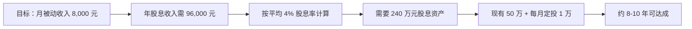
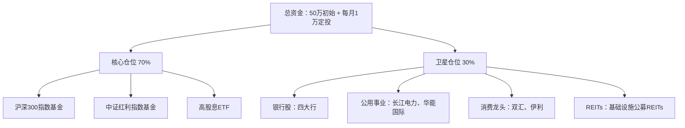

## 案例二：股息投资组合的被动收入之路

> **核心教训：纪律性比选股能力更重要。** 本案例的主人公不是金融科班出身，不会看K线图，不懂技术分析。他做对的事情只有一件——持续三年，每月定投高股息资产，分红再投入，从未中断。三年后，他的投资组合每月稳定产生 2,000-3,500 元被动股息收入，且这个数字还在以每年 15-20% 的速度增长。

---

### 案例背景

#### 人物画像

| 维度 | 详情 |
|------|------|
| 化名 | 陈明（应本人要求使用化名） |
| 年龄 | 32 岁，某互联网公司产品经理 |
| 年薪 | 税前 35 万元 |
| 投资经验 | 零基础。此前只买过余额宝和银行理财 |
| 可投资资金 | 每月可结余 8,000-12,000 元，另有存款 50 万元 |
| 目标 | 10 年内实现股息收入覆盖基本生活开支（月 8,000 元） |

#### 起点困境

2021 年初，陈明面临一个典型的城市中产困境：工资不低，但全部收入都来自出卖时间。一旦停止工作，收入立刻归零。他尝试过几种被动收入方式——写过公众号（坚持了两个月放弃了）、做过闲鱼二手（太琐碎占用大量时间）、买过 P2P（踩雷亏损 2 万）。这些经历让他意识到一个道理：**被动收入的前提是找到一个不需要持续投入注意力的系统。**

他开始研究"被动收入"这个概念，读了《富爸爸穷爸爸》《股市长线法宝》《漫步华尔街》三本书后，把方向锁定在**股息投资**上。理由很简单：

1. **不需要专业技能**：不像做内容或开发产品需要特定能力
2. **不需要持续关注**：选好标的后可以长期持有
3. **有真实的现金流**：分红是实实在在打到账户的钱
4. **可以从小开始**：不需要一次性投入大额资金
5. **复利效应明确**：分红再投入的数学模型清晰可计算

#### 目标设定

陈明用了一个简单的方法来设定目标——**反向拆解法**：



这个拆解让他从"8,000 元/月"这个模糊目标变成了可执行的路径：需要 240 万资产，现有 50 万本金，每月追加 1 万，大概 8-10 年可以达成。

---

### 执行过程

陈明的股息投资之路可以分为三个阶段：**学习准备期（第 1-3 个月）**、**建仓定投期（第 4-18 个月）**、**优化持有期（第 19-36 个月）**。

#### 第一阶段：学习准备期（第 1-3 个月）

##### 1. 建立知识框架

陈明没有盲目入场，而是花了三个月时间系统学习。他的学习路径如下：

**必读书单（按阅读顺序）：**

| 序号 | 书名 | 核心收获 | 阅读时长 |
|------|------|---------|---------|
| 1 | 《股市长线法宝》（西格尔） | 股票长期回报优于其他资产，股息是回报的核心组成部分 | 2 周 |
| 2 | 《聪明的投资者》（格雷厄姆） | 安全边际、市场先生、防御型投资者策略 | 3 周 |
| 3 | 《投资最重要的事》（霍华德·马克斯） | 风险控制、第二层思维、周期认知 | 1 周 |
| 4 | 《股息兵法》（国内作者） | A 股股息投资的具体操作方法 | 1 周 |
| 5 | 《指数基金投资指南》（银行螺丝钉） | 被动投资理念、估值方法 | 1 周 |

**关键知识点梳理：**

陈明在学习过程中整理了一个核心知识框架——**股息投资的三个核心公式**：

**公式一：实际股息率 = 每股分红 ÷ 你的买入成本**

这个公式的意义在于：同样一只股票，你以 10 元买入，别人以 15 元买入，当每股分红 0.5 元时，你的实际股息率是 5%，而别人只有 3.33%。**买入价格决定了你的实际收益率，而不是股票的名义股息率。**

**公式二：股息增长率 = 分红增长率 × 再投资效率**

假设你持有 10 万元股息率为 4% 的股票，每年分红 4,000 元。如果公司每年分红增长 10%，且你将分红全部再投资：
- 第 1 年：4,000 元
- 第 5 年：约 6,500 元
- 第 10 年：约 12,500 元
- 第 20 年：约 42,000 元

这就是复利的威力——**时间越长，增长越快**。

**公式三：安全边际 = (内在价值 - 买入价格) ÷ 内在价值**

这是格雷厄姆的核心思想。在股息投资中，安全边际体现为：当股价下跌时，只要公司基本面没有恶化，你的实际股息率反而提高了。**价格下跌是股息投资者的朋友，不是敌人。**

##### 2. 制定投资纪律

在学习阶段，陈明就提前写下了自己的**投资纪律清单**（后来证明这是他做对的最关键的事情之一）：

```markdown
# 我的股息投资纪律（2021年3月制定）

## 买入纪律
1. 只买股息率 > 3.5% 的标的
2. 只买连续分红 5 年以上的公司
3. 单只股票仓位不超过总资产的 10%
4. 不追高，只在估值合理或偏低时买入
5. 每月 15 号固定执行买入（排除情绪干扰）

## 持有纪律
6. 分红全部再投入，不提现消费
7. 不看日线图，每周只看一次账户
8. 只要公司基本面不变，股价下跌不卖出
9. 每季度复盘一次，检查公司经营状况

## 卖出纪律
10. 公司连续两年减少分红 → 减仓 50%
11. 公司停止分红 → 清仓
12. 股息率因股价暴涨降到 2% 以下 → 减仓至标准仓位
```

##### 3. 选择投资账户和工具

| 项目 | 选择 | 理由 |
|------|------|------|
| 券商 | 某互联网券商（佣金万 1.5） | 佣金低、APP 体验好、支持自动定投 |
| 账户类型 | 普通 A 股账户 | 起步阶段不涉及港股通和美股 |
| 分析工具 | 雪球（免费）+理杏仁（付费，99 元/年） | 雪球看社区讨论，理杏仁看财务数据和股息率 |
| 记录方式 | Excel 自建表格 | 记录每笔买入成本、持仓数量、分红到账金额 |

#### 第二阶段：建仓定投期（第 4-18 个月）

##### 1. 核心-卫星组合设计

陈明采用经典的**核心-卫星策略**来构建组合：



**核心仓位（70%）——被动指数**

| 标的 | 配置比例 | 理由 | 当时股息率 |
|------|---------|------|-----------|
| 中证红利 ETF（515080） | 30% | 一篮子高股息股票，分散风险 | 约 4.2% |
| 沪深 300 ETF（510300） | 25% | 大盘蓝筹，分红稳定 | 约 2.5% |
| 恒生高股息 ETF（513690） | 15% | 港股高息股，分散 A 股风险 | 约 5.5% |

**卫星仓位（30%）——个股精选**

陈明对个股的选择标准非常严格，他用了一个**五维筛选法**：

| 维度 | 筛选条件 | 不符合条件的示例 |
|------|---------|----------------|
| 股息率 | 当前股息率 ≥ 3.5% | 茅台（股息率不到 2%） |
| 连续分红 | 连续 5 年以上分红且逐年递增 | 某些周期性分红的钢铁股 |
| 盈利能力 | ROE ≥ 10%，净利率 ≥ 5% | 高股息但盈利能力下滑的公司 |
| 负债水平 | 资产负债率 ≤ 70% | 高杠杆的房地产公司 |
| 市值门槛 | 市值 ≥ 100 亿 | 小市值高股息可能是价值陷阱 |

按照这个标准，他在 2021 年 6 月选出的第一批个股如下：

| 股票 | 行业 | 买入价 | 当时股息率 | 买入理由 |
|------|------|--------|-----------|---------|
| 工商银行 | 银行 | 5.12 元 | 5.8% | 最大国有行，分红稳定，系统性风险低 |
| 建设银行 | 银行 | 6.55 元 | 5.5% | 资产质量优秀，分红逐年递增 |
| 长江电力 | 电力 | 22.30 元 | 3.6% | 水电龙头，现金流极稳定，几乎不受经济周期影响 |
| 中国神华 | 能源 | 18.75 元 | 7.2% | 煤电一体化，现金流充沛，分红大方 |
| 双汇发展 | 消费 | 28.50 元 | 4.1% | 消费必需品，需求稳定，分红持续 |

##### 2. 定投执行策略

陈明采用了**改良版智能定投法**——不是简单的定期定额，而是在估值偏低时多投、偏高时少投：

**定投规则：**

| PE 百分位 | 定投金额 | 对应市场状态 |
|----------|---------|------------|
| < 30% | 每月 15,000 元（1.5 倍） | 低估区域，加大投入 |
| 30%-50% | 每月 12,000 元（1.2 倍） | 合理偏低 |
| 50%-70% | 每月 10,000 元（1.0 倍） | 正常估值 |
| 70%-90% | 每月 6,000 元（0.6 倍） | 偏高，减少投入 |
| > 90% | 暂停定投，资金存货币基金 | 高估区域，等待回调 |

PE 百分位数据来源：理杏仁网站的中证红利指数估值页面。

##### 3. 分红再投资机制

这是整个策略中最关键的环节——**DRIP（Dividend Reinvestment Plan，股息再投资计划）**。

陈明的 DRIP 执行流程：

```text
分红到账（现金）
    ↓
不提现，留在券商账户
    ↓
每月定投日（15号）一起投入
    ↓
按当前估值分配到核心/卫星仓位
    ↓
记录分红再投资的份额和成本
```

**为什么分红再投资如此重要？** 陈明做了一个简单的对比计算：

| 策略 | 初始投入 | 年股息率 | 股息增长 | 10 年后年股息收入 |
|------|---------|---------|---------|-----------------|
| 分红提现消费 | 50 万元 | 4% | 每年 +8% | 约 29,000 元 |
| 分红全部再投资 | 50 万元 | 4% | 每年 +8% | 约 54,000 元 |
| 差异 | — | — | — | **多出 86%** |

同样的本金和股息率，仅仅因为是否再投资，10 年后的收入差距接近一倍。

#### 第三阶段：优化持有期（第 19-36 个月）

##### 1. 组合动态调整

持有 18 个月后，陈明对组合进行了第一次系统性复盘。这次复盘让他做出了三个重要调整：

**调整一：剔除一只"假高息"股**

某只钢铁股当时股息率高达 8%，但陈明深入分析后发现：
- 公司净利润连续两个季度下滑
- 应收账款周转天数从 45 天增加到 78 天
- 经营现金流首次低于净利润（可能在用应收账款"做"利润）

他果断清仓，避免了后来该股因业绩暴雷下跌 35% 的损失。

**调整二：加入基础设施公募 REITs**

2021 年 6 月，中国首批基础设施公募 REITs 上市。陈明拿出 5 万元配置了两只 REITs：

| REITs 名称 | 类型 | 预期分派率 | 买入理由 |
|-----------|------|-----------|---------|
| 中金普洛斯 REIT | 仓储物流 | 约 4.5% | 物流地产需求旺盛，租约长期稳定 |
| 华安张江光大 REIT | 产业园 | 约 4.2% | 上海张江高科技园区，租户质量高 |

REITs 的加入让组合的收入来源更加多元化，不再完全依赖上市公司分红。

**调整三：建立"股息日历"**

陈明发现，A 股上市公司的分红集中在 5-8 月，导致这几个月收入很高，其他月份几乎没有分红。为了平滑现金流，他调整了持仓结构，让分红在各个月份更加均匀：

| 月份 | 主要分红来源 |
|------|------------|
| 1-2 月 | 港股高息 ETF（港股分红通常 1 月和 7 月） |
| 3-4 月 | 部分银行股（部分银行 3 月发布年报并分红） |
| 5-6 月 | 大部分 A 股上市公司 |
| 7-8 月 | 部分延迟分红的公司 + 港股中期分红 |
| 9-10 月 | REITs 季度分红 |
| 11-12 月 | 少量年末特别分红 |

##### 2. 税务优化

陈明在第二年发现一个重要的税务优化点：**A 股股息红利税**。

| 持股时间 | 税率 | 影响 |
|---------|------|------|
| 持股 ≤ 1 个月 | 20% | 频繁交易成本极高 |
| 1 个月 < 持股 ≤ 1 年 | 10% | 中等税负 |
| 持股 > 1 年 | 免征 | 长期持有的税收优势 |

这意味着：**如果你买入后持有超过 1 年，股息收入完全免税。** 这进一步强化了陈明"买入并长期持有"的策略。他把所有个股的持有时间都锁定在 1 年以上，ETF 则因为交易结构的特殊性，分红税已经在基金层面扣除，个人不再重复缴税。

---

### 成果数据

#### 三年收益总览

| 指标 | 第 1 年末 | 第 2 年末 | 第 3 年末 |
|------|----------|----------|----------|
| 累计投入本金 | 62 万元 | 74 万元 | 86 万元 |
| 账户总市值 | 60.5 万元 | 78.3 万元 | 95.8 万元 |
| 当年股息收入 | 18,200 元 | 26,800 元 | 38,500 元 |
| 月均股息收入 | 约 1,517 元 | 约 2,233 元 | 约 3,208 元 |
| 累计股息收入 | 18,200 元 | 45,000 元 | 83,500 元 |
| 组合整体股息率 | 3.4% | 3.8% | 4.2% |
| 股息增长率（同比） | — | +47% | +44% |

#### 月度现金流分布（第 3 年）

| 月份 | 股息收入（元） | 主要来源 |
|------|--------------|---------|
| 1 月 | 1,850 | 港股 ETF 分红 |
| 2 月 | 680 | 少量银行股特别分红 |
| 3 月 | 2,100 | 建设银行、工商银行年报分红 |
| 4 月 | 1,950 | 长江电力、中国神华分红 |
| 5 月 | 5,200 | 大部分 A 股集中分红期 |
| 6 月 | 6,800 | A 股分红高峰 |
| 7 月 | 4,500 | 港股中期分红 + A 股尾部 |
| 8 月 | 2,300 | 部分延迟分红公司 |
| 9 月 | 1,650 | REITs 季度分红 |
| 10 月 | 2,800 | 部分公司三季报分红 |
| 11 月 | 1,450 | REITs 分红 |
| 12 月 | 2,150 | 部分公司特别分红 |
| **全年合计** | **33,430** | — |

> 注：上表为简化示例，实际金额与前面的年度汇总略有差异，因分红时间在年际间存在波动。

#### 成本与收益对比

| 投入项 | 金额/时间 |
|--------|----------|
| 初始本金 | 50 万元 |
| 三年累计定投 | 36 万元（平均每月 1 万） |
| 学习时间 | 约 120 小时（3 个月 × 每天 1.5 小时） |
| 日常管理时间 | 每月约 2 小时（1 次定投操作 + 1 次复盘） |
| 券商佣金 | 三年累计约 1,200 元 |
| 软件费用 | 理杏仁 99 元/年 × 3 = 297 元 |
| **总投入** | **86 万元 + 约 190 小时** |
| **第 3 年月均收入** | **约 3,208 元** |
| **年化股息率** | **4.2%** |
| **等效时薪** | 约 500 元/小时（按日常管理时间计算） |

---

### 踩过的坑与教训

#### 坑一：被"高股息率"陷阱吸引

**经过：** 2021 年 8 月，陈明看到某地产公司股息率高达 12%，远超组合中其他标的。他动心了，买了 3 万元。

**结果：** 三个月后，公司宣布因流动性紧张暂停分红。股价同期下跌 40%。他亏损约 1.2 万元后割肉离场。

**教训：**

```text
高股息率 ≠ 好投资

判断股息可持续性的四个信号：
1. 股息支付率 < 70%（分红占利润的比例，越低越安全）
2. 自由现金流 > 分红总额（有钱才能分钱）
3. 资产负债率合理（高杠杆公司的分红随时可能中断）
4. 行业处于稳定期（衰退行业公司的高股息可能是"最后的晚餐"）
```

#### 坑二：在市场恐慌时差点卖出

**经过：** 2022 年 4 月，A 股大幅下跌，陈明的账户浮亏达到 15%。他当时账户显示亏损约 9 万元，每天看到绿色的数字就焦虑。

**结果：** 他几乎在最低点按下了"卖出"按钮，但想起了自己的投资纪律第 8 条——"只要公司基本面不变，股价下跌不卖出"。他深呼吸，关掉了 APP，一周没有看账户。

**教训：**

> **股价下跌对股息投资者的影响：**
>
> 假设你持有 10,000 股工商银行，买入价 5.12 元，每年分红 0.293 元/股。
>
> - 股价 5.12 元时：股息率 = 0.293 ÷ 5.12 = **5.72%**
> - 股价跌到 4.50 元时：股息率 = 0.293 ÷ 4.50 = **6.51%**
> - 股价涨到 6.00 元时：股息率 = 0.293 ÷ 6.00 = **4.88%**
>
> 股价下跌意味着你用同样的钱可以买到更多股份，未来的分红收入反而更高。**前提是你确信公司基本面没有恶化。**

#### 坑三：忽视了交易成本的累积

**经过：** 陈明在前 6 个月过于频繁地调仓，几乎每周都在"优化"组合。6 个月下来，佣金和印花税合计花了 2,800 元。

**结果：** 如果他保持初始组合不动，同期佣金只需 300 元左右。多花了 2,500 元在无意义的交易上。

**教训：**

| 交易频率 | 年佣金成本（按 86 万本金计算） | 10 年累计 |
|---------|--------------------------|----------|
| 每月调仓 1 次 | 约 3,100 元 | 31,000 元 |
| 每季度调仓 1 次 | 约 770 元 | 7,700 元 |
| 每年调仓 1 次 | 约 260 元 | 2,600 元 |
| 不调仓（仅定投） | 约 180 元 | 1,800 元 |

股息投资的优势恰恰在于"少动"。**每多一次交易，你就在给券商打工。**

#### 坑四：没有建立应急资金隔离

**经过：** 2022 年底，陈明家里需要一笔急用钱（约 5 万）。他不得不在市场低点卖出了一部分持仓。

**结果：** 卖出的价格比买入价低 12%，而且还影响了后续的分红收入。

**教训：**

> **股息投资的资金隔离原则：**
>
> 投入股市的钱必须是"3 年内不需要用的钱"。在开始投资之前，先建立一个 3-6 个月生活费的应急基金（放在货币基金里），确保不会因为突发事件被迫卖出持仓。
>
> 资金分层结构：
> - 第一层：活期/货基（3-6 个月生活费）——应急
> - 第二层：银行理财/债券基金（1-3 年可能用到的钱）——稳健
> - 第三层：股息投资组合（3 年以上不用的钱）——增长

---

### 进阶策略

在稳定运行三年后，陈明开始探索一些进阶策略来进一步提升收益。

#### 策略一：打新增强收益

A 股的打新（新股申购）是一种低风险的额外收益来源。持有一定市值的股票（上海和深圳各 1 万元以上）就有资格参与新股申购。

| 年份 | 打新次数 | 中签次数 | 打新收益 |
|------|---------|---------|---------|
| 第 1 年 | 120 次 | 2 次 | 3,200 元 |
| 第 2 年 | 150 次 | 3 次 | 5,800 元 |
| 第 3 年 | 180 次 | 4 次 | 8,100 元 |

打新收益虽然不稳定，但相当于股息之外的"额外红包"，三年累计贡献了 17,100 元。

#### 策略二：港股通高息股

随着资金量增长，陈明在第二年开通了港股通，开始配置港股高息股。港股相比 A 股有几个独特优势：

| 对比维度 | A 股高息股 | 港股高息股 |
|---------|-----------|-----------|
| 平均股息率 | 3.5%-5% | 5%-8% |
| 分红频率 | 年度为主 | 半年度分红常见 |
| 估值水平 | 相对合理 | 估值更低（折价 20-40%） |
| 税务处理 | 持有 1 年免税 | 通过港股通分红需缴 20% 税（企业所得税已扣） |
| 汇率风险 | 无 | 有（港币/人民币波动） |

陈明的港股配置（约占总仓位 15%）：

| 股票 | 股息率 | 行业 | 配置理由 |
|------|--------|------|---------|
| 中国移动 | 7.2% | 电信 | 垄断地位，现金流极稳定 |
| 中国海洋石油 | 8.5% | 能源 | 能源龙头，高油价周期分红丰厚 |
| 汇丰控股 | 6.8% | 金融 | 国际银行，利率上升环境受益 |

#### 策略三：可转债增强策略

陈明在第三年开始尝试用可转债来增强组合收益。可转债的逻辑是：

- **下有保底**：到期还本付息（年化约 2-3%）
- **上不封顶**：如果正股上涨，可转债也会跟随上涨
- **额外收益**：可转债的利息收入也是被动收入的一部分

他用不超过总仓位 10% 的资金配置了 3-5 只低溢价率、到期收益率为正的可转债，作为组合的"防守增强"部分。

---

### 关键启示

#### 启示一：纪律 > 选股

陈明的组合中，表现最好的股票和表现最差的股票，长期收益率差距不到 3 个百分点。真正拉开差距的是：**他坚持了三年不间断的定投和分红再投入。** 如果他在 2022 年恐慌时卖出，或者中断了定投，收益会减少 40% 以上。

#### 启示二：时间是最大的杠杆

用同样的方法，不同时间长度的收益差异：

| 投入时间 | 累计投入 | 预期月均股息 | 股息收入/投入本金 |
|---------|---------|------------|-----------------|
| 3 年 | 86 万 | 3,200 元 | 4.5% |
| 5 年 | 110 万 | 6,500 元 | 7.1% |
| 10 年 | 170 万 | 18,000 元 | 12.7% |
| 15 年 | 230 万 | 38,000 元 | 19.8% |
| 20 年 | 290 万 | 72,000 元 | 29.8% |

> 注：以上计算假设年均股息增长率 8%，股息全部再投入，年化股息率 4%。实际收益受市场波动影响。

到了第 15-20 年，**股息收入本身就已经超过了每年的新增投入**——这就是复利的拐点。

#### 启示三：简单系统 > 复杂策略

陈明后来接触到很多"高级"策略——量化交易、波段操作、期权增强等。他尝试了其中两个，结果都跑输了简单的"买入并持有高息股"策略。原因很简单：

- 复杂策略需要更多时间关注
- 交易频率更高导致成本上升
- 犯错概率更高
- 心理压力更大，容易在关键时刻做出错误决策

**对普通投资者而言，最简单的策略往往是最有效的策略。** 买入高息股 → 定期投入 → 分红再投资 → 长期持有。这四个步骤，坚持 10 年以上，就能构建起真正的被动收入系统。

#### 启示四：被动收入的"被动"需要主动设计

虽然最终效果是"被动"的，但前期需要主动做好的事情包括：

1. **主动学习**：花时间理解投资原理，而不是听别人推荐买什么
2. **主动制定纪律**：提前写下规则，避免临时被情绪左右
3. **主动建立系统**：设置自动定投、自动分红再投入
4. **主动隔离干扰**：不看短期波动，不听市场噪音
5. **主动定期复盘**：每季度检查一次基本面，确保投资逻辑没变

---

### 适用人群与启动建议

#### 这个方法适合你吗？

| 条件 | 适合 | 不适合 |
|------|------|--------|
| 可投资资金 | 有 3 年以上不用的闲钱 | 没有应急基金，所有钱都可能随时用到 |
| 收入稳定性 | 有稳定的工资或其他收入来源 | 收入不稳定，无法保证持续定投 |
| 心理承受力 | 能接受短期浮亏 20-30% | 看到账户亏损就焦虑失眠 |
| 时间预期 | 接受 3 年以上才能看到明显效果 | 希望 1 年内就有可观收入 |
| 技能要求 | 愿意花 3 个月学习基础投资知识 | 不想学习任何投资知识 |

#### 从零开始的行动清单

如果你决定开始股息投资之路，以下是按周分解的行动清单：

**第 1 周：开户与准备**
- [ ] 选择一家低佣金券商，开通股票账户
- [ ] 确保有 3-6 个月的应急基金（不在投资资金中）
- [ ] 确定每月可用于定投的金额

**第 2-4 周：学习基础**
- [ ] 阅读《股市长线法宝》或《指数基金投资指南》
- [ ] 在雪球/理杏仁上注册账号，熟悉数据查询
- [ ] 了解 A 股分红规则和税收政策

**第 5-8 周：制定计划**
- [ ] 写下自己的投资纪律清单
- [ ] 确定核心-卫星配比（建议新手 80% 核心 + 20% 卫星）
- [ ] 选出 2-3 只宽基指数基金（核心仓位）

**第 9-12 周：开始执行**
- [ ] 第一笔买入（建议先投核心仓位的指数基金）
- [ ] 设置每月自动定投
- [ ] 建立投资记录表格（Excel 或在线表格）

**第 13 周起：持续优化**
- [ ] 每月执行定投
- [ ] 每季度复盘一次
- [ ] 每年调整一次配比（如有必要）

---

### 常见问题解答

**Q1：50 万本金太多，我只有 5 万能开始吗？**

完全可以。股息投资没有最低门槛。5 万本金按 4% 股息率，第一年分红约 2,000 元——看起来不多，但重点不在金额，在于**建立系统和培养习惯**。本金可以随时间积累，但如果因为"钱少"就不开始，你就永远不会有"钱多"的那一天。

**Q2：A 股和美股，股息投资该选哪个？**

| 维度 | A 股 | 美股 |
|------|------|------|
| 股息率 | 3-6% | 2-4% |
| 分红频率 | 年度为主 | 季度分红常见 |
| 税务 | 持有 1 年免税 | 需缴 10% 预扣税（中美税收协定） |
| 开户门槛 | 低 | 需要海外账户，门槛较高 |
| 信息获取 | 中文资料充足 | 需要英文阅读能力 |
| 波动性 | 较高 | 相对较低 |

**建议**：新手从 A 股开始，熟悉后再逐步配置海外资产。不要一开始就追求"全球化配置"，先把一个市场做好。

**Q3：现在（2026 年）是好的入场时机吗？**

这个问题本身就是错误的。**股息投资不需要择时。** 因为你采用的是定期定额策略——市场跌了，你买到更多份额；市场涨了，你已有份额增值。长期来看，择时带来的收益远不如坚持定投带来的复利效应。

如果你实在担心"买在高点"，可以把初始资金分 6-12 个月分批投入，而不是一次性全部买入。

**Q4：分红再投入和分红提现，差距真有那么大吗？**

假设初始投入 50 万，年股息率 4%，股息年增长 8%：

| 年数 | 分红再投资累计收入 | 分红提现累计收入 | 差额 |
|------|----------------|----------------|------|
| 5 年 | 13.2 万 | 11.5 万 | +1.7 万 |
| 10 年 | 35.8 万 | 26.2 万 | +9.6 万 |
| 15 年 | 75.4 万 | 45.8 万 | +29.6 万 |
| 20 年 | 143.6 万 | 72.0 万 | +71.6 万 |

20 年后，再投资策略的累计收入是提现策略的 **2 倍**。差距在前 5 年不明显，但越往后越大——这就是复利的非线性增长。

**Q5：万一公司暴雷怎么办？**

这是分散投资存在的意义。陈明的组合中有 10+ 只标的，任何一只暴雷，最多影响总资产的 10%。而且通过前文提到的五维筛选法，可以大幅降低踩雷概率。

应对暴雷的三层防御：
1. **预防**：严格筛选标准，排除高风险标的
2. **分散**：单只不超过 10%，行业集中度不超过 30%
3. **监控**：每季度检查基本面，发现异常及时调整
