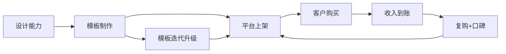
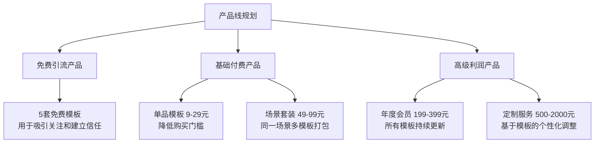
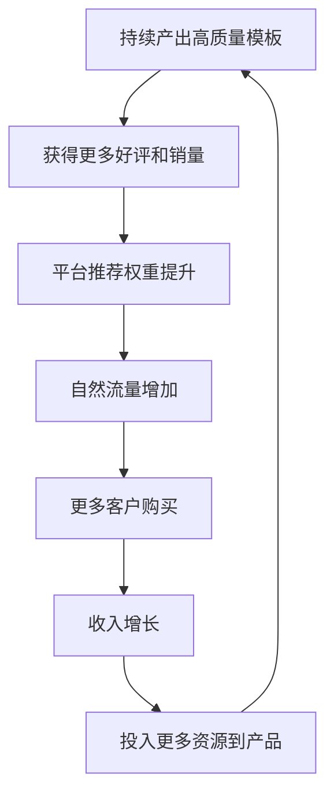

## 案例三：设计模板的数字产品生意

### 案例背景

#### 主人公画像

林晓婷，28岁，二线城市互联网公司UI设计师，月薪12000元。工作三年后陷入职业瓶颈——项目重复性高、晋升空间有限、加班频繁却看不到回报。她观察到一个现象：公司每年花费数万元购买PPT模板、简历模板、社交媒体素材，而这些模板的制作难度远低于日常工作中的UI设计。

这个观察点燃了她的副业思路：**能不能把自己擅长的设计能力，转化为可反复销售的数字模板产品？**

#### 市场机会分析

设计模板市场是一个被严重低估的被动收入赛道。以下是驱动这个市场持续增长的核心因素：

**需求端驱动力：**

| 驱动因素 | 具体表现 | 市场规模参考 |
|----------|----------|-------------|
| 自媒体爆发 | 小红书、抖音、公众号创作者需要大量视觉素材 | 中国自媒体从业者超2000万 |
| 远程办公常态化 | 企业需要统一风格的PPT、文档模板 | 2024年企业办公模板市场超50亿 |
| 个人品牌意识觉醒 | 个人简历、作品集、名片设计需求激增 | 求职季简历模板日搜索量超10万 |
| 中小企业数字化 | 小微企业无力雇佣专职设计，依赖模板 | 中小企业超5000万家 |
| AI工具降低门槛 | Canva等工具让非设计师也能修改模板 | Canva全球用户超1.9亿 |

**供给端优势：**

- 一次制作，无限销售，边际成本趋近于零
- 无需库存、物流、售后（相对实物产品）
- 客户自助下载使用，无需逐一交付
- 产品可不断迭代升级，老客户持续复购



#### 为什么选择"设计模板"而非其他数字产品

在众多数字产品类型中，设计模板具备独特优势：

| 对比维度 | 设计模板 | 电子书 | 在线课程 | 软件工具 |
|----------|----------|--------|----------|----------|
| 制作门槛 | 中等（需设计技能） | 低（写作即可） | 高（需录课设备） | 高（需编程能力） |
| 制作周期 | 2-7天/套 | 1-3个月 | 1-6个月 | 3-12个月 |
| 定价空间 | 9-299元/套 | 9-99元 | 99-9999元 | 99-9999元/年 |
| 复购频率 | 高（不同场景需不同模板） | 低（同主题不重复购买） | 中（进阶课程） | 高（续费） |
| 售后成本 | 极低（使用问题即可解答） | 低 | 中（答疑） | 高（bug修复） |
| 被动收入纯度 | ★★★★★ | ★★★★ | ★★★ | ★★★ |

---

### 完整执行过程

#### 第一阶段：市场调研与定位（第1-2周）

##### 1. 需求挖掘三板斧

林晓婷没有盲目开始制作，而是先花两周时间做市场调研。她用的方法并不复杂，但非常实用：

**方法一：平台搜索分析**

她在以下平台搜索"模板"相关关键词，记录搜索量、竞争度和价格区间：

- **Canva中国版（稿定设计）**：搜索热门模板分类
- **WPS稻壳儿**：查看付费模板排行和下载量
- **淘宝/闲鱼**：搜索"简历模板""PPT模板"看销量
- **小红书**：搜索"模板推荐"看用户真实需求
- **花瓣网/站酷**：查看设计师作品的受欢迎程度

**方法二：竞品分析**

找到平台上已有的模板卖家，分析他们的：
- 产品线布局（卖了哪些类型的模板）
- 定价策略（单个模板价格 vs 套装价格）
- 销量数据（哪个品类卖得最好）
- 用户评价（客户抱怨什么、喜欢什么）

**方法三：自身需求回溯**

回顾自己在工作和生活中，哪些场景下需要过模板但找不到满意的：
- 工作汇报PPT——要么太丑要么太贵
- 社交媒体配图——风格不统一、尺寸不对
- 个人简历——千篇一律没有设计感

##### 2. 确定细分赛道

通过调研，林晓婷排除了竞争最激烈的PPT模板红海市场，选择了一个更精准的细分方向：

**定位公式：目标人群 + 使用场景 + 设计风格**

她的最终定位：**为25-35岁职场女性提供小清新风格的社交媒体运营模板**

选择这个定位的逻辑：

| 决策因素 | 分析 |
|----------|------|
| 目标人群明确 | 职场女性是消费主力，付费意愿强 |
| 场景高频 | 社交媒体运营是日常需求，每周都需要新素材 |
| 风格差异化 | "小清新"风格在专业模板平台较少见，多在小红书等社区需求大 |
| 技能匹配 | 自己擅长这个风格，制作效率高 |
| 扩展性强 | 从社交媒体可延伸到简历、邀请函、活动海报等 |

##### 3. 产品线规划

她规划了三级产品线，从引流到利润逐层递进：



---

#### 第二阶段：产品制作与打磨（第3-6周）

##### 1. 工具选择与配置

林晓婷根据自身技能水平和产品需求，选定了以下工具链：

| 用途 | 工具选择 | 理由 | 学习成本 |
|------|----------|------|----------|
| 主力设计工具 | Figma（免费版） | 协作方便，导出格式多，社区资源丰富 | 中等 |
| 快速出图 | Canva Pro | 模板修改效率高，适合批量制作 | 低 |
| 矢量素材 | Adobe Illustrator | 处理图标、插画等矢量素材 | 高 |
| 图片处理 | Photoshop | 调色、抠图、合成 | 中等 |
| 配色方案 | Coolors.co | 快速生成和谐配色 | 极低 |
| 字体管理 | 字由 | 合规中文字体管理 | 极低 |
| 文件管理 | Notion | 产品清单、进度追踪、素材管理 | 低 |

**关键提醒：字体版权问题**

这是新手最容易踩的坑。商业模板中使用的字体必须有商用授权，否则面临侵权索赔。林晓婷的做法：

- 优先使用Google Fonts、思源字体等开源字体
- 购买方正字库个人商用授权（年费约500元）
- 在产品说明中明确标注所用字体及授权方式

##### 2. 第一批产品的制作流程

她没有追求一步到位，而是用MVP（最小可行产品）思路快速验证：

**制作流程（以"小红书封面模板套装"为例）：**

```text
Step 1: 需求定义（0.5天）
├── 确定目标：小红书封面图，1080×1440px
├── 场景：美食、穿搭、旅行、好物分享
├── 风格：小清新、留白多、字体文艺
└── 数量：首批发20张（4个场景×5张）

Step 2: 素材准备（1天）
├── 收集参考图（Pinterest、小红书热门笔记）
├── 整理配色方案（3-4套配色）
├── 准备字体组合（标题+正文各2-3款）
└── 制作基础元素（装饰线条、图标、色块）

Step 3: 模板设计（3天）
├── 先做3张打样，确认风格统一
├── 批量制作剩余模板
├── 确保每张模板风格一致但不雷同
└── 预留文字替换区域，标注修改说明

Step 4: 打包与定价（0.5天）
├── 导出PSD、AI、PNG三种格式
├── 编写使用说明文档
├── 设计产品展示封面图
└── 参考竞品定价（最终定价29元/套）
```

##### 3. 模板设计的核心原则

经过反复打磨，林晓婷总结出高销量模板必须满足的五个设计原则：

**原则一：易修改性 > 视觉炫酷**

模板的核心价值是"让非设计师也能做出好看的东西"。如果模板虽然好看但客户改不动，那就是失败的设计。

具体做法：
- 文字层和背景层分离，方便替换
- 使用智能对象（Smart Object），双击即可替换图片
- 颜色用全局色板管理，一键换色
- 每个可编辑元素都有清晰的图层命名

**原则二：风格统一但有变化**

一套20张模板，风格必须统一（同一配色体系、同一字体组合、同一排版逻辑），但每张之间要有足够的变化，避免"复制粘贴"感。

变化维度：
- 布局结构（居中/左对齐/右对齐/网格）
- 图文比例（大图小文/小图大文/纯文字）
- 装饰元素的位置和密度
- 色彩面积的主次分配

**原则三：预设合理的默认状态**

客户拿到模板时，里面的示例文字、图片、颜色应该是"开箱即用"的好看状态，而不是空白框架。这能大幅降低客户的使用焦虑。

**原则四：多格式适配**

同一套视觉风格，要适配不同平台的尺寸要求：
- 小红书封面：1080×1440px
- 抖音封面：1080×1920px
- 公众号头图：900×383px
- 朋友圈海报：1080×1920px

**原则五：附带使用教程**

在模板文件中嵌入一个"使用说明"页面，用截图+箭头标注的方式，告诉客户怎么修改文字、替换图片、调整颜色。这能显著减少售后咨询。

---

#### 第三阶段：平台上架与运营（第7-12周）

##### 1. 销售渠道选择

林晓婷采用了"一个主阵地 + 多个分发渠道"的策略：

| 渠道 | 角色 | 特点 | 分成比例 |
|------|------|------|----------|
| 小红书 | 主阵地 | 图文展示效果好，精准触达目标用户 | 免费引流到私域 |
| 微信公众号 | 私域沉淀 | 发布教程文章，建立专业形象 | 免费 |
| 微信小店 | 直接成交 | 交易流程简单，信任度高 | 平台抽成约1% |
| 稿定设计 | 专业平台 | 自带流量，被动收入 | 平台分成50% |
| 闲鱼 | 辅助渠道 | 价格敏感用户，走量 | 免费 |
| Gumroad | 海外市场 | 美元定价，汇率红利 | 平台抽成10% |

##### 2. 小红书运营策略

小红书是她获客的核心阵地，运营策略分为三类内容：

**内容类型一：模板展示（占比40%）**

- 展示模板的实际效果，用手机截图的方式呈现
- 标题公式：[场景] + [效果承诺] + [数量]，例如"小红书封面模板｜让你的笔记点赞翻倍｜20套一键替换"
- 每张图用模板实际效果图，不用mockup

**内容类型二：设计教程（占比35%）**

- 分享简单的设计技巧，展示专业能力
- 用"Before vs After"对比，突出模板的价值
- 标题公式：[痛点] + [解决方案]，例如"不会配色？3个公式让你告别设计灾难"

**内容类型三：使用场景（占比25%）**

- 展示客户使用模板后的实际效果
- 分享客户的成功案例和反馈
- 建立社会证明，降低新客户的决策门槛

##### 3. 定价策略详解

定价不是拍脑袋决定的，林晓婷用了一套系统方法：

**成本锚定法：**

```text
单套模板成本计算：
├── 制作时间：8小时 × 时薪100元 = 800元
├── 工具成本分摊：Canva Pro年费300元 ÷ 12个月 ÷ 4套/月 ≈ 6元/套
├── 素材成本分摊：部分付费素材约20元/套
└── 总成本：约826元/套

定价逻辑：
├── 目标回本周期：2个月
├── 预估月销量：15-30套
├── 单价 = 826 ÷ 30 ≈ 28元 → 定价29元
└── 实际验证：首月销量22套，第二个月38套 → 验证成功
```

**阶梯定价体系：**

| 产品层级 | 价格 | 目标 | 转化率 |
|----------|------|------|--------|
| 免费模板 | 0元 | 引流、建立信任 | 引导关注率35% |
| 单品模板 | 29元 | 低门槛首次购买 | 购买转化率8% |
| 场景套装（5套） | 99元 | 提升客单价 | 购买转化率12% |
| 全品类年卡 | 299元 | 锁定长期客户 | 购买转化率3% |

##### 4. 产品展示页设计

产品展示页是决定转化率的关键环节。林晓婷为每个产品精心设计了展示页面：

```text
展示页结构：
├── 主图：模板效果实拍（非mockup，更真实）
├── 卖点文字：3行以内说清"这是什么+为什么买"
├── 详情图（5-8张）：
│   ├── 第1张：全套模板缩略图一览
│   ├── 第2-4张：重点模板放大展示
│   ├── 第5张：使用前后对比
│   ├── 第6张：包含的文件格式说明
│   └── 第7张：客户好评截图
├── 规格说明：文件格式、尺寸、是否可编辑
└── 购买须知：使用范围、版权声明、退款政策
```

---

#### 第四阶段：自动化与规模化（第13-24周）

##### 1. 交付自动化

初期每单都需要手动发送下载链接，非常耗时。林晓婷逐步实现了自动化：

**自动化方案演进：**

```text
阶段1（手动）：客户付款 → 微信确认 → 手动发送网盘链接
痛点：响应慢，经常错过订单

阶段2（半自动）：客户付款 → 自动回复公众号关键词 → 触发自动回复下载链接
工具：微信公众号后台的关键词自动回复
痛点：需要维护关键词，文件过期需要更新

阶段3（全自动）：客户付款 → 系统自动发送邮件（含下载链接+使用说明）
工具：微信小店 + 自动发货插件
优势：24小时无人值守，客户体验好
```

##### 2. 产品线扩展节奏

林晓婷按照"验证-复制-扩展"的节奏稳步推进：

| 时间 | 动作 | 产品数量 | 月收入 |
|------|------|----------|--------|
| 第1个月 | 上架首批3套模板 | 3套 | 680元 |
| 第2个月 | 根据反馈优化，新增5套 | 8套 | 1,850元 |
| 第3个月 | 推出场景套装 | 12套+3个套装 | 3,200元 |
| 第4个月 | 扩展到简历/邀请函品类 | 20套 | 5,100元 |
| 第5个月 | 推出年卡会员 | 28套 | 7,800元 |
| 第6个月 | 开始接定制订单 | 35套+定制 | 10,200元 |
| 第8个月 | 稳定期，保持月更4-5套 | 50+套 | 12,000元 |
| 第12个月 | 建立设计师合作分润模式 | 100+套 | 18,000元 |

##### 3. 客户复购引擎

被动收入的关键不是一次性销售，而是持续复购。林晓婷搭建了一套复购体系：

**复购驱动机制：**

| 机制 | 具体做法 | 效果 |
|------|----------|------|
| 季节性更新 | 每季度推出应季模板（春游/毕业/圣诞/年终） | 老客户复购率提升40% |
| 会员专属更新 | 年卡会员每月收到新模板推送 | 年卡续费率55% |
| 定制客户转化 | 定制项目完成后推荐相关套装 | 定制客户二次购买率70% |
| 社群运营 | 建立设计交流群，分享技巧+新品预告 | 群内转化率是普通用户的3倍 |

---

#### 第五阶段：被动化与团队化（第25周以后）

##### 1. 从个人到团队

当月收入稳定在12000元以上后，林晓婷开始考虑扩大规模：

**设计师合作模式：**

```text
合作模式设计：
├── 签约设计师：按月支付底薪 + 销售分成
│   ├── 底薪：2000-3000元/月
│   ├── 分成：该设计师产品销售额的30%
│   └── 要求：每月产出4-6套模板，风格统一审核
├── 兼职设计师：纯分成模式
│   ├── 分成：该设计师产品销售额的50%
│   └── 要求：风格需符合品牌调性，质量审核通过
└── 质量控制：
    ├── 统一设计规范文档
    ├── 每套模板上线前审核
    └── 定期收集客户反馈优化
```

##### 2. 真正的被动化状态

运营一年后，林晓婷的业务达到了高度自动化状态：

**日常运营时间分配：**

| 事项 | 频率 | 耗时 | 是否可委托 |
|------|------|------|-----------|
| 新模板审核 | 每周1次 | 2小时 | 可培养审核助手 |
| 小红书内容发布 | 每周3次 | 30分钟/次 | 可交给助理 |
| 客户咨询回复 | 随机 | 15分钟/天 | 已用FAQ自动回复解决80% |
| 数据分析 | 每月1次 | 2小时 | 可建立自动化报表 |
| 合计 | — | 约6小时/周 | 目标：2小时/周 |

---

### 成果数据

#### 核心指标对比

| 指标 | 起步时（第1个月） | 半年后 | 一年后 |
|------|-------------------|--------|--------|
| 月收入 | 680元 | 12,000元 | 18,000元 |
| 产品数量 | 3套 | 50套 | 100+套 |
| 月销量 | 25单 | 280单 | 450单 |
| 客单价 | 27元 | 43元 | 40元 |
| 复购率 | 0% | 45% | 60% |
| 每周投入时间 | 25小时 | 8小时 | 6小时 |
| 时薪（有效） | 6.8元 | 150元 | 300元 |

#### 收入结构分析（一年后）

| 收入来源 | 月均收入 | 占比 | 被动程度 |
|----------|----------|------|----------|
| 单品模板销售 | 5,400元 | 30% | ★★★★★ |
| 场景套装销售 | 4,500元 | 25% | ★★★★★ |
| 年卡会员续费 | 3,600元 | 20% | ★★★★★ |
| 稿定设计平台分成 | 2,700元 | 15% | ★★★★★ |
| 定制服务 | 1,800元 | 10% | ★★★ |

#### 关键里程碑

```text
时间线：
├── 第1周：完成市场调研，确定细分定位
├── 第3周：首批3套模板上架
├── 第5周：收到第一个五星好评
├── 第8周：月收入突破1000元
├── 第12周：小红书粉丝突破2000
├── 第16周：月收入突破5000元
├── 第20周：推出年卡会员
├── 第24周：月收入稳定在12000元以上
├── 第36周：签约第一位合作设计师
├── 第48周：月收入突破18000元
└── 第52周：业务95%自动化运行
```

---

### 经验总结与深度复盘

#### 1. 选对方向比努力更重要

林晓婷复盘时最大的感悟是：**定位决定天花板**。

她最初考虑过做PPT模板，但调研后发现：
- PPT模板市场已经极度红海，头部卖家占据80%流量
- 价格被压到9.9元/套，利润空间极小
- 模板同质化严重，新进入者很难突围

转做社交媒体运营模板后：
- 竞争相对蓝海，细分领域没有绝对头部
- 定价空间更大（29-99元），利润率更高
- 客户使用频率高，复购率远高于PPT模板

**选赛道的评估框架：**

```text
评估维度（每项1-10分）：
├── 市场需求强度：用户是否真的需要？搜索量/讨论量如何？
├── 竞争激烈程度：已有多少卖家？头部集中度如何？
├── 自身匹配度：你的技能/经验/资源是否匹配？
├── 利润空间：能否支撑合理的定价？利润率如何？
├── 复购潜力：客户会反复购买吗？
└── 扩展性：能否从这个点延伸到更大的市场？

总分 > 35分：值得投入
总分 25-35分：谨慎尝试
总分 < 25分：建议放弃
```

#### 2. 坚持输出的本质是建立飞轮

"坚持输出"不是盲目坚持，而是在正确的方向上持续积累，直到飞轮效应启动。

林晓婷的飞轮模型：



飞轮启动的关键节点：**累计销量突破100单**。在此之前是纯投入期，需要耐心。

#### 3. 服务至上体现在细节

"服务至上"不是口号，而是体现在每一个客户触点：

| 触点 | 标准做法 | 额外加分项 |
|------|----------|-----------|
| 购买前 | 产品说明清晰完整 | 提供免费试用模板 |
| 购买中 | 下载链接即时可用 | 多格式多平台适配 |
| 使用中 | 附带使用教程 | 建立FAQ文档 |
| 售后问题 | 24小时内回复 | 主动询问使用体验 |
| 复购激励 | 新品上线通知 | 老客户专属折扣 |

**一个真实细节：** 有客户反馈某套模板在WPS中打开格式错乱，林晓婷当天就修复了兼容性问题，并额外赠送了一套新模板作为感谢。这个客户后来成了年卡会员，并在小红书发了一篇推荐笔记，带来了15个新客户。

#### 4. 数据驱动的决策闭环

林晓婷每周花1小时分析数据，用数据指导产品迭代：

**核心数据指标：**

| 指标 | 含义 | 优化方向 |
|------|------|----------|
| 浏览→点击率 | 产品封面是否吸引人 | 优化封面设计 |
| 点击→购买率 | 产品详情页是否有说服力 | 优化展示页和定价 |
| 单品销量排名 | 哪类模板最受欢迎 | 加大该品类投入 |
| 客户来源分布 | 哪个渠道效果最好 | 集中资源到高效渠道 |
| 退款率 | 产品质量是否达标 | 针对性优化高退款产品 |
| 复购周期 | 客户多久回来买第二次 | 在复购周期节点推送新品 |

#### 5. 常见错误与避坑指南

基于林晓婷的经验以及其他模板卖家的踩坑案例，以下是新手最容易犯的错误：

**错误一：一开始就追求完美**

新手往往花几个月打磨一套"完美"模板，结果市场已经变了。

正确做法：用MVP思维，先做出80分的产品快速上架，根据市场反馈迭代到95分。

**错误二：忽视版权问题**

使用未授权的字体、图片、素材，面临侵权索赔风险。一位同行因使用未授权字体被索赔2万元，相当于半年的收入。

正确做法：建立素材版权清单，只使用有明确商用授权的资源。

**错误三：定价过低**

新手容易陷入"低价走量"的误区。但低价会吸引价格敏感型客户，他们的售后问题多、复购率低、还会影响品牌形象。

正确做法：根据价值定价而非成本定价。一套能帮客户省下500元设计费的模板，卖99元是合理的。

**错误四：只做一个平台**

依赖单一平台的风险很大——平台规则变化、流量波动都可能让收入断崖式下跌。

正确做法：一个主阵地 + 2-3个辅助渠道分散风险。

**错误五：忽视老客户**

获客成本是维系老客户成本的5-7倍。只关注拉新不维护老客户，是在浪费资源。

正确做法：建立客户分层体系，针对不同层级的客户设计不同的触达策略。

---

### 进阶策略

#### 1. 品牌化运营

当模板数量达到50套以上，应该从"卖模板"转向"卖品牌"：

- 建立统一的品牌视觉体系（logo、配色、排版风格）
- 在所有平台保持一致的品牌调性
- 通过内容输出建立行业影响力
- 考虑注册商标保护品牌

#### 2. 跨平台矩阵

| 平台 | 策略 | 目标 |
|------|------|------|
| 小红书 | 图文+视频教程 | 品牌曝光+引流 |
| 抖音 | 设计过程短视频 | 触达更广泛的用户群 |
| B站 | 长视频教程 | 建立专业深度 |
| 知乎 | 回答设计相关问题 | SEO长尾流量 |
| 即刻 | 分享设计心得 | 触达设计圈层 |

#### 3. 从模板到课程

当积累足够多的案例和经验后，可以将模板生意升级为设计教育生意：

```text
升级路径：
模板产品（29元/套）
    ↓ 客户问"怎么做出这种效果"
设计教程（99-199元）
    ↓ 学员问"怎么系统学习"
设计训练营（999-2999元）
    ↓ 优秀学员想接单
设计师社群/经纪（年费制）
```

#### 4. AI协作提效

2024年以后，AI工具已经成为模板制作的效率倍增器：

| AI工具 | 用途 | 效率提升 |
|--------|------|----------|
| Midjourney/DALL-E | 生成示例图片素材 | 省去素材采购时间 |
| ChatGPT | 撰写产品文案、使用说明 | 文案产出速度提升5倍 |
| Adobe Firefly | AI辅助图片编辑 | 复杂修图时间减少70% |
| Remove.bg | 一键抠图 | 批量处理效率提升10倍 |

---

### 延伸阅读

- [案例一：从零开始的电子书被动收入](01-案例一从零开始的电子书被动收入.md)
- [案例二：股息投资组合的被动收入之路](02-案例二股息投资组合的被动收入之路.md)
- [案例四：自动化联盟营销网站](04-案例四自动化联盟营销网站.md)
- 被动收入工具箱
