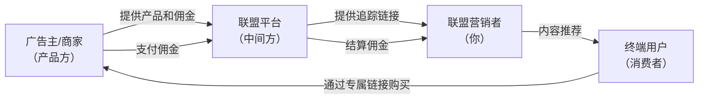
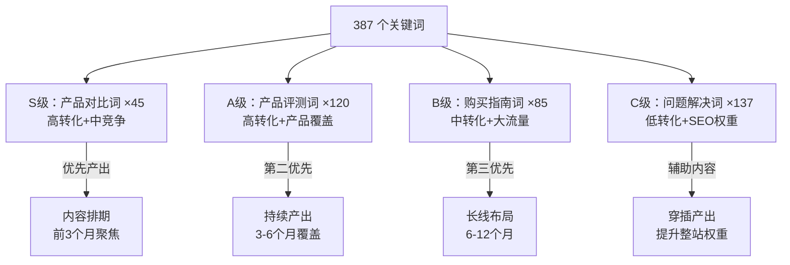
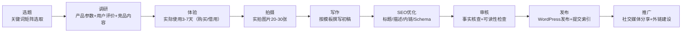
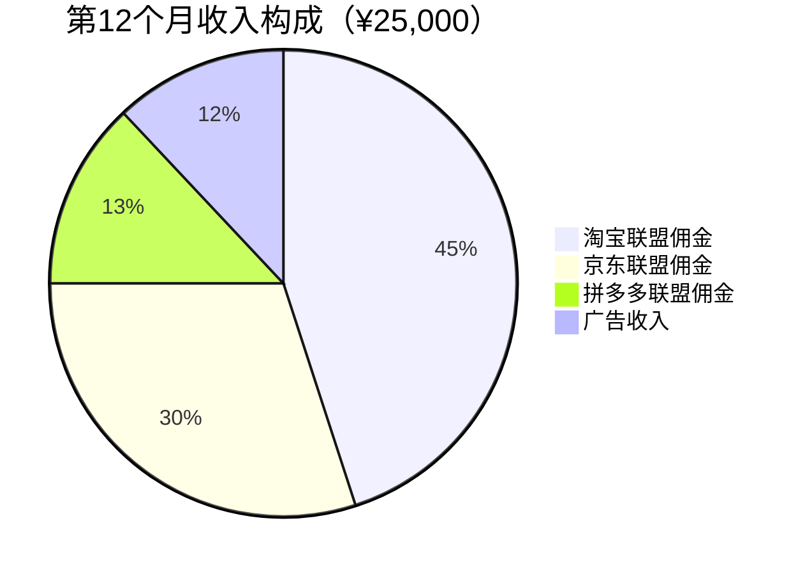
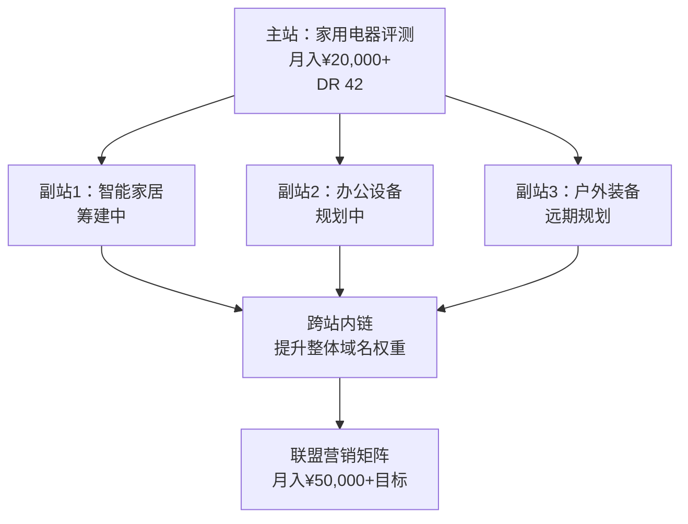

## 案例四：自动化联盟营销网站

联盟营销（Affiliate Marketing）是被动收入领域中"自动化程度最高"的商业模式之一。它的核心逻辑极其简单：**你推荐别人的产品，用户通过你的专属链接购买，你赚取佣金。** 你不需要开发产品、处理物流、提供售后——这些全部由商家负责。你的工作是搭建一个能持续获取精准流量的网站，然后让内容替你完成销售。

这个案例的主角是一位名叫张磊（化名）的前互联网运营从业者。他在 2022 年辞职后，用 4 个月时间全职搭建了一个专注于"家用电器评测"的联盟营销网站，10 个月后月收入稳定在 8,000-25,000 元区间，巅峰月份突破 30,000 元。整个网站在成熟期只需要每周投入 5-8 小时进行内容维护和数据优化，真正实现了"被动化"。

这个案例之所以值得深入研究，是因为它完整展示了从零搭建一个自动化赚钱系统的全过程：**选品定位→建站技术→内容策略→SEO 优化→流量获取→收入增长→被动化运营**，每一步都有可量化的数据和可复制的方法论。

---

### 案例背景

#### 为什么选择联盟营销

张磊在选择被动收入方向时，用了一个系统化的评估框架，对比了四种可行方案：

| 评估维度 | 联盟营销网站 | 电子书 | 在线课程 | SaaS 产品 |
|---------|------------|--------|---------|----------|
| **启动资金** | ¥2,000-5,000 | ¥0-500 | ¥1,000-3,000 | ¥10,000-50,000 |
| **技术门槛** | 中等（建站+SEO） | 低（写作） | 中等（录制+平台） | 高（开发+运维） |
| **变现速度** | 慢（3-6个月） | 中（1-3个月） | 中（2-4个月） | 慢（6-12个月） |
| **自动化程度** | 高（内容常青） | 高（一次写作） | 中（需更新） | 高（但需维护） |
| **收入天花板** | 高（可复制） | 低（单品） | 中（依赖个人IP） | 高（但前期投入大） |
| **长期可持续性** | 高（SEO 复利） | 中（内容生命周期） | 中（课程迭代） | 高（但竞争激烈） |

最终选择联盟营销的核心原因有三个：

1. **SEO 的复利效应**：一篇排名稳定的评测文章可以持续 2-3 年带来流量和佣金，不需要持续投放广告
2. **零库存零客服**：所有产品相关的事务由商家处理，你只需要专注于内容和流量
3. **可无限复制**：同一个方法论可以应用到不同细分领域，搭建多个站点

#### 联盟营销的商业模式解析

在深入案例之前，必须理解联盟营销的完整商业链条：



**四个关键角色：**

- **广告主（Merchant）**：提供产品或服务的商家，比如京东、淘宝、Amazon 上的品牌方。他们愿意支付销售额的 5%-50% 作为佣金，因为联盟营销是"按效果付费"——只有真正成交了才需要付钱
- **联盟平台（Affiliate Network）**：连接广告主和营销者的中间平台。国内有淘宝联盟（淘宝客）、京东联盟、多多进宝；海外有 Amazon Associates、ShareASale、CJ Affiliate、Impact 等。平台负责追踪链接、统计佣金、处理结算
- **联盟营销者（Affiliate）**：也就是你。通过创建内容（评测、指南、对比文章）吸引目标用户，在内容中嵌入联盟链接
- **终端用户（Consumer）**：通过你的内容了解产品，点击你的联盟链接完成购买

**佣金模式对比：**

| 佣金类型 | 说明 | 典型比例 | 适用场景 |
|---------|------|---------|---------|
| CPS（按销售额） | 用户购买后按订单金额抽佣 | 5%-50% | 最常见，电商/软件/课程 |
| CPA（按行为） | 用户完成注册、下载等行为 | ¥1-50/次 | App推广、金融开户 |
| CPC（按点击） | 用户点击链接 | ¥0.1-2/次 | 极少使用，质量难控 |
| RevShare（收入分成） | 用户持续付费的分成 | 20%-50% | SaaS、订阅制产品 |

张磊选择的是**CPS 模式**，主攻高客单价家电品类（客单价 ¥500-5,000），佣金率 3%-8%，单笔佣金 ¥15-400 不等。

---

### 第一阶段：市场调研与选品定位（第1-2周）

#### 利基市场选择的三层筛选法

联盟营销成功的第一步，也是最关键的一步，是选择正确的利基市场（Niche）。张磊用了三层漏斗来筛选：

**第一层：兴趣 × 知识交叉**

列出自己感兴趣且有一定知识储备的领域，排除完全不了解的方向。张磊列出了：家用电器、健身器材、办公用品、摄影器材、汽车配件。

**第二层：商业价值验证**

用以下指标验证每个领域的商业潜力：

| 验证指标 | 具体方法 | 合格标准 |
|---------|---------|---------|
| 搜索量 | 用 5118/百度关键词规划师查询核心词月搜索量 | 核心词月搜索量 > 5,000 |
| 竞争度 | 搜索核心词看前10名网站的域名权重 | 至少有 2-3 个 DR<40 的网站能排进前10 |
| 佣金率 | 查看对应联盟平台的佣金政策 | 佣金率 > 3% 或客单价 > ¥300 |
| 内容空间 | 相关长尾关键词数量 | 可挖掘的长尾词 > 200 个 |
| 产品迭代 | 品类是否有持续新品 | 每年有新款/新型号（保证内容常青） |

**第三层：竞争格局分析**

对通过前两层筛选的领域，分析现有竞争者：

```text
竞争对手分析模板：
┌─────────────────────────────────────────────────────┐
│ 竞品网站：xxx.com                                    │
│ 域名权重（DR）：35                                    │
│ 月访问量估算：50,000                                  │
│ 内容数量：120 篇                                      │
│ 内容类型：评测(60%) / 对比(25%) / 指南(15%)           │
│ 变现方式：联盟链接(主) + 广告(辅)                      │
│ 内容质量：中等偏上，有原创图片                          │
│ 更新频率：每周 1-2 篇                                  │
│ 可超越点：深度不够、无视频、无用户评测数据               │
└─────────────────────────────────────────────────────┘
```

经过三轮筛选，张磊最终选择了**家用电器评测**这个利基，理由：

1. 客单价高（¥500-5,000），单笔佣金可观
2. 用户购买前一定会搜索评测和对比，搜索意图明确
3. 产品持续迭代，每年有新品需要评测，内容不会过时
4. 竞争者内容质量参差不齐，有差异化空间
5. 自己有 3 年互联网运营经验，对消费电子有基本认知

#### 关键词矩阵搭建

选定利基后，张磊花了 3 天时间搭建了一个完整的关键词矩阵，这是整个内容策略的基石。

关键词分为四类：

| 关键词类型 | 搜索意图 | 示例 | 转化率 | 流量潜力 |
|-----------|---------|------|--------|---------|
| **产品评测词** | 已有购买意向，需要决策参考 | "戴森V15评测" "小米净水器怎么样" | 高（8-15%） | 中 |
| **产品对比词** | 在多个选项中犹豫 | "戴森V15 vs 追觅V16" "净水器哪个牌子好" | 高（10-20%） | 中高 |
| **购买指南词** | 处于决策早期 | "2024年扫地机器人推荐" "家用净水器怎么选" | 中（3-8%） | 高 |
| **问题解决词** | 有痛点但不知道需要什么产品 | "家里水质不好怎么办" "地板总是有灰尘" | 低（1-3%） | 极高 |

张磊的关键词矩阵最终包含 **387 个关键词**，按优先级排序：



---

### 第二阶段：技术搭建（第2-3周）

#### 建站技术栈选择

张磊对比了三种主流建站方案：

| 方案 | 成本 | SEO 友好度 | 自定义程度 | 维护难度 | 选择 |
|------|------|-----------|-----------|---------|------|
| WordPress + 主题 | 域名¥60/年 + 主机¥300-800/年 | ★★★★★ | ★★★★★ | ★★★☆☆ | **✓ 选择** |
| 静态站点生成器（Hugo/Hexo） | 域名¥60/年 + 托管免费 | ★★★★☆ | ★★★★☆ | ★★☆☆☆ | 备选 |
| SaaS 建站（Wix/Squarespace） | ¥100-300/月 | ★★★☆☆ | ★★★☆☆ | ★☆☆☆☆ | 排除 |

选择 WordPress 的核心原因：

1. **SEO 生态成熟**：Yoast SEO / Rank Math 等插件可以大幅降低 SEO 优化的技术门槛
2. **插件丰富**：数万个插件覆盖几乎任何功能需求，不需要自己开发
3. **社区庞大**：遇到问题几乎都能找到解决方案
4. **内容管理便捷**：可视化编辑器让内容发布效率极高

#### 完整技术栈清单

```text
域名：Namesilo 购买（¥60/年，含隐私保护）
主机：Cloudways（DigitalOcean 线路，¥280/月，含 CDN）
CMS：WordPress 6.x
主题：GeneratePress Premium（¥300/年，轻量+SEO友好）
SEO 插件：Rank Math Pro（¥400/年）
缓存插件：WP Rocket（¥300/年）
图片优化：ShortPixel（¥20/月，5万张配额）
联盟链接管理：ThirstyAffiliates Pro（¥100/年）
数据分析：Google Analytics 4 + Google Search Console（免费）
关键词研究：5118（¥200/年基础版）+ Ahrefs（按需使用免费版）
年总成本：约 ¥5,000-6,000
```

#### 网站结构设计

网站的信息架构直接影响 SEO 表现和用户体验。张磊设计了三层结构：

```text
首页
├── 评测中心
│   ├── 扫地机器人评测
│   │   ├── 戴森V15评测
│   │   ├── 追觅V16评测
│   │   └── ...
│   ├── 净水器评测
│   ├── 空气净化器评测
│   └── ...
├── 对比专区
│   ├── 扫地机器人对比
│   │   ├── 戴森V15 vs 追觅V16
│   │   └── ...
│   └── ...
├── 选购指南
│   ├── 2024扫地机器人选购指南
│   ├── 家用净水器选购指南
│   └── ...
├── 问题解答
│   ├── 家里灰尘多怎么办
│   └── ...
└── 关于我们 / 联系方式 / 免责声明
```

这种结构的 SEO 优势在于：

- **主题聚类（Topic Cluster）**：同一品类的内容通过内链形成语义关联，提升整站在该品类的权威性
- **URL 层级清晰**：`/reviews/robot-vacuum/dyson-v15-review/` 这样的 URL 结构让搜索引擎和用户都能快速理解页面内容
- **面包屑导航**：帮助搜索引擎理解页面层级关系，同时在搜索结果中展示丰富的摘要信息

---

### 第三阶段：内容生产（第3周-第4个月）

#### 内容类型与模板

张磊开发了四种标准化的内容模板，每种模板都有明确的结构规范：

**模板一：单品评测（占比 50%）**

```markdown
# [产品名] 深度评测：[一句话卖点]
## 产品概览（参数表格：价格/尺寸/重量/核心功能）
## 核心功能实测（3-5个核心功能，每个配实拍图）
## 优点与不足（对比表格：5个优点+3个不足）
## 适合谁买 / 不适合谁买
## 与竞品对比（简要对比2-3个竞品）
## 最终结论与购买建议
## 常见问题（FAQ 3-5个，用 Schema 标记）
```

**模板二：横向对比（占比 25%）**

```markdown
# [产品A] vs [产品B]：2024年到底选哪个？
## 一句话结论（给不想看全文的用户）
## 对比维度总览（大表格：10+维度逐一打分）
## 设计与做工对比
## 核心性能对比（实测数据）
## 使用体验对比
## 价格与性价比对比
## 最终推荐（分场景：预算型/均衡型/旗舰型）
```

**模板三：选购指南（占比 15%）**

```markdown
# [品类]怎么选？2024年最全选购指南
## 先看结论：我们的 Top 3 推荐
## 选购前必须了解的 N 个参数
## 不同预算的推荐方案（表格）
## 常见选购误区
## 维护保养建议
## 最终购买建议
```

**模板四：问题解决型（占比 10%）**

```markdown
# [问题描述]？完整解决方案
## 问题原因分析
## 解决方案总览
## 方案一：不花钱的方法
## 方案二：花小钱的方法（推荐相关产品）
## 方案三：一步到位的方法（推荐高端产品）
## 预防措施
```

#### 内容生产效率与质量平衡

张磊的内容生产经历了三个阶段的效率提升：

| 阶段 | 时间 | 单篇耗时 | 产出量 | 关键改进 |
|------|------|---------|--------|---------|
| 学习期 | 第1-2月 | 8-10小时/篇 | 2篇/周 | 摸索写作流程，建立模板 |
| 熟练期 | 第3-4月 | 4-6小时/篇 | 3-4篇/周 | 标准化流程，批量采集数据 |
| 自动化期 | 第5月起 | 2-3小时/篇（含外包） | 4-6篇/周 | 外包初稿+自己审核优化 |

**一篇评测文章的完整生产流程：**



#### 关键内容策略

**1. "先对比后评测"策略**

张磊发现，对比类内容的转化率（12-18%）远高于单品评测（6-10%），因为搜索对比词的用户已经处于购买决策的最后阶段。因此他优先产出对比文章，再针对对比文章中提到的产品写详细评测——评测文章通过内链获得对比文章的流量溢出。

**2. "常青内容+时效内容"组合**

- 常青内容（占比 70%）：选购指南、技术解析、使用方法——这些内容 2-3 年内不过时
- 时效内容（占比 30%）：新品首发评测、节日促销指南、年度榜单——这些内容在发布后 1-3 个月内流量最大

**3. "数据驱动"的实测风格**

区别于大多数联盟营销网站"复制厂商参数"的做法，张磊坚持实测：

- 扫地机器人：实测清洁率（用标准重量的碎屑测试）、噪音分贝、续航时间
- 净水器：实测 TDS 值变化、出水速度、废水比
- 空气净化器：实测 PM2.5 下降速度、不同档位噪音

这些实测数据成为内容的核心差异化优势，也是用户信任的基础。

---

### 第四阶段：SEO 优化与流量增长（第2-12个月）

#### 技术 SEO 基础

技术 SEO 是一切优化的前提。张磊在建站初期就完成了以下技术优化：

**页面速度优化（Core Web Vitals）：**

| 指标 | 优化前 | 优化后 | 方法 |
|------|--------|--------|------|
| LCP（最大内容绘制） | 4.2s | 1.8s | WP Rocket 缓存 + CDN + 图片 WebP 格式 |
| FID（首次输入延迟） | 180ms | 40ms | 延迟加载非关键 JS + 移除未使用 CSS |
| CLS（累积布局偏移） | 0.25 | 0.05 | 为所有图片/视频设置固定宽高比 |

**结构化数据标记（Schema Markup）：**

为不同类型的内容添加对应的 Schema 标记：

- 评测文章：`Review` + `Product` Schema，搜索结果中展示星级评分
- 对比文章：`Article` + `FAQ` Schema
- 选购指南：`HowTo` + `FAQ` Schema
- 所有页面：`BreadcrumbList` Schema（面包屑导航）

这些结构化数据让网站在搜索结果中的点击率（CTR）提升了 30-50%。

**站内 SEO 清单：**

```text
☑ 每篇文章唯一且包含核心关键词的 Title Tag（<60字符）
☑ 每篇文章唯一且有行动号召的 Meta Description（<155字符）
☑ H1 标签唯一且包含核心关键词
☑ 图片全部添加描述性 Alt 文字
☑ 内链网络：每篇文章至少 3-5 个内链
☑ 外链：每篇文章至少引用 1-2 个权威来源
☑ URL 结构：短且包含关键词
☑ Sitemap.xml 自动生成并提交到 Google Search Console
☑ Robots.txt 正确配置
☑ HTTPS 全站启用
☑ 移动端自适应（响应式设计）
```

#### 外链建设策略

外链（Backlinks）是 SEO 排名最重要的因素之一。张磊采用了三种白帽外链建设方法：

**方法一：客座文章（Guest Posting）**

在相关领域的博客和媒体上发表客座文章，文章中自然嵌入指向自己网站的链接。张磊平均每周投稿 2 篇，成功率约 40%，每月获得 8-12 条高质量外链。

**方法二：断链建设（Broken Link Building）**

用 Ahrefs 或 Screaming Frog 找到竞争对手网站上的 404 页面，然后联系引用了这些断链的网站，建议用自己对应内容替换。这个方法成功率约 10-15%，但获得的外链质量通常很高。

**方法三：数据驱动的内容营销**

制作原创数据内容（如"2024年扫地机器人市场调查报告"），这类内容自然吸引其他网站引用。张磊制作的"中国家庭净水器使用调查"被 15 个行业媒体引用，一次性获得 15 条高质量外链。

**外链增长曲线：**

| 月份 | 新增外链 | 累计外链 | DR（域名权重） |
|------|---------|---------|--------------|
| 第1月 | 5 | 5 | 2 |
| 第3月 | 25 | 45 | 15 |
| 第6月 | 40 | 130 | 28 |
| 第9月 | 35 | 230 | 35 |
| 第12月 | 30 | 340 | 42 |

#### 流量增长数据

流量增长呈现典型的"S 曲线"——前期增长缓慢，中期加速，后期趋于稳定：

| 月份 | 月PV | 月UV | 核心词排名前10数量 | 主要增长驱动 |
|------|------|------|-----------------|------------|
| 第1月 | 200 | 120 | 0 | 初始收录 |
| 第3月 | 3,500 | 2,100 | 5 | 长尾词开始排名 |
| 第6月 | 25,000 | 15,000 | 28 | 核心词陆续进入首页 |
| 第9月 | 68,000 | 42,000 | 52 | 外链+内容量积累突破 |
| 第12月 | 120,000 | 75,000 | 78 | 整站权威性建立 |

**第 6 个月是关键转折点**——在此之前，每月投入大于收入；从第 6 个月开始，流量和收入开始加速增长，边际投入递减。

---

### 第五阶段：变现与收入增长（第4-12个月）

#### 联盟项目选择与佣金结构

张磊注册了三个联盟平台，针对不同品类选择最优佣金方案：

| 联盟平台 | 适用品类 | 佣金率 | 结算周期 | 起付金额 |
|---------|---------|--------|---------|---------|
| 京东联盟 | 大家电（冰箱/洗衣机/空调） | 3%-5% | T+1 月 | ¥100 |
| 淘宝联盟 | 小家电（扫地机器人/净水器） | 5%-12% | T+1 月 | ¥10 |
| 拼多多联盟 | 性价比产品 | 8%-15% | T+1 月 | ¥10 |

**佣金优化策略：**

1. **高佣活动追踪**：关注联盟平台的大促活动（618/双11/年货节），活动期间佣金率通常会翻倍甚至三倍
2. **多平台比价**：同一产品在不同联盟平台的佣金率不同，用链接管理插件自动选择最高佣
3. **组合推荐策略**：在评测文章中推荐"主推款+升级款+入门款"三个价位，覆盖不同预算的用户

#### 收入增长曲线

| 月份 | 联盟佣金收入 | 广告收入 | 月总收入 | 月投入时间 |
|------|------------|---------|---------|-----------|
| 第1月 | ¥0 | ¥0 | ¥0 | 160小时 |
| 第3月 | ¥350 | ¥50 | ¥400 | 140小时 |
| 第6月 | ¥3,200 | ¥400 | ¥3,600 | 120小时 |
| 第9月 | ¥12,500 | ¥1,800 | ¥14,300 | 60小时 |
| 第12月 | ¥22,000 | ¥3,000 | ¥25,000 | 30小时 |
| 第18月 | ¥18,000 | ¥3,500 | ¥21,500 | 20小时 |

**关键观察：**

- 第 12 个月是收入峰值，因为包含了双 11 大促的高额佣金
- 第 18 个月收入略有下降但投入时间也大幅减少——这才是真正的"被动"状态
- 广告收入（通过 Google AdSense 或百度联盟）作为补充，占总收入的 10-15%

#### 收入构成分析



---

### 第六阶段：被动化运营（第10个月起）

#### 自动化系统搭建

被动化的核心是**用系统替代人工**。张磊搭建了以下自动化系统：

**1. 内容更新自动化**

- 设置 Google Alerts 和行业 RSS 订阅，自动监控新品发布信息
- 用 Zapier 将新品信息自动推送到 Notion 的选题库
- 每周只需花 30 分钟从选题库中选择本周要写的内容

**2. 链接维护自动化**

- ThirstyAffiliates 插件自动检测失效链接并发出告警
- 联盟平台 API 对接，当产品下架或价格变动时自动通知
- 每月花 2 小时集中处理链接维护

**3. 数据监控自动化**

- Google Analytics 4 设置自动报告，每周发送到邮箱
- Search Console 监控排名波动，异常时自动告警
- 联盟平台数据自动汇总到 Google Sheets 仪表盘

**4. 内容生产外包**

这是被动化最关键的一步。张磊建立了一个标准化的外包流程：

```text
外包生产流程：
1. 从关键词矩阵中选取本周要写的关键词（5分钟）
2. 按模板生成详细的内容大纲（10分钟）
3. 将大纲+参考素材发给外包写手（5分钟）
4. 外包写手 3-5 天后交付初稿
5. 张磊审核（事实核查+SEO优化+联盟链接嵌入）→ 30-40分钟/篇
6. 发布+提交索引（10分钟）
```

外包写手的筛选标准：

- 有家电或消费电子相关写作经验
- 能接受实测要求（需要实际使用产品）
- 稿费：¥300-500/篇（3000-5000字评测文章）
- 通过 3 篇试稿考核后正式合作

经过筛选，张磊最终固定了 2 名兼职写手，每周各交付 1-2 篇初稿。张磊自己每周只需要投入 5-8 小时进行审核和发布。

#### 被动化运营的周工作时间表

| 任务 | 频率 | 耗时 | 说明 |
|------|------|------|------|
| 审核外包稿件 | 每周 2-3 篇 | 2-3小时 | 事实核查+SEO优化+链接嵌入 |
| 发布新内容 | 每周 2-3 篇 | 0.5小时 | WordPress 发布+提交索引 |
| 数据审查 | 每周 1 次 | 0.5小时 | 流量/排名/佣金异常检查 |
| 链接维护 | 每月 1 次 | 2小时 | 失效链接修复+新品链接添加 |
| 内容更新 | 每月 2-3 篇 | 2小时 | 更新旧文章中的过时信息 |
| **周均总投入** | | **5-8小时** | |

---

### 踩过的坑与关键教训

#### 坑一：忽视 E-E-A-T，被算法惩罚

**发生了什么：** 第 4 个月，网站流量从 15,000 PV 骤降到 5,000 PV。排查后发现是一次 Google 核心算法更新导致的排名下降。

**根本原因：** 网站缺少"E-E-A-T"信号（Experience 经验、Expertise 专业性、Authoritativeness 权威性、Trustworthiness 可信度）。具体表现为：

- 没有真实的作者介绍页面
- 没有展示实拍图片和实测数据
- 免责声明和隐私政策不完善
- 没有引用权威来源

**修复措施：**

1. 创建详细的"关于我们"页面，展示团队背景和评测方法论
2. 所有评测文章增加"实测数据"板块，附实拍图片
3. 添加完整的免责声明、隐私政策、编辑政策页面
4. 每篇文章引用 2-3 个权威来源（国家标准、行业报告、官方数据）
5. 添加作者简介 Schema 标记

**恢复时间：** 约 6 周后流量逐步恢复，2 个月后超过之前的水平。

#### 坑二：过度优化锚文本，触发算法过滤

**发生了什么：** 为了让特定关键词快速排名，张磊在所有外链和内链中都使用了精确匹配锚文本（比如所有外链的锚文本都是"扫地机器人推荐"）。第 5 个月被 Google Penguin 算法过滤，多个核心词排名消失。

**修复措施：**

1. 将锚文本分布调整为：品牌词 30%、裸链 20%、自然短语 30%、精确匹配 20%
2. 用 Ahrefs 导出所有外链，联系站长修改不自然的锚文本
3. 内链锚文本多样化：使用"这篇文章""详见这里""根据XX评测"等自然表述

**教训：** SEO 优化必须看起来自然。搜索引擎的底线是：你的优化行为不能明显是为了操纵排名。

#### 坑三：选品佣金率低于预期

**发生了什么：** 前 3 个月精心撰写的 30 篇文章，实际佣金率只有 2-3%，远低于联盟平台宣传的 5-8%。

**根本原因：** 联盟平台的"佣金率"是最高佣金率，实际佣金取决于：

- 产品类别（大家电佣金低，小家电佣金高）
- 用户是否使用优惠券（使用优惠券后佣金可能降低或归零）
- 用户是否在 Cookie 有效期内购买（淘宝联盟 Cookie 有效期仅 24 小时）
- 是否是新客（老客佣金通常低于新客）

**优化措施：**

1. 调整选品策略，增加高佣品类（小家电、智能家居配件）的比重
2. 在文章中优先推荐店铺优惠券和平台活动，提高用户转化率
3. 用 DeepLink 工具生成直达商品页的链接，缩短用户决策路径
4. 对接多个联盟平台，同一产品选择佣金最高的平台

#### 坑四：内容同质化严重，缺乏竞争力

**发生了什么：** 第 3 个月时，网站内容和竞品高度同质化——同样的产品参数、相似的优缺点、几乎一样的结论。用户没有理由选择自己的网站。

**差异化策略：**

1. **引入实测数据**：购买或借用产品进行至少 3 天的实际使用测试，记录定量数据
2. **增加真实用户评价聚合**：从京东/淘宝评论区收集 100+ 条真实用户评价，进行统计分析
3. **制作对比视频**：用手机拍摄 1-2 分钟的产品对比短视频，嵌入文章中
4. **建立用户社区**：创建微信群，收集用户真实使用反馈，将这些反馈融入评测内容
5. **数据可视化**：用图表展示对比数据，比纯文字更有说服力

---

### 成果数据

#### 核心经营数据

| 指标 | 起步时（第1月） | 成长期（第6月） | 成熟期（第12月） | 被动化（第18月） |
|------|---------------|---------------|----------------|---------------|
| 月收入 | ¥0 | ¥3,600 | ¥25,000 | ¥21,500 |
| 月PV | 200 | 25,000 | 120,000 | 110,000 |
| 内容总量 | 0篇 | 65篇 | 180篇 | 220篇 |
| 排名前10关键词 | 0 | 28 | 78 | 85 |
| 外链总数 | 0 | 130 | 340 | 420 |
| 域名权重（DR） | 0 | 28 | 42 | 46 |
| 月投入时间 | 160小时 | 120小时 | 30小时 | 20小时 |
| 时薪（收入÷时间） | ¥0 | ¥30 | ¥833 | ¥1,075 |

#### 投入产出分析

```text
总投入（前18个月）：
├── 时间投入：1,400 小时 × ¥100/小时（机会成本）= ¥140,000
├── 资金投入：主机+工具+产品购买 = ¥15,000
├── 外包费用：写手稿费 ¥18,000
└── 总投入合计：约 ¥173,000

总产出（前18个月）：
├── 联盟佣金累计：¥165,000
├── 广告收入累计：¥18,000
└── 总产出合计：¥183,000

投入产出比：1:1.06（第18个月时刚好回本）
此后每月净利润：¥21,000 - ¥2,000（维护成本）= ¥19,000
预计年化投资回报率（ROI）：1,140%
```

**重要提示：** 如果将时间成本按自由职业者市场价（¥200/小时）计算，回本周期会更长。但联盟营销的真正价值在于**第18个月之后的长期被动收入**——这个资产在维护成本极低的情况下持续产生现金流，就像一台"自动售货机"。

---

### 经验总结

#### 一、选对利基是成功的 80%

利基选择决定了后续所有努力的效率。好的利基市场需要同时满足：

1. **有明确的购买意图**：用户搜索时是带着"我要买"的意图来的，而不是随便看看
2. **客单价足够高**：客单价 × 佣金率 = 单笔收入。客单价低于 ¥100 的品类很难支撑起被动收入
3. **竞争度可接受**：前 10 名搜索结果中有 DR<40 的网站，说明新站有机会突破
4. **内容可持续**：产品持续迭代，每年有新品评测需求
5. **你有兴趣或知识基础**：纯功利选品容易在看不到回报的前期阶段放弃

#### 二、SEO 是最持久的流量来源

付费广告（SEM/信息流）的流量是"租来的"——停止投放流量归零。SEO 的流量是"买来的"——前期投入时间和精力，后期持续获得免费流量。张磊的网站在第 12 个月时，每月 SEO 自然流量价值相当于 ¥15,000-20,000 的广告投放费用。

SEO 的核心公式：

```text
SEO 流量 = 内容质量 × 技术基础 × 外链权威 × 时间积累
```

四个因素缺一不可，但**时间积累**是最容易被忽视的——大多数联盟营销者在第 3-6 个月（增长最慢的阶段）放弃，而真正坚持到第 10 个月以上的人，几乎都能看到显著的回报。

#### 三、内容质量是护城河

联盟营销的门槛低，竞争者众多。**唯一可持续的差异化就是内容质量。** 张磊的实测数据策略让他在众多"复制粘贴参数"的竞品中脱颖而出，用户信任度和回访率远高于行业平均水平。

内容质量的三个维度：

1. **准确性**：所有数据和信息必须经过验证，错误信息会直接摧毁信任
2. **深度**：不只是列参数，而是解释"为什么这个参数重要""对实际使用有什么影响"
3. **实用性**：每篇文章的结论必须明确——"在什么情况下应该买什么"

#### 四、系统化思维比勤奋更重要

张磊不是最勤奋的联盟营销者，但他可能是最"系统化"的：

- 用关键词矩阵指导内容生产，而不是凭感觉选题
- 用标准化模板提高写作效率，而不是每篇文章从零开始
- 用自动化工具减少重复劳动，而不是手动处理每一条链接
- 用外包+审核的模式扩大产能，而不是自己一个人写所有文章

**被动收入的本质不是"不工作"，而是"搭建一个不需要你持续高强度投入就能运转的系统"。**

#### 五、数据驱动决策

张磊每周都会审查以下关键数据，用数据而非直觉来指导决策：

| 数据指标 | 监控频率 | 决策依据 |
|---------|---------|---------|
| 各文章流量排名 | 每周 | 识别高潜力文章重点优化 |
| 关键词排名变化 | 每周 | 发现排名上升的词加大投入 |
| 联盟链接点击率 | 每周 | 优化链接位置和文案 |
| 各品类佣金收入 | 每月 | 调整内容生产重心 |
| 外链增长情况 | 每月 | 评估外链建设策略效果 |
| 竞品动态 | 每月 | 发现新机会或威胁 |

---

### 进阶：从单站到矩阵

当单个联盟营销网站实现稳定被动收入后，张磊开始规划第二阶段：**多站点矩阵策略**。



**多站点策略的核心原则：**

1. **先精后多**：第一个站点必须跑通完整的"从0到月入万元"的流程，再考虑第二个
2. **差异化定位**：不同站点覆盖不同品类，避免内部竞争
3. **资源共享**：技术经验、内容模板、外包团队可以跨站点复用
4. **独立运营**：每个站点使用不同的域名和主机，避免"一损俱损"
5. **逐步推进**：每个新站点的投入不应影响主站的维护

---

### 常见误区与纠正

| 误区 | 真相 | 后果 |
|------|------|------|
| "建好网站就能自动赚钱" | 前 6 个月需要高强度内容产出和 SEO 优化 | 大多数人在第 3 个月放弃 |
| "内容越多越好" | 100 篇高质量文章 > 500 篇低质量文章 | 低质量内容会拉低整站权重 |
| "SEO 已经死了" | SEO 竞争更激烈了，但搜索流量依然占互联网流量的 53% | 错失最大的免费流量来源 |
| "联盟营销就是发链接" | 核心是解决用户的购买决策问题 | 纯发链接没有信任基础，转化率极低 |
| "只做一个联盟平台" | 不同平台佣金率差异大，需要多平台比价 | 损失 30-50% 的潜在佣金 |
| "可以忽略移动端" | 超过 70% 的搜索流量来自手机 | 移动端体验差直接丢失大部分流量 |
| "抄袭竞品内容就行" | 搜索引擎能识别重复内容并降权 | 网站可能被完全移出搜索索引 |
| "不需要更新旧内容" | 过时的信息会损害用户信任和搜索排名 | 流量逐年下降 |

---

### 适合人群与不适合人群

**适合做联盟营销网站的人：**

- 能接受 6-12 个月看不到显著回报的"延迟满足"期
- 有基本的文字表达能力（不需要文笔好，但要能把事情说清楚）
- 愿意学习 SEO 基础知识和技术工具
- 对某个产品领域有兴趣或愿意深入研究
- 有稳定的兼职时间投入（每周至少 15-20 小小时，前期）

**不适合做联盟营销网站的人：**

- 需要快速变现（3 个月内赚到钱）——联盟营销不适合急功近利
- 不愿意写内容或学习技术——没有捷径
- 期望"完全不工作"——前期需要大量主动投入
- 没有特定领域的知识或兴趣——纯功利选品很难坚持
- 所在行业搜索量极低——没有搜索流量就没有联盟营销

---

### 工具清单

| 类别 | 工具 | 用途 | 费用 |
|------|------|------|------|
| **建站** | WordPress + GeneratePress | 内容管理和主题 | 主题¥300/年 |
| **SEO** | Rank Math Pro | 页面SEO优化 | ¥400/年 |
| **SEO** | 5118 | 关键词研究（中文） | ¥200/年 |
| **SEO** | Ahrefs（免费版） | 外链分析+竞品分析 | 免费/付费 |
| **SEO** | Google Search Console | 排名监控+索引管理 | 免费 |
| **速度** | WP Rocket | 页面缓存加速 | ¥300/年 |
| **速度** | ShortPixel | 图片压缩优化 | ¥240/年 |
| **联盟** | ThirstyAffiliates | 联盟链接管理 | ¥100/年 |
| **分析** | Google Analytics 4 | 流量和用户行为分析 | 免费 |
| **自动化** | Zapier | 工作流自动化 | 免费/付费 |
| **项目管理** | Notion | 选题管理+进度追踪 | 免费 |
