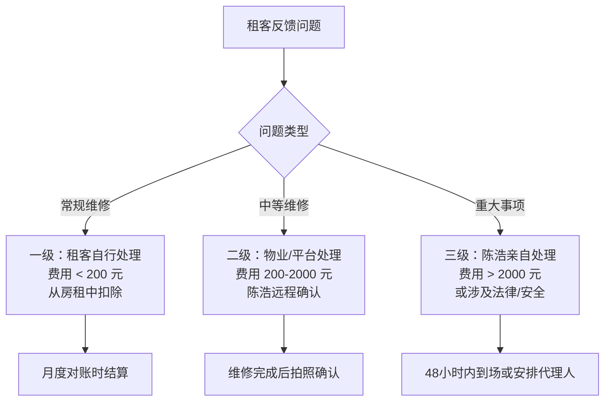
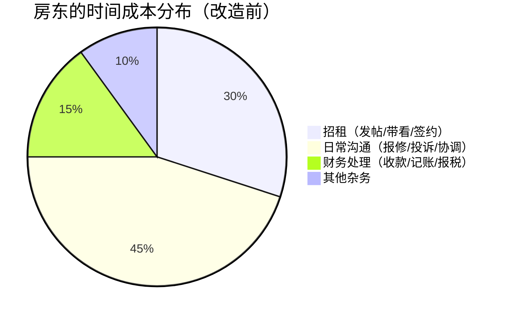

## 案例五：房产租金收入的被动化改造

### 为什么房产租金是"被动收入"中最容易被误解的类型

很多人把"收租"等同于"躺赚"——买了房、租出去、每月收钱，听起来天然就是被动收入。但现实中，大多数房东经历的是这样的日常：

- 租客半夜打电话说热水器坏了，你得找维修工
- 租约到期前两个月就开始焦虑空置期
- 每次换租客都要亲自跑去看房、谈价、签合同
- 遇到拖欠房租的租客，催租催到心力交瘁
- 物业、水电、维修费用一笔笔都要自己处理

**这不是被动收入，这是"另一份工作"。** 真正的被动化改造，是把上述所有环节系统化、外包化、自动化，让房产从"你的第二职业"变成"你的资产在替你工作"。

本案例记录了一位普通职场人（化名陈浩）如何将两套出租房产从"事必躬亲"的累赘状态，改造为月净收入稳定在 8000-12000 元的被动收入来源，整套体系搭建完成后，每月投入时间不超过 2 小时。

---

### 案例背景：起点画像

#### 人物基本情况

陈浩，32 岁，互联网公司产品经理，坐标成都。税后月薪 18000 元，名下两套房产：

| 房产 | 位置 | 户型 | 购入时间 | 购入价格 | 当前市价 | 贷款情况 |
|------|------|------|----------|----------|----------|----------|
| A房 | 高新区天府三街 | 套二 78㎡ | 2019年 | 145万 | 165万 | 月供 5200 元，剩余 18 年 |
| B房 | 武侯区桐梓林 | 套一 45㎡ | 2021年（父母资助首付） | 95万 | 100万 | 月供 3100 元，剩余 24 年 |

#### 改造前的痛苦状态

陈浩在 2023 年之前的出租状态：

**A房**：自己在 58 同城发帖招租，每次换租客平均空置 25 天，每年花在招租上的时间约 40 小时。租客反馈问题直接打他电话，平均每月 3-5 次沟通，涉及维修、邻里纠纷、物业协调等。

**B房**：因为户型小、位置好，出租相对容易，但陈浩亲自管理导致一个严重问题——他和租客成了"朋友"，不好意思涨价，市场租金已经到了 2200 元/月，他只收 1800 元/月。

**改造前年化数据：**

| 指标 | A房 | B房 | 合计 |
|------|-----|-----|------|
| 月租金收入 | 3,500 元 | 1,800 元 | 5,300 元 |
| 年租金收入 | 42,000 元 | 21,600 元 | 63,600 元 |
| 年空置损失（按10%计） | -4,200 元 | -2,160 元 | -6,360 元 |
| 年维修/杂费 | -3,000 元 | -1,500 元 | -4,500 元 |
| 年净收入 | 34,800 元 | 17,940 元 | 52,740 元 |
| 月净收入 | 2,900 元 | 1,495 元 | 4,395 元 |
| 每月投入时间 | 约 6 小时 | 约 3 小时 | 约 9 小时 |
| 时薪（净收入/时间） | 483 元 | 498 元 | 488 元 |

时薪看似不低，但问题在于：这些时间是**碎片化的、随时可能被中断的、带情绪负担的**。凌晨两点的电话和工作日中午跑过去开门让人看房，是完全不同的体验成本。

---

### 改造方案：四步系统化

陈浩的被动化改造并非一蹴而就，而是分四个阶段推进，每个阶段解决一个核心问题。

#### 第一阶段：定价市场化（第 1-2 周）

**核心问题：B房长期低于市场价出租**

**操作步骤：**

1. **市场调研**——在贝壳找房、链家、自如三个平台搜索同小区同户型在租房源，记录价格、装修状况、配套设施
2. **价格锚定**——B房同户型市场租金区间 2000-2400 元/月，中位数 2200 元
3. **调价策略**——陈浩选择不在现有租约期内涨价（避免纠纷），而是在下一个租约到期时调整到 2200 元
4. **A房同步核查**——发现 A房市场租金已到 3800-4200 元，当前 3500 偏低，下一租期调整到 4000 元

**关键原则：不要在租约期内涨价。** 这不仅是法律和道德问题，更是经济理性——一个稳定的好租客远比多收的几百块钱值钱。空置一个月就损失一个月租金，而好租客续租省下的远超涨价收益。

**定价公式（供参考）：**

```text
目标租金 = 同小区同户型中位数租金 × 装修系数 × 配套系数

装修系数：毛坯 0.7-0.8 / 简装 0.9 / 精装 1.0 / 豪装 1.1-1.2
配套系数：无家电 0.85 / 基础家电 1.0 / 全套家电+智能锁 1.05-1.1
```

#### 第二阶段：招租渠道外包（第 3-4 周）

**核心问题：每次招租亲自跑，耗时耗力**

陈浩对比了三种招租模式：

| 模式 | 成本 | 空置期 | 个人投入 | 适合场景 |
|------|------|--------|----------|----------|
| 自己发布（58/闲鱼/豆瓣） | 0 元 | 15-30 天 | 20-40 小时/次 | 时间充裕、不急租 |
| 委托中介（一次付） | 半个月租金 | 7-15 天 | 2-5 小时/次 | 大多数情况 |
| 托管给长租平台（自如/贝壳省心租） | 月租金的 8-12% | 接近 0（平台兜底） | 趋近 0 | 真正追求被动 |

**陈浩的选择：A房委托中介招租，B房交给自如托管。**

决策逻辑：

- **A房**（套二）客群以家庭/合租为主，租期较长（平均 2 年），不值得交托管费，用中介一次性付半个月佣金即可
- **B房**（套一）客群以年轻白领为主，换租频率高（平均 1 年），自如托管虽然抽成 10%，但省去了频繁招租的精力

**关于中介招租的实操要点：**

1. 同时挂 2-3 家中介（链家、德佑、小区周边夫妻店），谁先租出去佣金给谁
2. 给中介配一把密码钥匙盒（淘宝 40 元），免得每次带看都要到场
3. 准备一份标准化的房屋介绍文档（含照片、户型图、周边配套、交通信息），发给所有中介，确保信息一致
4. 设定最低可接受租金，低于此价格不租

#### 第三阶段：管理职能外包（第 5-8 周）

**核心问题：日常管理事务消耗精力**

这是被动化改造最关键的一步。陈浩建立了一套"三级响应体系"：



**一级响应（租客自行处理）：**

陈浩在租约中加入了一条补充条款：

> "单次维修费用不超过 200 元的日常维护事项（如更换灯泡、疏通下水道、更换门锁电池等），租客可自行处理并保留收据，从下月房租中扣除。"

这一条看似小事，实际效果巨大——它消灭了 80% 的日常沟通。租客不用打电话等你安排，直接自己解决，双方都省事。

**二级响应（物业/平台处理）：**

陈浩和两个小区的物业都建立了"维修代管"关系：

- A房物业：缴纳年度维修代管费 600 元/年，物业负责协调入户维修
- B房（自如托管）：平台自动处理一切维修，费用从租金收益中扣除

此外，陈浩在手机里存了三个常用维修师傅的联系方式（水电、家电、锁匠），遇到物业处理不了的问题，直接打电话让师傅上门，全程微信沟通+拍照确认，不需要本人到场。

**三级响应（亲自处理）：**

触发条件：费用超过 2000 元、涉及法律纠纷、安全隐患、或邻里严重冲突。这种情况平均一年遇到 0-1 次，陈浩会亲自处理或委托在成都的表弟代为到场。

**关键工具清单：**

| 工具 | 用途 | 成本 |
|------|------|------|
| 微信群（每套房一个） | 租客沟通留痕 | 0 |
| 密码钥匙盒 | 中介带看免到场 | 40 元/个 |
| 贝壳/链家 App | 租金托管、自动转账 | 0（平台功能） |
| 记账 App（随手记） | 租金收支记录 | 0 |
| 电子签章（e签宝） | 远程签约 | 约 10 元/份 |
| 物业维修代管 | 日常维修协调 | 600 元/年（A房） |

#### 第四阶段：财务自动化（第 9-10 周）

**核心问题：收款、记账、报税仍然需要手动操作**

陈浩的财务自动化方案：

1. **租金自动转账**：与租客约定每月 5 日通过银行自动转账（设置定时转账指令），不再需要每月提醒
2. **支出自动记录**：维修费用通过微信支付，自动导入随手记 App
3. **季度对账**：每季度花 30 分钟核对一次收支明细
4. **年度报税**：每年 3-6 月通过个人所得税 App 申报租金收入（实际操作中，年租金收入 12 万以下且有房贷抵扣的，基本无需额外缴税）

**重要提醒：租金收入的税务处理**

很多人不知道，个人出租住房涉及以下税种：

| 税种 | 税率 | 说明 |
|------|------|------|
| 增值税 | 1.5%（减按） | 月租金 ≤ 15 万免征（2023年政策延续至今） |
| 房产税 | 4% | 个人出租住房优惠税率 |
| 个人所得税 | 10% | 减除费用后的 10%（住房优惠） |
| 城建税及附加 | 增值税的 6-12% | 随增值税免征而免征 |

**实际操作中**：月租金在 15 万以下的个人房东，增值税及附加免征。房产税和个人所得税在很多城市采取综合征收率（如成都为 0），即实际操作中暂未严格征收。但陈浩的做法是保留所有租赁合同和收支凭证，做到"账目清晰、有据可查"，万一政策收紧可以快速补报。

---

### 改造成果：数据对比

改造完成 6 个月后的实际数据：

| 指标 | 改造前 | 改造后 | 变化 |
|------|--------|--------|------|
| A房月租金 | 3,500 元 | 4,000 元 | +14.3% |
| B房月租金 | 1,800 元（自如到手约 1,620 元） | 2,200 元（自如到手约 1,980 元） | +22.2%（净到手 +22.2%） |
| 月租金总收入 | 5,300 元 | 5,980 元 | +12.8% |
| 年空置损失 | 6,360 元（10%） | 1,800 元（约 2.5%） | -71.7% |
| 年维修/管理成本 | 4,500 元 | 3,200 元（含物业代管费 600 + 自如维修扣除） | -28.9% |
| 年净收入 | 52,740 元 | 67,760 元 | +28.5% |
| 月净收入 | 4,395 元 | 5,647 元 | +28.5% |
| **每月投入时间** | **约 9 小时** | **约 1.5 小时** | **-83.3%** |
| **实际时薪** | **488 元** | **3,765 元** | **+671.3%** |

**时薪从 488 元飙升到 3765 元**——这才是被动化的真正意义。不是收入暴涨，而是时间释放。省下来的 7.5 小时/月，陈浩用来做产品咨询副业，额外创收约 3000 元/月。

---

### 深度分析：被动化改造的底层逻辑

#### 为什么大多数人不这么做？

既然被动化改造效果这么好，为什么大多数房东还是亲力亲为？原因有三：

**1. 损失厌恶**

"给自如托管要抽 10% 的佣金，一年就是 2400 元！" 人们天然对确定的损失（佣金）比对不确定的收益（省下的时间价值）更敏感。但如果你的时间价值超过 2400 元/年 ÷ 12 个月 ÷ 7.5 小时 = 26.7 元/小时，这笔账就是赚的。对于月薪 18000 的产品经理，时薪约 100 元，这笔交易的回报率接近 4 倍。

**2. 控制欲**

"万一中介找的租客不好怎么办？万一维修师傅乱报价怎么办？" 这种焦虑的本质是不信任系统。但现实是：专业平台的风控能力大概率比你个人更强。自如的租客筛选体系、贝壳的资金托管机制，都是个人房东无法复制的。

**3. 沉没成本**

"我已经管了这么多年了，流程都很熟了，换别人来我还得教。" 这是最典型的沉没成本谬误。你熟悉的不是"高效流程"，而是"低效但习惯的流程"。打破惯性需要一次性投入，但之后的回报是持续的。

#### 被动化改造的经济学模型

把房产出租看作一个微型生意，它的成本结构如下：



被动化改造的本质，是将每一项时间成本用**系统**或**外包**替代：

| 时间成本项 | 替代方案 | 替代成本 | 节省时间 |
|-----------|---------|---------|---------|
| 招租 | 中介/托管平台 | 半月租金或 10% 佣金 | 30 小时/年 → 2 小时/年 |
| 日常沟通 | 三级响应体系 + 物业代管 | 600 元/年 | 50 小时/年 → 5 小时/年 |
| 财务处理 | 自动转账 + 记账 App | 0 元 | 15 小时/年 → 3 小时/年 |
| 其他杂务 | 标准化流程 + 电子签约 | 约 100 元/年 | 10 小时/年 → 2 小时/年 |

**总计：年投入约 2700-4000 元（因房而异），换来 95 小时/年的时间释放。**

#### 不同城市的被动化策略差异

| 城市类型 | 推荐策略 | 原因 |
|----------|---------|------|
| 一线（北上广深） | 委托托管平台（自如/泊寓） | 租金基数高，佣金绝对值可接受；租客流动性大，托管省心 |
| 强二线（成都/杭州/武汉等） | 中介招租 + 物业代管 | 租金适中，托管平台覆盖好但佣金比例敏感；物业体系成熟 |
| 三四线城市 | 自管为主 + 标准化流程 | 租金低，托管佣金占比过高；熟人社会，中介效率低 |
| 旅游城市（三亚/大理等） | 短租平台（途家/Airbnb） | 短租收益远高于长租，但需要更高的管理投入或专业代运营 |

---

### 进阶策略：从被动化到收益最大化

当基础被动化体系搭建完成后，可以进一步优化收益。

#### 策略一：装修升级拉升租金

投入 2-3 万元进行局部装修升级（墙面刷新、更换灯具、增加智能锁和洗衣机），通常可以将月租金提升 300-800 元，投资回收期 6-12 个月。

**高性价比装修清单：**

| 改造项目 | 预算 | 租金提升预期 | 回收期 |
|----------|------|-------------|--------|
| 全屋刷新墙面 | 2,000-4,000 元 | +200 元/月 | 10-20 个月 |
| 更换智能门锁 | 500-800 元 | +100 元/月 | 5-8 个月 |
| 增加洗烘一体机 | 2,000-3,000 元 | +200 元/月 | 10-15 个月 |
| 更换遮光窗帘 | 300-600 元 | +50 元/月 | 6-12 个月 |
| 增加全屋 Wi-Fi 覆盖 | 300-500 元 | +50 元/月 | 6-10 个月 |

#### 策略二：长租公寓改造（适合多套房持有者）

如果你持有 3 套以上房产，可以考虑成立个体工商户，将分散的房产集中管理，享受小规模纳税人月收入 15 万以下免增值税的政策，并通过品牌化运营提升溢价。

#### 策略三：REITs 作为"无房版"租金被动收入

对于没有足够资金购房的读者，公募 REITs（不动产投资信托基金）提供了一种"不买房也能收租"的路径：

- **保障性租赁住房 REITs**：如华夏北京保障房 REIT、中金厦门安居 REIT，年化分红率约 3-5%
- **产业园区 REITs**：如博时蛇口产园 REIT，底层资产为产业园区租金
- **物流仓储 REITs**：如中金普洛斯 REIT，底层资产为物流仓库租金

**优势**：门槛低（1000 元起投）、流动性好（场内交易）、无需管理。
**劣势**：收益率低于直接持有房产（杠杆效应消失）、受资本市场波动影响。

---

### 常见误区与避坑指南

#### 误区一：托管 = 什么都不用管

**真相**：即使委托了自如托管，你仍需每季度检查一次收益明细、每年确认一次房屋状态。托管平台不是你的管家，而是你的供应商——你得监督供应商的服务质量。

#### 误区二：租金越高越好

**真相**：租金定价是一门平衡术。租金过高 → 空置期延长 → 年化收益反而下降。最佳策略是定在市场中位数略上方（5-10%），确保 95% 以上的出租率。

**空置损失计算公式：**

```text
实际年收益 = 月租金 × 12 × (1 - 空置率) - 年管理成本

举例：
- 租金 4000 元，空置率 5%：4000 × 12 × 0.95 - 2000 = 43,600 元
- 租金 4500 元，空置率 15%：4500 × 12 × 0.85 - 2000 = 43,900 元
- 租金 5000 元，空置率 25%：5000 × 12 × 0.75 - 2000 = 43,000 元
```

租金从 4000 涨到 5000（涨 25%），但年化收益几乎不变，因为被空置期吃掉了。

#### 误区三：口头约定就够了

**真相**：所有租赁关系必须签订书面合同。推荐使用当地住建局的标准租赁合同模板，补充以下条款：

- 维修责任分界线（如 200 元以下租客自理）
- 提前退租违约金（通常为一个月租金）
- 房屋交接清单（附照片，双方签字）
- 租金支付方式和时间（明确逾期处理方式）

#### 误区四：只关注租金收入，忽略隐性成本

房东的真实成本远不止房贷月供：

| 显性成本 | 隐性成本（常被忽略） |
|----------|---------------------|
| 房贷月供 | 房屋折旧（装修老化） |
| 物业费 | 空置期损失 |
| 维修费 | 时间成本（管理精力） |
| | 机会成本（资金如果用于理财的收益） |
| | 政策风险（租金管制、房产税预期） |

**真正计算房产投资回报率的方法：**

```text
净回报率 = (年租金收入 - 年所有支出) ÷ (首付 + 已还本金 + 装修投入) × 100%

陈浩A房实例：
- 年租金收入：48,000 元
- 年支出（物业+维修+代管+空置）：5,800 元
- 净收入：42,200 元
- 总投入（首付 43.5 万 + 已还本金约 4 万 + 装修 8 万）：55.5 万
- 净回报率：42,200 ÷ 555,000 = 7.6%
```

这个 7.6% 的数字看起来不高，但别忘了房产还有杠杆效应——首付只占总价的 30%，但你享受了 100% 的租金收益和资产增值。

---

### 从案例到行动：你的被动化改造清单

如果你也是持有出租房产的房东，按以下清单逐项检查和改造：

**第一步（1 周内完成）：**
- [ ] 调研当前市场租金，确认定价是否合理
- [ ] 盘点过去一年的管理时间投入（精确到小时）
- [ ] 计算实际时薪（年净收入 ÷ 年管理时间）

**第二步（2-4 周内完成）：**
- [ ] 选择招租渠道（自管/中介/托管），建立合作关系
- [ ] 安装密码钥匙盒
- [ ] 建立"三级响应体系"并在租约中补充维修条款
- [ ] 对接物业维修代管服务

**第三步（1-2 个月内完成）：**
- [ ] 设置租金自动转账
- [ ] 建立电子记账习惯
- [ ] 准备标准化的房屋介绍文档（含照片）
- [ ] 整理所有租赁合同和凭证

**第四步（持续优化）：**
- [ ] 每季度花 30 分钟检查一次收益和房屋状态
- [ ] 每年租约到期前 2 个月评估是否调价
- [ ] 关注 REITs 等替代性房产投资渠道

---

### 本案例的核心启示

房产租金的被动化改造，本质上是一次**小型企业管理思维的升级**——从"个体户式手工作坊"升级为"系统化运营"。它不需要你有多套房，也不需要你懂金融，需要的只是：

1. **承认自己的时间有价值**——不要为了省几千块佣金而浪费几十个小时
2. **信任专业分工**——中介、物业、托管平台各有专业能力，善用它们
3. **建立系统而非依赖个人**——标准流程比个人记忆更可靠
4. **用数据而非感觉做决策**——时薪、空置率、净回报率，用数字说话

当你的房产每月只需要你花 1-2 小时查看一下数据，而月净收入稳定在 5000-8000 元时——恭喜你，你拥有了一项真正的被动收入资产。
