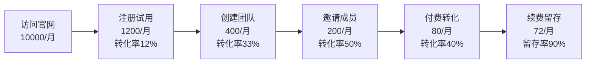

## 案例六：SaaS产品的被动收入之路

SaaS（Software as a Service，软件即服务）是被动收入金字塔顶端的模式之一。与电子书、模板等"一次性创作、反复销售"的数字产品不同，SaaS产品通过订阅制收费，能够产生可预测的、持续增长的月经常性收入（MRR）。本案例记录了一位独立开发者如何在18个月内将一个业余项目打造成月入30000元的SaaS产品，涵盖从市场验证、技术选型、获客策略到规模化运营的完整路径。

### 一、案例背景：从痛点到产品

#### 1.1 创始人画像

**张明（化名）**，28岁，二线城市某互联网公司后端开发工程师，月薪15000元。日常工作是企业级Java应用开发，技术栈为Spring Boot + MySQL + Redis。工作之余有每天2-3小时的自由时间，周末可投入8-10小时。

**关键能力储备：**
- 后端开发能力扎实，熟悉API设计和数据库优化
- 对产品设计有兴趣，曾自学Figma和基础UI设计
- 有基本的Linux运维能力，能独立部署和管理服务器
- 英语阅读能力良好，能阅读英文技术文档和社区讨论

#### 1.2 发现痛点

张明在公司负责内部工单系统维护时发现了一个普遍问题：中小型团队（5-50人）在协作管理上存在大量低效环节。具体表现为：

- **任务跟踪混乱**：用Excel管理任务，版本冲突频繁，进度不透明
- **文档分散**：项目文档散落在微信、邮件、本地文件夹中，查找困难
- **工具碎片化**：一个团队同时使用3-5个不同工具（钉钉沟通、石墨文档、Tower管理任务），信息割裂
- **现有方案过重**：Jira、Confluence等企业级工具对小团队来说过于复杂，学习成本高

张明意识到：**市场上缺少一个轻量级、开箱即用、定价合理的团队协作工具**，专门服务10-50人的中小团队。

#### 1.3 市场验证

在动手写代码之前，张明花了4周时间做市场调研：

**第一步：竞品分析（第1周）**

| 竞品 | 目标用户 | 定价 | 优势 | 不足 |
|------|----------|------|------|------|
| Notion | 个人/小团队 | 免费-$8/人/月 | 灵活、模板丰富 | 协作功能弱、国内访问慢 |
| 飞书 | 中大型企业 | 免费-$12/人/月 | 功能全面 | 对小团队过重、数据在国内 |
| Teambition | 国内团队 | 免费-$9.9/人/月 | 本土化好 | 界面老旧、功能堆砌 |
| Linear | 技术团队 | 免费-$8/人/月 | 设计精美、速度快 | 无中文、偏技术向 |
| Monday.com | 各类团队 | $8-$16/人/月 | 可视化强 | 价格贵、功能复杂 |

**第二步：用户访谈（第2-3周）**

张明通过技术社区和朋友圈找到了15位目标用户进行深度访谈：

- 5位创业公司CEO/CTO
- 4位项目经理/产品经理
- 3位自由职业团队负责人
- 3位远程协作团队成员

**访谈核心发现：**
1. 80%的受访者认为现有工具"太复杂"或"太贵"
2. 最核心的需求是：任务看板 + 文档协作 + 团队沟通，三合一即可
3. 月付费意愿集中在30-60元/人/月区间
4. 对数据安全和国内访问速度有硬性要求

**第三步：MVP意向测试（第4周）**

张明用Figma制作了产品原型，在3个创业者社群中发布问卷，收集到87份有效回复：

- 72%表示"愿意试用"
- 34%表示"如果好用愿意付费"
- 12%表示"愿意预付年费支持开发"

这些数据给了张明足够的信心启动开发。

### 二、产品构建：从MVP到正式版

#### 2.1 技术选型

考虑到单人开发和长期维护成本，张明选择了轻量但高效的技术栈：

```text
前端：React 18 + TypeScript + Ant Design
后端：Node.js (NestJS) + TypeScript
数据库：PostgreSQL + Redis
实时通信：WebSocket (Socket.IO)
对象存储：阿里云OSS
部署：Docker + 阿里云ECS
CDN：阿里云CDN
监控：Sentry (错误追踪) + Grafana (性能监控)
```

**选型理由：**
- TypeScript全栈：前后端统一语言，减少上下文切换成本
- NestJS：企业级Node.js框架，内置依赖注入、中间件、模块化架构
- PostgreSQL：比MySQL更适合复杂查询和JSON字段存储
- 阿里云：国内访问速度快，文档中文齐全，成本可控

#### 2.2 MVP开发（第1-3个月）

张明采用"最小可用"原则，MVP只包含三个核心功能：

**功能一：任务看板**
- 支持看板视图和列表视图
- 任务状态自定义（待办/进行中/已完成）
- 任务分配、标签、截止日期
- 拖拽排序

**功能二：文档协作**
- 基于Markdown的富文本编辑器
- 实时多人协同编辑
- 文档树形目录管理
- 版本历史回溯

**功能三：团队空间**
- 按项目创建独立空间
- 成员邀请和权限管理
- 活动日志和通知中心
- 基础的@提及功能

**开发节奏安排：**

| 阶段 | 时间 | 产出 |
|------|------|------|
| 架构设计 | 第1周 | 数据库设计、API文档、项目脚手架 |
| 任务看板 | 第2-4周 | 看板核心功能、拖拽排序、实时同步 |
| 文档协作 | 第5-8周 | 富文本编辑器、协同编辑、版本管理 |
| 团队空间 | 第9-11周 | 用户系统、权限管理、项目空间 |
| 联调测试 | 第12周 | Bug修复、性能优化、部署上线 |

**关键开发决策：**

1. **不做移动端App**：先做响应式Web，降低开发成本，验证需求后再考虑App
2. **不做复杂权限**：只做管理员和成员两级，用"够用"换取开发速度
3. **不做自研编辑器**：基于开源的Tiptap编辑器二次开发，节省2-3个月工作量
4. **不做国际化**：先服务国内市场，i18n留到后面

#### 2.3 公测与迭代（第4-6个月）

MVP完成后，张明没有直接上线收费，而是开启了3个月的公测期：

**公测策略：**
- 在V2EX、少数派、掘金等社区发布公测帖
- 提供"永久免费版"（限3人团队、5个项目）吸引种子用户
- 建立用户微信群，直接收集反馈
- 每2周发布一次更新，保持迭代节奏

**公测数据：**

| 指标 | 第1个月 | 第2个月 | 第3个月 |
|------|---------|---------|---------|
| 注册用户 | 120 | 380 | 750 |
| 创建团队数 | 35 | 95 | 180 |
| 日活跃用户 | 45 | 150 | 320 |
| NPS评分 | 32 | 45 | 58 |

**关键反馈与迭代：**
- 用户强烈要求"甘特图视图"→ 第5周上线
- "文档搜索太慢" → 引入Elasticsearch，搜索速度提升10倍
- "希望支持微信通知" → 对接企业微信和微信服务号
- "团队管理太简单" → 增加角色权限（管理员/编辑者/查看者）

#### 2.4 正式版发布（第7个月）

经过6个月打磨，产品在第7个月正式上线，采用订阅制定价：

| 版本 | 价格 | 功能 |
|------|------|------|
| 免费版 | 0元 | 3人团队、5个项目、1GB存储 |
| 专业版 | 39元/人/月 | 无限项目、10GB/人、高级权限、甘特图 |
| 企业版 | 69元/人/月 | 专业版全部 + SSO、审计日志、API接口、专属客服 |
| 年付优惠 | 8折 | 专业版31.2元/人/月、企业版55.2元/人/月 |

### 三、获客与增长：从0到1000个付费用户

#### 3.1 冷启动策略（第7-9个月）

SaaS产品的冷启动是最难的阶段。张明采用了"内容+社区+口碑"三管齐下的策略：

**策略一：内容营销**

张明每周在公众号"独立开发者手记"发布文章，内容类型包括：
- 产品开发幕后故事（如"我是如何设计任务看板的拖拽排序的"）
- 团队协作方法论（如"小团队如何用看板管理100个任务"）
- 独立开发技术分享（如"用NestJS构建SaaS后端的7个最佳实践"）

3个月累计发布24篇文章，总阅读量12万+，带来约800个注册用户。

**策略二：社区渗透**

- 在V2EX、掘金、少数派定期分享产品更新
- 在知乎回答"小团队协作工具推荐"类问题（累计获得2000+赞同）
- 加入20+个创业者/产品经理微信群，适度分享（不硬广）
- 在Product Hunt中文版发布，获得当日热门

**策略三：老用户推荐**

设计推荐奖励机制：
- 推荐者和被推荐者各获得1个月专业版免费
- 推荐满5人，获得永久专业版
- 推荐满10人，获得永久企业版

这个机制带来约30%的新用户来源。

#### 3.2 增长引擎优化（第10-15个月）

当用户基数突破500后，张明开始优化转化漏斗：

**漏斗数据（第10个月）：**



**关键优化动作：**

1. **优化注册流程**：从5步简化为2步（手机号+验证码即可注册），注册转化率从8%提升到12%
2. **新手引导**：新增交互式引导流程，引导用户创建第一个任务和文档，创建团队转化率从20%提升到33%
3. **试用期策略**：免费版功能足够好用，让用户形成依赖后再付费。专业版试用14天，试用到期前3天发送提醒
4. **定价实验**：测试了29元/39元/49元三个价格点，最终39元的ARPU（每用户平均收入）最高

#### 3.3 收入增长曲线

| 月份 | 付费用户数 | MRR（月经常性收入） | ARR（年经常性收入） |
|------|-----------|-------------------|-------------------|
| 第7个月 | 25 | 975元 | 11,700元 |
| 第9个月 | 80 | 3,120元 | 37,440元 |
| 第12个月 | 280 | 10,920元 | 131,040元 |
| 第15个月 | 520 | 20,280元 | 243,360元 |
| 第18个月 | 780 | 30,420元 | 365,040元 |

**收入结构分析（第18个月）：**
- 专业版用户：650人，贡献MRR 20,150元（66%）
- 企业版用户：130人，贡献MRR 8,970元（30%）
- 年付用户占比：45%（更高留存、更好现金流）

### 四、运营体系：让SaaS自动运转

#### 4.1 客户成功体系

SaaS的核心不是"卖软件"，而是"确保客户成功"。张明建立了一套轻量级的客户成功体系：

**分层服务策略：**

| 客户层级 | 判定标准 | 服务方式 | 关键动作 |
|----------|----------|----------|----------|
| VIP客户 | 企业版 + 50人以上 | 专属微信群 + 月度回访 | 功能定制、优先响应 |
| 重要客户 | 专业版 + 10人以上 | 工单优先 + 季度回访 | 使用指导、问题排查 |
| 普通客户 | 付费但规模小 | 自助 + 工单 | 文档引导、社群答疑 |
| 免费用户 | 免费版 | 社群 + 文档 | 转化引导、价值传递 |

**关键指标监控：**
- **NRR（净收入留存率）**：目标 > 110%（即老客户的收入不仅不流失，还因为增购而增长）
- **Logo留存率**：目标 > 90%（按客户数量计算的留存）
- **健康评分**：基于登录频率、功能使用深度、工单数量综合计算

#### 4.2 自动化运维

作为独立开发者，张明必须将运维自动化到极致：

**自动化体系：**

```yaml
部署流水线:
  - 代码提交 → GitHub Actions自动测试
  - 测试通过 → 自动构建Docker镜像
  - 镜像推送 → 自动部署到预发布环境
  - 预发布验证 → 一键发布到生产环境
  - 回滚机制: 保留最近5个版本，一键回滚

监控告警:
  - 服务可用性: UptimeRobot每5分钟检测，宕机自动短信通知
  - 错误追踪: Sentry实时捕获错误，严重错误自动创建Issue
  - 性能监控: Grafana监控CPU/内存/响应时间，阈值告警
  - 数据库: 慢查询日志自动分析，索引优化建议

备份策略:
  - 数据库: 每日全量备份 + 实时WAL归档
  - 文件存储: 阿里云OSS跨区域复制
  - 代码仓库: GitHub + 本地NAS双重备份
  - 恢复演练: 每季度执行一次完整恢复测试
```

#### 4.3 成本控制

SaaS的利润率取决于成本控制。张明在不同阶段的月度成本如下：

| 成本项 | 第7个月 | 第12个月 | 第18个月 |
|--------|---------|----------|----------|
| 服务器（ECS） | 200元 | 500元 | 1,200元 |
| 数据库（RDS） | 0元（自建） | 300元 | 600元 |
| 对象存储（OSS） | 30元 | 100元 | 250元 |
| CDN | 20元 | 80元 | 200元 |
| 短信/邮件 | 50元 | 150元 | 300元 |
| 第三方SaaS | 100元 | 200元 | 300元 |
| **合计** | **400元** | **1,330元** | **2,850元** |
| **毛利率** | **59%** | **88%** | **91%** |

**成本优化要点：**
- 前期使用最低配ECS（2核4G），配合Nginx反向代理
- 数据库前期自建PostgreSQL，用户超过200后再迁移到RDS
- 使用阿里云抢占式实例处理非实时任务（日志分析、报表生成）
- CDN开启智能压缩，减少带宽消耗
- 第三方服务（Sentry、Grafana）使用免费版或开源替代

### 五、踩过的坑与关键教训

#### 5.1 技术层面的坑

**坑一：实时协作编辑的一致性问题**

多人同时编辑同一文档时，出现内容冲突和丢失。最初使用简单的"最后写入胜出"策略，用户投诉频繁。

**解决方案：** 引入CRDT（Conflict-free Replicated Data Type）算法，基于Yjs库实现。虽然开发成本增加了3周，但彻底解决了协作一致性问题。

**教训：** 实时协作是SaaS的核心卖点，不能在底层技术上偷工减料。

**坑二：数据库查询性能瓶颈**

当单个团队的任务数超过5000时，看板加载时间从200ms飙升到3秒以上。

**解决方案：**
- 对常用查询添加复合索引
- 引入Redis缓存热点数据（看板配置、用户权限）
- 对任务列表采用游标分页而非OFFSET分页
- 将历史任务归档到单独的表

**教训：** 数据库设计要在第一天就考虑"当数据量增长100倍时怎么办"。

**坑三：WebSocket连接管理**

用户量增长后，WebSocket连接数暴增，服务器内存经常告警。

**解决方案：** 引入Socket.IO的Redis Adapter实现多节点消息广播，水平扩展WebSocket服务。

#### 5.2 商业层面的坑

**坑一：过早追求功能完美**

前3个月一直在打磨功能，迟迟不敢上线收费。实际上，早期用户对"不完美"的容忍度远高于预期。

**教训：** MVP只要核心功能可用就发布，边运营边迭代。完美主义是独立开发者最大的敌人。

**坑二：定价过低**

最初定价19元/人/月，吸引了很多"价格敏感型"用户，这些用户的付费意愿低、流失率高、客服成本大。

**教训：** 价格是筛选器。过低的价格会吸引错误的客户群体。SaaS定价应该基于客户获得的价值，而非开发成本。

**坑三：忽视流失分析**

早期只关注新增用户，忽视了流失分析。直到第10个月才发现，30%的流失用户是因为"团队里其他人不用"。

**解决方案：** 设计"邀请激励"机制，鼓励整个团队一起使用；优化协作功能的"病毒式传播"属性（每@一个新用户就是一次自然邀请）。

#### 5.3 心理层面的挑战

**挑战一：全职工作与副业的平衡**

每天下班后还要写代码3小时，周末也在赶功能，持续半年后身心俱疲。

**应对方法：** 第8个月开始，将部分非核心功能外包（UI设计、文档编写），自己只做核心开发和产品决策。

**挑战二：数据波动带来的焦虑**

MRR增长不是线性的，有时连续2周没有新增付费用户，会严重怀疑产品方向。

**应对方法：** 建立"月度回顾"习惯，只看月度数据，不纠结每日波动。同时关注领先指标（试用转化率、NPS）而非滞后指标（当月收入）。

**挑战三：是否辞职全职做产品的纠结**

第15个月时，SaaS月入20000元，已经接近工资收入。张明反复考虑是否辞职。

**最终决策：** 继续保持副业状态。原因：(1) SaaS收入还不够稳定，需要至少6个月的运营资金储备；(2) 全职后反而可能因为"时间太多"而效率下降；(3) 公司的社保和公积金是重要的安全网。

### 六、SaaS被动收入的核心指标体系

构建SaaS产品需要关注的关键指标，可以用以下框架理解：

```text
北极星指标：MRR（月经常性收入）
    │
    ├── 增长指标
    │   ├── 新增付费用户数
    │   ├── 免费→付费转化率
    │   └── 老客户增购率（升级到更高版本）
    │
    ├── 留存指标
    │   ├── Logo留存率（按客户数）
    │   ├── NRR净收入留存率（按金额）
    │   └── 流失率（月度/年度）
    │
    ├── 效率指标
    │   ├── CAC（客户获取成本）
    │   ├── LTV（客户终身价值）
    │   ├── LTV/CAC比值（目标>3）
    │   └── 回收期（CAC回收月数）
    │
    └── 产品指标
        ├── DAU/MAU比值（粘性）
        ├── 功能使用深度
        └── NPS净推荐值
```

**张明在第18个月的关键指标：**

| 指标 | 数值 | 行业基准 | 评价 |
|------|------|----------|------|
| MRR | 30,420元 | - | 独立开发者优秀水平 |
| 月度Logo留存率 | 92% | 85-95% | 良好 |
| NRR | 108% | 100-120% | 良好 |
| 免费→付费转化率 | 6.7% | 2-5% | 优秀 |
| CAC | 45元 | - | 极低（主要靠内容获客） |
| LTV | 1,160元 | - | 基于10个月平均生命周期 |
| LTV/CAC | 25.8 | >3为健康 | 极优秀 |
| 回收期 | 1.2个月 | <12个月 | 极优秀 |

### 七、从副业到事业：规模化路径

当SaaS月入稳定在30000元以上后，张明开始规划规模化：

#### 7.1 产品层面的扩展

1. **开放API接口**：允许第三方集成，构建生态
2. **上线插件市场**：允许开发者创建扩展（如日报自动生成、OKR管理）
3. **移动端App**：开发iOS和Android原生应用
4. **AI功能集成**：智能任务分配建议、文档自动摘要、会议纪要生成

#### 7.2 商业层面的扩展

1. **向上销售**：推出"旗舰版"（129元/人/月），增加高级数据分析、自定义工作流
2. **横向扩展**：针对特定行业（教育、电商、设计）推出行业解决方案
3. **渠道合作**：与企业服务商合作，进入其分销体系
4. **国际化**：支持英文和日文，开拓东南亚市场

#### 7.3 团队层面的扩展

当MRR突破50000元时，考虑组建小团队：

| 角色 | 月薪预算 | 职责 |
|------|----------|------|
| 前端开发 | 12,000元 | 移动端开发、前端优化 |
| 客户成功 | 8,000元 | 客户对接、使用培训 |
| 内容运营 | 6,000元 | 公众号、社群、SEO |

团队成本：26,000元/月，占MRR的52%，仍在健康范围内。

### 八、SaaS被动收入的适用条件与局限性

#### 8.1 适合做SaaS的人

- **有编程能力**：至少能独立完成MVP，或有可靠的开发伙伴
- **有耐心**：SaaS从0到月入10000元通常需要12-24个月
- **愿意持续投入**：SaaS不是"做完就不管"的产品，需要持续迭代
- **有领域认知**：最好是解决自己或身边人的真实痛点

#### 8.2 不适合做SaaS的情况

- **期望快速变现**：SaaS是慢生意，不适合追求短期收益
- **没有技术能力**：外包开发SaaS的质量和成本都难以控制
- **市场太小众**：如果目标用户不足1万人，难以支撑订阅制商业模式
- **竞争极度激烈**：如果巨头已经做了同样的事且免费，很难突围

#### 8.3 SaaS与其他被动收入模式的对比

| 维度 | SaaS产品 | 电子书/课程 | 数字模板 | 联盟营销 |
|------|----------|-------------|----------|----------|
| 启动成本 | 高（技术+时间） | 低 | 低 | 低 |
| 收入天花板 | 极高 | 中 | 中 | 高 |
| 收入可预测性 | 高（订阅制） | 低（波动大） | 低 | 中 |
| 维护成本 | 高（持续迭代） | 低 | 低 | 中 |
| 被动程度 | 中（需持续运营） | 高 | 高 | 中 |
| 时间到盈利 | 12-24个月 | 1-3个月 | 1-2个月 | 3-6个月 |
| 技能门槛 | 高 | 中 | 低 | 低 |
| 规模化潜力 | 极高 | 中 | 低 | 高 |

### 九、给SaaS创业者的10条实操建议

1. **先验证再开发**：用Figma原型+问卷验证需求，确认有足够多的人愿意付费后再写代码
2. **MVP只做一件事**：把一个核心功能做到极致，而不是十个功能都做到60分
3. **定价不要太低**：起步定价建议在行业基准的中位数，后续可以调整
4. **内容是最好的获客渠道**：写你正在解决的问题，而不是你的产品功能
5. **重视onboarding**：用户注册后的前10分钟决定了他们是否会留下来
6. **监控流失原因**：每个流失用户都应该有一个退出问卷
7. **先做Web再做App**：Web的开发和迭代速度远快于原生App
8. **自动化一切能自动化的**：部署、监控、备份、账单、邮件通知
9. **保持全职工作至少12个月**：用工资养活自己，用业余时间验证产品
10. **加入独立开发者社区**：Indie Hackers、独立开发者社群，交流经验和情绪支持

### 十、SaaS产品常用工具与资源

#### 开发工具

| 类别 | 推荐工具 | 说明 |
|------|----------|------|
| 前端框架 | React / Vue 3 / Svelte | React生态最大，Vue国内流行，Svelte轻量 |
| 后端框架 | NestJS / FastAPI / Go | NestJS适合Node栈，FastAPI适合Python栈 |
| 数据库 | PostgreSQL / PlanetScale | PostgreSQL功能强大，PlanetScale免运维 |
| 认证 | Auth0 / Clerk / 自建 | Clerk对SaaS最友好，自建灵活但费时 |
| 支付 | Stripe（海外）/ 支付宝当面付 + 微信支付（国内） | 国内SaaS建议同时支持支付宝和微信 |
| 邮件 | Resend / SendGrid | Resend开发者体验更好 |
| 分析 | PostHog / Mixpanel | PostHog开源自托管，Mixpanel功能强 |

#### 运营资源

| 资源 | 链接/说明 |
|------|-----------|
| Indie Hackers | 独立开发者社区，大量SaaS创业经验 |
| Product Hunt | 产品发布平台，冷启动必备 |
| SaaS Metrics Guide | 指标体系参考 |
| 《SaaS创业路线图》 | 国内SaaS创业方法论书籍 |
| 少数派/掘金 | 国内内容分发渠道 |

### 结语

SaaS是被动收入模式中门槛最高、但天花板也最高的选择。它要求创业者同时具备技术能力、产品思维和商业嗅觉。但一旦跑通，SaaS能提供极其稳定的经常性收入，且具有天然的规模化潜力——每增加一个用户的边际成本趋近于零。

张明的案例表明：一个普通程序员，利用业余时间，用18个月可以从零构建一个月入30000元的SaaS产品。关键不在于技术多牛、资源多丰富，而在于**找到真实痛点、快速验证、持续迭代**这三件事。

SaaS不是"一夜暴富"的捷径，而是一条需要耐心和毅力的长期主义之路。但走通了，它就是最稳固的被动收入护城河。
