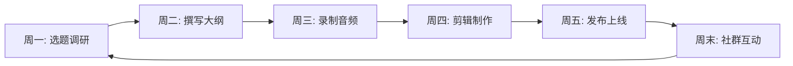
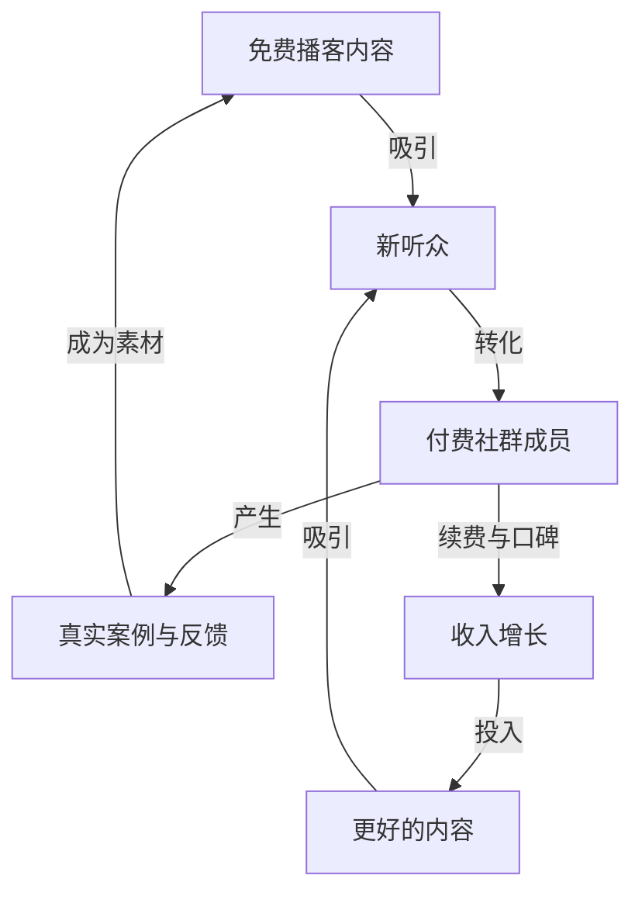

## 案例七：播客的被动收入

播客（Podcast）是音频内容的典型载体，近年来在全球范围内经历了爆发式增长。根据 Edison Research 的数据，2024 年全球每月收听播客的人口已超过 5 亿，中文播客听众也突破了 1.5 亿。播客的独特价值在于它是一种"陪伴型媒介"——听众在通勤、运动、做家务时收听，与主播之间形成一种类似朋友聊天的亲密关系。这种深度连接，正是播客能够构建被动收入的基础。

本案例的主角是一位化名为"老陈"的互联网从业者，他从零开始做播客，用两年时间搭建了一个月均被动收入超过 8000 元的音频内容系统。这个案例的价值不在于收入数字本身，而在于他展示了一套可复制的、将时间资产化的方法论。

### 案例背景

老陈，32 岁，某互联网公司产品经理，坐标杭州。2022 年初，他注意到中文播客正在快速崛起——小宇宙 App 日活持续增长，Apple Podcasts 中文内容占比不断攀升，品牌方开始将播客纳入营销预算。作为一个对商业分析和个人成长有浓厚兴趣的人，他决定以"产品经理的商业观察"为主题，开设一档深度分析类播客。

他选择播客而非短视频或图文的原因有三个：

第一，音频制作门槛相对低。不需要露脸、不需要拍摄场地、不需要复杂的视频剪辑设备，一台电脑、一支麦克风就能开始。

第二，内容生命周期长。短视频的流量窗口通常只有 48-72 小时，而优质播客节目在发布数月甚至数年后仍然会被搜索和收听，具有真正的长尾效应。

第三，信任转化率高。听众通过几十分钟的声音接触，对主播的熟悉度和信任感远超图文阅读，这使得后续的商业转化（课程、咨询、社群）效率极高。

他的起步资源清单如下：

| 资源类型 | 具体内容 | 成本 |
|---------|---------|------|
| 硬件设备 | Blue Yeti USB 麦克风 + 防喷罩 + 桌面悬臂支架 | 800 元 |
| 录音环境 | 卧室衣柜角落（衣物天然吸音） | 0 元 |
| 软件工具 | Audacity（免费）+ Descript（月费 24 美元） | 约 170 元/月 |
| 托管平台 | 小宇宙（免费）+ Apple Podcasts + Spotify（免费） | 0 元 |
| 时间投入 | 每周 8-10 小时（含选题、录制、剪辑、运营） | — |
| 启动资金 | 合计约 1000 元 + 每月 170 元软件费 | — |

### 执行过程

#### 第一阶段：定位与冷启动（第 1-3 个月）

**明确内容定位**

老陈没有急于录制第一期节目，而是花了两周时间做市场调研。他在小宇宙上搜索"商业"、"产品"、"互联网"等关键词，梳理出排名前 50 的播客，逐一分析它们的：

- 内容主题和切入角度
- 更新频率和单集时长
- 评论区的听众反馈和需求
- 商业化模式（广告、课程、社群等）

通过分析，他发现了一个空白地带：大多数商业播客要么过于宏观（商业新闻解读），要么过于碎片化（单一技巧分享），缺少"用产品思维拆解商业案例"的深度内容。他将自己的播客定位为"每周一集，每集 30-45 分钟，用产品经理的视角深度拆解一个商业现象"。

播客名称最终确定为「产品沉思录」，一句话定位是"用产品思维看懂商业世界的运行逻辑"。

**打造最小可行产品**

第一期节目他没有公开发布，而是录了三个不同版本，分别发给十位朋友试听，收集反馈。反馈集中在两个问题：语速太快、干货密度太高导致跟不上。他据此调整了内容节奏——每 10 分钟设置一个"呼吸点"，用故事或类比让听众"缓一缓"。

正式发布的第一批内容是连续 5 集的"产品思维入门"系列：

1. 为什么你用的产品越来越"懂你"——推荐算法的本质
2. 微信为什么不做"已读"——产品决策背后的博弈论
3. 从瑞幸咖啡看增长黑客的中国化实践
4. 为什么 B 站的商业模式比爱奇艺更健康
5. 产品经理的思维模型：第一性原理

这 5 集形成一个小闭环：新听众可以从任意一集进入，听完整个系列后对主播的能力和风格有完整的认知。

**选择分发平台**

他采用"一鱼多吃"策略，一份音频同时发布到多个平台：

| 平台 | 定位 | 内容策略 |
|------|------|---------|
| 小宇宙 | 主阵地，中文播客核心平台 | 完整节目 + 评论互动 |
| Apple Podcasts | 覆盖 iOS 用户 | 完整节目 |
| Spotify | 覆盖海外华人 | 完整节目 |
| 喜马拉雅 | 长音频流量池 | 完整节目 + 部分付费内容 |
| 微信公众号 | 搜索引擎收录 + 社交传播 | 每期节目的文字精华版 |
| B站 | 视频化播客，触达年轻群体 | 音频 + 静态画面 + 字幕 |

关键操作：在每个平台的节目描述中都加入时间节点（timestamps），方便听众跳转到感兴趣的部分。这个小细节让他的完播率比同类播客高出约 20%。

**冷启动数据**

前 3 个月的惨淡数据：

| 月份 | 发布集数 | 总播放量 | 订阅数 | 评论数 |
|------|---------|---------|--------|--------|
| 第 1 月 | 4 集 | 320 | 45 | 3 |
| 第 2 月 | 4 集 | 680 | 120 | 8 |
| 第 3 月 | 4 集 | 1,500 | 280 | 15 |

这个阶段没有任何收入，纯投入。但老陈在第 3 个月末发现了一个关键信号：有听众在评论区留言说"每期都听两遍，第一遍听故事，第二遍记笔记"。这说明内容质量已经建立了核心受众的忠诚度。

#### 第二阶段：增长与初步变现（第 4-9 个月）

**内容引擎化**

从第 4 个月开始，老陈建立了一套标准化的内容生产流程：

选题调研的标准动作：

1. 浏览 36 氪、虎嗅、晚点 LatePost 的当周热点
2. 查看小宇宙和 Apple Podcasts 的热门榜单，分析竞争对手的选题
3. 翻阅播客评论区和听友群的讨论，挖掘听众的真实需求
4. 从自己的产品经理工作日常中提炼洞察
5. 最终从 5-8 个备选题目中选出 1 个

录制技巧的迭代：

- 使用"先写逐字稿再录制"的方式，确保逻辑严密
- 录制时保持坐姿端正，减少呼吸杂音
- 在 Descript 中使用"去除填充词"功能（去掉"嗯"、"那个"等口语词）
- 添加片头片尾音乐，建立品牌辨识度
- 控制单集时长在 35-45 分钟，这是深度内容与听众注意力的最佳平衡点

**社交传播策略**

老陈没有花钱做推广，而是采用了三个免费但有效的方法：

方法一：精华金句卡片。每期节目录完后，他从中提取 3-5 个最有传播力的观点，用 Canva 制作成精美卡片，在微博、即刻、朋友圈分发。卡片上附带播客名称和收听二维码，将图文流量导向音频。

方法二：文字版精华稿。他将每期播客的内容整理成 2000-3000 字的文章，发布在公众号和知乎上。这些文章带有"本文为播客「产品沉思录」第 XX 期的文字版"的标注，图文读者中有约 15% 会转化为播客听众。

方法三：嘉宾互推。从第 6 个月开始，他邀请行业内的朋友做客播客。每位嘉宾自带社交网络和受众基础，一期嘉宾合作通常能带来 200-500 个新订阅。

**首次变现：付费社群**

到第 7 个月，播客订阅数突破 2000，日均播放量稳定在 300-500。老陈开始测试付费模式——他没有选择接广告（因为流量还不够大），而是创建了一个付费知识星球社群，定价 199 元/年。

社群提供的价值：

- 每周一篇独家深度分析（播客不会公开的内容）
- 与主播直接交流的机会（每周一次文字答疑）
- 社群成员之间的行业信息共享
- 提前获取播客选题并投票

第一个月，有 87 人付费加入，收入 17,313 元。这个数字验证了一个关键假设：播客听众的付费意愿远高于图文读者，因为长时间的声音接触已经建立了足够的信任。

#### 第三阶段：系统化与被动化（第 10-18 个月）

**内容复用体系**

老陈发现最大的时间瓶颈在于"从零开始写每期大纲"。他建立了内容复用体系，将一份核心素材输出为多种形式：

| 输出形式 | 平台 | 制作时间 | 内容来源 |
|---------|------|---------|---------|
| 完整播客 | 小宇宙/Apple | 3 小时 | 核心内容 |
| 精华剪辑（5 分钟） | 短视频平台 | 30 分钟 | 从完整版剪辑 |
| 文字精华稿 | 公众号/知乎 | 1.5 小时 | 播客逐字稿整理 |
| 金句卡片 | 微博/即刻 | 20 分钟 | 核心观点提取 |
| 思维导图 | 小红书 | 30 分钟 | 大纲结构化 |

一份 3 小时的录制，经过 5 小时的加工，产出 5 种形态的内容，覆盖 6 个以上的平台。时间效率提升了 3-4 倍。

**建立"常青内容"库**

播客的被动收入潜力，核心在于"常青内容"（Evergreen Content）——那些不会过时、长期被搜索和收听的节目。

老陈有意识地将内容分为两类：

- 时效性内容（占 40%）：解读当周的商业热点，发布后 2 周内贡献 80% 的播放量
- 常青内容（占 60%）：讲解底层方法论和思维模型，发布后持续贡献长尾流量

典型的常青内容选题：

1. "如何用第一性原理分析商业模式"——发布 6 个月后仍有每周 50+ 播放
2. "产品经理的 10 个思维模型"——成为新听众的入门必听，长期播放量最高的单集
3. "从零到一做副业的完整方法论"——被多个播客推荐列表收录

到第 12 个月，他的常青内容库已有 30+ 集，这些节目每周贡献约 1500 次播放，不依赖任何新的推广投入。

**多元化收入结构**

从第 10 个月开始，老陈逐步搭建了四条收入线：

**收入线一：付费社群（知识星球）**

订阅数增长到 350 人，年费 199 元。续费率 72%，说明用户认可价值。这部分收入的"被动性"体现在：社群内容的边际成本很低——一篇深度分析写完后自动推送给所有成员，不需要逐个沟通。

**收入线二：品牌赞助**

当播客订阅数突破 5000 后，开始有品牌方主动联系。他筛选赞助商的标准很严格：只接与听众画像匹配的品牌（知识付费工具、效率软件、在线教育平台），拒绝一切与内容调性不符的广告。

定价策略：单集口播广告 2000-3000 元（60 秒），每月最多接 2 期。这个克制的策略反而提升了广告单价——品牌方知道他的听众粘性高、广告环境纯净，愿意支付溢价。

**收入线三：知识付费课程**

他将播客中反响最好的三个系列主题，扩展为付费课程：

- "产品经理的商业分析课"——12 讲，定价 299 元
- "从零开始的副业方法论"——8 讲，定价 199 元
- "商业案例深度拆解"——20 讲，定价 399 元

课程制作完成后，通过播客引流，基本实现自动销售。每月课程收入稳定在 2000-3000 元。

**收入线四：打赏与会员**

小宇宙平台的"充电"功能（类似打赏），每月带来 300-500 元的被动收入。这部分收入完全不需要运营——听众在收听完觉得有价值时自愿打赏。

#### 第四阶段：规模化与团队化（第 19-24 个月）

**引入协作**

到第 19 个月，老陈发现个人精力已经成为增长瓶颈。他开始搭建小团队：

- 兼职剪辑师：负责音频后期处理，每月 1500 元
- 兼职文字编辑：负责播客内容的文字化，每月 1200 元
- 社群管理员：负责知识星球的日常运营，每月 800 元

团队成本 3500 元/月，但释放了老陈每周 5-6 小时的时间，让他专注于最核心的工作——选题和录制。同时，内容产出质量提升（专业剪辑的音质明显更好），文字版的更新也更及时，带来了更多的搜索流量。

**播客矩阵策略**

老陈开始测试"播客矩阵"——在一档主节目成熟后，用相同的方法论孵化新的播客。他以嘉宾身份出现在其他播客中时，发现"个人成长"和"职场进阶"是两个高需求但供给不足的领域。他用主节目验证过的生产流程，启动了第二档播客「职场进化论」，由他出选题和大纲，邀请一位朋友负责录制。

第二档播客在 6 个月内达到 3000 订阅，验证了这套方法论的可复制性。

### 成果数据

#### 第 24 个月的完整数据

| 指标 | 启动时（第 1 月） | 第 12 月 | 第 24 月（成熟期） |
|------|------------------|---------|-------------------|
| 累计发布集数 | 4 集 | 52 集 | 104 集 |
| 总订阅数 | 45 | 5,200 | 12,800 |
| 月均播放量 | 320 | 18,000 | 45,000 |
| 常青内容占比 | 0% | 55% | 65% |
| 月均收入 | 0 元 | 4,200 元 | 12,800 元 |
| 每周投入时间 | 10 小时 | 8 小时 | 4 小时 |

#### 收入结构明细（第 24 个月）

| 收入来源 | 月均收入 | 占比 | 被动程度 |
|---------|---------|------|---------|
| 知识星球社群 | 5,800 元 | 45% | 高（内容一次生产，自动分发） |
| 付费课程 | 3,200 元 | 25% | 高（制作完成后自动销售） |
| 品牌赞助 | 2,500 元 | 20% | 中（需要对接但频率低） |
| 平台打赏 | 500 元 | 4% | 完全被动 |
| 其他（转载授权等） | 800 元 | 6% | 完全被动 |
| **合计** | **12,800 元** | **100%** | — |

注意看"每周投入时间"这一行：从最初的 10 小时降低到 4 小时，而收入从 0 增长到 12,800 元。这就是被动收入的核心指标——单位时间的产出效率在持续提升。4 小时的周投入主要花在录制和大纲上，其余工作已经由团队和系统自动完成。

#### 资产积累

除了现金流，老陈还积累了一笔看不见但价值巨大的无形资产：

- **内容资产**：104 集高质量播客，其中 68 集为常青内容，持续产生长尾流量
- **受众资产**：12,800 名订阅者 + 350 名付费社群成员，这是一个可反复触达的精准用户池
- **品牌资产**：在"产品+商业"领域建立了个人品牌认知，被多家媒体引用和采访
- **方法论资产**：一套经过验证的播客生产流程，可以复制到新项目

### 经验总结

#### 成功的关键因素

**第一，选题决定天花板。** 播客的选题质量直接决定了内容的传播力和生命周期。老陈始终坚持一个原则：选题必须同时满足"听众关心"和"我有独特见解"两个条件。只满足第一个条件会变成追热点，只满足第二个条件会变成自说自话。

他用来判断选题质量的三个问题：

1. 这个话题在搜索引擎上有持续的搜索量吗？（判断长尾潜力）
2. 听完这期节目，听众能带走一个可执行的行动建议吗？（判断实用价值）
3. 如果我是听众，我会把这期节目转发给朋友吗？（判断传播力）

**第二，一致性大于一切。** 播客增长的曲线是指数型的，前期增长极其缓慢。老陈在前 6 个月几乎没有看到任何回报，但他坚持每周更新，从未断更。这种一致性本身就是一种筛选——留下来的听众都是真正认可内容价值的高质量用户。

**第三，信任资产需要时间沉淀。** 播客的核心竞争力不是内容本身，而是主播与听众之间建立的信任关系。这种信任是通过每周 30-40 分钟的声音接触，一点一滴积累起来的。它无法被加速，但一旦建立，就会成为最坚固的竞争壁垒。

**第四，先做免费内容建立影响力，再用付费产品变现。** 老陈的变现路径非常清晰：免费播客建立信任 → 付费社群深化关系 → 付费课程实现规模化变现。每一步都是前一步的自然延伸，听众不会觉得突兀。

#### 常见误区与纠正

**误区一："我需要专业录音棚才能做播客"**

纠正：老陈全程在卧室录制，用衣柜里的衣服做吸音处理。听众在意的是内容质量，不是录音棚级别的音质。当然，基本的录音规范还是要遵守——安静的环境、稳定的麦克风距离、避免回音——但这些用几百元的设备就能解决。

**误区二："播客一定要请嘉宾才有流量"**

纠正：老陈在前 6 个月全部是单人录制，依然实现了稳定增长。嘉宾确实能带来新受众，但前提是你的节目本身已经有足够的内容深度和辨识度。过早引入嘉宾，反而会让听众记不住你是谁。

**误区三："播放量等于商业价值"**

纠正：1000 个精准听众的商业价值，远高于 10000 个泛听众。老陈的播客播放量不算大，但因为定位精准、内容深度高，听众的付费转化率是行业平均水平的 3-4 倍。做播客不是做流量生意，而是做信任生意。

**误区四："有了被动收入就不需要持续投入了"**

纠正：播客的"被动"是相对的。即使系统已经高度自动化，老陈仍然需要每周花 4 小时录制新内容。如果他停止更新，3-6 个月后听众活跃度会显著下降，收入也会随之衰减。真正的被动收入不是"不工作也有钱"，而是"同样的工作产出持续产生回报"。

**误区五："做播客要追风口，什么火讲什么"**

纠正：追热点型内容的生命周期极短，且会稀释个人品牌定位。老陈始终坚持"70% 常青内容 + 30% 热点解读"的比例，确保内容库的长期价值只增不减。

#### 进阶策略

**策略一：SEO 优化长尾流量**

播客的 SEO 优化经常被忽略。老陈的做法是：

- 每期节目的标题包含 1-2 个搜索关键词（如"商业模式分析"、"产品经理思维"）
- 在节目描述中写入完整的内容摘要（200-300 字），而非简单的几句话
- 同步发布文字版到公众号和知乎，利用图文内容的搜索引擎权重为播客导流
- 在文字版中使用 H2/H3 标题结构，提高被搜索引擎抓取的概率

**策略二：建立内容飞轮**

内容飞轮的核心逻辑是：免费内容吸引听众 → 听众转化为付费用户 → 付费用户产生案例和反馈 → 案例和反馈成为新的免费内容素材。

**策略三：播客内容的 IP 化运营**

当播客积累了足够的内容和影响力后，可以向更广泛的 IP 方向延展：

- 将最受欢迎的系列内容整理成电子书或实体书
- 将核心方法论开发成系统化的在线课程
- 将播客中的金句和观点制作成短视频内容
- 基于播客社群举办线上或线下的行业交流活动

这些延展动作进一步放大了每一份内容投入的回报，使被动收入的雪球越滚越大。

**策略四：数据驱动的选题优化**

老陈建立了一个简单的数据追踪表，每月更新一次：

| 数据维度 | 追踪指标 | 优化方向 |
|---------|---------|---------|
| 单集播放量 | 发布 7 天/30 天/90 天的播放量 | 识别高潜力选题方向 |
| 完播率 | 听众平均收听百分比 | 优化内容节奏和时长 |
| 订阅转化 | 每集带来的新订阅数 | 评估"入门集"的效果 |
| 社群转化 | 播客听众加入付费社群的比例 | 优化变现路径 |
| 评论情感 | 评论区的正负面反馈比例 | 了解听众真实需求 |

通过长期追踪这些数据，他能够精准判断哪些选题方向值得深耕，哪些应该放弃，让内容投入的每一分时间都产生最大回报。

### 给读者的行动建议

如果你也想通过播客构建被动收入，以下是一个 90 天的启动路线图：

**第 1-2 周：定位与调研**

- 确定你的播客主题（必须是你有积累且有热情的领域）
- 分析同主题的前 20 名播客，找到差异化切入点
- 确定播客名称、一句话定位和视觉标识

**第 3-4 周：设备准备与试录**

- 采购基础设备（USB 麦克风 + 防喷罩，500-1000 元预算即可）
- 设置录音环境（安静房间 + 简单吸音处理）
- 录制 2-3 集测试节目，优化录音技巧

**第 5-12 周：持续发布与迭代**

- 每周发布 1 集，坚持 8 周不断更
- 每期发布后在社交平台分享金句卡片
- 每 2 周分析一次数据，调整选题和内容策略
- 在第 8 周末评估：如果每集播放量稳定在 100+，说明方向正确，继续深耕

**第 13 周起：考虑变现**

- 当订阅数突破 1000 时，可以开始测试付费社群
- 当订阅数突破 3000 时，可以开始接触品牌赞助
- 始终把内容质量放在第一位，变现是结果而非目标

播客被动收入的本质，是将你的时间、知识和人格魅力转化为一种可复制、可分发、可长期产生回报的数字资产。它的启动门槛低，但成功门槛不低——需要持续输出优质内容的纪律性、与听众建立深度信任的耐心、以及在看不到回报时依然坚持的信念。但一旦飞轮转起来，它会成为你最稳固的被动收入来源之一。
