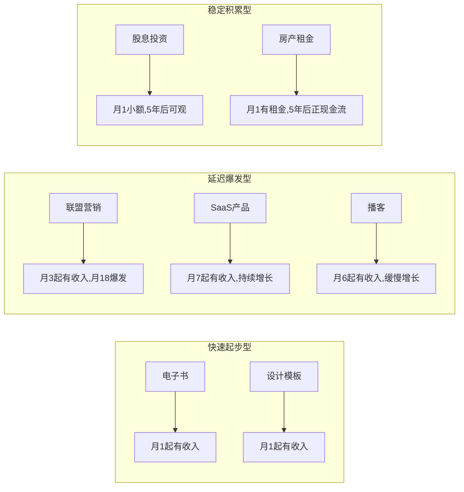
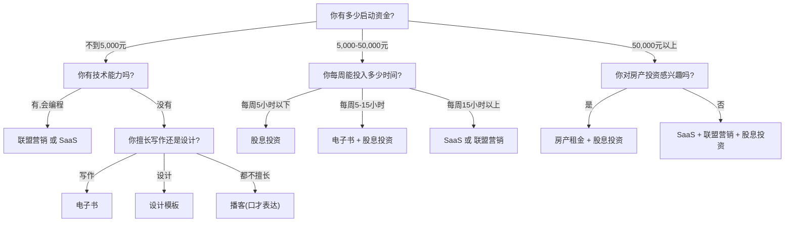

## 被动收入项目对比总结

前面七个案例分别展示了电子书、股息投资、设计模板、联盟营销、房产租金、SaaS产品和播客七种被动收入路径。每条路径都有人走通，但适合的人完全不同。本节从投入产出、风险收益、技能门槛、时间结构、可扩展性五个维度进行横向对比，帮你在具体决策前建立完整的判断框架。

---

### 一、七种被动收入项目全景对比

#### 1.1 核心数据速览

下表汇总了七个案例的关键数据指标，数据来源为各案例中的实际运营结果：

| 案例 | 类型 | 启动资金 | 前期时间投入 | 首笔收入时间 | 成熟期月收入 | 成熟周期 | 被动程度 |
|------|------|---------|-------------|-------------|-------------|---------|---------|
| 案例一 | 电子书 | <1,000元 | ~400小时(5个月) | 第1个月 | 12,449元 | 12个月 | ★★★★☆ |
| 案例二 | 股息投资 | 5万+起步,月投3,000元 | 持续投入+半年调仓 | 第1个月(小额) | 1,433元 | 5年+ | ★★★★★ |
| 案例三 | 设计模板 | <2,000元 | ~500小时(12个月) | 第1个月 | 15,780元 | 12个月 | ★★★★☆ |
| 案例四 | 联盟营销 | <1,000元 | ~600小时(首年) | 第3个月 | 28,000元 | 18个月 | ★★★☆☆ |
| 案例五 | 房产租金 | 51万元 | ~3个月(看房+装修) | 第1个月 | 3,500→4,500元 | 5年+ | ★★★★☆ |
| 案例六 | SaaS产品 | ~6,000元/年(云成本) | ~12个月(开发+运营) | 第7个月 | 3,500元(净利润) | 12个月+ | ★★★★☆ |
| 案例七 | 播客 | ~2,000元 | 持续每周投入 | 第6个月 | ~4,583元 | 12个月 | ★★★☆☆ |

几个关键发现值得强调：

**资金门槛差异极大。** 房产租金需要51万元启动资金，是其他六种方式的数百倍。如果你手上没有大额存款，这条路径在短期内根本无法启动——这不是能力问题，是资源约束。反过来看，电子书、联盟营销、设计模板的启动资金都在2,000元以内，几乎是零成本创业。

**"首笔收入"和"成熟期收入"是两回事。** 电子书和模板在第1个月就有收入，但金额很小（可能几十到几百元）。联盟营销第3个月才有第一笔佣金（280元），但成熟后月入2.8万。不要被"快速出单"迷惑，也不要因为"迟迟没有收入"而放弃——每种项目的收入曲线形态完全不同。

**被动程度不等于赚钱效率。** 股息投资的被动程度最高（半年调仓一次），但它需要巨额本金且月收入仅1,433元。联盟营销的被动程度中等（每周仍需5小时维护），但月收入达2.8万。被动程度高意味着维护成本低，不代表投入产出比高。

#### 1.2 投入产出比深度分析

单纯看月收入数字会产生误导，因为每个项目的投入资源性质不同。我们需要一个统一的衡量标准——**时间回报率**和**资金回报率**。

**时间回报率 = 项目总收益 ÷ 前期总投入时间**

以案例一（电子书）为例：首年总收入约85,000元，前期投入400小时，时间回报率 = 85,000 ÷ 400 = 212.5元/小时。这个数字远高于大多数人的本职工资时薪。

以案例四（联盟营销）为例：首年总收入约120,000元（从第3个月开始累积），前期投入600小时，时间回报率 = 120,000 ÷ 600 = 200元/小时。

但这里有一个陷阱：**时间回报率会随时间推移而变化。** 电子书在第24个月收入下降到7,541元/月，如果不更新内容，时间回报率会持续走低。联盟营销如果持续更新内容，流量和收入可以持续增长——SEO的复利效应使得后期的时间投入回报率反而更高。

**资金回报率 = 年被动收入 ÷ 总资金投入**

| 案例 | 总资金投入 | 年被动收入(成熟期) | 资金年化回报率 |
|------|-----------|------------------|--------------|
| 电子书 | <1,000元 | ~149,000元 | 14,900%+ |
| 股息投资 | 230,000元(5年累计) | 17,200元 | 7.5% |
| 设计模板 | <2,000元 | ~189,000元 | 9,450%+ |
| 联盟营销 | <1,000元 | ~336,000元 | 33,600%+ |
| 房产租金 | 510,000元 | 42,000-54,000元 | 8.2-10.6% |
| SaaS产品 | ~6,000元/年 | 42,000元 | 700% |
| 播客 | ~2,000元 | ~55,000元 | 2,750% |

这个对比揭示了一个重要规律：**数字化项目的资金回报率碾压实体项目。** 电子书、模板、联盟营销的资金投入不到2,000元，但年收入可达十几万甚至三十几万。房产投入51万，年回报也不过4-5万。但这不意味着数字项目"更好"——数字项目消耗的是你的时间和技能，实体项目消耗的是你的资金。对于时间充裕但资金有限的年轻人，数字项目是更优选择；对于资金充裕但时间有限的中年人，实体项目可能更合适。

#### 1.3 收入增长曲线对比

七种被动收入的增长曲线可以归纳为三种典型模式：

**快速起步型（电子书、设计模板）：** 第1个月就有收入，3-6个月达到可观水平，12个月左右达到峰值。但这类项目的缺点是收入可能随时间衰减——电子书会过时，模板会被人模仿。需要持续推出新产品来维持总收入。

**延迟爆发型（联盟营销、SaaS、播客）：** 前3-6个月几乎看不到收入，让人怀疑是否在做无用功。但一旦突破临界点，增长速度非常快。联盟营销从第3个月的280元到第18个月的28,000元，增长了100倍。SaaS的MRR（月度经常性收入）一旦积累起来，具有极强的粘性。这类项目考验的是前期的耐心。

**稳定积累型（股息投资、房产租金）：** 收入增长缓慢但稳定，几乎不受市场波动影响（长期来看）。5年后的收入才开始变得可观。这类项目的核心优势是确定性——只要坚持投入，收益几乎是确定的。但需要大量初始资本。

---

### 二、风险收益矩阵

被动收入的风险不能简单地用"高/中/低"来标注。风险至少包含三个维度：**资金风险**（你可能亏多少钱）、**时间风险**（你可能浪费多少时间）、**机会风险**（你做了这个项目而错过了什么）。

#### 2.1 多维风险评估

| 案例 | 资金风险 | 时间风险 | 市场风险 | 技术风险 | 综合风险 |
|------|---------|---------|---------|---------|---------|
| 电子书 | 极低（<1,000元） | 中（400小时可能打水漂） | 中（内容可能无市场） | 低 | ★★☆☆☆ |
| 股息投资 | 中（本金可能亏损20-30%） | 低（学习时间可迁移） | 中高（系统性风险） | 低 | ★★★☆☆ |
| 设计模板 | 极低（<2,000元） | 中高（500小时可能无回报） | 中（平台规则变化） | 低 | ★★★☆☆ |
| 联盟营销 | 极低（<1,000元） | 高（600小时+6个月等待） | 中高（SEO算法变化） | 低 | ★★★☆☆ |
| 房产租金 | 高（51万可能贬值） | 低（3个月） | 中高（房市波动） | 低 | ★★★★☆ |
| SaaS产品 | 低（云成本可控） | 高（12个月全职投入） | 中（竞争激烈） | 中（需要持续开发） | ★★★★☆ |
| 播客 | 极低（2,000元） | 高（持续每周投入12个月+） | 低（市场仍在增长） | 低 | ★★☆☆☆ |

**电子书和播客是风险最低的两种方式。** 资金投入都在2,000元以内，即使完全失败，损失的主要是时间。但"时间损失"也需要认真考虑——400小时相当于全职工作2.5个月，如果你的时薪是100元，那400小时的机会成本是40,000元。

**房产租金的资金风险最高。** 51万元不是小数目，如果遇到房价下跌（2022-2024年中国多个城市房价下跌10-30%），资产缩水可能超过10万元。而且房产是流动性极差的资产——想卖的时候不一定能卖出去，卖了也不一定不亏。

**联盟营销和SaaS的时间风险最高。** 联盟营销需要6个月以上才能看到有意义的收入，SaaS需要7个月才收到第一笔付费。这6-7个月里你每周投入10-20小时，却看不到任何回报。大多数人在第3-4个月就会放弃。

#### 2.2 最大回撤分析

"最大回撤"是投资领域的概念，指资产从最高点到最低点的最大跌幅。用在被动收入上，它衡量的是收入可能下滑的最大幅度：

| 案例 | 最大回撤幅度 | 回撤原因 | 恢复难度 |
|------|------------|---------|---------|
| 电子书 | -40%（月12的12,449元降至月24的7,541元） | 内容过时、新竞争者进入 | 中等（更新内容+推广） |
| 股息投资 | -20~-30%（股价下跌+股息削减） | 经济衰退、公司经营恶化 | 较慢（需等待市场恢复） |
| 设计模板 | -50%+（平台政策变化可能导致零收入） | 平台封号、规则变更 | 极难（需重建渠道） |
| 联盟营销 | -70%+（SEO算法更新可能导致流量骤降） | Google/百度算法更新 | 较慢（需3-6个月SEO恢复） |
| 房产租金 | -100%（空租期收入为零） | 租客退租、市场低迷 | 中等（降低租金或重新装修） |
| SaaS产品 | -30~-50%（用户流失） | 竞品上线、需求变化 | 中等（迭代产品+获客） |
| 播客 | -20~-30%（听众流失） | 内容质量下降、更新不稳定 | 较快（恢复更新即可） |

**联盟营销的最大回撤最惨烈。** 一个SEO算法更新可能让你的流量从12万UV暴跌到3万UV，收入从2.8万降到7,000元。这不是假设——2023年Google的Helpful Content Update就让大量联盟营销网站的流量下降了50-80%。应对策略是不要把所有流量押在SEO上，同时经营社交媒体和邮件列表。

**设计模板的平台依赖风险很高。** 模板收入全部来自第三方平台（如稿定设计、Canva模板市场、CreativeMarket），平台政策一变，你的店铺可能瞬间清零。最稳妥的做法是同时在3-5个平台上架，再加上自己的独立网站。

---

### 三、技能门槛与适配分析

#### 3.1 各项目所需技能矩阵

| 案例 | 核心技能 | 辅助技能 | 学习曲线 | 可迁移性 |
|------|---------|---------|---------|---------|
| 电子书 | 内容写作、行业专业知识 | 排版设计、社区运营、文案营销 | 中等（1-3个月） | 高（写作能力通用） |
| 股息投资 | 财务分析、价值投资理论 | 数据分析、宏观经济判断 | 中高（3-6个月） | 高（投资能力终身受用） |
| 设计模板 | 平面设计、PPT/设计软件 | 电商运营、用户研究 | 中等（已有基础则快） | 中（设计技能可迁移） |
| 联盟营销 | SEO、内容营销 | WordPress建站、数据分析、视频制作 | 高（6-12个月） | 高（数字营销技能通用） |
| 房产租金 | 房产市场分析、财务规划 | 装修管理、租客沟通、法律知识 | 中等（3个月） | 中（仅限房产领域） |
| SaaS产品 | 软件开发（后端为主） | 产品设计、客户支持、定价策略 | 高（已有基础则中等） | 高（技术能力通用） |
| 播客 | 口才表达、内容策划 | 音频剪辑、嘉宾管理、社区运营 | 低-中（1-2个月） | 中（表达能力通用） |

#### 3.2 按职业背景匹配推荐

不同职业背景的人，上手难度和成功率差异巨大：

**程序员/工程师 → 最适合：SaaS产品、联盟营销**

程序员天然具备SaaS所需的技术能力，建站和SEO也需要一定的技术基础。案例四（联盟营销）的主人公本身就是程序员，用WordPress+技术能力搭建了自动化网站。案例六（SaaS）的主人公也是后端工程师。程序员的优势是可以把很多流程自动化——自动部署、自动监控、自动回复——真正实现"被动"。

**设计师 → 最适合：设计模板、电子书（配图丰富的方向）**

设计师可以直接把日常工作中的模板和素材转化为可销售的数字产品。案例三（设计模板）的主人公从自由设计师转型，利用已有的设计能力快速出产品。设计师还可以为电子书做排版和封面设计，提升产品竞争力。

**金融/财务从业者 → 最适合：股息投资、房产租金**

金融从业者具备财务分析和风险评估的专业能力，这是股息投资的核心技能。他们对市场周期、估值方法、资产配置有天然的理解优势。房产投资也需要财务规划能力——计算租金回报率、贷款方案、税务优化等。

**内容创作者/媒体人 → 最适合：播客、电子书**

播客需要的核心技能是口才表达和内容策划，这正是媒体人的长项。电子书也需要内容创作能力。内容创作者的优势是已经有一定的受众基础和内容生产经验，冷启动更快。

**全栈型/不确定 → 最适合：从电子书或设计模板开始**

如果你不确定自己适合什么方向，电子书和设计模板是最佳起步选择——启动成本最低、回报最快、技能门槛最低。即使失败了，损失也最小。更重要的是，第一个项目成功后获得的信心和经验，会大大降低第二个项目的上手难度。

---

### 四、时间结构分析

被动收入常被误解为"不花时间"，但七种项目的时间结构完全不同。理解这一点对选择项目至关重要——如果你每周只能投入5小时，就不应该选SaaS（需要每周15-20小时）。

#### 4.1 各阶段时间投入对比

| 案例 | 建设期(月均) | 维护期(月均) | 建设期长度 | 被动化程度 |
|------|-------------|-------------|-----------|-----------|
| 电子书 | 80小时/月 | 2-5小时/月 | 5个月 | 高——写完后基本自动销售 |
| 股息投资 | 20小时/月(学习) | 2小时/月(调仓) | 持续 | 极高——半年调仓一次 |
| 设计模板 | 40小时/月 | 5-10小时/月 | 12个月 | 中高——需要持续上新 |
| 联盟营销 | 50小时/月 | 20小时/月(5小时/周) | 12个月 | 中——需持续更新内容 |
| 房产租金 | 全职3个月 | 2-3小时/月 | 一次性 | 高——智能锁+自动收款 |
| SaaS产品 | 全职12个月 | 20小时/月(5小时/周) | 持续 | 中高——需修复bug+客服 |
| 播客 | 15小时/月 | 15小时/月(每周4小时) | 持续 | 低——每周必须录制 |

**电子书的时间结构最优。** 建设期5个月、每月80小时，总计400小时。完成后，每月仅需2-5小时处理读者反馈和偶尔的推广。这意味着从第6个月开始，你的每小时"被动收入"极高——假设月入8,000元，5小时维护时间，时薪高达1,600元。

**播客的时间结构最不"被动"。** 每周需要4小时（录制2小时+剪辑1小时+发布和互动1小时），12个月后仍然如此。播客本质上是一个"低时薪的主动收入"，除非你能把它转化为其他收入源（课程、咨询、广告）。

**SaaS和联盟营销的维护时间取决于你的自动化程度。** 案例四（联盟营销）的主人公通过AI辅助写内容、自动化发布工具，将每周维护时间控制在5小时。案例六（SaaS）的主人公通过自动化客服和监控系统，也将维护时间控制在每周5小时。但如果你的自动化做得不好，这两个项目每周可能需要15-20小时——那就不是被动收入了，是第二份全职工作。

#### 4.2 时间投入的时间线

```mermaid
gantt
    title 七种被动收入项目时间投入对比（月为单位）
    dateFormat X
    axisFormat %s

    section 电子书
    高强度写作期(80h/月) : 0, 5
    低维护期(2-5h/月)   : 5, 36

    section 股息投资
    学习期(20h/月)       : 0, 3
    低维护期(2h/月)      : 3, 36

    section 设计模板
    产品创建期(40h/月)   : 0, 12
    持续上新+维护(10h/月) : 12, 36

    section 联盟营销
    内容建设期(50h/月)   : 0, 12
    维护更新期(20h/月)   : 12, 36

    section 房产租金
    选房装修期(全职)     : 0, 3
    低维护期(3h/月)      : 3, 36

    section SaaS产品
    开发验证期(全职)     : 0, 12
    运营维护期(20h/月)   : 12, 36

    section 播客
    持续录制期(15h/月)   : 0, 36
```

这张甘特图清楚地展示了：电子书、股息投资、房产租金在建设期结束后，时间投入急剧下降；而联盟营销、SaaS、播客在整个周期内都需要持续的时间投入。

---

### 五、可扩展性与天花板分析

#### 5.1 扩展路径对比

| 案例 | 天花板 | 扩展方式 | 规模化难度 |
|------|--------|---------|-----------|
| 电子书 | 中（单本月入5,000-15,000元） | 写更多书、出课程、建社群 | 低——每本独立 |
| 股息投资 | 高（取决于本金规模） | 持续追加投入、优化策略 | 低——金额规模化 |
| 设计模板 | 中高（单品利润低，靠量取胜） | 更多SKU、更高单价、私域流量 | 中——需要持续创意 |
| 联盟营销 | 高（顶级站月入10万+） | 更多内容、更高权重、更多品类 | 中——SEO需要时间积累 |
| 房产租金 | 中高（受限于资金和房产数量） | 买更多房、提高单房收益 | 高——每套房独立管理 |
| SaaS产品 | 极高（MRR无上限） | 更多功能、更高定价、企业客户 | 中——产品迭代+客服 |
| 播客 | 中（单档月入5,000-20,000元） | 更多广告、付费内容、衍生品 | 中——受众增长慢 |

**SaaS的天花板最高。** 一旦产品成熟，增加一个新用户的边际成本几乎为零。月费99元/用户，100个用户就是9,900元，1,000个用户就是99,000元。案例六的主人公在第12个月只有50个付费用户（月入3,500元），但如果能增长到500个用户，月收入就达到49,500元——这个增长不需要线性增加时间投入。

**电子书的天花板最低但最稳定。** 单本电子书的月收入很难突破20,000元（除非是超级畅销书）。但你可以写5本、10本，每本每月贡献5,000-10,000元，加起来也很可观。关键是每本书的维护时间几乎为零。

**股息投资的天花板取决于你的本金。** 如果你有500万元本金，4.6%的年股息率就是23万元/年，约1.9万元/月。但积累500万本金本身就需要极长时间。股息投资更适合作为"压舱石"而不是"主引擎"。

---

### 六、项目组合策略

选择单个项目的风险太高——任何项目都可能失败或衰退。最稳健的做法是构建一个被动收入组合。

#### 6.1 三种组合方案

**方案一：零资金起步组合（适合应届毕业生/低储蓄者）**

| 层级 | 项目 | 角色 | 时间占比 |
|------|------|------|---------|
| 核心收入 | 电子书或设计模板 | 主攻方向，投入最多时间 | 60% |
| 增长收入 | 联盟营销 | SEO长线布局 | 30% |
| 探索收入 | 播客 | 建立个人品牌 | 10% |

总启动资金：<5,000元
预期12个月后月收入：8,000-20,000元
关键策略：用电子书/模板快速出第一笔收入，维持信心和现金流；同时布局联盟营销的长线增长。

**方案二：有资金有技能组合（适合3-5年工作经验的专业人士）**

| 层级 | 项目 | 角色 | 时间占比 |
|------|------|------|---------|
| 核心收入 | SaaS产品或联盟营销 | 主力收入来源 | 50% |
| 增长收入 | 电子书 | 建立专家形象，引流 | 30% |
| 稳定收入 | 股息投资 | 长期压舱石 | 20% |

总启动资金：5-10万元
预期18个月后月收入：15,000-40,000元
关键策略：用技术能力打造SaaS或联盟营销主力收入，用电子书建立个人品牌引流，同时定投股息资产构建长期安全垫。

**方案三：资金充裕型组合（适合有一定积蓄的30+职场人士）**

| 层级 | 项目 | 角色 | 时间占比 |
|------|------|------|---------|
| 核心收入 | 房产租金+股息投资 | 资金驱动的稳定收入 | 40%资金 |
| 增长收入 | SaaS产品或联盟营销 | 时间驱动的高增长收入 | 40%时间 |
| 探索收入 | 播客或电子书 | 个人品牌+试错 | 20%时间 |

总启动资金：50-100万元
预期24个月后月收入：20,000-60,000元
关键策略：用资金构建房产+股息的稳定底仓，用时间投入SaaS或联盟营销追求高增长，用播客/电子书打造个人品牌护城河。

#### 6.2 组合构建的核心原则

**原则一：不超过三个活跃项目。** 同时做5个以上的项目，每个都做不好。人的精力是有限的，尤其是还有全职工作的情况下。三个项目已经是上限——一个主力、一个副力、一个试验。

**原则二：覆盖不同的收入曲线类型。** 理想的组合应该同时包含"快速起步型"（提供即时信心和现金流）和"延迟爆发型"（提供长期增长）和"稳定积累型"（提供安全垫）。

**原则三：技能可以复用。** 电子书的内容可以转化为播客素材，联盟营销的SEO知识可以用于SaaS获客，设计模板的经验可以用于电子书排版。选择技能可以互相复用的项目组合，效率最高。

**原则四：风险来源分散。** 不要同时做两个高度依赖SEO的项目（如联盟营销+内容型电子书），一次算法更新可能同时打击两个项目。也不要同时做两个需要大量内容创作的项目，疲劳会导致两个都做不好。

---

### 七、快速决策矩阵

如果你读完七个案例仍然不知道从哪里开始，用下面这个决策矩阵做排除法：

这个决策树的逻辑很简单：先按资金量排除不现实的选项，再按可投入时间筛选可行的方案，最后按技能匹配确定具体方向。

---

### 八、各项目适用人群画像

#### 8.1 适合做电子书的人

- 有某个领域的深度专业知识或独特经验
- 能够持续写作，不怕孤独
- 追求"做完就不用管"的高被动性
- 愿意花3-6个月看不到收入
- 不追求高收入天花板，看重稳定性和低维护

**不适合的人：** 不喜欢写作、没有可分享的专业知识、需要快速看到高额收入。

#### 8.2 适合做股息投资的人

- 有稳定的月收入，可以持续定投
- 有足够的耐心等待3-5年甚至更长
- 能承受短期账面亏损而不恐慌卖出
- 追求确定性和长期稳定
- 有一定的财务分析基础

**不适合的人：** 没有稳定的资金来源、急于看到回报、容易在市场下跌时恐慌。

#### 8.3 适合做设计模板的人

- 有平面设计、PPT设计或UI设计的基础技能
- 喜欢创作视觉内容
- 能持续产出高质量的设计作品
- 了解设计市场需求和趋势
- 愿意学习多平台上架和运营

**不适合的人：** 没有设计基础且不想学、审美能力弱、追求"一劳永逸"。

#### 8.4 适合做联盟营销的人

- 有SEO或内容营销的基础知识
- 愿意花6-12个月"养站"
- 有数据分析能力
- 能持续产出高质量评测内容
- 不怕技术问题（建站、服务器、插件等）

**不适合的人：** 没有耐心等待SEO起效、不愿意学习技术、不擅长写作。

#### 8.5 适合做房产租金的人

- 有50万元以上的可投资资金
- 对当地房产市场有了解
- 有长期持有（5年+）的心态
- 愿意处理租客相关事务（或愿意付费请人管理）
- 追求资产保值增值+稳定现金流

**不适合的人：** 资金不足、对房产市场不了解、需要高流动性。

#### 8.6 适合做SaaS产品的人

- 有软件开发能力（至少能做后端或前端）
- 有产品思维，能理解用户需求
- 愿意花6-12个月做产品开发和验证
- 能接受早期收入很低
- 想要高天花板的被动收入

**不适合的人：** 不会编程且不想学、没有耐心打磨产品、不愿意做客户支持。

#### 8.7 适合做播客的人

- 口才好，表达清晰
- 有可分享的专业知识或有趣的个人经历
- 喜欢与人交流
- 追求个人品牌建设
- 能坚持每周更新至少1年

**不适合的人：** 不善表达、不喜欢公开分享、无法坚持长期更新。

---

### 九、常见决策误区

在选择被动收入项目时，很多人会犯以下错误：

**误区一：只看收入数字，不看投入成本。**

看到"联盟营销月入2.8万"就兴奋，没看到背后是600小时的前期投入和18个月的等待期。看到"房产租金月入4,500元"就心动，没看到背后是51万元的首付。正确做法是计算**时间回报率**和**资金回报率**，而不是只看绝对收入数字。

**误区二：选择"最赚钱"的项目而不是"最适合自己的"项目。**

联盟营销的天花板最高，但如果你不懂SEO、不想写内容、没有耐心等半年，它对你来说就是零收入。电子书的天花板不如SaaS，但如果你擅长写作、想快速起步，它的投入产出比反而更高。项目没有绝对的好坏，只有适不适合你当前的资源和能力。

**误区三：同时开始太多项目。**

很多人的计划是"电子书+SaaS+联盟营销+股息投资"同时推进。结果每个项目都投入不够，一个都做不成。正确做法是先集中精力做好一个项目，等它进入维护期（不再需要大量时间投入）后，再启动第二个。

**误区四：忽视维护成本。**

以为"做完就不用管了"。实际上每个项目都需要或多或少的维护：电子书需要回复读者评论和偶尔推广，SaaS需要修bug和客服，联盟营销需要更新内容和监控排名，房产需要处理租客问题。在选择项目时，必须把维护成本纳入考量。

**误区五：把"被动收入"当副业中的副业。**

很多人的态度是"主业忙完了再搞被动收入"。结果主业一忙，被动收入项目就被无限期搁置。被动收入的建设期需要持续、稳定的时间投入——每周至少10-15小时，持续6-12个月。如果你连每周10小时都挤不出来，建议先优化时间管理，而不是启动新项目。

---

### 十、总结：如何用好这份对比

这份对比的目的不是告诉你"哪个项目最好"，而是帮你建立一个系统化的决策框架。具体来说：

**第一步：评估你当前的资源状态。** 你有多少启动资金？每周能投入多少时间？你有哪些可迁移的技能？你的风险承受能力如何？

**第二步：用决策矩阵筛选2-3个候选项目。** 不要贪多，2-3个足够。如果完全没头绪，从电子书或设计模板开始——成本最低、反馈最快。

**第三步：用"最小可行投入"快速验证。** 不要一上来就全职投入。先花2-4周做一个最小版本，看看市场反馈。电子书写一个10页的迷你版投放测试，联盟营销先写5篇文章看流量，SaaS先做一个landing page看有没有人注册。

**第四步：验证成功后全力投入。** 一旦确认方向可行，立即加大投入，在建设期集中精力把项目推到"可维护"状态。

**第五步：进入维护期后启动第二个项目。** 第一个项目的维护时间降到每周5小时以内后，用腾出来的时间启动下一个项目。

这五步走下来，12-18个月后你大概率会拥有至少一个稳定运行的被动收入源。不多，但它会在你睡觉的时候为你赚钱——这就是被动收入的意义。
