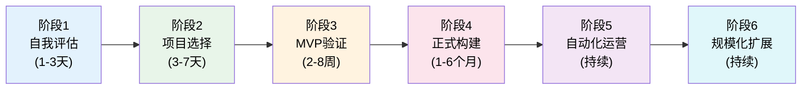
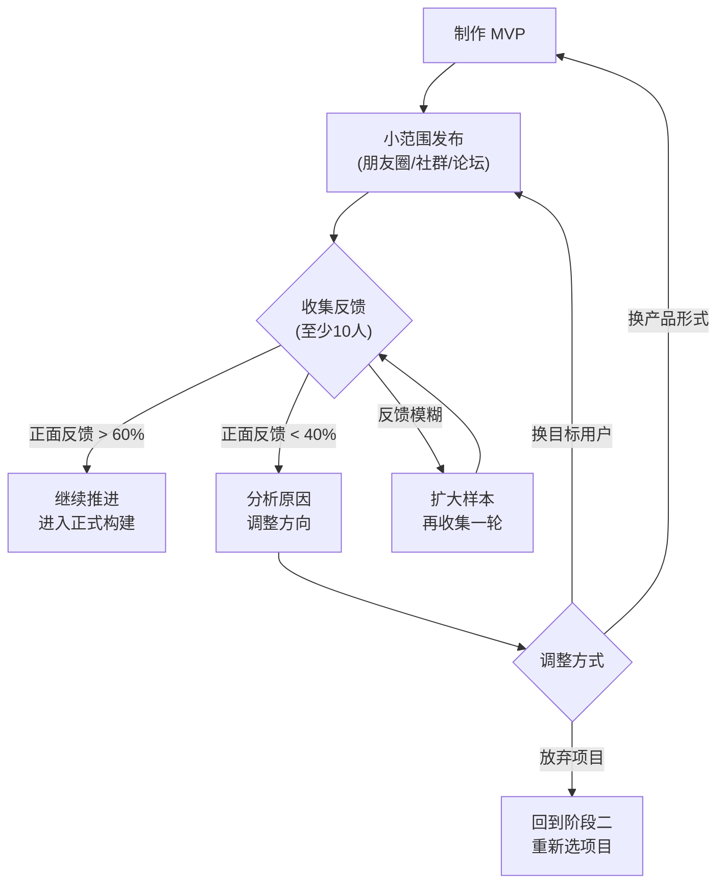
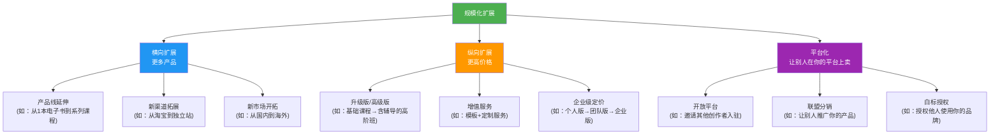

## 被动收入构建实操清单

> **本文定位：** 这是从本章 7 个真实案例中提炼出的通用操作清单。无论你选择电子书、数字产品、联盟营销、SaaS、股息投资、房产租金还是播客，都可以直接套用这份清单来推进你的项目。每一步都标注了参考案例和预期时间，确保你不会在任何环节卡住。

---

### 一、总览：被动收入构建的 6 个阶段

整个被动收入项目的生命周期可以划分为 6 个阶段，每个阶段有明确的交付物和验收标准：



| 阶段 | 核心目标 | 关键交付物 | 通过标准 |
|------|---------|-----------|---------|
| 自我评估 | 盘点可用资源 | 个人资源清单 | 清楚自己有什么、能做什么 |
| 项目选择 | 选定方向 | 项目评估报告 | 评估总分 ≥ 18/30 |
| MVP 验证 | 确认市场需求 | 最小可行产品 + 市场反馈数据 | 至少 10 人付费或表达明确购买意愿 |
| 正式构建 | 完成可交付产品 | 完整产品 + 销售页面 + 支付流程 | 陌生人能独立完成购买和使用 |
| 自动化运营 | 减少人工干预 | 自动化系统 + 数据看板 | 7 天以上无需人工干预仍能持续产生收入 |
| 规模化扩展 | 增加收入总量 | 新产品线或新渠道 | 月收入同比增长 20% 以上 |

---

### 二、阶段一：自我评估清单（1-3 天）

在选择任何项目之前，先做一次彻底的自我盘点。很多人的失败不是因为项目不好，而是因为选择了一个与自己资源禀赋完全不匹配的方向。

#### 2.1 技能盘点

用以下表格梳理你当前掌握的技能，按熟练度打分（1-5 分）：

| 技能类别 | 具体技能 | 熟练度(1-5) | 市场需求(1-5) | 可变现程度 |
|---------|---------|------------|-------------|-----------|
| 专业技能 | （如：编程、设计、写作、财务分析） | | | |
| 工具技能 | （如：Excel、Photoshop、视频剪辑） | | | |
| 软技能 | （如：教学、演讲、沟通、项目管理） | | | |
| 兴趣爱好 | （如：摄影、健身、烹饪、游戏） | | | |
| 行业经验 | （如：电商运营、教育培训、医疗健康） | | | |

> **参考案例：** 案例一（电子书）的作者利用了自身的写作能力和行业专业知识；案例三（设计模板）的作者本身就是设计师，工具技能直接变现。

#### 2.2 资源盘点

| 资源类型 | 你拥有的 | 可投入量 | 备注 |
|---------|---------|---------|------|
| 时间 | 每天/每周可投入多少小时？ | ____小时/周 | 区分工作日和周末 |
| 资金 | 可以投入多少启动资金？ | ____元 | 必须是"亏了也不影响生活"的钱 |
| 人脉 | 有多少目标领域的人脉资源？ | ____人 | 包括潜在客户、合作伙伴、导师 |
| 设备 | 有哪些可用的硬件和软件？ | | 电脑、相机、麦克风、正版软件等 |
| 平台账号 | 已有哪些平台的账号和粉丝基础？ | | 微信公众号、小红书、B站、抖音等 |

#### 2.3 风险承受力评估

| 问题 | 你的回答 | 影响 |
|------|---------|------|
| 如果这个项目 6 个月没有任何收入，你能接受吗？ | 是/否 | 决定你能选择多长回报周期的项目 |
| 你能投入的最大资金是多少？这笔钱全部亏损会影响生活吗？ | ____元 | 决定项目的资金门槛上限 |
| 你的主业是否稳定？被动收入项目是在职还是离职状态做？ | 在职/离职 | 在职状态容错率更高 |
| 你的家庭是否支持你投入时间和精力做副业？ | 是/否 | 家庭支持是长期坚持的关键因素 |

> **核心原则：** 永远用"输得起"的资源去投入。案例二（股息投资）的作者用了 3 年时间才看到稳定的分红收入，期间从未动用生活必需资金。

#### 2.4 自我评估完成标准

- [ ] 完成技能盘点表，至少识别出 3 项可变现技能
- [ ] 完成资源盘点表，明确时间、资金、人脉的上限
- [ ] 完成风险承受力评估，确定能接受的回报周期和资金上限
- [ ] 写出一句话总结："我可以用 ____（技能）在 ____（时间）内，投入 ____（资源），为 ____（人群）提供 ____（价值）"

---

### 三、阶段二：项目选择清单（3-7 天）

#### 3.1 候选项目生成

基于自我评估的结果，用以下方法生成 3-5 个候选项目：

**方法一：技能 × 需求交叉法**

将你的技能与市场需求做交叉，找到重叠区域：

| | 知识付费 | 设计/创意 | 技术/工具 | 投资/理财 |
|---|---------|----------|----------|----------|
| 你的专业技能 | 在线课程？电子书？ | 模板？素材包？ | SaaS工具？插件？ | 投资策略课程？ |
| 你的兴趣爱好 | 教程？社群？ | 周边产品？ | 自动化脚本？ | 投资实盘分享？ |
| 你的行业经验 | 行业报告？咨询？ | 行业专属设计？ | 行业SaaS？ | 行业投资分析？ |

**方法二：痛点发现法**

在以下平台搜索你熟悉的领域，找到用户反复提出的问题：

- **知乎**：搜索你的领域关键词，看高赞回答下的追问
- **小红书**：搜索相关话题，看评论区的吐槽和需求
- **淘宝/闲鱼**：搜索相关产品，看差评中的痛点
- **行业论坛/社群**：观察新人最常问的问题
- **百度指数/微信指数**：确认需求是否有足够的搜索量

**方法三：竞品分析法**

找到已经在赚钱的同类产品，分析它们的不足：

| 分析维度 | 具体操作 |
|---------|---------|
| 价格 | 竞品定价多少？有没有价格空白带？ |
| 质量 | 竞品的用户评价中有哪些不满？ |
| 覆盖面 | 竞品覆盖了哪些细分市场？哪些没覆盖？ |
| 更新频率 | 竞品多久更新一次？有没有过时的内容？ |
| 用户体验 | 竞品的购买和使用流程顺畅吗？ |

#### 3.2 项目评估矩阵

对每个候选项目，用以下 10 个维度进行评分（每项 1-3 分，总分 30 分）：

| 评估维度 | 1 分（弱） | 2 分（中） | 3 分（强） | 项目A | 项目B | 项目C |
|---------|-----------|-----------|-----------|-------|-------|-------|
| 市场需求 | 需求模糊，需要教育市场 | 有需求但竞争激烈 | 需求明确且未被充分满足 | | | |
| 技能匹配 | 需要从零学习 | 有基础需要提升 | 完全匹配现有技能 | | | |
| 启动成本 | 需要大额资金（>5万） | 中等投入（1-5万） | 低成本启动（<1万） | | | |
| 时间投入 | 需要全职投入6个月以上 | 需要兼职3-6个月 | 兼职1-3个月可上线 | | | |
| 边际成本 | 每单仍需大量人工 | 有一定自动化但需人工 | 完全自动交付，边际成本趋零 | | | |
| 收入天花板 | 月入上限 <3000 | 月入上限 3000-2万 | 月入上限 >2万 | | | |
| 收入持续性 | 一次性收入为主 | 有一定复购或续费 | 高复购/长尾效应强 | | | |
| 竞争壁垒 | 容易被复制 | 有一定门槛 | 有强壁垒（品牌/技术/资源） | | | |
| 可规模化 | 难以规模化 | 可以部分规模化 | 天然适合规模化 | | | |
| 个人兴趣 | 纯粹为了赚钱 | 不排斥 | 真心热爱这个领域 | | | |

> **决策规则：** 选总分最高的项目。如果两个项目分数接近，优先选择"个人兴趣"得分更高的那个——因为被动收入项目需要长期投入，兴趣是最好的驱动力。参考案例四（联盟营销）的作者选择了自己热爱的户外装备领域，即使前期收入微薄也能坚持 10 个月直到盈利。

#### 3.3 竞品深度调研

选定方向后，用 2-3 天做竞品深度调研：

- [ ] 找到至少 5 个同类产品/项目
- [ ] 购买/体验至少 2 个竞品（如果价格可接受）
- [ ] 记录竞品的产品结构、定价策略、营销渠道
- [ ] 整理竞品用户评价中的好评点和差评点
- [ ] 找到竞品未覆盖的细分需求或做得不够好的地方
- [ ] 确定你的差异化切入点

#### 3.4 项目选择完成标准

- [ ] 生成了 3-5 个候选项目
- [ ] 完成评估矩阵，选定总分最高的项目
- [ ] 完成竞品深度调研，找到差异化切入点
- [ ] 写出一句话项目定义："我要为 [目标用户] 提供 [产品/服务]，解决 [具体痛点]，通过 [渠道] 销售，定价 [价格区间]"

---

### 四、阶段三：MVP 验证清单（2-8 周）

MVP（最小可行产品）的目标不是做出完美产品，而是用最小成本验证市场需求是否真实存在。

#### 4.1 MVP 设计原则

| 原则 | 说明 | 反面教材 |
|------|------|---------|
| 最小化 | 只包含核心功能，砍掉一切锦上添花 | 花3个月做一个"完美"课程，发现没人买 |
| 可测试 | 必须能收集到真实的用户反馈 | 做了产品但没有渠道接触目标用户 |
| 可交付 | 用户能实际使用并给出评价 | 只是一个概念演示，用户无法体验价值 |
| 可迭代 | 能根据反馈快速调整 | 做成一次性产品，改不了 |

#### 4.2 各类型项目的 MVP 方案

| 项目类型 | MVP 形式 | 制作时间 | 验证方式 | 参考案例 |
|---------|---------|---------|---------|---------|
| 电子书 | 写一个 10-20 页的 mini 电子书或详细文章 | 1-2 周 | 放到社交媒体/公众号，看阅读量和付费意愿 | 案例一 |
| 在线课程 | 录制 3-5 节核心课程（每节 10-15 分钟） | 2-3 周 | 低价预售或免费试听后收集反馈 | — |
| 设计模板 | 制作 5-10 个高质量模板 | 2-4 周 | 放到设计平台（如站酷、Dribbble）看下载量 | 案例三 |
| SaaS 工具 | 开发核心功能的网页版原型 | 4-8 周 | 邀请 20-50 个目标用户试用并收集反馈 | 案例六 |
| 联盟营销 | 搭建一个有 10-20 篇文章的内容网站 | 4-6 周 | 通过 SEO 和社交媒体引流，看点击和转化 | 案例四 |
| 播客 | 录制 3-5 期节目 | 2-3 周 | 发布到播客平台，看播放量和评论 | 案例七 |
| 股息投资 | 用模拟盘或小额实盘测试投资策略 | 4-12 周 | 对比策略收益与基准指数 | 案例二 |

#### 4.3 MVP 验证流程



#### 4.4 MVP 数据收集清单

在 MVP 阶段，你需要收集以下关键数据：

| 数据指标 | 收集方式 | 达标标准 |
|---------|---------|---------|
| 试用/阅读人数 | 平台后台数据、链接点击统计 | ≥ 50 人 |
| 付费转化率 | 预售/付费人数 ÷ 试用人数 | ≥ 5%（低价产品）或 ≥ 2%（高价产品） |
| 用户满意度 | 问卷调查（NPS 评分） | NPS ≥ 30（0-100 分制） |
| 用户反馈关键词 | 整理用户评论中的高频词 | 正面关键词 > 负面关键词 |
| 复购意愿 | 问"如果正式版上线，你会购买吗？" | "会"的比例 ≥ 30% |
| 用户愿意支付的价格 | 价格敏感度测试 | 确认定价区间 |

#### 4.5 MVP 验证完成标准

- [ ] MVP 已制作完成并发布
- [ ] 至少 50 人试用/阅读/体验
- [ ] 收集到至少 10 份有效反馈
- [ ] 付费转化率或购买意向率达到上述标准
- [ ] 根据反馈调整了产品方向或确认方向正确
- [ ] 决策：继续推进 / 调整方向 / 放弃项目

> **关键提醒：** 如果 MVP 验证失败，不要死磕。案例六（SaaS）的作者在第一个产品方向失败后，根据用户反馈转向了另一个方向，最终月入超过 15,000 元。放弃一个不行的方向不是失败，是止损。

---

### 五、阶段四：正式构建清单（1-6 个月）

MVP 验证通过后，进入正式产品构建阶段。

#### 5.1 产品构建清单

**通用构建步骤：**

- [ ] 基于 MVP 反馈确定最终产品范围和功能清单
- [ ] 制定详细的产品开发计划（拆分成 2-4 周的迭代周期）
- [ ] 设计产品结构和用户使用流程
- [ ] 制作完整产品内容/功能
- [ ] 内部测试（找 3-5 个非参与制作的人试用）
- [ ] 修复测试中发现的问题
- [ ] 准备产品文档/使用说明/FAQ

**各类型产品的专项清单：**

**电子书/在线课程：**

- [ ] 确定目录结构，每章有明确的学习目标
- [ ] 撰写/录制全部内容，每章有实操案例
- [ ] 设计封面（可用 Canva 等工具，或外包给设计师）
- [ ] 排版和格式化（PDF/EPUB/MOBI）
- [ ] 准备前言、作者简介、推荐语
- [ ] 案例一参考：6 个月完成，核心是"内容质量决定长尾收入"

**设计模板/数字素材：**

- [ ] 确定模板系列的主题和数量（建议首批 20-50 个）
- [ ] 统一设计规范（颜色、字体、间距、命名规则）
- [ ] 制作预览图和展示效果图
- [ ] 准备多格式文件（PSD/AI/Sketch/Figma）
- [ ] 编写使用说明文档
- [ ] 案例三参考：3 个月完成，核心是"模板化思维是规模化的关键"

**SaaS 产品：**

- [ ] 完成技术架构设计（前后端选型、数据库设计）
- [ ] 开发核心功能模块
- [ ] 实现用户注册、登录、支付流程
- [ ] 部署上线环境（服务器、域名、SSL 证书）
- [ ] 编写 API 文档和用户手册
- [ ] 设置监控和报警系统
- [ ] 案例六参考：8 个月完成，核心是"解决真实痛点比炫技更重要"

**联盟营销/内容网站：**

- [ ] 搭建网站（WordPress/Next.js 等）
- [ ] 完成 SEO 基础设置（sitemap、robots.txt、结构化数据）
- [ ] 撰写 30-50 篇高质量内容文章
- [ ] 搭建内链结构
- [ ] 注册联盟营销平台账号（淘宝客、京东联盟、Amazon Associates 等）
- [ ] 配置追踪链接和转化统计
- [ ] 案例四参考：4 个月搭建，核心是"SEO 是最持久的流量来源"

**播客：**

- [ ] 确定播客定位、名称、封面设计
- [ ] 准备录制设备和软件（推荐：USB 麦克风 + Audacity/Adobe Audition）
- [ ] 录制并剪辑前 10 期节目
- [ ] 选择播客托管平台（喜马拉雅、小宇宙、Apple Podcasts）
- [ ] 准备节目描述、标签、分类
- [ ] 案例七参考：2 个月筹备，核心是"一致性比爆款更重要"

**股息投资组合：**

- [ ] 确定投资策略（核心-卫星策略/指数+个股/REITs 配置）
- [ ] 筛选投资标的（股息率、连续分红年限、派息比率、行业分散）
- [ ] 开设证券账户并完成银证转账
- [ ] 制定买入计划（分批建仓 vs 一次性投入）
- [ ] 设置股息再投资计划（DRIP）
- [ ] 建立投资记录表（买入价格、股息记录、收益率追踪）
- [ ] 案例二参考：50 万本金，3 年达到稳定月入 2000-3500 元

#### 5.2 销售系统搭建清单

产品做好了还不够，你需要搭建完整的销售系统：

- [ ] **销售页面**：产品介绍、核心卖点、用户评价、FAQ、购买按钮
- [ ] **支付系统**：接入微信支付/支付宝/PayPal/Stripe（根据目标市场选择）
- [ ] **交付系统**：数字产品自动发货（邮件/网盘链接）、实体产品对接供应链
- [ ] **客服系统**：至少准备一个 FAQ 页面和一个联系方式
- [ ] **数据统计**：安装网站分析工具（百度统计/Google Analytics）、设置转化追踪

#### 5.3 正式构建完成标准

- [ ] 完整产品已制作完成并通过内部测试
- [ ] 销售页面上线，支付流程可正常走通
- [ ] 自动交付系统测试通过（自己走一遍完整购买流程）
- [ ] 至少发布到 2 个销售渠道
- [ ] 第一批付费用户已完成购买和使用

---

### 六、阶段五：自动化运营清单

被动收入的"被动"不是天然的，是设计出来的。这个阶段的核心目标是：**让你可以 7 天以上不碰这个项目，收入仍然正常运转。**

#### 6.1 自动化系统搭建

| 环节 | 自动化方案 | 推荐工具 | 参考案例 |
|------|-----------|---------|---------|
| 销售 | 自动处理订单和支付 | Shopify、有赞、Gumroad、WooCommerce | 案例三 |
| 交付 | 数字产品自动发货 | 网盘自动分享链接、邮件自动发送 | 案例一、案例三 |
| 客服 | FAQ + 自动回复 + Chatbot | 微信自动回复、Intercom、Tidio | 案例六 |
| 推广 | SEO + 社交媒体定时发布 + 邮件自动序列 | WordPress SEO 插件、Buffer、Mailchimp | 案例四 |
| 数据 | 自动生成报表 | Google Analytics、百度统计、自建看板 | 案例四 |

#### 6.2 SOP 文档化

把你做的每一步操作写成标准操作流程（SOP），这样以后可以交给别人执行：

**SOP 模板：**

```text
SOP 编号：[编号]
任务名称：[名称]
执行频率：[每天/每周/每月/按需]
执行步骤：
1. [具体操作步骤1]
2. [具体操作步骤2]
3. [具体操作步骤3]
...
验收标准：[怎样算做完了]
异常处理：[出现问题时怎么办]
所需工具：[需要的软件/平台/账号]
预计耗时：[分钟]
```

**至少为以下操作编写 SOP：**

- [ ] 内容发布流程（新文章/新产品上线的完整步骤）
- [ ] 客户服务流程（常见问题的标准回复模板）
- [ ] 数据监控流程（每天/每周需要检查哪些指标）
- [ ] 推广执行流程（社交媒体发布、邮件营销、SEO 优化）
- [ ] 收入对账流程（核对各渠道收入数据）

#### 6.3 外包策略

当项目开始产生稳定收入后，将低价值工作外包出去：

| 工作类型 | 外包建议 | 参考时薪 | 外包平台 |
|---------|---------|---------|---------|
| 内容排版 | 可以外包 | 30-50 元/小时 | 猪八戒、Fiverr |
| 客服回复 | 可以外包（用 SOP 培训） | 20-40 元/小时 | 兼职平台、社群 |
| 数据录入 | 必须外包 | 15-30 元/小时 | 猪八戒、TaskRabbit |
| 设计美化 | 视情况外包 | 50-200 元/小时 | 站酷、Dribbble |
| 核心内容创作 | 不外包（核心竞争力） | — | — |
| 战略决策 | 不外包（你的核心价值） | — | — |

> **参考案例：** 案例五（房产租金）的核心经验就是"物业管理外包是被动化的关键"。作者将租客筛选、维修协调、收租全部交给物业公司，每月支付租金收入的 8-10% 作为管理费，换来了真正的被动。

#### 6.4 数据监控看板

建立一个数据看板，每天花 10 分钟检查以下关键指标：

| 指标类别 | 具体指标 | 检查频率 | 预警阈值 |
|---------|---------|---------|---------|
| 收入 | 日收入、月累计收入、同比增长率 | 每天 | 日收入低于 30 天均值的 50% |
| 流量 | 访问量、流量来源分布 | 每天 | 流量连续 3 天下降超过 20% |
| 转化 | 转化率、客单价、购物车放弃率 | 每周 | 转化率低于历史均值的 70% |
| 用户 | 新用户数、复购率、投诉率 | 每周 | 投诉率超过 5% |
| 产品 | 退款率、差评率、更新需求 | 每月 | 退款率超过 10% |

#### 6.5 自动化运营完成标准

- [ ] 所有可自动化的环节已完成自动化配置
- [ ] 核心 SOP 文档已编写完成（至少 5 份）
- [ ] 低价值工作已外包或计划外包
- [ ] 数据监控看板已搭建并每日查看
- [ ] 项目可在 7 天以上无人工干预的情况下正常运转并产生收入

---

### 七、阶段六：规模化扩展清单

当你的被动收入项目稳定运转后，进入规模化阶段。目标是：**在不大幅增加时间投入的前提下，持续提升收入总量。**

#### 7.1 规模化的三条路径



#### 7.2 规模化决策矩阵

| 你的现状 | 推荐路径 | 具体行动 | 预期效果 |
|---------|---------|---------|---------|
| 单一产品，月入 <5000 | 横向扩展：增加产品线 | 围绕核心主题开发 2-3 个新产品 | 月收入提升 50-200% |
| 单一产品，月入 5000-2万 | 纵向扩展：提升客单价 | 推出高级版/含服务的版本 | 月收入提升 30-100% |
| 多个产品，月入 >2万 | 平台化：开放分销 | 搭建联盟分销系统，让别人帮你卖 | 月收入提升 50-300% |
| 收入增长停滞 | 新渠道/新市场 | 开拓新平台或海外市场 | 打破增长天花板 |

#### 7.3 组合策略

不要把所有收入来源压在一个项目上。推荐以下组合策略：

| 收入层 | 数量 | 占比目标 | 作用 | 投入比例 |
|-------|------|---------|------|---------|
| 核心收入 | 1-2 个成熟项目 | 占总收入 60-70% | 提供稳定现金流 | 30% 时间维护 |
| 增长收入 | 1-2 个发展中项目 | 占总收入 20-30% | 未来的核心收入来源 | 50% 时间投入 |
| 探索收入 | 1 个试验性项目 | 占总收入 0-10% | 寻找下一个增长点 | 20% 时间试验 |

> **参考案例：** 案例四（联盟营销）的作者在主站稳定后，又开拓了 2 个细分领域的子站作为增长收入，同时测试了一个工具类产品作为探索收入。

#### 7.4 规模化完成标准

- [ ] 至少有 2 个以上收入来源
- [ ] 核心收入层稳定贡献 60% 以上收入
- [ ] 增长收入层有明确的增长计划和里程碑
- [ ] 月收入同比增长 20% 以上
- [ ] 时间投入没有同比例增长（效率提升）

---

### 八、全周期时间线参考

以下是一个被动收入项目从零到稳定收入的典型时间线：

| 时间节点 | 阶段 | 关键里程碑 | 典型收入 |
|---------|------|-----------|---------|
| 第 1-2 周 | 自我评估 | 完成个人资源盘点 | 0 |
| 第 2-3 周 | 项目选择 | 选定方向，完成竞品调研 | 0 |
| 第 1-2 个月 | MVP 验证 | 制作并发布 MVP，收集反馈 | 0-500 元 |
| 第 2-4 个月 | 正式构建 | 完成完整产品，搭建销售系统 | 500-3000 元 |
| 第 4-6 个月 | 自动化运营 | 系统运转稳定，开始外包 | 3000-8000 元 |
| 第 6-12 个月 | 规模化扩展 | 拓展产品线或新渠道 | 8000-20000 元 |
| 第 12 个月以上 | 持续优化 | 多收入源组合，持续增长 | 20000 元以上 |

> **注意：** 以上时间线仅供参考。不同类型的项目差异极大：案例七（播客）2 个月筹备即上线但 12 个月才稳定；案例六（SaaS）8 个月开发但月入可达 50,000 元。股息投资（案例二）需要 3 年以上才能看到显著回报。选择适合自己的节奏，不要被别人的时间线焦虑。

---

### 九、各阶段常见卡点与解决方案

| 阶段 | 常见卡点 | 解决方案 | 紧急程度 |
|------|---------|---------|---------|
| 自我评估 | "我没有什么可变现的技能" | 列出你日常工作中的具体任务，拆解成可教学/可模板化的技能 | ⚠️ 中 |
| 项目选择 | "选了太多方向，不知道做哪个" | 用评估矩阵强制打分，只选总分最高的一个 | 🔴 高 |
| MVP 验证 | "做完了 MVP 但没人看" | 换渠道推广，或目标用户定位不准确需要调整 | 🔴 高 |
| MVP 验证 | "有人看但没人付费" | 价格可能过高，或产品价值没有被清楚传达 | 🔴 高 |
| 正式构建 | "做着做着就没动力了" | 设定 2 周一个的小里程碑，每完成一个就庆祝 | ⚠️ 中 |
| 正式构建 | "功能越加越多，永远做不完" | 严格遵循 MVP 精神，砍掉非核心功能 | 🔴 高 |
| 自动化 | "自动化后出了问题没人处理" | 建立异常处理 SOP + 设置报警通知 | ⚠️ 中 |
| 规模化 | "收入增长遇到瓶颈" | 检查是流量瓶颈还是转化率瓶颈，对症下药 | ⚠️ 中 |

---

### 十、复盘与迭代模板

每个阶段完成后，用以下模板做一次复盘：

```text
## 阶段复盘：[阶段名称]

### 完成情况
- 计划完成项：[数量]
- 实际完成项：[数量]
- 完成率：[百分比]

### 关键数据
- 投入时间：[小时]
- 投入资金：[元]
- 产出成果：[具体描述]

### 做得好的
1. [具体事项 + 为什么做得好]
2. [具体事项 + 为什么做得好]

### 需要改进的
1. [具体问题 + 改进方案]
2. [具体问题 + 改进方案]

### 下一阶段重点
1. [最重要的 1-3 件事]

### 意外发现
- [过程中发现的意外信息或机会]
```

---

### 十一、心理建设检查清单

被动收入项目最大的敌人不是技术或市场，而是心态。以下检查清单帮助你在每个阶段保持正确的心理状态：

- [ ] **我接受了"前期看不到回报是正常的"这个事实吗？** —— 案例二（股息投资）等了 3 年，案例四（联盟营销）前 6 个月几乎零收入
- [ ] **我在用数据做决策，而不是用情绪吗？** —— 转化率低不代表产品不行，可能只是渠道不对
- [ ] **我在和昨天的自己比，而不是和别人的成果比吗？** —— 别人月入 10 万是因为他已经做了 3 年
- [ ] **我把失败当作数据点，而不是对自己的否定吗？** —— MVP 失败只是证明这个方向不行，不是证明你不行
- [ ] **我在持续学习和调整，而不是闭门造车吗？** —— 定期看竞品动态、行业趋势、用户反馈
- [ ] **我有清晰的里程碑和奖励机制吗？** —— 每完成一个阶段给自己一个奖励，保持动力

> **最后一句话：** 被动收入不是一夜之间建成的。每一个案例中的成功者，都经历了至少 3 个月的"看不到希望"阶段。他们之所以成功，不是因为他们更聪明或更幸运，而是因为他们按照系统化的方法持续行动，在正确的方向上坚持了足够长的时间。这份清单就是你的行动地图——现在，开始执行第一步。
