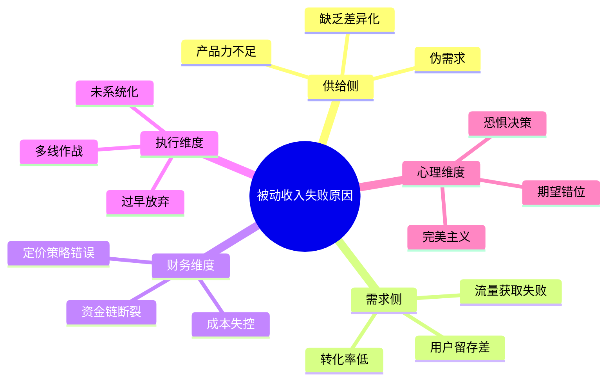
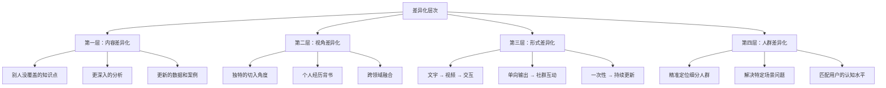
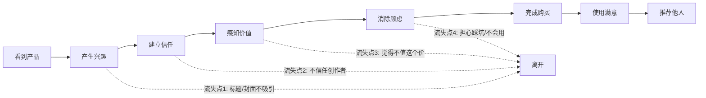
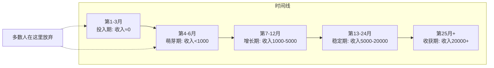
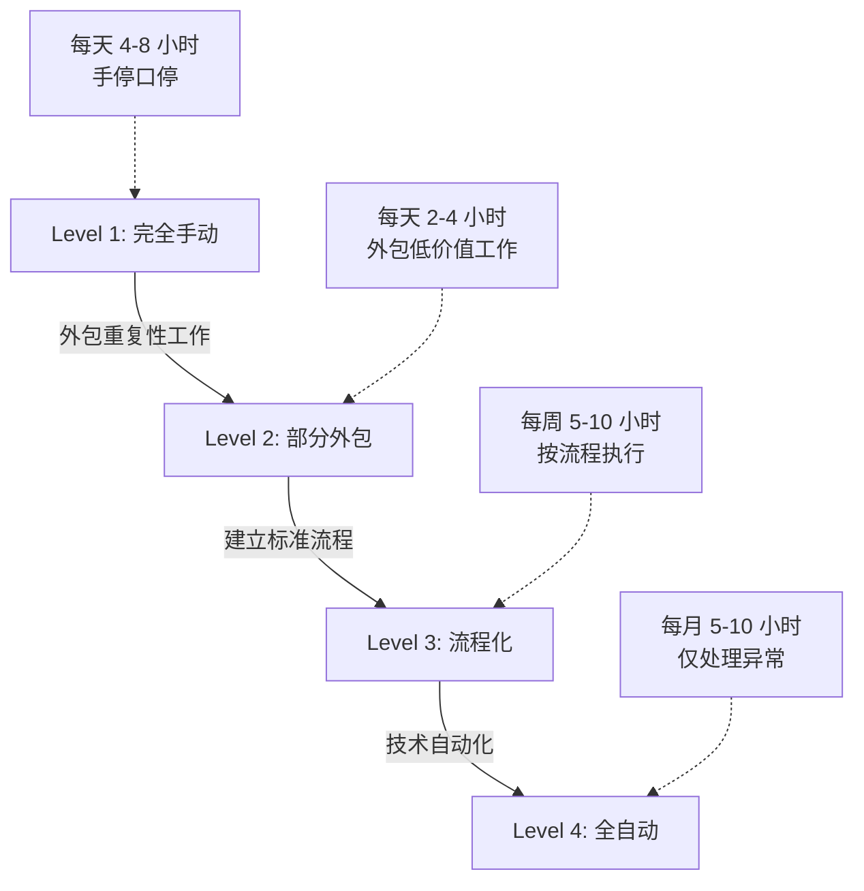
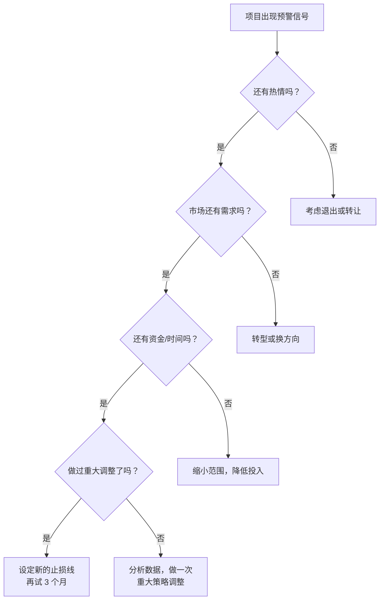

# 被动收入常见失败原因

> *"成功的人都是相似的，失败的人各有各的失败。"* —— 改编自托尔斯泰

被动收入项目的失败率远高于多数人的想象。根据 IndieHackers 社区 2023 年的调查数据，在自报"尝试过被动收入项目"的受访者中，仅有 12% 在两年后仍在产生收入，而超过 60% 的项目在启动六个月内就被放弃。这些失败并非随机分布——它们遵循着清晰的、可识别的模式。

本章将系统拆解被动收入项目失败的核心原因，帮助你在启动前就识别风险，在执行中及时纠偏，在遇到挫折时知道如何诊断和恢复。

---

## 一、失败原因全景图

在深入分析之前，先建立一个全局视角。被动收入项目的失败原因可以归纳为五大维度：



| 维度 | 失败概率占比 | 典型表现 | 可预防程度 |
|------|------------|---------|-----------|
| 供给侧（产品/内容问题） | 35% | 没人需要、质量差、同质化 | 高——通过前期调研可大幅降低 |
| 需求侧（流量/营销问题） | 25% | 做了没人知道、知道了不买 | 中——需要持续投入和学习 |
| 财务维度（资金/成本问题） | 15% | 钱烧完了还没盈利 | 中——需要合理规划和预留 |
| 执行维度（方法/策略问题） | 15% | 坚持不下来、方向混乱 | 高——认知到位即可改善 |
| 心理维度（心态/认知问题） | 10% | 期望过高、恐惧失败 | 中——需要刻意训练 |

下面逐一深入分析每个维度下的具体失败模式。

---

## 二、供给侧失败：做了一个没人要的东西

### 2.1 伪需求陷阱——最常见的致命错误

**什么是伪需求？** 就是你觉得某个产品/内容"应该有人需要"，但实际上并没有足够多的人愿意为之付费。

**典型的伪需求场景：**

- "我精通 Excel，一定有很多人想学高级函数" → 实际上免费教程遍地都是，没人愿意付费
- "我发现了一个冷门工具的用法，可以写本电子书" → 冷门意味着需求量极小
- "我想做一个个人成长类播客" → 这个赛道已经极度拥挤，你的差异化在哪里？

**如何判断是真需求还是伪需求？** 用以下三个检验标准：

**检验一：搜索量验证。** 用 Google Trends、百度指数、微信指数查看相关关键词的搜索趋势。如果一个关键词月搜索量低于 1000，且趋势在下降，说明需求正在萎缩。

**检验二：付费意愿验证。** 在相关社区（知乎、Reddit、豆瓣小组）搜索"有没有XXX的课程/书/工具"这类帖子。如果有大量人在主动寻找解决方案，说明存在真实付费需求。反之，如果只有你自己觉得需要，大概率是伪需求。

**检验三：竞品验证。** 去各平台（亚马逊 Kindle、Udemy、知识星球、Gumroad）搜索同类产品。如果完全找不到竞品——不要高兴，这通常意味着没有市场。如果能找到竞品且销量不错，才说明有需求。

**真实案例：**

> 张先生是一名资深 HR，决定写一本《中小企业绩效考核实操手册》电子书。他认为这个主题"每个中小企业老板都需要"。他花了三个月写完 8 万字，定价 49 元，上架后一个月只卖了 7 本。
>
> **失败原因分析：** 中小企业老板确实面临绩效考核问题，但他们通常不会自己研究——而是找咨询公司或直接套用模板。他们的付费场景是"找人帮我做"而不是"买本书自己学"。这就是典型的"需求存在但付费意愿不存在"的伪需求。

### 2.2 产品力不足——做了但做得不够好

即使方向正确，产品本身的品质也可能成为致命短板。

**内容类产品的常见质量问题：**

| 质量维度 | 不及格表现 | 及格标准 | 优秀标准 |
|---------|----------|---------|---------|
| 深度 | 只列要点不展开 | 每个知识点有完整解释 | 有原理分析+实操案例+常见错误 |
| 结构 | 随意罗列，无逻辑 | 有清晰的目录和章节划分 | 由浅入深，层层递进，有学习路径 |
| 实用性 | 纯理论，无法落地 | 有可执行的步骤 | 有模板、工具、检查清单 |
| 更新性 | 写完就不管 | 每年更新一次 | 持续迭代，跟随行业变化 |
| 表现形式 | 纯文字堆砌 | 有图表辅助说明 | 多媒体（视频/音频/交互） |

**软件/工具类产品的常见质量问题：**

- 界面粗糙，用户体验差——用户打开后 3 秒内决定是否继续使用
- 功能不稳定，经常出 bug——被动收入依赖口碑传播，一个差评可能毁掉整个产品
- 缺乏文档和使用指引——用户买了不会用，退款或差评

**数字产品品质自检清单：**

1. 我是否让 3 个以上目标用户试用并收集了反馈？
2. 和市面上最好的竞品相比，我的产品在哪些方面更好？
3. 如果我是消费者，愿意花这个价格买自己的产品吗？
4. 产品的核心价值是否在 30 秒内能被理解？
5. 用户获取帮助的渠道是否畅通？

### 2.3 缺乏差异化——和别人做得一模一样

在信息爆炸的时代，"做了"不等于"做得有价值"。如果你的产品和市面上已经有的产品高度雷同，用户没有理由选择你。

**差异化的四个层次：**



**差异化的反面——价格战：**

很多创作者在发现自己的产品没有差异化后，选择降价竞争。这是一个恶性循环：

1. 降价 → 利润变薄 → 无力投入产品改进
2. 产品品质停滞 → 更多用户流失
3. 用户流失 → 进一步降价
4. 最终：项目无法维持，退出市场

**正确的做法不是降价，而是重新定义你的独特价值。** 找到那些竞品没有覆盖的痛点，或者用完全不同的方式解决同一个问题。

---

## 三、需求侧失败：做了好东西但没人知道

### 3.1 流量获取失败——"酒香也怕巷子深"

这是被动收入项目中最普遍的失败原因之一。很多人把 90% 的精力花在产品开发上，只留 10% 给营销推广，结果产品很好但完全没有曝光。

**流量获取的常见误区：**

| 误区 | 真实情况 | 正确策略 |
|------|---------|---------|
| "好产品会自己传播" | 除非产品有极致口碑，否则不会 | 主动推广是必修课，不是选修课 |
| "SEO 做好就万事大吉" | SEO 见效慢（6-12个月），且竞争激烈 | SEO 是长期策略，需要配合短期流量渠道 |
| "发到朋友圈就行了" | 朋友圈的传播半径有限（通常 <500人） | 需要系统性的多渠道获客策略 |
| "等平台推荐" | 平台推荐需要初始数据（阅读/收藏/评分） | 初期需要自力推动初始数据 |
| "投放广告就行" | 被动收入产品单价低，广告 ROI 往往为负 | 内容营销和社区运营更可持续 |

**六种被验证有效的低成本获客方式：**

1. **内容矩阵法：** 围绕核心主题在 3-5 个平台持续输出内容（知乎/公众号/B站/小红书/抖音），每个平台的内容形式根据平台特性调整。核心逻辑是：免费内容建立信任 → 付费产品承接转化。

2. **社区渗透法：** 加入目标用户聚集的社群（微信群/QQ群/Discord/Reddit），先贡献价值（回答问题、分享经验），建立个人品牌后自然引流。

3. **合作互推法：** 找到同领域但不直接竞争的创作者，互相推荐对方的产品。例如，做 Excel 教程的人可以和做数据分析课程的人互推。

4. **SEO 长尾法：** 针对竞争度低但有稳定搜索量的长尾关键词创作内容。单个关键词流量小，但 100 个长尾关键词的总流量可观。

5. **口碑裂变法：** 设计让用户自发分享的机制（分享得折扣、邀请返佣、社交货币内容）。

6. **平台红利法：** 关注新兴平台的早期红利期。例如 2020 年的视频号、2023 年的 AI 相关社区，早期进入者获客成本极低。

### 3.2 转化率低——有人看但没人买

流量只是第一步。如果流量来了但不转化，说明从"看到"到"购买"的路径存在问题。

**用户购买决策的心理路径：**



**每个流失点的应对策略：**

**流失点 1（不吸引）：** 优化标题和封面。标题要直接点明用户的痛点或收益，不要用模糊的描述。对比：
- ❌ "我的 Python 学习笔记"
- ✅ "Python 自动化办公：从每天加班 2 小时到 10 分钟搞定"

**流失点 2（不信任）：** 建立社会证明。包括：真实的用户评价、作品展示、从业经历、媒体报道、数据背书（"已售出 3000+ 份"）。

**流失点 3（觉得不值）：** 重新锚定价值。不要只说"这本书 49 元"，而是说"49 元 = 节省 200 小时自学时间 + 随时更新 + 社群答疑"。或者提供免费试读/试用，让用户先体验价值。

**流失点 4（有顾虑）：** 降低决策风险。提供：无条件退款保证、免费试用版、常见问题解答、详细的购买后说明。

### 3.3 用户留存差——买了就走，没有复购和推荐

一次性销售的模式效率很低。真正可持续的被动收入依赖于复购和口碑推荐。

**用户生命周期价值（LTV）公式：**

```text
LTV = 客单价 × 复购次数 × 推荐系数
```

举例：一个定价 99 元的数字产品，如果：
- 场景 A：复购 0 次，推荐系数 0.1 → LTV = 99 × 1 × 1.1 = 108.9 元
- 场景 B：复购 2 次，推荐系数 0.5 → LTV = 99 × 3 × 1.5 = 445.5 元

同样是 99 元的产品，场景 B 的长期收入是场景 A 的 4 倍。

**提升留存和复购的方法：**

1. **产品线延伸：** 入门产品 → 进阶产品 → 高阶产品 → 一对一服务，形成产品梯度
2. **订阅制改造：** 一次性购买改为月/年订阅，持续提供更新和增值内容
3. **社群运营：** 建立用户社群（微信群/Discord），让用户之间产生连接，增加离开成本
4. **持续更新承诺：** 明确告知用户产品会持续更新，并实际做到
5. **会员专属权益：** 为老用户提供独家内容、优先体验、折扣等权益

---

## 四、财务维度失败：钱的问题

### 4.1 资金链断裂——最常见的财务死因

很多被动收入项目需要前期投入（时间成本 + 直接成本），但在产生收入之前，投入就已经耗尽了。

**典型的资金链断裂场景：**

| 场景 | 前期投入 | 预期回本时间 | 实际回本时间 | 结果 |
|------|---------|------------|------------|------|
| 开发 App | 开发成本 5-10 万 | 3 个月 | 12 个月+ | 中途资金耗尽 |
| 运营电商店铺 | 进货+推广 3-5 万 | 2 个月 | 6 个月+ | 库存积压，现金流断裂 |
| 建设付费社群 | 推广+内容制作 1-2 万 | 1 个月 | 4 个月+ | 持续投入但增长缓慢 |
| 写作+出版 | 时间成本（3-6 个月） | 出版后 1 个月 | 出版后 6 个月+ | 生活费不够，被迫停止 |

**防御策略：**

1. **预留 6 个月的运营资金。** 这不是"可选项"，而是"必选项"。你的被动收入项目在前 6 个月大概率不会盈利，你需要有其他收入来源覆盖这段时间的开销。

2. **采用"最小可行产品"（MVP）策略。** 不要一上来就投入大量资金。先用最低成本验证需求，确认可行后再逐步加大投入。

3. **区分"投资"和"消费"。** 花 5000 元买一台相机用来拍摄课程，这是投资（可产生持续回报）。花 5000 元请人设计一个漂亮的 logo，这是消费（对收入的直接影响很小）。在资金有限时，优先投资，延后消费。

4. **设置止损线。** 在启动前就明确："如果 6 个月后月收入低于 X 元，我就放弃这个项目。" 没有止损线，你可能会在一个没有希望的项目上持续消耗。

### 4.2 定价策略错误——定价是一门科学

定价过高导致无人购买，定价过低导致入不敷出。两种错误同样致命。

**常见的定价错误：**

**错误一：成本加成定价。** "我花了 100 小时做这个产品，按每小时 100 元算，定价 10000 元。" → 没人在乎你花了多少时间，用户只在乎产品对他有多大价值。

**错误二：竞品跟随定价。** "别人卖 99 元，我也卖 99 元。" → 你的成本结构、目标人群和品牌定位可能完全不同。

**错误三：过低定价。** "卖 9.9 元薄利多销。" → 低价吸引的往往是最挑剔的用户群（"我都花了钱了，你必须给我 XXX"），同时利润太薄无法支撑运营。

**正确定价框架——价值定价法：**

```text
产品定价 = 用户获得的价值 × 价值传递系数 × 心理锚定调整
```

**步骤一：量化用户获得的价值。** 你的产品能帮用户节省多少时间？赚到多少钱？避免多少损失？把这些转换为具体金额。

**步骤二：设定价值传递系数。** 通常为用户获得价值的 10%-30%。例如，你的课程能帮用户每年多赚 5 万元，定价 2000-5000 元是合理的（用户 ROI 为 10-25 倍）。

**步骤三：心理锚定调整。** 参考同类产品的价格区间，确保你的定价在用户的"可接受范围"内。可以通过产品分级（基础版/标准版/高级版）覆盖不同消费能力的用户。

### 4.3 成本失控——隐性成本吃掉利润

很多被动收入项目看起来利润率很高，但细算下来隐性成本惊人。

**容易被忽视的隐性成本清单：**

| 成本类型 | 具体项目 | 典型占比 |
|---------|---------|---------|
| 平台费用 | 平台抽佣（10%-30%）、支付手续费（1%-3%） | 收入的 10%-30% |
| 工具订阅 | 设计工具、邮件营销、网站托管、分析工具 | 每月 200-1000 元 |
| 内容维护 | 更新内容、修复问题、回复咨询的时间成本 | 每月 10-30 小时 |
| 获客成本 | 广告投放、内容制作、合作推广 | 收入的 10%-50% |
| 税务成本 | 个人所得税、增值税（如果是企业） | 收入的 5%-35% |
| 退费率 | 数字产品退费率通常在 3%-15% | 收入的 3%-15% |

**实际利润率计算示例：**

假设一个定价 199 元的在线课程，月销 100 份：

```text
总收入：199 × 100 = 19,900 元
- 平台抽佣（20%）：-3,980 元
- 支付手续费（2%）：-398 元
- 工具订阅：-500 元
- 获客成本（广告）：-2,000 元
- 退款（5%）：-995 元
- 内容维护时间（20小时 × 100元/小时的机会成本）：-2,000 元
────────────────────────────
实际利润：10,027 元
实际利润率：50.4%（而非表面的 100%）
```

这个利润率依然不错，但如果获客成本上升或销量下降，利润会迅速缩水。**时刻关注真实利润率，而非表面数字。**

---

## 五、执行维度失败：方法和策略的问题

### 5.1 过早放弃——死在黎明前

这是被动收入项目中**最令人心痛的失败原因**——不是方向错了，不是产品不好，只是放弃得太早。

**被动收入项目的典型增长曲线：**



**多数人在第 3-6 个月放弃，而这恰恰是即将看到成果的阶段。**

**各阶段的收入预期（基于典型内容类/数字产品项目）：**

| 阶段 | 时间范围 | 预期月收入 | 关键任务 | 常见心理状态 |
|------|---------|----------|---------|------------|
| 播种期 | 第 1-3 月 | 0-100 元 | 产品开发、内容积累 | 兴奋→焦虑 |
| 萌芽期 | 第 4-6 月 | 100-1,000 元 | 推广测试、迭代优化 | 焦虑→怀疑 |
| 成长期 | 第 7-12 月 | 1,000-5,000 元 | 扩大推广、优化转化 | 怀疑→谨慎乐观 |
| 成熟期 | 第 13-24 月 | 5,000-20,000 元 | 系统化运营、扩展产品线 | 乐观→自信 |
| 收获期 | 第 25 月+ | 20,000 元+ | 自动化、规模化 | 自信→从容 |

**对抗过早放弃的三个机制：**

1. **设定合理预期。** 在启动前就接受"前 6 个月大概率不赚钱"的事实。这不是悲观，而是现实。有了这个预期，你就不会在第 3 个月还没赚到钱时感到恐慌。

2. **设置里程碑而非结果目标。** 不要只盯着"月入 1 万"这个结果，而是设置过程里程碑：
   - 第 1 个月：完成产品开发
   - 第 2 个月：获得前 10 个用户
   - 第 3 个月：获得第一笔收入
   - 第 4 个月：月收入突破 500 元
   - 每个里程碑的达成都是一次正反馈，帮助你坚持下去。

3. **找一个同行者或社群。** 独自做被动收入项目是孤独的。加入一个同样在做被动收入的社群，定期分享进展，互相鼓励和监督。

### 5.2 多线作战——贪多嚼不烂

这个问题在"常见误区"一章已有讨论，但从失败原因的角度来看，它值得更深入的分析。

**多线作战的隐性成本：**

每个项目都有一个"启动成本"——学习必要的知识、搭建基础设施、建立初始流量。同时做 3 个项目，你支付的不是 3 倍的启动成本，而是：

```text
实际成本 = 3 × 启动成本 × 2.5（上下文切换损耗）
```

上下文切换损耗是真实存在的认知成本。当你在 A 项目和 B 项目之间切换时，大脑需要时间重新加载相关知识、回忆进度、调整工作模式。研究表明，频繁的任务切换会导致效率下降 20%-40%。

**单项目 vs 多项目的收入对比（模拟）：**

| 策略 | 第 1 年 | 第 2 年 | 第 3 年 | 第 4 年 |
|------|--------|--------|--------|--------|
| 专注 1 个项目 | 12,000 元 | 60,000 元 | 120,000 元 | 180,000 元 |
| 同时做 3 个项目 | 6,000 元（每个 2,000） | 24,000 元（每个 8,000） | 60,000 元（每个 20,000） | 120,000 元 |

假设每个项目独立的年收入潜力是 6 万元。专注策略在第 2 年就达到单项目成熟收入，而多项目策略到第 4 年才能追上。**专注的人用 2 年走完了分散的人 4 年的路。**

**正确策略：一个中心，两个辅助。**

- **中心项目（70% 精力）：** 你的核心被动收入项目，需要全身心投入
- **辅助项目 A（20% 精力）：** 已经在运行、只需要维护的成熟项目
- **辅助项目 B（10% 精力）：** 正在调研、尚未启动的未来项目

### 5.3 未实现系统化——手停口停

如果你的"被动收入"需要你每天投入 4 小时以上才能维持，那它本质上是一份自由职业，而不是被动收入。

**被动收入系统化的四个层次：**



**系统化改造清单：**

**任务分类：** 列出你的被动收入项目需要做的所有事情，然后分类：

| 类别 | 任务示例 | 处理方式 |
|------|---------|---------|
| 创意型（必须自己做） | 内容创作、产品设计、战略决策 | 保留 |
| 管理型（可委托） | 社群运营、客户回复、数据分析 | 外包或雇佣助手 |
| 重复型（应自动化） | 邮件发送、社交媒体发布、报表生成 | 工具自动化 |
| 消耗型（应消除） | 无意义的会议、低效的沟通、过度的完美主义 | 消除或简化 |

**推荐的自动化工具栈：**

| 需求 | 工具 | 月成本 | 替代的人工时间 |
|------|------|-------|--------------|
| 邮件自动化 | Mailchimp / ConvertKit | 0-200 元/月 | 每月 5-10 小时 |
| 社媒定时发布 | Buffer / 新榜 | 0-100 元/月 | 每月 8-15 小时 |
| 客户服务 | FAQ + 自动回复机器人 | 0-300 元/月 | 每月 10-20 小时 |
| 支付和交付 | Gumroad / 小鹅通 | 按交易抽佣 | 每月 3-5 小时 |
| 数据分析 | Google Analytics / 百度统计 | 免费 | 每月 2-3 小时 |

### 5.4 忽视数据驱动——凭感觉而非凭数据做决策

"我觉得这个标题更好"、"我感觉用户会喜欢这个功能"、"我觉得推广到小红书效果更好" —— 这些"觉得"和"感觉"是被动收入项目的隐形杀手。

**必须追踪的核心指标：**

| 指标类别 | 核心指标 | 健康值 | 预警值 |
|---------|---------|-------|-------|
| 流量 | 月独立访客数 | 持续增长 | 连续 2 个月下降 |
| 转化 | 访客→购买转化率 | >2% | <0.5% |
| 收入 | 月收入 | 持续增长 | 连续 3 个月持平或下降 |
| 成本 | 获客成本（CAC） | <客单价的 30% | >客单价的 50% |
| 留存 | 用户复购率 | >20% | <5% |
| 口碑 | 推荐率/好评率 | >30% / >4.5星 | <10% / <4.0星 |

**数据驱动决策的实操流程：**

1. **每周看数据仪表盘。** 花 30 分钟浏览核心指标的变化趋势。
2. **每月做一次深度分析。** 分析哪些渠道带来的流量质量最高，哪些产品/内容的转化率最好。
3. **每次改动都要 A/B 测试。** 改标题、改价格、改页面布局——不要凭感觉改，而是同时运行两个版本，用数据决定哪个更好。
4. **建立"假设→实验→验证"的循环。** 每个决策都从一个明确的假设开始（"我认为把价格从 99 降到 79 会提升 30% 的转化率"），然后设计实验验证，最后用数据得出结论。

---

## 六、心理维度失败：心态和认知的问题

### 6.1 期望错位——把被动收入想得太美

**错位的期望会导致什么？**

| 错位期望 | 现实情况 | 心理落差 | 后果 |
|---------|---------|---------|------|
| "3 个月就能月入过万" | 通常需要 12-24 个月 | 巨大 | 3 个月后放弃 |
| "做了就能赚钱" | 可能完全不赚钱 | 巨大 | 自我怀疑 |
| "不需要任何投入" | 需要大量时间和精力 | 中等 | 计划破产 |
| "一次努力永远收益" | 需要持续维护和更新 | 中等 | 项目衰败 |
| "比上班轻松" | 前期比上班更累 | 巨大 | 回归打工 |

**校准期望的正确方式：**

在启动被动收入项目之前，花一周时间做以下事情：

1. **访谈 3-5 个已经在做同类项目的人。** 直接问他们：花了多长时间开始赚钱？遇到的最大困难是什么？如果重来会怎么做？
2. **阅读真实的失败案例。** 不要只看成功故事——失败案例能给你更真实的预期。Reddit 的 r/Entrepreneur、IndieHackers、V2EX 创业板块都有大量真实分享。
3. **制定最悲观情况下的应对计划。** 如果 12 个月后这个项目一分钱没赚到，你能承受吗？你的生活会受到多大影响？

### 6.2 恐惧决策——因为害怕而做出错误选择

恐惧是被动收入路上最隐蔽的障碍。它不会直接告诉你"我害怕"，而是伪装成各种看似合理的理由：

- "我再准备准备就开始" → 实际是害怕失败
- "这个市场已经饱和了" → 实际是害怕竞争
- "我还没想好完美的商业模式" → 实际是害怕犯错
- "等我辞职了再认真做" → 实际是害怕投入
- "先看看别人怎么做的" → 实际是害怕独立决策

**恐惧的三种表现形式及其应对：**

**表现一：完美主义瘫痪。** 你永远觉得产品"还不够好"，不断修改，永远不上架。应对：设定一个不可商量的上线日期（比如"不管好不好，3 月 1 日必须上架"），然后执行。一个 80 分的产品上线后可以迭代到 95 分，但一个永远在打磨的 95 分产品价值为零。

**表现二：分析瘫痪。** 你花了三个月做市场调研、读了 50 篇文章、看了 20 个视频，但就是不开始行动。应对：给自己设定一个调研截止日期。调研超过 2 周就开始动手——在行动中学习比在调研中学习更有效。

**表现三：失败恐惧。** 你害怕把产品推出去后被差评、被嘲笑、没人买。应对：接受一个事实——你的第一个产品大概率不会成功，但这不代表你不会成功。把它当作学费，快速完成"失败→学习→改进"的循环。

### 6.3 幸存者偏差——被成功故事蒙蔽

你在社交媒体上看到的"被动收入月入 10 万"的故事，是经过精心筛选的极端案例。你没有看到的，是那 99 个尝试了同样方法但失败的人。

**幸存者偏差如何影响你的判断：**

- 你看到有人通过卖 Notion 模板月入 5 万，就认为"Notion 模板很赚钱" → 实际上月入 5 万的人可能不到 0.1%，大多数模板卖家月入不到 1000 元
- 你看到有人做 YouTube 频道半年就有 10 万订阅 → 实际上 95% 的 YouTube 频道在 1000 订阅前就停止更新了
- 你看到有人投资比特币实现了财务自由 → 实际上更多人在比特币上亏了钱

**如何避免幸存者偏差：**

1. **主动寻找失败案例。** 每看到一个成功故事，就去找 5 个失败案例。搜索"XXX 失败"、"XXX 血泪史"、"XXX 后悔"。
2. **关注比率而非个案。** 不要问"有人通过 XXX 赚到钱了吗"（答案几乎总是"有"），而是问"有多少比例的人通过 XXX 赚到了钱"。
3. **计算期望值。** 如果成功率是 5%，成功时收入是 10 万/年，失败时收入是 0，那么期望值是 5000 元/年。这个数字是否值得你投入一年的时间？

---

## 七、不同被动收入类型的高频失败原因

不同类型的被动收入项目有不同的"高频死法"。了解你所选类型最常见的失败模式，可以提前预防。

### 7.1 内容创作类（电子书/博客/播客）

| 高频失败原因 | 发生概率 | 典型表现 | 预防方法 |
|-------------|---------|---------|---------|
| 选题太泛，没有精准人群 | 40% | "写一本关于理财的书" | 聚焦一个具体问题 |
| 更新频率无法维持 | 35% | 前 3 个月每周更新，之后断更 | 制定可持续的内容日历 |
| 忽视 SEO 和分发 | 30% | 写了 50 篇文章但日访问量 <50 | 每篇内容都有分发计划 |
| 变现路径不清晰 | 25% | 有流量但不知道怎么赚钱 | 在内容规划阶段就设计变现路径 |
| 被平台算法变化打击 | 15% | 某次算法更新流量暴跌 70% | 多平台分发，不依赖单一渠道 |

### 7.2 数字产品类（课程/模板/工具）

| 高频失败原因 | 发生概率 | 典型表现 | 预防方法 |
|-------------|---------|---------|---------|
| 没有验证需求就开发 | 45% | 花 3 个月做的课程只卖了 5 份 | 先预售/众筹，验证后再开发 |
| 定价过高或过低 | 30% | 定价 2999 元无人问津，或 9.9 元利润为负 | 用价值定价法，分级定价 |
| 客户支持消耗太大 | 25% | 每天花 3 小时回复买家问题 | 完善 FAQ、提供自助文档 |
| 被盗版/抄袭 | 20% | 产品上架一周后出现在盗版网站 | 接受现实，把精力放在服务和更新上 |
| 缺乏信任背书 | 20% | 无人知晓的创作者发布高价产品 | 先建立个人品牌，再推出产品 |

### 7.3 投资理财类（股息/基金/房产）

| 高频失败原因 | 发生概率 | 典型表现 | 预防方法 |
|-------------|---------|---------|---------|
| 追涨杀跌，频繁交易 | 50% | 本想收股息，结果天天盯盘 | 制定规则后严格执行，减少查看频率 |
| 资金量不足，收益太低 | 40% | 10 万元股息组合年分红仅 3000-5000 元 | 认清现实：投资型被动收入需要大本金 |
| 忽视风险管理 | 30% | 重仓单一标的，暴跌时损失惨重 | 分散投资，设定止损线 |
| 信息不对称被收割 | 20% | 跟风买入"推荐股"或"明星基金" | 独立研究，不盲从 |
| 杠杆使用不当 | 15% | 融资加杠杆，行情反转时爆仓 | 新手绝对不用杠杆 |

### 7.4 软件/SaaS 类

| 高频失败原因 | 发生概率 | 典型表现 | 预防方法 |
|-------------|---------|---------|---------|
| 开发周期过长 | 50% | 花 1 年开发，上线时市场已变 | MVP 策略，3 个月内必须上线 |
| 忽视用户获取 | 40% | 产品很好但没有用户 | 开发和推广同步进行 |
| 技术维护成本高 | 30% | 服务器、安全、兼容性问题层出不穷 | 使用成熟的云服务和框架 |
| 无法找到 PMF | 35% | 功能做了很多，但用户就是不付费 | 聚焦核心功能，验证付费意愿 |

---

## 八、失败诊断：你的项目是否正在走向失败？

定期检查以下信号，及时发现问题：

### 8.1 早期预警信号（黄色预警）

以下信号单独出现时不必恐慌，但需要关注和调整：

- 连续 2 周没有新增用户/粉丝
- 转化率低于 0.5%
- 用户反馈中反复出现同一个问题
- 你对这个项目的热情明显下降
- 推广渠道的效果开始边际递减

### 8.2 严重警报信号（红色预警）

以下信号出现时，你需要认真考虑是否继续：

- 连续 3 个月收入为零或可忽略不计（<100 元）
- 获客成本持续上升且超过客单价的 50%
- 你已经对这个领域完全失去兴趣
- 市场出现颠覆性变化（例如 AI 替代了你的核心价值）
- 持续投入 6 个月以上没有任何正反馈

### 8.3 失败诊断决策树



---

## 九、从失败中恢复：如果项目已经失败了怎么办

### 9.1 项目失败的三种处置方式

**方式一：修复重启。** 如果失败原因是可修复的（定价错误、推广不足、产品缺陷），修正问题后重新上线。很多成功的被动收入产品都经历过"推倒重来"的过程。

**方式二：资产变现。** 即使项目本身失败了，你创造的内容、积累的用户、建立的品牌都有价值。可以通过以下方式变现：
- 将内容重新打包成其他产品（博客文章→电子书，视频课程→线下培训）
- 出售项目本身（网站、域名、社群、邮件列表）
- 将技能和经验转化为咨询或培训服务

**方式三：彻底退出。** 如果项目已经确认没有前景，果断止损。记住：沉没成本不是继续投入的理由。你在这个项目上花的时间和金钱不会因为继续投入而回来。

### 9.2 失败复盘模板

每次项目失败后，花 2-3 小时完成以下复盘：

```text
项目名称：_______________
运营时间：____年____月 至 ____年____月
总投入：_______ 元 + _______ 小时
总收入：_______ 元
净结果：盈利 _______ 元 / 亏损 _______ 元

一、项目失败的核心原因（选最重要的 1-3 个）
1. _______________________________________________
2. _______________________________________________
3. _______________________________________________

二、如果重来，我会做什么不同的事？
1. _______________________________________________
2. _______________________________________________
3. _______________________________________________

三、从这个项目中我学到了什么有价值的东西？
1. _______________________________________________
2. _______________________________________________
3. _______________________________________________

四、这些经验可以如何应用到下一个项目？
_______________________________________________
_______________________________________________

五、我的下一个项目方向（如果有的话）
_______________________________________________
```

### 9.3 建立"失败免疫"心态

最成功的被动收入构建者不是从不失败的人，而是能快速从失败中恢复的人。

**"失败免疫"的四个认知基础：**

1. **失败是数据，不是判决。** 每次失败都告诉你"这条路不通"，帮你缩小正确方向的搜索范围。Thomas Edison 说："我没有失败过一万次，我只是发现了一万种行不通的方法。"

2. **失败的项目 ≠ 失败的人。** 你的价值不由一个项目的成败定义。你在这个过程中积累的技能、知识、人脉都是你个人资产的一部分。

3. **快速失败 = 快速学习。** 花 3 个月发现方向不对，然后花 3 个月尝试新方向，比花 1 年在一个错误方向上坚持要高效得多。

4. **复利效应在长期。** 你的第一次尝试可能只赚了 100 元，第二次赚了 1000 元，第三次赚了 10000 元。这不是因为运气变好了，而是因为每次失败都让你的"认知资本"在增长。

---

## 十、失败原因对照表：快速自检

将这份对照表打印出来，定期检查你的项目状态：

| 自检问题 | 健康状态 | 亚健康状态 | 危险状态 |
|---------|---------|-----------|---------|
| 你的产品有人需要吗？ | 有明确的目标用户在主动寻找这类产品 | 你觉得应该有人需要但没有验证 | 完全是你自己想象的需求 |
| 你的产品比竞品好吗？ | 在至少一个维度上有明显优势 | 和竞品差不多 | 不如竞品但价格更低 |
| 你知道用户从哪里来吗？ | 有 2+ 个稳定的获客渠道 | 只有 1 个渠道且不稳定 | 完全不知道用户从哪来 |
| 你的利润率健康吗？ | 扣除所有成本后利润率 >40% | 利润率 10%-40% | 利润率 <10% 或在亏钱 |
| 你在持续优化吗？ | 每月有明确的优化计划和执行 | 偶尔会做调整 | 自上线以来从没改过 |
| 你的数据在增长吗？ | 关键指标（流量/收入/用户）持续增长 | 指标稳定但没有增长 | 指标在下降 |
| 你的系统在运转吗？ | 大部分工作已自动化或外包 | 部分系统化，仍需大量人工 | 完全依赖你手动操作 |
| 你的心态健康吗？ | 对项目有热情且预期合理 | 偶尔焦虑但能调整 | 对项目失去信心和兴趣 |

---

## 总结：失败是可以被预防的

回顾本章分析的所有失败原因，可以提炼出一个核心认知：

> **被动收入项目的失败，大多数不是因为外部环境恶劣，而是因为内部认知不足和执行偏差。**

换句话说，大多数失败是可以预防的。只要你做到以下五点：

1. **做之前先验证需求** —— 不要花三个月做一个没人要的东西
2. **把营销当作和产品同等重要的事** —— 好产品不等于好生意
3. **专注一个项目，做到系统化** —— 深度优于广度
4. **设置合理的预期和止损线** —— 不盲目乐观也不轻易放弃
5. **用数据而非感觉做决策** —— 直觉可以用来产生假设，数据才是验证假设的工具

失败不可怕，可怕的是在同一个地方反复跌倒。了解这些失败原因，你就拥有了"免疫系统"——不是不会失败，而是能更快地识别问题、调整方向、最终走向成功。

> *"被动收入构建是一场马拉松，不是百米冲刺。那些最终成功的人，不是跑得最快的人，而是跌倒后最快爬起来继续跑的人。"*
