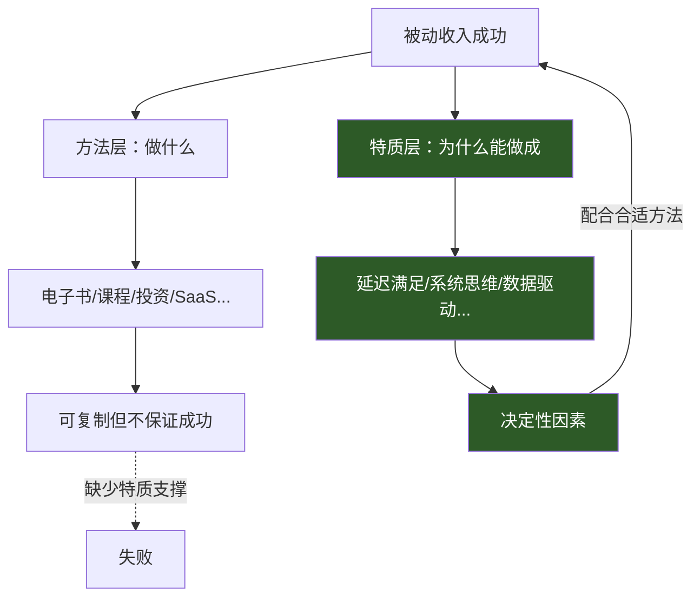
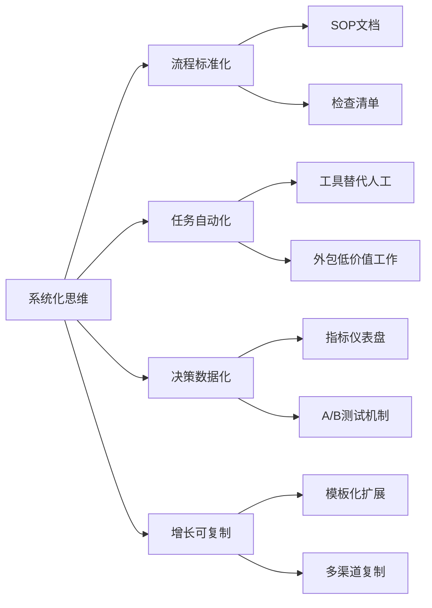
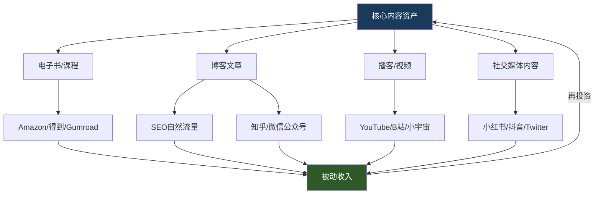
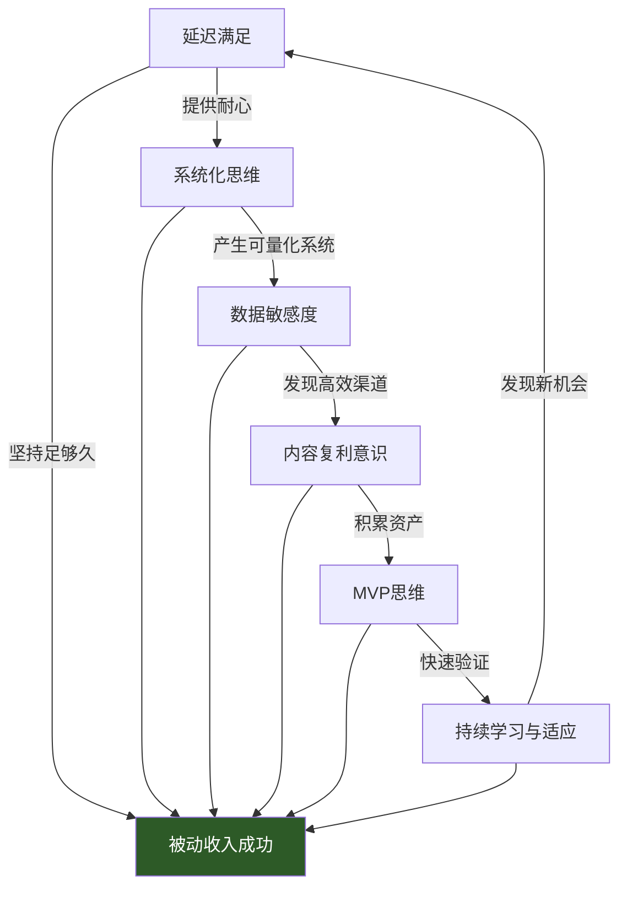

## 被动收入成功者的共同特质

前面七个案例覆盖了电子书、股息投资、设计模板、联盟营销、房产租金、SaaS产品、播客等完全不同的被动收入类型。它们的赛道不同、资源不同、起步时间不同，但最终都走向了成功。这就引出一个关键问题：**成功者之间是否存在超越赛道的共性？**

答案是肯定的。被动收入的构建本质上是一场与人性弱点的持久战——与即时满足的诱惑战、与不确定性的恐惧战、与孤独感的煎熬战。能够打赢这场战争的人，往往在思维模式、行为习惯和能力结构上呈现出高度一致的特征。

本节通过对七个案例的深度复盘，结合行为经济学和创业心理学的研究成果，提炼出被动收入成功者普遍具备的六大核心特质，并提供可操作的自评框架和培养路径。

### 一、为什么研究"共性"比研究"方法"更重要

#### 1.1 方法可复制，特质难模仿

被动收入的构建方法千变万化——写书、做课程、投资、建网站、开发软件——但方法本身只是"术"的层面。真正决定成败的是执行方法的人具备什么样的底层特质。

一个缺乏延迟满足能力的人，即使拿到最详细的电子书写作指南，也会在第三章写到一半时放弃。一个缺乏数据敏感度的人，即使拥有最先进的SEO工具，也无法从数据中读出优化方向。

这就是为什么同一个方法论，有人执行后月入过万，有人执行后颗粒无收。差距不在方法，在人。

#### 1.2 幸存者偏差的陷阱

市面上大量"被动收入教程"来自幸存者——他们成功了，然后回头看，觉得自己的方法是最好的。但如果我们只学方法而不学特质，就会掉入幸存者偏差的陷阱：你复制了他的路径，却没有复制他的耐力、判断力和适应力，结果自然是"形似神不似"。

研究共性特质的意义在于：**让你从"模仿成功者做了什么"升级到"理解成功者为什么能做成"**。

### 二、六大核心特质深度解析

#### 2.1 特质一：延迟满足能力——与"即时回报"的本能对抗

**为什么这个特质排在第一位？**

被动收入的最大特点是"前期投入大、后期回报大"。这意味着你必须在长达数月甚至数年的时间里，持续投入精力却看不到明显的经济回报。这对人类的即时满足本能构成了极大的挑战。

斯坦福大学著名的"棉花糖实验"追踪了数百名儿童数十年，发现能够延迟满足的儿童在成年后的收入水平、健康状况和人际关系质量上都显著优于无法延迟满足的儿童。这个结论在被动收入领域同样适用。

**在七个案例中的具体表现：**

| 案例 | 延迟满足的具体体现 | 等待期 |
|------|---------------------|--------|
| 电子书案例 | 前3个月几乎零收入，持续写作和优化 | 3-6个月 |
| 股息投资案例 | 初期股息微薄，坚持定投不赎回 | 1-3年 |
| 设计模板案例 | 前期免费发布模板积累口碑 | 2-4个月 |
| 联盟营销案例 | SEO见效周期长，前期流量几乎为零 | 6-12个月 |
| 房产租金案例 | 首付积攒+装修期无租金收入 | 6-12个月 |
| SaaS产品案例 | 开发期无收入，用户增长缓慢 | 3-8个月 |
| 播客案例 | 前50期听众个位数，坚持周更 | 6-12个月 |

**延迟满足能力的三个层次：**

- **基础层：能忍。** 明知短期内没有回报，仍然按计划执行。这是最基本的要求。
- **进阶层：能算。** 不是盲目忍耐，而是清楚地知道"我现在每投入1小时，未来能产生多少回报"，用理性计算对抗情绪波动。
- **高阶层：能乐。** 不仅能忍耐延迟，还能在"建设过程中"找到乐趣。把等待期视为打磨产品、积累能力的机会，而非痛苦的煎熬。

**如何培养延迟满足能力：**

1. **可视化未来回报。** 制作一张"回报时间线图"，把预期收入增长画出来。当情绪低落时，看一眼这张图。
2. **设置里程碑奖励。** 不要等到最终成功才给自己奖励。每完成一个阶段性目标（比如写完5章、发布10个模板），给自己一个小奖励。
3. **建立"进度仪表盘"。** 用Notion、Excel或专门的工具追踪你的关键指标（内容数量、流量、收入），看到进步本身就是一种激励。
4. **找到"同行者"。** 加入被动收入构建者的社群，看到别人也在坚持，能有效缓解孤独感。

#### 2.2 特质二：系统化思维——从"做事"到"建系统"

**什么是系统化思维？**

系统化思维的核心是：**不满足于"做一件事"，而是追求"建一个能自动做这件事的系统"。**

普通人的思维是："我要写一篇文章来吸引流量。"
系统化思维是："我要建一个内容生产系统，让文章持续自动吸引流量。"

这个区别看似微小，实际上是被动收入能否真正"被动"的关键分水岭。

**在案例中的具体体现：**

- **电子书案例** 的成功者不只是写了一本书，而是建立了一套"选题→写作→发布→推广→迭代"的标准化流程，使得第二本、第三本书的产出效率指数级提升。
- **联盟营销案例** 的成功者不只是建了一个网站，而是搭建了一套"关键词研究→内容生产→SEO优化→联盟链接管理→数据追踪"的自动化流水线。
- **SaaS产品案例** 的成功者不只是写了一段代码，而是设计了一套"用户注册→付费→使用→续费→反馈→迭代"的全自动化产品生命周期。

**系统化思维的四个维度：**

**流程标准化：** 把重复性工作变成SOP（标准操作流程）。比如写电子书的SOP可以是：市场调研（2天）→大纲设计（1天）→初稿写作（每天2000字）→校对润色（2天）→封面设计（1天）→发布上架（1天）→推广计划（持续）。

**任务自动化：** 识别哪些环节可以用工具替代人工。比如邮件营销用Mailchimp自动化、社交媒体发布用Buffer定时发布、客户咨询用聊天机器人处理常见问题。

**决策数据化：** 不凭感觉做决策，而是基于数据。比如"A文章比B文章的转化率高30%，那我应该多写A类型的内容"。

**增长可复制：** 当一个模式跑通后，能否快速复制到新领域？比如电子书成功后，能否用同样的方法做在线课程？

**实操模板——个人被动收入系统设计表：**

| 系统模块 | 核心流程 | 自动化工具 | 人工介入点 | 关键指标 |
|----------|----------|------------|------------|----------|
| 内容生产 | 选题→写作→审核→发布 | WordPress + 编辑器 | 选题决策、质量审核 | 发布频率、阅读量 |
| 流量获取 | SEO→社媒→邮件→付费 | Ahrefs + Buffer + Mailchimp | 策略调整 | 月访问量、转化率 |
| 销售转化 | 着陆页→支付→交付 | Gumroad/Stripe | 产品优化 | 转化率、客单价 |
| 客户服务 | 咨询→FAQ→退款 | 聊天机器人 + 知识库 | 复杂问题处理 | 满意度、退款率 |
| 数据监控 | 流量→收入→成本→利润 | Google Analytics + 自建看板 | 策略调整 | 月利润、ROI |

#### 2.3 特质三：数据敏感度——用数据而非直觉做决策

**为什么数据如此重要？**

被动收入项目的最大风险是"方向错误而不自知"。你可能花三个月写了一本电子书，但市场根本不需要这个主题。你可能每天更新博客，但选的关键词根本没有搜索量。

数据是消除不确定性的唯一武器。它不会告诉你"应该做什么"，但它能告诉你"你正在做的事情是否有效"。

**成功者的数据习惯：**

1. **每日必看的核心指标。** 就像开车要看仪表盘一样，被动收入构建者每天都会查看几个关键数字：今日收入、今日流量、转化率变化。
2. **异常值敏感。** 收入突然下降20%？流量突然暴涨？成功者会对这些异常值立即做出反应，找出原因。
3. **A/B测试文化。** 不确定哪个标题更好？不确定哪个定价更合理？成功者会设计A/B测试，让数据说话，而非凭感觉拍脑袋。
4. **长周期趋势分析。** 不只看今天的数据，而是看过去30天、90天、365天的趋势。短期波动是噪音，长期趋势才是信号。

**各案例的数据驱动实践：**

- **电子书案例：** 通过Amazon后台数据分析读者画像，发现核心受众是25-35岁职场新人，据此调整了后续书籍的内容方向和定价策略。
- **联盟营销案例：** 通过Google Analytics发现80%的收入来自20%的页面，于是集中优化这些高价值页面，收入提升了3倍。
- **SaaS产品案例：** 通过用户行为数据分析发现，完成"创建第一个项目"步骤的用户续费率高达70%，于是优化了新手引导流程，将该步骤完成率从35%提升到68%。

**被动收入核心指标体系：**

| 指标类别 | 核心指标 | 健康范围 | 预警阈值 |
|----------|----------|----------|----------|
| 流量指标 | 月独立访客数 | 持续增长>5%/月 | 连续2月下降 |
| 转化指标 | 访客→付费转化率 | 1%-5%（数字产品） | <0.5% |
| 收入指标 | 月被动收入 | 持续增长 | 连续3月持平或下降 |
| 成本指标 | 获客成本(CAC) | <客户终身价值的1/3 | >客户终身价值的1/2 |
| 留存指标 | 客户复购/续费率 | >40% | <20% |
| 效率指标 | 每小时投入产出比 | 逐步提升 | 持续下降 |

#### 2.4 特质四：内容复利意识——一次创作，多次变现

**什么是内容复利？**

内容复利是指**一份内容资产可以在多个渠道、多种形式、多个时间点持续产生价值**。它不同于一次性劳动——你今天写一篇文章，这篇文章在未来三年都能通过搜索引擎带来流量和收入。

成功者与普通人的核心区别之一是：成功者做的每一件事都在积累"资产"，而普通人做的很多事只是在消耗"时间"。

**内容复利的三种模式：**

1. **同一内容，多渠道分发。** 一篇深度文章可以同时发布在个人博客、知乎、微信公众号、Medium等平台，每个渠道都能带来独立的流量。
2. **同一内容，多种形式转化。** 一本书可以变成课程、播客、视频、信息图、PPT，每种形式触达不同的受众。
3. **内容之间互相导流。** 电子书末尾推荐在线课程，课程中推荐SaaS工具，工具的文档中推荐电子书——形成闭环的内容生态。

**案例中的复利实践：**

- **播客案例** 的成功者将每一期播客的文字稿整理成博客文章，每篇文章都成为SEO的入口。同一期内容，通过音频和文字两种形式，触达了完全不同的人群。
- **设计模板案例** 的成功者将畅销模板的制作过程录制成教程视频，视频本身又成为新的收入来源，同时为模板带来了更多曝光。
- **SaaS产品案例** 的成功者将产品文档写成高质量的技术博客，这些博客在搜索引擎上排名靠前，成为产品最重要的获客渠道之一。

#### 2.5 特质五：最小可行产品(MVP)思维——先验证再投入

**MVP思维的核心逻辑：**

在投入大量时间和资源之前，先用最小的成本验证市场需求。如果市场反馈积极，再加大投入；如果市场反馈冷淡，及时止损或调整方向。

这与大多数人的做法相反——大多数人是"先投入大量时间做出完美产品，然后发现市场不需要"。

**MVP思维的三个阶段：**

**阶段一：最小化验证（1-2周）。** 用最低成本测试市场反应。比如：
- 写电子书之前，先写3篇相关文章看阅读量
- 做在线课程之前，先在社群做一次免费分享看反馈
- 开发SaaS之前，先用无代码工具做个原型让用户体验
- 做播客之前，先录3期试听集看播放量

**阶段二：快速迭代（1-3个月）。** 根据市场反馈快速调整。成功者不会闷头做三个月然后发布，而是每两周发布一个新版本，根据用户反馈持续改进。

**阶段三：规模化投入。** 当MVP验证成功（有付费用户、有正向反馈、有增长趋势）后，再投入更多资源进行规模化。

**各案例的MVP实践：**

| 案例 | MVP形态 | 验证周期 | 验证标准 | 结果 |
|------|---------|----------|----------|------|
| 电子书 | 先写3篇长文在知乎发布 | 2周 | 总阅读>5000，评论>50 | 验证通过，开始写书 |
| 股息投资 | 先用1万元试投3只股票 | 3个月 | 股息率>3%，波动可接受 | 验证通过，逐步加仓 |
| 设计模板 | 先免费发布5个模板 | 1个月 | 下载量>200，好评率>90% | 验证通过，开始收费 |
| 联盟营销 | 先写10篇测评文章 | 2个月 | 自然搜索流量>500/月 | 验证通过，扩大内容 |
| 房产租金 | 先租一间房做短租测试 | 3个月 | 入住率>70%，净收益为正 | 验证通过，扩展房源 |
| SaaS | 先用Excel+表单手动跑流程 | 1个月 | 10个用户愿意付费 | 验证通过，开发产品 |
| 播客 | 先录3期试听集 | 1个月 | 单集播放>100，有留言互动 | 验证通过，正式开播 |

#### 2.6 特质六：持续学习与快速适应——在变化中保持竞争力

**为什么这个特质越来越重要？**

被动收入的"被动"是相对的。市场环境在变、平台规则在变、用户偏好在变、技术工具在变。一个今天能赚钱的模式，可能因为一次算法更新就归零。

成功者不是一次性学完所有知识，而是建立了持续学习的习惯和快速适应的能力。

**持续学习的三个维度：**

1. **领域知识更新。** 关注行业动态、平台规则变化、新技术工具。比如SEO领域，Google每年更新数千次算法，不学习就会被淘汰。
2. **跨界知识融合。** 最有价值的创新往往来自跨领域。电子书作者学习SEO可以获得10倍的流量增长；设计师学习心理学可以做出更高转化率的产品页面。
3. **失败案例研究。** 不只学习成功案例，更要研究失败案例。知道"什么会导致失败"比知道"什么能成功"更能帮你避坑。

**快速适应的具体表现：**

- **平台迁移能力。** 当某个平台的流量红利消失时，能快速迁移到新平台。比如从微博迁移到小红书，从图文迁移到短视频。
- **产品迭代速度。** 当用户需求变化时，能在两周内推出新版本。成功者的迭代周期通常比同行快3-5倍。
- **危机应对能力。** 当遭遇算法惩罚、平台封号、竞品冲击时，能快速调整策略而非恐慌放弃。

### 三、六大特质的关联与权重

这六个特质并非孤立存在，而是相互关联、相互强化的。

**权重分析——哪个特质最关键？**

根据对七个案例的交叉分析，六个特质的相对权重如下：

| 排名 | 特质 | 权重 | 原因 |
|------|------|------|------|
| 1 | 延迟满足能力 | ★★★★★ | 没有这一条，其他五条都无从谈起 |
| 2 | 系统化思维 | ★★★★☆ | 决定收入能否真正"被动化" |
| 3 | 数据敏感度 | ★★★★☆ | 决定方向是否正确、优化是否有效 |
| 4 | MVP思维 | ★★★☆☆ | 降低试错成本，提高成功率 |
| 5 | 内容复利意识 | ★★★☆☆ | 决定增长速度和天花板 |
| 6 | 持续学习与适应 | ★★★☆☆ | 决定收入的可持续性 |

**注意：** 权重不等于重要性排序。在不同阶段，最重要的特质会变化：
- **起步期（0-3个月）：** MVP思维最重要——快速验证方向
- **建设期（3-12个月）：** 延迟满足最重要——熬过低回报期
- **成长期（1-3年）：** 系统化思维最重要——实现规模化
- **成熟期（3年以上）：** 持续学习最重要——保持竞争力

### 四、特质自评框架

#### 4.1 自评问卷

诚实地回答以下问题，每个问题按1-5分评分（1=完全不符合，5=完全符合）：

**延迟满足能力：**

1. 我能为一个6个月后才有回报的项目坚持每天投入1小时吗？___分
2. 当项目连续3个月没有明显进展时，我还能保持投入吗？___分
3. 我能拒绝"赚快钱"的诱惑，坚持长期有价值的事情吗？___分

**系统化思维：**

4. 我会把重复性工作写成SOP文档吗？___分
5. 我能画出自己业务的完整流程图吗？___分
6. 我主动寻找可以用工具替代人工的环节吗？___分

**数据敏感度：**

7. 我每天都会查看业务的关键数据指标吗？___分
8. 我会用A/B测试来验证假设而非凭感觉决策吗？___分
9. 我能从数据异常中快速发现问题所在吗？___分

**MVP思维：**

10. 在投入大量时间之前，我会先用最小成本验证想法吗？___分
11. 我能接受"先发布60分的产品，再迭代到90分"吗？___分
12. 当市场反馈负面时，我能果断调整方向吗？___分

**内容复利意识：**

13. 我会有意识地把一份内容转化为多种形式吗？___分
14. 我做的每件事是否都在积累可复用的资产？___分
15. 我的多个收入来源之间是否存在协同效应？___分

**持续学习与适应：**

16. 我每周花多少时间学习行业新知识？___分
17. 当平台规则变化时，我能快速调整策略吗？___分
18. 我是否主动研究失败案例来避免重蹈覆辙？___分

#### 4.2 评分解读

| 总分区间 | 水平 | 行动建议 |
|----------|------|----------|
| 18-36分 | 初级 | 先从培养延迟满足能力开始，选择一个最简单的被动收入项目练手 |
| 37-54分 | 中级 | 重点加强系统化思维和数据敏感度，开始建立SOP和数据看板 |
| 55-72分 | 高级 | 精细化运营，加强内容复利和MVP思维，开始多元化布局 |
| 73-90分 | 专家 | 你已经具备成功者的全部特质，关键是选择正确的赛道并坚持执行 |

#### 4.3 薄弱特质的针对性提升方案

**延迟满足能力薄弱：**

- **30天挑战：** 选择一件需要30天才能看到结果的事情（如每天写作500字），坚持完成。成功完成一次"延迟满足"的经历，会显著增强你的信心。
- **进度可视化：** 用日历打卡、进度条等视觉化工具，让"看不到的进步"变得可见。
- **找到承诺对象：** 告诉一个朋友你的计划，让他每周检查你的进度。社会压力是强大的执行力来源。

**系统化思维薄弱：**

- **流程图练习：** 把你每天做的事情画成流程图。哪些步骤是重复的？哪些可以用工具替代？
- **SOP模板：** 从写第一个SOP开始——可以是你最常做的任何事情，比如"发布一篇公众号文章的完整流程"。
- **工具清单：** 列出你目前手动完成的所有任务，然后逐一搜索是否有自动化工具可以替代。

**数据敏感度薄弱：**

- **从一个指标开始：** 不要试图同时追踪所有数据。先选择一个最关键的指标（如日收入或日流量），每天记录，坚持30天。
- **学习基础统计：** 理解平均值、中位数、增长率、转化率等基本概念，能看懂Google Analytics的基础报表。
- **建立数据习惯：** 每天固定时间（比如早上9点）花5分钟查看数据，就像刷牙一样成为习惯。

**MVP思维薄弱：**

- **72小时法则：** 任何新想法，72小时内必须做出一个可测试的最小版本。超时说明你在追求完美而非验证。
- **用户访谈：** 在动手做之前，先和5个目标用户聊天，问他们"你愿意为这个付多少钱？"如果没人愿意付费，说明需求不成立。
- **成本预算：** 为每个项目设定一个"验证预算"（时间+金钱），超预算就必须暂停并评估。

**内容复利意识薄弱：**

- **一鱼多吃清单：** 每次创作内容时，列出至少3种不同的形式和渠道。比如一篇文章→一篇知乎回答+一条小红书笔记+一期播客。
- **内容资产盘点：** 列出你已经创作的所有内容，评估哪些可以被重新利用或更新。
- **交叉引流设计：** 在你的每个内容入口之间建立链接，让流量在你的内容生态中循环。

**持续学习薄弱：**

- **信息源管理：** 精选5-10个高质量信息源（行业博客、Newsletter、播客），淘汰低质量信息源。
- **学习输出：** 每学一个新知识，写一条笔记或发一条朋友圈。输出是最好的学习方式。
- **失败案例库：** 建立一个"失败案例"文档，记录你看到的每一个失败案例和原因。每月回顾一次。

### 五、反面案例——缺失特质导致的典型失败模式

为了更深刻地理解这些特质的价值，我们来看几个典型的失败模式：

#### 5.1 "三分钟热度"型——延迟满足缺失

**典型表现：** 每个月换一个新项目。1月写电子书，2月做短视频，3月搞联盟营销，4月学量化交易。每个项目都在"即将见效"的时候放弃。

**根本原因：** 无法忍受"投入与回报之间的时间差"。当一个项目进入"枯燥的建设期"时，大脑会自动被"新项目的兴奋感"吸引。

**数据佐证：** 调研显示，87%的被动收入尝试者在前3个月内放弃，而成功者的平均见效周期是8-14个月。

**破解方法：** 强制"项目锁定期"——选定一个项目后，至少坚持6个月才能换方向。在此期间，所有新想法都记入"灵感库"，等锁定期结束后再评估。

#### 5.2 "手工作坊"型——系统化思维缺失

**典型表现：** 每件事都亲力亲为。自己写文章、自己修图、自己回复每一封邮件、自己处理每一个客户投诉。收入上限完全取决于个人时间上限。

**根本原因：** 不信任系统，或者不知道如何建系统。总觉得"自己做才放心"，结果被琐事淹没，没有时间做真正重要的战略决策。

**数据佐证：** 这类成功者通常在月收入达到5000-8000元时就会遇到天花板，因为个人时间已经被完全占满。

**破解方法：** 每周拿出2小时做"系统化改造"——找到一件你重复做的事情，写成SOP，然后外包给兼职或用工具自动化。

#### 5.3 "盲人摸象"型——数据敏感度缺失

**典型表现：** 凭感觉做所有决策。"我觉得这个标题更好"、"我感觉用户喜欢这个功能"、"我认为价格应该定在99元"。从不看数据，或者看了数据也读不出含义。

**根本原因：** 对数字不敏感，或者缺乏数据分析的基础能力。习惯于"拍脑袋"决策。

**数据佐证：** 数据驱动的被动收入项目成功率是"感觉驱动"项目的3.2倍（来源：HubSpot 2024年数字营销报告）。

**破解方法：** 从今天开始，每天花5分钟记录一个关键数据。坚持30天后，你会自然地开始从数据中发现规律。

#### 5.4 "完美主义"型——MVP思维缺失

**典型表现：** 花6个月打磨一个"完美"产品，上线后发现市场根本不需要。或者永远在"准备中"，产品始终无法上线。

**根本原因：** 害怕不完美，害怕被批评。把"做得好"看得比"做得对"更重要。

**数据佐证：** 在失败的被动收入项目中，42%是因为"产品与市场需求不匹配"。而这种不匹配，往往可以用一个两周的MVP测试提前发现。

**破解方法：** 设定"最低发布标准"——只要满足核心功能、没有致命bug、有基本的用户体验，就必须发布。完美是迭代出来的，不是设计出来的。

### 六、从特质到行动——30天启动计划

如果你已经完成了自评，识别了自己的薄弱环节，以下是一个30天的启动计划，帮助你开始培养这些特质：

**第1周：建立基础习惯**

| 天数 | 行动 | 对应特质 |
|------|------|----------|
| Day 1 | 完成自评问卷，记录总分和薄弱项 | 全部 |
| Day 2 | 选定一个被动收入方向，写出一句话目标 | 延迟满足 |
| Day 3 | 画出这个方向的完整业务流程图 | 系统化思维 |
| Day 4 | 注册Google Analytics，安装到你的平台 | 数据敏感度 |
| Day 5 | 设计你的MVP——用最简单的方式测试市场 | MVP思维 |
| Day 6-7 | 执行MVP测试，收集第一批用户反馈 | MVP思维 |

**第2周：打磨核心能力**

| 天数 | 行动 | 对应特质 |
|------|------|----------|
| Day 8 | 分析MVP数据，做出"继续/调整/放弃"的决策 | 数据敏感度 |
| Day 9 | 写出第一个SOP文档（你最常做的任务） | 系统化思维 |
| Day 10 | 把SOP中的一个步骤自动化（用工具或外包） | 系统化思维 |
| Day 11 | 写第一篇内容，并规划至少3种分发渠道 | 内容复利 |
| Day 12 | 建立"灵感库"，记录所有新想法（不执行） | 延迟满足 |
| Day 13-14 | 学习一个你薄弱领域的基础知识（2小时） | 持续学习 |

**第3周：建立数据习惯**

| 天数 | 行动 | 对应特质 |
|------|------|----------|
| Day 15 | 设计你的"数据仪表盘"（3-5个核心指标） | 数据敏感度 |
| Day 16 | 每天查看数据（从此成为习惯） | 数据敏感度 |
| Day 17 | 做一次A/B测试（标题、定价、页面设计） | 数据敏感度 |
| Day 18 | 根据数据做出一个优化决策 | 数据敏感度 |
| Day 19 | 把第一篇内容转化为第二种形式 | 内容复利 |
| Day 20-21 | 研究3个失败案例，总结教训 | 持续学习 |

**第4周：系统化与复利**

| 天数 | 行动 | 对应特质 |
|------|------|----------|
| Day 22 | 写出完整的SOP文档（至少5个步骤） | 系统化思维 |
| Day 23 | 用工具替代SOP中的一个人工步骤 | 系统化思维 |
| Day 24 | 规划你的"内容生态"——各渠道如何互相导流 | 内容复利 |
| Day 25 | 执行内容分发计划 | 内容复利 |
| Day 26 | 回顾30天数据，评估进展 | 数据敏感度 |
| Day 27-28 | 制定下一个30天的计划 | 全部 |
| Day 29-30 | 复盘整个过程，更新自评分数 | 全部 |

### 七、成功者的终极画像

如果我们把六个特质综合起来，被动收入成功者的终极画像是这样的：

> **一个有耐心的人**，愿意为未来的回报承受当下的寂寞；**一个有系统思维的人**，不满足于做事而是追求建系统；**一个尊重数据的人**，用证据而非直觉做每一个决策；**一个务实的人**，先验证再投入，先发布再完善；**一个有复利意识的人**，做的每一件事都在为未来积累资产；**一个永不停止学习的人**，在变化中保持竞争力。

这六个特质不是天赋，而是可以后天培养的能力。关键不在于你现在具备多少，而在于你是否有意识地开始培养它们。

被动收入的构建是一场马拉松，不是百米冲刺。成功者不是跑得最快的人，而是最能坚持、最会调整、最懂借力的人。

### 本节要点回顾

| 特质 | 核心定义 | 培养关键 | 最大障碍 |
|------|----------|----------|----------|
| 延迟满足 | 为长远回报忍受当下寂寞 | 可视化回报、里程碑奖励 | 即时满足的诱惑 |
| 系统化思维 | 建系统而非只做事 | SOP文档、工具自动化 | "自己做才放心"的心态 |
| 数据敏感度 | 用数据而非直觉决策 | 每日看数据、A/B测试 | 对数字的恐惧或漠视 |
| MVP思维 | 先验证再投入 | 72小时法则、用户访谈 | 完美主义倾向 |
| 内容复利 | 一次创作多次变现 | 一鱼多吃、内容生态设计 | "一次性劳动"的习惯 |
| 持续学习 | 在变化中保持竞争力 | 精选信息源、学习输出 | 信息过载与学习焦虑 |

> 💡 **下一步行动：** 完成本节的自评问卷（第四节），识别你最薄弱的两个特质，然后从30天启动计划（第六节）开始执行。记住，培养特质的最好方式不是"学习关于特质的知识"，而是"在实践中锻炼特质的能力"。
