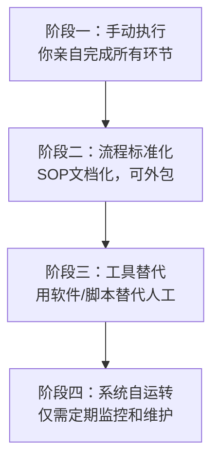
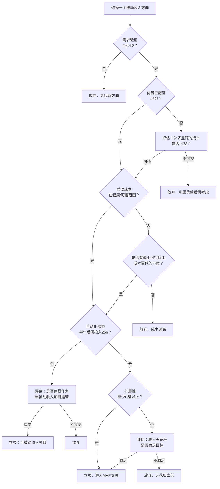

## 一、被动收入项目选择框架

被动收入不是"躺着赚钱"的代名词。它是一种**前期投入大量精力构建系统、后期通过系统自动运转获取回报**的收入模式。选择错误的项目，你会在前期投入中消耗殆尽却看不到回报；选择正确的项目，你的时间杠杆会成倍放大。

本节提供一套完整的项目选择框架，帮助你在投入任何时间精力之前，用系统化的方法评估一个被动收入项目是否值得做。

### 1. 重新理解被动收入的光谱

被动收入不是一个二元概念（被动 vs 主动），而是一个**连续光谱**。理解这个光谱是选择项目的前提。


| 被动程度 | 典型项目 | 前期投入 | 维护频率 | 收入天花板 |
|----------|----------|----------|----------|------------|
| 低（半被动） | 咨询课程、付费社群 | 3-6个月 | 每周数小时 | 中等（10万-50万/年） |
| 中 | 数字产品、模板、工具 | 1-3个月 | 每月数小时 | 较高（5万-200万/年） |
| 高 | 自动化网站、授权内容 | 2-6个月 | 每季度检查 | 高（上不封顶） |
| 极高 | 指数基金、房产租金 | 资金门槛 | 年度审视 | 取决于本金 |

**关键认知**：越"被动"的项目，前期投入越大（无论是资金还是时间）。不要幻想零投入的被动收入。

### 2. 项目评估的五维模型

在决定是否投入一个被动收入项目之前，用以下五个维度进行系统评估。每个维度 1-10 分，总分 40 分以上的项目值得优先考虑。

```mermaid
radar
    title 被动收入项目五维评估
    axis 市场需求, 个人优势匹配, 启动成本, 自动化程度, 可扩展性
    "优质项目" : 8, 7, 8, 7, 9
    "一般项目" : 5, 6, 4, 5, 3
    "劣质项目" : 3, 2, 3, 2, 2
```

#### 2.1 维度一：市场需求验证（权重 30%）

没有需求的项目，再好的执行也是白费。需求验证是第一道过滤器。

**验证方法（按可信度排序）：**

| 验证层级 | 方法 | 工具 | 可信度 |
|----------|------|------|--------|
| L1-付费验证 | 已有人在为此付费 | 电商平台销量、付费社群人数 | ★★★★★ |
| L2-搜索验证 | 有人在主动搜索解决方案 | 百度指数、微信指数、5118 | ★★★★ |
| L3-社区验证 | 社区中有大量讨论和提问 | 知乎、小红书、Reddit、V2EX | ★★★ |
| L4-趋势验证 | 市场正在增长 | 行业报告、Google Trends | ★★ |
| L5-直觉验证 | 你"觉得"有需求 | 个人判断 | ★ |

**至少达到 L2 才值得继续评估。** L5 级别的项目 90% 会失败。

**需求验证实操清单：**

1. **竞品搜索**：在各大平台搜索你想做的方向，看是否有人已经在做且有付费用户
2. **关键词调研**：用 5118 或百度指数查看相关关键词的搜索量趋势
3. **社区挖掘**：在知乎、小红书搜索相关问题，统计提问数量和互动量
4. **价格锚定**：找到竞品的定价，确认用户愿意支付的价格区间
5. **痛点确认**：收集 10 个以上真实用户的痛点描述（来自评论、问答、社群）

#### 2.2 维度二：个人优势匹配度（权重 25%）

被动收入项目需要前期大量投入，如果与你的能力、资源、兴趣不匹配，你很难坚持到产出回报的阶段。

**匹配度评估矩阵：**

| 评估项 | 问题 | 权重 |
|--------|------|------|
| 技能匹配 | 你是否已经具备完成项目 70% 以上工作所需的核心技能？ | 30% |
| 资源匹配 | 你是否拥有项目所需的关键资源（设备、渠道、人脉、数据）？ | 25% |
| 兴趣持续 | 你是否对这个领域有足够的兴趣，能持续投入 6 个月以上？ | 25% |
| 学习成本 | 缺失的 30% 技能，学习成本有多高？能否在 1 个月内补齐？ | 20% |

**评分标准**：

- **8-10 分**：核心技能已掌握，有独特资源，强烈兴趣驱动
- **5-7 分**：大部分技能具备，需要一定学习，兴趣中等
- **1-4 分**：需要从零开始学习，没有资源优势，兴趣一般

**常见误区**：很多人选择"看起来赚钱"的项目，而不是"自己有优势"的项目。结果是和已有积累的竞争者正面竞争，毫无胜算。被动收入的本质是**用你已有的优势构建系统**，而不是去追逐热门赛道。

#### 2.3 维度三：启动成本评估（权重 20%）

启动成本不仅是钱，还包括时间、机会成本和心理成本。

**成本构成分解：**

| 成本类型 | 具体内容 | 估算方法 |
|----------|----------|----------|
| 资金成本 | 工具订阅、域名服务器、外包费用、素材采购 | 列清单逐项估算 |
| 时间成本 | 学习时间 + 构建时间 + 测试时间 | 按小时数 × 你的时薪折算 |
| 机会成本 | 做这个项目意味着放弃什么？ | 最优替代方案的预期收益 |
| 心理成本 | 项目失败对你的心态影响 | 主观评估（高/中/低） |

**启动成本健康度判断：**

- **健康**：总启动成本 < 你 3 个月可支配收入，且主要是时间投入
- **可控**：总启动成本 < 你 6 个月可支配收入，有一定资金投入
- **危险**：总启动成本 > 你 6 个月可支配收入，或需要借贷投入

**核心原则**：初期尽量用时间换金钱，而不是用金钱换时间。在项目尚未验证时，避免大额资金投入。

#### 2.4 维度四：自动化程度潜力（权重 15%）

这是被动收入项目区别于普通副业的核心指标。一个项目从启动到高度自动化，需要经历以下阶段：



**自动化潜力评估表：**

| 评估维度 | 高自动化潜力 | 低自动化潜力 |
|----------|-------------|-------------|
| 交付物 | 标准化产品（模板、课程、工具） | 定制化服务（咨询、设计） |
| 客户互动 | 异步、可批处理 | 实时、一对一 |
| 内容更新 | 稳定领域，内容常青 | 快速变化领域，需频繁更新 |
| 客户获取 | SEO、内容营销等被动流量 | 需要主动销售、BD |
| 售后支持 | FAQ + 自助社区 | 需要人工客服 |

一个高自动化潜力的项目，在半年后应该能将你的每周投入时间降至 **5 小时以下**。

#### 2.5 维度五：可扩展性（权重 10%）

可扩展性决定了你的收入天花板。关键问题是：**收入翻倍时，你的投入是否也必须翻倍？**

| 扩展性等级 | 特征 | 例子 | 收入/投入比 |
|-----------|------|------|------------|
| A级-无限扩展 | 边际成本趋近于零 | 数字产品、SaaS、内容平台 | 1:0.01 |
| B级-高扩展 | 边际成本很低 | 在线课程、付费社群 | 1:0.1 |
| C级-中扩展 | 边际成本固定 | 授权内容、模板市场 | 1:0.3 |
| D级-低扩展 | 边际成本随收入线性增长 | 代运营、Freelance | 1:0.8 |

**优先选择 A 级和 B 级项目**。D 级项目本质上还是"卖时间"，只是通过系统化把效率提高了。

### 3. 项目选择决策流程

将五维评估整合为一个可操作的决策流程：



### 4. 六种常见被动收入模式的评估对照

以下针对最常见的六种被动收入模式，给出具体的评估要点和典型坑位：

#### 4.1 数字产品（模板、插件、工具）

**核心逻辑**：将你的一次性技能输出产品化，卖给需要的人。

| 评估项 | 要点 |
|--------|------|
| 需求验证 | 是否有平台已存在类似产品且有销量？（淘宝、Gumroad、小红书） |
| 优势匹配 | 你是否在某个专业领域有比大多数人强的技能？ |
| 启动成本 | 制作工具 + 平台费用，通常 < 2000 元 |
| 自动化 | 交付可完全自动化，客服可FAQ覆盖 80% |
| 扩展性 | A级，边际成本趋近零 |

**典型坑位**：
- 做了一个精美的模板，但没有人搜索这个品类
- 定价过低（9.9 元），需要海量客户才能有可观收入
- 忽视售后文档，导致大量一对一客服消耗时间

**收入模型参考**：
- 定价 99 元，月销 100 份 = 9,900 元/月
- 定价 299 元，月销 30 份 = 8,970 元/月
- 定价 999 元，月销 10 份 = 9,990 元/月

中高定价 + 优质内容 + 完善文档 = 最优策略。

#### 4.2 内容平台（博客、公众号、YouTube）

**核心逻辑**：通过持续输出优质内容积累流量，通过广告、带货、付费内容变现。

| 评估项 | 要点 |
|--------|------|
| 需求验证 | 该领域是否有大量搜索需求？是否有成熟的内容消费习惯？ |
| 优势匹配 | 你能否持续输出该领域 6 个月以上的高质量内容？ |
| 启动成本 | 极低（域名 + 主机 < 500 元/年），主要是时间成本 |
| 自动化 | 内容生产难以完全自动化，但历史内容可持续带来流量 |
| 扩展性 | B级，内容资产可复用 |

**典型坑位**：
- 选择了一个你无法持续输出的领域（半年后灵感枯竭）
- 只做内容不做变现路径设计，流量无法转化
- 追热点而非构建常青内容，流量波动大

#### 4.3 在线课程

**核心逻辑**：将你的专业知识体系化，通过录制课程反复销售。

| 评估项 | 要点 |
|--------|------|
| 需求验证 | 是否有人愿意付费学习这个技能？搜索"XX 教程""XX 入门"的量级？ |
| 优势匹配 | 你是否有教人的能力和耐心？是否有实际成果背书？ |
| 启动成本 | 录屏设备 + 平台费用，约 1000-5000 元 |
| 自动化 | 录制后可完全自动销售，但需要定期更新内容 |
| 扩展性 | B级，课程内容可长期复用 |

**典型坑位**：
- 课程内容试图面面俱到，反而没有特色
- 没有前置的免费内容建立信任，直接卖高价课程转化率极低
- 忽视课程的结构化设计，用户体验差导致口碑崩塌

#### 4.4 SaaS / 小工具

**核心逻辑**：用代码构建解决特定问题的工具，按订阅制收费。

| 评估项 | 要点 |
|--------|------|
| 需求验证 | 是否有明确的、用户愿意付费解决的痛点？ |
| 优势匹配 | 你是否有独立开发和运维的能力？ |
| 启动成本 | 服务器 + 域名 + 支付接口，约 2000-10000 元/年 |
| 自动化 | 高度自动化，但需要持续维护和迭代 |
| 扩展性 | A级，边际成本极低 |

**典型坑位**：
- 开发了 3 个月发现没有人需要这个工具
- 技术债务累积导致维护成本越来越高
- 定价太低无法覆盖服务器和客服成本

#### 4.5 电商自动化（无货源/代发）

**核心逻辑**：搭建电商店铺，通过供应链自动化实现半被动收入。

| 评估项 | 要点 |
|--------|------|
| 需求验证 | 选品是否有稳定需求？是否有季节性波动？ |
| 优势匹配 | 你是否有电商运营经验？是否了解平台规则？ |
| 启动成本 | 平台保证金 + 工具订阅，约 5000-20000 元 |
| 自动化 | 中等，选品和上架可自动化，但客服和售后需要投入 |
| 扩展性 | C级，受供应链和平台限制 |

**典型坑位**：
- 平台规则变化导致店铺被封
- 供应商断货或质量下降
- 价格战导致利润趋近于零

#### 4.6 投资型被动收入（理财、房产、版税）

**核心逻辑**：用资本换取持续回报。

| 评估项 | 要点 |
|--------|------|
| 需求验证 | 不适用（这是资产配置，不是市场需求问题） |
| 优势匹配 | 你是否有足够的本金？是否有投资知识？ |
| 启动成本 | 资金门槛高（房产首付、版权购买等） |
| 自动化 | 极高，几乎不需要日常管理 |
| 扩展性 | 取决于本金规模 |

**典型坑位**：
- 把所有积蓄投入单一资产
- 不理解投资标的真实风险
- 被"高收益"骗局吸引

### 5. 项目组合策略：不要把鸡蛋放在一个篮子里

成熟的被动收入体系应该是**多项目组合**，而不是押注单一项目。

**推荐组合模式：**

| 组合层级 | 作用 | 典型配置 | 收入占比目标 |
|----------|------|----------|-------------|
| 基础层 | 稳定现金流 | 指数基金分红、已有课程持续销售 | 30-40% |
| 增长层 | 收入增长主力 | 新产品开发、内容平台扩展 | 40-50% |
| 探索层 | 寻找下一个增长点 | 新领域试水、MVP 验证 | 10-20% |

**组合原则：**

1. **相关性分散**：不要所有项目都依赖同一平台（如都在抖音、都在淘宝）
2. **时间错配**：组合中有短期见收益的项目，也有长期高回报的项目
3. **风险对冲**：有稳定型项目保底，也有高风险高回报的探索
4. **能力复用**：项目之间共享核心能力（如内容能力可复用于课程、社群、出版）

### 6. 常见决策误区与纠正

| 误区 | 真相 | 纠正方法 |
|------|------|----------|
| "这个项目别人赚了很多钱，我也能" | 别人的成功可能基于你看不到的资源、时机和能力 | 用自己的五维模型独立评估，不看别人的收入截图 |
| "先做起来再说" | 方向错误的努力是最大的浪费 | 花 1-2 周做需求验证，比盲目投入 3 个月有价值 |
| "我什么都会一点，选最赚钱的" | 什么都行意味着什么都不突出 | 选择你有**独特优势**的领域，而非最热门的领域 |
| "被动收入就是不需要工作" | 前期投入可能比全职还多 | 设定合理预期：3-6 个月高强度投入，之后逐步减少 |
| "一个项目做成功就够了" | 单一收入来源极其脆弱 | 逐步构建 2-3 个互补的被动收入来源 |
| "热门赛道一定好" | 热门意味着竞争激烈，新入局者没有优势 | 寻找需求明确但竞争尚不充分的细分领域 |

### 7. 实操工具箱

#### 7.1 项目评估评分卡模板

用以下模板对每个候选项目打分，总分 ≥ 40 分可立项：

```text
项目名称：________________
评估日期：________________

一、市场需求（1-10分）× 3 = ___分
  - 竞品存在且有付费用户？    是/否
  - 关键词月搜索量 > 1000？   是/否
  - 社区讨论活跃度？          高/中/低

二、个人优势匹配（1-10分）× 2.5 = ___分
  - 核心技能掌握度？          80%+ / 50-80% / <50%
  - 独特资源优势？            有/无
  - 持续兴趣驱动？            强/中/弱

三、启动成本（1-10分）× 2 = ___分
  - 资金成本 < 5000 元？      是/否
  - 时间成本 < 3个月？        是/否
  - 机会成本可控？            是/否

四、自动化潜力（1-10分）× 1.5 = ___分
  - 半年后周投入 ≤ 5小时？    是/否/不确定
  - 交付可标准化？            是/否
  - 流量来源可被动化？        是/否

五、可扩展性（1-10分）× 1 = ___分
  - 边际成本 < 收入的20%？    是/否
  - 收入天花板 > 10万/年？    是/否

总分：___ / 50分
决策：□ 立项（≥40） □ 观望（30-39） □ 放弃（<30）
```

#### 7.2 需求验证快速检查清单

在投入任何开发工作之前，完成以下检查：

- [ ] 找到至少 3 个竞品，且至少 1 个有明确的付费用户
- [ ] 相关关键词在百度指数/微信指数有稳定或上升趋势
- [ ] 在知乎/小红书/Reddit 找到至少 10 个相关问题
- [ ] 确认用户愿意支付的价格区间（通过竞品定价）
- [ ] 与至少 3 个目标用户进行过对话，确认痛点真实存在
- [ ] 评估市场容量：单价 × 潜在客户数 ≥ 你的收入目标

全部打勾才进入下一步。

### 8. 进阶：构建你的"项目雷达系统"

成熟的被动收入构建者不会等一个项目失败后再找下一个，而是始终保持一个"项目雷达"——持续收集和评估潜在项目机会。

**雷达系统搭建方法：**

1. **信息源订阅**：关注 ProductHunt、独立开发者社区、行业垂直媒体
2. **痛点日志**：随时记录自己和他人遇到的问题，定期评估是否有产品化机会
3. **竞品监控**：对你关注的领域持续跟踪竞品动态（新功能、定价变化、用户评价）
4. **季度评估**：每季度用五维模型评估 3-5 个新方向，保持对市场的敏感度
5. **小规模测试**：对最有潜力的方向做 1-2 周的 MVP 测试，验证真实需求

**核心理念**：项目选择不是一次性决策，而是一个持续运转的系统。最好的被动收入构建者，是那些始终保持对市场需求敏感、对自身优势清醒、对投入产出理性评估的人。

---

> **本节总结**：被动收入项目选择的关键不是找到"最赚钱"的项目，而是找到**需求真实、你有优势、成本可控、可自动化、可扩展**的项目。用五维模型系统评估，用决策流程过滤，用评分卡量化判断。方向对了，执行力才有意义。
