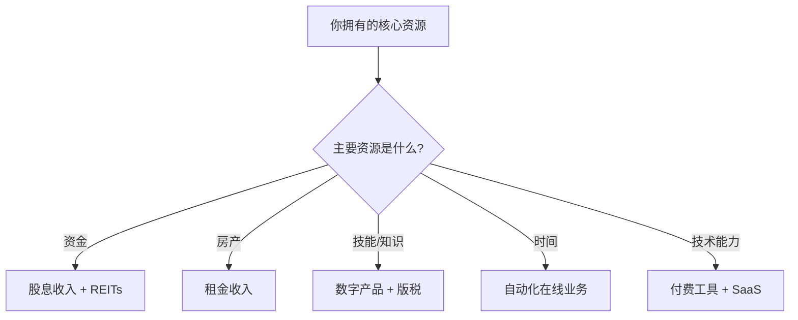

## 二、五大被动收入类型的构建方法

被动收入并非"不劳而获"，而是"前期投入、后期收获"的收入模式。本章系统拆解五大被动收入类型，从底层逻辑到实操方法，帮助你根据自身资源和能力，选择最适合的路径进行构建。

### 为什么是这五种类型？

被动收入的来源成百上千，但真正具备**可规模化、可复制、边际成本递减**这三大特征的，集中在以下五个领域：

| 类型 | 核心资产 | 启动门槛 | 天花板 | 见效周期 |
|------|----------|----------|--------|----------|
| 版税收入 | 知识产权 | 中 | 中高 | 6-18个月 |
| 股息收入 | 金融资本 | 中高 | 中 | 1-3年 |
| 租金收入 | 不动产/实物 | 高 | 高 | 即时-6个月 |
| 数字产品 | 数字资产 | 低 | 高 | 1-6个月 |
| 自动化在线业务 | 系统/流量 | 低中 | 极高 | 3-12个月 |

选择哪种类型，取决于你当前拥有的核心资源：**钱多选股息，有房选租金，有技能选数字产品，有时间选内容创作。**

---

### 技巧一：版税收入构建

版税收入的本质是**将一次性的智力劳动转化为持续的现金流**。你写一本书、拍一组照片、创作一首音乐，这些作品在未来数年甚至数十年内持续产生收益。关键在于：作品必须有持久的市场需求，而不是昙花一现的热点。

#### A. 图书版税

图书版税是最经典的被动收入形式。一本好书可以持续销售5-10年，甚至更久。

##### 1. 选题定位：决定80%的成败

选题是图书版税的第一道门槛。选错题，再好的写作能力也难以变现。

**选题三原则：**

- **你有专业积累**：至少3年以上的实践经验或研究，能提供外行无法给出的洞察
- **市场有真实需求**：通过电商平台（当当、京东、亚马逊）搜索同类书籍的评论数和销量排名，验证需求
- **竞争不过度饱和**：如果某个细分领域已经有10本以上的畅销书，新人很难突围

**选题验证方法：**

1. 在当当网搜索你的目标关键词，查看搜索结果数量
2. 查看排名前5的同类书的评论数（评论数>500说明需求旺盛）
3. 阅读这些书的差评（1-2星），找到读者未被满足的需求
4. 在知乎、豆瓣搜索相关话题，观察讨论热度和问题频率

**选题矩阵：**

| 选题类型 | 示例 | 市场规模 | 竞争度 | 推荐指数 |
|----------|------|----------|--------|----------|
| 技能教程类 | Python入门、短视频剪辑 | 大 | 高 | ★★★ |
| 行业分析类 | 某行业2026趋势报告 | 中 | 低 | ★★★★ |
| 问题解决类 | 职场沟通、育儿焦虑 | 大 | 中 | ★★★★ |
| 方法论类 | 时间管理、个人品牌 | 中 | 高 | ★★★ |
| 细分专业类 | 某个编程框架深度指南 | 小 | 低 | ★★★★★ |

##### 2. 写作策略：从大纲到成稿

**第一步：构建目录大纲（1-2周）**

大纲是一本书的骨架。好的大纲应该做到：读者只看目录就能判断这本书值不值得买。

```text
第1章 为什么你需要学习X（痛点引入）
第2章 X的核心原理（理论基础）
第3章 X的入门实践（动手开始）
第4-6章 X的各个细分方向（深度展开）
第7章 X的高级技巧（进阶内容）
第8章 常见问题与避坑指南（实用价值）
第9章 未来趋势与行动建议（收尾升华）
```

**第二步：初稿写作（2-4个月）**

- 每天固定2小时写作时间，雷打不动
- 先完成再完美，不要在初稿阶段反复修改
- 每章控制在8000-15000字，全书8-15万字（电子书可缩短到3-5万字）
- 使用番茄工作法：25分钟专注写作 + 5分钟休息

**第三步：修改打磨（1-2个月）**

- 第一遍：检查逻辑结构，调整章节顺序
- 第二遍：润色语言，删除冗余段落
- 第三遍：找3-5个目标读者试读，收集反馈
- 根据反馈进行针对性修改

##### 3. 出版路径选择

三条路径各有优劣，需要根据你的目标和资源选择：

**传统出版：**

- 稿酬模式：版税8%-15%（按定价计算），或一次性稿酬
- 优势：有专业编辑团队、ISBN书号、正规发行渠道、品牌背书
- 劣势：周期长（6-12个月）、审核严格、自主权低
- 适合：有一定知名度或专业权威的作者
- 操作：准备完整的书稿或详细大纲+样章，联系出版社编辑或通过代理投稿

**自出版（Amazon KDP、豆瓣阅读等）：**

- 收益模式：平台抽成30%-40%，作者获得60%-70%
- 优势：完全自主、上架快（1-3天）、全球发行
- 劣势：需要自己负责封面设计、排版、推广
- 适合：有数字营销能力的作者
- 操作：使用Vellum、Atticus或Sigil进行排版，Canva设计封面

**知识付费平台发布：**

- 平台：知乎盐选、微信读书、豆瓣阅读、得到、樊登读书
- 收益模式：平台分成（通常50%-70%归作者）
- 优势：平台自带流量，用户付费习惯好
- 劣势：平台规则多变，依赖平台分发
- 适合：内容质量高但推广资源有限的作者

##### 4. 推广策略：让书被看见

写完书只是完成了一半工作。没有推广，再好的书也会石沉大海。

**内容引流矩阵：**

- **社交媒体预热**：写作过程中定期分享进展和片段，培养潜在读者
- **书评合作**：联系读书博主和KOL，提供免费样书换取真实书评
- **社群渗透**：在相关领域的社群和论坛中，以分享干货的形式自然引出书籍
- **SEO长尾**：围绕书的主题撰写10-20篇博客文章，获取搜索引擎流量
- **首发优惠**：新书上架前3天设置限时折扣，冲销量排名

**长期维护：**

- 根据读者反馈定期更新内容（电子书可随时更新）
- 建立读者社群，培养口碑传播
- 出版系列作品，形成品牌效应

##### 5. 收益预期与案例

**收益模型（自出版电子书）：**

| 指标 | 保守估计 | 中等估计 | 乐观估计 |
|------|----------|----------|----------|
| 定价 | 29元 | 49元 | 79元 |
| 月销量 | 50本 | 200本 | 500本 |
| 月收入 | 870元 | 5,880元 | 23,700元 |
| 年收入 | 10,440元 | 70,560元 | 284,400元 |

一本长销书年收入在1-7万元之间是合理预期，出版3-5本系列书后，组合年收入可达10-30万元。

#### B. 数字素材版税

数字素材版税是被严重低估的被动收入来源。一次创作，全球销售，持续数年。

##### 1. 平台选择与入驻

| 平台 | 类型 | 分成比例 | 审核难度 | 推荐度 |
|------|------|----------|----------|--------|
| Shutterstock | 综合素材 | 15%-40% | 中 | ★★★★ |
| Adobe Stock | 综合素材 | 33% | 中 | ★★★★ |
| Getty Images | 高端素材 | 15%-45% | 高 | ★★★ |
| 图虫创意 | 国内素材 | 25%-50% | 低 | ★★★★ |
| 视觉中国 | 国内高端 | 20%-40% | 高 | ★★★ |
| 500px | 摄影作品 | 30%-60% | 中 | ★★★ |

##### 2. 高需求素材类型

商业市场对以下类型的素材需求最大、付费意愿最强：

- **商务场景**：办公环境、团队协作、商务会议、数据分析
- **科技概念**：人工智能、区块链、云计算、数字化转型的视觉化表达
- **生活方式**：健康饮食、运动健身、家庭生活、旅行风景
- **多元文化**：不同种族、年龄、性别的人物形象
- **节日季节**：春节、圣诞、情人节等节日相关素材

##### 3. 构建素材库的策略

**起步阶段（0-100个素材）：**

- 选择1-2个你擅长的细分方向
- 每周上传5-10个高质量素材
- 重点打磨质量，建立作品标准

**成长阶段（100-1000个素材）：**

- 扩展到3-5个细分方向
- 分析平台数据，淘汰低效素材类型，加倍投入高效类型
- 每月上传30-50个素材

**成熟阶段（1000+个素材）：**

- 形成系统化的素材库结构
- 月收入稳定在1000-5000元
- 考虑雇佣助手批量生产标准化素材

##### 4. 收益预期

| 素材库规模 | 月均下载量 | 月收入（估算） |
|------------|------------|----------------|
| 100个 | 50-200次 | 200-800元 |
| 500个 | 300-1000次 | 1,200-4,000元 |
| 1000个 | 800-3000次 | 3,200-12,000元 |
| 3000个 | 3000-10000次 | 12,000-40,000元 |

关键认知：素材库的收益不是线性增长，而是**指数增长**——当你的素材数量超过临界点后，平台算法会更多地推荐你的作品，形成正向飞轮。

---

### 技巧二：股息收入构建

股息收入是真正的"钱生钱"——你不需要付出劳动，只需要做出正确的投资决策，然后让时间和复利为你工作。

#### A. 股息投资的核心逻辑

股息收入的本质是**成为优质企业的股东，分享企业利润**。与追求股价上涨的资本利得不同，股息投资关注的是企业持续分红的能力。

**股息投资的三大优势：**

1. **现金流稳定**：优质股息股通常每季度分红一次，形成稳定的现金流入
2. **抗通胀能力强**：好的企业会随利润增长而提高分红金额
3. **复利效应显著**：将股息再投资，长期收益远超本金增长

**复利计算示例：**

假设初始投资10万元，年股息率5%，股息全部再投资：

| 年限 | 本金 | 累计收益 | 总资产 |
|------|------|----------|--------|
| 第1年 | 100,000 | 5,000 | 105,000 |
| 第5年 | 100,000 | 27,628 | 127,628 |
| 第10年 | 100,000 | 62,889 | 162,889 |
| 第20年 | 100,000 | 165,330 | 265,330 |
| 第30年 | 100,000 | 332,194 | 432,194 |

20年不动，本金翻2.6倍；30年不动，翻4.3倍。这就是复利的力量。

#### B. 股息投资组合构建

##### 1. 分散化配置原则

分散化是投资中唯一的"免费午餐"。不要把所有资金集中在一只股票或一个行业。

**配置建议：**

- 持有15-30只不同行业的高股息股票
- 单只股票占比不超过总资产的5%
- 单个行业占比不超过20%
- 跨行业配置：银行、能源、公用事业、消费、医药、房地产

**简化方案——股息ETF：**

如果选股能力有限或不想花太多时间研究个股，可以直接购买股息ETF：

| ETF类型 | 代表产品 | 特点 |
|---------|----------|------|
| 红利ETF | 中证红利ETF (515180) | 跟踪高股息A股指数 |
| 恒生高股息 | 恒生高股息ETF | 港股高息蓝筹 |
| 全球股息 | Vanguard High Dividend Yield (VYM) | 全球分散配置 |
| REITs ETF | 国内REITs ETF | 不动产投资信托 |

##### 2. 个股筛选标准

从数千只股票中筛选出值得长期持有的股息股，需要关注以下指标：

**硬性指标（必须满足）：**

- 股息率 ≥ 4%（低于4%的股息率不值得专门做股息投资）
- 连续分红 ≥ 5年（证明分红的持续性和管理层的分红意愿）
- 派息比例 30%-70%（太低说明公司不够慷慨，太高说明分红不可持续）

**软性指标（加分项）：**

- 盈利增长：过去5年净利润年化增长率 > 5%
- 资产负债率 < 60%（过高负债可能影响未来分红）
- 自由现金流为正（有钱才能分红）
- 行业地位稳固（护城河宽的企业分红更持续）

**排除指标（一票否决）：**

- 过去3年有减少或暂停分红的历史
- 行业处于衰退周期
- 大股东频繁减持
- 审计意见非标准

##### 3. 再投资策略

股息收入的威力在于复利。将收到的股息再投资，是放大收益的关键。

**手动再投资：**

- 每季度收到股息后，手动买入持仓中表现较弱的股票
- 优点：可以根据市场情况灵活调整
- 缺点：需要时间和纪律

**自动再投资（DRIP）：**

- 很多券商提供"股息再投资计划"（Dividend Reinvestment Plan）
- 自动将股息买入原有股票，零手续费
- 优点：完全自动化，无需操心
- 缺点：无法灵活选择再投资标的

**推荐策略：** 使用DRIP作为默认设置，每半年手动审视一次投资组合，做必要的再平衡。

#### C. REITs投资：不动产的证券化入口

REITs（Real Estate Investment Trust，房地产投资信托基金）是获取不动产租金收入的最便捷方式——你不需要买房、不需要管理租客，只需要买入REITs份额。

**REITs的核心优势：**

- **强制高分红**：法律要求将90%以上的应税利润分配给投资者
- **收益率高**：典型年化收益率5%-10%，高于大多数股票
- **流动性好**：像股票一样在交易所买卖，随时可以变现
- **专业管理**：由专业团队负责物业的购买、运营和管理
- **门槛低**：几百元即可开始投资

**REITs的类型：**

| 类型 | 说明 | 典型收益率 |
|------|------|------------|
| 商业地产REITs | 写字楼、购物中心 | 4%-8% |
| 住宅REITs | 公寓、长租公寓 | 3%-6% |
| 工业REITs | 仓库、物流中心 | 4%-7% |
| 医疗REITs | 医院、养老设施 | 5%-8% |
| 数据中心REITs | 云计算数据中心 | 2%-5% |
| 基础设施REITs | 通信塔、光纤网络 | 3%-6% |

**REITs投资注意事项：**

- 关注FFO（运营资金）而非净利润——FFO更能反映REITs的真实盈利能力
- 留意利率环境：利率上升时REITs价格通常下跌（因为借贷成本增加）
- 选择入住率>90%的REITs
- 避免过度集中在单一类型的REITs

#### D. 股息收入的风险与应对

| 风险类型 | 说明 | 应对方法 |
|----------|------|----------|
| 分红削减风险 | 公司经营恶化可能减少或取消分红 | 选择连续10年以上分红的公司 |
| 股价下跌风险 | 股息收入可能被股价下跌抵消 | 关注基本面而非短期股价波动 |
| 利率风险 | 利率上升时股息股吸引力下降 | 配置不同久期的资产对冲 |
| 行业周期风险 | 特定行业可能进入衰退 | 跨行业分散配置 |
| 汇率风险 | 投资海外股息股时的汇率波动 | 通过ETF分散或对冲汇率 |

---

### 技巧三：租金收入构建

租金收入是最"实在"的被动收入——你拥有一项实物资产，它每月为你产生现金流。但"被动"二字容易产生误解：房产投资需要前期大量的资金投入和后期持续的管理精力。

#### A. 住宅出租

住宅出租是最常见的租金收入形式。选对房、管好房、定好价，是获取稳定租金的三个关键。

##### 1. 选房标准：买对一套房，胜过十年忙

**核心指标——租售比：**

租售比 = 年租金 ÷ 房价 × 100%

| 租售比 | 判断 | 说明 |
|--------|------|------|
| > 5% | 优秀 | 租金收益显著，值得投资 |
| 3%-5% | 合理 | 可以考虑，但需要配合房价升值 |
| < 3% | 一般 | 纯靠租金回本周期太长 |

**区位选择四要素：**

- **交通便利**：地铁口1公里以内，公交线路密集
- **配套齐全**：周边有学校、商场、医院、公园
- **租客密集区**：靠近CBD、大学城、产业园区
- **物业管理好**：小区环境整洁，安保到位

**户型选择：**

- **一居室（40-60㎡）**：出租率最高，空置期最短，适合单身和情侣
- **小两居（60-80㎡）**：适合小家庭，租客稳定性高
- **大户型（100㎡+）**：租金单价低，空置风险高，不推荐纯投资

##### 2. 提升租金的技巧

同样的房子，通过简单的优化，租金可以提升10%-30%。

**基础装修（投入5000-20000元）：**

- 墙面重新粉刷（白色或浅灰色，显大显亮）
- 更换老旧灯具（LED吸顶灯，明亮节能）
- 卫生间做防水处理和简单的翻新
- 厨房台面和橱柜做基础翻新

**家具家电配置（投入10000-30000元）：**

- 必备：床、衣柜、书桌、空调、洗衣机、冰箱、热水器
- 加分：智能门锁、微波炉、WiFi路由器
- 原则：选择耐用、易清洁、外观简洁的品牌产品

**拎包入住体验：**

- 提供基本的床上用品和厨房用具
- 安装好窗帘和遮光帘
- 准备一份《房屋使用手册》（WiFi密码、家电使用说明、周边生活指南）
- 拍摄高质量的房源照片（白天自然光拍摄，广角镜头）

##### 3. 降低管理成本的方法

管理成本是侵蚀租金收益的主要因素。自动化和标准化是降低管理成本的关键。

**租客筛选标准化：**

- 要求提供收入证明（月收入 ≥ 3倍月租金）
- 查看征信报告（无严重逾期记录）
- 联系前房东了解租客历史
- 签订标准化租赁合同（明确双方权利义务）

**智能化管理工具：**

| 工具类型 | 推荐方案 | 作用 |
|----------|----------|------|
| 智能门锁 | 小米/德施曼指纹锁 | 远程开锁，无需交接钥匙 |
| 智能水表电表 | 远程抄表系统 | 自动读数，避免纠纷 |
| 租房平台 | 贝壳/链家/自如 | 自动发布、筛选租客 |
| 合同管理 | 电子签约平台 | 在线签署，自动提醒续约 |
| 维修服务 | 58到家/万师傅 | 一键下单维修服务 |

**委托管理模式：**

如果名下有多套房产或不想亲自管理，可以委托给长租公寓公司（如自如、蛋壳）：

- 优点：完全省心，公司负责招租、维修、保洁
- 缺点：公司抽成10%-20%，实际到手租金减少
- 适合：有多套房产的投资者，或工作繁忙无暇管理的房东

#### B. 非传统租金收入

除了住宅出租，还有多种方式可以将闲置资产转化为租金收入。

##### 1. 共享停车位

如果你拥有闲置停车位，可以通过共享平台出租。

- **平台**：ETCP、小强停车、共享停车
- **收益**：一线城市核心区域月租500-2000元
- **操作**：在平台注册车位信息，设置可出租时段
- **技巧**：白天出租给上班族（朝九晚六），晚上出租给附近居民

##### 2. 储物空间出租

闲置的房间、车库、仓库都可以作为储物空间出租。

- **平台**：摩尔仓、自助仓
- **收益**：根据面积和位置，月租200-2000元不等
- **注意事项**：确保空间干燥通风，购买财产保险

##### 3. 设备出租

高价值的闲置设备可以通过出租产生收入。

- **摄影器材**：相机、镜头、灯光设备，日租50-500元
- **投影设备**：投影仪、幕布、音响，日租100-300元
- **工具设备**：电钻、切割机、梯子等，日租20-100元
- **平台**：闲鱼、人人租机、内啥

##### 4. 车辆出租

闲置车辆可以通过共享出行平台出租。

- **平台**：凹凸租车、一嗨租车
- **收益**：日租100-500元，月收益2000-8000元
- **风险**：需要购买额外的商业保险，注意事故责任划分
- **建议**：安装GPS定位器，设置里程和区域限制

---

### 技巧四：数字产品构建

数字产品是**边际成本几乎为零**的被动收入类型。你制作一次，可以无限次销售，不需要库存、物流和售后。这是互联网时代最纯粹的被动收入形式。

#### A. 电子书产品

电子书是门槛最低的数字产品——只要你有知识、有经验、有见解，就可以制作一本电子书开始销售。

##### 1. 快速电子书策略

不同于传统出版的长篇大论，快速电子书聚焦于一个细分问题，用3-5万字讲透。

**选题方向：**

- **教程类**：手把手教你做某件事（如"零基础学会用Notion管理人生"）
- **工具类**：模板、清单、工作表合集（如"50个高效工作模板"）
- **策略类**：行业分析、方法论（如"2026年小红书运营完全指南"）
- **案例类**：成功案例拆解（如"10个年入百万的自媒体人是怎么做的"）

**制作流程：**

1. 选题验证：在知乎、小红书搜索相关问题的浏览量和互动量
2. 大纲设计：8-12章，每章聚焦一个子话题
3. 内容撰写：每章3000-5000字，配图表和案例
4. 排版设计：使用Canva、Visme或InDesign制作精美排版
5. 上架销售：选择合适的平台发布

**定价策略：**

| 类型 | 页数 | 定价范围 | 目标销量/月 |
|------|------|----------|-------------|
| 迷你指南 | 20-50页 | 9-29元 | 100-500本 |
| 标准电子书 | 50-150页 | 29-99元 | 50-200本 |
| 深度报告 | 150-300页 | 99-299元 | 20-100本 |
| 系列课程包 | 多本组合 | 199-999元 | 10-50份 |

##### 2. 销售平台选择

| 平台 | 特点 | 抽成 | 适合 |
|------|------|------|------|
| Gumroad | 国际平台，界面简洁 | 10% | 面向海外用户 |
| 小鹅通 | 国内知识付费平台 | 0-10% | 面向国内用户 |
| 豆瓣阅读 | 文艺和专业内容 | 30% | 文学、社科类 |
| 知识星球 | 社群+内容模式 | 5% | 配合社群运营 |
| 自建网站 | 完全自主 | 支付手续费 | 有流量基础的创作者 |

#### B. 设计模板产品

设计模板是"制作一次，反复销售"的典型代表。

##### 1. 热门模板类型

- **PPT模板**：商务汇报、教育课件、产品发布、个人简历
- **Notion模板**：项目管理、知识库、生活规划、财务记账
- **Canva模板**：社交媒体帖子、海报、名片、简历
- **Excel/Google Sheets模板**：财务报表、数据分析、项目追踪
- **Figma模板**：UI组件库、设计系统、原型模板

##### 2. 制作与销售流程

**制作阶段（每套模板2-4小时）：**

1. 研究市场需求：在模板平台搜索热销模板，分析共性
2. 设计制作：使用专业工具创建高质量模板
3. 打包整理：包含使用说明、字体文件、示例内容
4. 预览展示：制作精美的展示图和使用场景截图

**销售阶段：**

- 在Creative Market、Envato、淘宝、闲鱼等平台发布
- 建立自己的模板商店（使用Gumroad或Shopify）
- 通过社交媒体展示模板效果，吸引购买

##### 3. 收益模型

| 模板库规模 | 单价 | 月销量 | 月收入 |
|------------|------|--------|--------|
| 20套 | 29元 | 100份 | 2,900元 |
| 50套 | 39元 | 300份 | 11,700元 |
| 100套 | 49元 | 800份 | 39,200元 |

#### C. 付费工具与插件

如果你有编程能力，开发付费工具或插件是高天花板的数字产品。

##### 1. 产品方向

- **Excel/Google Sheets插件**：自动化数据处理、报表生成
- **浏览器扩展**：效率工具、网页增强、数据抓取
- **WordPress插件**：SEO优化、表单生成、电商功能
- **小型SaaS工具**：解决特定行业的具体问题
- **API服务**：提供数据接口供其他开发者调用

##### 2. 开发与变现策略

**MVP（最小可行产品）方法：**

1. 找到一个具体的痛点问题
2. 用最简单的方式解决它
3. 先免费发布，收集用户反馈
4. 根据反馈迭代，逐步增加付费功能
5. 建立用户社区，培养忠实用户

**定价模式：**

| 模式 | 说明 | 适合 |
|------|------|------|
| 一次性购买 | 支付一次永久使用 | 功能明确的工具 |
| 订阅制 | 月付/年付 | 持续更新的SaaS |
| 免费增值 | 基础免费，高级付费 | 需要快速获取用户的工具 |
| 按量计费 | 按使用量收费 | API服务、数据服务 |

---

### 技巧五：自动化在线业务构建

自动化在线业务的核心是**构建一个系统，让它在你睡觉时也能为你赚钱**。这需要前期投入大量时间和精力搭建系统，但一旦运转起来，日常维护时间可以降到最低。

#### A. 联盟营销

联盟营销（Affiliate Marketing）是通过推荐他人产品赚取佣金的模式。你不需要创建产品、处理售后，只需要做好引流和推荐。

##### 1. 联盟平台选择

| 平台 | 特点 | 佣金范围 | 适合 |
|------|------|----------|------|
| 淘宝客 | 国内最大 | 1%-50% | 电商导购 |
| 京东联盟 | 3C数码强 | 0.5%-30% | 数码评测 |
| 多多进宝 | 下沉市场 | 1%-40% | 性价比推荐 |
| Amazon Associates | 全球覆盖 | 1%-10% | 海外内容 |
| 各品牌独立计划 | 佣金更高 | 5%-50% | 垂直领域 |

##### 2. 内容引流策略

联盟营销的核心是**内容**——优质的内容吸引流量，流量转化为购买。

**内容类型矩阵：**

- **评测类**：深度体验产品，提供真实评价（转化率最高）
- **对比类**：A产品 vs B产品，帮读者做决策（搜索量大）
- **教程类**：教读者如何使用某类产品解决问题（长尾流量）
- **清单类**：年度最佳XX推荐、XX必买清单（传播性强）

**流量渠道：**

- **SEO博客**：通过搜索引擎获取免费流量，效果持久
- **社交媒体**：小红书、抖音、B站等平台分享使用体验
- **邮件列表**：建立订阅者列表，定期发送推荐内容
- **YouTube视频**：产品评测和教程视频

##### 3. 自动化流程搭建

联盟营销的自动化程度取决于你的工具链：

- **内容自动发布**：使用WordPress定时发布功能，或Buffer/Hootsuite管理多平台
- **链接自动管理**：使用ThirstyAffiliates或Pretty Links管理联盟链接
- **数据自动追踪**：使用Google Analytics监控流量和转化
- **邮件自动发送**：使用Mailchimp或ConvertKit设置自动邮件序列

#### B. 自动化电商

传统电商需要囤货、发货、售后，但自动化电商模式可以大幅减少人工干预。

##### 1. Dropshipping（代发货）模式

**运作方式：**

1. 你在自己的店铺展示商品（加价20%-100%）
2. 客户下单付款
3. 你将订单转给供应商，由供应商直接发货给客户
4. 你赚取差价

**关键成功因素：**

- 选择可靠的供应商（1688、速卖通、CJDropshipping）
- 选品要精准（轻小件、不易碎、利润率高）
- 客户服务要及时（虽然不发货，但要处理售前售后）

**自动化工具链：**

| 环节 | 工具 | 作用 |
|------|------|------|
| 店铺搭建 | Shopify、WooCommerce | 建立独立电商站 |
| 选品分析 | Ecomhunt、Niche Scraper | 发现热销产品 |
| 订单同步 | Oberlo、DSers | 自动同步订单到供应商 |
| 客服 | Tidio、Zendesk | 自动回复常见问题 |
| 营销 | Facebook Ads、Google Ads | 自动化广告投放 |

##### 2. POD（按需印刷）模式

POD（Print on Demand）是零库存的创意商品模式。

**运作方式：**

1. 你设计图案和文字
2. 上传到POD平台（Redbubble、Teespring、淘宝POD店铺）
3. 客户下单后，平台负责印刷、包装和发货
4. 你获得设计费分成

**适合的产品类型：**

- T恤、卫衣、帽子等服装
- 马克杯、手机壳等日用品
- 海报、明信片等装饰品
- 笔记本、贴纸等文具

**关键技巧：**

- 设计风格要统一，形成品牌辨识度
- 紧跟热点和节日，及时推出应季设计
- 使用Merch Informer等工具分析市场需求
- 积累500+设计，形成长尾收入

#### C. 广告收入

广告收入是最古老的被动收入形式之一。在数字时代，只要你能持续产出优质内容吸引流量，广告收入就会随之而来。

##### 1. 内容平台选择

| 平台 | 变现方式 | 门槛 | 收益水平 |
|------|----------|------|----------|
| YouTube | 广告分成 | 1000订阅+4000小时观看 | 高 |
| 公众号 | 流量主+广告 | 500粉丝 | 中 |
| 知乎 | 创作者收益 | 内容质量分 | 中低 |
| 今日头条 | 广告分成 | 无门槛 | 低中 |
| 播客 | 赞助+广告 | 1000+听众 | 中 |

##### 2. 流量积累策略

广告收入的核心是流量。以下是积累流量的关键策略：

- **持续输出**：每周至少发布2-3篇高质量内容
- **找到你的利基**：在某个细分领域成为权威声音
- **SEO优化**：研究关键词，优化标题和内容结构
- **社群运营**：建立粉丝社群，培养忠实受众
- **跨平台分发**：同一内容适配不同平台格式

##### 3. 收益预期

| 月流量（页面浏览量） | 广告收入（估算） | 说明 |
|----------------------|------------------|------|
| 10,000 | 300-800元 | 起步阶段 |
| 50,000 | 1,500-4,000元 | 成长阶段 |
| 200,000 | 6,000-16,000元 | 成熟阶段 |
| 1,000,000 | 30,000-80,000元 | 头部创作者 |

---

### 五大类型的综合对比与选择建议

#### 1. 根据你的起点选择



#### 2. 组合策略：不要只选一种

最稳健的被动收入结构是**多元化组合**——将不同类型搭配使用，降低单一来源的风险。

**推荐组合方案：**

| 阶段 | 资金量 | 推荐组合 | 目标月被动收入 |
|------|--------|----------|----------------|
| 起步期 | < 5万 | 数字产品 + 联盟营销 | 1,000-5,000元 |
| 成长期 | 5-30万 | 数字产品 + 股息 + 小规模内容 | 5,000-15,000元 |
| 成熟期 | 30-100万 | 股息 + 租金 + 数字产品矩阵 | 15,000-50,000元 |
| 自由期 | > 100万 | 多元化投资 + 自动化业务 | 50,000元+ |

#### 3. 常见误区与避坑指南

| 误区 | 真相 | 纠正方法 |
|------|------|----------|
| 被动收入不需要工作 | 前期需要大量投入，只是后期维护少 | 做好1-2年高强度投入的心理准备 |
| 追求"零成本"启动 | 时间也是成本，有些项目需要资金投入 | 综合考虑时间和资金的投入产出比 |
| 同时启动多个项目 | 精力分散，每个都做不好 | 先做好一个，再扩展到第二个 |
| 忽视税务规划 | 被动收入也需要纳税 | 了解各类收入的税务政策，合理规划 |
| 期望一夜暴富 | 被动收入是长期积累的过程 | 设定合理的阶段性目标 |
| 只关注收入不关注成本 | 管理成本、时间成本、机会成本都要计算 | 计算净收益率而非毛收益率 |
| 忽略风险管理 | 单一来源的被动收入风险很大 | 建立多元化的收入组合 |

#### 4. 从零开始的行动清单

如果你现在没有任何被动收入，以下是30天启动计划：

**第1周：盘点与选择**

- [ ] 盘点你拥有的资源：资金、房产、技能、时间
- [ ] 选择1-2种最适合你的被动收入类型
- [ ] 深入研究选定类型的具体操作方法

**第2周：搭建基础**

- [ ] 注册必要的平台账号
- [ ] 学习基础工具的使用
- [ ] 制定详细的执行计划（含时间表和里程碑）

**第3周：开始行动**

- [ ] 开始制作你的第一个数字产品 / 写第一篇联盟营销内容
- [ ] 或者：开始研究第一只股息股 / 查看第一个出租房源
- [ ] 建立数据追踪机制

**第4周：优化迭代**

- [ ] 分析前3周的数据和反馈
- [ ] 调整策略和方法
- [ ] 设定下一个月的目标

---

### 本节核心要点

1. **五大类型各有适用场景**：根据你的核心资源（资金、房产、技能、时间）选择最适合的类型
2. **前期投入决定后期收益**：被动收入不是"不劳而获"，而是"先劳后获"
3. **多元化是王道**：不要只依赖单一收入来源，建立多元化的被动收入组合
4. **耐心和坚持是关键**：大多数被动收入需要6-24个月才能看到显著效果
5. **自动化是目标**：不断优化流程，减少日常干预，真正实现"被动"
