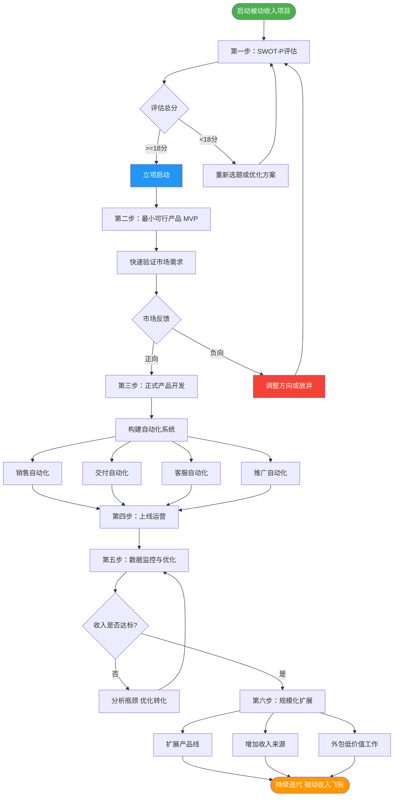
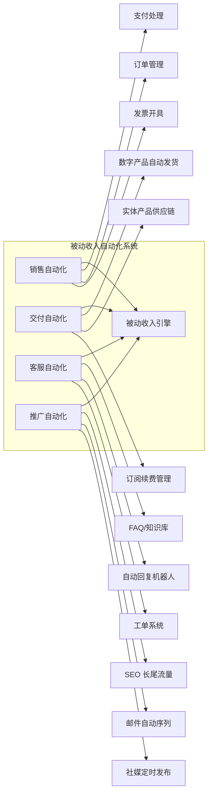
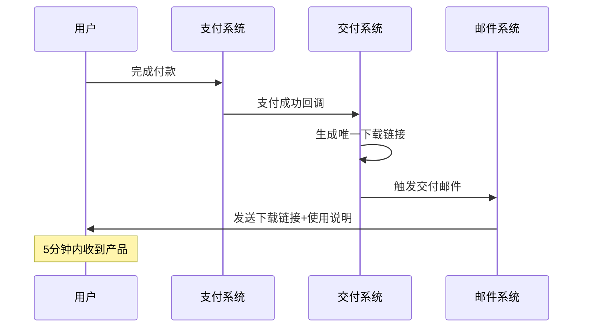
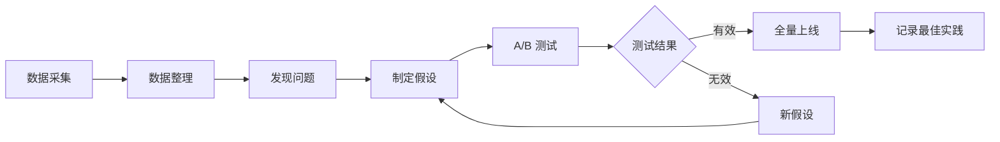
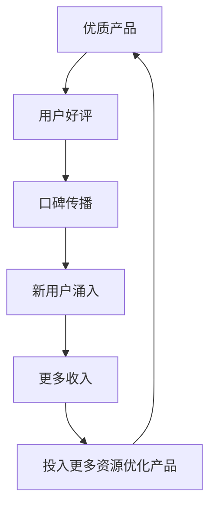

## 三、被动收入系统化构建的通用方法

被动收入类型众多——版税、股息、数字产品、联盟营销、SaaS——但构建它们的底层方法论是相通的。本节提炼出一套跨类型通用的系统化构建框架，无论你选择哪条路径，都可以按照这套方法从零搭建、验证、优化、规模化。

> **核心心法：** 被动收入构建的关键是"先验证，再投入"。用最小成本（MVP）测试市场，确认可行后再全力投入构建自动化系统。切忌一上来就投入大量时间和资金。

### 一、被动收入系统化构建全流程

在深入每一步之前，先建立全局视野。下图展示了从项目启动到持续迭代的完整闭环：



**流程解读：** 这不是一条直线，而是一个螺旋上升的飞轮。每一轮迭代都会让你的被动收入系统更成熟、更稳定。关键在于：不要跳步，不要在验证失败前加大投入。

---

### 二、第一步：最小可行产品（MVP）验证

#### 2.1 为什么 MVP 是被动收入的生死线

被动收入最大的陷阱是"闭门造车"——花三个月写一本没人要的电子书，花半年开发一个没有用户的小工具。MVP 的核心逻辑是：**用最小成本、最短时间，获取真实市场反馈**。

这不是"偷工减料"，而是科学验证。硅谷创业方法论（Lean Startup）的创始人 Eric Ries 指出：**创业公司最大的浪费不是做错事，而是做了一件没人需要的"完美产品"**。被动收入项目同理。

#### 2.2 MVP 设计的四个原则

| 原则 | 含义 | 反面案例 |
|------|------|----------|
| **最小化** | 只保留核心价值主张，砍掉一切锦上添花的功能 | 花一个月做精美封面，内容却没验证 |
| **可度量** | 定义明确的成功指标（转化率、付费率、复购率） | "看看反响"——没有量化标准 |
| **快速** | 从想法到上线不超过 2 周 | 拖延 3 个月还在"打磨" |
| **可迭代** | 第一版就要有收集反馈的机制 | 产品做好了才发现没有用户反馈渠道 |

#### 2.3 五种常见被动收入类型的 MVP 方案

| 被动收入类型 | MVP 形式 | 预计成本 | 验证周期 | 成功指标 |
|-------------|---------|---------|---------|---------|
| **电子书/课程** | 10 页 mini 电子书或 3 节免费试听课程 | 0-500 元 | 1-2 周 | 下载量 > 100，付费转化 > 5% |
| **数字产品（模板/工具）** | 一个免费样品 + 简易落地页 | 0-200 元 | 1 周 | 邮件订阅 > 50，咨询量 > 10 |
| **联盟营销** | 单篇文章 + 5 个精准关键词 | 0 元（时间成本） | 2-4 周 | 自然流量 > 100 UV/天，点击率 > 2% |
| **SaaS 工具** | 无代码原型（Notion/飞书多维表格） | 0-1000 元 | 2-3 周 | 愿意付费的用户 > 10 人 |
| **股息/投资** | 模拟盘 + 回测数据 | 0 元 | 1-3 月 | 年化收益率 > 8%，最大回撤 < 15% |

#### 2.4 MVP 验证的实操流程

**第一步：定义你的核心假设**

每个被动收入项目背后都有一个核心假设："有一群人愿意为 X 付费"。在动手之前，把这个假设写下来：

```text
假设模板：
  目标用户：_______________（具体画像，不是"所有人"）
  核心痛点：_______________（他们具体遇到什么问题）
  解决方案：_______________（你的产品如何解决）
  付费意愿：_______________（他们愿意为此付多少钱）
  触达渠道：_______________（你在哪里能找到他们）
```

**第二步：找到目标用户聚集地**

不要盲目投放，先去用户已经聚集的地方：

- **知乎/小红书：** 搜索相关话题，看讨论热度和痛点
- **微信/QQ 群：** 加入垂直社群，观察真实需求
- **电商平台：** 查看同类产品的销量、评价、差评（差评 = 你的机会）
- **竞品分析：** 看竞品的定价、功能、用户反馈

**第三步：发布 MVP 并收集反馈**

- 在目标渠道发布你的 MVP（免费或低价）
- 设置反馈收集机制：问卷星/腾讯问卷、微信群、邮件
- 至少收集 30 份有效反馈才能做出判断
- 关注两个核心数据：**获取成本**（花了多少钱/时间获得一个用户）和**转化率**（看到产品的人中有多少付费）

**第四步：做出 Go/No-Go 决策**

| 信号 | 判断 | 行动 |
|------|------|------|
| 付费转化率 > 5%，用户主动推荐 | 强信号 | 立即进入正式开发 |
| 付费转化率 2%-5%，有正面反馈 | 中等信号 | 优化 MVP 后再测一轮 |
| 付费转化率 < 2%，反馈平淡 | 弱信号 | 调整方向或换赛道 |
| 零付费，负面反馈多 | 死亡信号 | 果断放弃，止损 |

> **关键提醒：** MVP 失败不是坏事，它帮你省下了后续几个月甚至几年的时间。真正可怕的是在一个没有市场的产品上死磕到底。

---

### 三、第二步：构建自动化系统

MVP 验证通过后，下一步是把"手动验证"升级为"自动化运转"。这是被动收入从"主动收入的副业"变成"真正的被动收入"的分水岭。

#### 3.1 自动化系统的四大模块



#### 3.2 销售自动化

销售自动化的目标是：**用户从看到产品到完成付款，全程不需要你介入**。

**核心组件：**

| 组件 | 功能 | 推荐工具（国内） | 推荐工具（海外） |
|------|------|----------------|----------------|
| **支付网关** | 接收付款 | 微信支付、支付宝、Ping++ | Stripe、PayPal、Paddle |
| **订单管理** | 自动处理订单 | 有赞、微店 | Gumroad、LemonSqueezy |
| **发票系统** | 自动开具发票 | 百望云、航信 | QuickBooks、FreshBooks |
| **购物车** | 引导用户完成购买 | 有赞微商城 | Shopify、WooCommerce |

**实操要点：**

- **数字产品：** 优先选择"支付+交付"一体化平台（如 Gumroad、有赞），用户付款后自动收到下载链接，零人工介入
- **订阅制产品：** 设置自动续费和到期提醒，用 Stripe Billing 或有赞的订阅功能处理
- **多渠道销售：** 同一个产品在多个平台上架（自己的网站 + 电商平台 + 知识付费平台），用库存管理系统统一同步

#### 3.3 交付自动化

交付自动化的目标是：**用户付款后，产品自动到达用户手中**。

**数字产品交付：**



**关键设置：**

- 下载链接设置有效期（如 72 小时）和下载次数限制（如 5 次），防止盗版传播
- 交付邮件包含：下载链接、使用教程、常见问题、客服联系方式
- 设置交付失败的自动重试机制和人工介入告警

**实体产品交付（如果涉及）：**

- 对接一件代发供应商（如 1688 供应商、Printful）
- 使用 ERP 系统自动同步订单到供应商
- 物流信息自动回传给用户

#### 3.4 客服自动化

客服是被动收入中最容易被忽视但最影响复购率的环节。目标是：**80% 的问题由自动化解决，20% 的复杂问题才需要人工介入**。

**客服自动化三层架构：**

| 层级 | 内容 | 工具 | 覆盖率 |
|------|------|------|--------|
| **第一层：自助服务** | FAQ 页面、视频教程、使用手册 | Notion、飞书文档 | 50%-60% |
| **第二层：智能回复** | 关键词自动回复、聊天机器人 | 企业微信自动回复、Intercom | 20%-30% |
| **第三层：人工处理** | 复杂问题、退款、投诉 | 工单系统（如 Zendesk） | 10%-20% |

**FAQ 设计方法：**

1. 收集前 20 个最常见的用户问题
2. 每个问题给出详细解答（不是一句话敷衍）
3. 按场景分类：购买前、使用中、遇到问题
4. 在产品页面、交付邮件、使用界面都放置 FAQ 入口
5. 每月更新一次，把新出现的高频问题加入

#### 3.5 推广自动化

推广自动化的目标是：**持续不断地把新用户带到你的产品面前，而不需要你每天手动发帖**。

**四大自动化推广渠道：**

**（1）SEO 长尾流量**

SEO 是被动收入的"基建"——前期投入，后期持续产出。具体方法：

- 用 5118 或 Ahrefs 挖掘长尾关键词（月搜索量 100-1000，竞争度低）
- 围绕关键词撰写 10-20 篇高质量文章
- 文章中自然植入产品链接
- 持续优化：每月更新旧文章，补充新内容

**（2）邮件自动序列**

邮件序列是被严重低估的自动化推广工具。设置好之后，新订阅者自动收到一系列精心设计的邮件：

```text
邮件序列模板（以数字产品为例）：
  Day 0：欢迎邮件 + 免费资源交付
  Day 2：价值输出——分享一个实用技巧
  Day 4：案例故事——展示用户使用效果
  Day 6：痛点深挖——描述用户面临的问题
  Day 8：产品介绍——你的产品如何解决问题
  Day 10：限时优惠——制造紧迫感
  Day 14：最后提醒——优惠即将结束
```

推荐工具：Mailchimp（海外）、SendCloud（国内）、ConvertKit（创作者友好）

**（3）社交媒体定时发布**

- 使用 Buffer、Later 或微小宝等工具，提前排期一周的内容
- 内容比例：80% 价值输出（干货、故事、见解）+ 20% 产品推广
- 每周花 2 小时集中创建内容，其余时间自动发布

**（4）付费广告（可选）**

当自然流量稳定后，可以小规模测试付费广告：

- 从小预算开始（每天 50-100 元）
- 只投已经被验证有效的渠道
- 严格监控 ROI（投入产出比），低于 2:1 立即停投

---

### 四、第三步：数据驱动的持续优化

#### 4.1 必须监控的核心指标

被动收入不是"设好就忘"，而是"设好后持续监控和优化"。以下是必须跟踪的核心指标：

| 指标类别 | 具体指标 | 计算方式 | 健康值 |
|---------|---------|---------|--------|
| **流量指标** | 日均访问量 | 独立访客数/天 | 因类型而异，关键是趋势向上 |
| **转化指标** | 付费转化率 | 付费用户数 / 访客数 | > 3%（数字产品） |
| **收入指标** | 月均收入 | 月总收入 | 持续增长 |
| **成本指标** | 获客成本（CAC） | 总营销费用 / 新客户数 | < 客单价的 1/3 |
| **留存指标** | 复购率 | 二次购买用户 / 总付费用户 | > 20% |
| **效率指标** | 被动收入占比 | 被动收入 / 总收入 | 目标 > 80% |

#### 4.2 数据分析的实操流程



**数据采集工具：**

- 网站流量：Google Analytics、百度统计
- 用户行为：Hotjar（热力图）、GrowingIO
- 销售数据：平台后台自带统计
- 邮件数据：Mailchimp/ConvertKit 后台

**关键优化方向：**

| 瓶颈环节 | 症状 | 优化方法 |
|---------|------|---------|
| 流量不足 | 访客数低 | 增加内容产出、优化 SEO、投放广告 |
| 转化率低 | 访客多但付费少 | 优化落地页、调整定价、增加社会证明 |
| 复购率低 | 用户买了不再买 | 增加产品矩阵、提升产品质量、建立会员体系 |
| 客单价低 | 收入增长乏力 | 推出高端产品、捆绑销售、增加增值服务 |

#### 4.3 A/B 测试的正确方法

A/B 测试是优化转化率的科学方法，但很多人用错了：

**正确做法：**

1. **一次只测一个变量**（价格 OR 标题 OR 封面，不要同时改）
2. **样本量足够大**（至少 100 次曝光/变体，才能有统计意义）
3. **测试时间足够长**（至少 1-2 周，避免短期波动干扰）
4. **记录测试结果**（用表格记录每次测试的变量、结果、结论）

**常见测试变量：**

- 落地页标题（痛点型 vs 利益型 vs 数据型）
- 产品定价（19.9 vs 29.9 vs 39.9）
- 行动按钮文案（"立即购买" vs "免费试用" vs "获取方案"）
- 社会证明（用户评价 vs 数据展示 vs 案例故事）

---

### 五、第四步：规模化扩展

当被动收入系统稳定运转、数据指标健康后，进入规模化阶段。

#### 5.1 规模化的三条路径

**路径一：横向扩展——增加产品线**

```text
示例：一个 Excel 教程创作者的扩展路径
  阶段 1：Excel 入门课程（核心产品）
  阶段 2：Excel 函数大全电子书（关联产品）
  阶段 3：Excel 模板包（数字产品）
  阶段 4：Excel VBA 自动化课程（高端产品）
  阶段 5：企业 Excel 培训（服务升级）
```

扩展原则：新产品与核心产品有协同效应，共享同一目标用户群。

**路径二：纵向深耕——提升客单价**

| 策略 | 方法 | 示例 |
|------|------|------|
| 产品分层 | 基础版/专业版/企业版 | Notion 模板：免费版 → 付费版 → 团队版 |
| 捆绑销售 | 多个产品打包优惠 | 课程 + 电子书 + 社群 = 套餐价 |
| 订阅制 | 按月/年收费 | 持续更新的内容库 |
| 增值服务 | 在核心产品上叠加服务 | 课程 + 一对一辅导 |

**路径三：杠杆化——用他人的资源扩展**

- **外包低价值工作：** 客服、内容排版、数据录入交给兼职或 VA（虚拟助理）
- **合作推广：** 与同领域但不竞争的创作者互相推荐
- **分销体系：** 让别人帮你卖产品，给佣金（通常 30%-50%）
- **授权/白标：** 把产品授权给其他品牌使用

#### 5.2 规模化的风险控制

规模化不是盲目扩张，必须守住三条底线：

| 风险 | 表现 | 控制方法 |
|------|------|---------|
| **质量下降** | 产品线太多，每个都做不精 | 新产品上线前必须达到质量标准 |
| **现金流断裂** | 扩展投入大于产出 | 用核心产品的利润支撑扩展，不动用本金 |
| **精力分散** | 什么都想做，什么都做不好 | 同一时间最多推进 2 个新方向 |

---

### 六、贯穿全流程的关键心法

#### 6.1 "二八法则"在被动收入中的应用

被动收入的 80% 收益来自 20% 的工作。识别并聚焦那 20%：

- **20% 的产品** 贡献 80% 的收入 → 把最好的资源给核心产品
- **20% 的渠道** 带来 80% 的流量 → 集中精力做好主要渠道
- **20% 的客户** 产生 80% 的复购 → 重点维护高价值客户

#### 6.2 "自动化优先"原则

在做任何决策时，优先选择可以自动化的方案：

```text
手动方案 vs 自动化方案：
  × 手动回复每条咨询 → √ 制作 FAQ + 聊天机器人
  × 每天手动发帖 → √ 使用定时发布工具
  × 手动处理退款 → √ 设置自动退款规则
  × 手动发送产品 → √ 支付后自动发货
```

#### 6.3 "反馈飞轮"效应

最强大的被动收入系统会形成正反馈飞轮：



启动飞轮的关键是：**先做出一个让用户忍不住推荐的产品**，而不是先花大钱推广一个平庸的产品。

#### 6.4 时间投入的阶段性变化

被动收入并非"零投入"，但投入模式会随阶段变化：

| 阶段 | 时间投入 | 主要工作 | 收入特征 |
|------|---------|---------|---------|
| **构建期**（0-6月） | 每周 15-25 小时 | 产品开发、系统搭建 | 几乎为零 |
| **验证期**（6-12月） | 每周 8-15 小时 | 优化转化、收集反馈 | 缓慢增长 |
| **稳定期**（1-2年） | 每周 3-5 小时 | 监控数据、处理异常 | 稳定但不高 |
| **扩展期**（2年+） | 每周 5-10 小时 | 扩展产品线、战略决策 | 持续增长 |

> **关键认知：** 被动收入的"被动"不是"不工作"，而是"工作一次，收益多次"。前期投入越扎实，后期越轻松。

---

### 七、常见误区与纠正

| 误区 | 真相 | 纠正方法 |
|------|------|---------|
| "被动收入就是躺着赚钱" | 前期需要大量主动投入 | 把它当作"一次投入、多次回报"的项目 |
| "我要先做出完美产品再发布" | 完美主义是被动收入的最大敌人 | 用 MVP 快速验证，迭代优化 |
| "收入到手就可以不管了" | 不维护的系统会逐渐失效 | 每周花 3-5 小时监控和优化 |
| "多做几个项目总有一个成功" | 精力分散导致每个都做不好 | 同一时间只做一个项目，做到稳定再开下一个 |
| "只要产品好就能卖出去" | 没有流量，再好的产品也白搭 | 产品和推广必须同步进行 |
| "被动收入不需要技能" | 每种被动收入都需要专业能力 | 先学习再动手，不要边学边做边放弃 |

---

### 八、本节小结

被动收入系统化构建的通用方法，本质上是一个"验证→构建→优化→扩展"的循环：

1. **MVP 验证**：用最小成本确认市场需求，避免闭门造车
2. **自动化系统**：把销售、交付、客服、推广四个模块自动化，实现真正的"被动"
3. **数据驱动优化**：监控核心指标，用 A/B 测试科学决策
4. **规模化扩展**：横向扩展产品线、纵向提升客单价、杠杆化借力

记住：**被动收入的终极目标不是不工作，而是让系统替你工作**。你的时间应该花在"做决策"和"优化系统"上，而不是"执行琐事"上。

> **下一步行动：** 选择你最感兴趣的一种被动收入类型，按照本节的方法设计一个 MVP，在两周内完成验证。不要等到"准备好了"再开始——你永远不会"完全准备好"。
